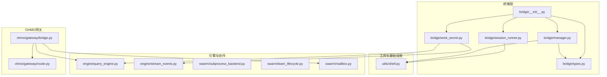
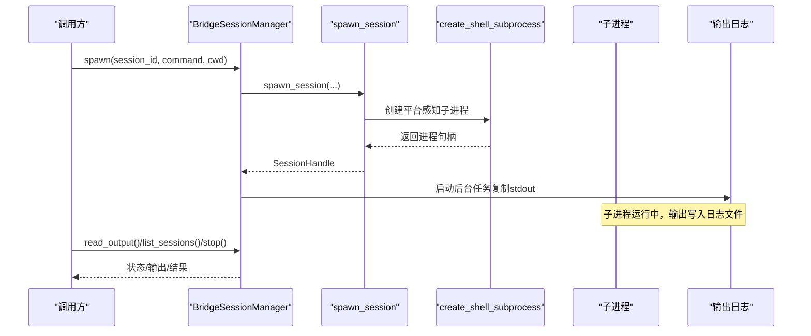
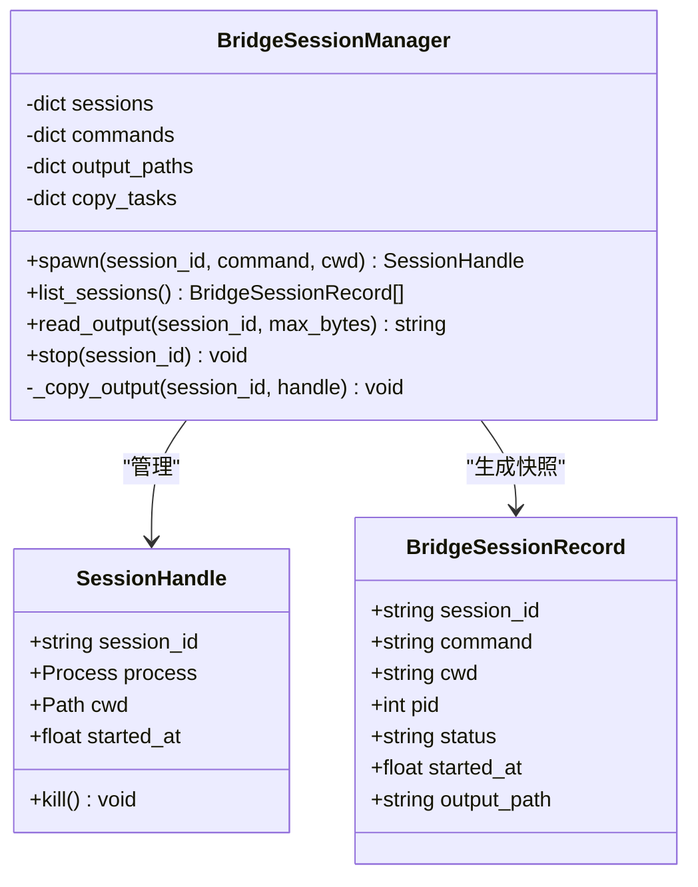
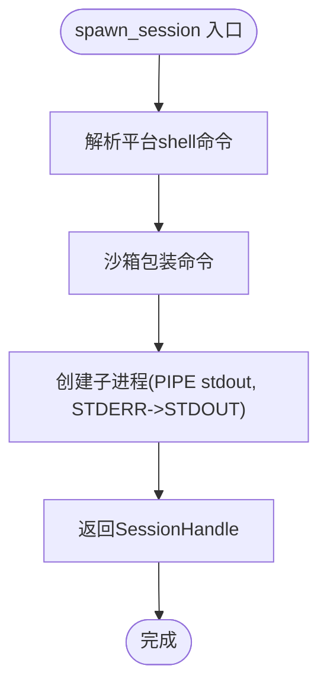
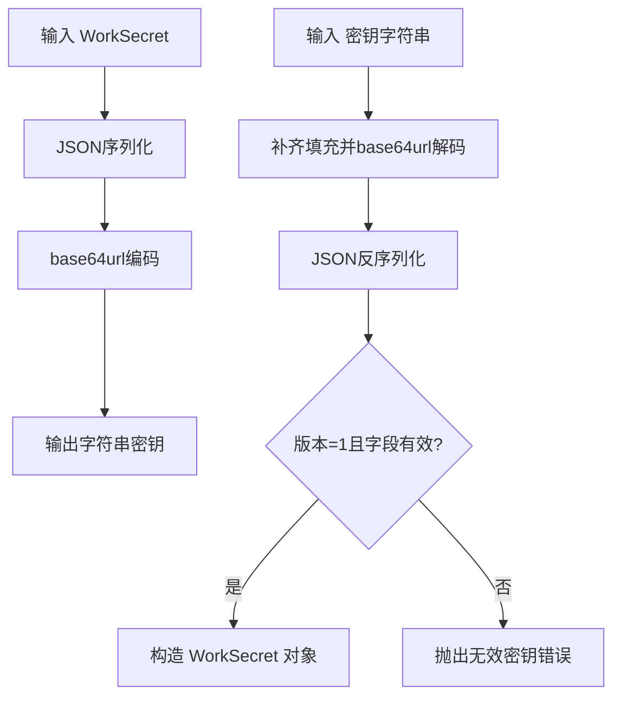
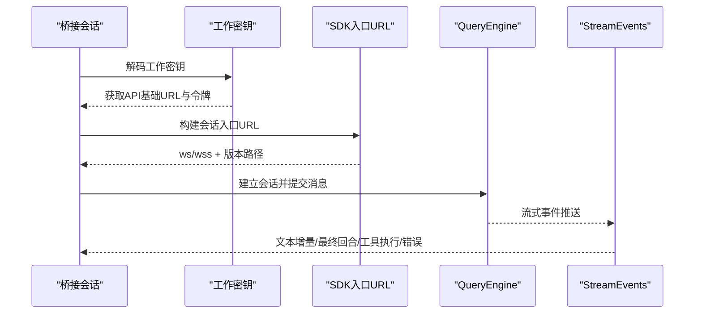
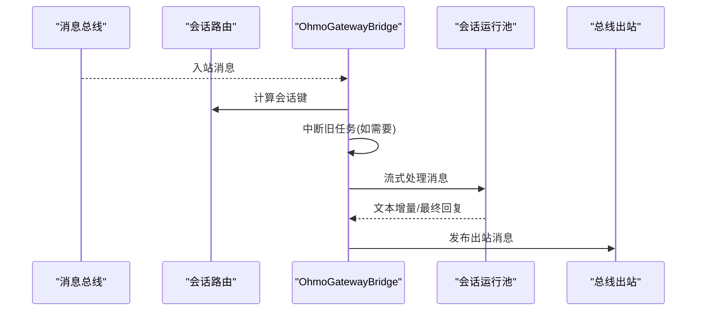
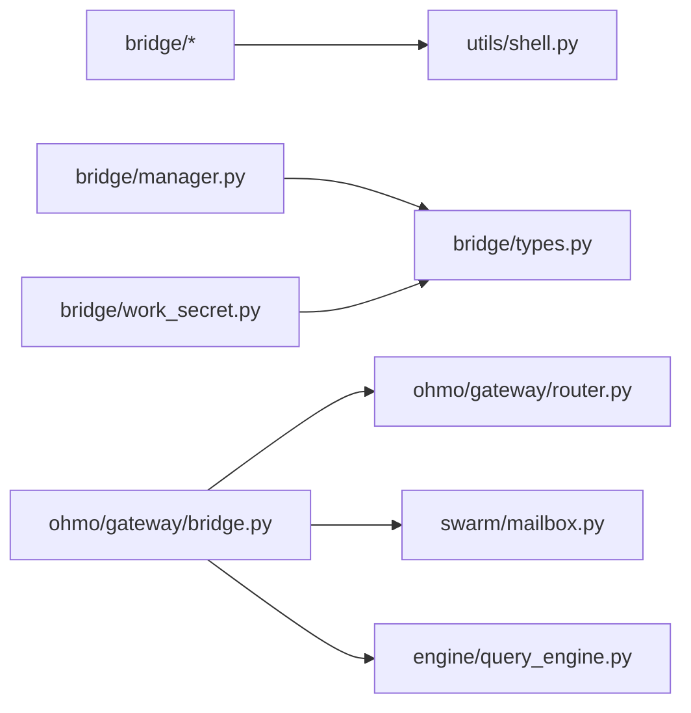

# 桥接系统

<cite>
**本文引用的文件**
- [src\openharness\bridge\__init__.py](file://src\openharness\bridge\__init__.py)
- [src\openharness\bridge\manager.py](file://src\openharness\bridge\manager.py)
- [src\openharness\bridge\session_runner.py](file://src\openharness\bridge\session_runner.py)
- [src\openharness\bridge\types.py](file://src\openharness\bridge\types.py)
- [src\openharness\bridge\work_secret.py](file://src\openharness\bridge\work_secret.py)
- [src\openharness\utils\shell.py](file://src\openharness\utils\shell.py)
- [src\openharness\engine\query_engine.py](file://src\openharness\engine\query_engine.py)
- [src\openharness\engine\stream_events.py](file://src\openharness\engine\stream_events.py)
- [src\openharness\swarm\subprocess_backend.py](file://src\openharness\swarm\subprocess_backend.py)
- [src\openharness\swarm\team_lifecycle.py](file://src\openharness\swarm\team_lifecycle.py)
- [src\openharness\swarm\mailbox.py](file://src\openharness\swarm\mailbox.py)
- [ohmo\gateway\bridge.py](file://ohmo\gateway\bridge.py)
- [ohmo\gateway\router.py](file://ohmo\gateway\router.py)
- [tests\test_bridge\test_core.py](file://tests\test_bridge\test_core.py)
- [tests\test_bridge\test_session_flow.py](file://tests\test_bridge\test_session_flow.py)
</cite>

## 目录
1. [简介](#简介)
2. [项目结构](#项目结构)
3. [核心组件](#核心组件)
4. [架构总览](#架构总览)
5. [详细组件分析](#详细组件分析)
6. [依赖分析](#依赖分析)
7. [性能考虑](#性能考虑)
8. [故障排查指南](#故障排查指南)
9. [结论](#结论)
10. [附录](#附录)

## 简介
本文件面向OpenHarness桥接系统，系统性阐述其架构设计、关键组件与数据流，重点覆盖以下方面：
- 桥接管理器：负责子进程桥接会话的生命周期管理、输出捕获与状态查询
- 会话运行器：以安全可控的方式启动与终止子进程，统一标准输出/错误合并策略
- 工作密钥管理：编码/解码工作密钥，构建SDK会话入口URL，保障会话接入安全
- 进程间通信：通过子进程标准流与文件系统进行轻量级通信；与通道总线、沙箱等模块协同
- 生命周期与状态同步：会话状态（运行中/已完成/失败）与输出日志的实时同步
- 安全与访问控制：工作密钥版本校验、URL协议选择（本地ws/远程wss）、最小权限原则
- 配置与使用：桥接配置项、命令行参数继承、环境变量注入
- 与主引擎集成：通过会话句柄与工作密钥驱动外部会话接入主引擎能力
- 错误处理与故障恢复：超时终止、异常格式化、任务取消与清理
- 性能优化与监控：I/O异步化、输出流复制、日志截断、会话并发限制
- 扩展与定制：新增桥接类型、自定义会话命令、工作密钥扩展

## 项目结构
桥接系统位于openharness.bridge包内，围绕“会话运行器+管理器+工作密钥”三件套展开，并与工具链中的shell辅助、沙箱、通道总线、团队协作等模块形成松耦合集成。

**图表来源**
- [src\openharness\bridge\__init__.py:1-21](file://src\openharness\bridge\__init__.py#L1-L21)
- [src\openharness\bridge\manager.py:1-107](file://src\openharness\bridge\manager.py#L1-L107)
- [src\openharness\bridge\session_runner.py:1-47](file://src\openharness\bridge\session_runner.py#L1-L47)
- [src\openharness\bridge\types.py:1-38](file://src\openharness\bridge\types.py#L1-L38)
- [src\openharness\bridge\work_secret.py:1-42](file://src\openharness\bridge\work_secret.py#L1-L42)
- [src\openharness\utils\shell.py:1-148](file://src\openharness\utils\shell.py#L1-L148)
- [src\openharness\engine\query_engine.py:1-215](file://src\openharness\engine\query_engine.py#L1-L215)
- [src\openharness\engine\stream_events.py:1-90](file://src\openharness\engine\stream_events.py#L1-L90)
- [src\openharness\swarm\subprocess_backend.py:1-172](file://src\openharness\swarm\subprocess_backend.py#L1-L172)
- [src\openharness\swarm\team_lifecycle.py:1-911](file://src\openharness\swarm\team_lifecycle.py#L1-L911)
- [src\openharness\swarm\mailbox.py:1-523](file://src\openharness\swarm\mailbox.py#L1-L523)
- [ohmo\gateway\bridge.py:1-409](file://ohmo\gateway\bridge.py#L1-L409)
- [ohmo\gateway\router.py:1-32](file://ohmo\gateway\router.py#L1-L32)

**章节来源**
- [src\openharness\bridge\__init__.py:1-21](file://src\openharness\bridge\__init__.py#L1-L21)
- [src\openharness\bridge\manager.py:1-107](file://src\openharness\bridge\manager.py#L1-L107)
- [src\openharness\bridge\session_runner.py:1-47](file://src\openharness\bridge\session_runner.py#L1-L47)
- [src\openharness\bridge\types.py:1-38](file://src\openharness\bridge\types.py#L1-L38)
- [src\openharness\bridge\work_secret.py:1-42](file://src\openharness\bridge\work_secret.py#L1-L42)
- [src\openharness\utils\shell.py:1-148](file://src\openharness\utils\shell.py#L1-L148)
- [src\openharness\engine\query_engine.py:1-215](file://src\openharness\engine\query_engine.py#L1-L215)
- [src\openharness\engine\stream_events.py:1-90](file://src\openharness\engine\stream_events.py#L1-L90)
- [src\openharness\swarm\subprocess_backend.py:1-172](file://src\openharness\swarm\subprocess_backend.py#L1-L172)
- [src\openharness\swarm\team_lifecycle.py:1-911](file://src\openharness\swarm\team_lifecycle.py#L1-L911)
- [src\openharness\swarm\mailbox.py:1-523](file://src\openharness\swarm\mailbox.py#L1-L523)
- [ohmo\gateway\bridge.py:1-409](file://ohmo\gateway\bridge.py#L1-L409)
- [ohmo\gateway\router.py:1-32](file://ohmo\gateway\router.py#L1-L32)

## 核心组件
- 桥接会话记录与管理
  - BridgeSessionRecord：UI友好的会话快照，包含会话ID、命令、工作目录、PID、状态、启动时间、输出路径
  - BridgeSessionManager：集中管理子进程会话，提供spawn/list/read_output/stop等能力；后台异步复制子进程stdout到持久化日志文件
- 会话运行器
  - SessionHandle：封装子进程句柄、工作目录、启动时间；提供kill优雅终止（带超时回退）
  - spawn_session：通过平台感知的shell与沙箱包装创建子进程，统一将stderr合并至stdout
- 类型与配置
  - WorkData：工作项元数据（会话/健康检查）
  - WorkSecret：工作密钥（版本、会话入口令牌、API基础URL）
  - BridgeConfig：桥接配置（目录、机器名、最大会话数、详细模式、会话超时）
- 工作密钥与SDK URL
  - encode_work_secret/decode_work_secret：base64url编码/解码与字段校验
  - build_sdk_url：根据API基础URL自动选择ws/wss与版本路径

**章节来源**
- [src\openharness\bridge\manager.py:13-107](file://src\openharness\bridge\manager.py#L13-L107)
- [src\openharness\bridge\session_runner.py:13-47](file://src\openharness\bridge\session_runner.py#L13-L47)
- [src\openharness\bridge\types.py:12-38](file://src\openharness\bridge\types.py#L12-L38)
- [src\openharness\bridge\work_secret.py:11-42](file://src\openharness\bridge\work_secret.py#L11-L42)

## 架构总览
桥接系统通过“会话运行器”在独立子进程中执行外部命令，同时由“桥接管理器”负责生命周期与输出采集；“工作密钥”用于生成会话入口URL，使外部会话可被主引擎识别与接入。OHMO网关可将通道总线的消息路由到会话运行器或主引擎，实现跨渠道的统一会话管理。

**图表来源**
- [src\openharness\bridge\manager.py:35-94](file://src\openharness\bridge\manager.py#L35-L94)
- [src\openharness\bridge\session_runner.py:32-46](file://src\openharness\bridge\session_runner.py#L32-L46)
- [src\openharness\utils\shell.py:51-105](file://src\openharness\utils\shell.py#L51-L105)

## 详细组件分析

### 组件A：桥接会话管理器
职责与行为
- spawn：创建会话、记录命令与输出路径、启动异步复制任务
- list_sessions：聚合会话状态（运行中/已完成/失败），按启动时间倒序
- read_output：读取输出日志，支持最大字节截断
- stop：通过SessionHandle终止子进程，超时后强制kill

**图表来源**
- [src\openharness\bridge\manager.py:13-107](file://src\openharness\bridge\manager.py#L13-L107)
- [src\openharness\bridge\session_runner.py:13-30](file://src\openharness\bridge\session_runner.py#L13-L30)

**章节来源**
- [src\openharness\bridge\manager.py:26-107](file://src\openharness\bridge\manager.py#L26-L107)

### 组件B：会话运行器
职责与行为
- SessionHandle：封装子进程生命周期，提供超时安全的终止逻辑
- spawn_session：解析平台shell、注入沙箱包装、创建子进程并将stderr合并到stdout

**图表来源**
- [src\openharness\bridge\session_runner.py:32-46](file://src\openharness\bridge\session_runner.py#L32-L46)
- [src\openharness\utils\shell.py:51-105](file://src\openharness\utils\shell.py#L51-L105)

**章节来源**
- [src\openharness\bridge\session_runner.py:1-47](file://src\openharness\bridge\session_runner.py#L1-L47)
- [src\openharness\utils\shell.py:1-148](file://src\openharness\utils\shell.py#L1-L148)

### 组件C：工作密钥与SDK URL
职责与行为
- encode_work_secret/decode_work_secret：base64url编码/解码，字段校验（版本、令牌、API基础URL）
- build_sdk_url：根据是否本地地址自动选择ws/wss与版本路径

**图表来源**
- [src\openharness\bridge\work_secret.py:11-32](file://src\openharness\bridge\work_secret.py#L11-L32)

**章节来源**
- [src\openharness\bridge\work_secret.py:1-42](file://src\openharness\bridge\work_secret.py#L1-L42)

### 组件D：与主引擎的集成
职责与行为
- QueryEngine：承载对话历史与工具循环，可作为桥接会话的目标运行环境
- StreamEvents：事件模型（文本增量、回合完成、工具执行、错误、状态、压缩进度）

**图表来源**
- [src\openharness\bridge\work_secret.py:35-42](file://src\openharness\bridge\work_secret.py#L35-L42)
- [src\openharness\engine\query_engine.py:147-215](file://src\openharness\engine\query_engine.py#L147-L215)
- [src\openharness\engine\stream_events.py:12-90](file://src\openharness\engine\stream_events.py#L12-L90)

**章节来源**
- [src\openharness\engine\query_engine.py:1-215](file://src\openharness\engine\query_engine.py#L1-L215)
- [src\openharness\engine\stream_events.py:1-90](file://src\openharness\engine\stream_events.py#L1-L90)

### 组件E：OHMO网关桥接
职责与行为
- OhmoGatewayBridge：消费通道总线消息，按会话键路由，中断旧任务，发布更新与最终回复
- 路由策略：基于频道、聊天类型、线程ID与发送者ID生成会话键

**图表来源**
- [ohmo\gateway\bridge.py:77-323](file://ohmo\gateway\bridge.py#L77-L323)
- [ohmo\gateway\router.py:8-31](file://ohmo\gateway\router.py#L8-L31)

**章节来源**
- [ohmo\gateway\bridge.py:1-409](file://ohmo\gateway\bridge.py#L1-L409)
- [ohmo\gateway\router.py:1-32](file://ohmo\gateway\router.py#L1-L32)

## 依赖分析
- 内部依赖
  - bridge依赖utils.shell进行子进程创建与沙箱包装
  - bridge.manager依赖bridge.session_runner与config.paths生成输出目录
  - bridge.work_secret依赖bridge.types.WorkSecret
  - OHMO网关依赖channels.bus.events与queue、group_registry、gateway.runtime
- 外部依赖
  - asyncio子进程、文件锁、JSON序列化、正则表达式、时间戳
  - 平台检测（Windows/macOS/Linux）与shell选择

**图表来源**
- [src\openharness\bridge\manager.py:9-10](file://src\openharness\bridge\manager.py#L9-L10)
- [src\openharness\bridge\session_runner.py](file://src\openharness\bridge\session_runner.py#L10)
- [src\openharness\bridge\types.py:5-8](file://src\openharness\bridge\types.py#L5-L8)
- [src\openharness\bridge\work_secret.py](file://src\openharness\bridge\work_secret.py#L8)
- [ohmo\gateway\bridge.py:10-16](file://ohmo\gateway\bridge.py#L10-L16)
- [ohmo\gateway\router.py:5-6](file://ohmo\gateway\router.py#L5-L6)
- [src\openharness\swarm\mailbox.py:1-25](file://src\openharness\swarm\mailbox.py#L1-L25)
- [src\openharness\engine\query_engine.py:1-17](file://src\openharness\engine\query_engine.py#L1-L17)

**章节来源**
- [src\openharness\bridge\manager.py:1-107](file://src\openharness\bridge\manager.py#L1-L107)
- [src\openharness\bridge\session_runner.py:1-47](file://src\openharness\bridge\session_runner.py#L1-L47)
- [src\openharness\bridge\types.py:1-38](file://src\openharness\bridge\types.py#L1-L38)
- [src\openharness\bridge\work_secret.py:1-42](file://src\openharness\bridge\work_secret.py#L1-L42)
- [ohmo\gateway\bridge.py:1-409](file://ohmo\gateway\bridge.py#L1-L409)
- [ohmo\gateway\router.py:1-32](file://ohmo\gateway\router.py#L1-L32)
- [src\openharness\swarm\mailbox.py:1-523](file://src\openharness\swarm\mailbox.py#L1-L523)
- [src\openharness\engine\query_engine.py:1-215](file://src\openharness\engine\query_engine.py#L1-L215)

## 性能考虑
- 异步I/O与后台复制：管理器在后台持续从子进程stdout读取并写入文件，避免阻塞主线程
- 输出截断：read_output支持最大字节数截断，防止内存膨胀
- 并发限制：BridgeConfig提供max_sessions，限制同时运行的会话数量
- 超时终止：SessionHandle.kill在超时后回退到强制kill，确保资源回收
- 平台感知与PTY：shell工具根据平台选择最优shell与脚本包装，减少交互式终端开销

**章节来源**
- [src\openharness\bridge\manager.py:70-94](file://src\openharness\bridge\manager.py#L70-L94)
- [src\openharness\bridge\session_runner.py:22-29](file://src\openharness\bridge\session_runner.py#L22-L29)
- [src\openharness\bridge\types.py:35-38](file://src\openharness\bridge\types.py#L35-L38)
- [src\openharness\utils\shell.py:17-48](file://src\openharness\utils\shell.py#L17-L48)

## 故障排查指南
常见问题与定位
- 会话无法终止
  - 使用stop或SessionHandle.kill，若超时未退出，确认子进程是否阻塞于I/O
- 输出为空或不完整
  - 确认stderr已合并到stdout；检查输出路径是否存在与权限
- 工作密钥无效
  - 校验版本号与必需字段；确认base64url编码正确
- OHMO网关异常
  - 查看格式化错误消息；检查认证配置与订阅状态
- 会话冲突或重复
  - 检查会话键生成规则（频道/聊天类型/线程ID/发送者ID）

建议操作
- 在测试中验证工作密钥编解码与URL构建
- 使用测试用例覆盖子进程创建、输出写入与终止流程
- 结合StreamEvents观察引擎侧事件，定位工具执行与错误位置

**章节来源**
- [tests\test_bridge\test_core.py:13-62](file://tests\test_bridge\test_core.py#L13-L62)
- [tests\test_bridge\test_session_flow.py:13-33](file://tests\test_bridge\test_session_flow.py#L13-L33)
- [src\openharness\bridge\work_secret.py:17-32](file://src\openharness\bridge\work_secret.py#L17-L32)
- [ohmo\gateway\bridge.py:29-53](file://ohmo\gateway\bridge.py#L29-L53)

## 结论
OpenHarness桥接系统以“会话运行器+管理器+工作密钥”为核心，提供了轻量、可扩展、安全的跨进程会话接入方案。通过异步输出复制、平台感知的子进程创建、严格的密钥校验与URL构建策略，系统在保证稳定性的同时兼顾了易用性与可观测性。结合OHMO网关与主引擎，桥接系统能够无缝融入多渠道与多Agent协作场景。

## 附录

### 配置与使用指南
- 桥接配置
  - dir：桥接会话工作目录
  - machine_name：机器标识
  - max_sessions：最大并发会话数
  - verbose：详细日志
  - session_timeout_ms：会话超时阈值
- 使用步骤
  - 生成工作密钥并编码
  - 构建SDK会话入口URL
  - 通过spawn_session启动外部会话
  - 使用BridgeSessionManager管理生命周期与输出
  - 通过QueryEngine与StreamEvents与主引擎交互

**章节来源**
- [src\openharness\bridge\types.py:29-38](file://src\openharness\bridge\types.py#L29-L38)
- [src\openharness\bridge\work_secret.py:11-42](file://src\openharness\bridge\work_secret.py#L11-L42)
- [src\openharness\bridge\session_runner.py:32-46](file://src\openharness\bridge\session_runner.py#L32-L46)
- [src\openharness\bridge\manager.py:35-68](file://src\openharness\bridge\manager.py#L35-L68)
- [src\openharness\engine\query_engine.py:147-215](file://src\openharness\engine\query_engine.py#L147-L215)
- [src\openharness\engine\stream_events.py:12-90](file://src\openharness\engine\stream_events.py#L12-L90)

### 安全与访问控制
- 工作密钥版本与字段校验，防止越权与伪造
- 本地/远程自动选择ws/wss，降低中间人风险
- 子进程stderr合并stdout，避免信息泄露
- 会话键隔离共享聊天上下文，防止跨用户干扰

**章节来源**
- [src\openharness\bridge\work_secret.py:17-42](file://src\openharness\bridge\work_secret.py#L17-L42)
- [src\openharness\bridge\session_runner.py:39-46](file://src\openharness\bridge\session_runner.py#L39-L46)
- [ohmo\gateway\router.py:8-31](file://ohmo\gateway\router.py#L8-L31)

### 扩展与自定义开发指南
- 新增桥接类型
  - 定义新的WorkData类型与对应处理流程
  - 扩展BridgeConfig以支持新配置项
- 自定义会话命令
  - 通过spawn_session传入自定义command与cwd
  - 注入必要环境变量与CLI标志
- 工作密钥扩展
  - 在WorkSecret中增加字段并在encode/decode中处理
  - 更新build_sdk_url以适配新版本协议

**章节来源**
- [src\openharness\bridge\types.py:12-38](file://src\openharness\bridge\types.py#L12-L38)
- [src\openharness\bridge\work_secret.py:11-42](file://src\openharness\bridge\work_secret.py#L11-L42)
- [src\openharness\bridge\session_runner.py:32-46](file://src\openharness\bridge\session_runner.py#L32-L46)