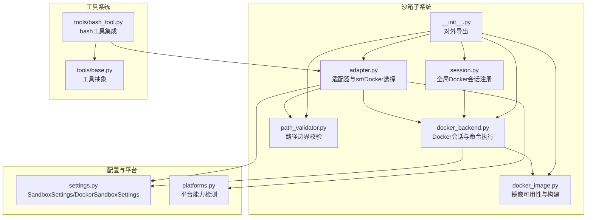
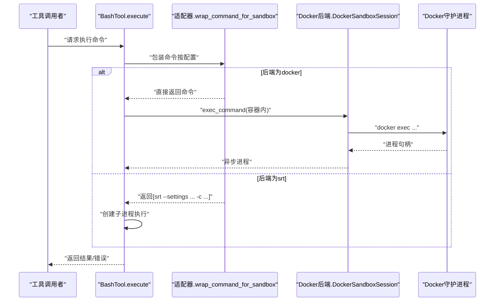
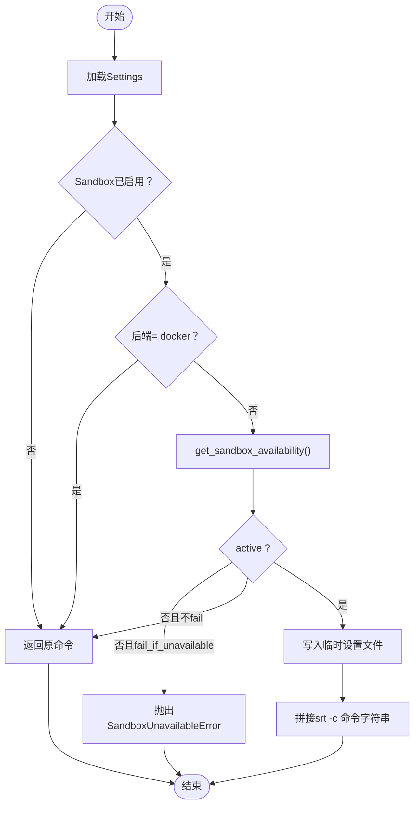
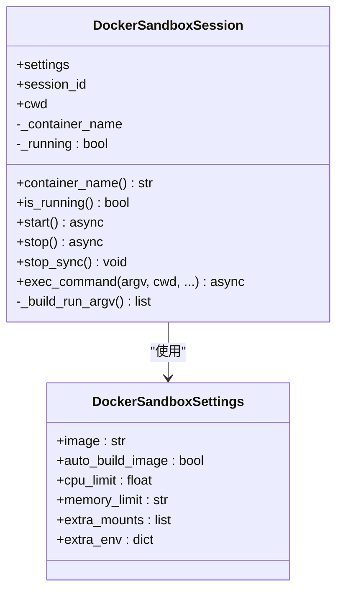
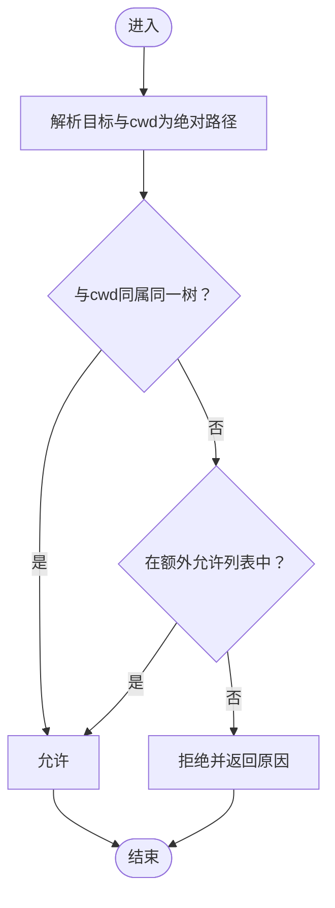
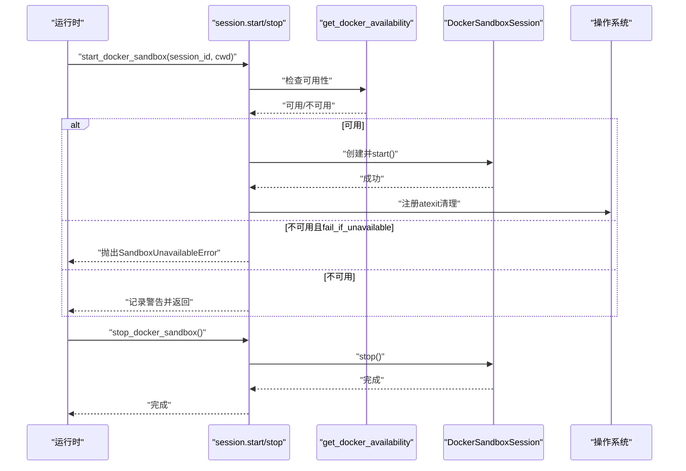
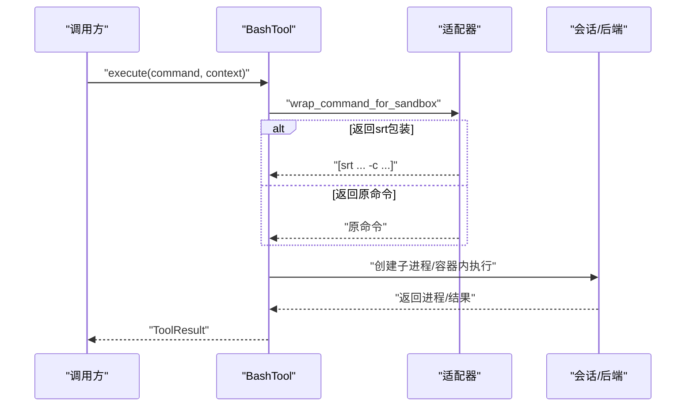
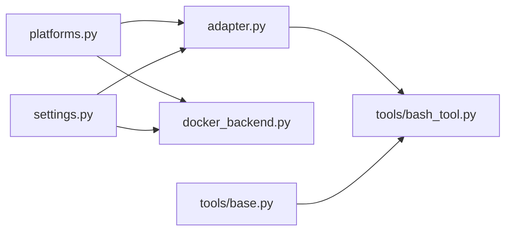

# 沙箱系统

<cite>
**本文引用的文件**
- [src/openharness/sandbox/__init__.py](file://src/openharness/sandbox/__init__.py)
- [src/openharness/sandbox/adapter.py](file://src/openharness/sandbox/adapter.py)
- [src/openharness/sandbox/docker_backend.py](file://src/openharness/sandbox/docker_backend.py)
- [src/openharness/sandbox/docker_image.py](file://src/openharness/sandbox/docker_image.py)
- [src/openharness/sandbox/path_validator.py](file://src/openharness/sandbox/path_validator.py)
- [src/openharness/sandbox/session.py](file://src/openharness/sandbox/session.py)
- [src/openharness/config/settings.py](file://src/openharness/config/settings.py)
- [src/openharness/platforms.py](file://src/openharness/platforms.py)
- [src/openharness/tools/base.py](file://src/openharness/tools/base.py)
- [src/openharness/tools/bash_tool.py](file://src/openharness/tools/bash_tool.py)
- [tests/test_sandbox/test_adapter.py](file://tests/test_sandbox/test_adapter.py)
- [tests/test_sandbox/test_docker_backend.py](file://tests/test_sandbox/test_docker_backend.py)
- [tests/test_sandbox/test_path_validator.py](file://tests/test_sandbox/test_path_validator.py)
- [tests/test_sandbox/test_docker_image.py](file://tests/test_sandbox/test_docker_image.py)
</cite>

## 目录
1. [简介](#简介)
2. [项目结构](#项目结构)
3. [核心组件](#核心组件)
4. [架构总览](#架构总览)
5. [详细组件分析](#详细组件分析)
6. [依赖分析](#依赖分析)
7. [性能考虑](#性能考虑)
8. [故障排除指南](#故障排除指南)
9. [结论](#结论)
10. [附录：配置与最佳实践](#附录配置与最佳实践)

## 简介
本文件面向OpenHarness沙箱系统，系统性阐述其架构设计与实现要点，重点覆盖：
- 沙箱适配器模式与后端抽象机制
- Docker后端的容器管理、资源限制与网络配置
- 路径验证机制（安全边界、文件系统隔离与访问控制）
- 沙箱会话生命周期管理（创建、执行、清理）
- 配置项与性能调优建议
- 与工具系统的集成方式
- 最佳实践与安全注意事项
- 故障排除与监控方法

## 项目结构
OpenHarness在src/openharness/sandbox目录下提供了完整的沙箱能力：
- 适配器层：封装srt沙箱运行时与Docker后端的统一接口
- Docker后端：基于Docker的容器化隔离执行
- 路径验证：确保文件操作在项目边界内
- 会话管理：长生命周期容器的启动、停止与清理
- 配置模型：定义沙箱网络、文件系统、Docker参数等

图表来源
- [src/openharness/sandbox/adapter.py:1-149](file://src/openharness/sandbox/adapter.py#L1-L149)
- [src/openharness/sandbox/docker_backend.py:1-233](file://src/openharness/sandbox/docker_backend.py#L1-L233)
- [src/openharness/sandbox/docker_image.py:1-104](file://src/openharness/sandbox/docker_image.py#L1-L104)
- [src/openharness/sandbox/path_validator.py:1-38](file://src/openharness/sandbox/path_validator.py#L1-L38)
- [src/openharness/sandbox/session.py:1-64](file://src/openharness/sandbox/session.py#L1-L64)
- [src/openharness/config/settings.py:70-107](file://src/openharness/config/settings.py#L70-L107)
- [src/openharness/platforms.py:14-88](file://src/openharness/platforms.py#L14-L88)
- [src/openharness/tools/base.py:17-81](file://src/openharness/tools/base.py#L17-L81)
- [src/openharness/tools/bash_tool.py:19-85](file://src/openharness/tools/bash_tool.py#L19-L85)
- [src/openharness/sandbox/__init__.py:1-34](file://src/openharness/sandbox/__init__.py#L1-L34)

章节来源
- [src/openharness/sandbox/__init__.py:1-34](file://src/openharness/sandbox/__init__.py#L1-L34)
- [src/openharness/sandbox/adapter.py:1-149](file://src/openharness/sandbox/adapter.py#L1-L149)
- [src/openharness/sandbox/docker_backend.py:1-233](file://src/openharness/sandbox/docker_backend.py#L1-L233)
- [src/openharness/sandbox/docker_image.py:1-104](file://src/openharness/sandbox/docker_image.py#L1-L104)
- [src/openharness/sandbox/path_validator.py:1-38](file://src/openharness/sandbox/path_validator.py#L1-L38)
- [src/openharness/sandbox/session.py:1-64](file://src/openharness/sandbox/session.py#L1-L64)
- [src/openharness/config/settings.py:70-107](file://src/openharness/config/settings.py#L70-L107)
- [src/openharness/platforms.py:14-88](file://src/openharness/platforms.py#L14-L88)
- [src/openharness/tools/base.py:17-81](file://src/openharness/tools/base.py#L17-L81)
- [src/openharness/tools/bash_tool.py:19-85](file://src/openharness/tools/bash_tool.py#L19-L85)

## 核心组件
- 适配器与后端选择
  - 通过环境与配置判断是否启用沙箱、后端类型（srt或docker），并生成srt设置或返回原生命令
  - 提供“失败即停”策略，保障安全边界
- Docker后端
  - 容器生命周期管理：启动、停止、异常清理
  - 命令执行：在容器内执行任意命令，支持工作目录、环境变量、标准流重定向
  - 资源限制：CPU核数、内存限制
  - 网络策略：当前Docker后端强制禁用网络，避免域级白黑名单被绕过
- 路径验证
  - 严格限制在项目根目录内；支持额外允许路径列表
  - 阻止相对路径逃逸与符号链接逃逸
- 会话管理
  - 全局单例Docker会话，进程退出时自动清理
  - 提供查询活跃状态、启动/停止接口
- 配置模型
  - SandboxSettings：开关、后端、失败策略、平台白名单、网络/文件系统规则、Docker参数
  - DockerSandboxSettings：镜像名、自动构建、CPU/内存、挂载与环境变量

章节来源
- [src/openharness/sandbox/adapter.py:36-131](file://src/openharness/sandbox/adapter.py#L36-L131)
- [src/openharness/sandbox/docker_backend.py:19-233](file://src/openharness/sandbox/docker_backend.py#L19-L233)
- [src/openharness/sandbox/docker_image.py:29-104](file://src/openharness/sandbox/docker_image.py#L29-L104)
- [src/openharness/sandbox/path_validator.py:8-38](file://src/openharness/sandbox/path_validator.py#L8-L38)
- [src/openharness/sandbox/session.py:19-64](file://src/openharness/sandbox/session.py#L19-L64)
- [src/openharness/config/settings.py:70-107](file://src/openharness/config/settings.py#L70-L107)
- [src/openharness/config/settings.py:86-95](file://src/openharness/config/settings.py#L86-L95)

## 架构总览
OpenHarness采用“适配器+后端抽象”的分层设计：
- 适配器层负责根据平台能力与配置决定使用srt沙箱运行时还是Docker后端，并在必要时注入安全设置文件
- Docker后端负责容器生命周期与命令执行，结合配置进行资源限制与挂载
- 工具系统通过统一的shell执行入口集成沙箱，遇到沙箱不可用时返回错误结果

图表来源
- [src/openharness/tools/bash_tool.py:34-85](file://src/openharness/tools/bash_tool.py#L34-L85)
- [src/openharness/sandbox/adapter.py:105-131](file://src/openharness/sandbox/adapter.py#L105-L131)
- [src/openharness/sandbox/docker_backend.py:198-233](file://src/openharness/sandbox/docker_backend.py#L198-L233)

章节来源
- [src/openharness/tools/bash_tool.py:34-85](file://src/openharness/tools/bash_tool.py#L34-L85)
- [src/openharness/sandbox/adapter.py:105-131](file://src/openharness/sandbox/adapter.py#L105-L131)
- [src/openharness/sandbox/docker_backend.py:198-233](file://src/openharness/sandbox/docker_backend.py#L198-L233)

## 详细组件分析

### 组件A：适配器与后端抽象
- 功能要点
  - SandboxAvailability：统一表示“是否启用、是否可用、原因、命令”
  - build_sandbox_runtime_config：将Settings映射为srt设置payload
  - get_sandbox_availability：综合平台能力、配置与可执行文件判定可用性
  - wrap_command_for_sandbox：当后端为docker时透传命令；否则返回srt包装后的命令与临时设置文件路径
- 设计模式
  - 适配器模式：屏蔽srt与Docker差异，向上层提供一致的命令包装接口
  - 失败即停策略：fail_if_unavailable为真时，不可用则抛错
- 关键流程

图表来源
- [src/openharness/sandbox/adapter.py:52-131](file://src/openharness/sandbox/adapter.py#L52-L131)

章节来源
- [src/openharness/sandbox/adapter.py:21-131](file://src/openharness/sandbox/adapter.py#L21-L131)
- [tests/test_sandbox/test_adapter.py:23-103](file://tests/test_sandbox/test_adapter.py#L23-L103)

### 组件B：Docker后端
- DockerSandboxSession
  - 容器命名：以会话ID命名，便于识别与清理
  - 启动参数构建：禁用网络、绑定挂载项目目录、设置工作目录、资源限制、额外挂载与环境变量
  - 命令执行：docker exec，支持cwd与env注入
  - 停止策略：超时与异常处理，最终置状态为未运行
- get_docker_availability
  - 检查开关、后端类型、平台支持、docker命令与daemon状态
- 镜像管理
  - ensure_image_available：存在则返回；不存在且允许自动构建则构建默认镜像
  - 默认镜像包含常用工具与非root用户

图表来源
- [src/openharness/sandbox/docker_backend.py:61-233](file://src/openharness/sandbox/docker_backend.py#L61-L233)
- [src/openharness/config/settings.py:86-95](file://src/openharness/config/settings.py#L86-L95)

章节来源
- [src/openharness/sandbox/docker_backend.py:19-233](file://src/openharness/sandbox/docker_backend.py#L19-L233)
- [src/openharness/sandbox/docker_image.py:29-104](file://src/openharness/sandbox/docker_image.py#L29-L104)
- [tests/test_sandbox/test_docker_backend.py:28-95](file://tests/test_sandbox/test_docker_backend.py#L28-L95)
- [tests/test_sandbox/test_docker_backend.py:102-195](file://tests/test_sandbox/test_docker_backend.py#L102-L195)
- [tests/test_sandbox/test_docker_backend.py:217-262](file://tests/test_sandbox/test_docker_backend.py#L217-L262)
- [tests/test_sandbox/test_docker_backend.py:269-294](file://tests/test_sandbox/test_docker_backend.py#L269-L294)
- [tests/test_sandbox/test_docker_image.py:23-93](file://tests/test_sandbox/test_docker_image.py#L23-L93)

### 组件C：路径验证机制
- 核心逻辑
  - 优先检查目标路径是否位于项目目录（解析绝对路径与相对路径）
  - 支持额外允许路径列表（支持~展开与绝对路径）
  - 对..逃逸与符号链接逃逸进行阻断
- 使用场景
  - 文件读写、glob匹配等文件系统操作前的安全前置检查
- 测试覆盖
  - 项目内路径允许、越界阻断、..逃逸阻断、符号链接阻断、额外允许路径、家目录阻断

图表来源
- [src/openharness/sandbox/path_validator.py:8-38](file://src/openharness/sandbox/path_validator.py#L8-L38)

章节来源
- [src/openharness/sandbox/path_validator.py:8-38](file://src/openharness/sandbox/path_validator.py#L8-L38)
- [tests/test_sandbox/test_path_validator.py:10-90](file://tests/test_sandbox/test_path_validator.py#L10-L90)

### 组件D：会话生命周期管理
- 全局会话
  - _active_session：记录当前Docker会话
  - is_docker_sandbox_active：查询活跃状态
- 启动流程
  - get_docker_availability：判定可用性
  - 可用则创建DockerSandboxSession并start，注册atexit清理
- 停止流程
  - stop_docker_sandbox：异步停止并清空全局引用

图表来源
- [src/openharness/sandbox/session.py:29-64](file://src/openharness/sandbox/session.py#L29-L64)
- [src/openharness/sandbox/docker_backend.py:130-181](file://src/openharness/sandbox/docker_backend.py#L130-L181)

章节来源
- [src/openharness/sandbox/session.py:19-64](file://src/openharness/sandbox/session.py#L19-L64)
- [src/openharness/sandbox/docker_backend.py:130-181](file://src/openharness/sandbox/docker_backend.py#L130-L181)

### 组件E：与工具系统的集成
- BashTool
  - 通过create_shell_subprocess执行命令，支持超时、输出截取、交互式命令预检
  - 捕获SandboxUnavailableError并转换为ToolResult
- 工具上下文
  - ToolExecutionContext提供cwd与元数据，便于工具按需使用沙箱

图表来源
- [src/openharness/tools/bash_tool.py:34-85](file://src/openharness/tools/bash_tool.py#L34-L85)
- [src/openharness/sandbox/adapter.py:105-131](file://src/openharness/sandbox/adapter.py#L105-L131)
- [src/openharness/tools/base.py:17-50](file://src/openharness/tools/base.py#L17-L50)

章节来源
- [src/openharness/tools/bash_tool.py:34-85](file://src/openharness/tools/bash_tool.py#L34-L85)
- [src/openharness/tools/base.py:17-50](file://src/openharness/tools/base.py#L17-L50)

## 依赖分析
- 平台能力
  - platforms模块提供平台名称与能力矩阵，影响srt与Docker后端的可用性判断
- 配置模型
  - settings模块中的SandboxSettings与DockerSandboxSettings为沙箱行为提供配置依据
- 工具系统
  - tools模块提供统一的工具抽象，BashTool作为典型示例集成沙箱

图表来源
- [src/openharness/platforms.py:55-88](file://src/openharness/platforms.py#L55-L88)
- [src/openharness/sandbox/adapter.py:52-102](file://src/openharness/sandbox/adapter.py#L52-L102)
- [src/openharness/sandbox/docker_backend.py:19-58](file://src/openharness/sandbox/docker_backend.py#L19-L58)
- [src/openharness/config/settings.py:70-107](file://src/openharness/config/settings.py#L70-L107)
- [src/openharness/tools/bash_tool.py:34-85](file://src/openharness/tools/bash_tool.py#L34-L85)
- [src/openharness/tools/base.py:17-50](file://src/openharness/tools/base.py#L17-L50)

章节来源
- [src/openharness/platforms.py:55-88](file://src/openharness/platforms.py#L55-L88)
- [src/openharness/config/settings.py:70-107](file://src/openharness/config/settings.py#L70-L107)
- [src/openharness/tools/bash_tool.py:34-85](file://src/openharness/tools/bash_tool.py#L34-L85)

## 性能考虑
- 容器启动开销
  - 首次启动需要拉取/构建镜像，可通过提前构建镜像与复用会话降低延迟
- 资源限制
  - CPU与内存限制应结合任务特征合理设置，避免过度限制导致任务失败或资源浪费
- 网络策略
  - Docker后端当前强制禁用网络，若业务需要网络访问，请评估srt后端的域级白名单策略或迁移至更严格的隔离方案
- I/O与挂载
  - 仅绑定项目目录，减少不必要的挂载，避免磁盘IO瓶颈
- 超时与输出
  - 工具侧对长时间运行命令设置超时与输出截取，防止阻塞与内存占用过高

## 故障排除指南
- srt后端不可用
  - 检查平台能力与srt/bwrap/sandbox-exec安装情况；必要时切换到Docker后端或修复本地环境
- Docker后端不可用
  - 检查docker命令是否存在、daemon是否运行；确认平台支持Docker沙箱
  - 若镜像缺失且auto_build_image为false，将导致启动失败
- 命令执行失败
  - Docker后端：确认容器处于运行状态；检查工作目录与环境变量；查看容器日志
  - srt后端：检查临时设置文件是否正确写入；确认命令字符串被正确转义
- 路径访问被拒
  - 确认目标路径在项目根目录内；如确需访问其他路径，配置额外允许路径列表
- 进程异常退出
  - 会话注册了atexit清理，但建议在上层流程中显式调用停止接口，确保资源回收

章节来源
- [src/openharness/sandbox/adapter.py:52-102](file://src/openharness/sandbox/adapter.py#L52-L102)
- [src/openharness/sandbox/docker_backend.py:19-58](file://src/openharness/sandbox/docker_backend.py#L19-L58)
- [src/openharness/sandbox/docker_backend.py:130-158](file://src/openharness/sandbox/docker_backend.py#L130-L158)
- [src/openharness/sandbox/docker_image.py:93-104](file://src/openharness/sandbox/docker_image.py#L93-L104)
- [src/openharness/sandbox/path_validator.py:8-38](file://src/openharness/sandbox/path_validator.py#L8-L38)
- [src/openharness/sandbox/session.py:54-64](file://src/openharness/sandbox/session.py#L54-L64)

## 结论
OpenHarness沙箱系统通过适配器与后端抽象实现了灵活的隔离执行能力。Docker后端提供强隔离与可控的资源限制，srt后端提供细粒度的网络与文件系统策略。配合严格的路径验证与会话生命周期管理，系统在保证安全性的同时兼顾易用性。建议在生产环境中优先启用失败即停策略，并结合实际负载合理配置资源限制与镜像构建策略。

## 附录：配置与最佳实践
- 配置项
  - SandboxSettings
    - enabled：是否启用沙箱
    - backend：后端类型（默认srt）
    - fail_if_unavailable：不可用时是否抛错
    - enabled_platforms：允许启用沙箱的平台列表
    - network：allowed_domains/denied_domains
    - filesystem：allow_read/deny_read/allow_write/deny_write
    - docker：image/auto_build_image/cpu_limit/memory_limit/extra_mounts/extra_env
  - DockerSandboxSettings
    - image：默认镜像名
    - auto_build_image：镜像不存在时是否自动构建
    - cpu_limit：CPU核数上限
    - memory_limit：内存上限
    - extra_mounts：额外挂载（格式为宿主:容器）
    - extra_env：额外环境变量
- 最佳实践
  - 开发阶段：启用srt后端，利用域级白名单与文件系统规则
  - 生产阶段：启用Docker后端，严格设置资源限制，预构建镜像，避免首次启动延迟
  - 安全边界：仅允许项目目录访问，必要时添加额外允许路径；避免符号链接与..逃逸
  - 生命周期：在上层流程中显式启动/停止会话，避免孤儿容器
  - 监控与日志：记录容器启动/停止事件与命令执行结果，便于审计与排障

章节来源
- [src/openharness/config/settings.py:70-107](file://src/openharness/config/settings.py#L70-L107)
- [src/openharness/config/settings.py:86-95](file://src/openharness/config/settings.py#L86-L95)
- [src/openharness/sandbox/docker_backend.py:82-128](file://src/openharness/sandbox/docker_backend.py#L82-L128)
- [src/openharness/sandbox/docker_image.py:24-27](file://src/openharness/sandbox/docker_image.py#L24-L27)