# 测试开发指南

<cite>
**本文档引用的文件**
- [README.md](file://README.md)
- [CONTRIBUTING.md](file://CONTRIBUTING.md)
- [pyproject.toml](file://pyproject.toml)
- [tests/conftest.py](file://tests/conftest.py)
- [tests/fixtures/fake_mcp_server.py](file://tests/fixtures/fake_mcp_server.py)
- [tests/test_api/test_client.py](file://tests/test_api/test_client.py)
- [tests/test_sandbox/test_docker_backend.py](file://tests/test_sandbox/test_docker_backend.py)
- [tests/test_swarm/test_registry.py](file://tests/test_swarm/test_registry.py)
- [tests/test_untested_features.py](file://tests/test_untested_features.py)
- [scripts/test_harness_features.py](file://scripts/test_harness_features.py)
- [scripts/test_real_skills_plugins.py](file://scripts/test_real_skills_plugins.py)
</cite>

## 目录
1. [简介](#简介)
2. [项目结构](#项目结构)
3. [核心组件](#核心组件)
4. [架构总览](#架构总览)
5. [详细组件分析](#详细组件分析)
6. [依赖分析](#依赖分析)
7. [性能考虑](#性能考虑)
8. [故障排除指南](#故障排除指南)
9. [结论](#结论)
10. [附录](#附录)

## 简介
本指南面向在 OpenHarness 项目中编写与维护测试的开发者，提供从零开始编写新测试的完整流程：测试文件创建、测试函数编写、断言编写；测试数据准备与管理（含测试夹具）；测试覆盖率测量与提升策略；异步测试调试与错误定位；测试重构与依赖管理最佳实践；为新功能编写相应测试用例的方法；以及测试文档与报告生成的指导。本指南结合仓库中的现有测试模式与脚本，帮助你快速上手并保持高质量的测试体系。

## 项目结构
OpenHarness 的测试体系由以下部分组成：
- 单元与集成测试：位于 tests/ 下，按模块分层组织，如 tests/test_api、tests/test_sandbox、tests/test_swarm 等。
- 共享夹具与配置：tests/conftest.py 提供全局异步夹具；tests/fixtures/ 存放专用夹具（如 MCP 服务器）。
- 端到端与特性测试：scripts/ 下包含多套独立的 E2E 脚本，用于真实环境验证（如真实技能/插件、沙箱、特性验证等）。
- 测试运行配置：pyproject.toml 中定义了 pytest 运行参数（如 asyncio_mode），确保异步测试正确执行。

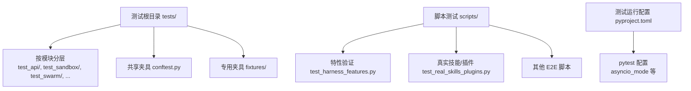

**图表来源**
- [pyproject.toml:75-78](file://pyproject.toml#L75-L78)
- [tests/conftest.py:1-14](file://tests/conftest.py#L1-L14)

**章节来源**
- [README.md:705-722](file://README.md#L705-L722)
- [pyproject.toml:75-78](file://pyproject.toml#L75-L78)

## 核心组件
- 全局异步夹具：tests/conftest.py 提供 autouse 的异步夹具，在每个测试后自动清理后台任务管理器，避免状态泄漏。
- 测试夹具：tests/fixtures/fake_mcp_server.py 提供一个轻量级 MCP stdio 服务器，用于集成测试中模拟外部服务。
- 模块化单元测试：以 tests/test_api/test_client.py、tests/test_sandbox/test_docker_backend.py、tests/test_swarm/test_registry.py 为代表，展示如何针对具体模块编写断言明确、可复现的单元测试。
- 特性与 E2E 脚本：scripts/test_harness_features.py 与 scripts/test_real_skills_plugins.py 展示了如何通过真实模型调用与外部资源验证系统行为。

**章节来源**
- [tests/conftest.py:10-14](file://tests/conftest.py#L10-L14)
- [tests/fixtures/fake_mcp_server.py:1-22](file://tests/fixtures/fake_mcp_server.py#L1-L22)
- [tests/test_api/test_client.py:1-194](file://tests/test_api/test_client.py#L1-L194)
- [tests/test_sandbox/test_docker_backend.py:1-200](file://tests/test_sandbox/test_docker_backend.py#L1-L200)
- [tests/test_swarm/test_registry.py:1-115](file://tests/test_swarm/test_registry.py#L1-L115)
- [scripts/test_harness_features.py:1-240](file://scripts/test_harness_features.py#L1-L240)
- [scripts/test_real_skills_plugins.py:1-200](file://scripts/test_real_skills_plugins.py#L1-L200)

## 架构总览
下图展示了测试运行的整体流程：pytest 发现测试、加载夹具、执行测试函数、收集结果，并通过脚本测试进行端到端验证。

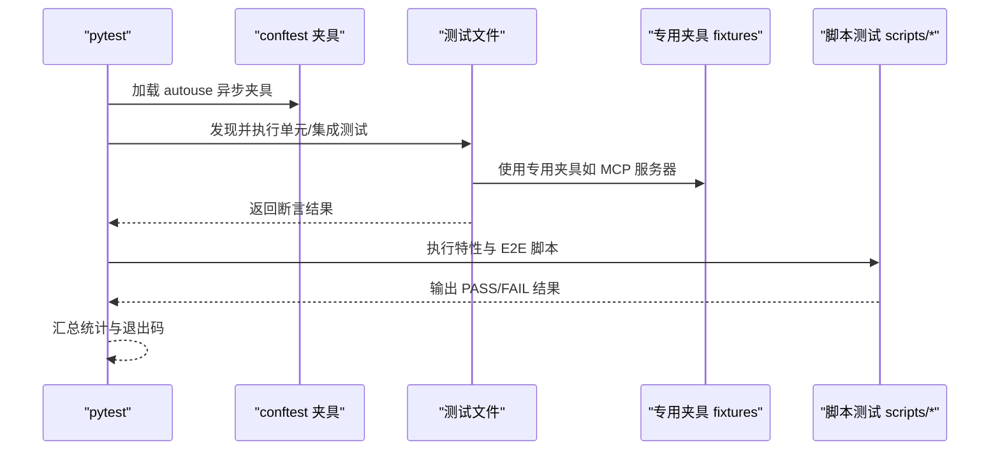

**图表来源**
- [tests/conftest.py:10-14](file://tests/conftest.py#L10-L14)
- [tests/fixtures/fake_mcp_server.py:1-22](file://tests/fixtures/fake_mcp_server.py#L1-L22)
- [scripts/test_harness_features.py:205-239](file://scripts/test_harness_features.py#L205-L239)

## 详细组件分析

### 组件一：全局异步夹具与后台任务清理
- 目标：确保每个异步测试结束后清理后台任务管理器，避免跨测试干扰。
- 关键点：
  - 使用 pytest-asyncio 的 autouse 夹具。
  - 在 yield 后执行清理逻辑，保证无论测试成功或失败都会执行。

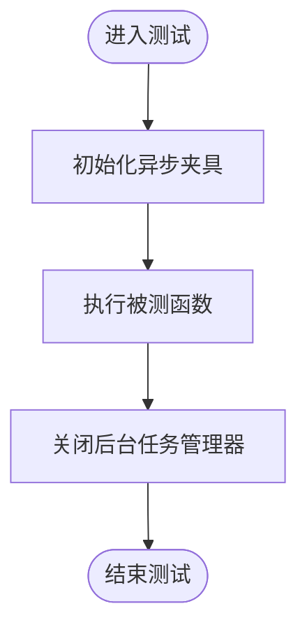

**图表来源**
- [tests/conftest.py:10-14](file://tests/conftest.py#L10-L14)

**章节来源**
- [tests/conftest.py:10-14](file://tests/conftest.py#L10-L14)

### 组件二：专用夹具（MCP 服务器）
- 目标：为需要外部服务交互的集成测试提供稳定、可控的模拟环境。
- 关键点：
  - 使用 FastMCP 创建最小可用 MCP 服务器。
  - 提供工具与资源接口，便于测试工具链与 MCP 客户端交互。
  - 可直接作为 stdio 服务器运行，供测试脚本或工具调用。

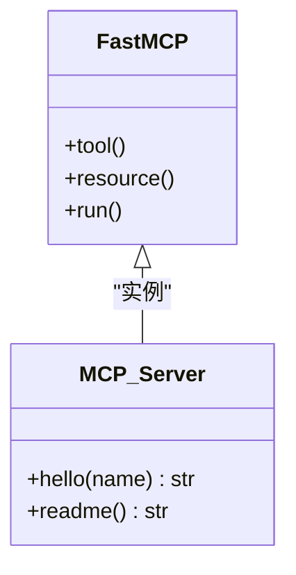

**图表来源**
- [tests/fixtures/fake_mcp_server.py:5-22](file://tests/fixtures/fake_mcp_server.py#L5-L22)

**章节来源**
- [tests/fixtures/fake_mcp_server.py:1-22](file://tests/fixtures/fake_mcp_server.py#L1-L22)

### 组件三：API 客户端测试（单元/集成）
- 目标：验证客户端初始化、请求头注入、消息流处理与令牌刷新等行为。
- 关键点：
  - 使用 monkeypatch 注入假实现，隔离外部依赖。
  - 断言请求参数、默认头、会话标识与系统提示头等细节。
  - 验证消息流返回结构与使用统计字段。

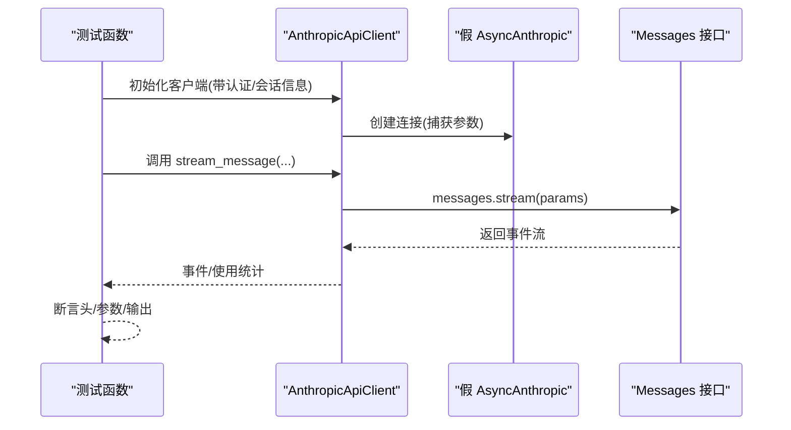

**图表来源**
- [tests/test_api/test_client.py:7-194](file://tests/test_api/test_client.py#L7-L194)

**章节来源**
- [tests/test_api/test_client.py:1-194](file://tests/test_api/test_client.py#L1-L194)

### 组件四：沙箱后端测试（Docker）
- 目标：验证沙箱可用性检测、容器启动参数构建、网络与资源限制等行为。
- 关键点：
  - 通过 monkeypatch 模拟平台与命令查找，覆盖“未安装”“守护进程未运行”“不支持平台”等场景。
  - 断言构建的命令行参数包含预期标志（如 --rm、--name、--network none 等）。
  - 验证资源限制参数是否按配置注入。

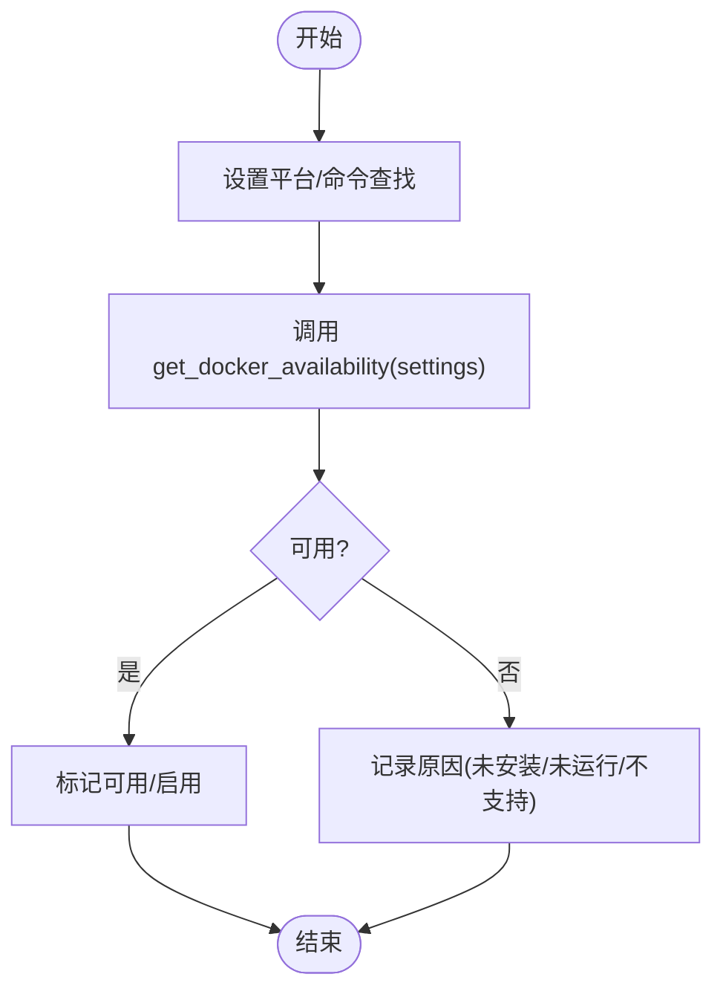

**图表来源**
- [tests/test_sandbox/test_docker_backend.py:28-95](file://tests/test_sandbox/test_docker_backend.py#L28-L95)

**章节来源**
- [tests/test_sandbox/test_docker_backend.py:1-200](file://tests/test_sandbox/test_docker_backend.py#L1-L200)

### 组件五：多智能体注册表测试
- 目标：验证后端注册表的可用后端枚举、自动检测、自定义注册与执行器获取。
- 关键点：
  - 断言默认可用后端包含 subprocess 与 in_process。
  - 自动检测在非 tmux 环境下返回 subprocess，并缓存结果。
  - 支持注册自定义执行器并能按类型获取。

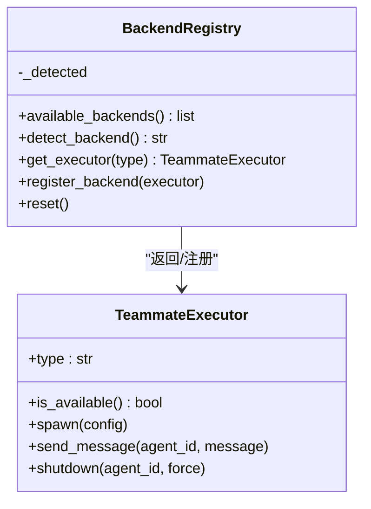

**图表来源**
- [tests/test_swarm/test_registry.py:16-115](file://tests/test_swarm/test_registry.py#L16-L115)

**章节来源**
- [tests/test_swarm/test_registry.py:1-115](file://tests/test_swarm/test_registry.py#L1-L115)

### 组件六：未测试功能综合测试（集成）
- 目标：对尚未被单元测试覆盖的功能进行集成验证，涵盖钩子、技能、插件、内存、会话存储、配置、命令、Web 抓取、工作树、MCP 类型、路径等。
- 关键点：
  - 使用临时目录与路径替换，隔离真实环境影响。
  - 通过真实模型调用与外部工具验证端到端行为。
  - 采用统一的结果收集与打印机制，便于问题定位。

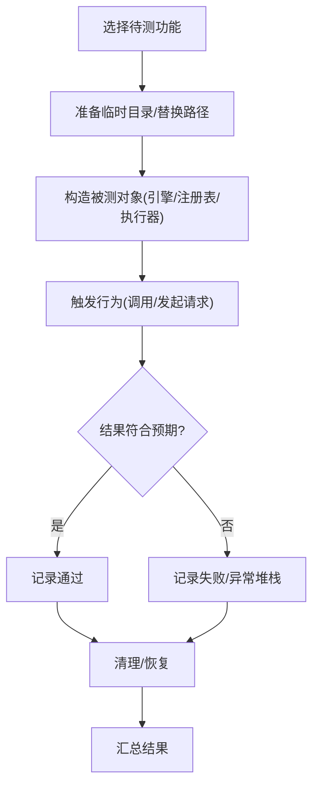

**图表来源**
- [tests/test_untested_features.py:88-100](file://tests/test_untested_features.py#L88-L100)
- [tests/test_untested_features.py:340-388](file://tests/test_untested_features.py#L340-L388)

**章节来源**
- [tests/test_untested_features.py:1-842](file://tests/test_untested_features.py#L1-L842)

### 组件七：特性验证脚本（E2E）
- 目标：通过真实模型调用与系统行为验证，覆盖重试、技能、并行工具、路径权限等关键特性。
- 关键点：
  - 以 asyncio.run 执行各测试协程，统一输出 PASS/FAIL。
  - 通过子进程调用 openharness CLI，验证真实运行路径。
  - 对关键代码路径（如并行执行）进行源码检查。

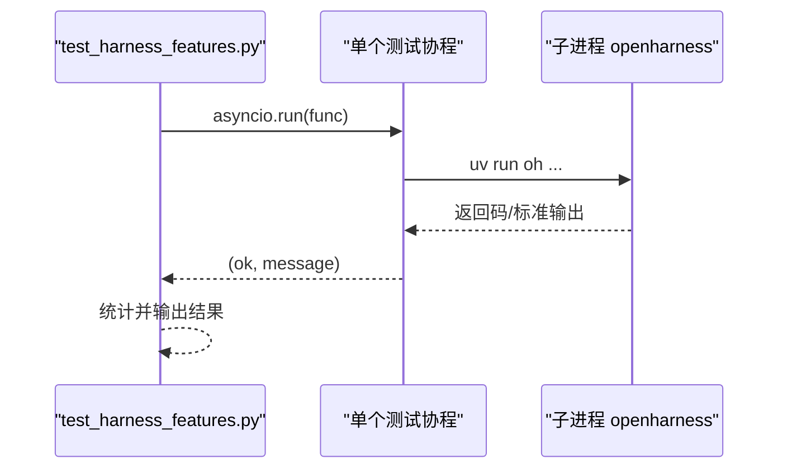

**图表来源**
- [scripts/test_harness_features.py:205-239](file://scripts/test_harness_features.py#L205-L239)
- [scripts/test_harness_features.py:125-137](file://scripts/test_harness_features.py#L125-L137)

**章节来源**
- [scripts/test_harness_features.py:1-240](file://scripts/test_harness_features.py#L1-L240)

### 组件八：真实技能与插件测试（E2E）
- 目标：验证真实技能与插件的加载、内容质量、系统提示注入与模型实际使用能力。
- 关键点：
  - 将外部仓库的 SKILL.md 或 plugin.json 复制到用户目录，再由加载器解析。
  - 断言技能数量、描述长度、内容长度与系统提示中技能列表的存在性。
  - 通过 CLI 调用验证模型对真实技能主题的响应。

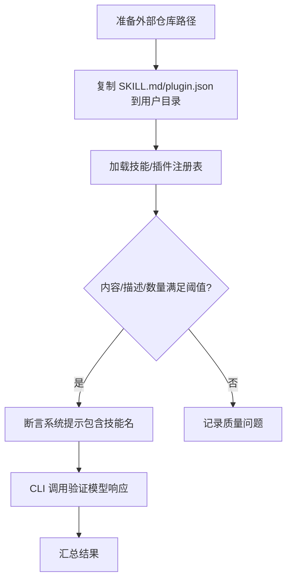

**图表来源**
- [scripts/test_real_skills_plugins.py:49-109](file://scripts/test_real_skills_plugins.py#L49-L109)
- [scripts/test_real_skills_plugins.py:154-166](file://scripts/test_real_skills_plugins.py#L154-L166)

**章节来源**
- [scripts/test_real_skills_plugins.py:1-200](file://scripts/test_real_skills_plugins.py#L1-L200)

## 依赖分析
- 测试框架与异步支持：pytest 与 pytest-asyncio 提供测试发现与异步测试执行。
- 开发依赖：ruff（代码规范）、mypy（类型检查）与 pytest-cov（覆盖率）等。
- 运行时配置：pyproject.toml 中的 testpaths 与 asyncio_mode 确保测试按预期运行。

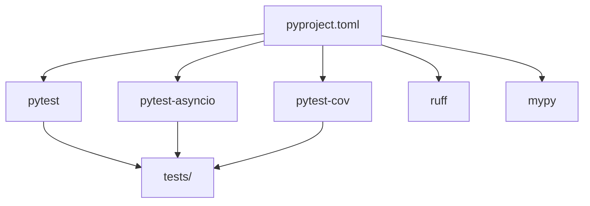

**图表来源**
- [pyproject.toml:38-46](file://pyproject.toml#L38-L46)
- [pyproject.toml:75-78](file://pyproject.toml#L75-L78)

**章节来源**
- [pyproject.toml:38-46](file://pyproject.toml#L38-L46)
- [pyproject.toml:75-78](file://pyproject.toml#L75-L78)

## 性能考虑
- 异步测试：使用 autouse 夹具统一清理后台任务，避免测试间状态累积导致的性能退化。
- 外部依赖隔离：通过 monkeypatch 与临时目录替换，减少真实 I/O 与网络调用，提高测试稳定性与速度。
- 并行执行：在特性脚本中对关键路径进行源码检查，确保并行执行路径存在，有助于缩短长流程耗时。
- 覆盖率：结合 pytest-cov 生成覆盖率报告，识别未覆盖路径并针对性补充测试。

[本节为通用建议，无需特定文件引用]

## 故障排除指南
- 异步测试卡住或状态泄漏
  - 确认已使用 autouse 异步夹具，并在测试结束时清理后台任务管理器。
  - 参考：tests/conftest.py 的夹具实现。
- 外部服务不可用（如 Docker、MCP）
  - 使用专用夹具（如 fake_mcp_server.py）替代真实服务。
  - 对于 Docker，通过 monkeypatch 模拟平台与命令查找，覆盖“未安装/未运行/不支持”等场景。
- 权限与路径规则导致的拒绝
  - 在测试中显式配置权限设置与路径规则，断言拒绝/允许的行为符合预期。
- 真实模型调用失败
  - 在特性脚本中检查返回码与标准输出，必要时降低超时或调整模型参数。
- 调试技巧
  - 使用 pytest 的 -v、--tb=short 参数获取详细错误信息。
  - 在复杂异步流程中，拆分步骤并添加中间断言，逐步缩小问题范围。

**章节来源**
- [tests/conftest.py:10-14](file://tests/conftest.py#L10-L14)
- [tests/fixtures/fake_mcp_server.py:1-22](file://tests/fixtures/fake_mcp_server.py#L1-L22)
- [tests/test_sandbox/test_docker_backend.py:28-95](file://tests/test_sandbox/test_docker_backend.py#L28-L95)
- [scripts/test_harness_features.py:205-239](file://scripts/test_harness_features.py#L205-L239)

## 结论
通过遵循本指南，你可以高效地在 OpenHarness 中编写与维护高质量测试：从全局夹具与专用夹具的使用，到模块化单元测试与端到端脚本的组织；从断言设计与异步调试，到覆盖率提升与测试重构的最佳实践。建议在新增功能时同步补充单元/集成测试与特性脚本，确保行为稳定、边界清晰、易于维护。

[本节为总结，无需特定文件引用]

## 附录

### 新测试编写流程（步骤清单）
- 准备测试文件
  - 在 tests/ 下按模块创建测试文件，命名与被测模块一致。
  - 在 tests/conftest.py 中添加必要的 autouse 夹具。
- 编写测试函数
  - 使用 monkeypatch 注入假实现，隔离外部依赖。
  - 明确输入/输出与期望行为，编写断言。
- 断言编写
  - 针对关键字段（如请求头、返回结构、使用统计）进行断言。
  - 对异步行为，等待完成后再断言结果。
- 测试数据与夹具
  - 使用临时目录与路径替换，避免污染真实环境。
  - 必要时引入专用夹具（如 MCP 服务器）。
- 运行与验证
  - 使用 pytest 运行测试，观察 PASS/FAIL 与详细错误信息。
  - 如需覆盖率，配合 pytest-cov 生成报告并识别未覆盖路径。
- 文档与报告
  - 在 README 或贡献文档中更新测试覆盖情况与新增测试说明。
  - 生成测试报告并归档，便于后续回归验证。

[本节为操作指南，无需特定文件引用]