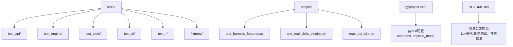
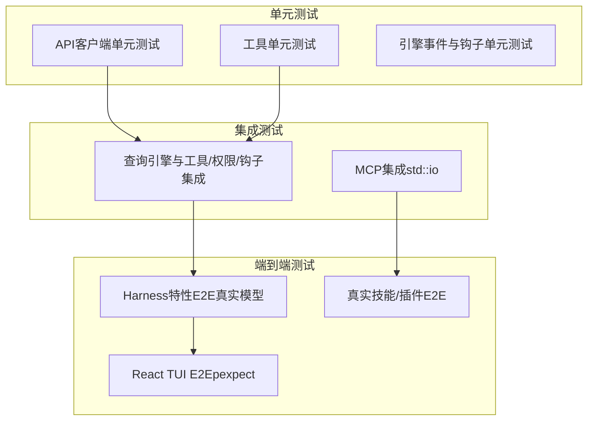
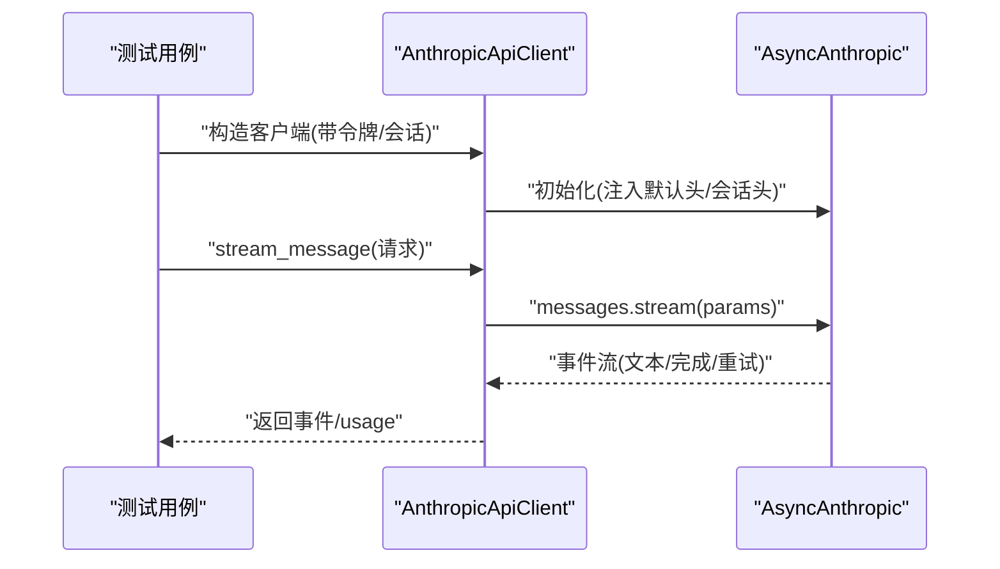
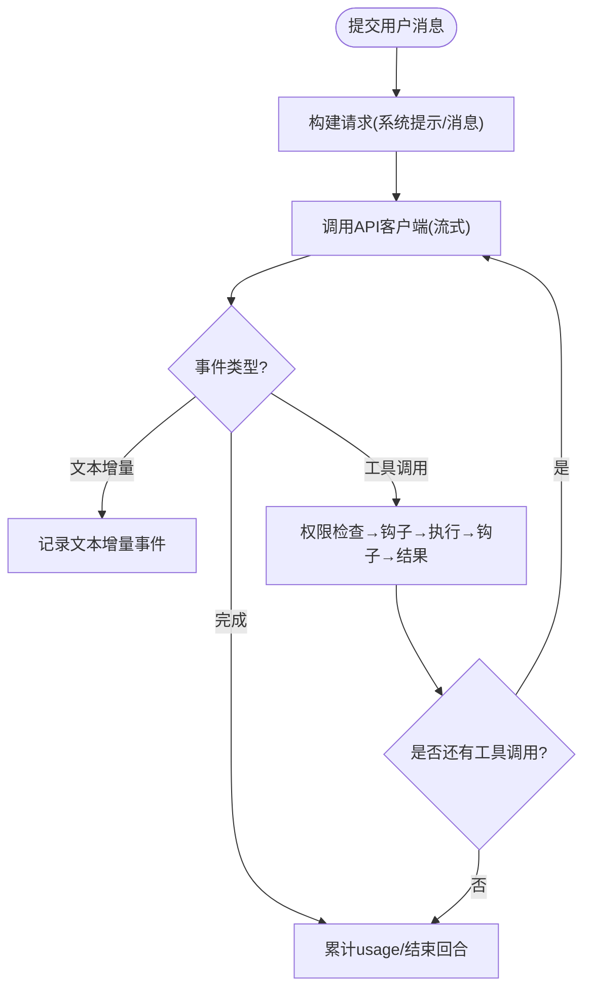
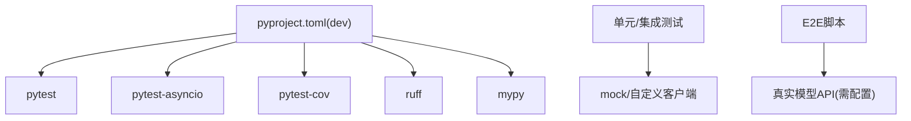

# 测试指南

<cite>
**本文引用的文件**
- [tests/conftest.py](file://tests/conftest.py)
- [pyproject.toml](file://pyproject.toml)
- [README.md](file://README.md)
- [tests/test_api/test_client.py](file://tests/test_api/test_client.py)
- [tests/test_engine/test_query_engine.py](file://tests/test_engine/test_query_engine.py)
- [tests/test_tools/test_core_tools.py](file://tests/test_tools/test_core_tools.py)
- [tests/test_ui/test_react_launcher.py](file://tests/test_ui/test_react_launcher.py)
- [scripts/test_harness_features.py](file://scripts/test_harness_features.py)
- [scripts/test_real_skills_plugins.py](file://scripts/test_real_skills_plugins.py)
- [scripts/react_tui_e2e.py](file://scripts/react_tui_e2e.py)
- [tests/fixtures/fake_mcp_server.py](file://tests/fixtures/fake_mcp_server.py)
</cite>

## 目录
1. [简介](#简介)
2. [项目结构](#项目结构)
3. [核心组件](#核心组件)
4. [架构总览](#架构总览)
5. [详细组件分析](#详细组件分析)
6. [依赖分析](#依赖分析)
7. [性能考虑](#性能考虑)
8. [故障排除指南](#故障排除指南)
9. [结论](#结论)
10. [附录](#附录)

## 简介
本测试指南面向OpenHarness项目的开发者与贡献者，系统阐述测试架构设计、测试夹具与套件组织、测试执行流程，以及单元测试、集成测试与端到端（E2E）测试的实施方法。文档还覆盖测试覆盖率与质量保证机制、测试开发指南（新测试编写、现有测试维护、测试数据准备）、各模块测试策略（引擎、工具、UI等）、测试环境搭建与配置、调试与故障排除方法，以及持续集成配置建议。

## 项目结构
OpenHarness采用分层与功能混合的组织方式：核心Python包位于src/openharness与ohmo，测试集中于tests目录，脚本化E2E测试位于scripts目录。测试运行由pytest驱动，并通过pyproject.toml中的配置统一管理。

图示来源
- [pyproject.toml:75-77](file://pyproject.toml#L75-L77)
- [README.md:705-721](file://README.md#L705-L721)

章节来源
- [pyproject.toml:75-77](file://pyproject.toml#L75-L77)
- [README.md:705-721](file://README.md#L705-L721)

## 核心组件
- 共享夹具与清理
  - tests/conftest.py提供自动重置后台任务管理器的夹具，确保异步测试前后资源一致。
- 测试运行配置
  - pyproject.toml定义pytest根路径、异步模式、开发依赖（pytest、pytest-asyncio、pytest-cov），并声明脚本入口。
- 测试套件组织
  - tests下按子系统划分：API客户端、引擎、工具、UI、权限、插件、内存、服务、MCP等；scripts中包含真实模型调用的E2E脚本。
- 覆盖率与质量
  - README展示“114个单元/集成测试全部通过”，并提供E2E套件清单；pytest-cov作为开发依赖用于生成覆盖率报告。

章节来源
- [tests/conftest.py:10-14](file://tests/conftest.py#L10-L14)
- [pyproject.toml:39-46](file://pyproject.toml#L39-L46)
- [pyproject.toml:75-77](file://pyproject.toml#L75-L77)
- [README.md:705-721](file://README.md#L705-L721)

## 架构总览
测试架构分为三层：
- 单元测试：针对独立模块或类，使用pytest与monkeypatch进行依赖替换与状态模拟。
- 集成测试：在真实子系统间验证交互，如API客户端与权限检查器、查询引擎与工具注册表。
- 端到端测试：通过真实CLI或脚本驱动，覆盖从命令行到前端渲染的完整链路，包含真实模型调用。

图示来源
- [tests/test_api/test_client.py:1-194](file://tests/test_api/test_client.py#L1-L194)
- [tests/test_engine/test_query_engine.py:1-800](file://tests/test_engine/test_query_engine.py#L1-L800)
- [tests/test_tools/test_core_tools.py:1-327](file://tests/test_tools/test_core_tools.py#L1-L327)
- [scripts/test_harness_features.py:1-240](file://scripts/test_harness_features.py#L1-L240)
- [scripts/test_real_skills_plugins.py:1-347](file://scripts/test_real_skills_plugins.py#L1-L347)
- [scripts/react_tui_e2e.py:1-162](file://scripts/react_tui_e2e.py#L1-L162)

## 详细组件分析

### API客户端测试
- 关注点
  - OAuth头注入、会话标识头、动态令牌刷新、消息序列化（含图片块）。
- 实施要点
  - 使用monkeypatch替换外部SDK构造参数与静态函数，断言默认请求头与参数。
  - 模拟流式响应以验证事件与usage统计。
- 质量保障
  - 覆盖OAuth与API Key两种认证路径；校验会话与计费头一致性；验证令牌刷新触发时机。

图示来源
- [tests/test_api/test_client.py:7-194](file://tests/test_api/test_client.py#L7-L194)

章节来源
- [tests/test_api/test_client.py:1-194](file://tests/test_api/test_client.py#L1-L194)

### 引擎测试（QueryEngine）
- 关注点
  - 文本回复、最大轮次、重试策略、上下文压缩、工具调用、钩子事件、协调员模式、并发工具执行。
- 实施要点
  - 使用自定义“确定性”与“失败重试/超长提示词/令牌上限”客户端，断言事件序列与usage。
  - 通过HookRegistry与HookExecutor验证PRE_TOOL_USE拦截与STOP钩子触发。
  - 在协调员模式下验证系统提示注入与agent工具调用。
- 质量保障
  - 覆盖边界条件（空助手消息、未设置max_turns、提示过长自动压缩）；验证工具元数据追踪（最近读取文件、已调用技能、异步代理活动）。

图示来源
- [tests/test_engine/test_query_engine.py:216-800](file://tests/test_engine/test_query_engine.py#L216-L800)

章节来源
- [tests/test_engine/test_query_engine.py:1-800](file://tests/test_engine/test_query_engine.py#L1-L800)

### 工具测试（核心工具）
- 关注点
  - 文件读写编辑、Glob/Grep、Bash执行、技能加载、Todo写入、笔记本编辑、LSP符号导航、工作树切换、定时任务与远程触发。
- 实施要点
  - 基于临时目录隔离文件操作；使用Git初始化场景验证工作树工具；通过ToolExecutionContext传递上下文。
- 质量保障
  - 断言输出格式、错误处理、幂等更新（Todo去重）、路径解析（绝对模式）。

章节来源
- [tests/test_tools/test_core_tools.py:1-327](file://tests/test_tools/test_core_tools.py#L1-L327)

### UI与React TUI启动器测试
- 关注点
  - 后端命令构建（标志位齐全）、REPL/打印模式/任务工作线程运行、stdin单行或多行JSON负载解析、协调员模式等待异步任务。
- 实施要点
  - 使用monkeypatch替换构建运行时、启动与关闭流程；通过伪造stdin模拟外部输入。
- 质量保障
  - 确保命令行标志被正确注入；验证任务通知与快照保存；确认多行转义字符正确解码。

章节来源
- [tests/test_ui/test_react_launcher.py:1-309](file://tests/test_ui/test_react_launcher.py#L1-L309)

### 端到端测试（Harness特性）
- 关注点
  - API重试配置与真实调用、技能系统加载与注入、并行工具执行路径、路径级权限规则与命令拒绝模式。
- 实施要点
  - 通过子进程直接调用可执行模块，传入ANTHROPIC_*环境变量；断言输出包含关键词。
- 质量保障
  - 覆盖真实模型调用路径，确保兼容性与稳定性。

章节来源
- [scripts/test_harness_features.py:1-240](file://scripts/test_harness_features.py#L1-L240)

### 端到端测试（真实技能/插件）
- 关注点
  - 安装并加载真实anthropics/skills与兼容插件，验证命令发现、钩子结构、内容质量与模型使用效果。
- 实施要点
  - 将外部仓库复制到用户技能/插件目录，断言系统提示包含技能名、插件命令与钩子结构有效。
- 质量保障
  - 确保第三方生态兼容性与向后兼容。

章节来源
- [scripts/test_real_skills_plugins.py:1-347](file://scripts/test_real_skills_plugins.py#L1-L347)

### 端到端测试（React TUI）
- 关注点
  - 权限文件读写、用户问答弹窗、命令流（/plan）等场景的自动化脚本驱动。
- 实施要点
  - 使用pexpect驱动真实CLI，发送键入与交互，断言最终标记字符串与文件落盘。
- 质量保障
  - 验证UI交互、权限对话框、模式切换与前端原始返回开关。

章节来源
- [scripts/react_tui_e2e.py:1-162](file://scripts/react_tui_e2e.py#L1-L162)

### MCP集成测试夹具
- 关注点
  - 使用FastMCP在std::io上提供最小可用工具与资源，便于集成测试。
- 实施要点
  - 在测试中直接导入并运行该服务器，验证工具调用与资源读取。
- 质量保障
  - 降低外部依赖，提升集成测试稳定性与可重复性。

章节来源
- [tests/fixtures/fake_mcp_server.py:1-22](file://tests/fixtures/fake_mcp_server.py#L1-L22)

## 依赖分析
- 测试框架与异步支持
  - pytest与pytest-asyncio负责测试执行与异步协程；conftest提供全局夹具。
- 开发依赖
  - pytest-cov用于覆盖率统计；ruff/mypy分别用于代码风格与类型检查。
- 运行时依赖
  - 多数测试不依赖外部服务，通过mock与自定义客户端实现可控测试；E2E脚本依赖真实模型API（需设置认证与模型）。

图示来源
- [pyproject.toml:39-46](file://pyproject.toml#L39-L46)

章节来源
- [pyproject.toml:39-46](file://pyproject.toml#L39-L46)

## 性能考虑
- 测试执行效率
  - 使用确定性客户端与最小化外部依赖，避免网络抖动影响测试稳定性。
  - 对异步测试使用自动夹具清理后台任务，减少跨用例干扰。
- 覆盖率与质量
  - 利用pytest-cov生成报告，识别未覆盖路径；结合ruff/mypy在PR阶段拦截潜在问题。
- E2E成本控制
  - 将真实模型调用限制在必要场景（Harness特性与真实生态），其余使用mock与自定义客户端。

## 故障排除指南
- 常见问题
  - 真实模型调用失败：检查ANTHROPIC_AUTH_TOKEN、ANTHROPIC_MODEL、ANTHROPIC_BASE_URL环境变量。
  - React TUI E2E失败：开启OPENHARNESS_E2E_DEBUG查看交互日志；确认pexpect版本与终端兼容。
  - 权限/路径规则导致工具失败：核对settings.json中的path_rules与denied_commands。
- 排查步骤
  - 单元/集成测试：缩小问题范围至具体模块，添加断点或打印辅助信息。
  - E2E脚本：在本地隔离配置目录与数据目录，逐步执行脚本，定位失败步骤。
  - MCP集成：使用fake_mcp_server快速复现问题，确认协议与参数。

章节来源
- [scripts/test_harness_features.py:25-38](file://scripts/test_harness_features.py#L25-L38)
- [scripts/react_tui_e2e.py:31-34](file://scripts/react_tui_e2e.py#L31-L34)

## 结论
OpenHarness的测试体系以pytest为核心，覆盖从单元到端到端的全链路验证。通过共享夹具、自定义客户端与最小化外部依赖，测试具备高稳定性与可维护性。真实模型调用仅在必要场景使用，配合覆盖率与静态检查工具，确保质量与性能平衡。建议在新增功能时优先补充单元与集成测试，再进行E2E验证，并在CI中保持所有测试通过。

## 附录

### 测试开发指南
- 新测试编写
  - 选择合适层级：优先单元测试，其次集成测试，最后E2E脚本。
  - 使用pytest与monkeypatch替换外部依赖；为异步逻辑使用@pytest.mark.asyncio。
  - 通过临时目录隔离文件操作；为UI交互使用pexpect或最小化模拟。
- 现有测试维护
  - 遵循既有命名与文件组织；保持断言明确且可读。
  - 对变更较大的模块，同步更新相关集成与E2E用例。
- 测试数据准备
  - 使用pytest tmp_path；必要时预置配置文件与技能/插件目录。
  - 对MCP集成使用fake_mcp_server，确保可重复性。

### 不同模块的测试策略
- 引擎与API
  - 注重事件流、usage统计、重试与压缩逻辑；模拟异常路径（速率限制、提示过长、令牌上限）。
- 工具
  - 覆盖文件系统、命令执行、搜索与编辑、笔记本与LSP、工作树与定时任务。
- UI与前端
  - 使用pexpect驱动真实CLI；验证权限对话框、命令流与模式切换。
- 插件与技能
  - 安装真实第三方内容，验证加载、命令发现与钩子结构；确保系统提示包含技能列表。

### 测试环境搭建与配置
- 本地安装
  - 使用开发依赖：pip install -e .[dev] 或 uv add -d .[dev]。
- 运行测试
  - pytest -q：运行全部单元/集成测试。
  - python scripts/test_harness_features.py：运行Harness特性E2E。
  - python scripts/test_real_skills_plugins.py：运行真实技能/插件E2E。
  - python scripts/react_tui_e2e.py [--scenario all|permission_file_io|question_flow|command_flow]：运行React TUI E2E。
- 环境变量
  - ANTHROPIC_AUTH_TOKEN：真实模型调用所需。
  - ANTHROPIC_MODEL：指定模型名称。
  - ANTHROPIC_BASE_URL：可选，自定义基础URL。
  - OPENHARNESS_E2E_DEBUG=1：启用E2E调试输出。
  - OPENHARNESS_FRONTEND_RAW_RETURN=1：前端原始返回模式（E2E）。
  - OPENHARNESS_FRONTEND_SCRIPT：预设前端脚本（E2E）。

章节来源
- [pyproject.toml:39-46](file://pyproject.toml#L39-L46)
- [README.md:716-721](file://README.md#L716-L721)
- [scripts/test_harness_features.py:25-38](file://scripts/test_harness_features.py#L25-L38)
- [scripts/react_tui_e2e.py:46-60](file://scripts/react_tui_e2e.py#L46-L60)