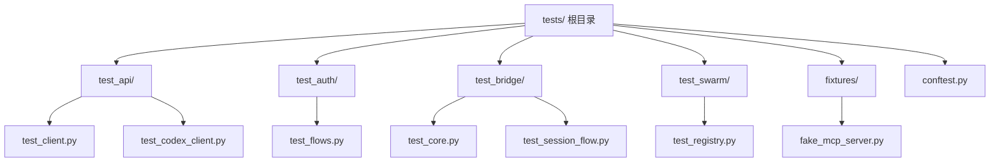
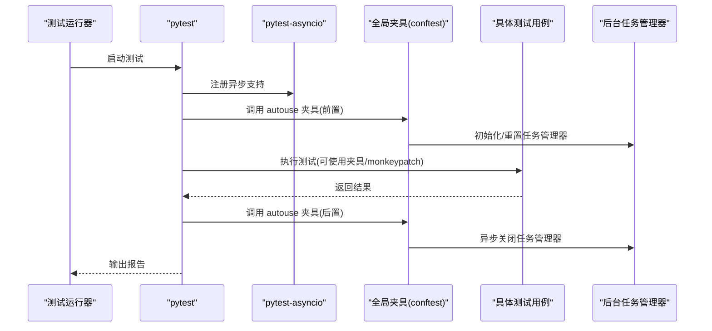
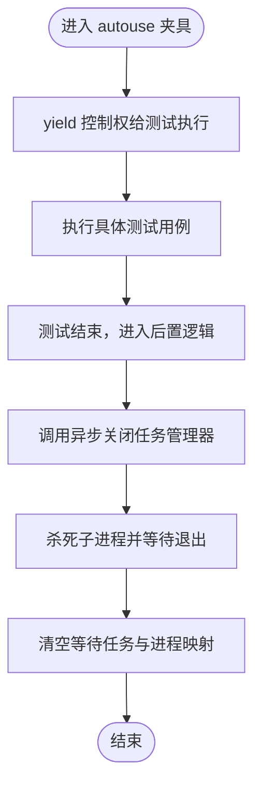
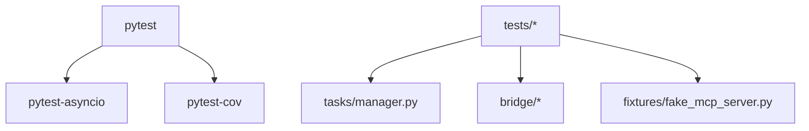

# 测试架构设计

<cite>
**本文档引用的文件**
- [pyproject.toml](file://pyproject.toml)
- [conftest.py](file://tests/conftest.py)
- [fake_mcp_server.py](file://tests/fixtures/fake_mcp_server.py)
- [test_client.py](file://tests/test_api/test_client.py)
- [test_codex_client.py](file://tests/test_api/test_codex_client.py)
- [test_flows.py](file://tests/test_auth/test_flows.py)
- [test_core.py](file://tests/test_bridge/test_core.py)
- [test_session_flow.py](file://tests/test_bridge/test_session_flow.py)
- [test_registry.py](file://tests/test_swarm/test_registry.py)
- [manager.py](file://src/openharness/tasks/manager.py)
</cite>

## 目录
1. [简介](#简介)
2. [项目结构](#项目结构)
3. [核心组件](#核心组件)
4. [架构总览](#架构总览)
5. [详细组件分析](#详细组件分析)
6. [依赖分析](#依赖分析)
7. [性能考虑](#性能考虑)
8. [故障排除指南](#故障排除指南)
9. [结论](#结论)

## 简介
本文件系统化梳理 OpenHarness 的测试架构设计，重点覆盖以下方面：
- 测试框架选择与配置：pytest 及其异步支持 pytest-asyncio 的启用方式与行为模式
- 测试夹具（fixtures）设计：全局自动夹具与模块级夹具的作用域管理
- 测试套件组织：按功能模块划分的测试目录与命名规范
- 初始化与清理机制：后台任务管理器的重置逻辑与资源回收
- 测试环境配置与依赖注入：通过 monkeypatch、环境变量与临时文件实现的隔离与模拟
- 异步测试最佳实践与错误处理策略：基于 asyncio 的并发控制与异常捕获

## 项目结构
OpenHarness 的测试代码位于 tests/ 目录下，采用“按功能模块划分”的组织方式，每个子目录对应一个核心模块或子系统，如 api、auth、bridge、swarm 等。每个模块下的测试文件遵循清晰的命名规范，便于定位与维护。

图表来源
- [pyproject.toml:75-77](file://pyproject.toml#L75-L77)
- [conftest.py:1-14](file://tests/conftest.py#L1-L14)
- [fake_mcp_server.py:1-22](file://tests/fixtures/fake_mcp_server.py#L1-L22)

章节来源
- [pyproject.toml:75-77](file://pyproject.toml#L75-L77)
- [conftest.py:1-14](file://tests/conftest.py#L1-L14)

## 核心组件
- 测试框架与异步支持
  - 使用 pytest 作为主测试框架，并在工具配置中开启异步模式，确保异步测试用例可被正确执行
  - 通过 pytest-asyncio 提供对 asyncio 协程的原生支持，简化异步夹具与测试函数的编写
- 全局夹具与清理机制
  - 在 tests/conftest.py 中定义 autouse 夹具，在每个测试用例执行后自动调用后台任务管理器的异步关闭流程，保证测试间状态隔离
- 测试夹具与依赖注入
  - 使用 pytest 的 monkeypatch 实现对第三方库或外部服务的替换，例如 http 客户端、系统调用等
  - 通过环境变量与临时路径实现隔离，避免跨测试相互影响
- 模块级夹具与作用域管理
  - 针对特定模块的测试需求，定义局部夹具以提供稳定的测试上下文，如 MCP 服务器、浏览器打开行为等

章节来源
- [pyproject.toml:75-77](file://pyproject.toml#L75-L77)
- [conftest.py:10-13](file://tests/conftest.py#L10-L13)
- [manager.py:446-452](file://src/openharness/tasks/manager.py#L446-L452)

## 架构总览
OpenHarness 的测试架构围绕“隔离、可重复、可扩展”展开。整体流程如下：
- 测试运行器启动后，加载 pytest 配置与插件（含 pytest-asyncio）
- 执行前先运行全局 autouse 夹具，初始化测试环境
- 运行具体测试用例，期间可使用模块级夹具与 monkeypatch 注入依赖
- 测试结束后，自动触发清理流程，重置后台任务管理器，回收子进程与等待任务
- 对于异步测试，使用 @pytest.mark.asyncio 或 asyncio.run 包裹协程，确保事件循环正确管理

图表来源
- [pyproject.toml:75-77](file://pyproject.toml#L75-L77)
- [conftest.py:10-13](file://tests/conftest.py#L10-L13)
- [manager.py:446-452](file://src/openharness/tasks/manager.py#L446-L452)

## 详细组件分析

### 测试框架与配置
- 工具配置
  - testpaths 指定测试根目录为 tests/
  - asyncio_mode 设置为 auto，使 pytest-asyncio 自动识别并处理异步测试
- 依赖声明
  - dev 分组包含 pytest、pytest-asyncio、pytest-cov 等开发依赖，满足测试与覆盖率统计需求

章节来源
- [pyproject.toml:75-77](file://pyproject.toml#L75-L77)
- [pyproject.toml:39-46](file://pyproject.toml#L39-L46)

### 全局夹具与清理机制
- 设计目标
  - 在每个测试用例执行前后统一进行后台任务管理器的状态重置，避免子进程泄漏与状态污染
- 实现要点
  - autouse 夹具在测试开始前不执行任何操作，仅在退出时调用异步关闭流程
  - 关闭流程会杀死仍在运行的子进程、等待所有等待任务完成，并清空内部状态

图表来源
- [conftest.py:10-13](file://tests/conftest.py#L10-L13)
- [manager.py:394-418](file://src/openharness/tasks/manager.py#L394-L418)

章节来源
- [conftest.py:10-13](file://tests/conftest.py#L10-L13)
- [manager.py:446-452](file://src/openharness/tasks/manager.py#L446-L452)

### 测试夹具与依赖注入
- 模块级夹具示例
  - 认证模块：记录并断言浏览器打开行为，使用 monkeypatch 替换系统调用，确保跨平台兼容性验证
  - 桥接模块：通过临时路径与子进程封装，验证会话生命周期与输出写入
  - MCP 集成：使用小型 stdio MCP 服务器作为夹具，提供稳定的工具与资源访问
- 依赖注入策略
  - 使用 monkeypatch 动态替换第三方客户端或系统调用，避免真实网络请求与系统副作用
  - 通过环境变量与临时目录隔离测试数据，确保测试可重复

章节来源
- [test_flows.py:26-52](file://tests/test_auth/test_flows.py#L26-L52)
- [test_core.py:25-61](file://tests/test_bridge/test_core.py#L25-L61)
- [test_session_flow.py:13-32](file://tests/test_bridge/test_session_flow.py#L13-L32)
- [fake_mcp_server.py:1-22](file://tests/fixtures/fake_mcp_server.py#L1-L22)

### 异步测试最佳实践
- 使用 @pytest.mark.asyncio 标注异步测试函数，由 pytest-asyncio 自动调度
- 对于需要手动运行事件循环的场景，使用 asyncio.run 包裹协程，确保异常被捕获并报告
- 在异步测试中，优先使用 asyncio.subprocess 的 PIPE/STDOUT 组合，确保标准输出与错误流合并的一致性

章节来源
- [test_core.py:25-61](file://tests/test_bridge/test_core.py#L25-L61)
- [test_codex_client.py:162-205](file://tests/test_api/test_codex_client.py#L162-L205)

### API 测试与消息序列化
- 客户端行为验证
  - OAuth 令牌头注入、Claude 身份信息头、会话标识头等，均通过替换底层客户端类进行断言
  - 对多模态消息（文本+图片）的序列化进行校验，确保与上游接口参数一致
- 异步流式响应
  - 基于自定义异步客户端与事件流，验证文本增量事件、工具调用事件与完成事件的正确性

章节来源
- [test_client.py:7-194](file://tests/test_api/test_client.py#L7-L194)
- [test_codex_client.py:162-242](file://tests/test_api/test_codex_client.py#L162-L242)

### 桥接与会话生命周期
- 工作密钥编解码与 SDK URL 构建
- 子进程会话的创建、终止与输出写入，验证在不同平台下的行为一致性
- 标准错误流合并到标准输出的策略，确保日志完整性

章节来源
- [test_core.py:13-61](file://tests/test_bridge/test_core.py#L13-L61)
- [test_session_flow.py:13-32](file://tests/test_bridge/test_session_flow.py#L13-L32)

### Swarm 后端注册与检测
- 默认后端注册与获取
- 后端检测缓存与重置
- 自定义后端注册与可用性排序

章节来源
- [test_registry.py:16-115](file://tests/test_swarm/test_registry.py#L16-L115)

## 依赖分析
- 测试运行时依赖
  - pytest、pytest-asyncio、pytest-cov：提供测试执行、异步支持与覆盖率统计
  - mcp 服务器：用于集成测试中的工具与资源访问
- 内部模块依赖
  - 任务管理器：在测试夹具中被重置，确保子进程与等待任务得到清理
  - 桥接模块：在桥接测试中被直接调用，验证会话生命周期与输出写入

图表来源
- [pyproject.toml:39-46](file://pyproject.toml#L39-L46)
- [manager.py:446-452](file://src/openharness/tasks/manager.py#L446-L452)
- [fake_mcp_server.py:1-22](file://tests/fixtures/fake_mcp_server.py#L1-L22)

章节来源
- [pyproject.toml:39-46](file://pyproject.toml#L39-L46)
- [manager.py:446-452](file://src/openharness/tasks/manager.py#L446-L452)

## 性能考虑
- 异步测试的事件循环管理
  - 避免在单个测试中长时间阻塞事件循环，合理拆分异步步骤
- 子进程与等待任务的清理
  - 在 autouse 夹具中统一关闭，减少测试间的资源残留
- 测试数据隔离
  - 使用临时目录与环境变量，避免磁盘与环境污染导致的重复测试失败

## 故障排除指南
- 异步测试未生效
  - 检查 pytest 配置中的 asyncio_mode 是否为 auto
  - 确认测试函数使用 @pytest.mark.asyncio 或在事件循环中运行
- 子进程泄漏或僵尸进程
  - 确保 autouse 夹具已正确安装并执行
  - 检查 aclose() 是否被调用，等待任务是否完成
- 平台差异导致的浏览器打开失败
  - 使用 monkeypatch 替换系统调用，断言传入参数与 shell 标志
- MCP 工具不可用
  - 确认夹具服务器已启动并通过 stdio 正常通信

章节来源
- [pyproject.toml:75-77](file://pyproject.toml#L75-L77)
- [conftest.py:10-13](file://tests/conftest.py#L10-L13)
- [manager.py:394-418](file://src/openharness/tasks/manager.py#L394-L418)
- [test_flows.py:55-98](file://tests/test_auth/test_flows.py#L55-L98)

## 结论
OpenHarness 的测试架构以 pytest 为核心，结合 pytest-asyncio 实现对异步代码的全面覆盖；通过全局 autouse 夹具与后台任务管理器的异步关闭流程，确保测试间状态隔离与资源回收；模块级夹具与 monkeypatch 注入提供了灵活的依赖控制与平台兼容性验证。整体设计兼顾了可维护性与可扩展性，适合持续演进的大型 Python 项目。