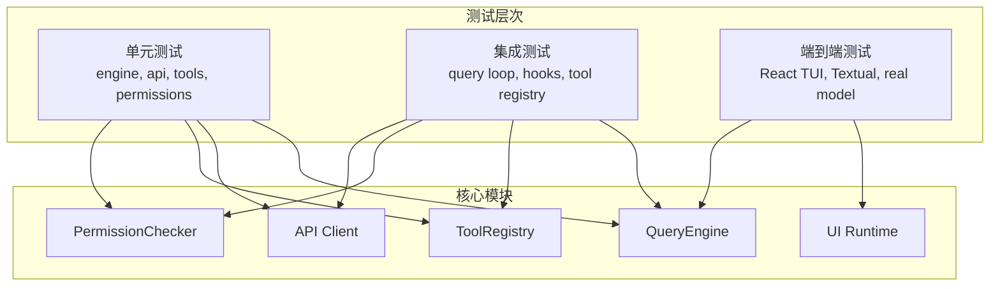
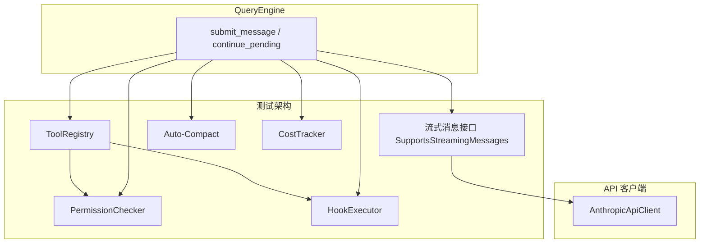
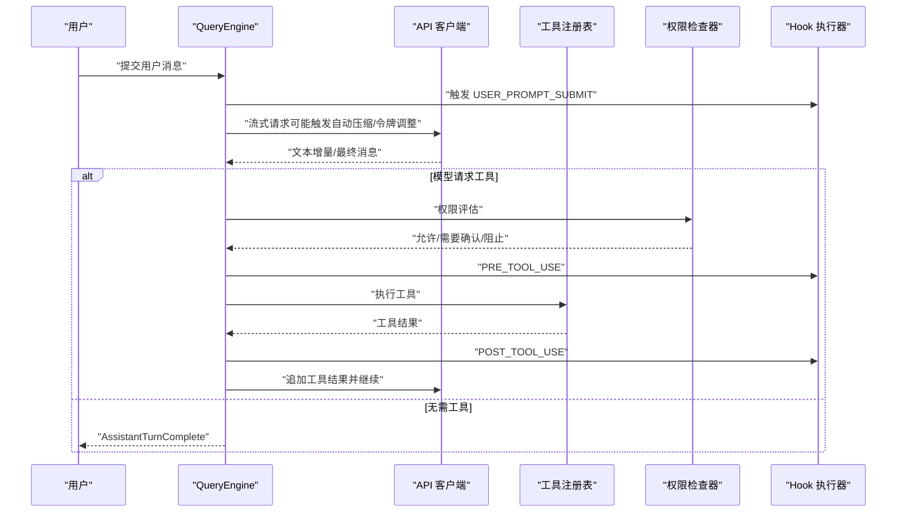
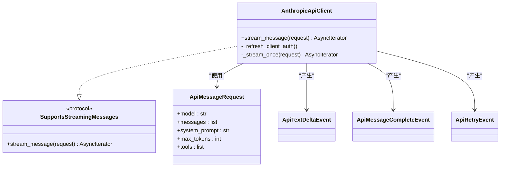
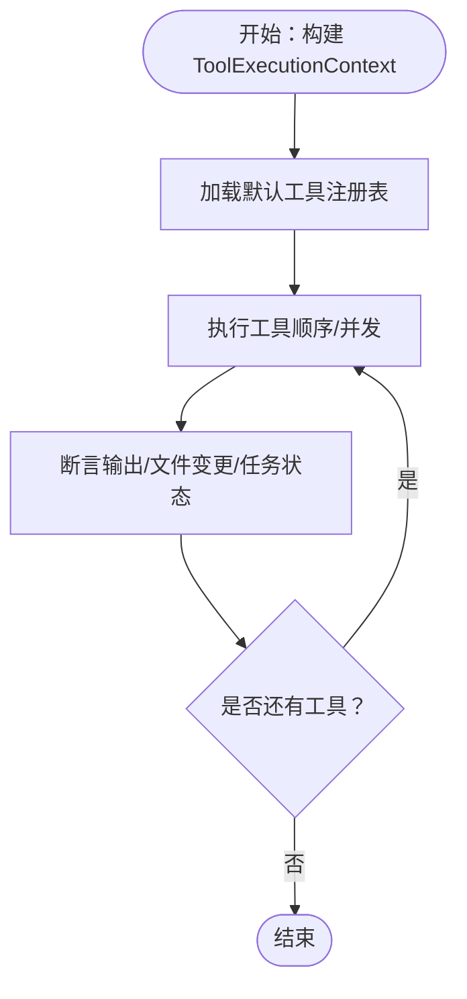
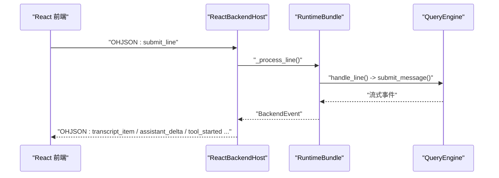
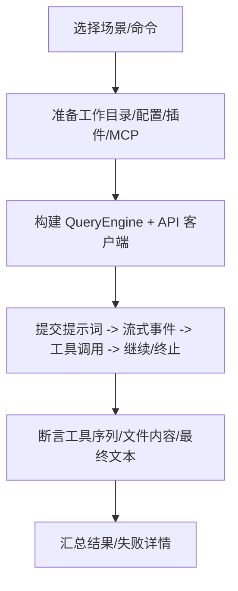
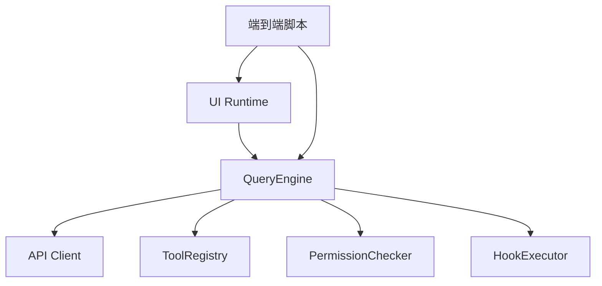

# 测试类型与策略

<cite>
**本文引用的文件**
- [README.md](file://README.md)
- [engine-module-design.md](file://docs/engine-module-design.md)
- [ui-module-design.md](file://docs/ui-module-design.md)
- [test_query_engine.py](file://tests/test_engine/test_query_engine.py)
- [query_engine.py](file://src/openharness/engine/query_engine.py)
- [client.py](file://src/openharness/api/client.py)
- [test_client.py](file://tests/test_api/test_client.py)
- [test_integration_flows.py](file://tests/test_tools/test_integration_flows.py)
- [base.py](file://src/openharness/tools/base.py)
- [test_textual_app.py](file://tests/test_ui/test_textual_app.py)
- [test_react_launcher.py](file://tests/test_ui/test_react_launcher.py)
- [test_checker.py](file://tests/test_permissions/test_checker.py)
- [e2e_smoke.py](file://scripts/e2e_smoke.py)
- [react_tui_e2e.py](file://scripts/react_tui_e2e.py)
- [conftest.py](file://tests/conftest.py)
</cite>

## 目录
1. [引言](#引言)
2. [项目结构](#项目结构)
3. [核心组件](#核心组件)
4. [架构总览](#架构总览)
5. [详细组件分析](#详细组件分析)
6. [依赖分析](#依赖分析)
7. [性能考虑](#性能考虑)
8. [故障排查指南](#故障排查指南)
9. [结论](#结论)
10. [附录](#附录)

## 引言
本文件系统化阐述 OpenHarness 的测试类型与策略，覆盖单元测试、集成测试与端到端测试的边界与场景；重点说明引擎测试策略（QueryEngine 的测试方法与对话循环模拟）、工具测试策略（工具调用、权限检查与错误处理）、UI 测试策略（React 终端界面与 Textual 应用）、API 客户端测试策略（多提供商客户端覆盖）、测试数据准备与模拟对象（mock）使用指南，以及性能测试与负载测试的实施建议。

## 项目结构
OpenHarness 的测试体系围绕以下层次组织：
- 单元测试：针对核心模块（引擎、API 客户端、工具基类、权限检查器）进行细粒度验证。
- 集成测试：验证多模块协作（工具注册表、Hook、权限、API 客户端）在查询循环中的行为。
- 端到端测试：通过真实脚本与外部进程驱动 UI 与引擎，覆盖真实交互路径与真实模型调用。

图示来源
- [engine-module-design.md](file://docs/engine-module-design.md)
- [ui-module-design.md](file://docs/ui-module-design.md)

章节来源
- [README.md](file://README.md)
- [engine-module-design.md](file://docs/engine-module-design.md)
- [ui-module-design.md](file://docs/ui-module-design.md)

## 核心组件
- 引擎（QueryEngine）：承载对话历史、工具感知的模型循环、权限与 Hook、自动压缩与成本追踪。
- API 客户端：统一的流式消息客户端，内置重试、鉴权头注入与错误翻译。
- 工具系统：工具抽象、工具执行上下文、工具注册表与工具结果标准化。
- 权限检查器：多模式权限策略、路径规则与敏感路径保护。
- UI 运行时：React TUI、Textual TUI 与无头模式的统一运行时装配与事件处理。

章节来源
- [query_engine.py](file://src/openharness/engine/query_engine.py)
- [client.py](file://src/openharness/api/client.py)
- [base.py](file://src/openharness/tools/base.py)
- [engine-module-design.md](file://docs/engine-module-design.md)
- [ui-module-design.md](file://docs/ui-module-design.md)

## 架构总览
OpenHarness 的测试架构强调“分层验证”：
- 单元层：通过可插拔的 SupportsStreamingMessages 接口与 ToolRegistry，隔离外部依赖，确保核心算法与错误处理稳定。
- 集成层：在 QueryEngine 的 run_query 循环中，验证工具调用、权限检查、Hook 生命周期与自动压缩。
- 端到端层：通过 React TUI 与 Textual 的真实交互脚本，以及真实模型调用脚本，验证从 UI 到模型的完整链路。

图示来源
- [engine-module-design.md](file://docs/engine-module-design.md)
- [client.py](file://src/openharness/api/client.py)

章节来源
- [engine-module-design.md](file://docs/engine-module-design.md)
- [client.py](file://src/openharness/api/client.py)

## 详细组件分析

### 引擎测试策略（QueryEngine）
- 测试目标
  - 验证 QueryEngine 的对话循环：用户输入 → 模型流式响应 → 工具调用 → 结果回传 → 下一轮或终止。
  - 验证自动压缩、令牌上限调整、提示过长与补全上限错误的响应式处理。
  - 验证 Hook 生命周期（用户提交、STOP 等）与工具元数据的跨轮次延续。
  - 验证协调器模式注入与代理工具调用。
- 关键测试点
  - 纯文本回复、工具调用、重试事件、自动压缩阶段顺序、提示过长与补全上限错误处理、权限钩子拦截、协调器上下文注入、异步代理状态跟踪。
- 模拟对象与数据准备
  - 使用 Deterministic Streaming Client（FakeApiClient、StaticApiClient、RetryThenSuccessApiClient、PromptTooLongThenSuccessApiClient、MaxTokensTooLargeThenSuccessApiClient、EmptyAssistantApiClient、CoordinatorLoopApiClient）模拟上游 API 的不同行为。
  - 使用 RecordingApiClient 记录请求参数，验证 max_tokens 调整与上下文窗口约束。
  - 使用 HookRegistry 与 HookExecutor 的记录器（_RecordingHookExecutor）验证 Hook 触发。
  - 使用 MonkeyPatch 注入技能与代理工具的假实现，验证工具元数据追踪（最近读取文件、技能调用、异步代理任务等）。
- 事件与状态断言
  - 断言事件序列：AssistantTextDelta、ToolExecutionStarted/Completed、AssistantTurnComplete、StatusEvent、CompactProgressEvent、ErrorEvent。
  - 断言工具元数据：read_file_state、invoked_skills、async_agent_state、async_agent_tasks、task_focus_state、recent_verified_work。
  - 断言用量统计：total_usage.input_tokens/output_tokens。
- 会话续传与恢复
  - has_pending_continuation 与 continue_pending 的行为验证。
  - sanitize_conversation_messages 与消息恢复的健壮性。

图示来源
- [test_query_engine.py](file://tests/test_engine/test_query_engine.py)
- [query_engine.py](file://src/openharness/engine/query_engine.py)
- [engine-module-design.md](file://docs/engine-module-design.md)

章节来源
- [test_query_engine.py](file://tests/test_engine/test_query_engine.py)
- [query_engine.py](file://src/openharness/engine/query_engine.py)
- [engine-module-design.md](file://docs/engine-module-design.md)

### API 客户端测试策略（多提供商）
- 测试目标
  - 验证 AnthropicApiClient 的流式消息、重试逻辑、鉴权头注入、OAuth 与非 OAuth 场景、系统提示词注入、元数据与请求头。
  - 验证错误翻译：认证失败、速率限制、网络错误等映射为统一的 OpenHarnessApiError。
- 关键测试点
  - OAuth Beta 头添加、Claude 身份头注入、会话 ID 与用户元数据、请求参数序列化、流式事件生成、重试延迟与指数退避、错误翻译。
- 模拟对象与数据准备
  - 使用 monkeypatch 注入 AsyncAnthropic 的假实现，捕获构造参数与请求参数。
  - 使用 ApiMessageRequest 与 ConversationMessage 构造请求，验证 to_api_param 序列化。
- 断言要点
  - 断言 default_headers、auth_token、user-agent、x-app、X-Claude-Code-Session-Id 等头字段。
  - 断言 betas、metadata、extra_headers 是否正确注入。
  - 断言重试事件与最终消息的组合。

图示来源
- [client.py](file://src/openharness/api/client.py)
- [test_client.py](file://tests/test_api/test_client.py)

章节来源
- [client.py](file://src/openharness/api/client.py)
- [test_client.py](file://tests/test_api/test_client.py)

### 工具测试策略
- 测试目标
  - 验证工具抽象（BaseTool）、工具执行上下文（ToolExecutionContext）、工具注册表（ToolRegistry）与工具结果（ToolResult）。
  - 验证工具集成流：多工具搜索编辑、任务与待办流程、技能与配置、代理与消息、LSP 符号导航、定时任务与远程触发、笔记本编辑与 Cron。
- 关键测试点
  - 工具输入验证（Pydantic）、工具 Schema 导出、只读判断、并发工具执行、工具输出卸载与预览、工具元数据延续。
- 模拟对象与数据准备
  - 使用 create_default_tool_registry 构建默认工具集。
  - 使用 ToolExecutionContext 注入 cwd 与 metadata（含 tool_registry）。
  - 使用 monkeypatch 注入 ask_user_prompt 等回调，验证用户问答流程。
- 断言要点
  - 断言工具调用序列、任务状态变化、输出内容与文件系统变更、异步代理任务状态与通知。

图示来源
- [test_integration_flows.py](file://tests/test_tools/test_integration_flows.py)
- [base.py](file://src/openharness/tools/base.py)

章节来源
- [test_integration_flows.py](file://tests/test_tools/test_integration_flows.py)
- [base.py](file://src/openharness/tools/base.py)

### 权限测试策略
- 测试目标
  - 验证 PermissionChecker 的多模式策略：默认模式（读取允许、写入需确认）、全自动模式（允许一切）、计划模式（阻断写入）。
  - 验证路径规则（allow/deny）与敏感路径保护（.ssh、.aws、.kube 等）。
- 关键测试点
  - 不同模式下的允许/拒绝判定、命令提示语、路径规则解析与警告、敏感路径覆盖。
- 断言要点
  - 断言 evaluate 返回的 allowed/requires_confirmation/reason。
  - 断言无效规则被跳过并产生警告。

章节来源
- [test_checker.py](file://tests/test_permissions/test_checker.py)

### UI 测试策略（React TUI 与 Textual）
- React TUI
  - 测试目标：验证 React 启动器、后端主机协议、任务工作者模式、打印模式、协调器异步代理排空。
  - 关键测试点：后端命令构建、stdin/stdout JSON-lines 协议、任务工作者输入解码、打印模式输出格式、协调器模式通知注入。
- Textual TUI
  - 测试目标：验证命令处理、模型轮次、ask_user 工具、侧边栏刷新去重、当前响应去重。
  - 关键测试点：命令选择器、权限弹窗、任务面板更新、状态栏更新、UI 事件转录。
- 模拟对象与数据准备
  - 使用 StaticApiClient/ScriptedApiClient 模拟引擎事件。
  - 使用 run_test 与 pilot 进行 UI 交互模拟。
  - 使用 monkeypatch 设置环境变量与路径，隔离测试环境。

图示来源
- [test_react_launcher.py](file://tests/test_ui/test_react_launcher.py)
- [test_textual_app.py](file://tests/test_ui/test_textual_app.py)
- [ui-module-design.md](file://docs/ui-module-design.md)

章节来源
- [test_react_launcher.py](file://tests/test_ui/test_react_launcher.py)
- [test_textual_app.py](file://tests/test_ui/test_textual_app.py)
- [ui-module-design.md](file://docs/ui-module-design.md)

### 端到端测试策略
- 真实模型调用套件
  - 测试目标：覆盖文件 IO、搜索编辑、任务流、技能流、MCP 集成、上下文注入、代理与远程代理、插件组合、问答、LSP、Cron、工作树、Issue/PR 上下文、MCP 认证更新等场景。
  - 关键测试点：场景选择、设置合并、插件加载、MCP 管理器连接、ask_user 回答注入、工具调用计数与最终文本校验。
- React TUI 端到端
  - 测试目标：权限模式文件 IO、问答流程、命令模式切换。
  - 关键测试点：pexpect 驱动、脚本化输入、最终标记匹配、临时文件断言。
- 模拟对象与数据准备
  - 使用临时目录隔离配置与数据目录。
  - 使用 settings.json 注入权限模式与模型配置。
  - 使用 pexpect.spawn 驱动 oh CLI，模拟真实交互。

图示来源
- [e2e_smoke.py](file://scripts/e2e_smoke.py)
- [react_tui_e2e.py](file://scripts/react_tui_e2e.py)

章节来源
- [e2e_smoke.py](file://scripts/e2e_smoke.py)
- [react_tui_e2e.py](file://scripts/react_tui_e2e.py)

## 依赖分析
- 测试耦合与内聚
  - 单元测试高度内聚于模块边界，通过 SupportsStreamingMessages 与 ToolRegistry 解耦外部依赖。
  - 集成测试关注 QueryEngine 的 run_query 循环，验证多模块协作。
  - 端到端测试跨越 UI 与引擎，验证真实链路。
- 外部依赖与集成点
  - API 客户端依赖第三方 SDK 与网络状态，测试通过 mock 与重试策略覆盖。
  - UI 与引擎通过协议解耦，测试通过 run_test 与 pexpect 驱动。
- 循环依赖规避
  - 通过懒加载与协议接口降低模块间耦合。

图示来源
- [engine-module-design.md](file://docs/engine-module-design.md)
- [ui-module-design.md](file://docs/ui-module-design.md)

章节来源
- [engine-module-design.md](file://docs/engine-module-design.md)
- [ui-module-design.md](file://docs/ui-module-design.md)

## 性能考虑
- 单元测试性能
  - 使用 Deterministic Streaming Client 避免真实网络调用，提升测试速度与稳定性。
  - 使用 monkeypatch 控制时间相关行为（如 asyncio.sleep），减少等待。
- 集成测试性能
  - 通过最小化工具集与短提示词缩短循环次数。
  - 使用 RecordingApiClient 记录请求参数，避免重复 IO。
- 端到端测试性能
  - 通过场景选择与并行执行（在 CI 中）优化整体耗时。
  - 使用临时目录与最小配置，减少磁盘与网络开销。
- 资源管理
  - 使用 conftest 自动清理后台任务管理器，避免资源泄漏影响后续测试。

章节来源
- [conftest.py](file://tests/conftest.py)

## 故障排查指南
- API 客户端错误
  - 检查重试策略与指数退避参数，确认网络错误与状态码映射。
  - 验证鉴权头注入与系统提示词注入是否正确。
- 引擎循环异常
  - 检查自动压缩触发条件与响应式压缩逻辑。
  - 核对工具元数据是否正确注入系统提示词，避免上下文污染。
- UI 交互异常
  - 检查 JSON-lines 协议前缀与事件类型，确认前端与后端一致。
  - 使用 run_test 的 transcript_lines 与 run_print_mode 的输出格式定位问题。
- 权限与路径规则
  - 核对 PermissionSettings 的 mode、path_rules、denied_commands。
  - 验证敏感路径保护是否覆盖预期路径。

章节来源
- [client.py](file://src/openharness/api/client.py)
- [test_client.py](file://tests/test_api/test_client.py)
- [engine-module-design.md](file://docs/engine-module-design.md)
- [ui-module-design.md](file://docs/ui-module-design.md)
- [test_checker.py](file://tests/test_permissions/test_checker.py)

## 结论
OpenHarness 的测试体系通过“单元—集成—端到端”的分层验证，确保引擎、工具、权限与 UI 在真实与模拟场景下的稳健性。QueryEngine 的对话循环、API 客户端的重试与错误处理、工具系统的并发执行与元数据延续、UI 的协议解耦与事件驱动，均在测试中得到充分覆盖。配合合理的模拟对象与数据准备策略，能够高效定位问题并保障质量。

## 附录
- 测试数据准备与模拟对象使用指南
  - 使用 Deterministic Streaming Client（如 FakeApiClient、StaticApiClient、RetryThenSuccessApiClient 等）模拟上游 API 的不同行为。
  - 使用 ToolExecutionContext 注入 cwd 与 metadata（含 tool_registry），在工具集成流测试中提供一致的执行上下文。
  - 使用 monkeypatch 注入 ask_user_prompt、auth_token_resolver、敏感路径保护等，覆盖权限与鉴权场景。
  - 使用 run_test 与 pexpect 驱动 UI 交互，结合临时目录与环境变量隔离测试环境。
- 性能测试与负载测试建议
  - 单元与集成：通过减少工具数量与循环次数，聚焦关键路径。
  - 端到端：在 CI 中并行执行场景套件，使用最小配置与临时目录。
  - 资源管理：利用 conftest 的自动清理，避免资源泄漏。