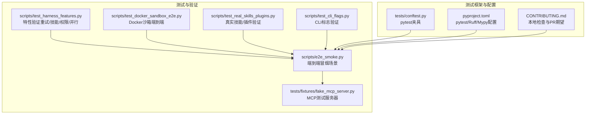
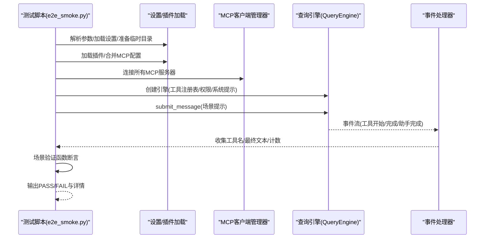
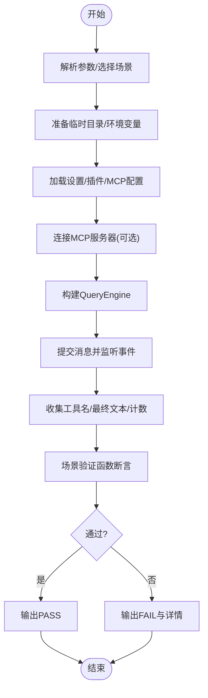
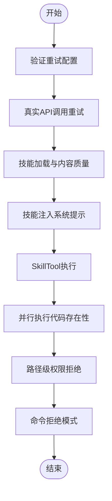
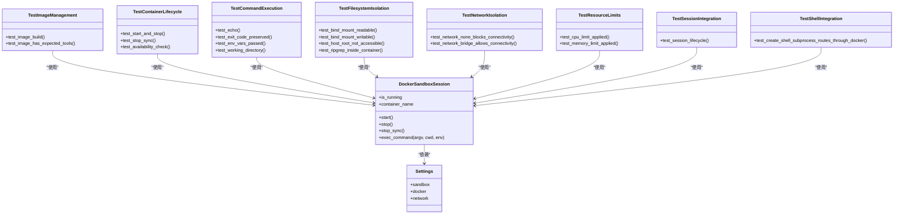
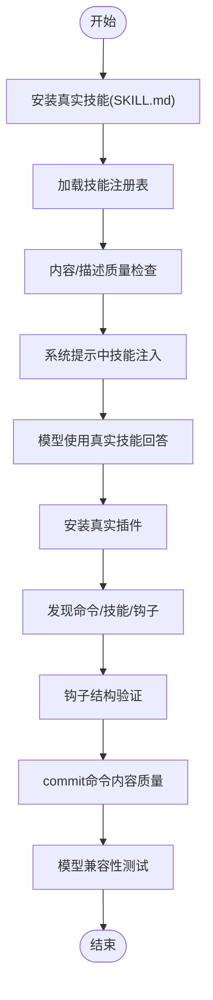
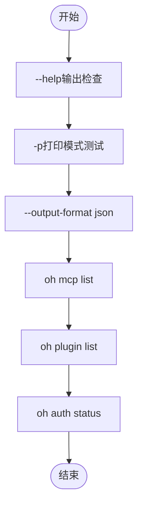
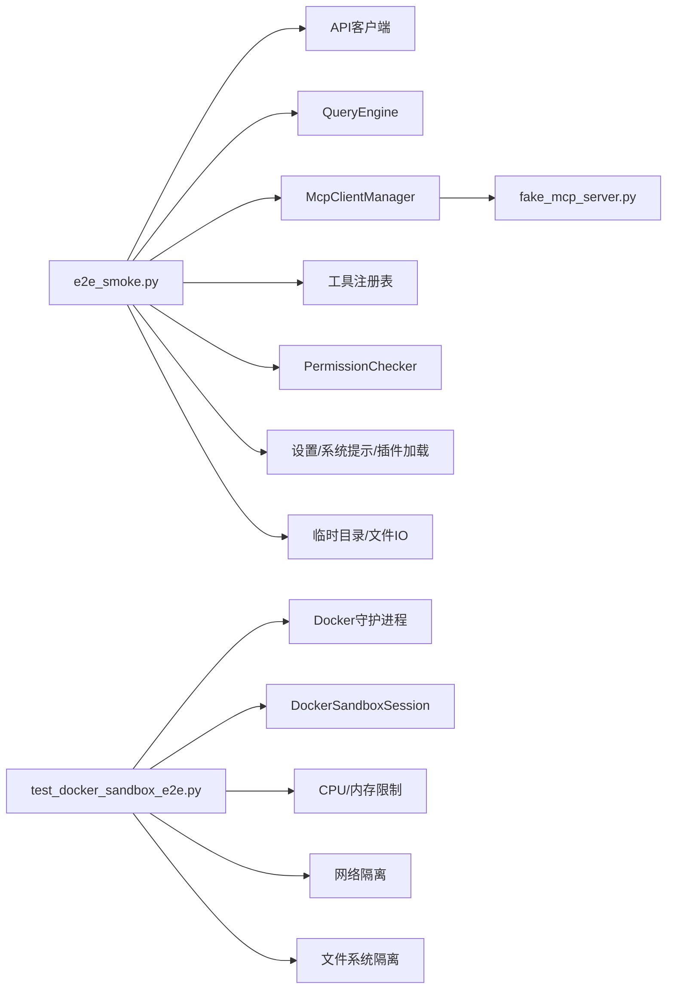

# 质量保证

<cite>
**本文引用的文件**
- [CONTRIBUTING.md](file://CONTRIBUTING.md)
- [pyproject.toml](file://pyproject.toml)
- [tests/conftest.py](file://tests/conftest.py)
- [scripts/e2e_smoke.py](file://scripts/e2e_smoke.py)
- [scripts/test_harness_features.py](file://scripts/test_harness_features.py)
- [scripts/test_docker_sandbox_e2e.py](file://scripts/test_docker_sandbox_e2e.py)
- [scripts/test_real_skills_plugins.py](file://scripts/test_real_skills_plugins.py)
- [scripts/test_cli_flags.py](file://scripts/test_cli_flags.py)
- [tests/fixtures/fake_mcp_server.py](file://tests/fixtures/fake_mcp_server.py)
</cite>

## 目录
1. [引言](#引言)
2. [项目结构](#项目结构)
3. [核心组件](#核心组件)
4. [架构总览](#架构总览)
5. [详细组件分析](#详细组件分析)
6. [依赖分析](#依赖分析)
7. [性能考虑](#性能考虑)
8. [故障排查指南](#故障排查指南)
9. [结论](#结论)
10. [附录](#附录)

## 引言
本文件面向OpenHarness项目的质量保证与持续集成/持续部署（CI/CD）实践，系统化梳理测试自动化流程、测试覆盖率与质量门禁、跨平台兼容性测试策略、性能与压力测试方法、安全测试与漏洞扫描集成、测试报告与质量度量工具使用、回归与冒烟测试自动化配置，以及测试环境管理与测试数据保护措施。内容基于仓库中现有的测试脚本、测试夹具与配置文件进行归纳总结，并提供可操作的建议与最佳实践。

## 项目结构
OpenHarness在仓库中提供了多类测试与验证脚本，覆盖端到端冒烟测试、功能特性验证、Docker沙箱后端验证、真实技能与插件验证、CLI标志验证等。同时，通过pytest与Ruff等工具配置实现本地与CI一致的检查流程。

**图表来源**
- [scripts/e2e_smoke.py:1-808](file://scripts/e2e_smoke.py#L1-L808)
- [scripts/test_harness_features.py:1-240](file://scripts/test_harness_features.py#L1-L240)
- [scripts/test_docker_sandbox_e2e.py:1-655](file://scripts/test_docker_sandbox_e2e.py#L1-L655)
- [scripts/test_real_skills_plugins.py:1-347](file://scripts/test_real_skills_plugins.py#L1-L347)
- [scripts/test_cli_flags.py:1-158](file://scripts/test_cli_flags.py#L1-L158)
- [tests/fixtures/fake_mcp_server.py:1-22](file://tests/fixtures/fake_mcp_server.py#L1-L22)
- [tests/conftest.py:1-14](file://tests/conftest.py#L1-L14)
- [pyproject.toml:75-86](file://pyproject.toml#L75-L86)
- [CONTRIBUTING.md:29-52](file://CONTRIBUTING.md#L29-L52)

**章节来源**
- [CONTRIBUTING.md:1-69](file://CONTRIBUTING.md#L1-L69)
- [pyproject.toml:75-86](file://pyproject.toml#L75-L86)

## 核心组件
- 端到端冒烟测试套件：通过统一场景驱动引擎执行工具调用、权限控制、MCP集成、任务与计划、工作树、笔记本、LSP、上下文注入等，验证主流程正确性与稳定性。
- 特性验证脚本：重点验证API重试策略、技能系统加载与注入、并行工具执行路径、路径级权限规则与命令拒绝模式。
- Docker沙箱端到端测试：验证镜像构建、容器生命周期、命令执行、文件系统隔离、网络隔离、资源限制与会话集成。
- 真实技能与插件验证：验证从外部仓库安装与加载真实技能/插件、钩子结构、命令内容质量与模型对插件的兼容性。
- CLI标志验证：验证帮助输出、打印模式、JSON输出格式、子命令可用性与认证状态查询。
- 测试夹具与配置：全局异步任务管理器清理夹具；pytest、Ruff、Mypy配置；本地开发与CI一致的检查清单。

**章节来源**
- [scripts/e2e_smoke.py:1-808](file://scripts/e2e_smoke.py#L1-L808)
- [scripts/test_harness_features.py:1-240](file://scripts/test_harness_features.py#L1-L240)
- [scripts/test_docker_sandbox_e2e.py:1-655](file://scripts/test_docker_sandbox_e2e.py#L1-L655)
- [scripts/test_real_skills_plugins.py:1-347](file://scripts/test_real_skills_plugins.py#L1-L347)
- [scripts/test_cli_flags.py:1-158](file://scripts/test_cli_flags.py#L1-L158)
- [tests/conftest.py:1-14](file://tests/conftest.py#L1-L14)
- [pyproject.toml:75-86](file://pyproject.toml#L75-L86)

## 架构总览
下图展示了端到端冒烟测试的整体流程：测试脚本选择场景、准备配置与临时目录、加载设置与插件、连接MCP服务器、构建工具注册表与权限检查器、提交消息并监听事件、最终断言结果。

**图表来源**
- [scripts/e2e_smoke.py:694-757](file://scripts/e2e_smoke.py#L694-L757)

**章节来源**
- [scripts/e2e_smoke.py:1-808](file://scripts/e2e_smoke.py#L1-L808)

## 详细组件分析

### 组件A：端到端冒烟测试套件
- 场景设计：覆盖文件读写、搜索编辑、任务流、技能流、MCP模型/资源、上下文注入、代理委托/远程代理、插件组合、用户交互、任务更新、笔记本、LSP、定时任务、工作树、问题与PR上下文、MCP认证重配置等。
- 执行流程：为每个场景创建独立工作目录与配置目录，按需设置MCP服务器或Git初始化，构建QueryEngine并监听事件流，最终由场景验证函数断言工具序列、文件内容与最终文本。
- 验证策略：工具序列完整性校验、文件内容一致性校验、最终文本匹配、特定输出片段存在性校验、工作树生命周期校验、MCP认证更新后的工具输出校验。

**图表来源**
- [scripts/e2e_smoke.py:694-757](file://scripts/e2e_smoke.py#L694-L757)

**章节来源**
- [scripts/e2e_smoke.py:1-808](file://scripts/e2e_smoke.py#L1-L808)

### 组件B：特性验证（重试/技能/权限/并行）
- API重试：验证最大重试次数、可重试状态码集合、指数退避延迟计算逻辑。
- 技能系统：验证内置技能加载数量与内容长度、系统提示中技能注入、SkillTool执行返回内容长度与关键词。
- 并行工具：通过源码检查确认并行执行路径与单工具快速路径的存在。
- 权限控制：验证路径级拒绝规则与命令拒绝模式在FULL_AUTO模式下的行为。

**图表来源**
- [scripts/test_harness_features.py:43-201](file://scripts/test_harness_features.py#L43-L201)

**章节来源**
- [scripts/test_harness_features.py:1-240](file://scripts/test_harness_features.py#L1-L240)

### 组件C：Docker沙箱端到端测试
- 镜像与工具：确保E2E镜像存在且包含bash、ripgrep、git等工具。
- 容器生命周期：启动/停止/自动清理，验证容器可见性与退出码保留。
- 文件系统隔离：绑定挂载可读写、宿主机根目录不可见、容器内ripgrep可用。
- 网络隔离：network=none时阻断外联，allowed_domains允许DNS与路由接口。
- 资源限制：CPU与内存限制正确应用。
- 会话集成：全局沙箱启动/停止与命令路由。
- Shell集成：create_shell_subprocess通过Docker执行。

**图表来源**
- [scripts/test_docker_sandbox_e2e.py:121-604](file://scripts/test_docker_sandbox_e2e.py#L121-L604)

**章节来源**
- [scripts/test_docker_sandbox_e2e.py:1-655](file://scripts/test_docker_sandbox_e2e.py#L1-L655)

### 组件D：真实技能与插件验证
- 技能安装：从外部仓库复制SKILL.md到用户技能目录。
- 加载与质量：验证技能数量、内容长度与描述质量、系统提示中真实技能名称出现。
- 插件安装：复制兼容插件至插件目录，发现命令与技能、钩子结构（如PreToolUse）、commit命令内容质量。
- 模型兼容：验证模型在安装真实技能/插件后仍可正常响应。

**图表来源**
- [scripts/test_real_skills_plugins.py:49-323](file://scripts/test_real_skills_plugins.py#L49-L323)

**章节来源**
- [scripts/test_real_skills_plugins.py:1-347](file://scripts/test_real_skills_plugins.py#L1-L347)

### 组件E：CLI标志验证
- 帮助输出：验证品牌文案、各旗标组与子命令均出现在帮助信息中。
- 打印模式：非交互模式下输出包含预期关键词。
- JSON输出：--output-format json时输出可解析为标准结构。
- 子命令：mcp list、plugin list、auth status均可正常返回。
- 环境配置：默认Moonshot/Kimi兼容API与模型。

**图表来源**
- [scripts/test_cli_flags.py:39-124](file://scripts/test_cli_flags.py#L39-L124)

**章节来源**
- [scripts/test_cli_flags.py:1-158](file://scripts/test_cli_flags.py#L1-L158)

### 组件F：测试夹具与全局清理
- 全局异步任务管理器：在每个测试后自动关闭后台任务管理器，避免资源泄漏与状态污染。
- pytest配置：testpaths与asyncio模式在pyproject.toml中集中配置，确保本地与CI一致。

**章节来源**
- [tests/conftest.py:1-14](file://tests/conftest.py#L1-L14)
- [pyproject.toml:75-77](file://pyproject.toml#L75-L77)

## 依赖分析
- 测试脚本依赖于核心模块：API客户端、查询引擎、MCP管理器、工具注册表、权限检查器、设置加载、系统提示构建、插件加载、内存条目添加等。
- MCP测试依赖于轻量级stdio服务器用于工具与资源测试。
- Docker沙箱测试依赖Docker守护进程可用性与镜像构建能力。

**图表来源**
- [scripts/e2e_smoke.py:17-34](file://scripts/e2e_smoke.py#L17-L34)
- [tests/fixtures/fake_mcp_server.py:1-22](file://tests/fixtures/fake_mcp_server.py#L1-L22)
- [scripts/test_docker_sandbox_e2e.py:31-39](file://scripts/test_docker_sandbox_e2e.py#L31-L39)

**章节来源**
- [scripts/e2e_smoke.py:1-808](file://scripts/e2e_smoke.py#L1-L808)
- [tests/fixtures/fake_mcp_server.py:1-22](file://tests/fixtures/fake_mcp_server.py#L1-L22)
- [scripts/test_docker_sandbox_e2e.py:1-655](file://scripts/test_docker_sandbox_e2e.py#L1-L655)

## 性能考虑
- 并发与并行：查询引擎支持并行工具执行路径与单工具快速路径，有助于缩短端到端响应时间。
- 资源限制：Docker沙箱提供CPU与内存限制，防止测试期间资源滥用。
- I/O与隔离：文件系统与网络隔离减少不必要的I/O与外联，提升测试稳定性。
- 建议：在CI中为长耗时场景设置超时与重试上限；对Docker测试启用资源配额；对网络隔离场景增加DNS可达性与路由项检查以降低失败率。

[本节为通用指导，无需列出具体文件来源]

## 故障排查指南
- Docker不可用：当Docker守护进程不可达时，相关测试将被跳过；可通过检查docker命令与权限解决。
- MCP服务器异常：确保stdio服务器已启动并通过配置注入；验证工具与资源名称是否与场景一致。
- 权限拒绝：确认FULL_AUTO模式下的路径规则与命令拒绝列表配置；检查工具调用是否命中拒绝规则。
- 环境变量缺失：API密钥、模型名称与基础URL需正确设置；CLI测试默认使用Moonshot/Kimi兼容API。
- 临时目录与文件：确保测试前后的临时目录清理与文件读写权限正常。

**章节来源**
- [scripts/test_docker_sandbox_e2e.py:43-55](file://scripts/test_docker_sandbox_e2e.py#L43-L55)
- [scripts/e2e_smoke.py:760-799](file://scripts/e2e_smoke.py#L760-L799)
- [scripts/test_harness_features.py:155-201](file://scripts/test_harness_features.py#L155-L201)
- [scripts/test_cli_flags.py:18-23](file://scripts/test_cli_flags.py#L18-L23)

## 结论
OpenHarness的质量保证体系以“端到端冒烟测试+特性专项验证+沙箱与插件真实场景”为核心，结合pytest与Ruff/Mypy工具链，形成可复用、可扩展的测试自动化基线。通过明确的场景断言、MCP与Docker集成验证、权限与网络隔离测试，以及CLI与真实技能/插件兼容性测试，能够有效保障主流程稳定性与安全性。建议在CI中引入覆盖率统计与质量门禁、跨平台矩阵测试与安全扫描，进一步完善质量闭环。

[本节为总结性内容，无需列出具体文件来源]

## 附录

### GitHub Actions工作流配置（建议）
- 触发条件：push到主分支、pull_request、tag发布。
- 平台矩阵：Windows、Linux、macOS。
- 步骤建议：
  - 设置Python版本与缓存
  - 安装依赖（含dev）
  - 运行Ruff静态检查
  - 运行pytest（可选开启pytest-cov）
  - Docker可用时运行Docker沙箱测试
  - 上传测试报告与覆盖率（如使用pytest-html或coverage）
  - 安全扫描：trivy或类似工具扫描依赖与Docker镜像
  - 质量门禁：覆盖率阈值、Ruff规则失败即阻断
- 环境变量：API密钥、模型名称、基础URL（按需）

[本节为概念性建议，不对应具体源文件，故不提供图表来源与章节来源]

### 跨平台兼容性测试策略（建议）
- Windows：验证PowerShell命令、路径分隔符、权限模型差异；使用GitHub Actions windows-latest。
- Linux：验证文件系统权限、网络命名空间、Docker守护进程；使用ubuntu-latest。
- macOS：验证沙箱与系统权限、Homebrew工具链；使用self-hosted runner或macos-latest。
- 工具链：统一使用uv同步依赖，避免平台差异导致的安装失败。

[本节为概念性建议，不对应具体源文件，故不提供图表来源与章节来源]

### 性能测试与压力测试（建议）
- 基准测试：记录端到端场景平均/95分位响应时间。
- 资源监控：采集CPU/内存/Docker资源使用峰值。
- 压力测试：逐步增加并发工具调用与任务数量，观察错误率与延迟。
- 内存泄漏检测：长时间运行场景，监控进程RSS与堆内存增长趋势。
- 工具：pytest-benchmark、psutil、gprofiler（可选）。

[本节为概念性建议，不对应具体源文件，故不提供图表来源与章节来源]

### 安全测试与漏洞扫描（建议）
- 依赖扫描：trivy或pip-audit扫描Python依赖漏洞。
- 镜像扫描：trivy扫描Docker沙箱镜像漏洞。
- 代码审计：Ruff规则与mypy类型检查作为门禁。
- 最小权限：测试中仅开放必要网络域，避免过度放行。

[本节为概念性建议，不对应具体源文件，故不提供图表来源与章节来源]

### 测试报告生成与质量度量（建议）
- 报告：pytest-html生成HTML报告；pytest-cov生成覆盖率报告。
- 度量：测试通过率、覆盖率阈值、平均响应时间、P95延迟、Docker资源使用峰值。
- 门禁：覆盖率低于阈值或Ruff规则失败则阻断CI。

[本节为概念性建议，不对应具体源文件，故不提供图表来源与章节来源]

### 回归测试与冒烟测试自动化（建议）
- 冒烟测试：每次PR运行e2e_smoke.py与test_cli_flags.py，确保主流程可用。
- 回归测试：针对关键场景（文件IO、任务、技能、MCP、插件）建立回归套件，按需加入Docker与真实技能/插件场景。
- 分层策略：本地先运行pytest，CI再运行端到端与Docker测试。

[本节为概念性建议，不对应具体源文件，故不提供图表来源与章节来源]

### 测试环境管理与测试数据保护（建议）
- 环境隔离：使用临时目录与独立配置目录，避免污染。
- 数据最小化：仅注入测试所需文件与上下文，完成后清理。
- 密钥管理：API密钥通过CI机密注入，不在日志中打印。
- Docker镜像：使用只读镜像构建，避免持久化写入。

[本节为概念性建议，不对应具体源文件，故不提供图表来源与章节来源]