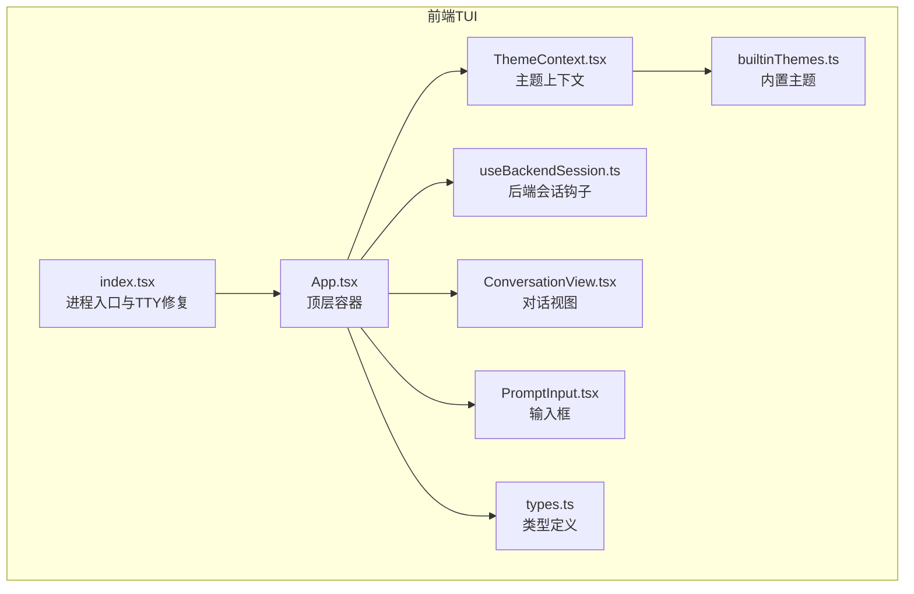
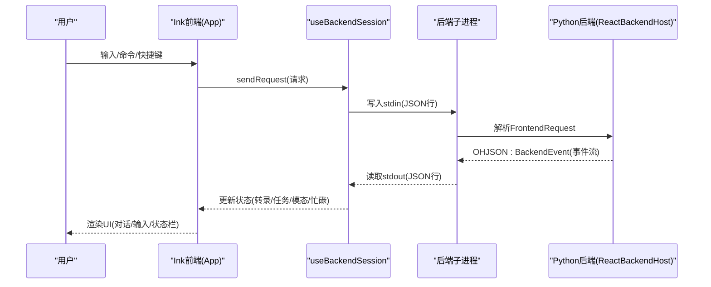
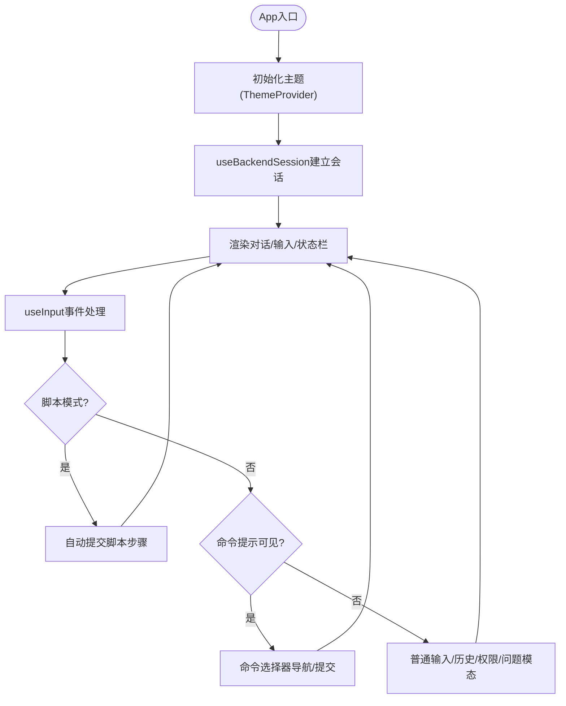
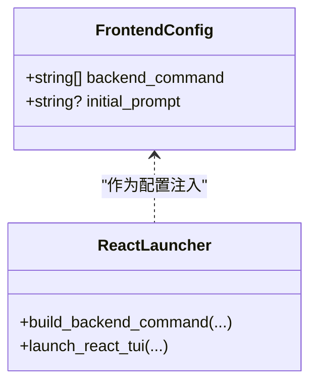
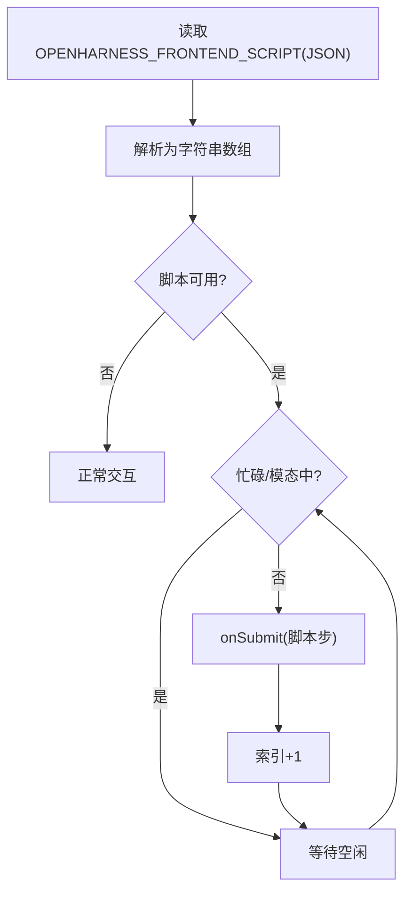
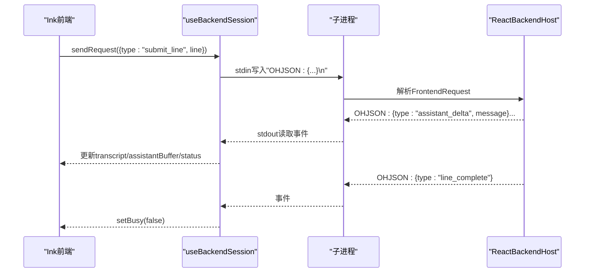
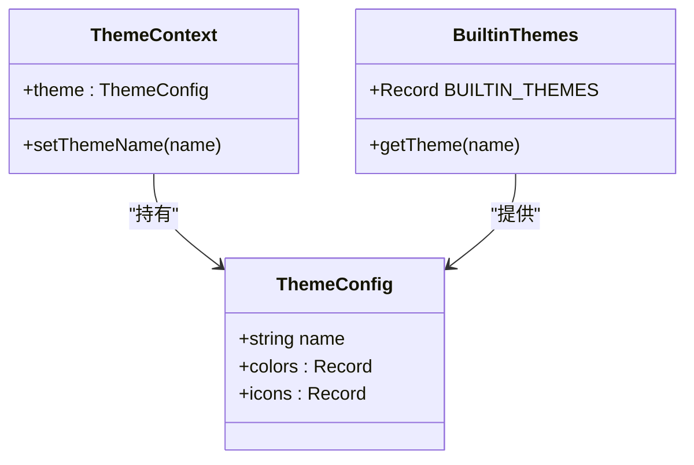
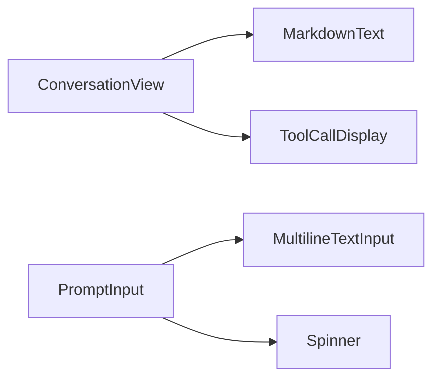
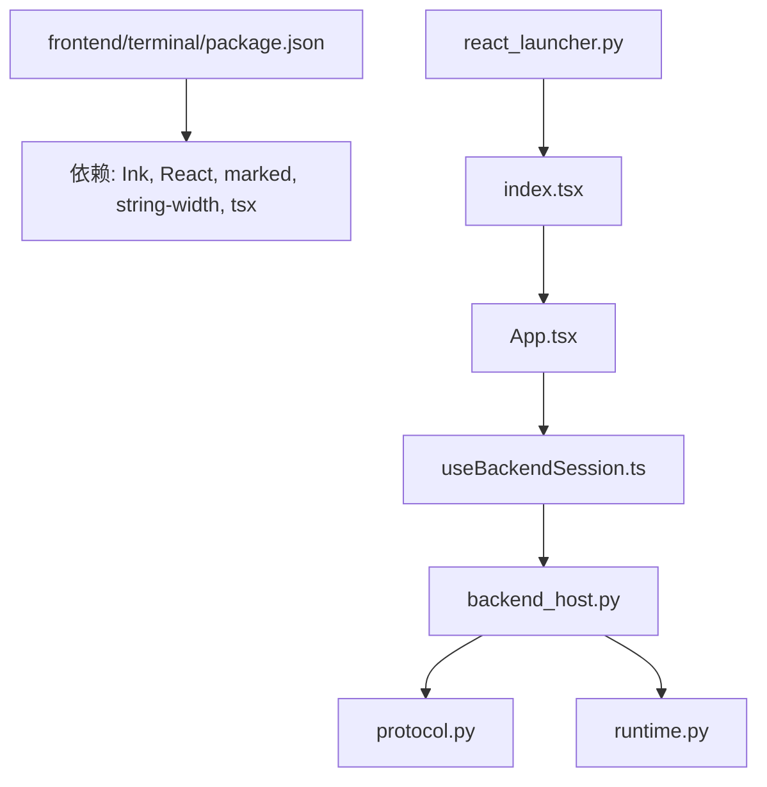

# React终端界面

<cite>
**本文档引用的文件**
- [frontend\terminal\src\App.tsx](file://frontend/terminal/src/App.tsx)
- [frontend\terminal\src\index.tsx](file://frontend/terminal/src/index.tsx)
- [frontend\terminal\src\types.ts](file://frontend/terminal/src/types.ts)
- [frontend\terminal\src\hooks\useBackendSession.ts](file://frontend/terminal/src/hooks/useBackendSession.ts)
- [frontend\terminal\src\theme\ThemeContext.tsx](file://frontend/terminal/src/theme/ThemeContext.tsx)
- [frontend\terminal\src\theme\builtinThemes.ts](file://frontend/terminal/src/theme/builtinThemes.ts)
- [frontend\terminal\src\components\ConversationView.tsx](file://frontend/terminal/src/components/ConversationView.tsx)
- [frontend\terminal\src\components\PromptInput.tsx](file://frontend/terminal/src/components/PromptInput.tsx)
- [frontend\terminal\package.json](file://frontend/terminal/package.json)
- [src\openharness\ui\react_launcher.py](file://src/openharness/ui/react_launcher.py)
- [src\openharness\ui\protocol.py](file://src/openharness/ui/protocol.py)
- [src\openharness\ui\backend_host.py](file://src/openharness/ui/backend_host.py)
- [src\openharness\ui\runtime.py](file://src/openharness/ui/runtime.py)
- [src\openharness\cli.py](file://src/openharness/cli.py)
</cite>

## 目录
1. [简介](#简介)
2. [项目结构](#项目结构)
3. [核心组件](#核心组件)
4. [架构总览](#架构总览)
5. [详细组件分析](#详细组件分析)
6. [依赖关系分析](#依赖关系分析)
7. [性能考虑](#性能考虑)
8. [故障排除指南](#故障排除指南)
9. [结论](#结论)
10. [附录](#附录)

## 简介
本文件面向React终端界面（TUI）的使用者与开发者，系统性阐述基于Ink框架的终端UI架构与实现细节。内容涵盖：
- Ink框架在终端UI中的应用与渲染模型
- App组件的职责划分：主题管理、状态管理、事件处理与脚本化自动化
- 前端配置系统与FrontendConfig类型定义
- 与后端的通信协议与WebSocket/JSON-流式传输机制
- 启动流程、命令行参数与环境变量配置
- 开发调试方法与性能优化建议

## 项目结构
前端TUI位于frontend/terminal目录，采用模块化组织：
- 入口与生命周期：index.tsx负责进程级错误防护、TTY恢复、终端输入流修复与渲染入口
- 应用主体：App.tsx作为顶层容器，组合主题、会话、输入、对话视图等组件
- 组件层：ConversationView、PromptInput等UI组件
- 钩子与会话：useBackendSession封装与后端的子进程通信与事件处理
- 主题系统：ThemeContext与builtinThemes提供主题切换与图标/颜色配置
- 类型定义：types.ts统一前后端数据契约

**图表来源**
- [frontend\terminal\src\index.tsx:1-82](file://frontend/terminal/src/index.tsx#L1-L82)
- [frontend\terminal\src\App.tsx:1-499](file://frontend/terminal/src/App.tsx#L1-L499)
- [frontend\terminal\src\theme\ThemeContext.tsx:1-41](file://frontend/terminal/src/theme/ThemeContext.tsx#L1-L41)
- [frontend\terminal\src\theme\builtinThemes.ts:1-162](file://frontend/terminal/src/theme/builtinThemes.ts#L1-L162)
- [frontend\terminal\src\types.ts:1-93](file://frontend/terminal/src/types.ts#L1-L93)
- [frontend\terminal\src\hooks\useBackendSession.ts:1-463](file://frontend/terminal/src/hooks/useBackendSession.ts#L1-L463)
- [frontend\terminal\src\components\ConversationView.tsx:1-191](file://frontend/terminal/src/components/ConversationView.tsx#L1-L191)
- [frontend\terminal\src\components\PromptInput.tsx:1-232](file://frontend/terminal/src/components/PromptInput.tsx#L1-L232)

**章节来源**
- [frontend\terminal\src\App.tsx:1-499](file://frontend/terminal/src/App.tsx#L1-L499)
- [frontend\terminal\src\index.tsx:1-82](file://frontend/terminal/src/index.tsx#L1-L82)
- [frontend\terminal\src\types.ts:1-93](file://frontend/terminal/src/types.ts#L1-L93)

## 核心组件
- App.tsx：顶层容器，负责主题初始化、状态聚合、键盘事件分发、脚本化自动化调度、与后端会话集成
- useBackendSession.ts：封装与后端子进程的通信，解析事件流，维护会话状态（转录、任务、模态、忙碌状态等）
- ThemeContext与builtinThemes：提供主题切换与图标/颜色配置
- ConversationView与PromptInput：分别负责对话渲染与输入交互
- index.tsx：进程级异常防护、TTY修复、渲染入口

**章节来源**
- [frontend\terminal\src\App.tsx:51-58](file://frontend/terminal/src/App.tsx#L51-L58)
- [frontend\terminal\src\hooks\useBackendSession.ts:24-462](file://frontend/terminal/src/hooks/useBackendSession.ts#L24-L462)
- [frontend\terminal\src\theme\ThemeContext.tsx:17-40](file://frontend/terminal/src/theme/ThemeContext.tsx#L17-L40)
- [frontend\terminal\src\theme\builtinThemes.ts:159-162](file://frontend/terminal/src/theme/builtinThemes.ts#L159-L162)
- [frontend\terminal\src\components\ConversationView.tsx:30-92](file://frontend/terminal/src/components/ConversationView.tsx#L30-L92)
- [frontend\terminal\src\components\PromptInput.tsx:192-231](file://frontend/terminal/src/components/PromptInput.tsx#L192-L231)
- [frontend\terminal\src\index.tsx:1-82](file://frontend/terminal/src/index.tsx#L1-L82)

## 架构总览
React终端界面采用“前端Ink应用 + 后端Python运行时”的双进程架构。前端通过子进程与后端通信，后端以JSON行（OHJSON:前缀）事件流驱动前端状态更新。

**图表来源**
- [frontend\terminal\src\hooks\useBackendSession.ts:107-113](file://frontend/terminal/src/hooks/useBackendSession.ts#L107-L113)
- [frontend\terminal\src\hooks\useBackendSession.ts:128-136](file://frontend/terminal/src/hooks/useBackendSession.ts#L128-L136)
- [src\openharness\ui\backend_host.py:182-210](file://src/openharness/ui/backend_host.py#L182-L210)
- [src\openharness\ui\protocol.py:15-34](file://src/openharness/ui/protocol.py#L15-L34)
- [src\openharness\ui\protocol.py:66-112](file://src/openharness/ui/protocol.py#L66-L112)

**章节来源**
- [frontend\terminal\src\App.tsx:178-396](file://frontend/terminal/src/App.tsx#L178-L396)
- [frontend\terminal\src\hooks\useBackendSession.ts:115-177](file://frontend/terminal/src/hooks/useBackendSession.ts#L115-L177)
- [src\openharness\ui\backend_host.py:88-180](file://src/openharness/ui/backend_host.py#L88-L180)
- [src\openharness\ui\protocol.py:66-112](file://src/openharness/ui/protocol.py#L66-L112)

## 详细组件分析

### App组件与主题管理
- 主题初始化：从FrontendConfig提取theme字段，传递给ThemeProvider
- 状态聚合：集中管理输入、历史、选择器、模态、脚本索引等
- 键盘事件：统一处理粘贴、Esc、Tab、上下箭头、Enter等；支持脚本化自动提交
- 与后端会话：通过useBackendSession获取转录、任务、状态、模态等数据，并触发请求

**图表来源**
- [frontend\terminal\src\App.tsx:51-80](file://frontend/terminal/src/App.tsx#L51-L80)
- [frontend\terminal\src\App.tsx:178-396](file://frontend/terminal/src/App.tsx#L178-L396)
- [frontend\terminal\src\App.tsx:398-412](file://frontend/terminal/src/App.tsx#L398-L412)

**章节来源**
- [frontend\terminal\src\App.tsx:51-80](file://frontend/terminal/src/App.tsx#L51-L80)
- [frontend\terminal\src\App.tsx:178-396](file://frontend/terminal/src/App.tsx#L178-L396)

### 前端配置系统与FrontendConfig
- FrontendConfig定义了后端命令数组与初始提示，用于启动后端子进程
- react_launcher.py负责构建后端命令、注入OPENHARNESS_FRONTEND_CONFIG环境变量并启动tsx

**图表来源**
- [frontend\terminal\src\types.ts:1-4](file://frontend/terminal/src/types.ts#L1-L4)
- [src\openharness\ui\react_launcher.py:81-111](file://src/openharness/ui/react_launcher.py#L81-L111)
- [src\openharness\ui\react_launcher.py:113-171](file://src/openharness/ui/react_launcher.py#L113-L171)

**章节来源**
- [frontend\terminal\src\types.ts:1-4](file://frontend/terminal/src/types.ts#L1-L4)
- [src\openharness\ui\react_launcher.py:144-160](file://src/openharness/ui/react_launcher.py#L144-L160)

### 脚本化自动化与OPENHARNESS_FRONTEND_SCRIPT
- OPENHARNESS_FRONTEND_SCRIPT为JSON数组字符串，按顺序自动提交命令
- App组件在非忙碌、非模态、非选择模态时，周期性执行脚本步骤
- 支持rawReturnSubmit模式下，回车直接提交当前输入或问题回答

**图表来源**
- [frontend\terminal\src\App.tsx:16-28](file://frontend/terminal/src/App.tsx#L16-L28)
- [frontend\terminal\src\App.tsx:398-412](file://frontend/terminal/src/App.tsx#L398-L412)
- [frontend\terminal\src\App.tsx:232-248](file://frontend/terminal/src/App.tsx#L232-L248)

**章节来源**
- [frontend\terminal\src\App.tsx:16-28](file://frontend/terminal/src/App.tsx#L16-L28)
- [frontend\terminal\src\App.tsx:398-412](file://frontend/terminal/src/App.tsx#L398-L412)

### 与后端的通信机制
- 协议前缀：OHJSON:，确保事件可识别
- 请求类型：FrontendRequest（submit_line、permission_response、question_response、list_sessions、select_command、apply_select_command、interrupt、shutdown）
- 事件类型：BackendEvent（ready、state_snapshot、tasks_snapshot、transcript_item、assistant_delta、assistant_complete、line_complete、tool_started、tool_completed、clear_transcript、modal_request、select_request、todo_update、plan_mode_change、swarm_status、error、shutdown）

**图表来源**
- [frontend\terminal\src\hooks\useBackendSession.ts:17-22](file://frontend/terminal/src/hooks/useBackendSession.ts#L17-L22)
- [frontend\terminal\src\hooks\useBackendSession.ts:107-113](file://frontend/terminal/src/hooks/useBackendSession.ts#L107-L113)
- [frontend\terminal\src\hooks\useBackendSession.ts:128-136](file://frontend/terminal/src/hooks/useBackendSession.ts#L128-L136)
- [src\openharness\ui\protocol.py:15-34](file://src/openharness/ui/protocol.py#L15-L34)
- [src\openharness\ui\protocol.py:66-112](file://src/openharness/ui/protocol.py#L66-L112)
- [src\openharness\ui\backend_host.py:182-210](file://src/openharness/ui/backend_host.py#L182-L210)

**章节来源**
- [frontend\terminal\src\hooks\useBackendSession.ts:17-22](file://frontend/terminal/src/hooks/useBackendSession.ts#L17-L22)
- [src\openharness\ui\protocol.py:15-34](file://src/openharness/ui/protocol.py#L15-L34)
- [src\openharness\ui\protocol.py:66-112](file://src/openharness/ui/protocol.py#L66-L112)
- [src\openharness\ui\backend_host.py:182-210](file://src/openharness/ui/backend_host.py#L182-L210)

### 主题系统与状态管理
- ThemeContext提供全局主题状态与切换函数
- builtinThemes定义默认、深色、极简、赛博朋克、Solarized等主题
- App组件监听后端状态中的theme字段动态切换主题

**图表来源**
- [frontend\terminal\src\theme\ThemeContext.tsx:7-15](file://frontend/terminal/src/theme/ThemeContext.tsx#L7-L15)
- [frontend\terminal\src\theme\builtinThemes.ts:1-24](file://frontend/terminal/src/theme/builtinThemes.ts#L1-L24)
- [frontend\terminal\src\theme\builtinThemes.ts:151-157](file://frontend/terminal/src/theme/builtinThemes.ts#L151-L157)
- [frontend\terminal\src\App.tsx:82-86](file://frontend/terminal/src/App.tsx#L82-L86)

**章节来源**
- [frontend\terminal\src\theme\ThemeContext.tsx:17-40](file://frontend/terminal/src/theme/ThemeContext.tsx#L17-L40)
- [frontend\terminal\src\theme\builtinThemes.ts:159-162](file://frontend/terminal/src/theme/builtinThemes.ts#L159-L162)
- [frontend\terminal\src\App.tsx:82-86](file://frontend/terminal/src/App.tsx#L82-L86)

### 对话视图与输入组件
- ConversationView：按角色渲染消息，支持工具调用成对显示与Markdown渲染；支持Codex风格输出
- PromptInput：多行文本输入，支持光标移动、删除、换行、Shift+Enter换行、Enter提交

**图表来源**
- [frontend\terminal\src\components\ConversationView.tsx:30-92](file://frontend/terminal/src/components/ConversationView.tsx#L30-L92)
- [frontend\terminal\src\components\PromptInput.tsx:19-191](file://frontend/terminal/src/components/PromptInput.tsx#L19-L191)

**章节来源**
- [frontend\terminal\src\components\ConversationView.tsx:30-92](file://frontend/terminal/src/components/ConversationView.tsx#L30-L92)
- [frontend\terminal\src\components\PromptInput.tsx:192-231](file://frontend/terminal/src/components/PromptInput.tsx#L192-L231)

## 依赖关系分析
- 前端依赖：Ink、React、marked、string-width、ink-text-input
- 启动链路：react_launcher.py解析前端目录、安装依赖、构建OPENHARNESS_FRONTEND_CONFIG、调用tsx启动index.tsx
- 运行时：runtime.py装配API客户端、工具注册表、查询引擎、状态存储等

**图表来源**
- [frontend\terminal\package.json:8-21](file://frontend/terminal/package.json#L8-L21)
- [src\openharness\ui\react_launcher.py:131-171](file://src/openharness/ui/react_launcher.py#L131-L171)
- [frontend\terminal\src\index.tsx:81-82](file://frontend/terminal/src/index.tsx#L81-L82)
- [frontend\terminal\src\App.tsx:12-12](file://frontend/terminal/src/App.tsx#L12-L12)
- [frontend\terminal\src\hooks\useBackendSession.ts:1-16](file://frontend/terminal/src/hooks/useBackendSession.ts#L1-L16)
- [src\openharness\ui\backend_host.py:36-38](file://src/openharness/ui/backend_host.py#L36-L38)
- [src\openharness\ui\protocol.py:1-13](file://src/openharness/ui/protocol.py#L1-L13)
- [src\openharness\ui\runtime.py:80-101](file://src/openharness/ui/runtime.py#L80-L101)

**章节来源**
- [frontend\terminal\package.json:1-22](file://frontend/terminal/package.json#L1-L22)
- [src\openharness\ui\react_launcher.py:131-171](file://src/openharness/ui/react_launcher.py#L131-L171)

## 性能考虑
- 流式事件缓冲：assistant_delta与transcript_item采用定时器批量刷新，避免高频重渲染
- useDeferredValue：对大体量转录与辅助缓冲使用延迟渲染，提升主UI流畅度
- 子进程生命周期：在父进程退出/中断时清理子进程组，防止僵尸进程
- TTY修复：在WSL/Windows场景下尝试/dev/tty直连，保证useInput原始模式可用

**章节来源**
- [frontend\terminal\src\hooks\useBackendSession.ts:18-21](file://frontend/terminal/src/hooks/useBackendSession.ts#L18-L21)
- [frontend\terminal\src\hooks\useBackendSession.ts:56-87](file://frontend/terminal/src/hooks/useBackendSession.ts#L56-L87)
- [frontend\terminal\src\App.tsx:73-79](file://frontend/terminal/src/App.tsx#L73-L79)
- [frontend\terminal\src\index.tsx:58-73](file://frontend/terminal/src/index.tsx#L58-L73)

## 故障排除指南
- EIO/EAGAIN异常：前端入口捕获stdin错误与setRawMode异常，直接退出避免崩溃
- SIGINT/SIGTERM：恢复光标可见并优雅退出
- TTY丢失：在非TTY环境下尝试打开/dev/tty，若失败则回退到标准stdin
- 后端异常：后端事件流中出现error事件时，前端清空助手缓冲并重置忙碌状态
- 权限/问题模态：通过modal_request与permission_response/question_response进行交互

**章节来源**
- [frontend\terminal\src\index.tsx:9-38](file://frontend/terminal/src/index.tsx#L9-L38)
- [frontend\terminal\src\index.tsx:45-56](file://frontend/terminal/src/index.tsx#L45-L56)
- [frontend\terminal\src\hooks\useBackendSession.ts:391-398](file://frontend/terminal/src/hooks/useBackendSession.ts#L391-L398)
- [src\openharness\ui\backend_host.py:734-776](file://src/openharness/ui/backend_host.py#L734-L776)

## 结论
该React终端界面以Ink为核心，结合自定义协议与子进程通信，实现了高性能、可扩展的终端交互体验。通过主题系统、脚本化自动化、完善的模态与状态管理，既满足日常使用，也为自动化测试与CI场景提供了基础能力。建议在生产环境中关注TTY稳定性、事件流缓冲策略与权限模态的用户体验。

## 附录

### 启动与配置说明
- 启动方式：通过react_launcher.py构建后端命令并注入OPENHARNESS_FRONTEND_CONFIG，随后调用tsx启动前端
- 环境变量：
  - OPENHARNESS_FRONTEND_CONFIG：包含backend_command与initial_prompt
  - OPENHARNESS_FRONTEND_SCRIPT：JSON数组字符串，用于脚本化自动化
  - OPENHARNESS_FRONTEND_RAW_RETURN：启用后回车直接提交或回答
- 命令行参数：由react_launcher.py的launch_react_tui函数映射为后端命令行参数

**章节来源**
- [src\openharness\ui\react_launcher.py:113-171](file://src/openharness/ui/react_launcher.py#L113-L171)
- [frontend\terminal\src\index.tsx:40-40](file://frontend/terminal/src/index.tsx#L40-L40)
- [frontend\terminal\src\App.tsx:16-28](file://frontend/terminal/src/App.tsx#L16-L28)

### 关键数据模型
- FrontendConfig：后端命令与初始提示
- TranscriptItem：对话项（role、text、tool相关字段）
- TaskSnapshot：任务快照
- BackendEvent/FrontendRequest：前后端通信契约

**章节来源**
- [frontend\terminal\src\types.ts:1-93](file://frontend/terminal/src/types.ts#L1-L93)
- [src\openharness\ui\protocol.py:15-112](file://src/openharness/ui/protocol.py#L15-L112)