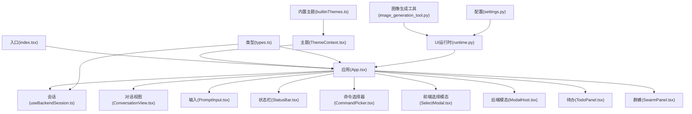
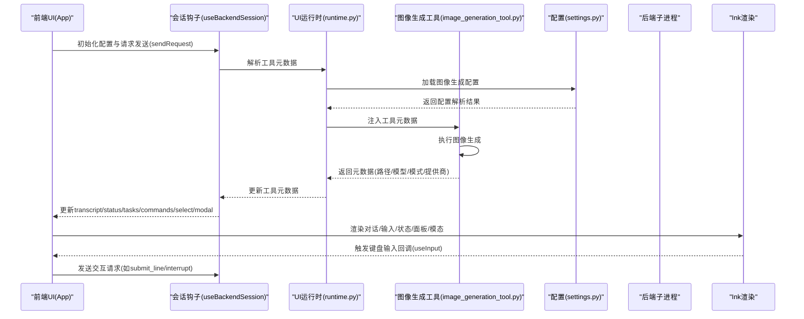
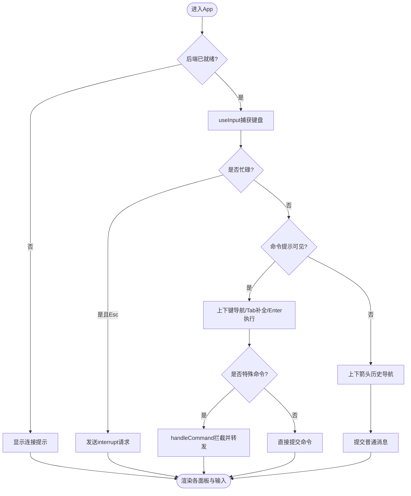
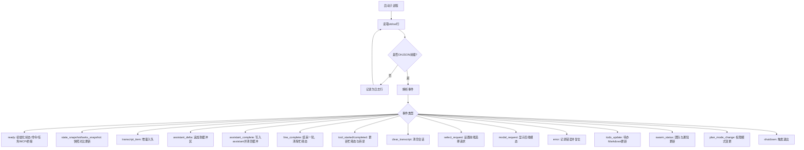
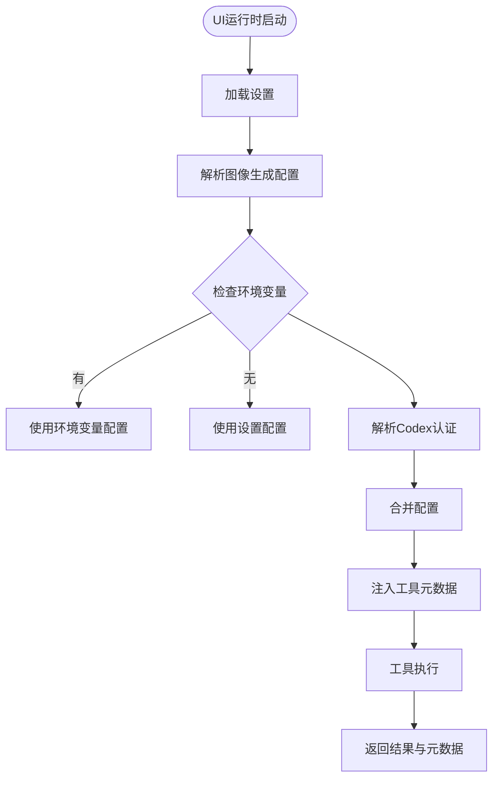
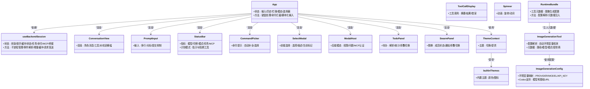
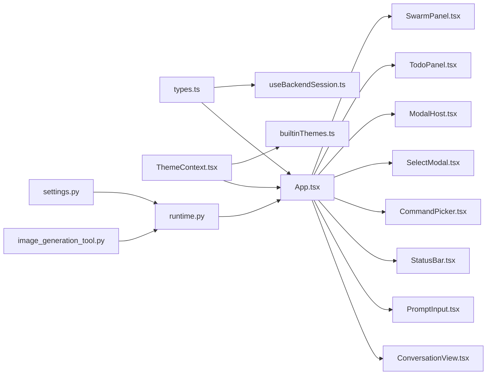

# 用户界面

<cite>
**本文引用的文件**
- [frontend/terminal/src/App.tsx](file://frontend/terminal/src/App.tsx)
- [frontend/terminal/src/index.tsx](file://frontend/terminal/src/index.tsx)
- [frontend/terminal/src/components/Composer.tsx](file://frontend/terminal/src/components/Composer.tsx)
- [frontend/terminal/src/components/ConversationView.tsx](file://frontend/terminal/src/components/ConversationView.tsx)
- [frontend/terminal/src/components/PromptInput.tsx](file://frontend/terminal/src/components/PromptInput.tsx)
- [frontend/terminal/src/components/StatusBar.tsx](file://frontend/terminal/src/components/StatusBar.tsx)
- [frontend/terminal/src/components/CommandPicker.tsx](file://frontend/terminal/src/components/CommandPicker.tsx)
- [frontend/terminal/src/components/SelectModal.tsx](file://frontend/terminal/src/components/SelectModal.tsx)
- [frontend/terminal/src/components/ModalHost.tsx](file://frontend/terminal/src/components/ModalHost.tsx)
- [frontend/terminal/src/components/SidePanel.tsx](file://frontend/terminal/src/components/SidePanel.tsx)
- [frontend/terminal/src/components/TodoPanel.tsx](file://frontend/terminal/src/components/TodoPanel.tsx)
- [frontend/terminal/src/components/SwarmPanel.tsx](file://frontend/terminal/src/components/SwarmPanel.tsx)
- [frontend/terminal/src/components/ToolCallDisplay.tsx](file://frontend/terminal/src/components/ToolCallDisplay.tsx)
- [frontend/terminal/src/components/Spinner.tsx](file://frontend/terminal/src/components/Spinner.tsx)
- [frontend/terminal/src/theme/ThemeContext.tsx](file://frontend/terminal/src/theme/ThemeContext.tsx)
- [frontend/terminal/src/theme/builtinThemes.ts](file://frontend/terminal/src/theme/builtinThemes.ts)
- [frontend/terminal/src/hooks/useBackendSession.ts](file://frontend/terminal/src/hooks/useBackendSession.ts)
- [frontend/terminal/src/types.ts](file://frontend/terminal/src/types.ts)
- [src/openharness/ui/runtime.py](file://src/openharness/ui/runtime.py)
- [src/openharness/tools/image_generation_tool.py](file://src/openharness/tools/image_generation_tool.py)
- [src/openharness/config/settings.py](file://src/openharness/config/settings.py)
</cite>

## 目录
1. [简介](#简介)
2. [项目结构](#项目结构)
3. [核心组件](#核心组件)
4. [架构总览](#架构总览)
5. [详细组件分析](#详细组件分析)
6. [依赖关系分析](#依赖关系分析)
7. [性能考量](#性能考量)
8. [故障排查指南](#故障排查指南)
9. [结论](#结论)
10. [附录](#附录)

## 简介
本文件面向OpenHarness的React终端界面（TUI）系统，系统基于Ink渲染引擎在TTY环境中构建，采用前后端分离的协议式通信：前端通过子进程与后端引擎交互，接收事件驱动的增量更新，实现高实时性的对话与工具调用展示。本文档覆盖组件架构、交互流程、命令选择器、权限与模态对话框、动画反馈、键盘快捷键、主题与定制、与后端的通信机制以及开发调试建议。

**更新** 本次更新反映了UI运行时系统的增强，包括自动图像生成配置解析和增强的工具元数据处理能力，提升了图像生成工具的配置灵活性和元数据传递效率。

## 项目结构
前端TUI位于frontend/terminal目录，采用按功能分层的组织方式：
- 入口与渲染：index.tsx负责终端环境保护、TTY恢复、渲染入口
- 应用根组件：App.tsx承载全局状态、键盘输入处理、命令选择器、模态与面板渲染
- 组件层：ConversationView、PromptInput、StatusBar、CommandPicker、SelectModal、ModalHost、TodoPanel、SwarmPanel、ToolCallDisplay、Spinner等
- 主题系统：ThemeContext与builtinThemes提供主题切换与图标/颜色配置
- 后端会话钩子：useBackendSession封装子进程、事件解析、流式增量缓冲与状态快照
- 类型定义：types.ts统一前后端事件与数据结构

**图表来源**
- [frontend/terminal/src/index.tsx:1-82](file://frontend/terminal/src/index.tsx#L1-L82)
- [frontend/terminal/src/App.tsx:1-499](file://frontend/terminal/src/App.tsx#L1-L499)
- [frontend/terminal/src/hooks/useBackendSession.ts:1-463](file://frontend/terminal/src/hooks/useBackendSession.ts#L1-L463)
- [frontend/terminal/src/theme/ThemeContext.tsx:1-41](file://frontend/terminal/src/theme/ThemeContext.tsx#L1-L41)
- [frontend/terminal/src/theme/builtinThemes.ts:1-162](file://frontend/terminal/src/theme/builtinThemes.ts#L1-L162)
- [frontend/terminal/src/types.ts:1-93](file://frontend/terminal/src/types.ts#L1-L93)
- [src/openharness/ui/runtime.py:1-749](file://src/openharness/ui/runtime.py#L1-L749)
- [src/openharness/tools/image_generation_tool.py:1-357](file://src/openharness/tools/image_generation_tool.py#L1-L357)
- [src/openharness/config/settings.py:470-669](file://src/openharness/config/settings.py#L470-L669)

**章节来源**
- [frontend/terminal/src/index.tsx:1-82](file://frontend/terminal/src/index.tsx#L1-L82)
- [frontend/terminal/src/App.tsx:1-499](file://frontend/terminal/src/App.tsx#L1-L499)

## 核心组件
- 应用根组件 App：集中管理输入、历史、命令提示、模态、选择器、脚本化自动化、主题联动与后端会话状态
- 会话钩子 useBackendSession：负责子进程生命周期、事件解析、增量缓冲、状态快照、请求发送
- 对话视图 ConversationView：按角色渲染消息、工具调用对、欢迎横幅、支持两种输出风格
- 输入 PromptInput：多行文本输入、光标控制、回车换行、提交抑制、忙碌态显示
- 状态栏 StatusBar：模型、令牌、模式、任务数、MCP连接数、计划模式指示与阻断工具提醒
- 命令选择器 CommandPicker：斜杠命令自动补全与选择
- 前端选择模态 SelectModal：用于后端触发的选择请求（如会话列表）
- 后端模态 ModalHost：权限确认、问题输入、MCP认证等
- 待办 TodoPanel：解析Markdown任务清单、折叠/展开切换
- 群蜂 SwarmPanel：团队成员状态与最近通知
- 工具调用显示 ToolCallDisplay：工具名、摘要、结果统计或错误行
- 加载动画 Spinner：旋转动画与动词轮播
- 主题系统 ThemeContext + builtinThemes：内置主题与动态切换
- UI运行时系统：负责工具元数据解析、配置合并和运行时状态管理
- 图像生成工具：支持自动配置解析和增强的元数据处理

**章节来源**
- [frontend/terminal/src/App.tsx:51-499](file://frontend/terminal/src/App.tsx#L51-L499)
- [frontend/terminal/src/hooks/useBackendSession.ts:24-463](file://frontend/terminal/src/hooks/useBackendSession.ts#L24-L463)
- [frontend/terminal/src/components/ConversationView.tsx:1-191](file://frontend/terminal/src/components/ConversationView.tsx#L1-L191)
- [frontend/terminal/src/components/PromptInput.tsx:1-232](file://frontend/terminal/src/components/PromptInput.tsx#L1-L232)
- [frontend/terminal/src/components/StatusBar.tsx:1-120](file://frontend/terminal/src/components/StatusBar.tsx#L1-L120)
- [frontend/terminal/src/components/CommandPicker.tsx:1-36](file://frontend/terminal/src/components/CommandPicker.tsx#L1-L36)
- [frontend/terminal/src/components/SelectModal.tsx:1-45](file://frontend/terminal/src/components/SelectModal.tsx#L1-L45)
- [frontend/terminal/src/components/ModalHost.tsx:1-152](file://frontend/terminal/src/components/ModalHost.tsx#L1-L152)
- [frontend/terminal/src/components/TodoPanel.tsx:1-92](file://frontend/terminal/src/components/TodoPanel.tsx#L1-L92)
- [frontend/terminal/src/components/SwarmPanel.tsx:1-128](file://frontend/terminal/src/components/SwarmPanel.tsx#L1-L128)
- [frontend/terminal/src/components/ToolCallDisplay.tsx:1-149](file://frontend/terminal/src/components/ToolCallDisplay.tsx#L1-L149)
- [frontend/terminal/src/components/Spinner.tsx:1-48](file://frontend/terminal/src/components/Spinner.tsx#L1-L48)
- [frontend/terminal/src/theme/ThemeContext.tsx:1-41](file://frontend/terminal/src/theme/ThemeContext.tsx#L1-L41)
- [frontend/terminal/src/theme/builtinThemes.ts:1-162](file://frontend/terminal/src/theme/builtinThemes.ts#L1-L162)
- [src/openharness/ui/runtime.py:1-749](file://src/openharness/ui/runtime.py#L1-L749)
- [src/openharness/tools/image_generation_tool.py:1-357](file://src/openharness/tools/image_generation_tool.py#L1-L357)

## 架构总览
前端以App为调度中心，通过useBackendSession与后端建立双向通信。后端以"OHJSON:"前缀事件流推送状态、转录项、任务、MCP与桥接会话快照、选择请求与模态请求等；前端进行增量缓冲与合并渲染，避免高频重绘导致闪烁。

**更新** UI运行时系统现在集成了增强的工具元数据处理机制，特别是图像生成工具的配置解析和元数据传递，确保工具调用的完整信息能够在UI中正确显示和处理。

**图表来源**
- [frontend/terminal/src/App.tsx:178-396](file://frontend/terminal/src/App.tsx#L178-L396)
- [frontend/terminal/src/hooks/useBackendSession.ts:107-177](file://frontend/terminal/src/hooks/useBackendSession.ts#L107-L177)
- [frontend/terminal/src/hooks/useBackendSession.ts:179-435](file://frontend/terminal/src/hooks/useBackendSession.ts#L179-L435)
- [src/openharness/ui/runtime.py:53-89](file://src/openharness/ui/runtime.py#L53-L89)
- [src/openharness/tools/image_generation_tool.py:87-126](file://src/openharness/tools/image_generation_tool.py#L87-L126)
- [src/openharness/config/settings.py:473-502](file://src/openharness/config/settings.py#L473-L502)

## 详细组件分析

### 应用与输入处理（App）
- 职责：全局状态管理、键盘输入拦截与路由、命令提示与选择器、脚本化自动化、主题联动、后端会话集成
- 关键点：
  - 斜杠命令过滤与提示生成
  - 特殊命令拦截（如/permissions、/resume、/plan）
  - 选择模态与后端选择请求的桥接
  - 忙碌态、历史导航、粘贴处理、Raw模式异常保护
  - 脚本化输入（OPENHARNESS_FRONTEND_SCRIPT）

**图表来源**
- [frontend/terminal/src/App.tsx:178-396](file://frontend/terminal/src/App.tsx#L178-L396)

**章节来源**
- [frontend/terminal/src/App.tsx:51-499](file://frontend/terminal/src/App.tsx#L51-L499)

### 会话钩子（useBackendSession）
- 职责：子进程生命周期、事件解析、增量缓冲、状态快照、请求发送
- 关键点：
  - 事件类型覆盖：ready/state_snapshot/tasks_snapshot/transcript_item/assistant_delta/assistant_complete/line_complete/tool_started/tool_completed/clear_transcript/select_request/modal_request/error/todo_update/swarm_status/plan_mode_change/shutdown
  - 流式增量：助手文本与转录项分别设置flush策略，避免高频重绘
  - 安全退出：父进程退出时清理子进程组，防止孤儿进程

**图表来源**
- [frontend/terminal/src/hooks/useBackendSession.ts:107-177](file://frontend/terminal/src/hooks/useBackendSession.ts#L107-L177)
- [frontend/terminal/src/hooks/useBackendSession.ts:179-435](file://frontend/terminal/src/hooks/useBackendSession.ts#L179-L435)

**章节来源**
- [frontend/terminal/src/hooks/useBackendSession.ts:24-463](file://frontend/terminal/src/hooks/useBackendSession.ts#L24-L463)

### 对话视图（ConversationView）
- 职责：按角色渲染消息，工具调用成对显示，支持两种输出风格（默认与codex），显示助手增量缓冲
- 关键点：
  - 工具对分组：tool与tool_result配对显示
  - 输出风格：codex风格下简化显示与行对齐
  - 欢迎横幅：首次进入且无消息时显示
  - **增强** 工具元数据处理：支持图像生成工具的路径、模型、模式和提供商信息显示

**章节来源**
- [frontend/terminal/src/components/ConversationView.tsx:1-191](file://frontend/terminal/src/components/ConversationView.tsx#L1-L191)

### 输入组件（PromptInput）
- 职责：多行文本输入、光标定位、退格/删除处理、Shift+Enter换行、提交抑制
- 关键点：
  - 自定义MultilineTextInput：内部事件流处理、光标偏移维护、输入序列识别
  - 提交抑制：当命令选择器可见时抑制直接提交
  - 忙碌态：显示Spinner与状态标签

**章节来源**
- [frontend/terminal/src/components/PromptInput.tsx:1-232](file://frontend/terminal/src/components/PromptInput.tsx#L1-L232)

### 状态栏（StatusBar）
- 职责：显示模型、令牌用量、权限模式、任务数、MCP连接数；计划模式指示与阻断工具高亮
- 关键点：
  - 计划模式闪烁提示与阻断工具检测
  - 数字格式化（k缩写）

**章节来源**
- [frontend/terminal/src/components/StatusBar.tsx:1-120](file://frontend/terminal/src/components/StatusBar.tsx#L1-L120)

### 命令选择器（CommandPicker）
- 职责：斜杠命令自动补全与选择，上下导航、Enter执行、Esc关闭
- 关键点：
  - 与App中的命令提示逻辑配合
  - 选中项高亮与提示

**章节来源**
- [frontend/terminal/src/components/CommandPicker.tsx:1-36](file://frontend/terminal/src/components/CommandPicker.tsx#L1-L36)

### 前端选择模态（SelectModal）
- 职责：处理后端触发的选择请求（如/resume），支持当前值标记与描述
- 关键点：
  - 上下导航、Enter选择、Esc取消
  - 数字键快速选择

**章节来源**
- [frontend/terminal/src/components/SelectModal.tsx:1-45](file://frontend/terminal/src/components/SelectModal.tsx#L1-L45)

### 后端模态（ModalHost）
- 职责：权限确认、问题输入（支持多行拼接）、MCP认证
- 关键点：
  - 问题输入支持Shift+Enter追加行
  - 动画等待提示

**章节来源**
- [frontend/terminal/src/components/ModalHost.tsx:1-152](file://frontend/terminal/src/components/ModalHost.tsx#L1-L152)

### 待办面板（TodoPanel）
- 职责：解析Markdown任务清单，支持折叠/展开切换
- 关键点：
  - Ctrl+T切换紧凑/完整视图
  - 统计完成/总数

**章节来源**
- [frontend/terminal/src/components/TodoPanel.tsx:1-92](file://frontend/terminal/src/components/TodoPanel.tsx#L1-L92)

### 群蜂面板（SwarmPanel）
- 职责：展示团队成员状态与最近通知，支持折叠/展开
- 关键点：
  - Ctrl+W切换视图
  - 状态图标与耗时格式化

**章节来源**
- [frontend/terminal/src/components/SwarmPanel.tsx:1-128](file://frontend/terminal/src/components/SwarmPanel.tsx#L1-L128)

### 工具调用显示（ToolCallDisplay）
- 职责：工具调用摘要、结果统计/错误行截断、不同输出风格
- 关键点：
  - 不同工具的输入摘要策略
  - 错误行截断与前缀对齐
  - **增强** 支持图像生成工具的详细元数据显示

**章节来源**
- [frontend/terminal/src/components/ToolCallDisplay.tsx:1-149](file://frontend/terminal/src/components/ToolCallDisplay.tsx#L1-L149)

### 加载动画（Spinner）
- 职责：旋转动画与动词轮播，适配Windows安全字符集
- 关键点：
  - 主题图标数组与平台差异

**章节来源**
- [frontend/terminal/src/components/Spinner.tsx:1-48](file://frontend/terminal/src/components/Spinner.tsx#L1-L48)

### 主题系统（ThemeContext + builtinThemes）
- 职责：主题上下文提供、内置主题注册与切换、图标与颜色配置
- 关键点：
  - 默认、深色、极简、赛博朋克、Solarized五套主题
  - 图标数组与颜色映射

**章节来源**
- [frontend/terminal/src/theme/ThemeContext.tsx:1-41](file://frontend/terminal/src/theme/ThemeContext.tsx#L1-L41)
- [frontend/terminal/src/theme/builtinThemes.ts:1-162](file://frontend/terminal/src/theme/builtinThemes.ts#L1-L162)

### 侧边栏（SidePanel）
- 职责：聚合状态、任务、MCP、桥接会话与命令提示
- 关键点：
  - 多面板组合展示

**章节来源**
- [frontend/terminal/src/components/SidePanel.tsx:1-153](file://frontend/terminal/src/components/SidePanel.tsx#L1-L153)

### UI运行时系统（增强）
- 职责：负责工具元数据解析、配置合并和运行时状态管理
- 关键点：
  - **新增** 自动图像生成配置解析：从settings、环境变量和Codex认证中解析配置
  - **增强** 工具元数据处理：支持图像生成工具的完整元数据传递
  - 配置优先级：settings字段 > 环境变量 > 默认值
  - Codex认证集成：自动获取Codex订阅认证令牌

**图表来源**
- [src/openharness/ui/runtime.py:53-89](file://src/openharness/ui/runtime.py#L53-L89)
- [src/openharness/config/settings.py:473-502](file://src/openharness/config/settings.py#L473-L502)

**章节来源**
- [src/openharness/ui/runtime.py:1-749](file://src/openharness/ui/runtime.py#L1-L749)

### 图像生成工具（增强）
- 职责：支持自动配置解析和增强的元数据处理
- 关键点：
  - **新增** 自动配置解析：从context.metadata获取配置
  - **增强** 元数据结构：包含paths、model、mode、provider等详细信息
  - 支持OpenAI和Codex两种提供商
  - 编辑模式支持：基于参考图像的编辑功能
  - 环境变量支持：通过OPENHARNESS_IMAGE_GENERATION_*系列环境变量配置

**章节来源**
- [src/openharness/tools/image_generation_tool.py:1-357](file://src/openharness/tools/image_generation_tool.py#L1-L357)

### 配置系统（增强）
- 职责：提供图像生成工具的配置管理
- 关键点：
  - **新增** ImageGenerationConfig类：集中管理图像生成配置
  - 环境变量映射：OPENHARNESS_IMAGE_GENERATION_PROVIDER、MODEL、API_KEY、BASE_URL等
  - Codex支持：codex_model和codex_base_url配置
  - is_configured属性：判断配置是否完整

**章节来源**
- [src/openharness/config/settings.py:473-502](file://src/openharness/config/settings.py#L473-L502)

### 组件类图（代码级）

**图表来源**
- [frontend/terminal/src/App.tsx:51-499](file://frontend/terminal/src/App.tsx#L51-L499)
- [frontend/terminal/src/hooks/useBackendSession.ts:24-463](file://frontend/terminal/src/hooks/useBackendSession.ts#L24-L463)
- [frontend/terminal/src/theme/ThemeContext.tsx:1-41](file://frontend/terminal/src/theme/ThemeContext.tsx#L1-L41)
- [frontend/terminal/src/theme/builtinThemes.ts:1-162](file://frontend/terminal/src/theme/builtinThemes.ts#L1-L162)
- [src/openharness/ui/runtime.py:119-190](file://src/openharness/ui/runtime.py#L119-L190)
- [src/openharness/tools/image_generation_tool.py:74-126](file://src/openharness/tools/image_generation_tool.py#L74-L126)
- [src/openharness/config/settings.py:473-502](file://src/openharness/config/settings.py#L473-L502)

## 依赖关系分析
- 组件耦合：
  - App高度聚合，依赖useBackendSession提供的状态与方法
  - 组件间通过props传递数据，低耦合高内聚
  - **新增** UI运行时系统与图像生成工具的紧密集成
- 外部依赖：
  - Ink：终端渲染与输入处理
  - ink-text-input：输入组件
  - chalk：文本反色高亮
- 协议契约：
  - 事件字段由types.ts统一定义，前后端一致
  - **增强** 工具元数据协议支持更丰富的配置信息

**图表来源**
- [frontend/terminal/src/types.ts:1-93](file://frontend/terminal/src/types.ts#L1-L93)
- [frontend/terminal/src/App.tsx:1-499](file://frontend/terminal/src/App.tsx#L1-L499)
- [frontend/terminal/src/hooks/useBackendSession.ts:1-463](file://frontend/terminal/src/hooks/useBackendSession.ts#L1-L463)
- [frontend/terminal/src/theme/ThemeContext.tsx:1-41](file://frontend/terminal/src/theme/ThemeContext.tsx#L1-L41)
- [frontend/terminal/src/theme/builtinThemes.ts:1-162](file://frontend/terminal/src/theme/builtinThemes.ts#L1-L162)
- [src/openharness/ui/runtime.py:1-749](file://src/openharness/ui/runtime.py#L1-L749)
- [src/openharness/tools/image_generation_tool.py:1-357](file://src/openharness/tools/image_generation_tool.py#L1-L357)
- [src/openharness/config/settings.py:470-669](file://src/openharness/config/settings.py#L470-L669)

**章节来源**
- [frontend/terminal/src/types.ts:1-93](file://frontend/terminal/src/types.ts#L1-L93)

## 性能考量
- 增量缓冲与批处理：
  - 助手增量与转录项分别设置flush策略，降低渲染频率
- Deferred渲染：
  - 使用useDeferredValue延迟非关键路径渲染，提升主输入体验
- 忙碌态与节流：
  - busyLabel与busy状态配合，避免重复提交与闪烁
- 平台兼容：
  - Windows安全帧字符集与TTY恢复，减少异常导致的崩溃
- **新增** 配置缓存：
  - UI运行时系统缓存解析后的配置，避免重复计算
- **新增** 元数据优化：
  - 工具元数据按需传递，减少不必要的渲染开销

**章节来源**
- [frontend/terminal/src/hooks/useBackendSession.ts:48-106](file://frontend/terminal/src/hooks/useBackendSession.ts#L48-L106)
- [frontend/terminal/src/App.tsx:73-79](file://frontend/terminal/src/App.tsx#L73-L79)
- [src/openharness/ui/runtime.py:53-89](file://src/openharness/ui/runtime.py#L53-L89)

## 故障排查指南
- 终端Raw模式异常：
  - index.tsx对EIO/EAGAIN进行保护，必要时恢复光标并退出
- 输入卡死或无响应：
  - 检查busy状态与模态遮挡；确认键盘事件未被抑制
- 命令选择器不出现：
  - 确认输入以/开头且后端commands存在匹配
- 选择模态无法关闭：
  - Esc键关闭；数字键快速选择
- 后端模态（权限/问题/MCP）：
  - 权限：y/n或Esc；问题：Shift+Enter追加行，Enter提交
- 会话未就绪：
  - 等待"Connecting to backend..."消失后再输入
- **新增** 图像生成配置问题：
  - 检查OPENHARNESS_IMAGE_GENERATION_API_KEY环境变量
  - 确认provider设置为"openai"或"codex"
  - 验证Codex认证令牌的有效性
- **新增** 工具元数据显示异常：
  - 确认工具执行成功并返回元数据
  - 检查UI运行时的元数据注入过程

**章节来源**
- [frontend/terminal/src/index.tsx:9-38](file://frontend/terminal/src/index.tsx#L9-L38)
- [frontend/terminal/src/App.tsx:178-396](file://frontend/terminal/src/App.tsx#L178-L396)
- [frontend/terminal/src/components/ModalHost.tsx:1-152](file://frontend/terminal/src/components/ModalHost.tsx#L1-L152)
- [src/openharness/tools/image_generation_tool.py:128-138](file://src/openharness/tools/image_generation_tool.py#L128-L138)
- [src/openharness/config/settings.py:484-496](file://src/openharness/config/settings.py#L484-L496)

## 结论
该TUI系统以Ink为基础，结合自研事件协议与增量缓冲策略，在TTY环境中实现了高实时性与良好交互体验。**更新后的系统**集成了增强的UI运行时功能，特别是自动图像生成配置解析和工具元数据处理能力，显著提升了图像生成工具的易用性和配置灵活性。组件职责清晰、主题可插拔、命令与模态体系完善，适合在复杂AI工作流场景中作为核心交互入口。

## 附录

### 键盘快捷键一览
- Shift+Enter：在输入框内换行
- Enter：提交输入或确认选择
- /：打开命令提示
- Tab：命令补全/切换模式
- ↑/↓：历史导航/命令/选择器导航
- Esc：取消命令/选择器/中断运行
- Ctrl+C：忙碌时停止，空闲时退出
- Ctrl+T：待办面板折叠/展开
- Ctrl+W：群蜂面板折叠/展开

**章节来源**
- [frontend/terminal/src/App.tsx:482-495](file://frontend/terminal/src/App.tsx#L482-L495)
- [frontend/terminal/src/components/TodoPanel.tsx:31-35](file://frontend/terminal/src/components/TodoPanel.tsx#L31-L35)
- [frontend/terminal/src/components/SwarmPanel.tsx:50-54](file://frontend/terminal/src/components/SwarmPanel.tsx#L50-L54)

### 与后端通信机制
- 协议前缀：OHJSON:
- 请求：前端通过sendRequest向后端stdin写入JSON对象
- 事件：后端stdout逐行输出事件，前端解析并更新状态
- 选择与模态：后端通过select_request与modal_request触发前端模态
- **增强** 工具元数据：支持丰富的工具配置和状态信息传递

**章节来源**
- [frontend/terminal/src/hooks/useBackendSession.ts:17-113](file://frontend/terminal/src/hooks/useBackendSession.ts#L17-L113)
- [frontend/terminal/src/hooks/useBackendSession.ts:128-136](file://frontend/terminal/src/hooks/useBackendSession.ts#L128-L136)
- [frontend/terminal/src/hooks/useBackendSession.ts:378-390](file://frontend/terminal/src/hooks/useBackendSession.ts#L378-L390)

### 界面定制指南
- 主题配置：
  - 在ThemeContext初始化时传入主题名，或运行时通过setThemeName切换
  - 可扩展builtinThemes新增主题，定义colors与icons
- 样式修改：
  - 修改builtinThemes中的颜色与图标数组
  - 通过CSS/ink样式属性微调组件外观（需遵循Ink限制）
- 布局调整：
  - App容器为纵向布局，对话区域flexGrow=1，输入区在底部
  - 可根据需要引入SidePanel或调整面板显隐条件
- **新增** 图像生成配置：
  - 通过OPENHARNESS_IMAGE_GENERATION_*环境变量配置
  - 支持provider、model、api_key、base_url等参数
  - Codex模式下自动解析认证令牌

**章节来源**
- [frontend/terminal/src/theme/ThemeContext.tsx:17-35](file://frontend/terminal/src/theme/ThemeContext.tsx#L17-L35)
- [frontend/terminal/src/theme/builtinThemes.ts:159-162](file://frontend/terminal/src/theme/builtinThemes.ts#L159-L162)
- [frontend/terminal/src/App.tsx:414-497](file://frontend/terminal/src/App.tsx#L414-L497)
- [src/openharness/config/settings.py:484-496](file://src/openharness/config/settings.py#L484-L496)

### 开发与调试建议
- 本地调试：
  - 设置OPENHARNESS_FRONTEND_CONFIG与OPENHARNESS_FRONTEND_SCRIPT进行参数注入与脚本化输入
  - 使用OPENHARNESS_FRONTEND_RAW_RETURN在特定模态下直接回车提交
- 终端环境：
  - 在WSL/SSH/Docker等环境下注意TTY可用性，必要时使用/dev/tty
- 错误处理：
  - 监听后端error事件并在UI中提示
  - 使用busy与busyLabel避免并发操作
- **新增** 图像生成调试：
  - 检查环境变量是否正确设置
  - 验证工具元数据是否正确传递到UI
  - 确认图像文件是否正确保存到指定路径

**章节来源**
- [frontend/terminal/src/index.tsx:40-81](file://frontend/terminal/src/index.tsx#L40-L81)
- [frontend/terminal/src/hooks/useBackendSession.ts:391-398](file://frontend/terminal/src/hooks/useBackendSession.ts#L391-L398)
- [src/openharness/tools/image_generation_tool.py:87-126](file://src/openharness/tools/image_generation_tool.py#L87-L126)

### 环境变量配置参考
- OPENHARNESS_IMAGE_GENERATION_PROVIDER：图像生成提供商（auto/openai/codex）
- OPENHARNESS_IMAGE_GENERATION_MODEL：图像生成模型名称
- OPENHARNESS_IMAGE_GENERATION_API_KEY：OpenAI API密钥
- OPENHARNESS_IMAGE_GENERATION_BASE_URL：OpenAI API基础URL
- OPENHARNESS_IMAGE_GENERATION_CODEX_MODEL：Codex模型名称
- OPENHARNESS_IMAGE_GENERATION_CODEX_BASE_URL：Codex基础URL

**章节来源**
- [src/openharness/config/settings.py:484-496](file://src/openharness/config/settings.py#L484-L496)