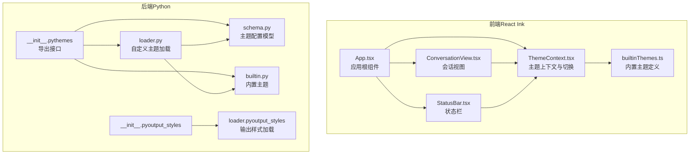
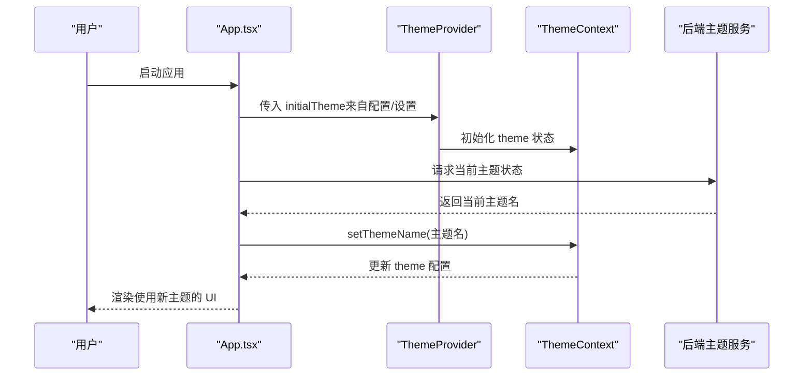
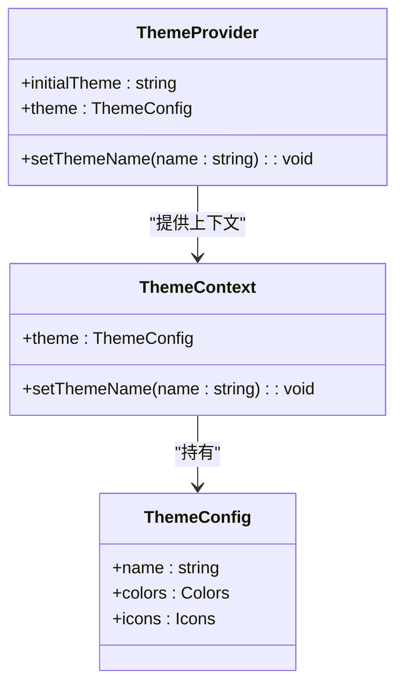
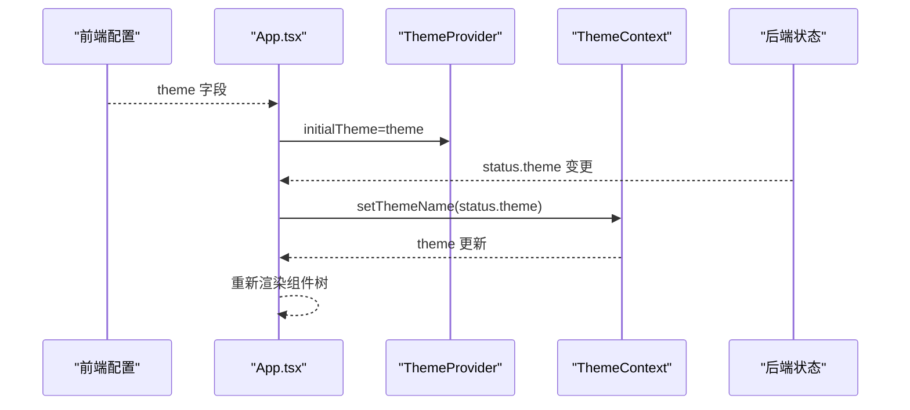
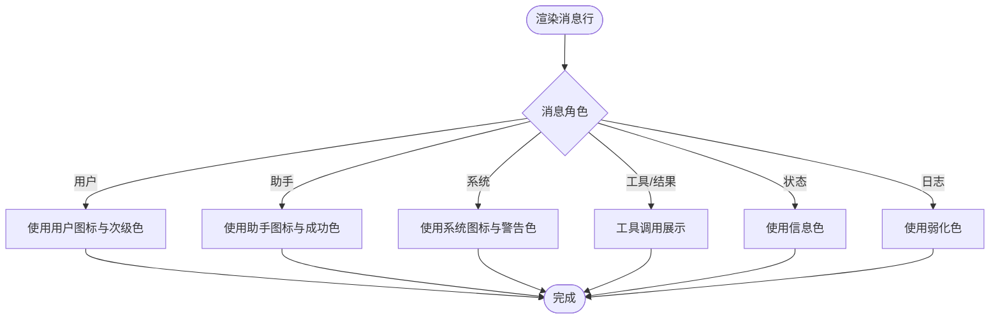
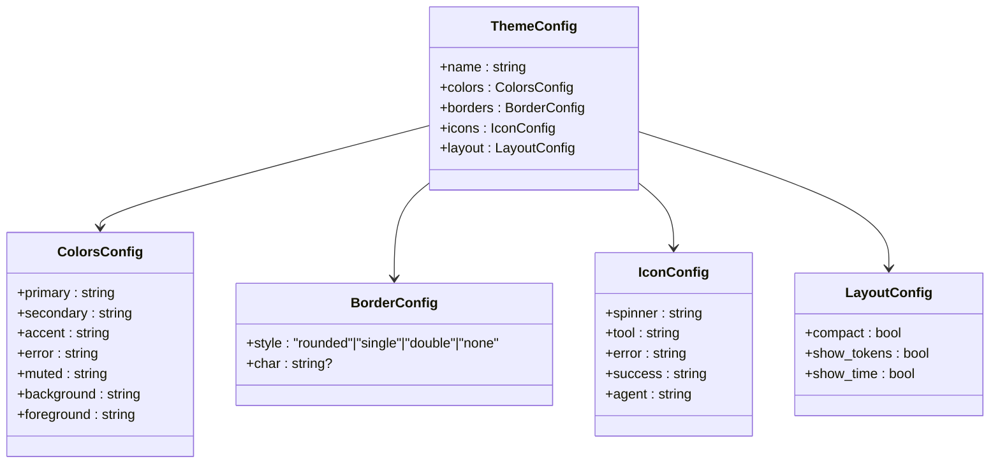
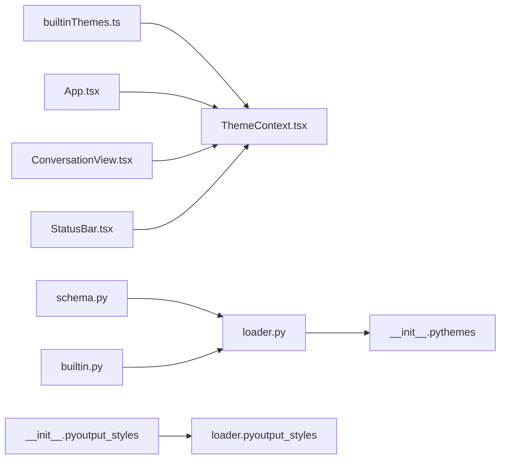

# 界面定制与主题

<cite>
**本文引用的文件**
- [ThemeContext.tsx](file://frontend/terminal/src/theme/ThemeContext.tsx)
- [builtinThemes.ts](file://frontend/terminal/src/theme/builtinThemes.ts)
- [App.tsx](file://frontend/terminal/src/App.tsx)
- [ConversationView.tsx](file://frontend/terminal/src/components/ConversationView.tsx)
- [StatusBar.tsx](file://frontend/terminal/src/components/StatusBar.tsx)
- [react_launcher.py](file://src/openharness/ui/react_launcher.py)
- [schema.py](file://src/openharness/themes/schema.py)
- [builtin.py](file://src/openharness/themes/builtin.py)
- [loader.py](file://src/openharness/themes/loader.py)
- [__init__.py（themes）](file://src/openharness/themes/__init__.py)
- [loader.py（output_styles）](file://src/openharness/output_styles/loader.py)
- [__init__.py（output_styles）](file://src/openharness/output_styles/__init__.py)
</cite>

## 目录
1. [简介](#简介)
2. [项目结构](#项目结构)
3. [核心组件](#核心组件)
4. [架构总览](#架构总览)
5. [详细组件分析](#详细组件分析)
6. [依赖关系分析](#依赖关系分析)
7. [性能考量](#性能考量)
8. [故障排除指南](#故障排除指南)
9. [结论](#结论)
10. [附录](#附录)

## 简介
本文件系统性阐述 OpenHarness 的界面定制与主题系统，涵盖前端 ThemeContext 与后端主题加载器的协作机制，内置主题的配置与使用，自定义主题的开发流程，主题切换与动态更新机制，以及主题与输出样式的集成关系。同时提供最佳实践、调试与故障排除建议。

## 项目结构
主题系统由前后端协同构成：
- 前端（React Ink 终端 UI）
  - 主题上下文：ThemeContext 提供主题状态与切换能力
  - 内置主题：builtinThemes 定义默认/深色/极简/赛博朋克/太阳化等主题
  - 使用示例：App、ConversationView、StatusBar 等组件通过 useTheme 获取主题并渲染
- 后端（Python）
  - 主题模式：schema.py 定义颜色、边框、图标、布局等配置模型
  - 内置主题：builtin.py 提供默认/深色/极简/赛博朋克/太阳化主题
  - 自定义主题：loader.py 支持从用户目录加载自定义主题 JSON
  - 导出入口：themes/__init__.py 暴露加载与类型接口
  - 输出样式：output_styles 提供输出风格（与主题解耦但可配合使用）

图表来源
- [ThemeContext.tsx:1-41](file://frontend/terminal/src/theme/ThemeContext.tsx#L1-L41)
- [builtinThemes.ts:1-162](file://frontend/terminal/src/theme/builtinThemes.ts#L1-L162)
- [App.tsx:1-499](file://frontend/terminal/src/App.tsx#L1-L499)
- [ConversationView.tsx:1-191](file://frontend/terminal/src/components/ConversationView.tsx#L1-L191)
- [StatusBar.tsx:1-120](file://frontend/terminal/src/components/StatusBar.tsx#L1-L120)
- [schema.py:1-55](file://src/openharness/themes/schema.py#L1-L55)
- [builtin.py:1-90](file://src/openharness/themes/builtin.py#L1-L90)
- [loader.py:1-56](file://src/openharness/themes/loader.py#L1-L56)
- [__init__.py（themes）:1-22](file://src/openharness/themes/__init__.py#L1-L22)
- [loader.py（output_styles）:1-43](file://src/openharness/output_styles/loader.py#L1-L43)
- [__init__.py（output_styles）:1-6](file://src/openharness/output_styles/__init__.py#L1-L6)

章节来源
- [ThemeContext.tsx:1-41](file://frontend/terminal/src/theme/ThemeContext.tsx#L1-L41)
- [builtinThemes.ts:1-162](file://frontend/terminal/src/theme/builtinThemes.ts#L1-L162)
- [App.tsx:1-499](file://frontend/terminal/src/App.tsx#L1-L499)
- [ConversationView.tsx:1-191](file://frontend/terminal/src/components/ConversationView.tsx#L1-L191)
- [StatusBar.tsx:1-120](file://frontend/terminal/src/components/StatusBar.tsx#L1-L120)
- [schema.py:1-55](file://src/openharness/themes/schema.py#L1-L55)
- [builtin.py:1-90](file://src/openharness/themes/builtin.py#L1-L90)
- [loader.py:1-56](file://src/openharness/themes/loader.py#L1-L56)
- [__init__.py（themes）:1-22](file://src/openharness/themes/__init__.py#L1-L22)
- [loader.py（output_styles）:1-43](file://src/openharness/output_styles/loader.py#L1-L43)
- [__init__.py（output_styles）:1-6](file://src/openharness/output_styles/__init__.py#L1-L6)

## 核心组件
- 前端主题上下文
  - 提供主题状态与切换函数，支持初始主题注入与按名称切换
  - 默认回退到内置默认主题
- 内置主题集合
  - 包含颜色、图标、布局等配置项
  - 前端与后端分别维护同名主题集合并保持语义一致
- 后端主题模型
  - 颜色、边框、图标、布局四类配置，均以 Pydantic 模型校验
- 自定义主题加载
  - 从用户主目录下的特定子目录读取 JSON 文件，验证后合并入可用主题列表
- 输出样式
  - 与主题解耦，提供输出风格（如默认、极简、类 Codex），用于控制消息呈现风格

章节来源
- [ThemeContext.tsx:1-41](file://frontend/terminal/src/theme/ThemeContext.tsx#L1-L41)
- [builtinThemes.ts:1-162](file://frontend/terminal/src/theme/builtinThemes.ts#L1-L162)
- [schema.py:1-55](file://src/openharness/themes/schema.py#L1-L55)
- [builtin.py:1-90](file://src/openharness/themes/builtin.py#L1-L90)
- [loader.py:1-56](file://src/openharness/themes/loader.py#L1-L56)
- [loader.py（output_styles）:1-43](file://src/openharness/output_styles/loader.py#L1-L43)

## 架构总览
前端通过 ThemeProvider 注入主题上下文；应用启动时从后端状态或配置解析初始主题；运行中监听后端推送的主题变更并动态切换。后端负责主题模型定义与自定义主题加载，前端仅消费主题配置进行渲染。

图表来源
- [App.tsx:51-86](file://frontend/terminal/src/App.tsx#L51-L86)
- [ThemeContext.tsx:17-36](file://frontend/terminal/src/theme/ThemeContext.tsx#L17-L36)

章节来源
- [App.tsx:51-86](file://frontend/terminal/src/App.tsx#L51-L86)
- [ThemeContext.tsx:17-36](file://frontend/terminal/src/theme/ThemeContext.tsx#L17-L36)

## 详细组件分析

### 前端主题上下文与内置主题
- ThemeProvider
  - 接收 initialTheme 并初始化主题状态
  - setThemeName 支持按名称切换，未找到时回退默认主题
- 内置主题
  - 前端内置主题包含颜色与图标两部分，便于在终端 UI 中直接使用
  - 主题键值映射至 BUILTIN_THEMES，支持快速查找

图表来源
- [ThemeContext.tsx:7-40](file://frontend/terminal/src/theme/ThemeContext.tsx#L7-L40)
- [builtinThemes.ts:1-49](file://frontend/terminal/src/theme/builtinThemes.ts#L1-L49)

章节来源
- [ThemeContext.tsx:17-40](file://frontend/terminal/src/theme/ThemeContext.tsx#L17-L40)
- [builtinThemes.ts:1-162](file://frontend/terminal/src/theme/builtinThemes.ts#L1-L162)

### 应用根组件中的主题使用与动态切换
- 初始主题来源
  - 从前端配置解析 theme 字段作为 initialTheme
- 动态主题更新
  - 监听后端状态中的 theme 字段变化，调用 setThemeName 实时切换
- 主题在 UI 中的应用
  - 连接状态提示、键盘提示、状态栏等多处使用主题颜色与图标

图表来源
- [App.tsx:51-86](file://frontend/terminal/src/App.tsx#L51-L86)

章节来源
- [App.tsx:51-86](file://frontend/terminal/src/App.tsx#L51-L86)

### 会话视图与状态栏的主题使用
- 会话视图
  - 使用主题颜色与图标区分不同角色消息
  - 根据输出样式（如 codex）调整呈现方式
- 状态栏
  - 使用主题颜色高亮关键信息（模型、令牌统计、模式等）

图表来源
- [ConversationView.tsx:105-189](file://frontend/terminal/src/components/ConversationView.tsx#L105-L189)
- [StatusBar.tsx:78-107](file://frontend/terminal/src/components/StatusBar.tsx#L78-L107)

章节来源
- [ConversationView.tsx:1-191](file://frontend/terminal/src/components/ConversationView.tsx#L1-L191)
- [StatusBar.tsx:1-120](file://frontend/terminal/src/components/StatusBar.tsx#L1-L120)

### 后端主题模型与内置主题
- 主题模型
  - ColorsConfig：主色、次色、强调色、错误色、柔和色、背景、前景
  - BorderConfig：边框样式与字符
  - IconConfig：旋转器、工具、错误、成功、代理图标
  - LayoutConfig：紧凑模式、显示令牌数、显示时间
  - ThemeConfig：组合上述配置
- 内置主题
  - 提供默认、深色、极简、赛博朋克、太阳化五种主题，覆盖不同视觉偏好
- 自定义主题加载
  - 用户目录下 themes 子目录的 JSON 文件被加载并校验，名称冲突时后加载覆盖

图表来源
- [schema.py:10-55](file://src/openharness/themes/schema.py#L10-L55)
- [builtin.py:13-89](file://src/openharness/themes/builtin.py#L13-L89)
- [loader.py:22-56](file://src/openharness/themes/loader.py#L22-L56)

章节来源
- [schema.py:1-55](file://src/openharness/themes/schema.py#L1-L55)
- [builtin.py:1-90](file://src/openharness/themes/builtin.py#L1-L90)
- [loader.py:1-56](file://src/openharness/themes/loader.py#L1-L56)

### 自定义主题开发流程
- 文件位置
  - 用户主目录下 ~/.openharness/themes/*.json
- 文件格式
  - 符合 ThemeConfig 模型，包含 name、colors、borders、icons、layout
- 加载与合并
  - 自定义主题优先于内置主题；若名称相同，后者覆盖前者
- 最佳实践
  - 保持颜色对比度与可读性
  - 图标应为单字符或短字符串，确保终端渲染稳定
  - 边框样式与布局需与终端宽度适配

章节来源
- [loader.py:15-56](file://src/openharness/themes/loader.py#L15-L56)
- [schema.py:47-55](file://src/openharness/themes/schema.py#L47-L55)

### 主题与输出样式的集成关系
- 主题与输出样式职责分离
  - 主题：颜色、图标、布局等视觉风格
  - 输出样式：消息呈现风格（默认、极简、Codex）
- 协作方式
  - 前端会话视图根据输出样式选择不同的排版与颜色策略
  - 主题提供基础色彩体系，输出样式决定具体呈现形态

章节来源
- [App.tsx:421-423](file://frontend/terminal/src/App.tsx#L421-L423)
- [ConversationView.tsx:42-87](file://frontend/terminal/src/components/ConversationView.tsx#L42-L87)
- [loader.py（output_styles）:27-43](file://src/openharness/output_styles/loader.py#L27-L43)

## 依赖关系分析
- 前端依赖
  - ThemeContext 依赖内置主题映射
  - App 依赖 ThemeProvider，并监听后端主题状态
  - 组件（ConversationView、StatusBar）依赖 useTheme 获取主题配置
- 后端依赖
  - 主题加载器依赖内置主题与 Pydantic 模型
  - 导出接口统一暴露加载与类型

图表来源
- [builtinThemes.ts:151-162](file://frontend/terminal/src/theme/builtinThemes.ts#L151-L162)
- [ThemeContext.tsx:3-4](file://frontend/terminal/src/theme/ThemeContext.tsx#L3-L4)
- [App.tsx:51-62](file://frontend/terminal/src/App.tsx#L51-L62)
- [ConversationView.tsx:4-41](file://frontend/terminal/src/components/ConversationView.tsx#L4-L41)
- [StatusBar.tsx:4-66](file://frontend/terminal/src/components/StatusBar.tsx#L4-L66)
- [schema.py:47-55](file://src/openharness/themes/schema.py#L47-L55)
- [builtin.py:13-89](file://src/openharness/themes/builtin.py#L13-L89)
- [loader.py:9-56](file://src/openharness/themes/loader.py#L9-L56)
- [__init__.py（themes）:3-21](file://src/openharness/themes/__init__.py#L3-L21)
- [loader.py（output_styles）:20-43](file://src/openharness/output_styles/loader.py#L20-L43)
- [__init__.py（output_styles）:3-6](file://src/openharness/output_styles/__init__.py#L3-L6)

章节来源
- [__init__.py（themes）:1-22](file://src/openharness/themes/__init__.py#L1-L22)
- [__init__.py（output_styles）:1-6](file://src/openharness/output_styles/__init__.py#L1-L6)

## 性能考量
- 主题切换为轻量状态更新，避免全量重渲染
- 前端组件通过 React.memo 缓存渲染结果，减少重复绘制
- 后端主题加载仅在首次扫描用户目录，后续通过内存缓存复用

## 故障排除指南
- 主题未生效
  - 检查前端是否正确传入 initialTheme
  - 确认后端状态中 theme 是否存在且非空
- 自定义主题不生效
  - 确认 JSON 文件位于用户主目录 ~/.openharness/themes/ 下
  - 确保文件名以 .json 结尾，且符合 ThemeConfig 模型
  - 查看日志是否有解析异常（加载器对无效文件会跳过）
- 图标或颜色显示异常
  - 检查终端字体是否支持对应 Unicode 字符
  - 调整边框样式或布局参数以适配终端宽度
- 输出样式与主题混用问题
  - 确认输出样式与主题的组合逻辑（如 codex 样式会改变消息排版）

章节来源
- [App.tsx:82-86](file://frontend/terminal/src/App.tsx#L82-L86)
- [loader.py:22-32](file://src/openharness/themes/loader.py#L22-L32)

## 结论
OpenHarness 的主题系统通过前后端协同实现了灵活的界面定制能力：前端以 Context 管理主题状态并即时渲染，后端以 Pydantic 模型保证配置一致性与扩展性。内置主题覆盖主流视觉偏好，自定义主题通过简单 JSON 文件即可扩展。主题与输出样式解耦设计使界面既具个性化又保持一致性。

## 附录
- 主题开发最佳实践
  - 明确主色与对比度，确保可读性
  - 图标简洁统一，避免复杂图形
  - 边框与布局适配不同终端尺寸
- 设计指南
  - 保持品牌一致性与无障碍访问
  - 提供暗色与高对比度选项
  - 为不同角色的消息提供清晰的视觉层次