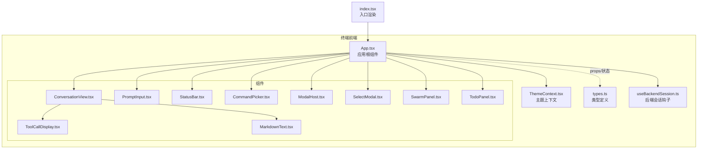
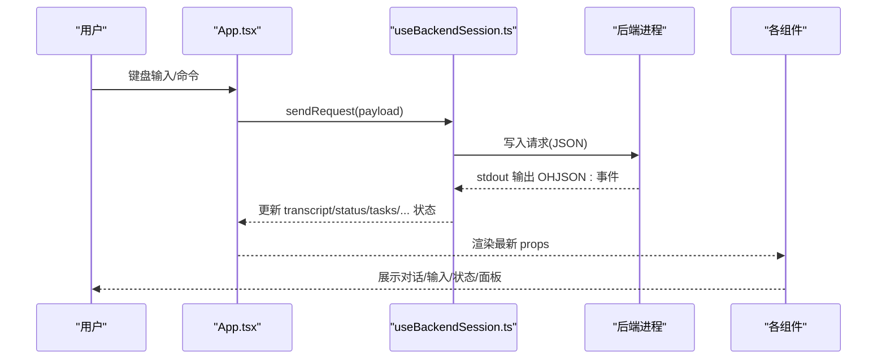
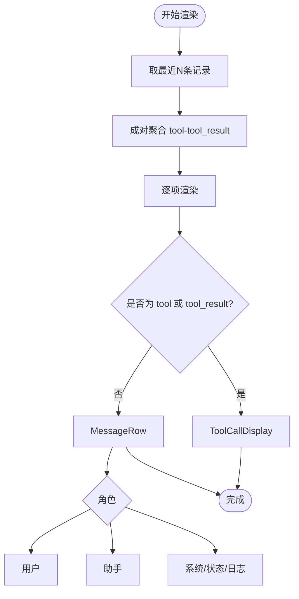
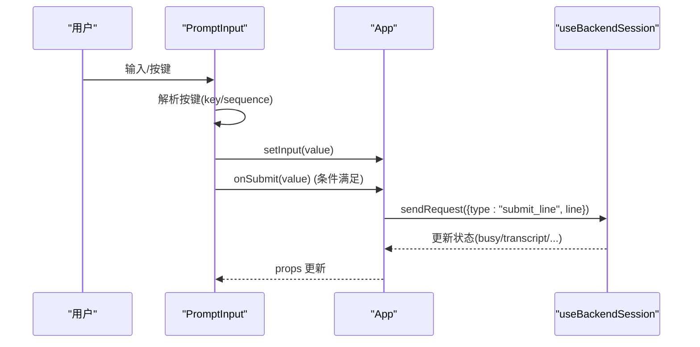
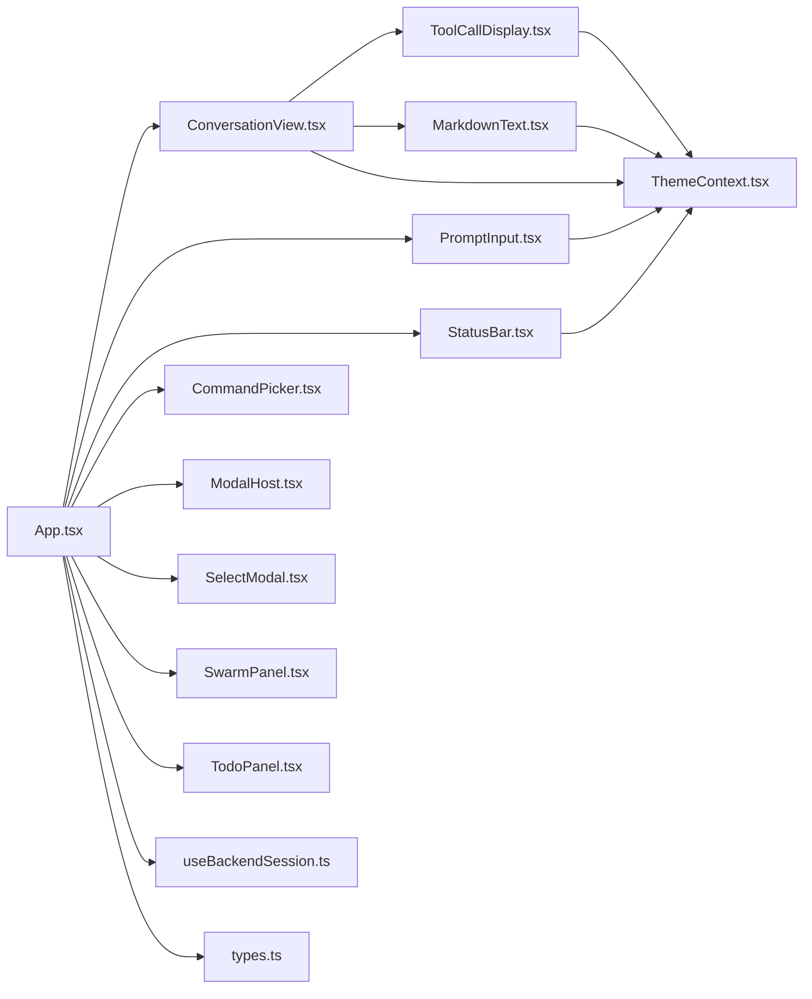

# 终端界面组件

<cite>
**本文引用的文件**
- [App.tsx](file://frontend/terminal/src/App.tsx)
- [Composer.tsx](file://frontend/terminal/src/components/Composer.tsx)
- [ConversationView.tsx](file://frontend/terminal/src/components/ConversationView.tsx)
- [PromptInput.tsx](file://frontend/terminal/src/components/PromptInput.tsx)
- [StatusBar.tsx](file://frontend/terminal/src/components/StatusBar.tsx)
- [CommandPicker.tsx](file://frontend/terminal/src/components/CommandPicker.tsx)
- [ModalHost.tsx](file://frontend/terminal/src/components/ModalHost.tsx)
- [SelectModal.tsx](file://frontend/terminal/src/components/SelectModal.tsx)
- [SwarmPanel.tsx](file://frontend/terminal/src/components/SwarmPanel.tsx)
- [TodoPanel.tsx](file://frontend/terminal/src/components/TodoPanel.tsx)
- [ToolCallDisplay.tsx](file://frontend/terminal/src/components/ToolCallDisplay.tsx)
- [MarkdownText.tsx](file://frontend/terminal/src/components/MarkdownText.tsx)
- [types.ts](file://frontend/terminal/src/types.ts)
- [ThemeContext.tsx](file://frontend/terminal/src/theme/ThemeContext.tsx)
- [useBackendSession.ts](file://frontend/terminal/src/hooks/useBackendSession.ts)
- [index.tsx](file://frontend/terminal/src/index.tsx)
</cite>

## 目录
1. [简介](#简介)
2. [项目结构](#项目结构)
3. [核心组件](#核心组件)
4. [架构总览](#架构总览)
5. [组件详细分析](#组件详细分析)
6. [依赖关系分析](#依赖关系分析)
7. [性能与渲染策略](#性能与渲染策略)
8. [故障排查指南](#故障排查指南)
9. [结论](#结论)
10. [附录：使用示例与自定义指南](#附录使用示例与自定义指南)

## 简介
本文件系统化梳理终端界面组件的设计与实现，覆盖消息 Composer、对话视图、提示输入、状态栏、命令选择器、模态框宿主、选择模态框、蜂群面板、待办面板等核心 UI 组件。文档从架构、数据流、状态管理、交互逻辑、可访问性与键盘导航、性能优化等方面进行深入解析，并提供组件使用示例与自定义建议。

## 项目结构
终端界面位于 frontend/terminal/src 下，采用按功能分层的组织方式：
- components：各 UI 组件（对话、输入、面板、模态等）
- hooks：前端会话与后端通信钩子
- theme：主题上下文与内置主题
- types：跨模块共享的数据类型定义
- index.tsx：入口渲染与 TTY 安全处理

图表来源
- [App.tsx:1-499](file://frontend/terminal/src/App.tsx#L1-L499)
- [index.tsx:1-82](file://frontend/terminal/src/index.tsx#L1-L82)

章节来源
- [App.tsx:1-499](file://frontend/terminal/src/App.tsx#L1-L499)
- [index.tsx:1-82](file://frontend/terminal/src/index.tsx#L1-L82)

## 核心组件
- Composer：简化版输入区，展示忙碌/就绪状态与基础提示
- ConversationView：对话渲染与工具调用对齐显示
- PromptInput：多行文本输入，支持光标定位、退格、回车换行、历史导航
- StatusBar：状态栏，显示模型、令牌用量、任务数、MCP 连接数、计划模式指示
- CommandPicker：命令补全提示列表
- ModalHost：权限确认、问题问答、MCP 认证等后端触发模态
- SelectModal：前端选择型模态（如权限模式、resume 列表）
- SwarmPanel：蜂群代理状态与最近通知
- TodoPanel：Markdown 待办清单解析与折叠/展开

章节来源
- [Composer.tsx:1-33](file://frontend/terminal/src/components/Composer.tsx#L1-L33)
- [ConversationView.tsx:1-191](file://frontend/terminal/src/components/ConversationView.tsx#L1-L191)
- [PromptInput.tsx:1-232](file://frontend/terminal/src/components/PromptInput.tsx#L1-L232)
- [StatusBar.tsx:1-120](file://frontend/terminal/src/components/StatusBar.tsx#L1-L120)
- [CommandPicker.tsx:1-36](file://frontend/terminal/src/components/CommandPicker.tsx#L1-L36)
- [ModalHost.tsx:1-152](file://frontend/terminal/src/components/ModalHost.tsx#L1-L152)
- [SelectModal.tsx:1-45](file://frontend/terminal/src/components/SelectModal.tsx#L1-L45)
- [SwarmPanel.tsx:1-128](file://frontend/terminal/src/components/SwarmPanel.tsx#L1-L128)
- [TodoPanel.tsx:1-92](file://frontend/terminal/src/components/TodoPanel.tsx#L1-L92)

## 架构总览
终端前端通过 useBackendSession 钩子与后端进程建立双向通信，事件驱动更新状态；App 作为协调者，将状态映射为各子组件的 props 并处理键盘输入与交互。

图表来源
- [useBackendSession.ts:107-113](file://frontend/terminal/src/hooks/useBackendSession.ts#L107-L113)
- [useBackendSession.ts:129-136](file://frontend/terminal/src/hooks/useBackendSession.ts#L129-L136)
- [App.tsx:365-396](file://frontend/terminal/src/App.tsx#L365-L396)

## 组件详细分析

### Composer（消息Composer）
- 功能：展示当前忙碌/就绪状态，提供基础输入区域与快捷提示
- Props
  - busy: boolean
  - input: string
  - setInput: (value: string) => void
  - onSubmit: (value: string) => void
  - historyIndex: number
- 状态管理：内部无状态，依赖父组件传入
- 交互逻辑：通过 TextInput 接收输入与提交；底部提示键位
- 使用场景：轻量输入或作为备用输入区

章节来源
- [Composer.tsx:5-33](file://frontend/terminal/src/components/Composer.tsx#L5-L33)

### ConversationView（对话视图）
- 功能：渲染对话历史，按角色与输出风格展示；将连续 tool/tool_result 成对聚合显示
- Props
  - items: TranscriptItem[]
  - assistantBuffer: string
  - showWelcome: boolean
  - outputStyle: string
- 关键算法：groupToolPairs 将相邻 tool 与 tool_result 分组，避免重复渲染
- 输出风格：支持默认与 codex 两种风格
- 子组件：MessageRow、ToolCallDisplay、MarkdownText、WelcomeBanner
- 性能：仅渲染最近 N 条记录，减少重排

图表来源
- [ConversationView.tsx:13-28](file://frontend/terminal/src/components/ConversationView.tsx#L13-L28)
- [ConversationView.tsx:30-92](file://frontend/terminal/src/components/ConversationView.tsx#L30-L92)

章节来源
- [ConversationView.tsx:1-191](file://frontend/terminal/src/components/ConversationView.tsx#L1-L191)
- [ToolCallDisplay.tsx:7-114](file://frontend/terminal/src/components/ToolCallDisplay.tsx#L7-L114)
- [MarkdownText.tsx:307-315](file://frontend/terminal/src/components/MarkdownText.tsx#L307-L315)

### PromptInput（提示输入）
- 功能：多行文本输入，支持光标移动、删除、换行、Tab 补全、历史导航
- Props
  - busy: boolean
  - input: string
  - setInput: (value: string) => void
  - onSubmit: (value: string) => void
  - toolName?: string
  - suppressSubmit?: boolean
  - statusLabel?: string
- 键盘处理：useInput 捕获原始输入序列，精确控制光标与删除行为
- 光标与渲染：chalk 反显当前字符，支持空值反显占位
- 提示前缀：忙碌时显示“…”，否则“>”
- 与 App 的协作：由 App 控制焦点与提交时机，避免重复提交

图表来源
- [PromptInput.tsx:75-153](file://frontend/terminal/src/components/PromptInput.tsx#L75-L153)
- [App.tsx:365-396](file://frontend/terminal/src/App.tsx#L365-L396)
- [useBackendSession.ts:107-113](file://frontend/terminal/src/hooks/useBackendSession.ts#L107-L113)

章节来源
- [PromptInput.tsx:1-232](file://frontend/terminal/src/components/PromptInput.tsx#L1-L232)
- [App.tsx:470-480](file://frontend/terminal/src/App.tsx#L470-L480)

### StatusBar（状态栏）
- 功能：显示模型、令牌用量、任务数、MCP 连接数、计划模式状态与闪烁提示
- Props
  - status: Record<string, unknown>
  - tasks: TaskSnapshot[]
  - activeToolName?: string
- 计划模式：当 mode 为 plan/Plan Mode 时高亮显示；若当前工具在写入类工具集合中，则提示阻塞
- 令牌计数：千位格式化显示
- 与主题：使用 ThemeContext 获取颜色与图标

章节来源
- [StatusBar.tsx:1-120](file://frontend/terminal/src/components/StatusBar.tsx#L1-L120)
- [ThemeContext.tsx:1-41](file://frontend/terminal/src/theme/ThemeContext.tsx#L1-L41)

### CommandPicker（命令选择器）
- 功能：根据当前输入前缀展示命令候选，支持上下导航与回车选择
- Props
  - hints: string[]
  - selectedIndex: number
- 与 App 协作：由 App 计算 hints 与选中索引，控制显示条件

章节来源
- [CommandPicker.tsx:1-36](file://frontend/terminal/src/components/CommandPicker.tsx#L1-L36)
- [App.tsx:103-116](file://frontend/terminal/src/App.tsx#L103-L116)

### ModalHost（模态框宿主）
- 功能：承载后端触发的三种模态
  - 权限确认：y/n 或 esc
  - 问题问答：多行输入，shift+enter 新行，enter 提交
  - MCP 认证：单行输入
- Props
  - modal: Record<string, unknown> | null
  - modalInput: string
  - setModalInput: (value: string) => void
  - onSubmit: (value: string) => void
- 与 App 协作：由 App 在特定键位下拦截输入并转发到模态处理

章节来源
- [ModalHost.tsx:1-152](file://frontend/terminal/src/components/ModalHost.tsx#L1-L152)
- [App.tsx:250-276](file://frontend/terminal/src/App.tsx#L250-L276)

### SelectModal（选择模态框）
- 功能：前端发起的选择型模态，支持上下导航、数字键快速选择、esc 取消
- Props
  - title: string
  - options: SelectOption[]
  - selectedIndex: number
- 与 App 协作：App 在收到 select_request 后弹出该模态，并在选择后回调后端

章节来源
- [SelectModal.tsx:1-45](file://frontend/terminal/src/components/SelectModal.tsx#L1-L45)
- [App.tsx:118-140](file://frontend/terminal/src/App.tsx#L118-L140)

### SwarmPanel（蜂群面板）
- 功能：展示蜂群代理运行状态、任务摘要与最近通知
- Props
  - teammates: SwarmTeammate[]
  - notifications: SwarmNotification[]
  - collapsed?: boolean
- 交互：ctrl+w 切换折叠/展开
- 数据：统计活跃数量，格式化持续时间

章节来源
- [SwarmPanel.tsx:1-128](file://frontend/terminal/src/components/SwarmPanel.tsx#L1-L128)

### TodoPanel（待办面板）
- 功能：解析 Markdown 待办并展示，支持紧凑/展开模式切换
- Props
  - markdown: string
  - compact?: boolean
- 交互：ctrl+t 切换
- 解析：正则提取任务项，统计完成/总数

章节来源
- [TodoPanel.tsx:1-92](file://frontend/terminal/src/components/TodoPanel.tsx#L1-L92)

## 依赖关系分析
- 组件间依赖
  - ConversationView 依赖 ThemeContext、MarkdownText、ToolCallDisplay
  - ToolCallDisplay 依赖 ThemeContext
  - PromptInput 依赖 useTheme、Spinner（未在本文档展开）
  - StatusBar 依赖 ThemeContext
  - App 聚合所有子组件并注入状态
- 外部依赖
  - Ink（Box/Text/useInput/useStdin 等）
  - marked（Markdown 解析）
  - chalk（文本样式）
  - child_process/readline（与后端通信）

图表来源
- [App.tsx:4-11](file://frontend/terminal/src/App.tsx#L4-L11)
- [ConversationView.tsx:4-8](file://frontend/terminal/src/components/ConversationView.tsx#L4-L8)
- [PromptInput.tsx:5](file://frontend/terminal/src/components/PromptInput.tsx#L5)
- [StatusBar.tsx:4](file://frontend/terminal/src/components/StatusBar.tsx#L4)
- [ToolCallDisplay.tsx:4](file://frontend/terminal/src/components/ToolCallDisplay.tsx#L4)
- [MarkdownText.tsx:3](file://frontend/terminal/src/components/MarkdownText.tsx#L3)
- [types.ts:1-93](file://frontend/terminal/src/types.ts#L1-L93)
- [useBackendSession.ts:5-15](file://frontend/terminal/src/hooks/useBackendSession.ts#L5-L15)

章节来源
- [App.tsx:1-499](file://frontend/terminal/src/App.tsx#L1-L499)
- [types.ts:1-93](file://frontend/terminal/src/types.ts#L1-L93)

## 性能与渲染策略
- 批处理与防抖
  - assistant delta 与 transcript 事件采用定时器批量刷新，避免高频重渲染
  - flushTranscriptItems/flushAssistantDelta 控制刷新节奏
- 延迟渲染
  - useDeferredValue 对 transcript/assistantBuffer/status/tasks/todo/swarm 等进行延迟渲染，优先保证输入响应
- 组件记忆化
  - ConversationView、StatusBar、SwarmPanel、TodoPanel、MarkdownText 使用 React.memo
- 视图裁剪
  - ConversationView 仅渲染最近若干条记录，降低 DOM 数量
- 主题与样式
  - 通过 ThemeContext 提供统一配色，减少样式计算开销

章节来源
- [useBackendSession.ts:48-87](file://frontend/terminal/src/hooks/useBackendSession.ts#L48-L87)
- [App.tsx:73-79](file://frontend/terminal/src/App.tsx#L73-L79)
- [ConversationView.tsx:92](file://frontend/terminal/src/components/ConversationView.tsx#L92)
- [StatusBar.tsx:112](file://frontend/terminal/src/components/StatusBar.tsx#L112)
- [SwarmPanel.tsx:127](file://frontend/terminal/src/components/SwarmPanel.tsx#L127)
- [TodoPanel.tsx:89](file://frontend/terminal/src/components/TodoPanel.tsx#L89)
- [MarkdownText.tsx:307](file://frontend/terminal/src/components/MarkdownText.tsx#L307)

## 故障排查指南
- TTY/EIO 异常
  - 入口对 stdin.setRawMode 与异常进行保护，遇到 EIO/EAGAIN 直接退出
- 会话卡住
  - 使用 /stop 或 esc 中断当前操作；检查 busy/busyLabel
  - 若长时间无响应，检查后端进程是否存活与 stdout 输出
- 输入无响应
  - 确认 App 是否处于 busy 或 modal/selectModal 显示期间
  - 检查 useInput 的 isActive 条件与键盘拦截逻辑
- 模态无法关闭
  - 权限模态：y/n 或 esc
  - 问题模态：shift+enter 新行，enter 提交
  - MCP 认证：直接输入后回车

章节来源
- [index.tsx:9-38](file://frontend/terminal/src/index.tsx#L9-L38)
- [App.tsx:278-282](file://frontend/terminal/src/App.tsx#L278-L282)
- [ModalHost.tsx:25-85](file://frontend/terminal/src/components/ModalHost.tsx#L25-L85)

## 结论
该终端界面以事件驱动为核心，通过 useBackendSession 钩子与后端保持稳定通信；App 作为中枢协调状态与交互，各子组件职责清晰、可复用性强。通过批处理、延迟渲染与记忆化等策略，确保在高吞吐对话场景下的流畅体验。组件间通过 props 与事件解耦，便于扩展与维护。

## 附录：使用示例与自定义指南

### 使用示例
- 初始化渲染
  - 在入口 index.tsx 中读取 OPENHARNESS_FRONTEND_CONFIG 并渲染 App
- 自定义主题
  - 通过 ThemeProvider 设置初始主题名，App 会在状态变更时动态切换
- 交互流程
  - 用户在 PromptInput 输入，App 拦截键位并调用 sendRequest 发送至后端
  - 后端返回 OHJSON 事件，useBackendSession 解析并更新状态
  - App 将新状态映射到各组件，触发重新渲染

章节来源
- [index.tsx:40-81](file://frontend/terminal/src/index.tsx#L40-L81)
- [ThemeContext.tsx:17-40](file://frontend/terminal/src/theme/ThemeContext.tsx#L17-L40)
- [App.tsx:365-396](file://frontend/terminal/src/App.tsx#L365-L396)
- [useBackendSession.ts:129-136](file://frontend/terminal/src/hooks/useBackendSession.ts#L129-L136)

### 自定义指南
- 新增对话样式
  - 在 ConversationView 中新增分支与样式变量，或通过 outputStyle 参数扩展
- 扩展命令系统
  - 在 App 中维护可选命令集合，CommandPicker 会自动过滤与高亮
- 新增模态类型
  - 在 ModalHost 中添加新的 kind 分支，并在 App 中拦截对应键位
- 面板扩展
  - 参考 SwarmPanel/TodoPanel 的折叠/展开与键盘交互模式，新增面板组件
- 键盘导航增强
  - 在各自组件的 useInput 中增加新的快捷键绑定，注意与 App 的拦截逻辑不冲突

章节来源
- [App.tsx:30-43](file://frontend/terminal/src/App.tsx#L30-L43)
- [CommandPicker.tsx:4-35](file://frontend/terminal/src/components/CommandPicker.tsx#L4-L35)
- [ModalHost.tsx:88-149](file://frontend/terminal/src/components/ModalHost.tsx#L88-L149)
- [SwarmPanel.tsx:39-54](file://frontend/terminal/src/components/SwarmPanel.tsx#L39-L54)
- [TodoPanel.tsx:21-35](file://frontend/terminal/src/components/TodoPanel.tsx#L21-L35)