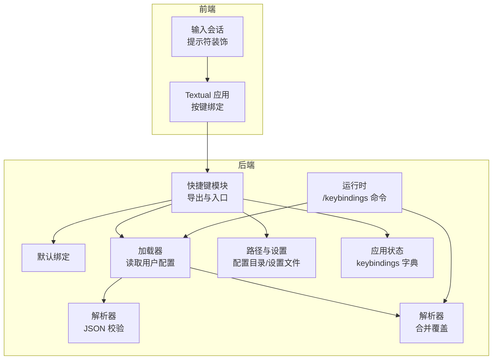
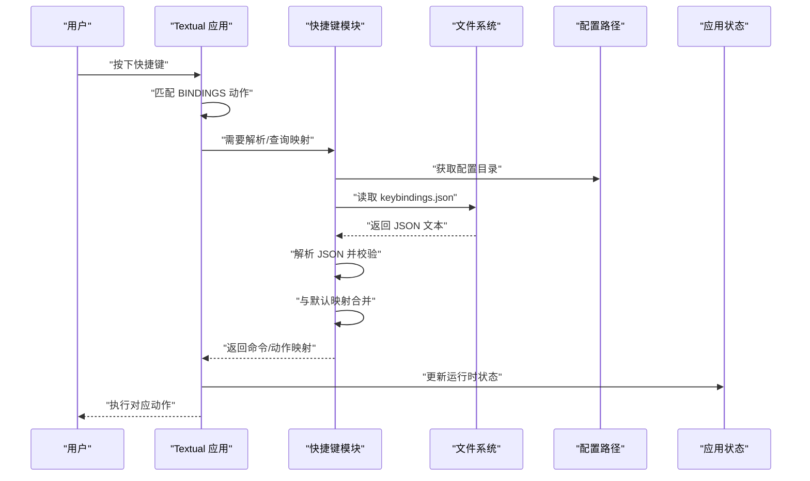
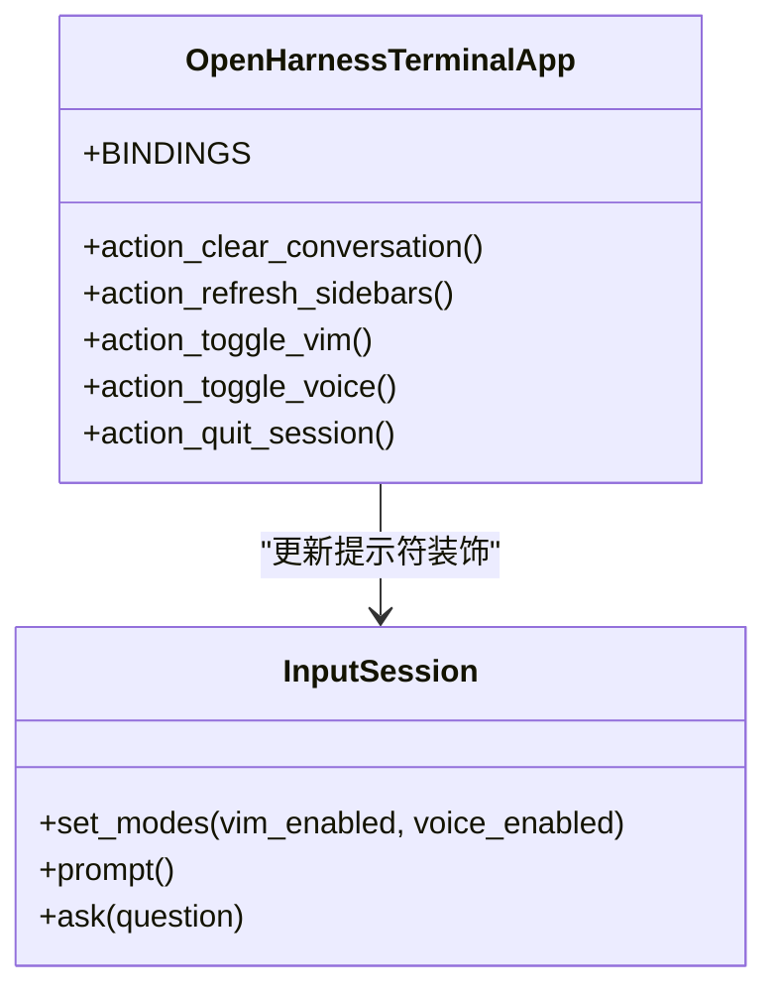
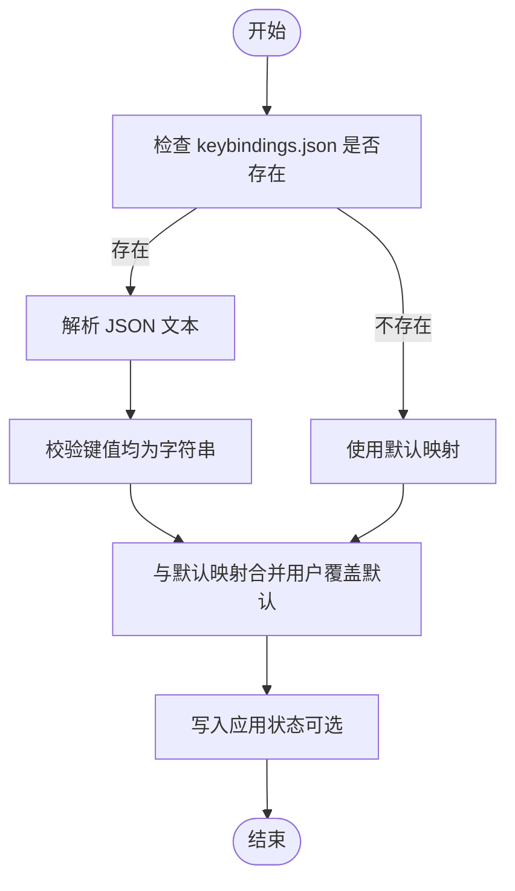
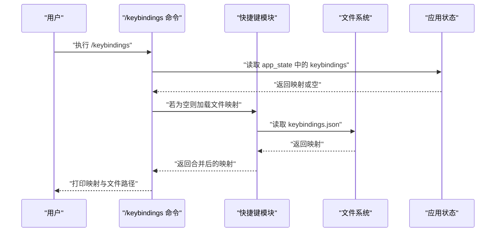
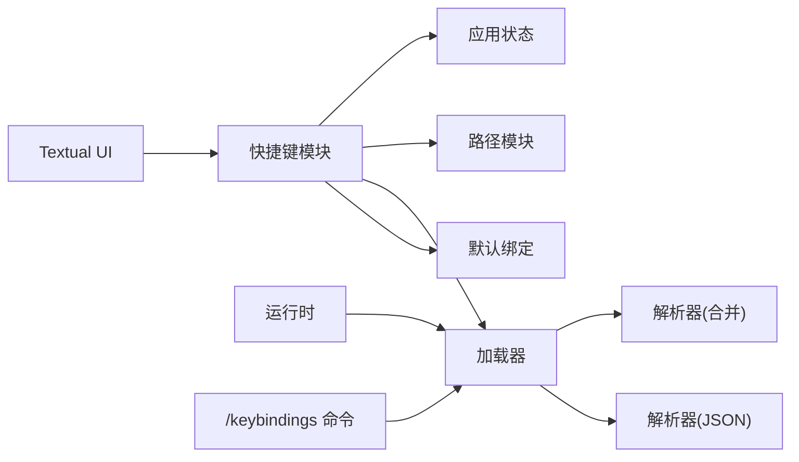

# 键盘快捷键系统

<cite>
**本文引用的文件**
- [src\openharness\keybindings\__init__.py](file://src\openharness\keybindings\__init__.py)
- [src\openharness\keybindings\default_bindings.py](file://src\openharness\keybindings\default_bindings.py)
- [src\openharness\keybindings\loader.py](file://src\openharness\keybindings\loader.py)
- [src\openharness\keybindings\parser.py](file://src\openharness\keybindings\parser.py)
- [src\openharness\keybindings\resolver.py](file://src\openharness\keybindings\resolver.py)
- [src\openharness\config\paths.py](file://src\openharness\config\paths.py)
- [src\openharness\config\settings.py](file://src\openharness\config\settings.py)
- [src\openharness\state\app_state.py](file://src\openharness\state\app_state.py)
- [src\openharness\ui\textual_app.py](file://src\openharness\ui\textual_app.py)
- [src\openharness\ui\input.py](file://src\openharness\ui\input.py)
- [src\openharness\ui\runtime.py](file://src\openharness\ui\runtime.py)
- [src\openharness\commands\registry.py](file://src\openharness\commands\registry.py)
</cite>

## 目录
1. [简介](#简介)
2. [项目结构](#项目结构)
3. [核心组件](#核心组件)
4. [架构总览](#架构总览)
5. [详细组件分析](#详细组件分析)
6. [依赖关系分析](#依赖关系分析)
7. [性能考量](#性能考量)
8. [故障排除指南](#故障排除指南)
9. [结论](#结论)
10. [附录](#附录)

## 简介
本文件系统性阐述 OpenHarness 的键盘快捷键系统：从前端 Textual UI 的按键绑定到后端 Python 解析器与配置加载机制，覆盖默认绑定、用户自定义、解析与优先级、冲突处理、调试与排错等主题。读者无需深入技术背景即可理解快捷键如何工作、如何配置与扩展。

## 项目结构
快捷键系统由“前端 UI 绑定 + 后端解析与配置”两部分组成：
- 前端（Textual UI）：通过内置的按键绑定直接映射到动作函数，用于界面交互与导航。
- 后端（Python 模块）：负责加载与合并默认与用户自定义的快捷键映射，供运行时使用。

图表来源
- [src\openharness\ui\textual_app.py:199-205](file://src\openharness\ui\textual_app.py#L199-L205)
- [src\openharness\keybindings\__init__.py:1-15](file://src\openharness\keybindings\__init__.py#L1-L15)
- [src\openharness\keybindings\loader.py:17-22](file://src\openharness\keybindings\loader.py#L17-L22)
- [src\openharness\keybindings\parser.py:8-18](file://src\openharness\keybindings\parser.py#L8-L18)
- [src\openharness\keybindings\resolver.py:8-13](file://src\openharness\keybindings\resolver.py#L8-L13)
- [src\openharness\config\paths.py:15-29](file://src\openharness\config\paths.py#L15-L29)
- [src\openharness\state\app_state.py](file://src\openharness\state\app_state.py#L30)
- [src\openharness\ui\runtime.py](file://src\openharness\ui\runtime.py#L44)
- [src\openharness\commands\registry.py:1587-1597](file://src\openharness\commands\registry.py#L1587-L1597)

章节来源
- [src\openharness\keybindings\__init__.py:1-15](file://src\openharness\keybindings\__init__.py#L1-L15)
- [src\openharness\ui\textual_app.py:199-205](file://src\openharness\ui\textual_app.py#L199-L205)

## 核心组件
- 快捷键导出与入口：统一暴露默认绑定、加载器、解析器与解析函数，便于上层调用。
- 默认绑定：提供一组基础快捷键映射，作为系统默认行为。
- 加载器：定位用户配置文件路径，读取并解析 JSON，再与默认绑定合并。
- 解析器：对用户 JSON 进行严格类型校验，确保键值均为字符串。
- 路径与设置：提供配置目录与设置文件路径，决定用户配置文件位置。
- 应用状态：在运行时保存当前生效的快捷键映射，供 UI 与命令使用。
- 命令集成：/keybindings 命令可打印当前生效的快捷键映射及其文件路径。

章节来源
- [src\openharness\keybindings\__init__.py:1-15](file://src\openharness\keybindings\__init__.py#L1-L15)
- [src\openharness\keybindings\default_bindings.py:6-11](file://src\openharness\keybindings\default_bindings.py#L6-L11)
- [src\openharness\keybindings\loader.py:12-22](file://src\openharness\keybindings\loader.py#L12-L22)
- [src\openharness\keybindings\parser.py:8-18](file://src\openharness\keybindings\parser.py#L8-L18)
- [src\openharness\keybindings\resolver.py:8-13](file://src\openharness\keybindings\resolver.py#L8-L13)
- [src\openharness\config\paths.py:15-29](file://src\openharness\config\paths.py#L15-L29)
- [src\openharness\state\app_state.py](file://src\openharness\state\app_state.py#L30)
- [src\openharness\commands\registry.py:1587-1597](file://src\openharness\commands\registry.py#L1587-L1597)

## 架构总览
快捷键系统采用“前端按键绑定 + 后端映射解析”的双层设计：
- 前端：Textual UI 定义按键到动作的绑定，用于即时界面操作。
- 后端：加载用户配置文件，解析为字典，与默认映射合并，形成最终生效映射；该映射可被命令与运行时使用。

图表来源
- [src\openharness\ui\textual_app.py:199-205](file://src\openharness\ui\textual_app.py#L199-L205)
- [src\openharness\keybindings\loader.py:17-22](file://src\openharness\keybindings\loader.py#L17-L22)
- [src\openharness\keybindings\parser.py:8-18](file://src\openharness\keybindings\parser.py#L8-L18)
- [src\openharness\keybindings\resolver.py:8-13](file://src\openharness\keybindings\resolver.py#L8-L13)
- [src\openharness\config\paths.py:15-29](file://src\openharness\config\paths.py#L15-L29)
- [src\openharness\state\app_state.py](file://src\openharness\state\app_state.py#L30)

## 详细组件分析

### 组件一：前端按键绑定（Textual UI）
- Textual 应用通过 BINDINGS 列表声明全局快捷键，如清除对话、刷新侧栏、切换 Vim/语音模式、退出会话等。
- 按键触发后，Textual 调用对应 action_* 方法，完成具体 UI 行为（例如清空对话、切换模式、退出）。
- 输入会话（InputSession）根据当前模式动态调整提示符装饰，体现 Vim/语音等状态。

图表来源
- [src\openharness\ui\textual_app.py:199-205](file://src\openharness\ui\textual_app.py#L199-L205)
- [src\openharness\ui\textual_app.py:387-420](file://src\openharness\ui\textual_app.py#L387-L420)
- [src\openharness\ui\input.py:15-27](file://src\openharness\ui\input.py#L15-L27)

章节来源
- [src\openharness\ui\textual_app.py:199-205](file://src\openharness\ui\textual_app.py#L199-L205)
- [src\openharness\ui\textual_app.py:387-420](file://src\openharness\ui\textual_app.py#L387-L420)
- [src\openharness\ui\input.py:15-27](file://src\openharness\ui\input.py#L15-L27)

### 组件二：后端快捷键解析与配置加载
- 导出入口：统一导出默认绑定、加载器、解析器与解析函数，便于上层按需使用。
- 默认绑定：提供一组基础映射，如清除、切换 Vim、切换语音、任务面板等。
- 用户配置文件：位于配置目录下的 keybindings.json，采用 JSON 对象格式，键与值均为字符串。
- 加载流程：若文件不存在则仅使用默认映射；存在时先解析 JSON，再与默认映射合并，后者覆盖前者同名键。
- 应用状态：运行时可将最终映射写入应用状态，供 UI 与命令使用。

图表来源
- [src\openharness\keybindings\loader.py:17-22](file://src\openharness\keybindings\loader.py#L17-L22)
- [src\openharness\keybindings\parser.py:8-18](file://src\openharness\keybindings\parser.py#L8-L18)
- [src\openharness\keybindings\resolver.py:8-13](file://src\openharness\keybindings\resolver.py#L8-L13)
- [src\openharness\state\app_state.py](file://src\openharness\state\app_state.py#L30)

章节来源
- [src\openharness\keybindings\__init__.py:1-15](file://src\openharness\keybindings\__init__.py#L1-L15)
- [src\openharness\keybindings\default_bindings.py:6-11](file://src\openharness\keybindings\default_bindings.py#L6-L11)
- [src\openharness\keybindings\loader.py:12-22](file://src\openharness\keybindings\loader.py#L12-L22)
- [src\openharness\keybindings\parser.py:8-18](file://src\openharness\keybindings\parser.py#L8-L18)
- [src\openharness\keybindings\resolver.py:8-13](file://src\openharness\keybindings\resolver.py#L8-L13)
- [src\openharness\state\app_state.py](file://src\openharness\state\app_state.py#L30)

### 组件三：命令集成与调试
- /keybindings 命令：打印当前生效的快捷键映射及文件路径，便于调试与确认覆盖关系。
- 运行时集成：运行时通过加载器获取映射，若应用状态中已有映射则优先使用，否则回退到从文件加载。

图表来源
- [src\openharness\commands\registry.py:1587-1597](file://src\openharness\commands\registry.py#L1587-L1597)
- [src\openharness\ui\runtime.py](file://src\openharness\ui\runtime.py#L44)
- [src\openharness\keybindings\loader.py:17-22](file://src\openharness\keybindings\loader.py#L17-L22)

章节来源
- [src\openharness\commands\registry.py:1587-1597](file://src\openharness\commands\registry.py#L1587-L1597)
- [src\openharness\ui\runtime.py](file://src\openharness\ui\runtime.py#L44)

## 依赖关系分析
- 前端依赖后端：Textual UI 的按键绑定是“动作名到行为”的映射；实际的“按键到命令”的解析由后端模块完成，UI 通过动作名间接使用后端解析结果。
- 后端内部依赖：加载器依赖路径模块确定配置文件位置，解析器负责 JSON 校验，解析器负责默认与用户映射合并。
- 运行时依赖：运行时在构建会话时加载快捷键映射，供命令与 UI 使用。

图表来源
- [src\openharness\ui\textual_app.py:199-205](file://src\openharness\ui\textual_app.py#L199-L205)
- [src\openharness\keybindings\__init__.py:1-15](file://src\openharness\keybindings\__init__.py#L1-L15)
- [src\openharness\keybindings\loader.py:17-22](file://src\openharness\keybindings\loader.py#L17-L22)
- [src\openharness\keybindings\parser.py:8-18](file://src\openharness\keybindings\parser.py#L8-L18)
- [src\openharness\keybindings\resolver.py:8-13](file://src\openharness\keybindings\resolver.py#L8-L13)
- [src\openharness\config\paths.py:15-29](file://src\openharness\config\paths.py#L15-L29)
- [src\openharness\state\app_state.py](file://src\openharness\state\app_state.py#L30)
- [src\openharness\ui\runtime.py](file://src\openharness\ui\runtime.py#L44)
- [src\openharness\commands\registry.py:1587-1597](file://src\openharness\commands\registry.py#L1587-L1597)

章节来源
- [src\openharness\ui\textual_app.py:199-205](file://src\openharness\ui\textual_app.py#L199-L205)
- [src\openharness\keybindings\__init__.py:1-15](file://src\openharness\keybindings\__init__.py#L1-L15)
- [src\openharness\keybindings\loader.py:17-22](file://src\openharness\keybindings\loader.py#L17-L22)
- [src\openharness\keybindings\parser.py:8-18](file://src\openharness\keybindings\parser.py#L8-L18)
- [src\openharness\keybindings\resolver.py:8-13](file://src\openharness\keybindings\resolver.py#L8-L13)
- [src\openharness\config\paths.py:15-29](file://src\openharness\config\paths.py#L15-L29)
- [src\openharness\state\app_state.py](file://src\openharness\state\app_state.py#L30)
- [src\openharness\ui\runtime.py](file://src\openharness\ui\runtime.py#L44)
- [src\openharness\commands\registry.py:1587-1597](file://src\openharness\commands\registry.py#L1587-L1597)

## 性能考量
- 解析成本极低：JSON 解析与字典合并均为 O(n) 操作，且仅在启动或配置变更时发生，对运行时性能影响可忽略。
- 缓存策略：应用状态可缓存已解析映射，避免重复 IO 与解析。
- 建议：保持 keybindings.json 结构简单，避免频繁重载导致不必要的解析开销。

## 故障排除指南
- 文件格式错误
  - 现象：加载失败或报错。
  - 排查：确认 keybindings.json 为 JSON 对象，键与值均为字符串；解析器会对非对象与非字符串进行校验并抛出异常。
  - 参考
    - [src\openharness\keybindings\parser.py:8-18](file://src\openharness\keybindings\parser.py#L8-L18)
- 配置文件缺失
  - 现象：系统回退到默认映射。
  - 处理：创建 ~/.openharness/keybindings.json 或设置 OPENHARNESS_CONFIG_DIR 环境变量以指定配置目录。
  - 参考
    - [src\openharness\keybindings\loader.py:17-22](file://src\openharness\keybindings\loader.py#L17-L22)
    - [src\openharness\config\paths.py:15-29](file://src\openharness\config\paths.py#L15-L29)
- 映射未生效
  - 现象：按键不触发预期动作。
  - 排查：使用 /keybindings 命令查看当前生效映射与文件路径，确认是否被用户映射覆盖。
  - 参考
    - [src\openharness\commands\registry.py:1587-1597](file://src\openharness\commands\registry.py#L1587-L1597)
- 冲突与覆盖
  - 规则：用户映射会覆盖默认映射；若未提供用户映射，则完全使用默认映射。
  - 参考
    - [src\openharness\keybindings\resolver.py:8-13](file://src\openharness\keybindings\resolver.py#L8-L13)
- 前端绑定不一致
  - 现象：UI 绑定的动作与后端映射不一致。
  - 排查：确认 Textual BINDINGS 中的动作名与后端映射的命令名一致；必要时同步修改。
  - 参考
    - [src\openharness\ui\textual_app.py:199-205](file://src\openharness\ui\textual_app.py#L199-L205)

章节来源
- [src\openharness\keybindings\parser.py:8-18](file://src\openharness\keybindings\parser.py#L8-L18)
- [src\openharness\keybindings\loader.py:17-22](file://src\openharness\keybindings\loader.py#L17-L22)
- [src\openharness\config\paths.py:15-29](file://src\openharness\config\paths.py#L15-L29)
- [src\openharness\commands\registry.py:1587-1597](file://src\openharness\commands\registry.py#L1587-L1597)
- [src\openharness\keybindings\resolver.py:8-13](file://src\openharness\keybindings\resolver.py#L8-L13)
- [src\openharness\ui\textual_app.py:199-205](file://src\openharness\ui\textual_app.py#L199-L205)

## 结论
OpenHarness 的快捷键系统以简洁清晰的方式实现了“前端按键绑定 + 后端映射解析”的分层设计：前端负责即时交互，后端负责灵活配置与覆盖。默认绑定提供开箱即用的行为，用户可通过 JSON 文件轻松定制；系统通过严格的解析与合并策略保证一致性与可预测性。配合 /keybindings 命令与应用状态缓存，用户可以高效地调试与维护快捷键配置。

## 附录

### 默认快捷键绑定
- 清除对话：ctrl+l -> clear
- 切换 Vim 模式：ctrl+k -> toggle_vim
- 切换语音模式：ctrl+v -> toggle_voice
- 打开任务面板：ctrl+t -> tasks

章节来源
- [src\openharness\keybindings\default_bindings.py:6-11](file://src\openharness\keybindings\default_bindings.py#L6-L11)

### 快捷键文件格式与绑定规则
- 文件位置：~/.openharness/keybindings.json（或通过环境变量 OPENHARNESS_CONFIG_DIR 指定）
- 格式要求：JSON 对象，键与值必须为字符串
- 覆盖规则：用户映射覆盖默认映射；若文件不存在则仅使用默认映射
- 参考
  - [src\openharness\keybindings\parser.py:8-18](file://src\openharness\keybindings\parser.py#L8-L18)
  - [src\openharness\keybindings\resolver.py:8-13](file://src\openharness\keybindings\resolver.py#L8-L13)
  - [src\openharness\keybindings\loader.py:17-22](file://src\openharness\keybindings\loader.py#L17-L22)
  - [src\openharness\config\paths.py:15-29](file://src\openharness\config\paths.py#L15-L29)

### 常用快捷键使用指南与最佳实践
- 使用 /keybindings 命令快速查看当前生效映射与文件路径
- 在 keybindings.json 中仅添加需要覆盖的条目，避免冗余
- 将高频操作映射到易按的组合键，减少手部移动
- 与前端 BINDINGS 保持动作名一致，避免不一致导致的不可用
- 参考
  - [src\openharness\commands\registry.py:1587-1597](file://src\openharness\commands\registry.py#L1587-L1597)
  - [src\openharness\ui\textual_app.py:199-205](file://src\openharness\ui\textual_app.py#L199-L205)