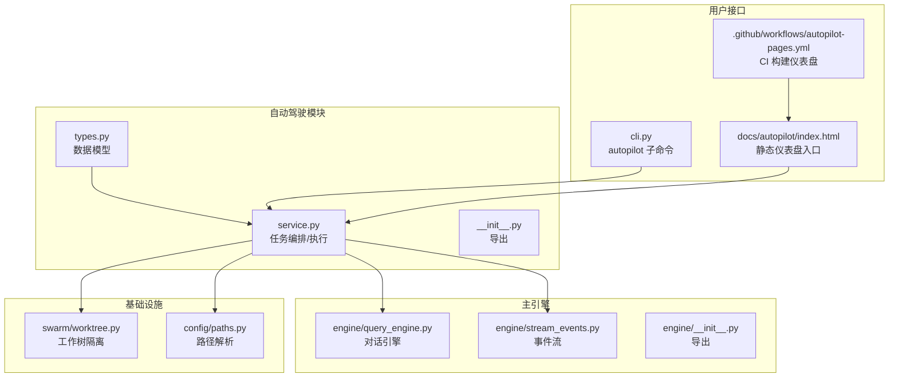
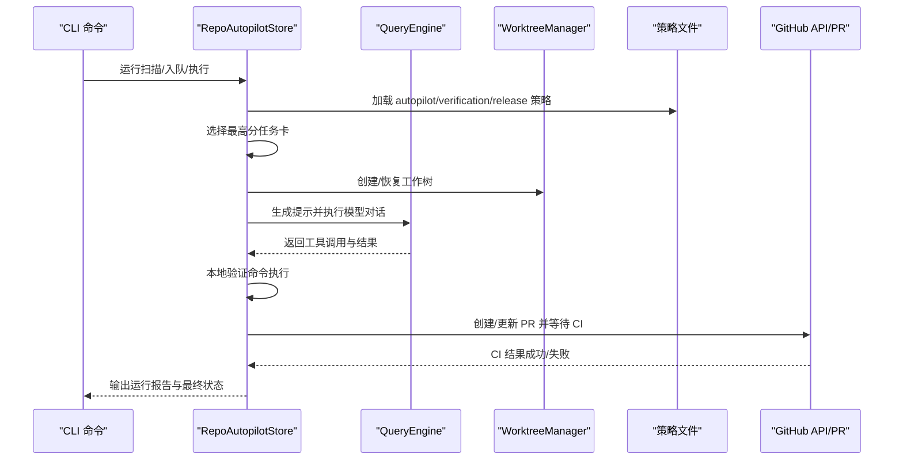
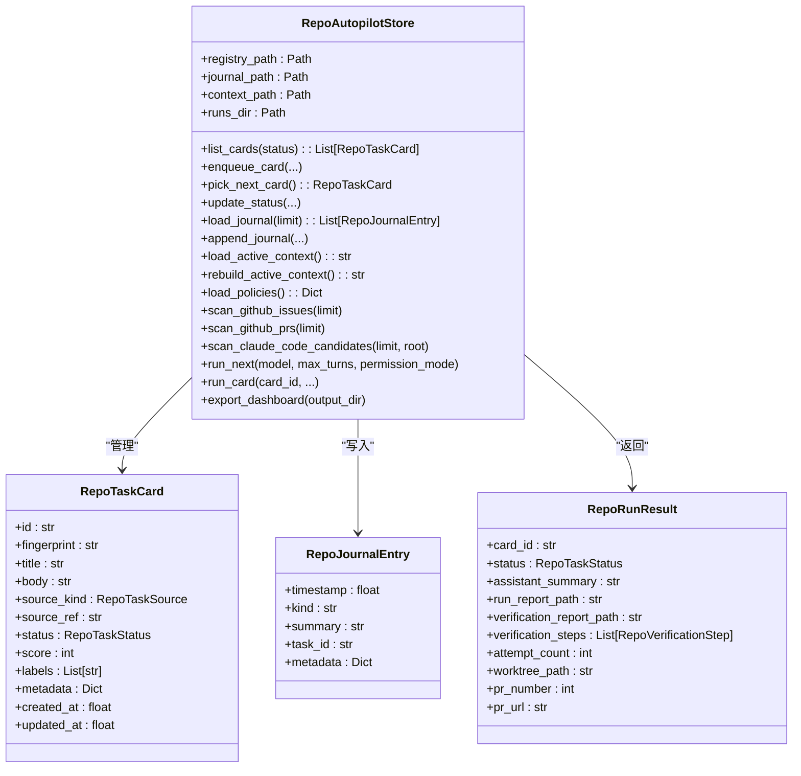
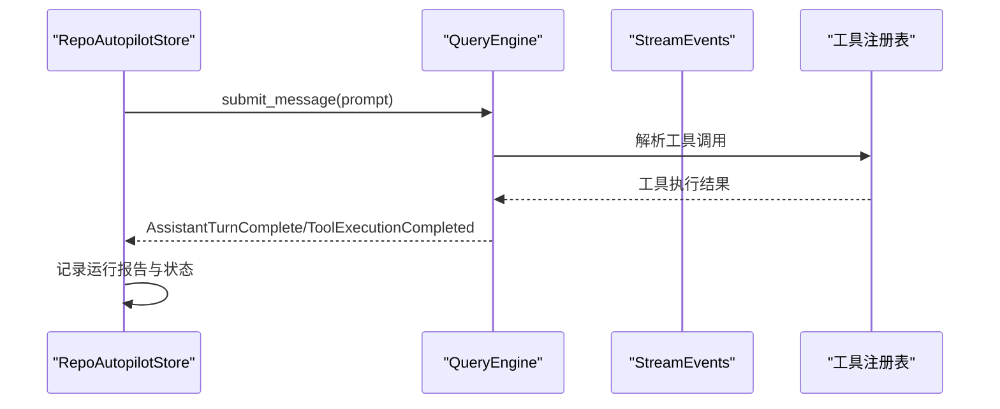
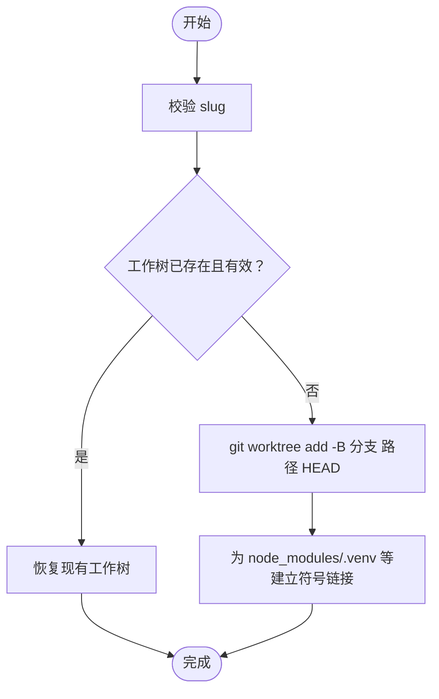
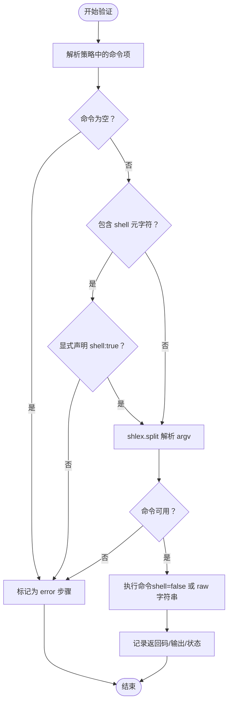
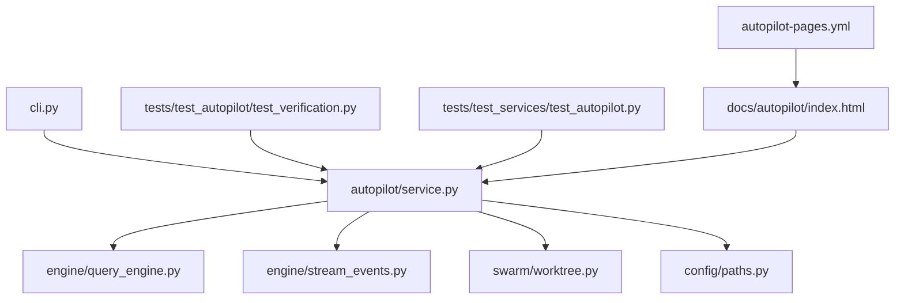

# 自动驾驶系统

<cite>
**本文档引用的文件**
- [src/openharness/autopilot/__init__.py](file://src/openharness/autopilot/__init__.py)
- [src/openharness/autopilot/service.py](file://src/openharness/autopilot/service.py)
- [src/openharness/autopilot/types.py](file://src/openharness/autopilot/types.py)
- [src/openharness/engine/__init__.py](file://src/openharness/engine/__init__.py)
- [src/openharness/engine/query_engine.py](file://src/openharness/engine/query_engine.py)
- [src/openharness/engine/stream_events.py](file://src/openharness/engine/stream_events.py)
- [src/openharness/swarm/worktree.py](file://src/openharness/swarm/worktree.py)
- [src/openharness/config/paths.py](file://src/openharness/config/paths.py)
- [src/openharness/cli.py](file://src/openharness/cli.py)
- [tests/test_autopilot/test_verification.py](file://tests/test_autopilot/test_verification.py)
- [tests/test_services/test_autopilot.py](file://tests/test_services/test_autopilot.py)
- [docs/autopilot/index.html](file://docs/autopilot/index.html)
- [.github/workflows/autopilot-pages.yml](file://.github/workflows/autopilot-pages.yml)
</cite>

## 目录
1. [简介](#简介)
2. [项目结构](#项目结构)
3. [核心组件](#核心组件)
4. [架构总览](#架构总览)
5. [详细组件分析](#详细组件分析)
6. [依赖关系分析](#依赖关系分析)
7. [性能考虑](#性能考虑)
8. [故障排除指南](#故障排除指南)
9. [结论](#结论)
10. [附录](#附录)

## 简介
本文件系统性阐述 OpenHarness 自动驾驶（Repo Autopilot）子系统的设计与实现，覆盖以下主题：
- 自动驾驶架构设计：任务编排、状态机、策略与验证、工作树隔离、CI/PR 流水线
- 类型定义与数据模型：任务卡、注册表、日志、运行结果等
- 模式与工作流：扫描来源、入队、决策、执行、验证、修复、合并
- 与主引擎的集成：对话引擎、工具调用、权限控制、事件流
- 配置与使用：CLI 命令、策略文件、仪表盘导出
- 决策机制与执行流程：优先级评分、重试修复、人类闸门
- 安全控制与回退：权限模式、命令解析安全、失败处理
- 监控与调试：活动上下文、审计日志、仪表盘、测试用例
- 扩展与定制：策略可配置、钩子与插件、自定义工具

## 项目结构
自动驾驶系统位于 `src/openharness/autopilot/`，围绕任务卡片（RepoTaskCard）进行全生命周期管理，并通过策略文件（autopilot_policy.yaml、verification_policy.yaml、release_policy.yaml）驱动行为。其与主引擎（QueryEngine、StreamEvents）协作完成智能体对话与工具执行；通过 WorktreeManager 实现 Git 工作树隔离；通过 CLI 提供命令行入口。



**图表来源**
- [src/openharness/autopilot/service.py:1-2240](file://src/openharness/autopilot/service.py#L1-2240)
- [src/openharness/autopilot/types.py:1-92](file://src/openharness/autopilot/types.py#L1-92)
- [src/openharness/engine/query_engine.py:1-215](file://src/openharness/engine/query_engine.py#L1-215)
- [src/openharness/engine/stream_events.py:1-90](file://src/openharness/engine/stream_events.py#L1-90)
- [src/openharness/swarm/worktree.py:1-316](file://src/openharness/swarm/worktree.py#L1-316)
- [src/openharness/config/paths.py:1-161](file://src/openharness/config/paths.py#L1-161)
- [src/openharness/cli.py:993-1200](file://src/openharness/cli.py#L993-1200)
- [docs/autopilot/index.html:1-17](file://docs/autopilot/index.html#L1-17)
- [.github/workflows/autopilot-pages.yml:1-59](file://.github/workflows/autopilot-pages.yml#L1-59)

**章节来源**
- [src/openharness/autopilot/__init__.py:1-24](file://src/openharness/autopilot/__init__.py#L1-24)
- [src/openharness/autopilot/service.py:1-2240](file://src/openharness/autopilot/service.py#L1-2240)
- [src/openharness/autopilot/types.py:1-92](file://src/openharness/autopilot/types.py#L1-92)
- [src/openharness/engine/__init__.py:1-81](file://src/openharness/engine/__init__.py#L1-81)
- [src/openharness/engine/query_engine.py:1-215](file://src/openharness/engine/query_engine.py#L1-215)
- [src/openharness/engine/stream_events.py:1-90](file://src/openharness/engine/stream_events.py#L1-90)
- [src/openharness/swarm/worktree.py:1-316](file://src/openharness/swarm/worktree.py#L1-316)
- [src/openharness/config/paths.py:1-161](file://src/openharness/config/paths.py#L1-161)
- [src/openharness/cli.py:993-1200](file://src/openharness/cli.py#L993-1200)
- [docs/autopilot/index.html:1-17](file://docs/autopilot/index.html#L1-17)
- [.github/workflows/autopilot-pages.yml:1-59](file://.github/workflows/autopilot-pages.yml#L1-59)

## 核心组件
- 数据模型与类型
  - 任务状态枚举：queued、accepted、preparing、running、verifying、pr_open、waiting_ci、repairing、completed、merged、failed、rejected、superseded
  - 任务来源枚举：ohmo_request、manual_idea、github_issue、github_pr、claude_code_candidate
  - 关键模型：RepoTaskCard、RepoJournalEntry、RepoAutopilotRegistry、RepoVerificationStep、RepoRunResult
- 任务存储与编排：RepoAutopilotStore
  - 注册表持久化与查询
  - 任务入队、选择、状态更新
  - 活动上下文合成与仪表盘导出
  - 策略加载与默认策略
  - 扫描来源（GitHub Issues/PRs、claude-code）
  - 执行循环：run_next/run_card
  - 验证与修复：本地验证、CI 等待、PR 创建与合并
- 引擎与事件
  - QueryEngine：对话循环、工具调用、权限检查、钩子执行
  - StreamEvents：增量文本、回合完成、工具执行、错误与状态事件
- 工作树隔离：WorktreeManager
  - 工作树创建/恢复/清理
  - 符号链接优化（node_modules、.venv 等）
- 路径与配置：config.paths
  - 项目级 autopilot 目录、策略文件、运行产物目录、活动上下文文件

**章节来源**
- [src/openharness/autopilot/types.py:1-92](file://src/openharness/autopilot/types.py#L1-92)
- [src/openharness/autopilot/service.py:226-2240](file://src/openharness/autopilot/service.py#L226-2240)
- [src/openharness/engine/query_engine.py:19-215](file://src/openharness/engine/query_engine.py#L19-215)
- [src/openharness/engine/stream_events.py:12-90](file://src/openharness/engine/stream_events.py#L12-90)
- [src/openharness/swarm/worktree.py:135-316](file://src/openharness/swarm/worktree.py#L135-316)
- [src/openharness/config/paths.py:102-161](file://src/openharness/config/paths.py#L102-161)

## 架构总览
自动驾驶系统以“策略驱动 + 任务卡片 + 对话引擎”的方式组织。策略文件决定扫描、决策、执行、验证、发布等阶段的行为；任务卡片承载来源信息、评分、标签与元数据；对话引擎负责与模型交互、工具调用与权限控制；工作树隔离确保执行环境的干净与可重复；最终通过 PR 和 CI 完成自动化交付。



**图表来源**
- [src/openharness/autopilot/service.py:627-1189](file://src/openharness/autopilot/service.py#L627-1189)
- [src/openharness/engine/query_engine.py:147-215](file://src/openharness/engine/query_engine.py#L147-215)
- [src/openharness/swarm/worktree.py:150-212](file://src/openharness/swarm/worktree.py#L150-212)

**章节来源**
- [src/openharness/autopilot/service.py:627-1189](file://src/openharness/autopilot/service.py#L627-1189)
- [src/openharness/engine/query_engine.py:147-215](file://src/openharness/engine/query_engine.py#L147-215)
- [src/openharness/swarm/worktree.py:150-212](file://src/openharness/swarm/worktree.py#L150-212)

## 详细组件分析

### 组件A：RepoAutopilotStore（任务存储与编排）
- 职责
  - 任务注册表持久化与查询
  - 任务入队、去重、评分与排序
  - 选择下一个执行任务
  - 更新任务状态与审计日志
  - 合成活动上下文并导出静态仪表盘
  - 加载与应用策略（执行、验证、发布）
  - 扫描外部来源（GitHub Issues/PRs、claude-code）
  - 执行循环：run_next/run_card
  - 验证与修复：本地验证失败自动重试、CI 等待、PR 合并
- 关键流程
  - 入队与去重：基于指纹（来源类型/引用/标题/正文）判断重复
  - 评分：按来源权重与关键词启发式计算
  - 执行：工作树隔离、模型对话、工具调用、本地验证、PR/CI
  - 修复：根据上次失败阶段与摘要生成修复提示，最多尝试次数由策略控制
- 安全与健壮性
  - 验证命令解析：严格 token 化，禁止 shell 元字符除非显式声明 shell:true
  - 权限模式：支持全自动化或人类闸门模式
  - 失败回退：记录失败阶段与摘要，终止于不可修复错误



**图表来源**
- [src/openharness/autopilot/service.py:226-1189](file://src/openharness/autopilot/service.py#L226-1189)
- [src/openharness/autopilot/types.py:33-92](file://src/openharness/autopilot/types.py#L33-92)

**章节来源**
- [src/openharness/autopilot/service.py:226-1189](file://src/openharness/autopilot/service.py#L226-1189)
- [src/openharness/autopilot/types.py:33-92](file://src/openharness/autopilot/types.py#L33-92)

### 组件B：类型系统（数据模型）
- RepoTaskStatus：任务状态枚举，覆盖从排队到合并/失败的完整生命周期
- RepoTaskSource：任务来源枚举，支持手动、ohmo 请求、GitHub Issue/PR、claude-code 候选
- RepoTaskCard：任务卡片，包含指纹、评分、标签、元数据、时间戳等
- RepoJournalEntry：审计日志条目，记录关键事件与摘要
- RepoAutopilotRegistry：注册表，包含版本、更新时间与卡片列表
- RepoVerificationStep：单个验证命令的结果（返回码、stdout/stderr、状态）
- RepoRunResult：一次执行尝试的结果，包含运行报告、验证报告、PR 信息等

```mermaid
classDiagram
class RepoTaskStatus {
<<enum>>
"queued","accepted","preparing","running","verifying","pr_open","waiting_ci","repairing","completed","merged","failed","rejected","superseded"
}
class RepoTaskSource {
<<enum>>
"ohmo_request","manual_idea","github_issue","github_pr","claude_code_candidate"
}
class RepoTaskCard
class RepoJournalEntry
class RepoAutopilotRegistry
class RepoVerificationStep
class RepoRunResult
RepoTaskCard --> RepoTaskStatus
RepoTaskCard --> RepoTaskSource
RepoAutopilotRegistry --> RepoTaskCard
RepoRunResult --> RepoVerificationStep
```

**图表来源**
- [src/openharness/autopilot/types.py:9-92](file://src/openharness/autopilot/types.py#L9-92)

**章节来源**
- [src/openharness/autopilot/types.py:9-92](file://src/openharness/autopilot/types.py#L9-92)

### 组件C：与主引擎的集成（对话与工具）
- QueryEngine
  - 维护对话历史与工具注册表
  - 支持最大轮次限制、系统提示、权限检查器、钩子执行
  - 提交用户消息后进入查询循环，产出流式事件
- StreamEvents
  - AssistantTextDelta、AssistantTurnComplete、ToolExecutionStarted/Completed
  - ErrorEvent、StatusEvent、CompactProgressEvent
- 集成点
  - RepoAutopilotStore 在执行阶段调用 QueryEngine 进行模型对话与工具执行
  - 通过流事件观察工具调用进度与结果，用于报告与后续动作



**图表来源**
- [src/openharness/engine/query_engine.py:147-215](file://src/openharness/engine/query_engine.py#L147-215)
- [src/openharness/engine/stream_events.py:12-90](file://src/openharness/engine/stream_events.py#L12-90)

**章节来源**
- [src/openharness/engine/query_engine.py:19-215](file://src/openharness/engine/query_engine.py#L19-215)
- [src/openharness/engine/stream_events.py:12-90](file://src/openharness/engine/stream_events.py#L12-90)

### 组件D：工作树隔离（WorktreeManager）
- 角色：为每次执行创建独立工作树，避免污染主分支
- 功能：校验 slug、创建/恢复工作树、符号链接优化、清理过期工作树
- 与自动驾驶的结合：执行前创建/同步工作树，执行后清理或保留



**图表来源**
- [src/openharness/swarm/worktree.py:150-212](file://src/openharness/swarm/worktree.py#L150-212)

**章节来源**
- [src/openharness/swarm/worktree.py:135-316](file://src/openharness/swarm/worktree.py#L135-316)

### 组件E：策略与验证（Policy/Verification）
- 默认策略
  - intake：统一队列、可见候选数、去重策略
  - decision：默认人类闸门、偏好小而安全步骤
  - execution：默认模型、最大轮次、权限模式、主机模式、是否使用工作树、基分支、最大尝试次数
  - github：PR 分支前缀、CI 轮询间隔/超时、无检查宽限期、检查稳定窗口、自动合并策略
  - repair：最大轮次、重试条件、停止条件
- 验证策略
  - gates 与 commands 列表
  - 命令解析：严格 token 化，禁止 shell 元字符除非 shell:true
  - 可用性检测：根据项目特征（pyproject.toml、tests、frontend/package.json）判断命令可用



**图表来源**
- [src/openharness/autopilot/service.py:155-196](file://src/openharness/autopilot/service.py#L155-196)
- [tests/test_autopilot/test_verification.py:19-235](file://tests/test_autopilot/test_verification.py#L19-235)

**章节来源**
- [src/openharness/autopilot/service.py:53-114](file://src/openharness/autopilot/service.py#L53-114)
- [src/openharness/autopilot/service.py:155-196](file://src/openharness/autopilot/service.py#L155-196)
- [tests/test_autopilot/test_verification.py:19-235](file://tests/test_autopilot/test_verification.py#L19-235)

## 依赖关系分析
- 模块耦合
  - autopilot.service 依赖 engine.query_engine、engine.stream_events、swarm.worktree、config.paths
  - autopilot.types 为纯数据模型，低耦合
  - CLI 通过 typer 将 autopilot 子命令映射到 RepoAutopilotStore 的方法
- 外部依赖
  - Git 工作树、GitHub CLI、系统 shell 命令
  - React 仪表盘构建（CI 自动化）



**图表来源**
- [src/openharness/autopilot/service.py:19-42](file://src/openharness/autopilot/service.py#L19-42)
- [src/openharness/cli.py:993-1200](file://src/openharness/cli.py#L993-1200)
- [tests/test_autopilot/test_verification.py:11-16](file://tests/test_autopilot/test_verification.py#L11-16)
- [tests/test_services/test_autopilot.py:8-15](file://tests/test_services/test_autopilot.py#L8-15)
- [docs/autopilot/index.html:1-17](file://docs/autopilot/index.html#L1-17)
- [.github/workflows/autopilot-pages.yml:1-59](file://.github/workflows/autopilot-pages.yml#L1-59)

**章节来源**
- [src/openharness/autopilot/service.py:19-42](file://src/openharness/autopilot/service.py#L19-42)
- [src/openharness/cli.py:993-1200](file://src/openharness/cli.py#L993-1200)
- [tests/test_autopilot/test_verification.py:11-16](file://tests/test_autopilot/test_verification.py#L11-16)
- [tests/test_services/test_autopilot.py:8-15](file://tests/test_services/test_autopilot.py#L8-15)
- [docs/autopilot/index.html:1-17](file://docs/autopilot/index.html#L1-17)
- [.github/workflows/autopilot-pages.yml:1-59](file://.github/workflows/autopilot-pages.yml#L1-59)

## 性能考虑
- 工作树优化：符号链接 node_modules/.venv 等，减少磁盘占用与 IO
- 验证命令解析：避免 shell 元字符导致的高风险执行，必要时显式 shell:true
- 最大轮次与尝试次数：通过策略限制模型对话轮次与修复尝试次数，防止资源滥用
- 上下文压缩：QueryEngine 支持会话压缩与成本跟踪，降低长对话开销
- CI 轮询：合理设置轮询间隔与超时，平衡响应速度与负载

## 故障排除指南
- 常见问题
  - 无排队任务：run_next 抛出“无排队任务”异常
  - 任务已在执行：run_card 抛出“任务已激活”异常
  - 工作树准备失败：git 准备分支失败导致失败状态
  - 代理运行时错误：模型调用异常被捕获并记录
  - 验证失败：本地验证命令返回非零，标记为 failed
  - CI 未出现检查：在宽限期内视为 pending
- 调试手段
  - 查看活动上下文：合成的 active_repo_context.md
  - 查看审计日志：repo_journal.jsonl
  - 导出仪表盘：生成 docs/autopilot/snapshot.json 与 index.html
  - 使用 CLI：status/list/context/journal/scan/run-next/tick/install-cron
  - 单元测试：验证命令解析、PR 等待、自动合并等关键流程

**章节来源**
- [src/openharness/autopilot/service.py:627-1189](file://src/openharness/autopilot/service.py#L627-1189)
- [tests/test_autopilot/test_verification.py:111-235](file://tests/test_autopilot/test_verification.py#L111-235)
- [tests/test_services/test_autopilot.py:143-620](file://tests/test_services/test_autopilot.py#L143-620)
- [src/openharness/cli.py:995-1200](file://src/openharness/cli.py#L995-1200)

## 结论
OpenHarness 自动驾驶系统通过“策略驱动 + 任务卡片 + 对话引擎 + 工作树隔离”的架构，实现了从任务发现、入队、决策、执行、验证到 PR/CI 的端到端自动化。其内置的安全控制（命令解析安全、权限模式、人类闸门）、可观测性（活动上下文、审计日志、仪表盘）与可扩展性（策略可配、钩子与插件）使其适用于多种使用场景，同时具备良好的可维护性与可测试性。

## 附录

### 配置与使用指南
- CLI 常用命令
  - oh autopilot status/list/add/context/journal/scan/run-next/tick/install-cron
- 策略文件位置
  - 项目内：.openharness/autopilot/autopilot_policy.yaml、verification_policy.yaml、release_policy.yaml
  - 默认策略在首次初始化时生成
- 仪表盘
  - 导出：export-dashboard
  - 预览：docs/autopilot/index.html
  - CI 构建：.github/workflows/autopilot-pages.yml

**章节来源**
- [src/openharness/cli.py:995-1200](file://src/openharness/cli.py#L995-1200)
- [src/openharness/autopilot/service.py:1195-1206](file://src/openharness/autopilot/service.py#L1195-1206)
- [docs/autopilot/index.html:1-17](file://docs/autopilot/index.html#L1-17)
- [.github/workflows/autopilot-pages.yml:1-59](file://.github/workflows/autopilot-pages.yml#L1-59)

### 决策机制与执行流程
- 决策
  - 统一队列、去重策略、来源权重评分
  - 人类闸门与小而安全步骤偏好
- 执行
  - 工作树隔离、模型对话、工具调用、本地验证
  - 修复循环：根据上次失败阶段与摘要生成修复提示
- 发布
  - PR 创建与 CI 等待、自动合并策略、失败回滚

**章节来源**
- [src/openharness/autopilot/service.py:43-89](file://src/openharness/autopilot/service.py#L43-89)
- [src/openharness/autopilot/service.py:627-1189](file://src/openharness/autopilot/service.py#L627-1189)

### 安全控制与回退机制
- 命令解析安全：禁止 shell 元字符，除非 shell:true 显式声明
- 权限模式：全自动化或人类闸门
- 回退：失败阶段与摘要记录、停止条件（agent/runtime/git/权限/合并冲突等）

**章节来源**
- [src/openharness/autopilot/service.py:155-196](file://src/openharness/autopilot/service.py#L155-196)
- [src/openharness/autopilot/service.py:84-89](file://src/openharness/autopilot/service.py#L84-89)

### 监控与调试方法
- 活动上下文：当前焦点、进行中、待执行、最近完成/失败、最近日志、策略路径
- 审计日志：追加式 JSONL，记录关键事件
- 仪表盘：静态 HTML + snapshot.json，CI 自动构建
- 测试：覆盖验证命令解析、PR 等待、自动合并、修复循环等

**章节来源**
- [src/openharness/autopilot/service.py:400-484](file://src/openharness/autopilot/service.py#L400-484)
- [tests/test_autopilot/test_verification.py:111-235](file://tests/test_autopilot/test_verification.py#L111-235)
- [tests/test_services/test_autopilot.py:111-620](file://tests/test_services/test_autopilot.py#L111-620)

### 扩展与自定义开发指南
- 自定义策略：修改 autopilot_policy.yaml、verification_policy.yaml、release_policy.yaml
- 自定义工具：在工具注册表中添加新工具，配合权限与钩子
- 插件与钩子：通过插件系统扩展命令、代理与钩子
- 仪表盘：基于 snapshot.json 开发自定义前端展示

**章节来源**
- [src/openharness/autopilot/service.py:492-501](file://src/openharness/autopilot/service.py#L492-501)
- [src/openharness/engine/query_engine.py:19-215](file://src/openharness/engine/query_engine.py#L19-215)

### 不同使用场景下的表现与限制
- 场景
  - 仓库自进化：扫描 Issues/PRs/claude-code，自动修复与提交
  - 代码审查：生成 PR 并等待 CI，自动合并（受策略控制）
  - 本地验证：严格命令解析与可用性检测，避免误执行
- 限制
  - 需要 Git 仓库与 GitHub CLI 可用
  - shell 元字符需显式允许，避免安全风险
  - CI 检查缺失时的宽限期与稳定性窗口需合理配置

**章节来源**
- [src/openharness/autopilot/service.py:502-625](file://src/openharness/autopilot/service.py#L502-625)
- [src/openharness/autopilot/service.py:1189-1214](file://src/openharness/autopilot/service.py#L1189-1214)