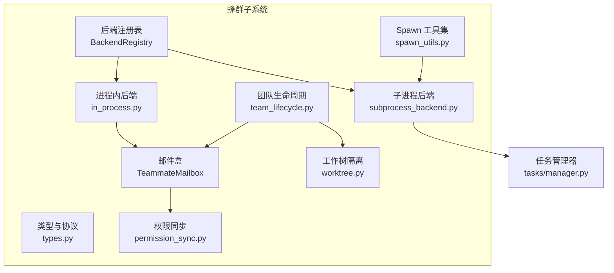
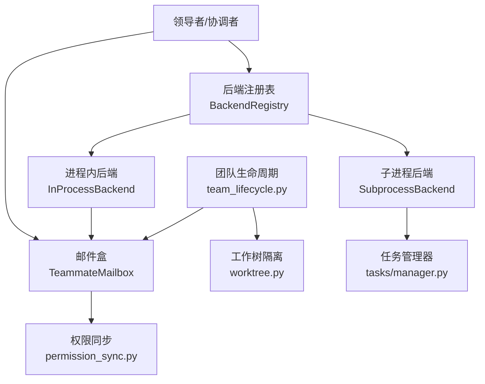
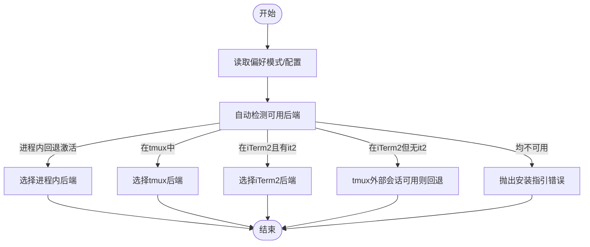
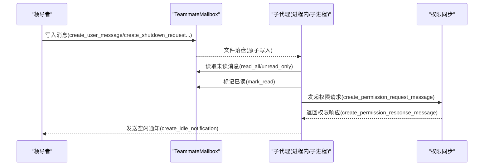
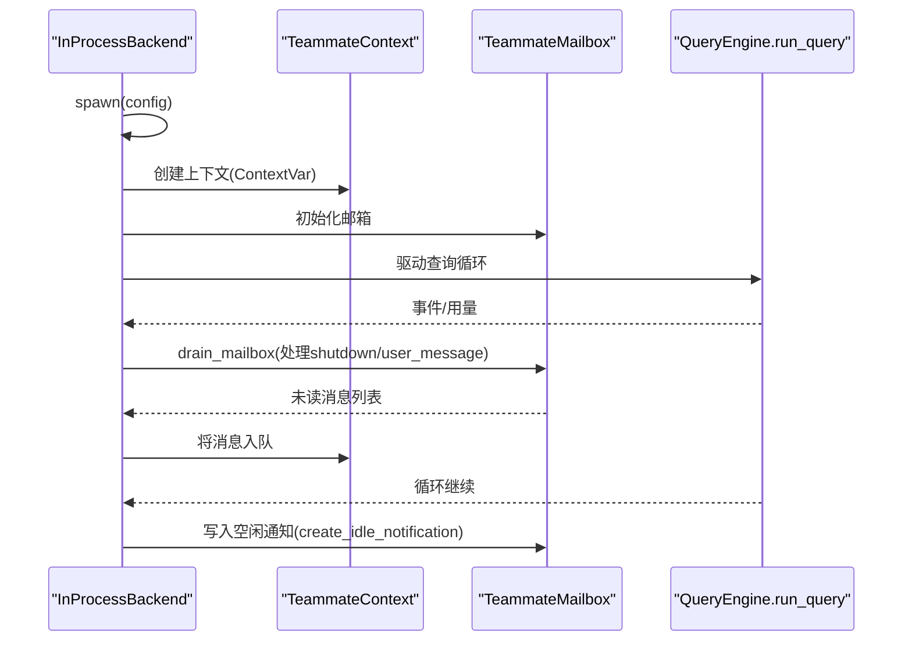
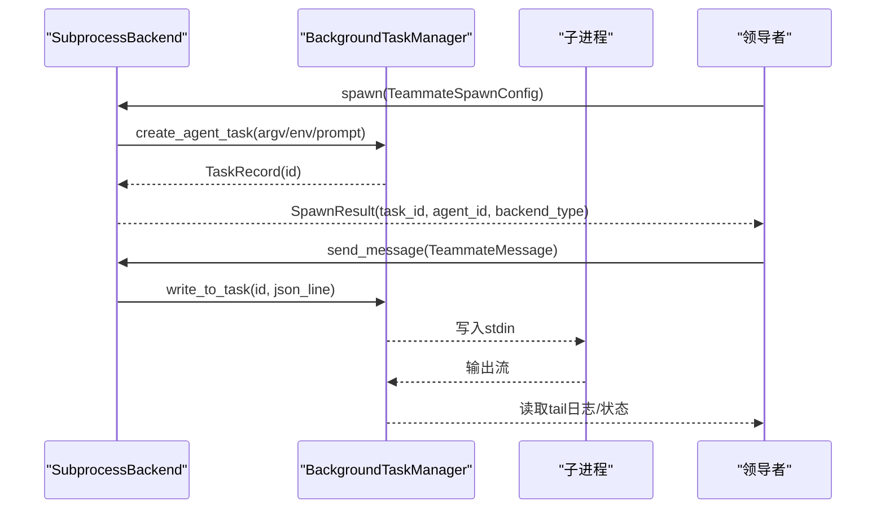
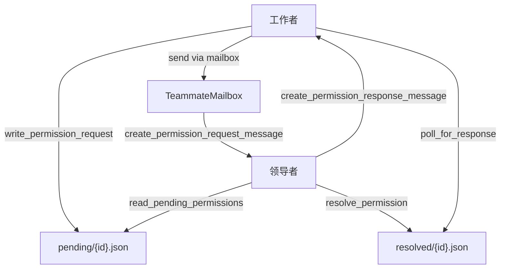
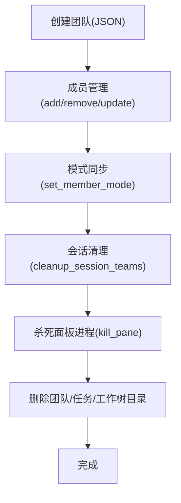
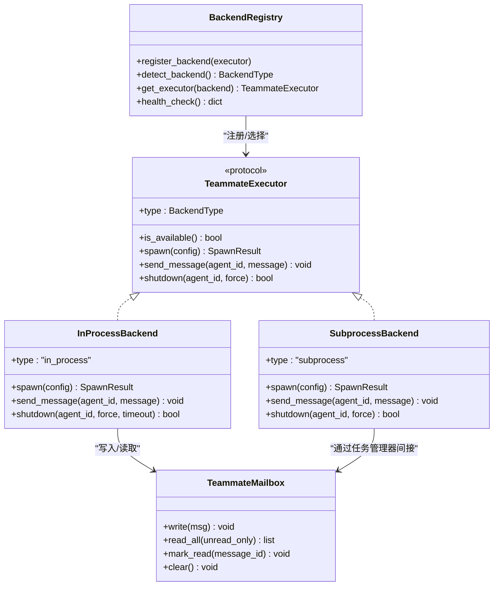
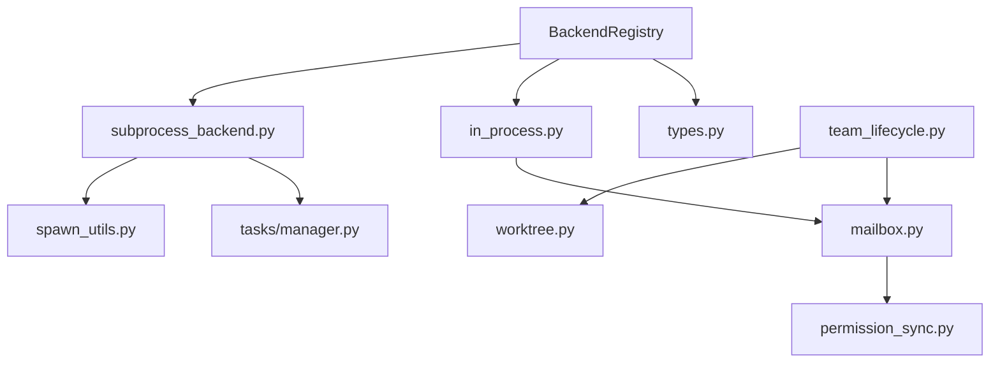

# 蜂群系统

<cite>
**本文引用的文件**
- [swarm/__init__.py](file://src/openharness/swarm/__init__.py)
- [swarm/registry.py](file://src/openharness/swarm/registry.py)
- [swarm/types.py](file://src/openharness/swarm/types.py)
- [swarm/mailbox.py](file://src/openharness/swarm/mailbox.py)
- [swarm/in_process.py](file://src/openharness/swarm/in_process.py)
- [swarm/subprocess_backend.py](file://src/openharness/swarm/subprocess_backend.py)
- [swarm/spawn_utils.py](file://src/openharness/swarm/spawn_utils.py)
- [swarm/team_lifecycle.py](file://src/openharness/swarm/team_lifecycle.py)
- [swarm/worktree.py](file://src/openharness/swarm/worktree.py)
- [swarm/permission_sync.py](file://src/openharness/swarm/permission_sync.py)
- [tasks/manager.py](file://src/openharness/tasks/manager.py)
- [tools/team_create_tool.py](file://src/openharness/tools/team_create_tool.py)
- [tools/team_delete_tool.py](file://src/openharness/tools/team_delete_tool.py)
- [README.md](file://README.md)
</cite>

## 目录
1. [简介](#简介)
2. [项目结构](#项目结构)
3. [核心组件](#核心组件)
4. [架构总览](#架构总览)
5. [详细组件分析](#详细组件分析)
6. [依赖关系分析](#依赖关系分析)
7. [性能考虑](#性能考虑)
8. [故障排查指南](#故障排查指南)
9. [结论](#结论)
10. [附录](#附录)

## 简介
本文件系统化阐述 OpenHarness 蜂群（Swarm）系统的设计与实现，覆盖团队注册表、生命周期管理、邮件盒机制、子代理生成与委托、权限同步、进程间通信与任务分发、配置与使用、与任务管理系统的集成、扩展性与并行执行、监控与调试以及最佳实践与性能优化建议。目标是帮助读者在不深入源码细节的前提下理解蜂群系统如何组织多智能体协作，并在生产环境中安全高效地运行。

## 项目结构
蜂群系统位于 openharness/swarm 子模块，围绕“后端抽象 + 邮件盒 + 权限同步 + 生命周期管理 + 工作树隔离”五大支柱构建，同时通过任务管理器完成子代理的进程级生命周期控制。

图示来源
- [swarm/registry.py:97-411](file://src/openharness/swarm/registry.py#L97-L411)
- [swarm/types.py:1-399](file://src/openharness/swarm/types.py#L1-L399)
- [swarm/mailbox.py:102-523](file://src/openharness/swarm/mailbox.py#L102-L523)
- [swarm/permission_sync.py:1-1169](file://src/openharness/swarm/permission_sync.py#L1-L1169)
- [swarm/team_lifecycle.py:780-911](file://src/openharness/swarm/team_lifecycle.py#L780-L911)
- [swarm/worktree.py:135-316](file://src/openharness/swarm/worktree.py#L135-L316)
- [swarm/in_process.py:413-694](file://src/openharness/swarm/in_process.py#L413-L694)
- [swarm/subprocess_backend.py:28-172](file://src/openharness/swarm/subprocess_backend.py#L28-L172)
- [swarm/spawn_utils.py:1-217](file://src/openharness/swarm/spawn_utils.py#L1-L217)
- [tasks/manager.py:49-474](file://src/openharness/tasks/manager.py#L49-L474)

章节来源
- [swarm/__init__.py:1-71](file://src/openharness/swarm/__init__.py#L1-L71)
- [README.md:446-502](file://README.md#L446-L502)

## 核心组件
- 后端注册表：统一发现与选择执行后端（进程内、子进程、tmux/iTerm2），并提供健康检查与回退策略。
- 类型与协议：定义后端类型、执行器协议、消息与Spawn结果等核心数据结构。
- 邮件盒：基于文件系统的异步消息队列，支持原子写入、读取、标记已读与清理。
- 权限同步：提供文件目录与邮件盒两种路径的请求/响应协调，支持只读启发式与沙箱权限。
- 团队生命周期：以磁盘 JSON 文件持久化团队元数据，提供成员增删、模式同步、会话清理与工作树回收。
- 工作树隔离：对子代理提供 Git 工作树隔离，避免相互污染。
- 进程内后端：在当前进程中以 asyncio Task 执行，使用上下文变量隔离状态，支持优雅/强制关闭。
- 子进程后端：通过任务管理器创建子进程，stdin/stdout 与主进程交互。
- Spawn 工具集：负责命令解析、环境变量继承、tmux 检测等。
- 任务管理器：统一管理后台任务的创建、输入输出、重启与监听回调。

章节来源
- [swarm/registry.py:97-411](file://src/openharness/swarm/registry.py#L97-L411)
- [swarm/types.py:1-399](file://src/openharness/swarm/types.py#L1-L399)
- [swarm/mailbox.py:102-523](file://src/openharness/swarm/mailbox.py#L102-L523)
- [swarm/permission_sync.py:1-1169](file://src/openharness/swarm/permission_sync.py#L1-L1169)
- [swarm/team_lifecycle.py:780-911](file://src/openharness/swarm/team_lifecycle.py#L780-L911)
- [swarm/worktree.py:135-316](file://src/openharness/swarm/worktree.py#L135-L316)
- [swarm/in_process.py:413-694](file://src/openharness/swarm/in_process.py#L413-L694)
- [swarm/subprocess_backend.py:28-172](file://src/openharness/swarm/subprocess_backend.py#L28-L172)
- [swarm/spawn_utils.py:1-217](file://src/openharness/swarm/spawn_utils.py#L1-L217)
- [tasks/manager.py:49-474](file://src/openharness/tasks/manager.py#L49-L474)

## 架构总览
蜂群系统采用“后端抽象 + 文件消息 + 权限协调 + 生命周期持久化”的组合架构。领导者通过邮件盒向子代理投递消息；子代理根据后端类型选择执行路径（进程内或子进程），并在需要时通过权限同步与领导者协商；团队信息持久化到磁盘，确保跨会话可恢复与清理。

图示来源
- [swarm/registry.py:97-411](file://src/openharness/swarm/registry.py#L97-L411)
- [swarm/mailbox.py:102-523](file://src/openharness/swarm/mailbox.py#L102-L523)
- [swarm/permission_sync.py:766-800](file://src/openharness/swarm/permission_sync.py#L766-L800)
- [swarm/in_process.py:413-694](file://src/openharness/swarm/in_process.py#L413-L694)
- [swarm/subprocess_backend.py:28-172](file://src/openharness/swarm/subprocess_backend.py#L28-L172)
- [tasks/manager.py:49-474](file://src/openharness/tasks/manager.py#L49-L474)
- [swarm/team_lifecycle.py:780-911](file://src/openharness/swarm/team_lifecycle.py#L780-L911)
- [swarm/worktree.py:135-316](file://src/openharness/swarm/worktree.py#L135-L316)

## 详细组件分析

### 组件A：后端注册表与检测
- 职责：自动检测可用后端（优先进程内，其次 tmux/iTerm2，最后子进程），并提供回退与缓存。
- 关键点：
  - 支持“偏好模式”（环境变量或配置）与自动检测。
  - 健康检查返回每个后端可用性统计。
  - 当无面板后端可用时，记录回退并持续使用进程内后端。
- 与 UI/终端的耦合：面板后端检测与 iTerm2/tmux 的环境变量与二进制存在性相关。

图示来源
- [swarm/registry.py:128-268](file://src/openharness/swarm/registry.py#L128-L268)

章节来源
- [swarm/registry.py:97-411](file://src/openharness/swarm/registry.py#L97-L411)

### 组件B：邮件盒与消息传递
- 职责：以文件系统为基础的消息队列，原子写入、并发锁、未读标记、清理。
- 关键点：
  - 消息类型涵盖用户消息、权限请求/响应、沙箱权限请求/响应、关机、空闲通知。
  - 提供工厂函数快速构造消息，支持从文本内容推断消息类型。
  - 与权限同步配合，既可直接写入，也可通过权限模块转发。
- 并发与可靠性：线程池 I/O + 排他锁，避免部分写入与竞态。

图示来源
- [swarm/mailbox.py:102-230](file://src/openharness/swarm/mailbox.py#L102-L230)
- [swarm/mailbox.py:253-396](file://src/openharness/swarm/mailbox.py#L253-L396)
- [swarm/permission_sync.py:766-800](file://src/openharness/swarm/permission_sync.py#L766-L800)

章节来源
- [swarm/mailbox.py:1-523](file://src/openharness/swarm/mailbox.py#L1-L523)

### 组件C：进程内后端与查询循环
- 职责：在当前进程中以 asyncio Task 执行，隔离上下文，驱动查询循环，处理消息队列与空闲通知。
- 关键点：
  - 使用 ContextVar 保存每个子代理的状态（身份、取消控制器、消息队列、统计）。
  - 在事件之间轮询邮箱，注入用户消息作为新回合，统计工具调用次数与 token。
  - 支持优雅/强制关闭，超时保护与清理回调。
- 与引擎集成：通过查询引擎的 run_query 流水线，逐步推进对话与工具调用。

图示来源
- [swarm/in_process.py:196-396](file://src/openharness/swarm/in_process.py#L196-L396)
- [swarm/in_process.py:413-694](file://src/openharness/swarm/in_process.py#L413-L694)

章节来源
- [swarm/in_process.py:1-694](file://src/openharness/swarm/in_process.py#L1-L694)

### 组件D：子进程后端与任务管理
- 职责：通过任务管理器创建子进程，stdin/stdout 与子代理通信，支持重启与监听回调。
- 关键点：
  - 优先 argv 直接执行，绕过 shell，避免 Windows Git Bash 的路径问题。
  - 通过任务管理器的输入编码协议，保证消息边界与兼容性。
  - 支持写入失败自动重启，保留重启次数与状态提示。
- 与 Spawn 工具集：继承 CLI 与环境变量，确保子代理与父进程一致的配置。

图示来源
- [swarm/subprocess_backend.py:47-116](file://src/openharness/swarm/subprocess_backend.py#L47-L116)
- [tasks/manager.py:114-158](file://src/openharness/tasks/manager.py#L114-L158)
- [swarm/spawn_utils.py:96-182](file://src/openharness/swarm/spawn_utils.py#L96-L182)

章节来源
- [swarm/subprocess_backend.py:1-172](file://src/openharness/swarm/subprocess_backend.py#L1-L172)
- [tasks/manager.py:1-474](file://src/openharness/tasks/manager.py#L1-L474)
- [swarm/spawn_utils.py:1-217](file://src/openharness/swarm/spawn_utils.py#L1-L217)

### 组件E：权限同步与沙箱授权
- 职责：提供文件目录与邮件盒两种路径的请求/响应协调；支持只读启发式与沙箱权限。
- 关键点：
  - 文件路径：pending/ 与 resolved/ 目录，原子写入与锁保护。
  - 邮件盒路径：通过 create_permission_request_message / create_permission_response_message 转发。
  - 角色判定：通过环境变量判断是否为领导者或工作者。
- 兼容性：提供旧版响应格式转换与删除接口，保障平滑迁移。

图示来源
- [swarm/permission_sync.py:409-570](file://src/openharness/swarm/permission_sync.py#L409-L570)
- [swarm/permission_sync.py:766-800](file://src/openharness/swarm/permission_sync.py#L766-L800)

章节来源
- [swarm/permission_sync.py:1-1169](file://src/openharness/swarm/permission_sync.py#L1-L1169)

### 组件F：团队生命周期与会话清理
- 职责：以 JSON 文件持久化团队元数据，提供成员管理、模式同步、会话清理与工作树回收。
- 关键点：
  - 团队目录布局与邮箱目录一致，便于无缝协作。
  - 注册会话清理，异常退出时先杀面板进程再删除目录。
  - 工作树支持符号链接加速与按活跃代理清理。
- 数据模型：TeamFile、TeamMember、AllowedPath 等。

图示来源
- [swarm/team_lifecycle.py:796-870](file://src/openharness/swarm/team_lifecycle.py#L796-L870)
- [swarm/team_lifecycle.py:671-693](file://src/openharness/swarm/team_lifecycle.py#L671-L693)
- [swarm/worktree.py:135-316](file://src/openharness/swarm/worktree.py#L135-L316)

章节来源
- [swarm/team_lifecycle.py:1-911](file://src/openharness/swarm/team_lifecycle.py#L1-L911)
- [swarm/worktree.py:1-316](file://src/openharness/swarm/worktree.py#L1-L316)

### 组件G：类型与协议（代码级类图）

图示来源
- [swarm/registry.py:97-411](file://src/openharness/swarm/registry.py#L97-L411)
- [swarm/types.py:357-399](file://src/openharness/swarm/types.py#L357-L399)
- [swarm/in_process.py:413-694](file://src/openharness/swarm/in_process.py#L413-L694)
- [swarm/subprocess_backend.py:28-172](file://src/openharness/swarm/subprocess_backend.py#L28-L172)
- [swarm/mailbox.py:102-230](file://src/openharness/swarm/mailbox.py#L102-L230)

章节来源
- [swarm/types.py:1-399](file://src/openharness/swarm/types.py#L1-L399)

## 依赖关系分析
- 组件耦合：
  - 后端注册表与执行器协议解耦，便于新增后端。
  - 邮件盒与权限同步松耦合，既可通过文件也可通过邮箱转发。
  - 子进程后端依赖任务管理器，进程内后端直接与邮箱/查询引擎交互。
- 外部依赖：
  - tmux/iTerm2 可选依赖，影响面板后端可用性。
  - Git 工作树用于隔离，非必需但推荐。
- 循环依赖规避：延迟导入查询引擎，避免模块加载时的循环。

图示来源
- [swarm/registry.py:379-391](file://src/openharness/swarm/registry.py#L379-L391)
- [swarm/subprocess_backend.py:87-115](file://src/openharness/swarm/subprocess_backend.py#L87-L115)
- [swarm/in_process.py:347-351](file://src/openharness/swarm/in_process.py#L347-L351)
- [swarm/mailbox.py:246-246](file://src/openharness/swarm/mailbox.py#L246-L246)
- [swarm/team_lifecycle.py:25-25](file://src/openharness/swarm/team_lifecycle.py#L25-L25)
- [swarm/worktree.py:135-135](file://src/openharness/swarm/worktree.py#L135-L135)
- [swarm/spawn_utils.py:70-94](file://src/openharness/swarm/spawn_utils.py#L70-L94)

章节来源
- [swarm/registry.py:1-411](file://src/openharness/swarm/registry.py#L1-L411)
- [tasks/manager.py:1-474](file://src/openharness/tasks/manager.py#L1-L474)

## 性能考虑
- 并发与锁：邮件盒写入使用排他锁与线程池，避免阻塞事件循环；读取批量扫描 JSON 文件，建议控制消息大小与数量。
- I/O 优化：原子写入（.tmp + rename）减少部分读取风险；输出文件尾部读取限制大小，避免内存膨胀。
- 进程模型：子进程后端优先 argv 直接执行，减少 shell 层开销；任务管理器统一输入编码，降低协议复杂度。
- 查询循环：进程内后端在事件之间轮询邮箱与注入消息队列，注意消息堆积导致的延迟。
- 清理策略：会话清理先杀面板进程再删除目录，避免孤儿进程；工作树清理前先移除符号链接，提升删除效率。

## 故障排查指南
- 后端不可用：
  - 检查面板后端检测日志与环境变量（TMUX、ITERM_SESSION_ID、it2 可用性）。
  - 若无面板后端，系统会回退到进程内后端，后续检测结果会被缓存。
- 邮件盒异常：
  - 查看写入锁与临时文件是否存在；确认磁盘空间与权限。
  - 使用 read_all 时注意忽略损坏文件，必要时清理邮箱。
- 权限请求卡住：
  - 检查 pending/ 与 resolved/ 目录是否存在锁文件冲突。
  - 使用 poll_for_response 或 read_resolved_permission 定位状态。
- 子代理无响应：
  - 检查任务管理器的任务状态与输出日志。
  - 确认 stdin 编码协议与消息边界；关注自动重启提示。
- 工作树问题：
  - 校验 slug 合法性与路径段规则；清理时先移除符号链接。
- 会话清理失败：
  - 确认面板进程 ID 是否仍有效；必要时手动清理目录。

章节来源
- [swarm/registry.py:204-268](file://src/openharness/swarm/registry.py#L204-L268)
- [swarm/mailbox.py:126-230](file://src/openharness/swarm/mailbox.py#L126-L230)
- [swarm/permission_sync.py:426-570](file://src/openharness/swarm/permission_sync.py#L426-L570)
- [tasks/manager.py:214-229](file://src/openharness/tasks/manager.py#L214-L229)
- [swarm/worktree.py:135-316](file://src/openharness/swarm/worktree.py#L135-L316)
- [swarm/team_lifecycle.py:671-693](file://src/openharness/swarm/team_lifecycle.py#L671-L693)

## 结论
蜂群系统通过“后端抽象 + 文件消息 + 权限协调 + 生命周期持久化 + 工作树隔离”的组合，实现了多智能体的可观察、可恢复、可扩展的协作框架。其设计兼顾了安全性（权限与沙箱）、可观测性（邮箱与日志）与易用性（自动检测与回退）。在生产环境中，建议结合任务管理器的重启与监听机制、严格的权限策略与定期清理流程，确保系统的稳定性与可维护性。

## 附录

### 配置与使用指南
- 后端模式：
  - 通过环境变量或配置项设置 teammate_mode（auto/in_process/tmux）。
  - 自动检测优先选择面板后端，否则回退到进程内后端。
- 邮件盒：
  - 使用 create_user_message/create_shutdown_request 等工厂函数快速构造消息。
  - 通过 TeammateMailbox 的 read_all/mark_read/clear 管理消息。
- 权限：
  - 工作者侧使用 write_permission_request/send_permission_request_via_mailbox。
  - 领导者侧使用 read_pending_permissions/resolve_permission。
- 团队生命周期：
  - 使用 team_create_tool/team_delete_tool 管理内存中的团队；磁盘持久化由 team_lifecycle.py 负责。
- 工作树：
  - 通过 WorktreeManager 创建/删除/列出工作树，支持符号链接加速与按活跃代理清理。

章节来源
- [swarm/registry.py:292-318](file://src/openharness/swarm/registry.py#L292-L318)
- [swarm/mailbox.py:253-396](file://src/openharness/swarm/mailbox.py#L253-L396)
- [swarm/permission_sync.py:409-570](file://src/openharness/swarm/permission_sync.py#L409-L570)
- [tools/team_create_tool.py:18-32](file://src/openharness/tools/team_create_tool.py#L18-L32)
- [tools/team_delete_tool.py:17-31](file://src/openharness/tools/team_delete_tool.py#L17-L31)
- [swarm/worktree.py:135-316](file://src/openharness/swarm/worktree.py#L135-L316)

### 与任务管理系统的集成
- 子进程后端通过任务管理器创建子进程，stdin/stdout 与主进程交互。
- 输入编码协议保证消息边界，支持纯文本与结构化负载混合。
- 任务重启时保留重启次数与状态提示，便于诊断。

章节来源
- [swarm/subprocess_backend.py:87-158](file://src/openharness/swarm/subprocess_backend.py#L87-L158)
- [tasks/manager.py:23-44](file://src/openharness/tasks/manager.py#L23-L44)
- [tasks/manager.py:345-362](file://src/openharness/tasks/manager.py#L345-L362)

### 扩展性与并行执行
- 后端扩展：实现 TeammateExecutor 即可接入新的执行后端（如 tmux/iTerm2 后端）。
- 并行执行：进程内后端以 asyncio Task 并行运行多个子代理；子进程后端通过任务管理器并行管理。
- 邮件盒：天然支持多写者/多读者场景，适合高并发消息传递。

章节来源
- [swarm/types.py:357-399](file://src/openharness/swarm/types.py#L357-L399)
- [swarm/in_process.py:464-492](file://src/openharness/swarm/in_process.py#L464-L492)
- [swarm/subprocess_backend.py:37-45](file://src/openharness/swarm/subprocess_backend.py#L37-L45)

### 监控与调试
- 日志：各模块使用标准日志记录检测、写入、清理等关键事件。
- 邮件盒：read_all 支持 unread_only 控制，便于增量消费。
- 任务管理器：提供任务状态、输出日志与完成监听器，便于外部监控。
- 会话清理：异常退出时自动清理面板进程与目录，减少资源泄漏。

章节来源
- [swarm/mailbox.py:153-181](file://src/openharness/swarm/mailbox.py#L153-L181)
- [tasks/manager.py:164-191](file://src/openharness/tasks/manager.py#L164-L191)
- [swarm/team_lifecycle.py:671-693](file://src/openharness/swarm/team_lifecycle.py#L671-L693)