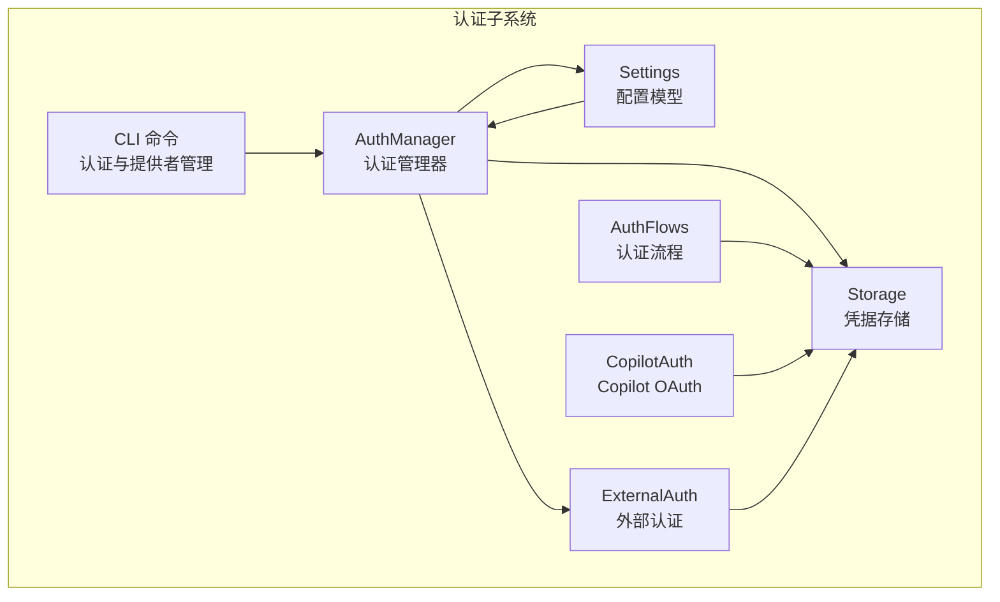
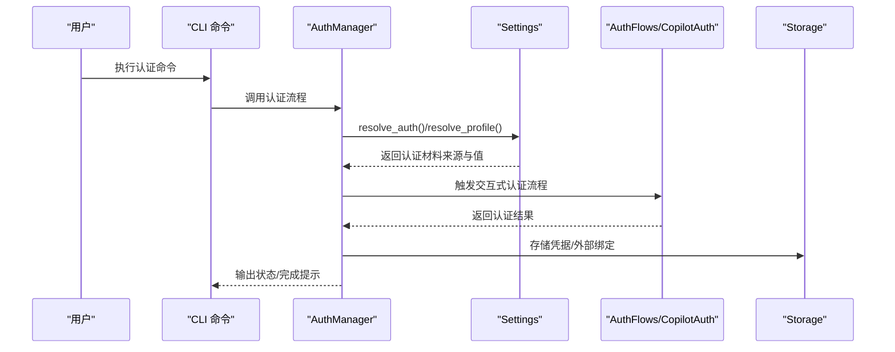
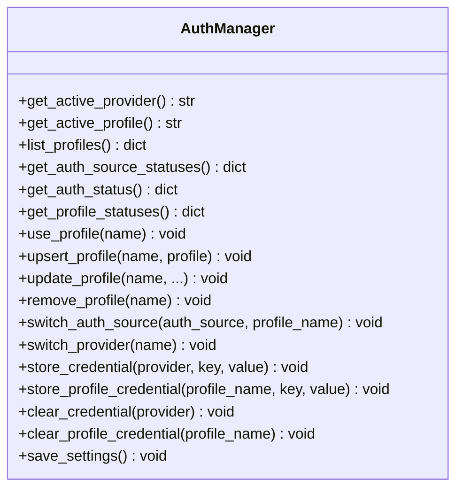
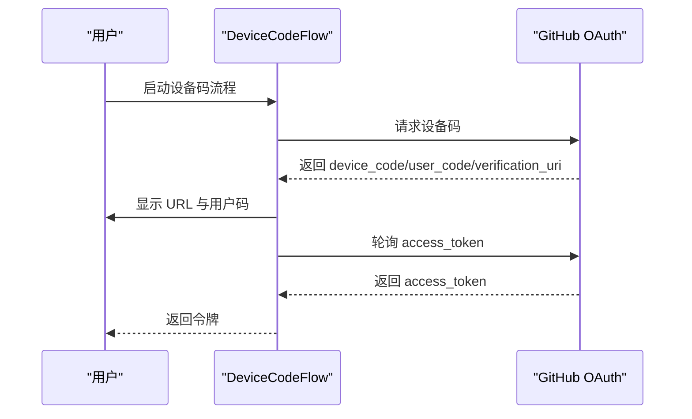
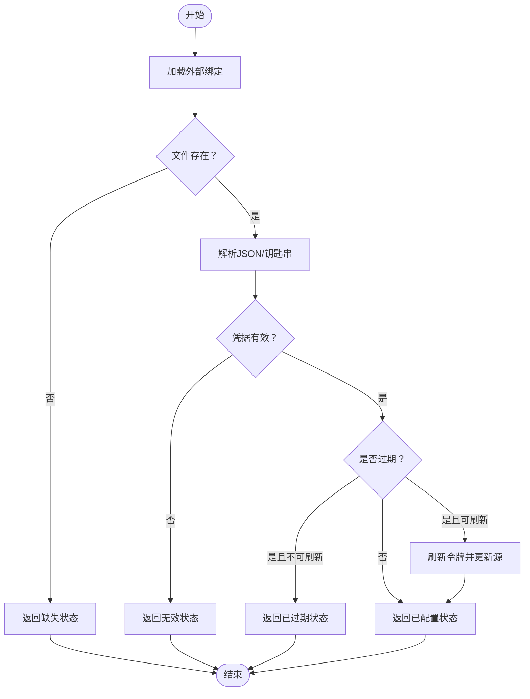
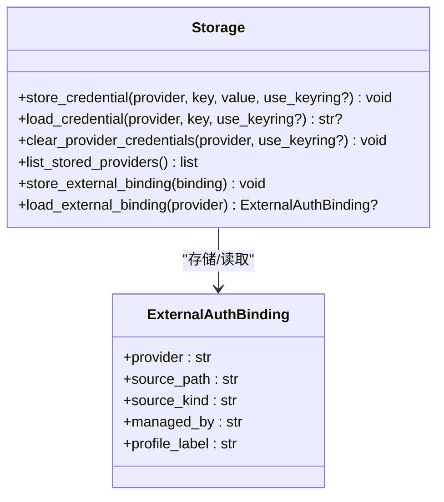
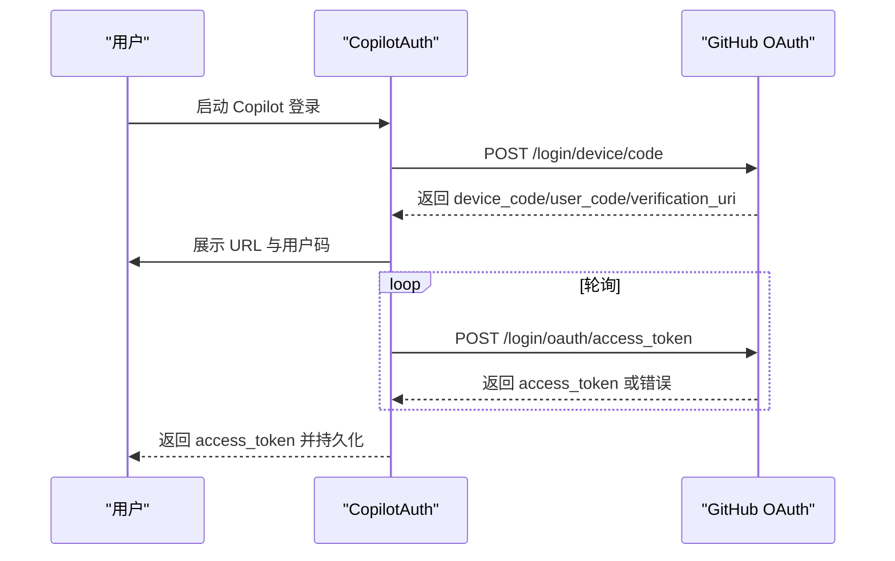
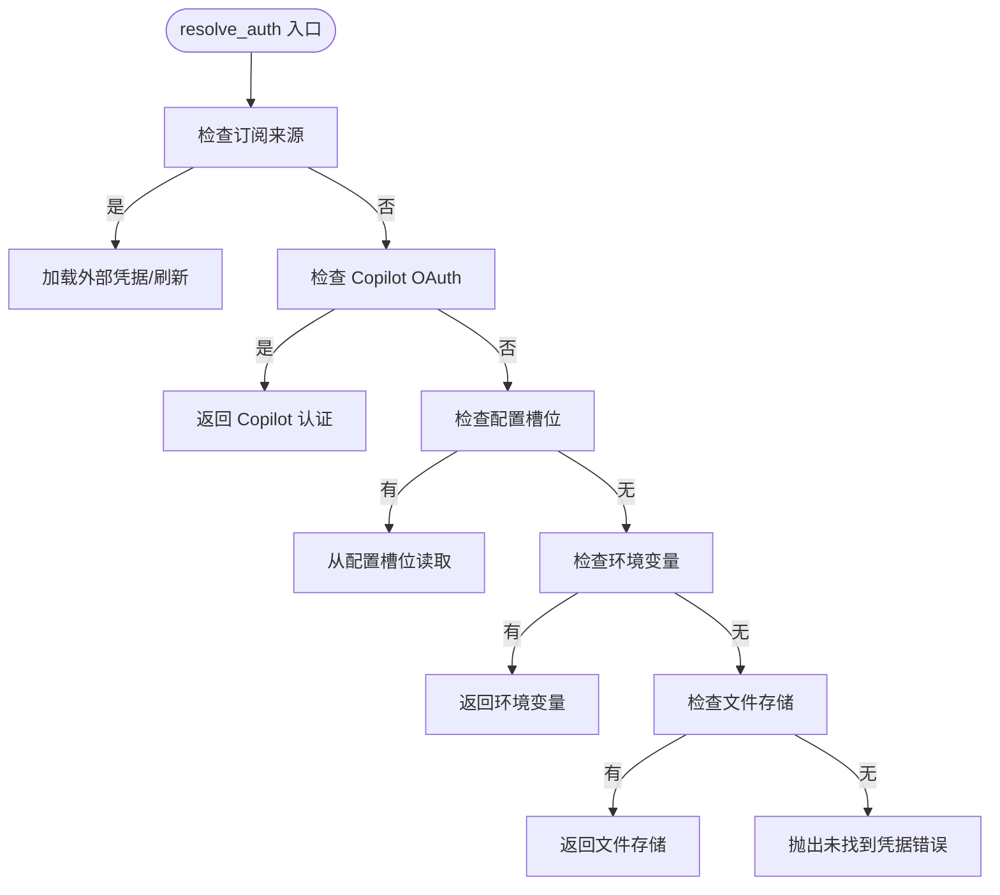
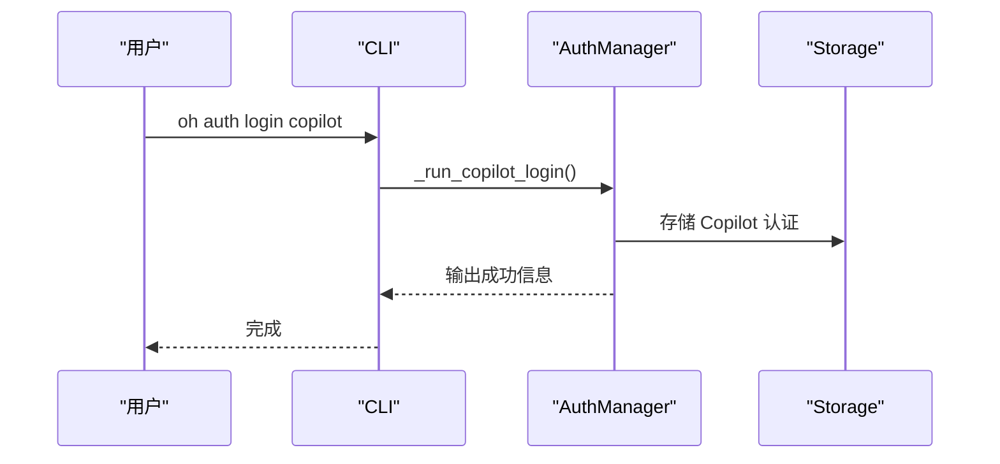
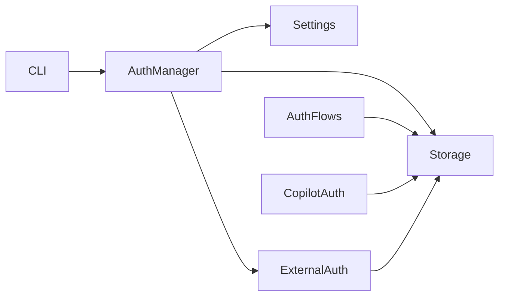

# 认证系统

<cite>
**本文档引用的文件**
- [auth/__init__.py](file://src/openharness/auth/__init__.py)
- [auth/manager.py](file://src/openharness/auth/manager.py)
- [auth/external.py](file://src/openharness/auth/external.py)
- [auth/flows.py](file://src/openharness/auth/flows.py)
- [auth/storage.py](file://src/openharness/auth/storage.py)
- [api/copilot_auth.py](file://src/openharness/api/copilot_auth.py)
- [config/settings.py](file://src/openharness/config/settings.py)
- [cli.py](file://src/openharness/cli.py)
</cite>

## 目录
1. [简介](#简介)
2. [项目结构](#项目结构)
3. [核心组件](#核心组件)
4. [架构总览](#架构总览)
5. [详细组件分析](#详细组件分析)
6. [依赖关系分析](#依赖关系分析)
7. [性能考虑](#性能考虑)
8. [故障排除指南](#故障排除指南)
9. [结论](#结论)
10. [附录](#附录)

## 简介
本文件系统性阐述 OpenHarness 的认证体系，涵盖认证管理器、外部认证、认证流程与存储机制，并详细说明 API 密钥、OAuth 流程（以 GitHub Copilot 为例）、以及 GitHub Copilot 专用认证方式的实现。文档还解释了认证状态管理、服务端存储机制、配置与使用指南、安全机制与最佳实践、扩展性与自定义认证方式开发、故障排除与调试方法，以及故障恢复与重试策略。

## 项目结构
OpenHarness 的认证子系统主要由以下模块组成：
- 认证管理器：统一管理认证状态、提供者切换、配置持久化与查询
- 认证流程：封装不同认证方式的交互逻辑（API 密钥、设备码 OAuth、浏览器回调）
- 外部认证：对接第三方 CLI（如 Claude、Codex）管理的订阅凭证
- 存储层：文件与系统密钥环双后端的凭据存储
- API 客户端：GitHub Copilot 的 OAuth 设备码流程与持久化
- 配置模型：提供者配置、认证来源映射与运行时解析

**图表来源**
- [auth/manager.py](file://src/openharness/auth/manager.py)
- [auth/flows.py](file://src/openharness/auth/flows.py)
- [auth/external.py](file://src/openharness/auth/external.py)
- [auth/storage.py](file://src/openharness/auth/storage.py)
- [api/copilot_auth.py](file://src/openharness/api/copilot_auth.py)
- [config/settings.py](file://src/openharness/config/settings.py)
- [cli.py](file://src/openharness/cli.py)

**章节来源**
- [auth/__init__.py](file://src/openharness/auth/__init__.py)
- [auth/manager.py](file://src/openharness/auth/manager.py)
- [auth/flows.py](file://src/openharness/auth/flows.py)
- [auth/external.py](file://src/openharness/auth/external.py)
- [auth/storage.py](file://src/openharness/auth/storage.py)
- [api/copilot_auth.py](file://src/openharness/api/copilot_auth.py)
- [config/settings.py](file://src/openharness/config/settings.py)
- [cli.py](file://src/openharness/cli.py)

## 核心组件
- 认证管理器（AuthManager）
  - 负责读取/写入凭据、维护当前活动提供者、列出可用配置文件、查询认证状态与配置状态、切换认证来源与提供者、持久化设置
- 认证流程（AuthFlows）
  - 封装三类流程：API 密钥直接输入、设备码 OAuth（GitHub Copilot）、浏览器打开授权后手动粘贴令牌
- 外部认证（ExternalAuth）
  - 对接 Claude/Codex CLI 凭证文件或系统钥匙串，支持过期检测与刷新
- 凭据存储（Storage）
  - 文件后端（默认，权限 600）与可选系统密钥环后端；提供原子写入与互斥锁保护
- Copilot OAuth（CopilotAuth）
  - 设备码授权流程、轮询获取访问令牌、企业版域名适配、本地持久化
- 配置模型（Settings）
  - 提供者配置文件、认证来源映射、运行时凭据解析（含订阅桥接）

**章节来源**
- [auth/manager.py](file://src/openharness/auth/manager.py)
- [auth/flows.py](file://src/openharness/auth/flows.py)
- [auth/external.py](file://src/openharness/auth/external.py)
- [auth/storage.py](file://src/openharness/auth/storage.py)
- [api/copilot_auth.py](file://src/openharness/api/copilot_auth.py)
- [config/settings.py](file://src/openharness/config/settings.py)

## 架构总览
OpenHarness 的认证架构采用“配置驱动 + 运行时解析”的模式：
- 配置层：通过 ProviderProfile 描述提供者、API 格式、认证来源、默认模型、基础 URL 等
- 解析层：Settings.resolve_auth 统一解析当前活动配置的认证材料，优先级为环境变量 > 文件存储 > 外部 CLI
- 管理层：AuthManager 汇总认证状态、提供者切换、配置持久化
- 流程层：AuthFlows 与 CopilotAuth 实现交互式认证
- 存储层：Storage 提供文件与密钥环双后端，确保凭据安全

**图表来源**
- [auth/manager.py](file://src/openharness/auth/manager.py)
- [config/settings.py](file://src/openharness/config/settings.py)
- [auth/flows.py](file://src/openharness/auth/flows.py)
- [api/copilot_auth.py](file://src/openharness/api/copilot_auth.py)
- [auth/storage.py](file://src/openharness/auth/storage.py)

## 详细组件分析

### 认证管理器（AuthManager）
- 主要职责
  - 获取/设置活动提供者与配置文件
  - 查询认证来源与提供者的配置状态
  - 切换认证来源与提供者
  - 存储/清除凭据，同步到扁平设置
- 关键能力
  - 认证来源状态聚合：遍历已知认证来源，检查环境变量、文件存储、外部绑定、Copilot 文件等
  - 提供者状态聚合：按已知提供者检查环境变量、外部绑定、文件存储等
  - 配置文件状态：结合认证来源状态与配置文件，输出“就绪/缺失”等状态
  - 设置持久化：保存配置文件，保持与扁平设置字段一致

**图表来源**
- [auth/manager.py](file://src/openharness/auth/manager.py)

**章节来源**
- [auth/manager.py](file://src/openharness/auth/manager.py)

### 认证流程（AuthFlows）
- API 密钥流程（ApiKeyFlow）
  - 交互式提示输入 API 密钥，校验非空后返回
- 设备码 OAuth（DeviceCodeFlow）
  - 请求设备码、打印验证 URL 与用户码、尝试自动打开浏览器、轮询获取访问令牌、进度回调
- 浏览器回调（BrowserFlow）
  - 打开授权 URL，提示用户粘贴令牌

**图表来源**
- [auth/flows.py](file://src/openharness/auth/flows.py)
- [api/copilot_auth.py](file://src/openharness/api/copilot_auth.py)

**章节来源**
- [auth/flows.py](file://src/openharness/auth/flows.py)
- [api/copilot_auth.py](file://src/openharness/api/copilot_auth.py)

### 外部认证（ExternalAuth）
- 支持的外部 CLI
  - Codex：读取 ~/.codex/auth.json 或 CODEX_HOME 下的 auth.json
  - Claude：读取 ~/.claude/.credentials.json 或 CLAUDE_CONFIG_DIR 下的 .credentials.json；macOS 可从钥匙串读取
- 凭据加载与刷新
  - 加载外部凭据，解析 JWT 过期时间，对 Claude 支持刷新
  - 刷新失败时给出明确错误提示，指导用户重新登录官方 CLI
- 状态描述
  - 缺失、无效、可刷新、已过期、已配置等状态与来源说明

**图表来源**
- [auth/external.py](file://src/openharness/auth/external.py)

**章节来源**
- [auth/external.py](file://src/openharness/auth/external.py)

### 凭据存储（Storage）
- 双后端策略
  - 文件后端：~/.openharness/credentials.json，权限 600，原子写入，互斥锁保护
  - 系统密钥环后端：可选，探测可用性；失败回退到文件后端
- 接口能力
  - 存储/读取/清除指定提供者的凭据
  - 存储/读取外部绑定元数据
  - 列出已存储的提供者
- 安全说明
  - 在无可用密钥环的容器/CI/WSL 环境下，凭据以明文 JSON 存储，仅受文件权限保护
  - 提供轻量混淆工具用于非敏感数据，不应用于加密密钥

**图表来源**
- [auth/storage.py](file://src/openharness/auth/storage.py)

**章节来源**
- [auth/storage.py](file://src/openharness/auth/storage.py)

### Copilot OAuth（CopilotAuth）
- 设备码流程
  - 请求设备码、打印用户码与验证 URL、轮询 access_token、处理 slow_down 与 authorization_pending
- 企业版支持
  - 自动推导 copilot-api.<domain> 基础地址
- 本地持久化
  - 将 GitHub OAuth 令牌与企业版域名写入 ~/.openharness/copilot_auth.json

**图表来源**
- [api/copilot_auth.py](file://src/openharness/api/copilot_auth.py)

**章节来源**
- [api/copilot_auth.py](file://src/openharness/api/copilot_auth.py)

### 配置模型（Settings）
- 提供者配置文件（ProviderProfile）
  - label/provider/api_format/auth_source/default_model/base_url/allowed_models 等
- 认证来源映射
  - auth_source_provider_name：将认证来源映射到运行时提供者名
  - auth_source_uses_api_key：判断认证来源是否基于 API 密钥
  - credential_storage_provider_name：定制存储命名空间
- 运行时解析
  - resolve_auth：统一解析当前配置的认证材料，优先级为外部 CLI > 环境变量 > 文件存储
  - resolve_api_key：在特定场景下解析 API Key

**图表来源**
- [config/settings.py](file://src/openharness/config/settings.py)

**章节来源**
- [config/settings.py](file://src/openharness/config/settings.py)

### CLI 认证与提供者管理
- 认证命令
  - auth login：选择提供者进行认证（API 密钥、设备码、外部绑定）
  - auth status：展示认证来源与提供者配置状态
  - auth logout：清除指定提供者或活动配置的认证
  - auth switch：切换活动配置的认证来源或提供者
- 提供者命令
  - provider list/use/add/edit/remove：管理配置文件
- 统一安装流程
  - setup：选择工作流、按需认证、设置模型

**图表来源**
- [cli.py](file://src/openharness/cli.py)
- [auth/manager.py](file://src/openharness/auth/manager.py)
- [auth/storage.py](file://src/openharness/auth/storage.py)
- [api/copilot_auth.py](file://src/openharness/api/copilot_auth.py)

**章节来源**
- [cli.py](file://src/openharness/cli.py)

## 依赖关系分析
- 认证管理器依赖配置模型与存储层，用于解析认证来源与持久化
- 认证流程与 Copilot OAuth 独立于配置层，但最终会调用存储层保存凭据
- 外部认证依赖存储层保存外部绑定元数据
- CLI 作为入口，协调管理器、流程与存储

**图表来源**
- [cli.py](file://src/openharness/cli.py)
- [auth/manager.py](file://src/openharness/auth/manager.py)
- [config/settings.py](file://src/openharness/config/settings.py)
- [auth/storage.py](file://src/openharness/auth/storage.py)
- [auth/external.py](file://src/openharness/auth/external.py)
- [auth/flows.py](file://src/openharness/auth/flows.py)
- [api/copilot_auth.py](file://src/openharness/api/copilot_auth.py)

**章节来源**
- [auth/manager.py](file://src/openharness/auth/manager.py)
- [config/settings.py](file://src/openharness/config/settings.py)
- [auth/storage.py](file://src/openharness/auth/storage.py)
- [auth/external.py](file://src/openharness/auth/external.py)
- [auth/flows.py](file://src/openharness/auth/flows.py)
- [api/copilot_auth.py](file://src/openharness/api/copilot_auth.py)
- [cli.py](file://src/openharness/cli.py)

## 性能考虑
- 存储层采用互斥锁与原子写入，避免并发写冲突，保证一致性
- 外部认证在需要时才加载与解析 JSON/钥匙串，减少不必要的 IO
- 设备码轮询加入安全间隔，降低服务器压力与被限流风险
- 配置解析按需加载，避免一次性导入全部配置

[本节为通用建议，无需具体文件分析]

## 故障排除指南
- 常见问题与定位
  - 未找到凭据：检查环境变量、文件存储、外部绑定是否正确配置
  - 外部凭据缺失：确认 ~/.codex 或 ~/.claude 目录存在，或 macOS 钥匙串中是否存在相应条目
  - Claude 凭据过期：若可刷新则自动刷新；否则提示重新登录官方 CLI
  - Copilot 设备码轮询失败：检查网络连通性、GitHub 域名可用性、慢速轮询处理
  - 密钥环不可用：系统无可用密钥环后端时回退到文件存储，注意文件权限
- 调试建议
  - 使用 auth status 查看认证来源与提供者状态
  - 清除认证后重新登录：auth logout 或清除对应提供者凭据
  - 检查 ~/.openharness 目录下的 credentials.json 与 copilot_auth.json 内容与权限

**章节来源**
- [auth/manager.py](file://src/openharness/auth/manager.py)
- [auth/external.py](file://src/openharness/auth/external.py)
- [api/copilot_auth.py](file://src/openharness/api/copilot_auth.py)
- [auth/storage.py](file://src/openharness/auth/storage.py)
- [cli.py](file://src/openharness/cli.py)

## 结论
OpenHarness 的认证系统通过“配置驱动 + 运行时解析 + 多后端存储”的架构，实现了对多种认证方式的统一管理。其优势在于：
- 统一的状态查询与切换接口
- 对外部 CLI 的无缝集成与自动刷新
- 双后端存储的安全与兼容性平衡
- CLI 的友好交互与完善的故障提示

在实际使用中，建议优先使用环境变量或系统密钥环存储敏感信息，并通过 CLI 的 status/switch/logout 等命令进行日常运维。

[本节为总结，无需具体文件分析]

## 附录

### 认证方式一览与实现要点
- API 密钥
  - 通过 ApiKeyFlow 交互输入，存储至文件或系统密钥环
- OAuth 设备码（GitHub Copilot）
  - 通过 DeviceCodeFlow 与 CopilotAuth 完成，支持企业版域名
- 外部订阅（Codex/Claude）
  - 通过 ExternalAuth 读取本地 JSON 或钥匙串，支持过期检测与刷新

**章节来源**
- [auth/flows.py](file://src/openharness/auth/flows.py)
- [api/copilot_auth.py](file://src/openharness/api/copilot_auth.py)
- [auth/external.py](file://src/openharness/auth/external.py)

### 认证状态与存储机制
- 认证来源状态
  - 检查顺序：环境变量 > 文件存储 > 外部绑定 > Copilot 文件
- 提供者状态
  - 检查顺序：环境变量 > 外部绑定 > 文件存储
- 存储位置
  - 默认：~/.openharness/credentials.json（权限 600）
  - 可选：系统密钥环（可用时优先）

**章节来源**
- [auth/manager.py](file://src/openharness/auth/manager.py)
- [auth/storage.py](file://src/openharness/auth/storage.py)

### 安全机制与最佳实践
- 机密信息优先放入系统密钥环；在容器/CI/WSL 环境下，文件存储仅受权限保护
- 不要使用轻量混淆工具加密 API Key；应使用密钥环或受保护的文件
- 定期检查外部绑定的有效性与过期情况
- 使用 CLI 的 logout/switch/status 管理认证状态

**章节来源**
- [auth/storage.py](file://src/openharness/auth/storage.py)
- [auth/manager.py](file://src/openharness/auth/manager.py)

### 扩展性与自定义认证方式
- 新增认证来源
  - 在配置层添加认证来源映射与默认提供者映射
  - 在管理器中扩展状态查询逻辑
  - 如需交互式流程，新增 AuthFlow 子类并在 CLI 中接入
- 新增提供者配置文件
  - 通过 provider add/edit/remove 管理配置文件
  - 使用 credential_slot 为特定配置绑定独立存储命名空间

**章节来源**
- [config/settings.py](file://src/openharness/config/settings.py)
- [auth/manager.py](file://src/openharness/auth/manager.py)
- [cli.py](file://src/openharness/cli.py)

### 故障恢复与重试策略
- 外部凭据刷新失败
  - 若 refresh_token 存在，尝试刷新；否则提示重新登录官方 CLI
- 设备码轮询
  - 遇到 slow_down 自动增加间隔；超时或授权失败给出明确错误
- 存储失败
  - 密钥环失败回退到文件存储；文件写入采用原子写入与互斥锁

**章节来源**
- [auth/external.py](file://src/openharness/auth/external.py)
- [api/copilot_auth.py](file://src/openharness/api/copilot_auth.py)
- [auth/storage.py](file://src/openharness/auth/storage.py)