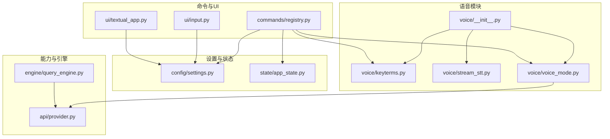
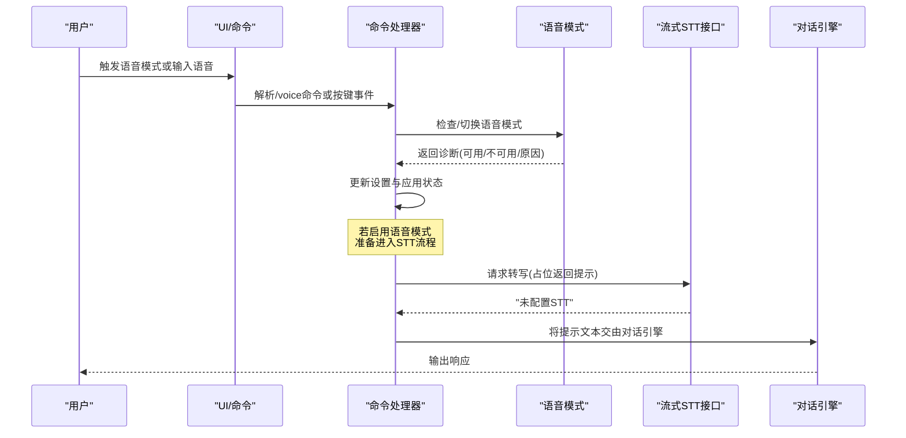
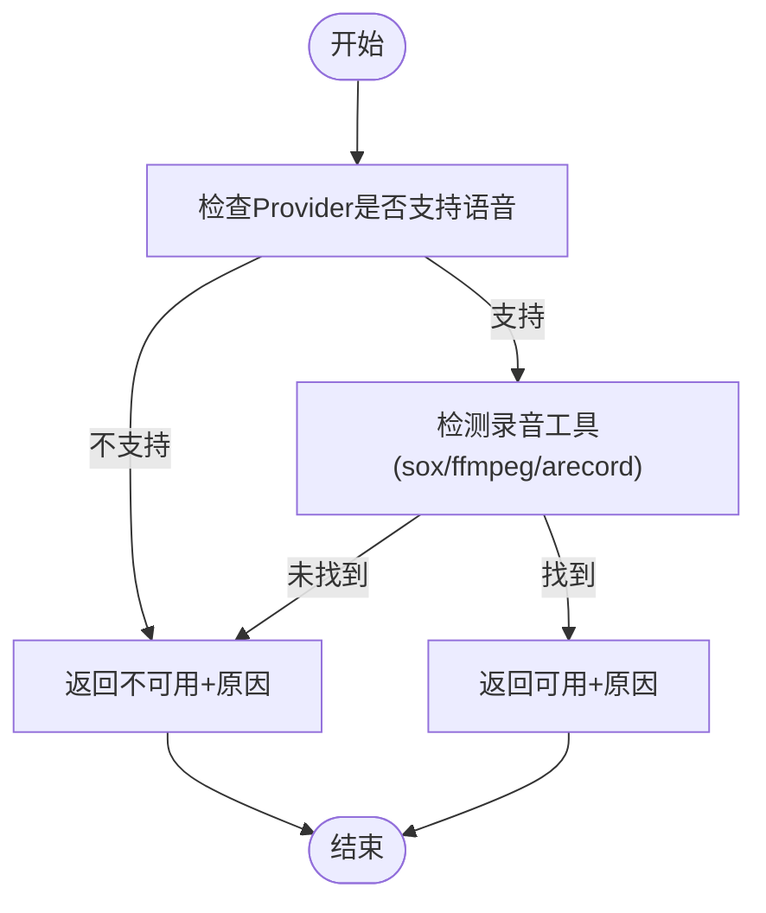
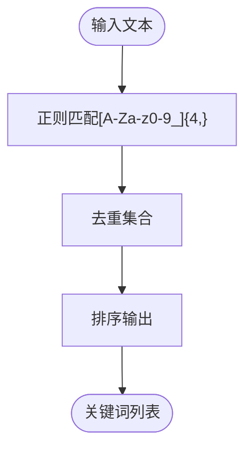
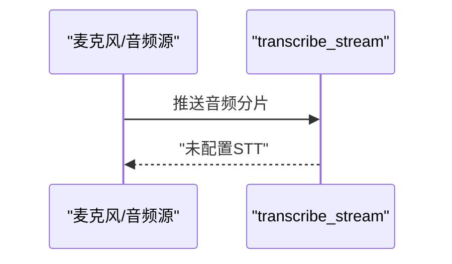
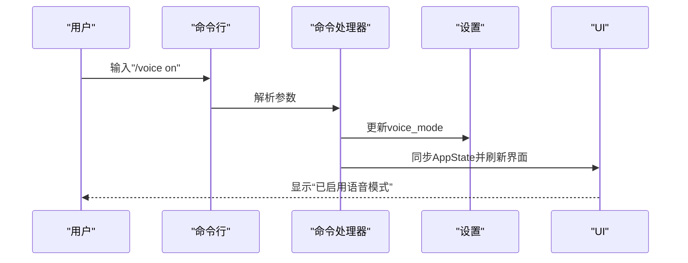
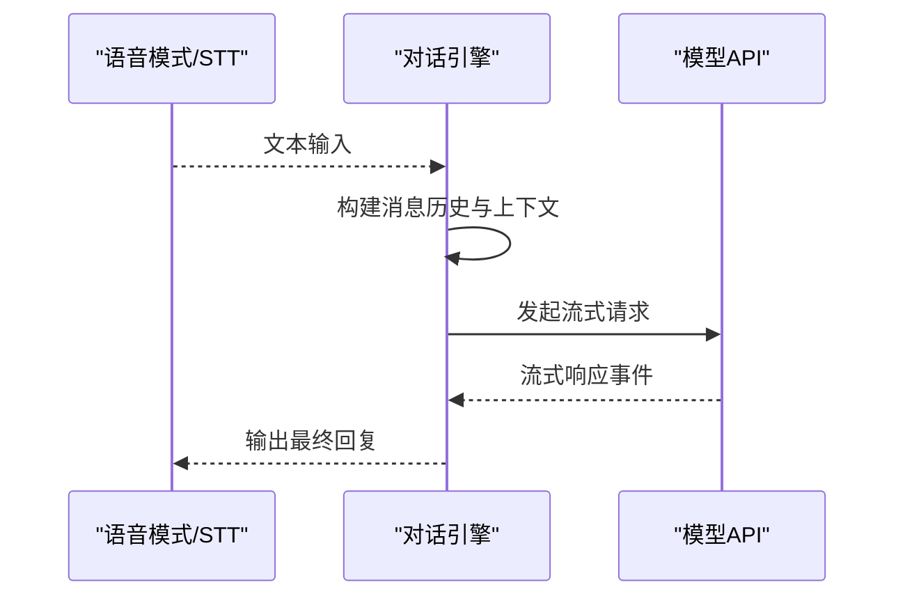
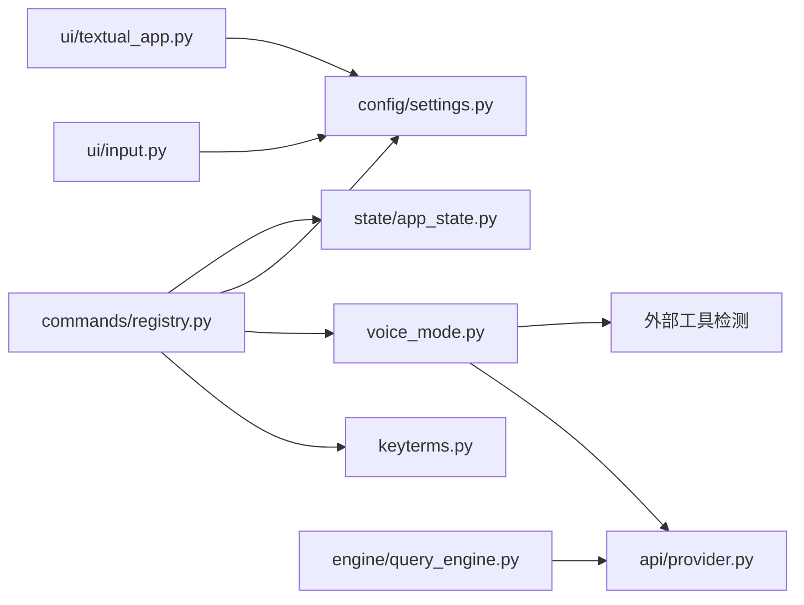

# 语音系统

<cite>
**本文引用的文件**
- [src/openharness/voice/__init__.py](file://src/openharness/voice/__init__.py)
- [src/openharness/voice/keyterms.py](file://src/openharness/voice/keyterms.py)
- [src/openharness/voice/stream_stt.py](file://src/openharness/voice/stream_stt.py)
- [src/openharness/voice/voice_mode.py](file://src/openharness/voice/voice_mode.py)
- [src/openharness/api/provider.py](file://src/openharness/api/provider.py)
- [src/openharness/state/app_state.py](file://src/openharness/state/app_state.py)
- [src/openharness/config/settings.py](file://src/openharness/config/settings.py)
- [src/openharness/commands/registry.py](file://src/openharness/commands/registry.py)
- [src/openharness/ui/input.py](file://src/openharness/ui/input.py)
- [src/openharness/ui/textual_app.py](file://src/openharness/ui/textual_app.py)
- [src/openharness/engine/query_engine.py](file://src/openharness/engine/query_engine.py)
</cite>

## 目录
1. [简介](#简介)
2. [项目结构](#项目结构)
3. [核心组件](#核心组件)
4. [架构总览](#架构总览)
5. [详细组件分析](#详细组件分析)
6. [依赖分析](#依赖分析)
7. [性能考虑](#性能考虑)
8. [故障排除指南](#故障排除指南)
9. [结论](#结论)
10. [附录](#附录)

## 简介
本文件面向OpenHarness语音系统，聚焦语音转文本（STT）流处理与语音模式管理，系统性阐述以下主题：
- 流式语音识别接口与占位实现
- 关键词提取与语音命令识别思路
- 语音模式的切换、诊断与配置
- 麦克风与音频设备管理建议与音质优化
- 语音系统与对话引擎的协作机制
- 使用示例、最佳实践与性能优化、故障排除

当前仓库中的语音模块以“占位实现”为主：STT接口返回提示信息而非实际流式识别；关键词提取提供基础规则；语音模式能力通过外部工具探测与Provider能力判定进行粗粒度评估。这些设计为后续接入真实STT后端提供了清晰的扩展点。

## 项目结构
语音系统位于Python包src/openharness/voice中，围绕三个核心模块组织：
- 语音模式与诊断：voice_mode.py
- 关键词提取：keyterms.py
- 流式STT接口：stream_stt.py
- 包导出：__init__.py

同时，语音模式与设置、应用状态、命令注册、UI输入装饰、Provider能力等在其他模块中协同工作。

**图示来源**
- [src/openharness/voice/__init__.py:1-7](file://src/openharness/voice/__init__.py#L1-L7)
- [src/openharness/voice/keyterms.py:1-11](file://src/openharness/voice/keyterms.py#L1-L11)
- [src/openharness/voice/stream_stt.py:1-9](file://src/openharness/voice/stream_stt.py#L1-L9)
- [src/openharness/voice/voice_mode.py:1-45](file://src/openharness/voice/voice_mode.py#L1-L45)
- [src/openharness/config/settings.py](file://src/openharness/config/settings.py#L531)
- [src/openharness/state/app_state.py:20-22](file://src/openharness/state/app_state.py#L20-L22)
- [src/openharness/commands/registry.py:1624-1653](file://src/openharness/commands/registry.py#L1624-L1653)
- [src/openharness/ui/input.py:15-23](file://src/openharness/ui/input.py#L15-L23)
- [src/openharness/ui/textual_app.py:409-417](file://src/openharness/ui/textual_app.py#L409-L417)
- [src/openharness/api/provider.py:42-94](file://src/openharness/api/provider.py#L42-L94)
- [src/openharness/engine/query_engine.py:1-215](file://src/openharness/engine/query_engine.py#L1-L215)

**章节来源**
- [src/openharness/voice/__init__.py:1-7](file://src/openharness/voice/__init__.py#L1-L7)
- [src/openharness/voice/keyterms.py:1-11](file://src/openharness/voice/keyterms.py#L1-L11)
- [src/openharness/voice/stream_stt.py:1-9](file://src/openharness/voice/stream_stt.py#L1-L9)
- [src/openharness/voice/voice_mode.py:1-45](file://src/openharness/voice/voice_mode.py#L1-L45)

## 核心组件
- 语音模式诊断与切换
  - 通过Provider能力与本地录音工具探测，生成可用性诊断；提供开关函数用于切换语音模式。
- 关键词提取
  - 基于正则匹配提取长度阈值以上的字母数字与下划线片段，作为语音命令识别的基础特征。
- 流式STT接口
  - 当前返回占位消息，表示未配置真实STT后端；后续可替换为实际异步流式识别实现。
- 设置与状态
  - Settings与AppState中维护voice_mode、voice_available、voice_reason等字段，驱动UI与命令行为。

**章节来源**
- [src/openharness/voice/voice_mode.py:20-44](file://src/openharness/voice/voice_mode.py#L20-L44)
- [src/openharness/voice/keyterms.py:8-10](file://src/openharness/voice/keyterms.py#L8-L10)
- [src/openharness/voice/stream_stt.py:6-8](file://src/openharness/voice/stream_stt.py#L6-L8)
- [src/openharness/config/settings.py](file://src/openharness/config/settings.py#L531)
- [src/openharness/state/app_state.py:20-22](file://src/openharness/state/app_state.py#L20-L22)

## 架构总览
语音系统与对话引擎的协作路径如下：用户通过UI或命令触发语音模式；命令处理器读取当前语音能力诊断，更新设置与应用状态；对话引擎负责接收最终文本并执行后续推理与工具调用。当前STT为占位实现，实际音频采集与识别需在后续版本接入。

**图示来源**
- [src/openharness/commands/registry.py:1624-1653](file://src/openharness/commands/registry.py#L1624-L1653)
- [src/openharness/voice/voice_mode.py:25-44](file://src/openharness/voice/voice_mode.py#L25-L44)
- [src/openharness/voice/stream_stt.py:6-8](file://src/openharness/voice/stream_stt.py#L6-L8)
- [src/openharness/engine/query_engine.py:147-192](file://src/openharness/engine/query_engine.py#L147-L192)

## 详细组件分析

### 组件A：语音模式与诊断
- 能力判定逻辑
  - 依据Provider能力与本地录音工具存在性综合判断：若Provider不支持语音或未检测到录音工具，则标记为不可用，并给出原因；否则标记可用。
- 切换逻辑
  - 提供简单布尔反转的切换函数，便于UI或命令行直接使用。
- 与设置/状态联动
  - 命令处理器在切换时同步更新Settings与AppState，确保UI与后续流程一致。

**图示来源**
- [src/openharness/voice/voice_mode.py:25-44](file://src/openharness/voice/voice_mode.py#L25-L44)
- [src/openharness/api/provider.py:42-94](file://src/openharness/api/provider.py#L42-L94)

**章节来源**
- [src/openharness/voice/voice_mode.py:1-45](file://src/openharness/voice/voice_mode.py#L1-L45)
- [src/openharness/api/provider.py:21-29](file://src/openharness/api/provider.py#L21-L29)
- [src/openharness/commands/registry.py:1624-1653](file://src/openharness/commands/registry.py#L1624-L1653)
- [src/openharness/state/app_state.py:20-22](file://src/openharness/state/app_state.py#L20-L22)

### 组件B：关键词提取
- 提取策略
  - 使用正则匹配长度≥4的字母数字与下划线片段，去重并排序，形成候选关键词列表。
- 应用场景
  - 可用于语音命令识别的特征工程：将关键词与预定义命令映射，辅助快速意图分类与路由。

**图示来源**
- [src/openharness/voice/keyterms.py:8-10](file://src/openharness/voice/keyterms.py#L8-L10)

**章节来源**
- [src/openharness/voice/keyterms.py:1-11](file://src/openharness/voice/keyterms.py#L1-L11)
- [src/openharness/commands/registry.py:1638-1640](file://src/openharness/commands/registry.py#L1638-L1640)

### 组件C：流式STT接口
- 当前实现
  - 异步函数接收音频字节，返回占位提示文本，表示未配置真实STT。
- 扩展建议
  - 替换为基于麦克风采集的实时音频流，对接第三方STT服务（如本地Whisper、在线API），实现边录边转写与结果缓存。

**图示来源**
- [src/openharness/voice/stream_stt.py:6-8](file://src/openharness/voice/stream_stt.py#L6-L8)

**章节来源**
- [src/openharness/voice/stream_stt.py:1-9](file://src/openharness/voice/stream_stt.py#L1-L9)

### 组件D：命令行与UI集成
- 命令行
  - /voice show：展示当前语音模式、可用性、录音工具与原因。
  - /voice on/off/toggle：切换语音模式并持久化到设置。
  - /voice keyterms TEXT：对给定文本提取关键词。
- UI
  - 输入提示符根据模式动态添加“[voice]”标记，按键事件可触发模式切换。
  - 文本式终端UI负责渲染输入与状态，配合命令行完成交互闭环。

**图示来源**
- [src/openharness/commands/registry.py:1624-1653](file://src/openharness/commands/registry.py#L1624-L1653)
- [src/openharness/ui/input.py:15-23](file://src/openharness/ui/input.py#L15-L23)
- [src/openharness/ui/textual_app.py:409-417](file://src/openharness/ui/textual_app.py#L409-L417)
- [src/openharness/config/settings.py](file://src/openharness/config/settings.py#L531)
- [src/openharness/state/app_state.py:20-22](file://src/openharness/state/app_state.py#L20-L22)

**章节来源**
- [src/openharness/commands/registry.py:1624-1653](file://src/openharness/commands/registry.py#L1624-L1653)
- [src/openharness/ui/input.py:1-33](file://src/openharness/ui/input.py#L1-L33)
- [src/openharness/ui/textual_app.py:409-417](file://src/openharness/ui/textual_app.py#L409-L417)
- [src/openharness/config/settings.py](file://src/openharness/config/settings.py#L531)
- [src/openharness/state/app_state.py:20-22](file://src/openharness/state/app_state.py#L20-L22)

### 组件E：与对话引擎协作
- 对话引擎接收用户输入（含语音转写后的文本），构建上下文并驱动模型与工具循环。
- 语音模式仅影响输入来源与UI提示，不改变对话引擎的核心流程。

**图示来源**
- [src/openharness/engine/query_engine.py:147-192](file://src/openharness/engine/query_engine.py#L147-L192)

**章节来源**
- [src/openharness/engine/query_engine.py:1-215](file://src/openharness/engine/query_engine.py#L1-L215)

## 依赖分析
- 模块内聚与耦合
  - 语音模块内部高度内聚，对外仅暴露有限接口，便于替换与扩展。
  - 与Provider能力、设置、状态、命令与UI存在跨模块依赖，但职责边界清晰。
- 外部依赖
  - 语音模式依赖外部录音工具的存在性（sox/ffmpeg/arecord）。
  - Provider能力决定语音模式是否被允许启用。
- 循环依赖
  - 未发现循环导入或调用链循环。

**图示来源**
- [src/openharness/voice/voice_mode.py:25-44](file://src/openharness/voice/voice_mode.py#L25-L44)
- [src/openharness/api/provider.py:42-94](file://src/openharness/api/provider.py#L42-L94)
- [src/openharness/commands/registry.py:1624-1653](file://src/openharness/commands/registry.py#L1624-L1653)
- [src/openharness/config/settings.py](file://src/openharness/config/settings.py#L531)
- [src/openharness/state/app_state.py:20-22](file://src/openharness/state/app_state.py#L20-L22)
- [src/openharness/ui/input.py:15-23](file://src/openharness/ui/input.py#L15-L23)
- [src/openharness/ui/textual_app.py:409-417](file://src/openharness/ui/textual_app.py#L409-L417)
- [src/openharness/engine/query_engine.py:1-215](file://src/openharness/engine/query_engine.py#L1-L215)

**章节来源**
- [src/openharness/voice/voice_mode.py:1-45](file://src/openharness/voice/voice_mode.py#L1-L45)
- [src/openharness/api/provider.py:1-187](file://src/openharness/api/provider.py#L1-L187)
- [src/openharness/commands/registry.py:1624-1653](file://src/openharness/commands/registry.py#L1624-L1653)
- [src/openharness/config/settings.py](file://src/openharness/config/settings.py#L531)
- [src/openharness/state/app_state.py:20-22](file://src/openharness/state/app_state.py#L20-L22)
- [src/openharness/ui/input.py:1-33](file://src/openharness/ui/input.py#L1-L33)
- [src/openharness/ui/textual_app.py:409-417](file://src/openharness/ui/textual_app.py#L409-L417)
- [src/openharness/engine/query_engine.py:1-215](file://src/openharness/engine/query_engine.py#L1-L215)

## 性能考虑
- STT延迟与吞吐
  - 占位实现无实际音频处理，后续接入应关注音频分片大小、网络往返时间与模型响应延迟。
- 关键词提取复杂度
  - 正则匹配与集合去重的时间复杂度近似O(n)，空间取决于词汇量；适合高频调用场景。
- UI与状态同步
  - 命令切换与状态更新需避免频繁IO与阻塞操作，保持界面流畅。
- 音频设备与采样
  - 选择合适的采样率与编码格式，减少CPU占用与内存拷贝；在UI层及时反馈状态变化。

[本节为通用指导，无需特定文件来源]

## 故障排除指南
- 语音模式显示不可用
  - 检查Provider是否支持语音；确认系统中安装了sox、ffmpeg或arecord之一。
- 切换语音模式无效
  - 确认命令行参数正确；检查设置文件保存与应用状态同步是否成功。
- STT始终返回占位提示
  - 表明未接入真实STT后端；按扩展建议实现transcribe_stream。
- UI未显示“[voice]”提示
  - 检查输入会话的模式设置逻辑与状态同步。

**章节来源**
- [src/openharness/voice/voice_mode.py:25-44](file://src/openharness/voice/voice_mode.py#L25-L44)
- [src/openharness/commands/registry.py:1624-1653](file://src/openharness/commands/registry.py#L1624-L1653)
- [src/openharness/ui/input.py:15-23](file://src/openharness/ui/input.py#L15-L23)
- [src/openharness/voice/stream_stt.py:6-8](file://src/openharness/voice/stream_stt.py#L6-L8)

## 结论
OpenHarness当前的语音系统以“占位实现”为基础，提供了清晰的扩展点与良好的模块边界。通过Provider能力与外部工具探测，系统能够粗粒度地评估语音可用性；命令行与UI层面实现了语音模式的便捷切换与状态同步；关键词提取与流式STT接口为后续接入真实语音后端提供了必要的基础设施。建议在下一阶段优先完成STT后端接入与音频设备管理优化，以实现完整的语音转文本与实时转录体验。

[本节为总结，无需特定文件来源]

## 附录

### 使用示例与最佳实践
- 启用语音模式
  - 在命令行执行“/voice on”，随后查看“/voice show”确认可用性与录音工具。
- 提取关键词
  - 使用“/voice keyterms 你的语音转写文本”快速得到关键词列表，辅助命令识别。
- 最佳实践
  - 在稳定的音频环境下运行，确保录音工具可用；
  - 将关键词提取与预设命令映射结合，提升语音命令识别准确率；
  - 在UI中关注“[voice]”提示，以便及时感知模式状态。

**章节来源**
- [src/openharness/commands/registry.py:1624-1653](file://src/openharness/commands/registry.py#L1624-L1653)
- [src/openharness/voice/keyterms.py:8-10](file://src/openharness/voice/keyterms.py#L8-L10)

### 集成指南（麦克风与音频设备）
- 设备要求
  - 安装并验证sox、ffmpeg或arecord其中之一，确保系统具备录音能力。
- 音质优化建议
  - 选择高采样率与高质量编码格式；
  - 在UI层提供状态反馈，避免在设备忙时重复启动录音；
  - 对音频分片进行去噪与增益处理，提高识别准确率。

**章节来源**
- [src/openharness/voice/voice_mode.py:27-38](file://src/openharness/voice/voice_mode.py#L27-L38)