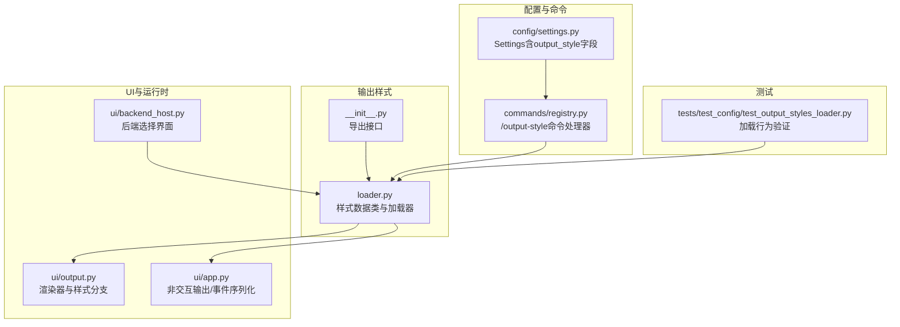
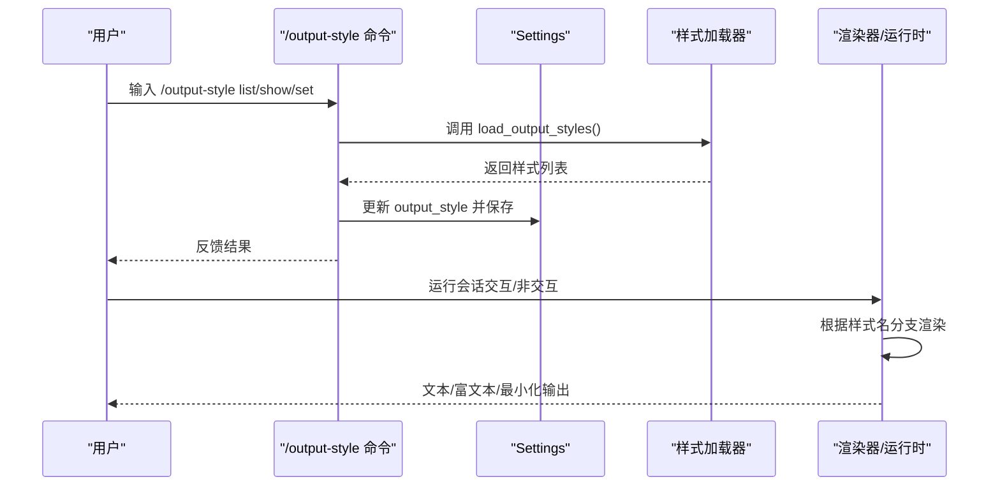
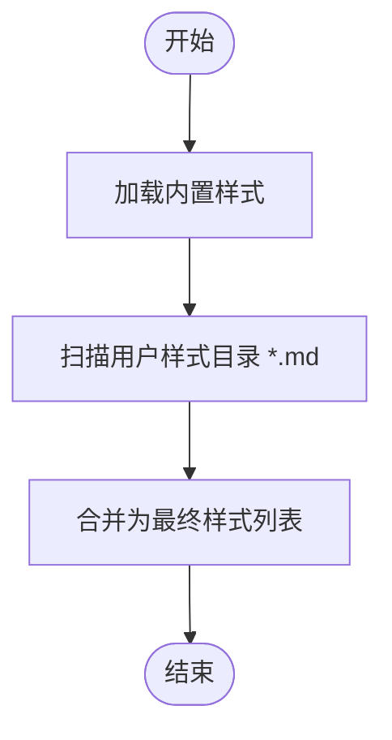
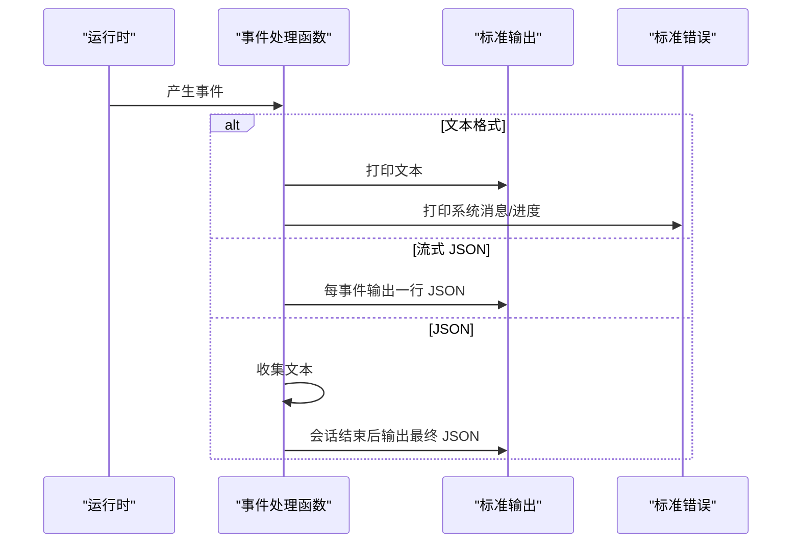
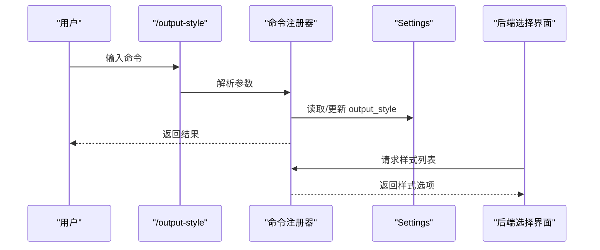
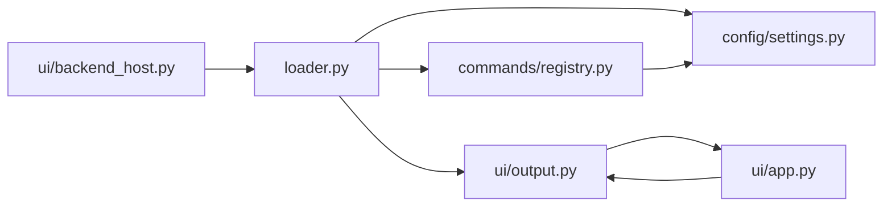

# 输出样式

<cite>
**本文引用的文件**
- [src/openharness/output_styles/__init__.py](file://src/openharness/output_styles/__init__.py)
- [src/openharness/output_styles/loader.py](file://src/openharness/output_styles/loader.py)
- [tests/test_config/test_output_styles_loader.py](file://tests/test_config/test_output_styles_loader.py)
- [src/openharness/ui/output.py](file://src/openharness/ui/output.py)
- [src/openharness/ui/app.py](file://src/openharness/ui/app.py)
- [src/openharness/commands/registry.py](file://src/openharness/commands/registry.py)
- [src/openharness/config/settings.py](file://src/openharness/config/settings.py)
- [src/openharness/ui/backend_host.py](file://src/openharness/ui/backend_host.py)
</cite>

## 目录
1. [简介](#简介)
2. [项目结构](#项目结构)
3. [核心组件](#核心组件)
4. [架构总览](#架构总览)
5. [详细组件分析](#详细组件分析)
6. [依赖分析](#依赖分析)
7. [性能考虑](#性能考虑)
8. [故障排除指南](#故障排除指南)
9. [结论](#结论)
10. [附录](#附录)

## 简介
本文件系统性阐述 OpenHarness 的“输出样式”体系：从架构设计、样式加载器与配置机制，到可用样式类型、选择与使用方式，再到与不同运行模式（交互式、非交互式、管道）的适配、性能优化与调试排障。目标是帮助开发者与使用者在不同场景下高效地选择与定制输出样式。

## 项目结构
输出样式相关能力主要分布在以下模块：
- 样式定义与加载：output_styles/loader.py
- 导出入口：output_styles/__init__.py
- UI 渲染器：ui/output.py
- 命令行与设置：commands/registry.py、config/settings.py
- 非交互输出与事件序列化：ui/app.py
- 后端选择界面：ui/backend_host.py
- 单元测试：tests/test_config/test_output_styles_loader.py

**图表来源**
- [src/openharness/output_styles/__init__.py:1-6](file://src/openharness/output_styles/__init__.py#L1-L6)
- [src/openharness/output_styles/loader.py:1-43](file://src/openharness/output_styles/loader.py#L1-L43)
- [src/openharness/ui/output.py:1-266](file://src/openharness/ui/output.py#L1-L266)
- [src/openharness/ui/app.py:200-314](file://src/openharness/ui/app.py#L200-L314)
- [src/openharness/ui/backend_host.py:528-545](file://src/openharness/ui/backend_host.py#L528-L545)
- [src/openharness/commands/registry.py:1555-1586](file://src/openharness/commands/registry.py#L1555-L1586)
- [src/openharness/config/settings.py:528-532](file://src/openharness/config/settings.py#L528-L532)
- [tests/test_config/test_output_styles_loader.py:1-26](file://tests/test_config/test_output_styles_loader.py#L1-L26)

**章节来源**
- [src/openharness/output_styles/__init__.py:1-6](file://src/openharness/output_styles/__init__.py#L1-L6)
- [src/openharness/output_styles/loader.py:1-43](file://src/openharness/output_styles/loader.py#L1-L43)
- [src/openharness/ui/output.py:1-266](file://src/openharness/ui/output.py#L1-L266)
- [src/openharness/ui/app.py:200-314](file://src/openharness/ui/app.py#L200-L314)
- [src/openharness/ui/backend_host.py:528-545](file://src/openharness/ui/backend_host.py#L528-L545)
- [src/openharness/commands/registry.py:1555-1586](file://src/openharness/commands/registry.py#L1555-L1586)
- [src/openharness/config/settings.py:528-532](file://src/openharness/config/settings.py#L528-L532)
- [tests/test_config/test_output_styles_loader.py:1-26](file://tests/test_config/test_output_styles_loader.py#L1-L26)

## 核心组件
- 样式数据类：用于描述一个命名样式及其来源与内容。
- 样式加载器：内置默认样式，并从用户配置目录加载自定义 Markdown 样式。
- 渲染器：根据当前样式名称对事件进行差异化渲染（如最小化样式不显示动画）。
- 命令处理器：提供列出、查看、设置输出样式的交互式命令。
- 设置模型：在全局设置中持久化当前输出样式。
- 非交互输出：支持文本、JSON、流式 JSON 三种输出格式；事件序列化为 JSON 便于管道消费。
- 后端选择界面：在图形界面中展示可选输出样式列表。

**章节来源**
- [src/openharness/output_styles/loader.py:11-42](file://src/openharness/output_styles/loader.py#L11-L42)
- [src/openharness/ui/output.py:20-183](file://src/openharness/ui/output.py#L20-L183)
- [src/openharness/commands/registry.py:1555-1586](file://src/openharness/commands/registry.py#L1555-L1586)
- [src/openharness/config/settings.py:528-532](file://src/openharness/config/settings.py#L528-L532)
- [src/openharness/ui/app.py:200-314](file://src/openharness/ui/app.py#L200-L314)
- [src/openharness/ui/backend_host.py:528-545](file://src/openharness/ui/backend_host.py#L528-L545)

## 架构总览
输出样式体系围绕“样式加载器 + 渲染器/运行时输出 + 命令与设置”的闭环工作：
- 加载阶段：内置样式 + 用户自定义样式（Markdown 文件）合并为可用样式集。
- 使用阶段：渲染器按样式名分支渲染；非交互运行时按输出格式（文本/JSON/流式 JSON）输出事件。
- 配置阶段：通过命令设置当前样式并写入设置模型；后端界面亦可选择样式。

**图表来源**
- [src/openharness/commands/registry.py:1555-1586](file://src/openharness/commands/registry.py#L1555-L1586)
- [src/openharness/output_styles/loader.py:27-42](file://src/openharness/output_styles/loader.py#L27-L42)
- [src/openharness/config/settings.py:528-532](file://src/openharness/config/settings.py#L528-L532)
- [src/openharness/ui/output.py:20-183](file://src/openharness/ui/output.py#L20-L183)

## 详细组件分析

### 样式加载器与样式配置机制
- 样式数据类：包含名称、内容、来源三要素，来源区分内置与用户自定义。
- 加载策略：先内置默认样式，再扫描用户配置目录下的 Markdown 文件作为自定义样式。
- 自定义样式位置：位于配置目录下的 output_styles 子目录，文件名为样式名（不含扩展名），内容为 Markdown 描述。

**图表来源**
- [src/openharness/output_styles/loader.py:27-42](file://src/openharness/output_styles/loader.py#L27-L42)

**章节来源**
- [src/openharness/output_styles/loader.py:11-42](file://src/openharness/output_styles/loader.py#L11-L42)
- [tests/test_config/test_output_styles_loader.py:6-26](file://tests/test_config/test_output_styles_loader.py#L6-L26)

### 输出样式类型与渲染差异
- 默认样式：富文本终端输出，支持 Markdown、语法高亮、面板、工具执行状态等。
- 最小化样式：极简纯文本输出，关闭动画与装饰，适合低带宽或自动化环境。
- Codex 样式：内置样式之一，面向紧凑型对话与工具输出。
- 自定义样式：用户可在 Markdown 中编写样式说明，作为样式描述展示。

渲染器根据样式名进行分支：
- 最小化样式不显示“思考”指示器与工具运行动画。
- 工具输出按工具类型采用不同呈现策略（如 Bash 面板、文件读取语法高亮、编辑 Diff 风格等）。

**章节来源**
- [src/openharness/ui/output.py:20-218](file://src/openharness/ui/output.py#L20-L218)

### 非交互与管道适配（文本/JSON/流式 JSON）
- 文本格式：直接打印到标准输出/错误流，适合人类阅读与交互式会话。
- JSON 格式：在非交互模式下汇总最终结果为 JSON 对象。
- 流式 JSON 格式：逐事件输出 JSON 对象，便于管道实时消费与前端渲染。

**图表来源**
- [src/openharness/ui/app.py:223-314](file://src/openharness/ui/app.py#L223-L314)

**章节来源**
- [src/openharness/ui/app.py:223-314](file://src/openharness/ui/app.py#L223-L314)

### 命令与设置：选择与持久化
- 命令：/output-style 支持 show、list、set 等子命令，动态更新当前样式。
- 设置：Settings 中的 output_style 字段持久化当前样式名称。
- 后端界面：在选择界面中展示所有可用样式（名称、来源、是否当前）。

**图表来源**
- [src/openharness/commands/registry.py:1555-1586](file://src/openharness/commands/registry.py#L1555-L1586)
- [src/openharness/config/settings.py:528-532](file://src/openharness/config/settings.py#L528-L532)
- [src/openharness/ui/backend_host.py:528-545](file://src/openharness/ui/backend_host.py#L528-L545)

**章节来源**
- [src/openharness/commands/registry.py:1555-1586](file://src/openharness/commands/registry.py#L1555-L1586)
- [src/openharness/config/settings.py:528-532](file://src/openharness/config/settings.py#L528-L532)
- [src/openharness/ui/backend_host.py:528-545](file://src/openharness/ui/backend_host.py#L528-L545)

### 自定义与扩展方法
- 新增自定义样式：在配置目录的 output_styles 子目录下新增一个以样式名为文件名的 Markdown 文件，即可被加载器发现并加入样式列表。
- 样式描述：Markdown 文件内容作为样式描述展示，可用于说明该样式适用场景与特点。
- 扩展渲染：若需改变渲染行为，可在渲染器中按样式名添加新的分支逻辑（当前实现已针对最小化样式做了显著简化）。

**章节来源**
- [src/openharness/output_styles/loader.py:20-42](file://src/openharness/output_styles/loader.py#L20-L42)
- [src/openharness/ui/output.py:20-183](file://src/openharness/ui/output.py#L20-L183)

## 依赖分析
- 样式加载器依赖配置路径解析，确保自定义样式目录存在且可读。
- 渲染器依赖样式名进行分支渲染，同时依赖事件类型（如工具执行、进度、状态等）进行差异化输出。
- 命令处理器依赖样式加载器与设置模型，完成样式查询与持久化。
- 非交互运行时依赖输出格式参数，决定事件序列化策略。

**图表来源**
- [src/openharness/output_styles/loader.py:8-8](file://src/openharness/output_styles/loader.py#L8-L8)
- [src/openharness/config/settings.py:528-532](file://src/openharness/config/settings.py#L528-L532)
- [src/openharness/ui/output.py:20-183](file://src/openharness/ui/output.py#L20-L183)
- [src/openharness/commands/registry.py:1555-1586](file://src/openharness/commands/registry.py#L1555-L1586)
- [src/openharness/ui/app.py:223-314](file://src/openharness/ui/app.py#L223-L314)
- [src/openharness/ui/backend_host.py:528-545](file://src/openharness/ui/backend_host.py#L528-L545)

**章节来源**
- [src/openharness/output_styles/loader.py:1-43](file://src/openharness/output_styles/loader.py#L1-L43)
- [src/openharness/ui/output.py:1-266](file://src/openharness/ui/output.py#L1-L266)
- [src/openharness/commands/registry.py:1555-1586](file://src/openharness/commands/registry.py#L1555-L1586)
- [src/openharness/config/settings.py:528-532](file://src/openharness/config/settings.py#L528-L532)
- [src/openharness/ui/app.py:200-314](file://src/openharness/ui/app.py#L200-L314)
- [src/openharness/ui/backend_host.py:528-545](file://src/openharness/ui/backend_host.py#L528-L545)

## 性能考虑
- 最小化样式：减少渲染开销，适合高吞吐或低带宽环境。
- 流式 JSON：事件边产生边输出，降低延迟，利于前端实时渲染与管道处理。
- 工具输出差异化：对大文本采用截断与面板展示，避免过长输出造成卡顿。
- Markdown 渲染：仅在检测到潜在 Markdown 标记时才进行重渲染，减少不必要的计算。

[本节为通用建议，无需特定文件引用]

## 故障排除指南
- 样式未生效
  - 检查是否通过命令设置成功并已保存至设置模型。
  - 确认样式名称拼写正确，且存在于样式列表中。
- 自定义样式未加载
  - 确认自定义样式文件位于配置目录的 output_styles 子目录下，文件名为样式名且为 .md 扩展。
  - 确认文件编码为 UTF-8，内容可被正确读取。
- 非交互输出异常
  - 文本格式：检查标准输出/错误流是否被重定向或阻塞。
  - JSON/流式 JSON：确认事件序列化逻辑未被外部包装器破坏；必要时在本地复现以定位问题。
- 渲染异常
  - 最小化样式下缺少动画属于预期行为；若需要富文本，请切换到默认或自定义样式。
  - 工具输出未按预期展示：检查工具类型与输入参数，确认渲染器分支逻辑覆盖该工具。

**章节来源**
- [src/openharness/commands/registry.py:1555-1586](file://src/openharness/commands/registry.py#L1555-L1586)
- [src/openharness/output_styles/loader.py:20-42](file://src/openharness/output_styles/loader.py#L20-L42)
- [src/openharness/ui/app.py:223-314](file://src/openharness/ui/app.py#L223-L314)
- [src/openharness/ui/output.py:184-218](file://src/openharness/ui/output.py#L184-L218)

## 结论
OpenHarness 的输出样式体系以简洁的数据模型与可扩展的加载机制为核心，结合渲染器与运行时输出策略，实现了从交互式富文本到非交互 JSON/流式 JSON 的全场景覆盖。通过命令与设置的联动，用户可以灵活地在内置与自定义样式之间切换；通过最小化样式与流式输出，系统兼顾了性能与可集成性。

[本节为总结，无需特定文件引用]

## 附录

### 输出样式类型与适用场景
- 默认样式
  - 特点：富文本、Markdown、语法高亮、面板、工具执行状态等。
  - 适用：交互式会话、需要丰富视觉反馈的场景。
- 最小化样式
  - 特点：极简文本、无动画、无装饰。
  - 适用：低带宽、自动化脚本、CI/CD 管道。
- Codex 样式
  - 特点：紧凑型对话与工具输出。
  - 适用：追求简洁与信息密度的场景。
- 自定义样式
  - 特点：用户自定义描述，便于团队约定与推广。
  - 适用：组织内统一输出风格、知识沉淀。

**章节来源**
- [src/openharness/output_styles/loader.py:29-33](file://src/openharness/output_styles/loader.py#L29-L33)
- [src/openharness/ui/output.py:34-149](file://src/openharness/ui/output.py#L34-L149)

### 与使用模式的适配
- 交互式模式：默认样式提供最佳体验；最小化样式可满足后台静默运行需求。
- 非交互模式：文本格式适合直接阅读，JSON 格式适合后续处理，流式 JSON 适合实时可视化与管道。
- 管道模式：优先使用流式 JSON，以便上游消费者按事件类型进行处理与展示。

**章节来源**
- [src/openharness/ui/app.py:223-314](file://src/openharness/ui/app.py#L223-L314)
- [src/openharness/ui/output.py:34-149](file://src/openharness/ui/output.py#L34-L149)