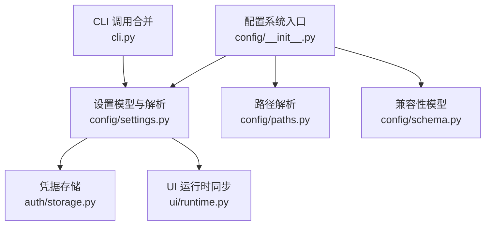
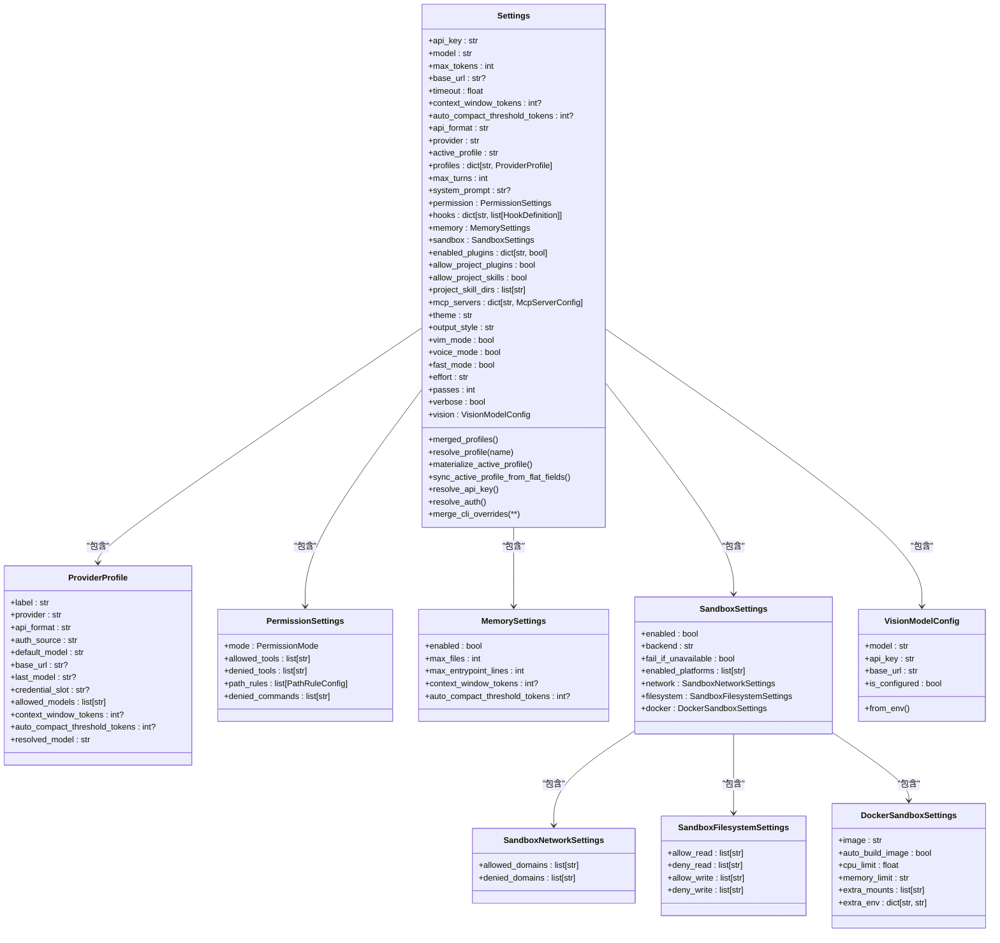
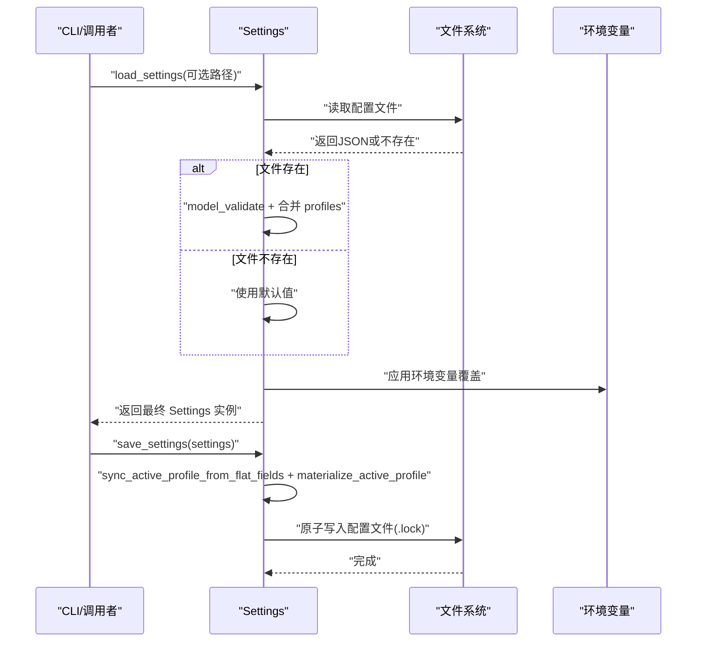
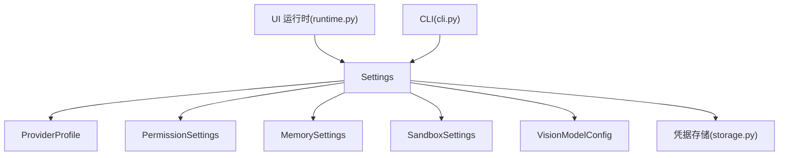

# 设置管理

<cite>
**本文引用的文件**
- [settings.py](file://src/openharness/config/settings.py)
- [paths.py](file://src/openharness/config/paths.py)
- [__init__.py](file://src/openharness/config/__init__.py)
- [schema.py](file://src/openharness/config/schema.py)
- [test_settings.py](file://tests/test_config/test_settings.py)
- [test_paths.py](file://tests/test_config/test_paths.py)
- [storage.py](file://src/openharness/auth/storage.py)
- [runtime.py](file://src/openharness/ui/runtime.py)
- [cli.py](file://src/openharness/cli.py)
- [RELEASE_NOTES_v0.1.8.md](file://RELEASE_NOTES_v0.1.8.md)
- [RELEASE_NOTES_v0.1.9.md](file://RELEASE_NOTES_v0.1.9.md)
</cite>

## 目录
1. [简介](#简介)
2. [项目结构](#项目结构)
3. [核心组件](#核心组件)
4. [架构总览](#架构总览)
5. [详细组件分析](#详细组件分析)
6. [依赖分析](#依赖分析)
7. [性能考虑](#性能考虑)
8. [故障排查指南](#故障排查指南)
9. [结论](#结论)
10. [附录](#附录)

## 简介
本文件为 OpenHarness 设置管理系统的技术与使用文档，聚焦 Settings 主模型及其子配置模块，覆盖以下方面：
- 配置来源与优先级：CLI 参数 > 环境变量 > 配置文件(~/.openharness/settings.json) > 默认值
- Settings 主模型字段详解：API 配置、行为设置、UI 配置、沙箱配置、记忆与权限、插件与技能、MCP 服务器等
- 字段数据类型、默认值、取值范围与典型使用场景
- 字段间的依赖关系与约束条件
- 动态修改与运行时更新机制
- 配置迁移与版本兼容策略
- 常见配置场景示例与模板

## 项目结构
设置系统位于 src/openharness/config 目录，核心文件包括：
- settings.py：Settings 主模型、配置解析与加载保存逻辑
- paths.py：配置目录与文件路径解析
- schema.py：兼容性通道配置模型（与主题/频道相关）
- __init__.py：导出配置相关 API

图表来源
- [__init__.py:12-20](file://src/openharness/config/__init__.py#L12-L20)
- [settings.py:496-538](file://src/openharness/config/settings.py#L496-L538)
- [paths.py:15-68](file://src/openharness/config/paths.py#L15-L68)
- [schema.py:12-117](file://src/openharness/config/schema.py#L12-L117)
- [storage.py:54-76](file://src/openharness/auth/storage.py#L54-L76)
- [runtime.py:491-511](file://src/openharness/ui/runtime.py#L491-L511)
- [cli.py:420-428](file://src/openharness/cli.py#L420-L428)

章节来源
- [__init__.py:6-34](file://src/openharness/config/__init__.py#L6-L34)
- [paths.py:15-68](file://src/openharness/config/paths.py#L15-L68)

## 核心组件
- Settings 主模型：集中承载所有配置项，支持 profile 层级与扁平字段的互操作
- ProviderProfile：命名化的提供方工作流配置，含认证来源、默认/最后使用的模型、上下文窗口等
- PermissionSettings：权限模式与工具/路径/命令白黑名单
- MemorySettings：记忆系统开关与容量、上下文窗口阈值
- SandboxSettings：沙箱集成开关、后端、平台限制、网络/文件系统规则、Docker 特定参数
- VisionModelConfig：图像转文本回退模型配置
- 路径解析：配置目录、数据目录、日志目录、会话/任务/反馈等子目录
- 凭据存储：文件与系统钥匙串后备的凭据持久化

章节来源
- [settings.py:496-538](file://src/openharness/config/settings.py#L496-L538)
- [settings.py:109-132](file://src/openharness/config/settings.py#L109-L132)
- [settings.py:50-58](file://src/openharness/config/settings.py#L50-L58)
- [settings.py:60-68](file://src/openharness/config/settings.py#L60-L68)
- [settings.py:97-107](file://src/openharness/config/settings.py#L97-L107)
- [settings.py:470-494](file://src/openharness/config/settings.py#L470-L494)
- [paths.py:15-68](file://src/openharness/config/paths.py#L15-L68)
- [storage.py:54-76](file://src/openharness/auth/storage.py#L54-L76)

## 架构总览
设置系统遵循“扁平字段 + Profile 层”的设计，通过 materialize/sync 方法在两者间投影与同步，确保旧版调用链与新版配置层并存。

图表来源
- [settings.py:496-538](file://src/openharness/config/settings.py#L496-L538)
- [settings.py:109-132](file://src/openharness/config/settings.py#L109-L132)
- [settings.py:50-58](file://src/openharness/config/settings.py#L50-L58)
- [settings.py:60-68](file://src/openharness/config/settings.py#L60-L68)
- [settings.py:97-107](file://src/openharness/config/settings.py#L97-L107)
- [settings.py:70-84](file://src/openharness/config/settings.py#L70-L84)
- [settings.py:86-95](file://src/openharness/config/settings.py#L86-L95)
- [settings.py:470-494](file://src/openharness/config/settings.py#L470-L494)

## 详细组件分析

### Settings 主模型字段参考
- API 配置
  - api_key: 字符串；默认空；用于兼容型提供方；订阅型提供方通过 resolve_auth 解析
  - model: 字符串；默认 Claude Sonnet；可通过别名或规范化映射解析为具体模型
  - max_tokens: 整数；默认 16384；单次请求最大输出长度
  - base_url: 字符串或空；默认空；自定义网关/代理基础地址
  - timeout: 浮点；默认 30.0 秒；请求超时
  - context_window_tokens: 整数或空；上下文窗口令牌上限
  - auto_compact_threshold_tokens: 整数或空；自动压缩阈值
  - api_format: 字符串；"anthropic"|"openai"|"copilot"；API 协议格式
  - provider: 字符串；提供方标识
  - active_profile: 字符串；当前激活的 ProviderProfile 名称
  - profiles: 字典；已保存的 ProviderProfile 列表
  - max_turns: 整数；最大对话轮次（None 表示不限制）

- 行为设置
  - system_prompt: 字符串或空；系统提示词
  - permission: PermissionSettings；权限模式与白黑名单
  - hooks: 字典；钩子定义列表
  - memory: MemorySettings；记忆系统配置
  - sandbox: SandboxSettings；沙箱集成配置
  - enabled_plugins: 字典；插件启用状态
  - allow_project_plugins: 布尔；是否允许项目内插件
  - allow_project_skills: 布尔；是否允许项目内技能
  - project_skill_dirs: 列表；项目技能目录搜索路径
  - mcp_servers: 字典；MCP 服务器配置

- UI 配置
  - theme: 字符串；主题名称
  - output_style: 字符串；输出样式
  - vim_mode: 布尔；Vim 键位模式
  - voice_mode: 布尔；语音模式
  - fast_mode: 布尔；快速模式
  - effort: 字符串；努力程度（如 "low"|"medium"|"high"）
  - passes: 整数；执行轮次
  - verbose: 布尔；详细输出

- 视觉模型（图像转文本回退）
  - vision: VisionModelConfig；当主模型不支持多模态时的视觉模型

字段来源与默认值依据
- [settings.py:496-538](file://src/openharness/config/settings.py#L496-L538)

章节来源
- [settings.py:496-538](file://src/openharness/config/settings.py#L496-L538)

### 权限与路径规则
- PermissionSettings
  - mode: 权限模式枚举
  - allowed_tools/denied_tools: 工具白/黑名单
  - path_rules: PathRuleConfig 列表；glob 模式路径规则
  - denied_commands: 命令黑名单

- PathRuleConfig
  - pattern: glob 模式字符串
  - allow: 布尔；允许或拒绝

章节来源
- [settings.py:50-58](file://src/openharness/config/settings.py#L50-L58)
- [settings.py:43-48](file://src/openharness/config/settings.py#L43-L48)

### 记忆系统
- MemorySettings
  - enabled: 是否启用
  - max_files: 最大文件数
  - max_entrypoint_lines: 入口文件最大行数
  - context_window_tokens: 上下文窗口令牌上限
  - auto_compact_threshold_tokens: 自动压缩阈值

章节来源
- [settings.py:60-68](file://src/openharness/config/settings.py#L60-L68)

### 沙箱配置
- SandboxSettings
  - enabled: 是否启用
  - backend: 后端名称
  - fail_if_unavailable: 不可用时是否失败
  - enabled_platforms: 平台列表
  - network: SandboxNetworkSettings
  - filesystem: SandboxFilesystemSettings
  - docker: DockerSandboxSettings

- SandboxNetworkSettings
  - allowed_domains/denied_domains: 域名白/黑名单

- SandboxFilesystemSettings
  - allow_read/deny_read/allow_write/deny_write: 文件系统读写规则，默认允许当前目录写入

- DockerSandboxSettings
  - image/auto_build_image/cpu_limit/memory_limit/extra_mounts/extra_env

章节来源
- [settings.py:97-107](file://src/openharness/config/settings.py#L97-L107)
- [settings.py:70-84](file://src/openharness/config/settings.py#L70-L84)
- [settings.py:86-95](file://src/openharness/config/settings.py#L86-L95)

### 提供方与认证解析
- ProviderProfile
  - label/provider/api_format/auth_source/default_model/base_url/last_model/credential_slot/allowed_models/context_window_tokens/auto_compact_threshold_tokens/resolved_model

- 认证解析流程
  - resolve_api_key：实例值 > 环境变量 > 文件存储；对订阅型提供方抛错并建议使用 resolve_auth
  - resolve_auth：外部绑定（订阅型）> 环境变量 > 文件存储；支持按提供方/认证源选择存储空间

- 模型解析
  - 支持别名（如 "default"|"best"| "opusplan" 等）与规范化（去除前缀、点号转连字符等）

章节来源
- [settings.py:109-132](file://src/openharness/config/settings.py#L109-L132)
- [settings.py:644-791](file://src/openharness/config/settings.py#L644-L791)
- [settings.py:300-339](file://src/openharness/config/settings.py#L300-L339)
- [settings.py:165-179](file://src/openharness/config/settings.py#L165-L179)

### 加载与保存流程
- 加载顺序：文件存在则校验并合并，缺失则使用默认值；随后应用环境变量覆盖
- 保存：先同步 profile 到扁平字段并物化，再以原子写入方式保存到配置文件

图表来源
- [settings.py:914-944](file://src/openharness/config/settings.py#L914-L944)
- [settings.py:946-965](file://src/openharness/config/settings.py#L946-L965)
- [settings.py:820-906](file://src/openharness/config/settings.py#L820-L906)

章节来源
- [settings.py:914-965](file://src/openharness/config/settings.py#L914-L965)

### 运行时同步与动态更新
- UI 运行时通过刷新客户端接口根据 Settings 更新状态
- CLI 在 dry-run 或实际执行中通过 merge_cli_overrides 合并命令行参数

章节来源
- [runtime.py:514-521](file://src/openharness/ui/runtime.py#L514-L521)
- [cli.py:420-428](file://src/openharness/cli.py#L420-L428)
- [settings.py:792-818](file://src/openharness/config/settings.py#L792-L818)

## 依赖分析
- 组件耦合
  - Settings 依赖 ProviderProfile/PermissionSettings/MemorySettings/SandboxSettings/VisionModelConfig
  - 认证解析依赖凭据存储模块
  - UI 运行时依赖 Settings 的部分字段进行状态同步
  - CLI 在执行前对 Settings 进行覆盖合并

图表来源
- [settings.py:496-538](file://src/openharness/config/settings.py#L496-L538)
- [storage.py:54-76](file://src/openharness/auth/storage.py#L54-L76)
- [runtime.py:491-511](file://src/openharness/ui/runtime.py#L491-L511)
- [cli.py:420-428](file://src/openharness/cli.py#L420-L428)

章节来源
- [settings.py:496-538](file://src/openharness/config/settings.py#L496-L538)
- [storage.py:54-76](file://src/openharness/auth/storage.py#L54-L76)
- [runtime.py:491-511](file://src/openharness/ui/runtime.py#L491-L511)
- [cli.py:420-428](file://src/openharness/cli.py#L420-L428)

## 性能考虑
- 配置加载采用一次性解析与缓存策略，避免重复 IO
- 保存使用独占锁与原子写入，减少竞态与损坏风险
- 模型解析与 ANSI 清理在覆盖阶段执行，避免运行期重复开销
- 沙箱配置仅在启用时生效，降低默认运行成本

## 故障排查指南
- 缺少 API Key
  - resolve_api_key 在未找到时抛出错误；检查环境变量或配置文件
  - 订阅型提供方需使用 resolve_auth 获取外部绑定的凭证
- 认证来源冲突
  - 当 api_format 与 provider 不一致时，resolve_auth 会优先使用环境变量中的对应键
- 模型别名与 ANSI 序列
  - 别名会被解析为具体模型；ANSI 转义序列会在覆盖时被清理
- 沙箱配置错误
  - 环境变量覆盖仅在未显式配置时生效；布尔值解析大小写不敏感

章节来源
- [settings.py:644-791](file://src/openharness/config/settings.py#L644-L791)
- [settings.py:820-906](file://src/openharness/config/settings.py#L820-L906)
- [test_settings.py:36-124](file://tests/test_config/test_settings.py#L36-L124)

## 结论
OpenHarness 设置系统以 Settings 为核心，结合 ProviderProfile 层实现灵活的多提供方与多模型管理；通过文件、环境变量与 CLI 的分层覆盖，满足从开发到生产的多样化部署需求。其运行时同步与原子保存机制保障了配置的可靠性与一致性。

## 附录

### 配置项参考手册（字段定义/示例值/最佳实践）
- API 配置
  - api_key: 字符串；示例："sk-..."; 最佳实践：优先使用环境变量或凭据存储
  - model: 字符串；示例："claude-sonnet-4-6"；支持别名："default"|"best"|"opusplan"
  - max_tokens: 整数；示例：16384；建议根据模型上下文窗口调整
  - base_url: 字符串；示例："https://gateway.example.com/v1"
  - timeout: 浮点；示例：30.0；建议结合网络状况设置
  - context_window_tokens/auto_compact_threshold_tokens: 整数或空；用于大模型/多模态场景
  - api_format: "anthropic"|"openai"|"copilot"
  - provider: 提供方标识
  - active_profile/profiles: 使用内置或自定义提供方配置
  - max_turns: 整数；示例：200；设为 None 取消限制

- 行为设置
  - system_prompt: 字符串；建议明确角色与约束
  - permission: 按需配置白/黑名单与路径规则
  - memory: 启用并合理设置容量与阈值
  - sandbox: 按需启用，限定网络与文件系统访问
  - mcp_servers: 按需配置 MCP 服务器

- UI 配置
  - theme/output_style/vim_mode/voice_mode/fast_mode/effort/passes/verbose：按团队习惯配置

- 视觉模型
  - vision.model/api_key/base_url：当主模型不支持多模态时启用

章节来源
- [settings.py:496-538](file://src/openharness/config/settings.py#L496-L538)
- [settings.py:300-339](file://src/openharness/config/settings.py#L300-L339)

### 配置迁移与版本兼容
- v0.1.8 新增多提供方与兼容性改进，涉及环境变量与行为细节
- v0.1.9 修复提供方 API Key 更新问题，增强用户可操作性
- 配置迁移要点
  - 旧版扁平字段会自动迁移到 profiles 层并物化回扁平字段
  - 环境变量覆盖优先于文件配置
  - 认证来源与提供方映射保持向后兼容

章节来源
- [RELEASE_NOTES_v0.1.8.md:7-11](file://RELEASE_NOTES_v0.1.8.md#L7-L11)
- [RELEASE_NOTES_v0.1.9.md:15-18](file://RELEASE_NOTES_v0.1.9.md#L15-L18)
- [settings.py:914-944](file://src/openharness/config/settings.py#L914-L944)

### 常见配置场景与模板
- 开发调试
  - 关闭沙箱、启用详细输出、设置较小 max_tokens
- 生产网关
  - 通过 base_url 指向内部网关，设置合适的 timeout 与 max_turns
- 多提供方切换
  - 使用 profiles 定义不同提供方，通过 active_profile 快速切换
- 安全加固
  - 限制沙箱文件系统写入范围，配置网络域名白名单

章节来源
- [test_settings.py:169-191](file://tests/test_config/test_settings.py#L169-L191)
- [test_settings.py:469-491](file://tests/test_config/test_settings.py#L469-L491)
- [settings.py:97-107](file://src/openharness/config/settings.py#L97-L107)