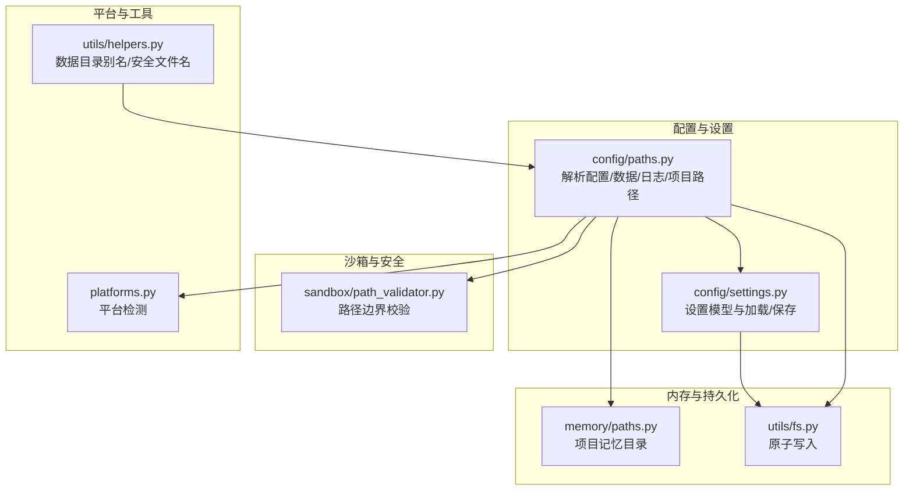
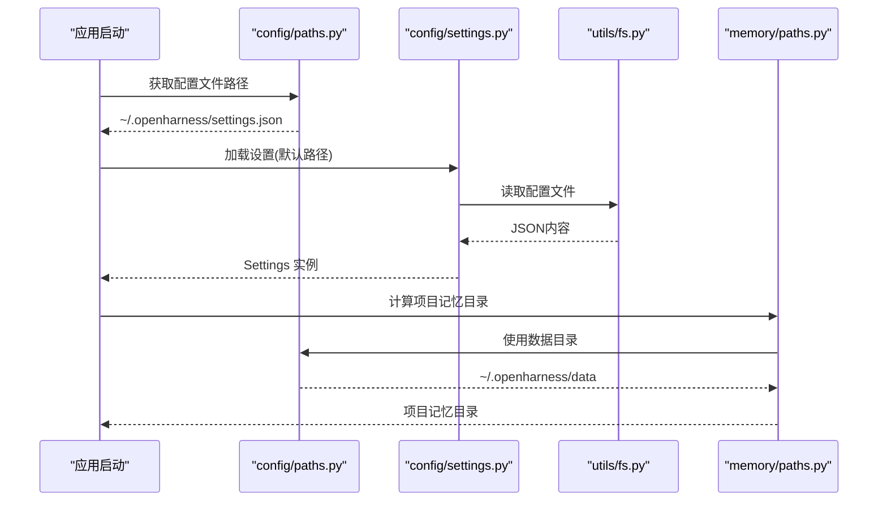
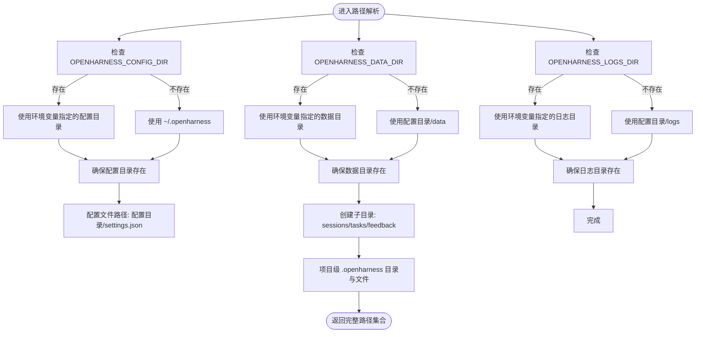
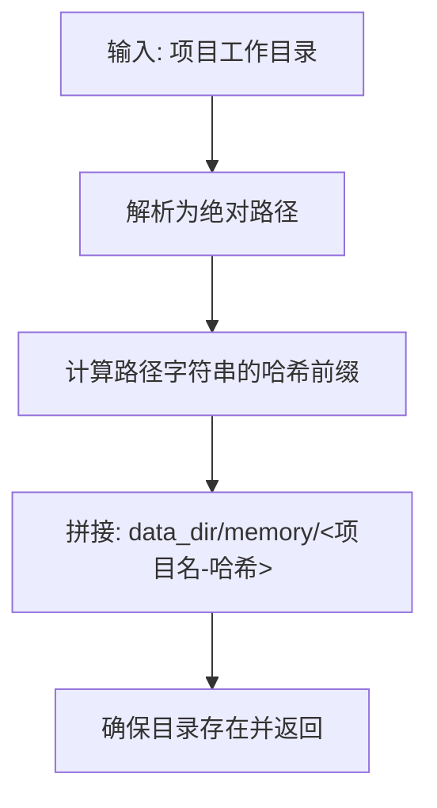
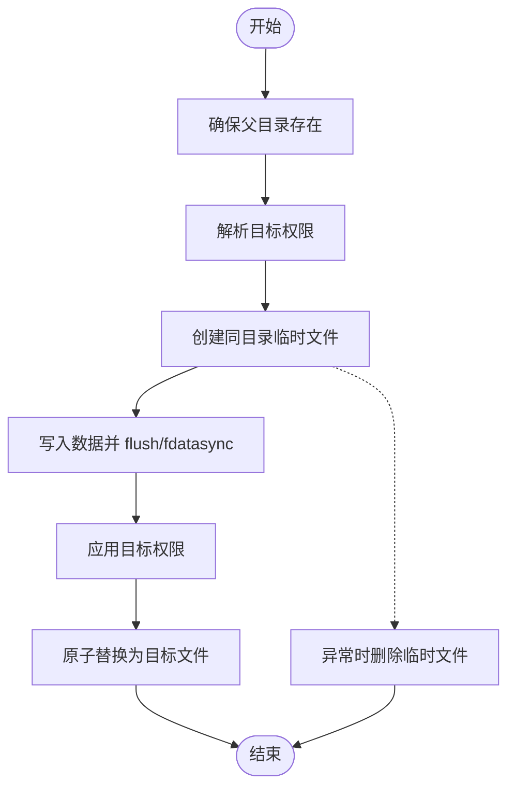
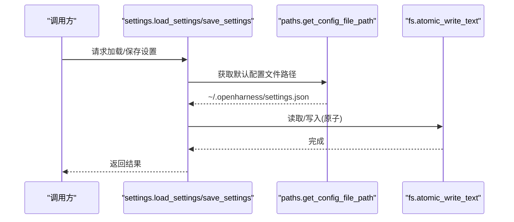
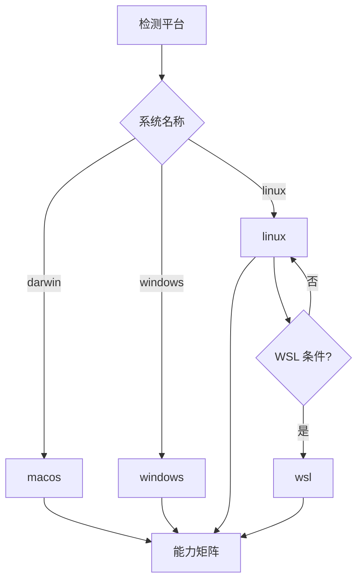
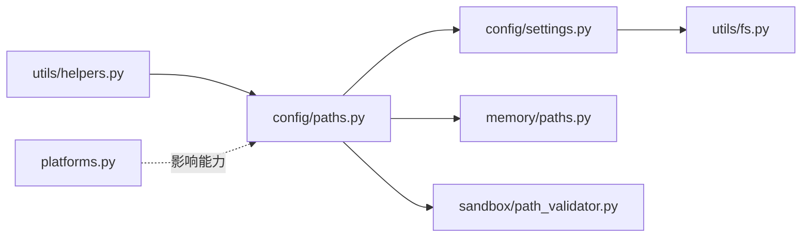

# 路径解析

<cite>
**本文引用的文件**
- [src/openharness/config/paths.py](file://src/openharness/config/paths.py)
- [src/openharness/memory/paths.py](file://src/openharness/memory/paths.py)
- [src/openharness/utils/fs.py](file://src/openharness/utils/fs.py)
- [src/openharness/sandbox/path_validator.py](file://src/openharness/sandbox/path_validator.py)
- [src/openharness/config/settings.py](file://src/openharness/config/settings.py)
- [src/openharness/platforms.py](file://src/openharness/platforms.py)
- [src/openharness/utils/helpers.py](file://src/openharness/utils/helpers.py)
- [tests/test_config/test_paths.py](file://tests/test_config/test_paths.py)
- [tests/test_sandbox/test_path_validator.py](file://tests/test_sandbox/test_path_validator.py)
</cite>

## 目录
1. [简介](#简介)
2. [项目结构](#项目结构)
3. [核心组件](#核心组件)
4. [架构总览](#架构总览)
5. [详细组件分析](#详细组件分析)
6. [依赖分析](#依赖分析)
7. [性能考量](#性能考量)
8. [故障排除指南](#故障排除指南)
9. [结论](#结论)
10. [附录](#附录)

## 简介
本文件系统化阐述 OpenHarness 的路径解析体系，覆盖以下主题：
- 配置文件路径解析：默认用户配置目录（~/.openharness）的定位与创建机制
- 各类路径解析规则：配置文件、数据/缓存、日志、会话、任务、反馈、项目级 .openharness 等
- 跨平台路径处理：Windows、Linux、macOS 的路径规范与行为差异
- 相对路径与绝对路径转换：路径规范化、解析与边界校验
- 错误处理与异常：环境变量缺失、权限不足、路径越界等场景
- 最佳实践：相对路径使用建议、路径权限与安全性
- 与文件系统的关系：存在性检查、权限验证、原子写入
- 调试与排障：常见问题定位与修复步骤

## 项目结构
围绕路径解析的关键模块与职责如下：
- 配置路径解析：负责用户配置目录、数据目录、日志目录、以及项目级 .openharness 目录与文件的解析与创建
- 内存路径：基于项目路径生成稳定的持久化记忆目录
- 文件系统工具：提供原子写入能力，确保崩溃或断电时文件不被截断
- 沙箱路径校验：限制文件操作在项目根与允许的额外路径范围内
- 设置加载：从默认配置文件路径读取设置，支持环境变量与 CLI 覆盖
- 平台检测：辅助判断平台差异以影响路径与运行时行为
- 辅助工具：向后兼容的数据目录别名与安全文件名生成

图表来源
- [src/openharness/config/paths.py:1-161](file://src/openharness/config/paths.py#L1-L161)
- [src/openharness/config/settings.py:914-964](file://src/openharness/config/settings.py#L914-L964)
- [src/openharness/memory/paths.py:1-23](file://src/openharness/memory/paths.py#L1-L23)
- [src/openharness/utils/fs.py:1-99](file://src/openharness/utils/fs.py#L1-L99)
- [src/openharness/sandbox/path_validator.py:1-38](file://src/openharness/sandbox/path_validator.py#L1-L38)
- [src/openharness/platforms.py:1-88](file://src/openharness/platforms.py#L1-L88)
- [src/openharness/utils/helpers.py:1-78](file://src/openharness/utils/helpers.py#L1-L78)

章节来源
- [src/openharness/config/paths.py:1-161](file://src/openharness/config/paths.py#L1-L161)
- [src/openharness/config/settings.py:914-964](file://src/openharness/config/settings.py#L914-L964)
- [src/openharness/memory/paths.py:1-23](file://src/openharness/memory/paths.py#L1-L23)
- [src/openharness/utils/fs.py:1-99](file://src/openharness/utils/fs.py#L1-L99)
- [src/openharness/sandbox/path_validator.py:1-38](file://src/openharness/sandbox/path_validator.py#L1-L38)
- [src/openharness/platforms.py:1-88](file://src/openharness/platforms.py#L1-L88)
- [src/openharness/utils/helpers.py:1-78](file://src/openharness/utils/helpers.py#L1-L78)

## 核心组件
- 配置路径解析器：提供配置目录、配置文件、数据目录、日志目录、会话/任务/反馈目录及项目级 .openharness 及其子项的解析与创建
- 内存路径解析器：为每个项目生成稳定且唯一的持久化记忆目录
- 原子写入工具：保证配置、会话快照、计划任务注册表等在崩溃或断电时不会产生截断文件
- 沙箱路径校验：防止文件操作越出项目根目录与允许的额外路径
- 设置加载器：从默认配置文件路径加载设置，合并环境变量与 CLI 覆盖
- 平台检测：识别 macOS、Linux、Windows、WSL 等平台，影响能力矩阵
- 辅助工具：提供数据目录别名与安全文件名生成

章节来源
- [src/openharness/config/paths.py:15-161](file://src/openharness/config/paths.py#L15-L161)
- [src/openharness/memory/paths.py:11-23](file://src/openharness/memory/paths.py#L11-L23)
- [src/openharness/utils/fs.py:39-99](file://src/openharness/utils/fs.py#L39-L99)
- [src/openharness/sandbox/path_validator.py:8-38](file://src/openharness/sandbox/path_validator.py#L8-L38)
- [src/openharness/config/settings.py:914-964](file://src/openharness/config/settings.py#L914-L964)
- [src/openharness/platforms.py:27-88](file://src/openharness/platforms.py#L27-L88)
- [src/openharness/utils/helpers.py:19-78](file://src/openharness/utils/helpers.py#L19-L78)

## 架构总览
下图展示路径解析在系统中的位置与交互：

图表来源
- [src/openharness/config/paths.py:32-34](file://src/openharness/config/paths.py#L32-L34)
- [src/openharness/config/settings.py:914-944](file://src/openharness/config/settings.py#L914-L944)
- [src/openharness/utils/fs.py:39-78](file://src/openharness/utils/fs.py#L39-L78)
- [src/openharness/memory/paths.py:11-17](file://src/openharness/memory/paths.py#L11-L17)

## 详细组件分析

### 配置路径解析器（config/paths.py）
- 默认基目录：遵循 XDG 类约定，使用用户主目录下的 .openharness 子目录
- 解析顺序：
  - 用户配置目录：优先使用环境变量 OPENHARNESS_CONFIG_DIR；否则回退到 ~/.openharness
  - 数据目录：优先使用 OPENHARNESS_DATA_DIR；否则位于 ~/.openharness/data
  - 日志目录：优先使用 OPENHARNESS_LOGS_DIR；否则位于 ~/.openharness/logs
- 自动创建：所有返回的目录均会在不存在时自动创建（parents=True, exist_ok=True）
- 项目级路径：
  - 每个项目拥有独立的 .openharness 目录，位于项目根目录
  - 提供 issue 上下文、PR 注释上下文、Autopilot 状态与工件目录、策略文件等路径

图表来源
- [src/openharness/config/paths.py:15-161](file://src/openharness/config/paths.py#L15-L161)

章节来源
- [src/openharness/config/paths.py:15-161](file://src/openharness/config/paths.py#L15-L161)
- [tests/test_config/test_paths.py:15-70](file://tests/test_config/test_paths.py#L15-L70)

### 内存路径解析器（memory/paths.py）
- 基于项目工作目录的稳定哈希生成唯一记忆目录，避免不同项目间冲突
- 默认入口文件 MEMORY.md 用于项目记忆的统一入口
- 所有目录在不存在时自动创建

图表来源
- [src/openharness/memory/paths.py:11-23](file://src/openharness/memory/paths.py#L11-L23)

章节来源
- [src/openharness/memory/paths.py:11-23](file://src/openharness/memory/paths.py#L11-L23)

### 文件系统原子写入（utils/fs.py）
- 设计目标：在崩溃、SIGKILL、断电或磁盘空间不足时，避免产生截断文件
- 核心流程：
  1) 在目标文件同目录创建临时文件，保证后续 os.replace 是同文件系统重命名
  2) 写入数据、flush、fsync
  3) 应用目标权限（保留旧模式或按 umask 计算新模式）
  4) 使用 os.replace 原子替换目标文件
- 异常处理：捕获异常并清理临时文件，确保幂等性

图表来源
- [src/openharness/utils/fs.py:39-99](file://src/openharness/utils/fs.py#L39-L99)

章节来源
- [src/openharness/utils/fs.py:39-99](file://src/openharness/utils/fs.py#L39-L99)

### 沙箱路径边界校验（sandbox/path_validator.py）
- 主要用途：限制文件操作仅限于项目根目录，或允许的额外路径
- 核心逻辑：
  - 将传入路径与工作目录均解析为绝对路径
  - 优先检查是否在项目根内（relative_to 成功）
  - 其次遍历额外允许路径列表，逐个尝试 relative_to
  - 不满足任一条件则判定越界并返回原因
- 特殊处理：支持 ~ 展开与符号链接保护（通过 resolve）

图表来源
- [src/openharness/sandbox/path_validator.py:8-38](file://src/openharness/sandbox/path_validator.py#L8-L38)

章节来源
- [src/openharness/sandbox/path_validator.py:8-38](file://src/openharness/sandbox/path_validator.py#L8-L38)
- [tests/test_sandbox/test_path_validator.py:10-90](file://tests/test_sandbox/test_path_validator.py#L10-L90)

### 设置加载与保存（config/settings.py）
- 加载流程：若未显式提供配置路径，则使用默认配置文件路径（来自 config/paths），存在则解析 JSON，否则使用默认值
- 保存流程：在写入前加独占锁，使用原子写入保障一致性
- 与路径解析的耦合点：默认配置文件路径由 config/paths 提供

图表来源
- [src/openharness/config/settings.py:914-964](file://src/openharness/config/settings.py#L914-L964)
- [src/openharness/config/paths.py:32-34](file://src/openharness/config/paths.py#L32-L34)
- [src/openharness/utils/fs.py:69-78](file://src/openharness/utils/fs.py#L69-L78)

章节来源
- [src/openharness/config/settings.py:914-964](file://src/openharness/config/settings.py#L914-L964)

### 平台检测与能力矩阵（platforms.py）
- 识别平台：macOS、Linux、Windows、WSL 或 unknown
- 能力矩阵：决定是否支持 POSIX Shell、tmux、原生 Windows Shell、Swarm Mailbox、沙箱运行时与 Docker 等
- 对路径的影响：不同平台的可执行能力与可用性会影响路径解析后的功能启用

图表来源
- [src/openharness/platforms.py:27-88](file://src/openharness/platforms.py#L27-L88)

章节来源
- [src/openharness/platforms.py:27-88](file://src/openharness/platforms.py#L27-L88)

### 辅助工具（utils/helpers.py）
- 数据目录别名：提供向后兼容的 get_data_path，内部委托给 config/paths 的 get_data_dir
- 安全文件名：将任意对象转为安全的文件名，过滤非法字符，限制长度

章节来源
- [src/openharness/utils/helpers.py:19-78](file://src/openharness/utils/helpers.py#L19-L78)

## 依赖分析
- 组件内聚与耦合
  - config/paths 为核心路径解析中心，被 config/settings、memory/paths、sandbox/path_validator 等模块间接依赖
  - utils/fs 作为通用原子写入工具，被 config/settings 与认证/凭据存储等模块复用
  - 平台检测与路径解析解耦，但共同影响运行时能力
- 外部依赖
  - pathlib.Path：统一跨平台路径表示与解析
  - os.environ：读取环境变量以覆盖默认路径
  - os.replace：原子替换文件
  - platform、os：平台识别与系统调用

图表来源
- [src/openharness/config/paths.py:1-161](file://src/openharness/config/paths.py#L1-L161)
- [src/openharness/config/settings.py:914-964](file://src/openharness/config/settings.py#L914-L964)
- [src/openharness/memory/paths.py:1-23](file://src/openharness/memory/paths.py#L1-L23)
- [src/openharness/sandbox/path_validator.py:1-38](file://src/openharness/sandbox/path_validator.py#L1-L38)
- [src/openharness/utils/fs.py:1-99](file://src/openharness/utils/fs.py#L1-L99)
- [src/openharness/utils/helpers.py:1-78](file://src/openharness/utils/helpers.py#L1-L78)
- [src/openharness/platforms.py:1-88](file://src/openharness/platforms.py#L1-L88)

章节来源
- [src/openharness/config/paths.py:1-161](file://src/openharness/config/paths.py#L1-L161)
- [src/openharness/config/settings.py:914-964](file://src/openharness/config/settings.py#L914-L964)
- [src/openharness/memory/paths.py:1-23](file://src/openharness/memory/paths.py#L1-L23)
- [src/openharness/sandbox/path_validator.py:1-38](file://src/openharness/sandbox/path_validator.py#L1-L38)
- [src/openharness/utils/fs.py:1-99](file://src/openharness/utils/fs.py#L1-L99)
- [src/openharness/utils/helpers.py:1-78](file://src/openharness/utils/helpers.py#L1-L78)
- [src/openharness/platforms.py:1-88](file://src/openharness/platforms.py#L1-L88)

## 性能考量
- 路径解析本身为轻量操作，主要成本在于磁盘 I/O 与目录创建
- 建议
  - 避免频繁重复解析同一路径，可在进程内缓存
  - 使用原子写入时尽量减少写入频率，批量更新后再写入
  - 在多线程/多进程环境中，配合独占锁与原子替换，避免竞争条件

## 故障排除指南
- 症状：找不到配置文件或无法写入
  - 排查要点：
    - 确认 OPENHARNESS_CONFIG_DIR 是否正确设置
    - 检查 ~/.openharness 及子目录是否存在且具备写权限
    - 使用默认路径时确认用户主目录可写
  - 参考实现与测试
    - 默认路径解析与目录创建：[src/openharness/config/paths.py:15-29](file://src/openharness/config/paths.py#L15-L29)
    - 环境变量覆盖测试：[tests/test_config/test_paths.py:23-28](file://tests/test_config/test_paths.py#L23-L28)

- 症状：设置保存失败或文件损坏
  - 排查要点：
    - 确认使用原子写入接口（settings.save_settings 内部已封装）
    - 检查磁盘空间与文件系统类型（某些文件系统可能不支持 chmod）
  - 参考实现
    - 原子写入流程：[src/openharness/utils/fs.py:39-99](file://src/openharness/utils/fs.py#L39-L99)
    - 设置保存流程：[src/openharness/config/settings.py:946-964](file://src/openharness/config/settings.py#L946-L964)

- 症状：沙箱中文件操作被拒绝
  - 排查要点：
    - 确认目标路径是否在项目根内或额外允许路径内
    - 检查路径是否包含 ..、符号链接逃逸等越界行为
  - 参考实现与测试
    - 路径校验逻辑：[src/openharness/sandbox/path_validator.py:8-38](file://src/openharness/sandbox/path_validator.py#L8-L38)
    - 越界与逃逸测试：[tests/test_sandbox/test_path_validator.py:22-58](file://tests/test_sandbox/test_path_validator.py#L22-L58)

- 症状：跨平台路径不一致
  - 排查要点：
    - 使用 resolve()/absolute() 规范化路径，避免相对路径歧义
    - 注意 Windows 反斜杠与 Linux/macOS 正斜杠的差异
    - 平台能力差异影响功能启用，而非路径解析本身
  - 参考实现
    - 平台检测与能力矩阵：[src/openharness/platforms.py:27-88](file://src/openharness/platforms.py#L27-L88)

- 症状：项目记忆目录不稳定
  - 排查要点：
    - 确保输入的是项目根目录的稳定路径
    - 避免在不同挂载点或网络路径下使用同一项目根
  - 参考实现
    - 记忆目录生成：[src/openharness/memory/paths.py:11-17](file://src/openharness/memory/paths.py#L11-L17)

章节来源
- [src/openharness/config/paths.py:15-29](file://src/openharness/config/paths.py#L15-L29)
- [tests/test_config/test_paths.py:23-28](file://tests/test_config/test_paths.py#L23-L28)
- [src/openharness/utils/fs.py:39-99](file://src/openharness/utils/fs.py#L39-L99)
- [src/openharness/config/settings.py:946-964](file://src/openharness/config/settings.py#L946-L964)
- [src/openharness/sandbox/path_validator.py:8-38](file://src/openharness/sandbox/path_validator.py#L8-L38)
- [tests/test_sandbox/test_path_validator.py:22-58](file://tests/test_sandbox/test_path_validator.py#L22-L58)
- [src/openharness/platforms.py:27-88](file://src/openharness/platforms.py#L27-L88)
- [src/openharness/memory/paths.py:11-17](file://src/openharness/memory/paths.py#L11-L17)

## 结论
OpenHarness 的路径解析体系以用户主目录下的 .openharness 为核心，默认遵循 XDG 类约定并通过环境变量提供灵活覆盖。配置路径解析器、内存路径解析器、原子写入工具与沙箱路径校验共同构成可靠、安全且跨平台的路径基础设施。结合平台检测与测试用例，系统在复杂场景下仍能保持一致性与可维护性。

## 附录

### 路径解析最佳实践
- 优先使用环境变量覆盖默认路径，便于多用户或多环境部署
- 避免在不同挂载点或网络路径下共享同一项目根，确保路径解析稳定
- 使用原子写入接口持久化重要文件，降低崩溃风险
- 在沙箱中严格限定文件操作范围，必要时配置额外允许路径
- 对于相对路径，始终先解析为绝对路径再进行比较或操作

### 跨平台注意事项
- Windows：注意反斜杠与大小写不敏感特性，建议统一使用正斜杠与 resolve
- Linux/macOS：遵循 POSIX 行为，符号链接与权限管理更严格
- WSL：部分能力与 Linux 相同，但需注意 Windows 与 WSL 文件系统映射差异