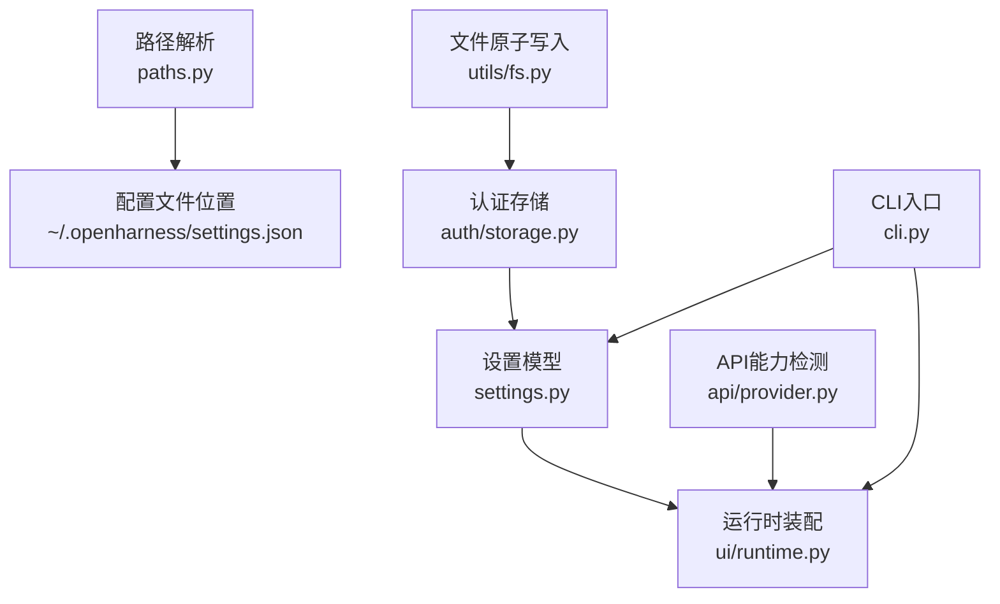
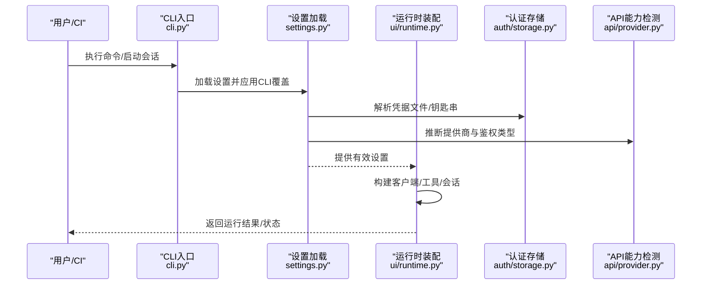
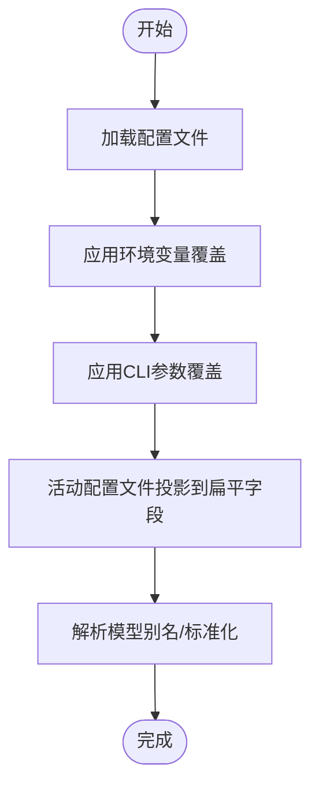
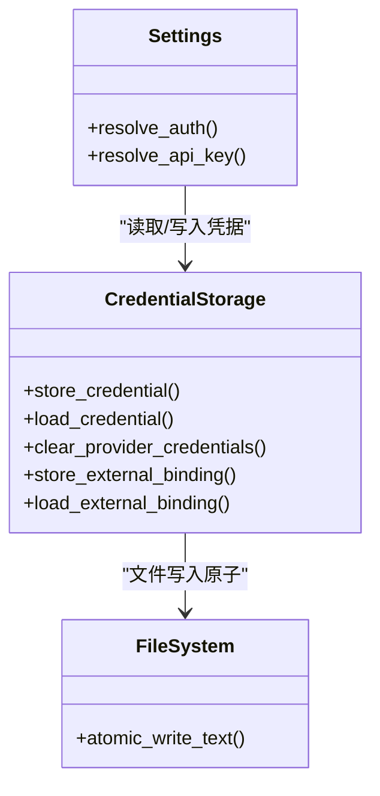
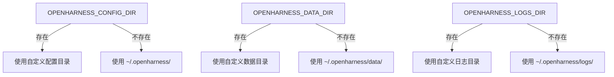
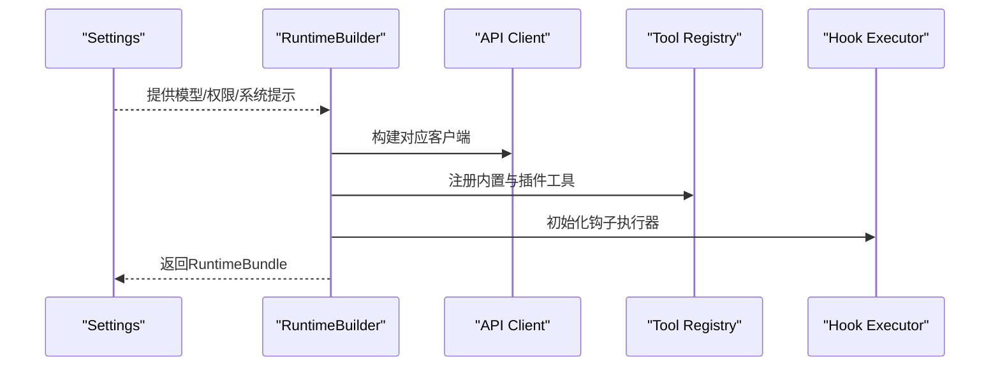
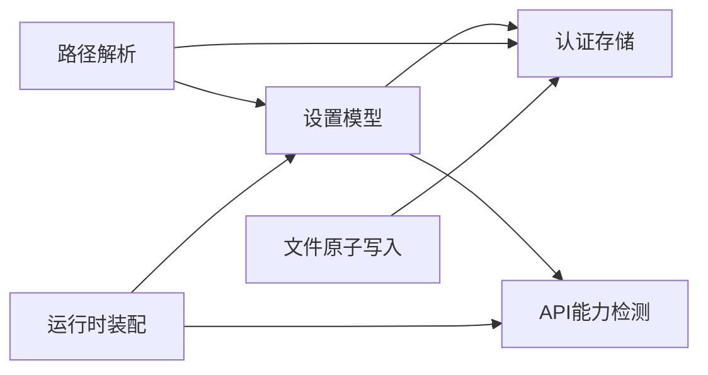

# 配置最佳实践

<cite>
**本文引用的文件**
- [settings.py](file://src/openharness/config/settings.py)
- [paths.py](file://src/openharness/config/paths.py)
- [schema.py](file://src/openharness/config/schema.py)
- [storage.py](file://src/openharness/auth/storage.py)
- [provider.py](file://src/openharness/api/provider.py)
- [fs.py](file://src/openharness/utils/fs.py)
- [runtime.py](file://src/openharness/ui/runtime.py)
- [cli.py](file://src/openharness/cli.py)
- [test_settings.py](file://tests/test_config/test_settings.py)
- [test_paths.py](file://tests/test_config/test_paths.py)
</cite>

## 目录
1. [简介](#简介)
2. [项目结构](#项目结构)
3. [核心组件](#核心组件)
4. [架构总览](#架构总览)
5. [详细组件分析](#详细组件分析)
6. [依赖分析](#依赖分析)
7. [性能考虑](#性能考虑)
8. [故障排除指南](#故障排除指南)
9. [结论](#结论)
10. [附录：配置模板与示例](#附录配置模板与示例)

## 简介
本指南面向OpenHarness用户与运维人员，系统阐述配置最佳实践，覆盖以下主题：
- 安全性：API密钥与敏感信息的存储、访问控制与最小权限原则
- 性能优化：内存窗口、超时、并发与会话持久化
- 环境差异：开发、生产、CI/CD三类环境的差异化配置策略
- 故障排除：常见配置错误的诊断与修复
- 版本管理与迁移：配置备份、恢复与升级策略
- 监控与审计：变更日志与有效性校验
- 模板与示例：面向典型场景的配置清单

## 项目结构
OpenHarness的配置体系围绕“设置模型 + 路径解析 + 认证存储 + 运行时装配”展开，关键模块职责如下：
- 设置模型与加载：定义配置项、优先级与合并逻辑
- 路径解析：统一配置目录、数据目录、日志目录与项目级配置路径
- 认证存储：文件与系统钥匙串双后端，保障凭据安全
- 运行时装配：根据设置构建API客户端、工具注册表、会话状态等
- CLI与测试：命令行入口与配置行为的单元测试

图表来源
- [settings.py:496-800](file://src/openharness/config/settings.py#L496-L800)
- [paths.py:15-161](file://src/openharness/config/paths.py#L15-L161)
- [storage.py:122-191](file://src/openharness/auth/storage.py#L122-L191)
- [runtime.py:205-393](file://src/openharness/ui/runtime.py#L205-L393)
- [provider.py:42-127](file://src/openharness/api/provider.py#L42-L127)
- [fs.py:39-99](file://src/openharness/utils/fs.py#L39-L99)
- [cli.py:749-778](file://src/openharness/cli.py#L749-L778)

章节来源
- [settings.py:1-800](file://src/openharness/config/settings.py#L1-L800)
- [paths.py:1-161](file://src/openharness/config/paths.py#L1-L161)
- [storage.py:1-270](file://src/openharness/auth/storage.py#L1-L270)
- [runtime.py:1-703](file://src/openharness/ui/runtime.py#L1-L703)
- [provider.py:1-187](file://src/openharness/api/provider.py#L1-L187)
- [fs.py:1-99](file://src/openharness/utils/fs.py#L1-L99)
- [cli.py:1-800](file://src/openharness/cli.py#L1-L800)

## 核心组件
- 设置模型（Settings）：集中定义API、行为、UI、内存、沙箱、插件、MCP服务器等配置项，并提供优先级解析与合并逻辑
- 路径解析（paths）：提供配置目录、数据目录、日志目录及项目级配置路径的解析与创建
- 认证存储（storage）：支持文件与系统钥匙串两种后端，提供凭据的读取、写入与清理
- 运行时装配（ui/runtime）：根据设置构建API客户端、工具注册表、会话状态与钩子执行器
- API能力检测（api/provider）：推断活跃提供商与鉴权类型，用于UI与诊断
- 文件原子写入（utils/fs）：确保配置与状态文件在崩溃或异常情况下不被截断

章节来源
- [settings.py:496-800](file://src/openharness/config/settings.py#L496-L800)
- [paths.py:15-161](file://src/openharness/config/paths.py#L15-L161)
- [storage.py:122-191](file://src/openharness/auth/storage.py#L122-L191)
- [runtime.py:205-393](file://src/openharness/ui/runtime.py#L205-L393)
- [provider.py:42-127](file://src/openharness/api/provider.py#L42-L127)
- [fs.py:39-99](file://src/openharness/utils/fs.py#L39-L99)

## 架构总览
下图展示从CLI到运行时的关键流程，以及配置在各层的作用点。

图表来源
- [cli.py:396-595](file://src/openharness/cli.py#L396-L595)
- [settings.py:644-791](file://src/openharness/config/settings.py#L644-L791)
- [runtime.py:205-393](file://src/openharness/ui/runtime.py#L205-L393)
- [storage.py:122-191](file://src/openharness/auth/storage.py#L122-L191)
- [provider.py:42-127](file://src/openharness/api/provider.py#L42-L127)

## 详细组件分析

### 组件A：设置模型与优先级
- 优先级（从高到低）：CLI参数 → 环境变量 → 配置文件（~/.openharness/settings.json） → 默认值
- 关键字段：API密钥、模型、超时、上下文窗口、最大轮次、权限模式、沙箱、插件启用、MCP服务器等
- 合并与投影：支持CLI覆盖、活动配置文件投影到扁平字段、模型别名解析与标准化

图表来源
- [settings.py:792-800](file://src/openharness/config/settings.py#L792-L800)
- [settings.py:555-585](file://src/openharness/config/settings.py#L555-L585)
- [settings.py:300-339](file://src/openharness/config/settings.py#L300-L339)

章节来源
- [settings.py:496-800](file://src/openharness/config/settings.py#L496-L800)
- [test_settings.py:23-124](file://tests/test_config/test_settings.py#L23-L124)

### 组件B：认证与凭据存储
- 双后端：系统钥匙串（可用时）与文件（默认）
- 文件后端：~/.openharness/credentials.json，权限模式0o600
- 支持外部绑定（如第三方订阅）与按配置文件作用域的凭据槽位
- 原子写入与互斥锁：防止并发进程互相覆盖

图表来源
- [settings.py:644-791](file://src/openharness/config/settings.py#L644-L791)
- [storage.py:122-191](file://src/openharness/auth/storage.py#L122-L191)
- [fs.py:69-78](file://src/openharness/utils/fs.py#L69-L78)

章节来源
- [storage.py:1-270](file://src/openharness/auth/storage.py#L1-L270)
- [fs.py:1-99](file://src/openharness/utils/fs.py#L1-L99)
- [test_settings.py:36-92](file://tests/test_config/test_settings.py#L36-L92)

### 组件C：路径解析与项目级配置
- 配置目录：OPENHARNESS_CONFIG_DIR 或 ~/.openharness/
- 数据目录：OPENHARNESS_DATA_DIR 或 ~/.openharness/data/
- 日志目录：OPENHARNESS_LOGS_DIR 或 ~/.openharness/logs/
- 项目级配置：工作目录/.openharness/ 下的issue/pr_comments/autopilot等文件

图表来源
- [paths.py:15-161](file://src/openharness/config/paths.py#L15-L161)

章节来源
- [paths.py:15-161](file://src/openharness/config/paths.py#L15-L161)
- [test_paths.py:15-70](file://tests/test_config/test_paths.py#L15-L70)

### 组件D：运行时装配与API客户端
- 根据设置选择API客户端类型（Anthropic、OpenAI兼容、Copilot、Codex等）
- 权限检查、钩子执行、工具注册、会话状态与快照保存
- 视觉模型回退配置（图像转文本）

图表来源
- [runtime.py:205-393](file://src/openharness/ui/runtime.py#L205-L393)
- [provider.py:42-127](file://src/openharness/api/provider.py#L42-L127)

章节来源
- [runtime.py:205-393](file://src/openharness/ui/runtime.py#L205-L393)
- [provider.py:42-127](file://src/openharness/api/provider.py#L42-L127)

## 依赖分析
- 设置模型依赖认证存储以解析凭据；运行时装配依赖设置模型与API能力检测；路径解析为配置与数据提供统一的文件系统布局；文件原子写入为凭据与配置提供一致性保障。
- 低耦合高内聚：设置模型仅负责声明与解析；认证存储专注凭据；运行时装配专注装配；路径解析专注定位；工具专注原子写入。

图表来源
- [settings.py:496-800](file://src/openharness/config/settings.py#L496-L800)
- [storage.py:122-191](file://src/openharness/auth/storage.py#L122-L191)
- [provider.py:42-127](file://src/openharness/api/provider.py#L42-L127)
- [paths.py:15-161](file://src/openharness/config/paths.py#L15-L161)
- [fs.py:39-99](file://src/openharness/utils/fs.py#L39-L99)
- [runtime.py:205-393](file://src/openharness/ui/runtime.py#L205-L393)

章节来源
- [settings.py:496-800](file://src/openharness/config/settings.py#L496-L800)
- [storage.py:122-191](file://src/openharness/auth/storage.py#L122-L191)
- [provider.py:42-127](file://src/openharness/api/provider.py#L42-L127)
- [paths.py:15-161](file://src/openharness/config/paths.py#L15-L161)
- [fs.py:39-99](file://src/openharness/utils/fs.py#L39-L99)
- [runtime.py:205-393](file://src/openharness/ui/runtime.py#L205-L393)

## 性能考虑
- 上下文窗口与紧凑阈值：通过上下文窗口令牌数与自动紧凑阈值控制内存占用，避免过长历史导致性能下降
- 最大轮次：限制单次交互的最大轮次，防止长时间运行任务占用资源
- 超时配置：为API客户端设置合理超时，避免阻塞等待
- 沙箱与并发：在需要隔离的环境中启用沙箱；对并发任务进行限流与资源配额控制
- 会话快照与增量保存：减少重复计算，提升恢复效率

章节来源
- [settings.py:60-68](file://src/openharness/config/settings.py#L60-L68)
- [settings.py:502-511](file://src/openharness/config/settings.py#L502-L511)
- [runtime.py:327-353](file://src/openharness/ui/runtime.py#L327-L353)

## 故障排除指南
- 缺少API密钥：当未配置任何密钥源时，解析会抛出错误；请通过环境变量、配置文件或外部登录流程提供
- 第三方端点与订阅鉴权冲突：订阅型鉴权不支持第三方端点，请改用API密钥型配置文件
- MCP服务器配置错误：在干运行预览中可发现明显配置问题，需修正传输方式、URL或命令路径
- ANSI转义序列污染：模型名称可能包含终端格式化字符，系统会自动剥离；若仍异常，请检查输入
- 并发写入冲突：凭据与配置采用原子写入与互斥锁，避免竞态；如遇权限问题，请检查文件权限与umask

章节来源
- [settings.py:644-791](file://src/openharness/config/settings.py#L644-L791)
- [cli.py:333-394](file://src/openharness/cli.py#L333-L394)
- [test_settings.py:493-532](file://tests/test_config/test_settings.py#L493-L532)
- [fs.py:39-99](file://src/openharness/utils/fs.py#L39-L99)

## 结论
通过明确的优先级与分层设计，OpenHarness实现了安全、可维护且高性能的配置体系。遵循本文的最佳实践，可在不同环境下稳定运行，并具备良好的可观测性与可迁移性。

## 附录：配置模板与示例
以下为常见场景的配置要点与建议（以路径与字段为主，避免直接粘贴敏感内容）：
- 开发环境
  - 使用本地凭据文件（权限0o600），禁用沙箱或限制网络访问
  - 设置较短超时与较小上下文窗口，便于快速迭代
  - 启用详细日志与调试输出
- 生产环境
  - 优先使用系统钥匙串存储API密钥；严格限制文件权限
  - 启用沙箱与文件/网络白名单；设置合理的超时与紧凑阈值
  - 配置会话快照与增量保存，确保中断恢复
- CI/CD环境
  - 通过环境变量注入API密钥；避免检入配置文件
  - 禁用交互式功能，使用非交互模式与干运行预览
  - 将配置目录与数据目录置于临时空间，作业结束后清理

章节来源
- [storage.py:122-191](file://src/openharness/auth/storage.py#L122-L191)
- [paths.py:15-161](file://src/openharness/config/paths.py#L15-L161)
- [settings.py:502-511](file://src/openharness/config/settings.py#L502-L511)
- [runtime.py:362-366](file://src/openharness/ui/runtime.py#L362-L366)
- [cli.py:396-595](file://src/openharness/cli.py#L396-L595)