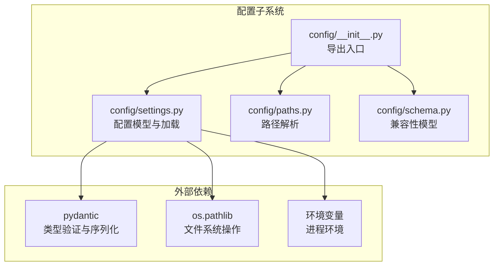
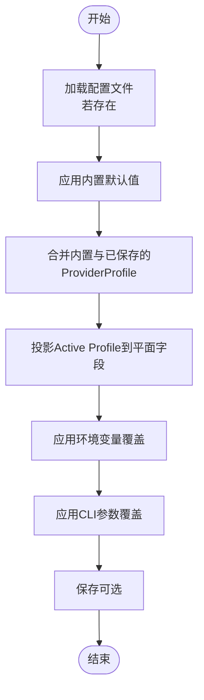
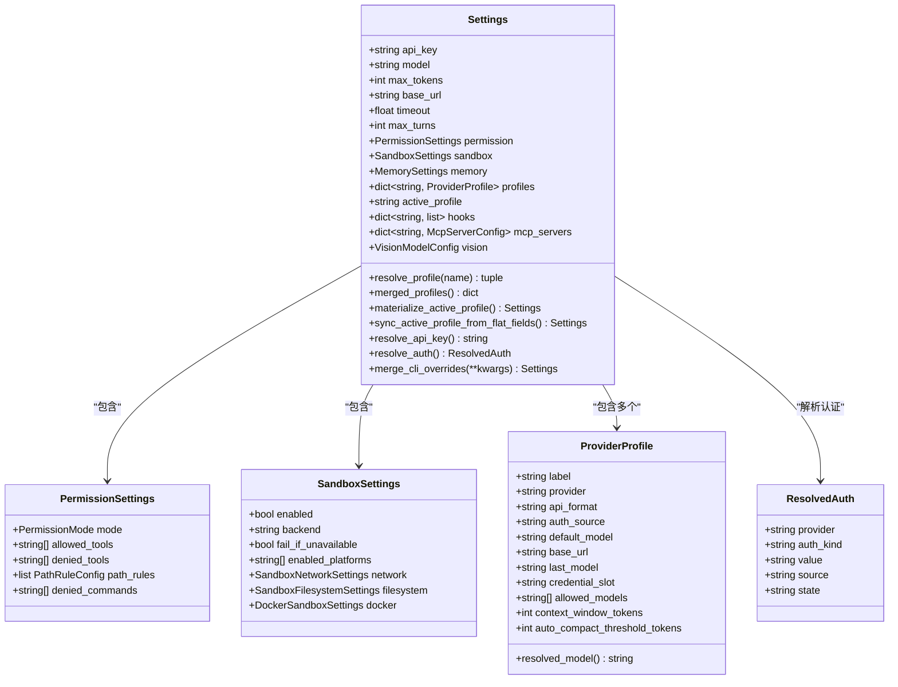
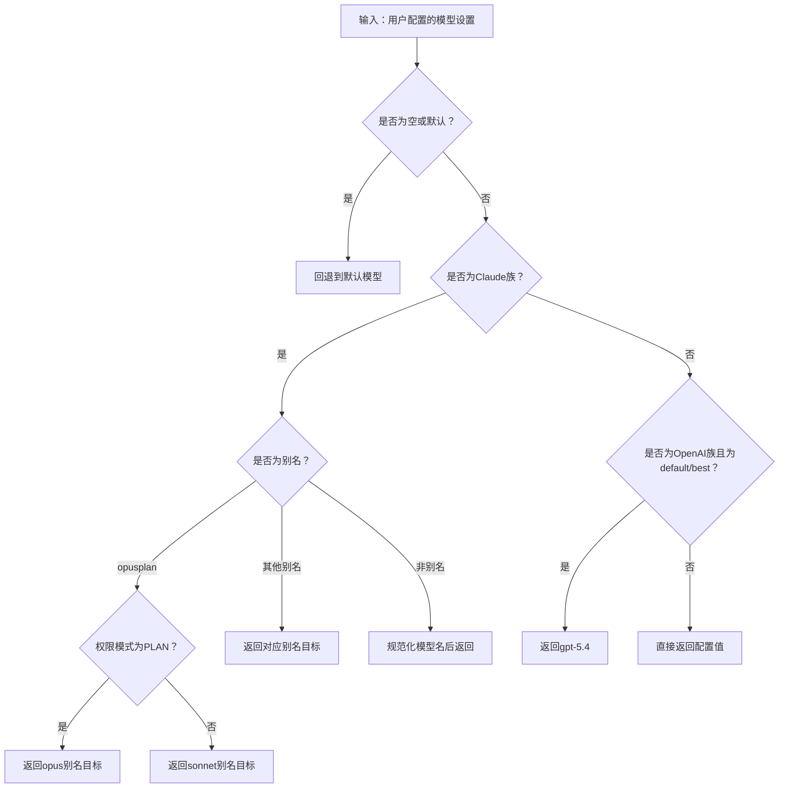
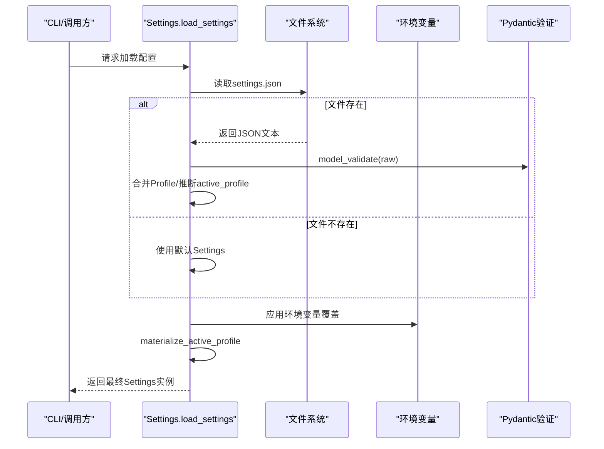
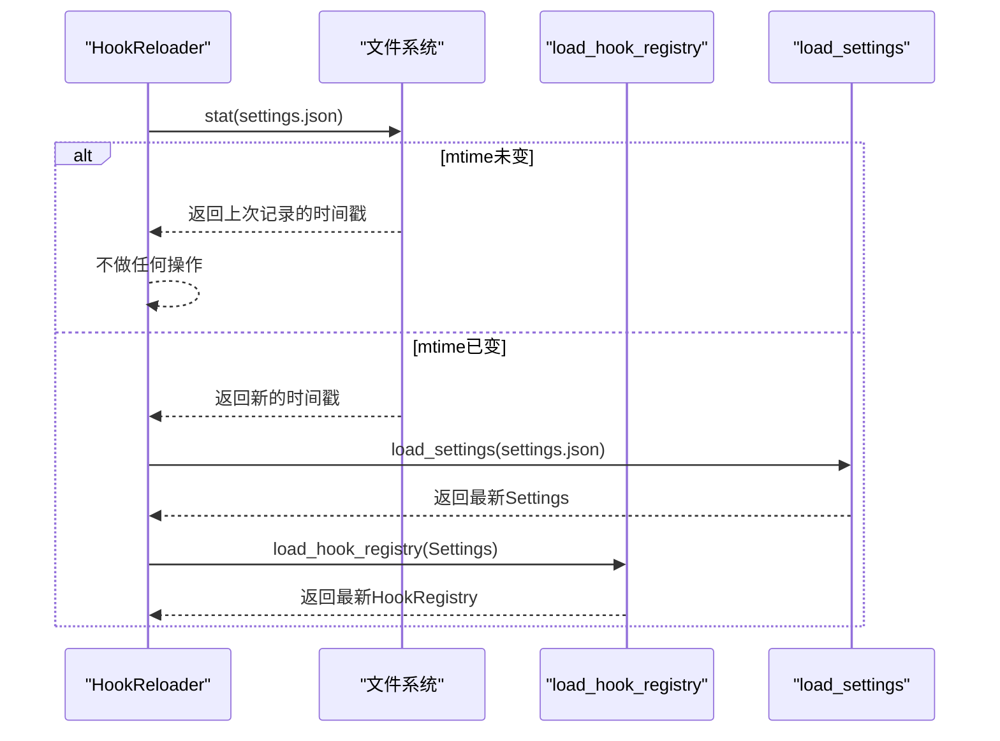
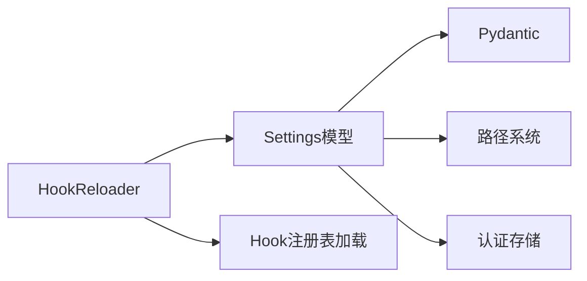

# 配置架构设计

<cite>
**本文档引用的文件**
- [config/__init__.py](file://src/openharness/config/__init__.py)
- [config/settings.py](file://src/openharness/config/settings.py)
- [config/paths.py](file://src/openharness/config/paths.py)
- [config/schema.py](file://src/openharness/config/schema.py)
- [cli.py](file://src/openharness/cli.py)
- [hooks/hot_reload.py](file://src/openharness/hooks/hot_reload.py)
- [test_config/test_settings.py](file://tests/test_config/test_settings.py)
- [permissions/modes.py](file://src/openharness/permissions/modes.py)
- [hooks/schemas.py](file://src/openharness/hooks/schemas.py)
</cite>

## 目录
1. [简介](#简介)
2. [项目结构](#项目结构)
3. [核心组件](#核心组件)
4. [架构总览](#架构总览)
5. [详细组件分析](#详细组件分析)
6. [依赖关系分析](#依赖关系分析)
7. [性能考虑](#性能考虑)
8. [故障排除指南](#故障排除指南)
9. [结论](#结论)
10. [附录](#附录)

## 简介
本文件系统性阐述OpenHarness的配置架构设计，重点覆盖多层配置系统的优先级机制（CLI参数 > 环境变量 > 配置文件 > 默认值）、配置模型设计（Settings主模型、ProviderProfile配置文件、PermissionSettings权限设置等）、继承与合并策略、类型安全与验证机制、配置数据流与动态更新/热重载能力，并提供最佳实践与设计原则。

## 项目结构
OpenHarness的配置子系统位于`src/openharness/config/`目录下，围绕以下模块协同工作：
- `settings.py`: 定义配置模型、加载/保存逻辑、优先级解析与合并策略
- `paths.py`: 负责路径解析与XDG风格的配置/数据/日志目录管理
- `schema.py`: 兼容性通道配置模型（为旧适配器保留）
- `__init__.py`: 导出配置相关API，统一对外接口

**图表来源**
- [config/__init__.py:1-35](file://src/openharness/config/__init__.py#L1-L35)
- [config/settings.py:1-25](file://src/openharness/config/settings.py#L1-L25)
- [config/paths.py:1-10](file://src/openharness/config/paths.py#L1-L10)

**章节来源**
- [config/__init__.py:1-35](file://src/openharness/config/__init__.py#L1-L35)
- [config/paths.py:1-161](file://src/openharness/config/paths.py#L1-L161)

## 核心组件
- Settings主模型：集中定义所有配置项，支持嵌套模型、字段默认值、类型约束与运行时投影（materialize）。
- ProviderProfile配置文件：命名化的提供者工作流配置，支持模型别名解析、认证源映射、上下文窗口与紧凑阈值等。
- PermissionSettings权限设置：基于枚举的权限模式与工具/命令白黑名单、路径规则等。
- 路径系统：遵循XDG风格，支持通过环境变量覆盖配置/数据/日志目录。
- 加载/保存：从JSON文件加载、应用环境变量覆盖、写回配置文件并保证原子性。

**章节来源**
- [config/settings.py:496-586](file://src/openharness/config/settings.py#L496-L586)
- [config/settings.py:109-132](file://src/openharness/config/settings.py#L109-L132)
- [config/settings.py:50-58](file://src/openharness/config/settings.py#L50-L58)
- [config/paths.py:15-68](file://src/openharness/config/paths.py#L15-L68)

## 架构总览
OpenHarness采用“分层优先级”的配置解析流程，确保用户意图能够被正确地覆盖到最终运行态配置中。优先级顺序如下：
1) CLI参数（最高优先级）
2) 环境变量（次之）
3) 配置文件（~/.openharness/settings.json）
4) 内置默认值（最低优先级）

**图表来源**
- [config/settings.py:914-943](file://src/openharness/config/settings.py#L914-L943)
- [config/settings.py:820-906](file://src/openharness/config/settings.py#L820-L906)
- [config/settings.py:792-817](file://src/openharness/config/settings.py#L792-L817)

**章节来源**
- [config/settings.py:3-8](file://src/openharness/config/settings.py#L3-L8)
- [config/settings.py:914-943](file://src/openharness/config/settings.py#L914-L943)

## 详细组件分析

### Settings主模型与字段体系
Settings是配置的核心载体，包含API配置、行为控制、UI选项、沙箱与内存、插件与技能、MCP服务器、视觉模型等。其关键特性：
- 使用Pydantic模型进行类型验证与序列化
- 支持嵌套模型（如PermissionSettings、SandboxSettings、ProviderProfile等）
- 提供materialize_active_profile/sync_active_profile_from_flat_fields等投影/回写方法，实现“平面字段”与“Profile层”的双向同步
- resolve_profile/merged_profiles实现内置与自定义Profile的合并与回退逻辑

**图表来源**
- [config/settings.py:496-791](file://src/openharness/config/settings.py#L496-L791)
- [config/settings.py:50-58](file://src/openharness/config/settings.py#L50-L58)
- [config/settings.py:97-107](file://src/openharness/config/settings.py#L97-L107)
- [config/settings.py:109-132](file://src/openharness/config/settings.py#L109-L132)
- [config/settings.py:135-143](file://src/openharness/config/settings.py#L135-L143)

**章节来源**
- [config/settings.py:496-791](file://src/openharness/config/settings.py#L496-L791)

### ProviderProfile与模型解析
ProviderProfile用于描述“命名化”的提供者工作流，支持：
- 认证源映射与作用域（支持按Profile绑定独立密钥槽）
- 模型别名解析（如Claude系列别名到具体模型ID）
- 上下文窗口与紧凑阈值等上下文相关配置

**图表来源**
- [config/settings.py:300-338](file://src/openharness/config/settings.py#L300-L338)

**章节来源**
- [config/settings.py:109-132](file://src/openharness/config/settings.py#L109-L132)
- [config/settings.py:300-338](file://src/openharness/config/settings.py#L300-L338)

### 权限设置与模式
PermissionSettings通过PermissionMode枚举控制权限模式，并支持工具白名单/黑名单、命令限制与路径规则。该模型由Pydantic进行类型校验，确保字段一致性与安全性。

**章节来源**
- [config/settings.py:50-58](file://src/openharness/config/settings.py#L50-L58)
- [permissions/modes.py:8-14](file://src/openharness/permissions/modes.py#L8-L14)

### 路径解析与XDG风格
paths.py遵循XDG风格约定，支持通过环境变量覆盖配置/数据/日志目录，并自动创建缺失目录。这保证了配置文件位置的可预测性与可移植性。

**章节来源**
- [config/paths.py:15-68](file://src/openharness/config/paths.py#L15-L68)

### 加载与保存流程
- load_settings：从配置文件加载JSON，使用Pydantic进行验证；若文件缺少profiles/active_profile则从平面字段推断生成Profile；随后应用环境变量覆盖，最后materialize_active_profile投影到平面字段。
- save_settings：先将Profile回写到平面字段，再materialize_active_profile，然后以原子方式写入settings.json，避免竞态与损坏。

**图表来源**
- [config/settings.py:914-943](file://src/openharness/config/settings.py#L914-L943)

**章节来源**
- [config/settings.py:914-943](file://src/openharness/config/settings.py#L914-L943)
- [config/settings.py:946-965](file://src/openharness/config/settings.py#L946-L965)

### 动态更新与热重载
OpenHarness提供“最佳努力”的热重载能力，通过HookReloader监听配置文件修改时间戳变化，当检测到变更时重新加载Hook注册表。该机制适用于需要响应配置变更而无需重启整个进程的场景。

**图表来源**
- [hooks/hot_reload.py:11-31](file://src/openharness/hooks/hot_reload.py#L11-L31)

**章节来源**
- [hooks/hot_reload.py:11-31](file://src/openharness/hooks/hot_reload.py#L11-L31)

### 类型安全与验证机制
- Pydantic模型：所有配置模型均继承自BaseModel，字段具备类型注解与默认值，自动进行类型检查与序列化。
- 字段验证：如PermissionMode使用枚举限定取值范围；HookDefinition使用联合类型与字面量类型确保钩子定义合法。
- 运行时投影：materialize_active_profile/sync_active_profile_from_flat_fields确保Profile层与平面字段的一致性与可追溯性。

**章节来源**
- [config/settings.py:19](file://src/openharness/config/settings.py#L19)
- [hooks/schemas.py:10-58](file://src/openharness/hooks/schemas.py#L10-L58)
- [permissions/modes.py:8-14](file://src/openharness/permissions/modes.py#L8-L14)

## 依赖关系分析
配置子系统内部耦合度低，主要依赖关系如下：
- Settings依赖：Pydantic（类型验证）、文件锁与原子写（防止并发写冲突）、认证存储（外部凭据加载）
- paths依赖：os、pathlib（路径解析与目录创建）
- hooks/hot_reload依赖：config.load_settings、hooks.loader.load_hook_registry

**图表来源**
- [config/settings.py:19](file://src/openharness/config/settings.py#L19)
- [config/paths.py:15-68](file://src/openharness/config/paths.py#L15-L68)
- [hooks/hot_reload.py:7-8](file://src/openharness/hooks/hot_reload.py#L7-L8)

**章节来源**
- [config/settings.py:19](file://src/openharness/config/settings.py#L19)
- [hooks/hot_reload.py:7-8](file://src/openharness/hooks/hot_reload.py#L7-L8)

## 性能考虑
- 延迟加载：仅在首次访问配置时才进行文件读取与解析，避免启动开销。
- 最小化拷贝：merge_cli_overrides与materialize/sync方法返回新实例而非原位修改，便于缓存与不可变配置。
- 原子写入：save_settings使用文件锁与原子写入，减少I/O竞争与损坏风险。
- 环境变量覆盖：_apply_env_overrides仅在必要时构建更新字典，避免不必要的模型复制。

[本节为通用指导，不涉及特定文件分析]

## 故障排除指南
- 缺少API密钥：resolve_api_key/resolve_auth会在找不到有效密钥时抛出异常，建议检查环境变量、配置文件或外部凭据绑定。
- 模型名称污染：ANSI转义序列会被strip_ansi_escape_sequences清理，确保模型名正确解析。
- 配置文件损坏：load_settings在解析失败时会回退到默认配置；建议备份并修复settings.json。
- 热重载未生效：确认HookReloader监听的配置文件路径正确，且mtime确实发生变化。

**章节来源**
- [config/settings.py:644-681](file://src/openharness/config/settings.py#L644-L681)
- [config/settings.py:683-790](file://src/openharness/config/settings.py#L683-L790)
- [config/settings.py:32-40](file://src/openharness/config/settings.py#L32-L40)
- [hooks/hot_reload.py:19-31](file://src/openharness/hooks/hot_reload.py#L19-L31)

## 结论
OpenHarness的配置架构通过清晰的优先级、严格的类型验证与灵活的合并策略，实现了从CLI到环境变量再到配置文件与默认值的完整覆盖。Profile层与平面字段的双向投影提升了可维护性与向后兼容性；热重载机制为部分场景提供了动态更新能力。整体设计兼顾了易用性、安全性与可扩展性。

[本节为总结性内容，不涉及特定文件分析]

## 附录

### 配置优先级与字段覆盖清单
- CLI参数：model、max_turns、base_url、system_prompt、api_key、api_format、permission_mode、active_profile等
- 环境变量：OPENHARNESS_*、ANTHROPIC_*、OPENAI_*、DASHSCOPE_*、MINIMAX_*、NVIDIA_*、MODELSCOPE_*等
- 配置文件：settings.json（含profiles与active_profile）
- 默认值：Settings构造函数提供的默认值

**章节来源**
- [config/settings.py:3-8](file://src/openharness/config/settings.py#L3-L8)
- [config/settings.py:820-906](file://src/openharness/config/settings.py#L820-L906)
- [config/settings.py:792-817](file://src/openharness/config/settings.py#L792-L817)

### 兼容性模型（通道适配器）
schema.py提供兼容性模型，确保旧版适配器仍可导入与使用，同时保持主配置系统独立演进。

**章节来源**
- [config/schema.py:12-117](file://src/openharness/config/schema.py#L12-L117)