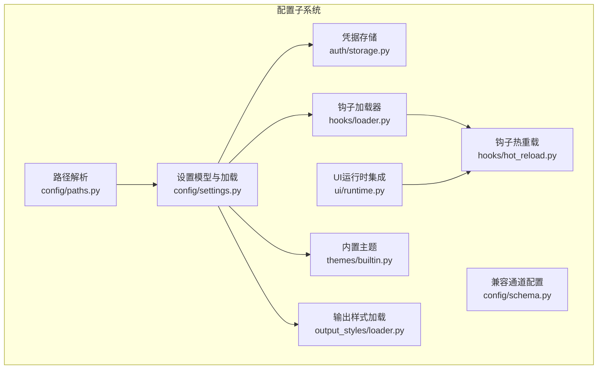
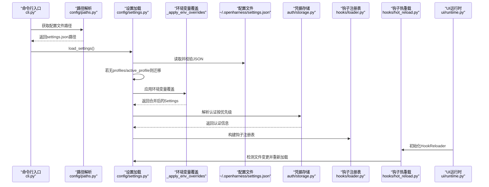
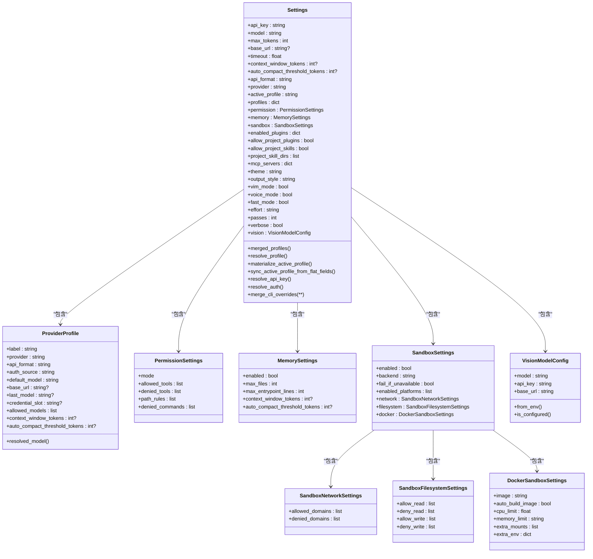
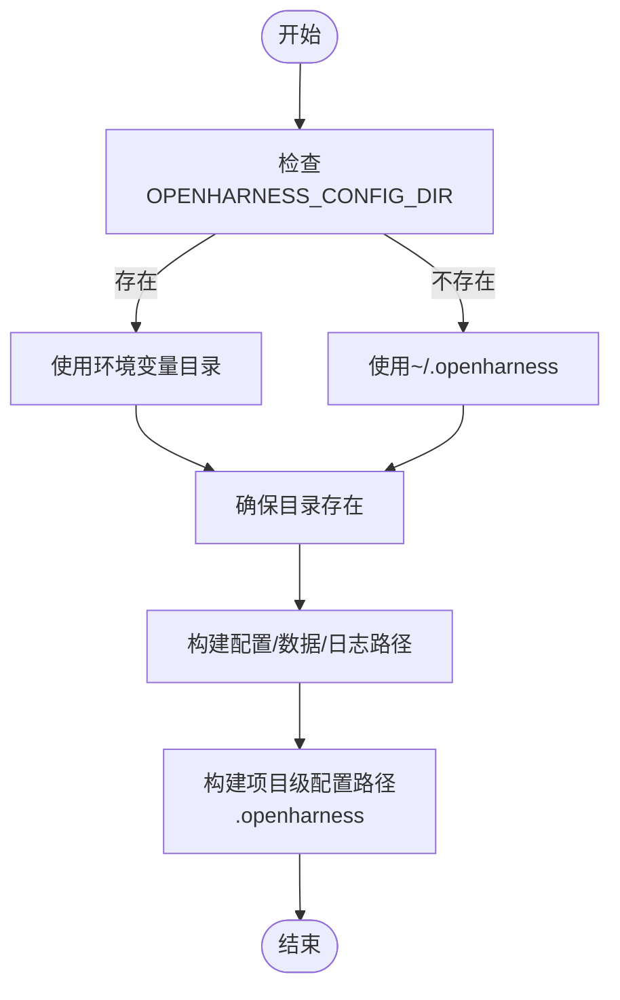
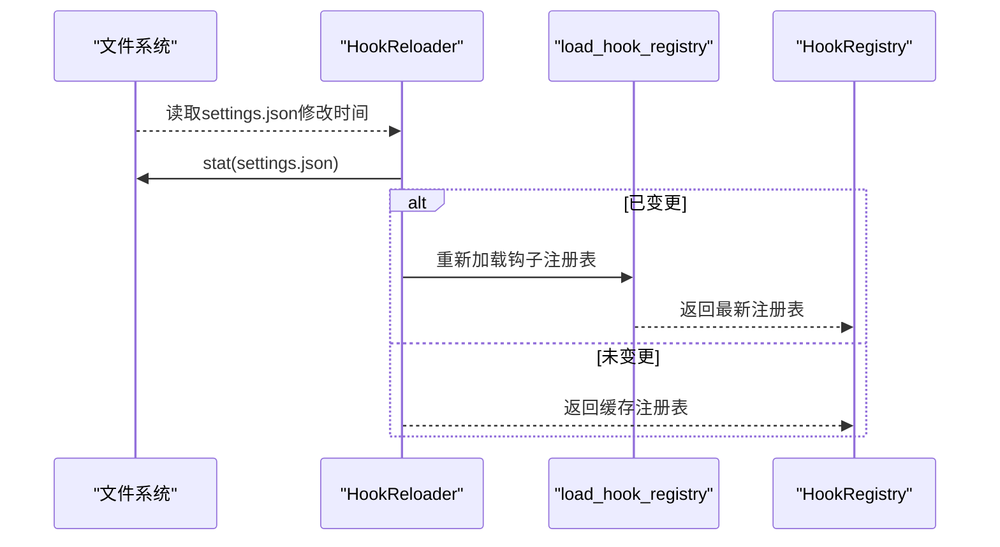
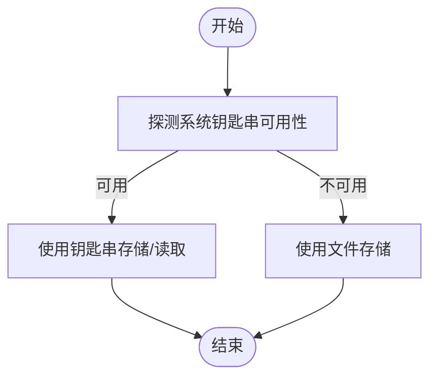
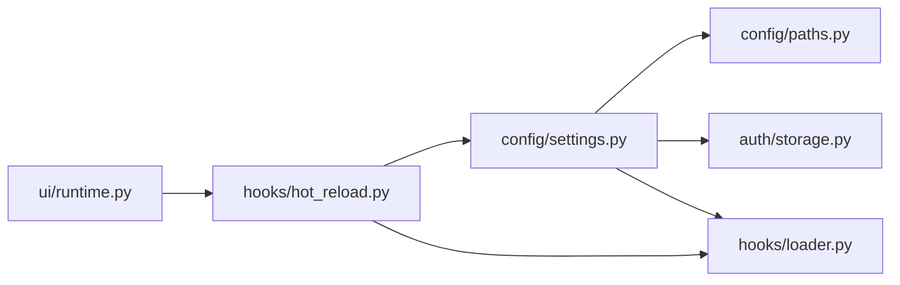
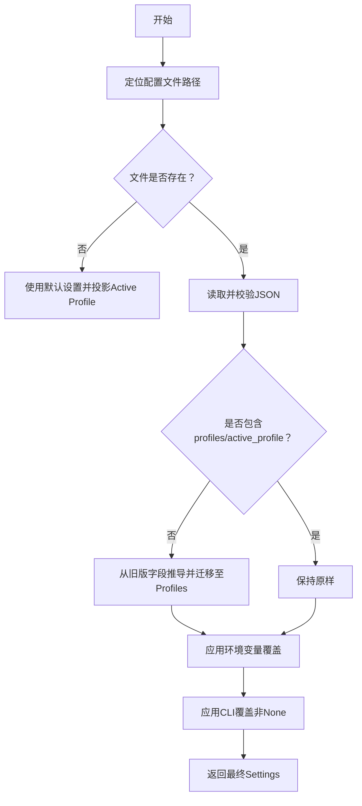

# 配置管理

<cite>
**本文引用的文件**
- [config/__init__.py](file://src/openharness/config/__init__.py)
- [config/settings.py](file://src/openharness/config/settings.py)
- [config/schema.py](file://src/openharness/config/schema.py)
- [config/paths.py](file://src/openharness/config/paths.py)
- [hooks/hot_reload.py](file://src/openharness/hooks/hot_reload.py)
- [hooks/loader.py](file://src/openharness/hooks/loader.py)
- [ui/runtime.py](file://src/openharness/ui/runtime.py)
- [auth/storage.py](file://src/openharness/auth/storage.py)
- [themes/builtin.py](file://src/openharness/themes/builtin.py)
- [output_styles/loader.py](file://src/openharness/output_styles/loader.py)
- [cli.py](file://src/openharness/cli.py)
- [test_config/test_settings.py](file://tests/test_config/test_settings.py)
- [test_config/test_paths.py](file://tests/test_config/test_paths.py)
</cite>

## 目录
1. [简介](#简介)
2. [项目结构](#项目结构)
3. [核心组件](#核心组件)
4. [架构总览](#架构总览)
5. [详细组件分析](#详细组件分析)
6. [依赖关系分析](#依赖关系分析)
7. [性能考量](#性能考量)
8. [故障排除指南](#故障排除指南)
9. [结论](#结论)
10. [附录](#附录)

## 简介
本文件系统性阐述 OpenHarness 的配置管理系统，覆盖多层配置体系（用户配置、系统配置、环境变量、CLI 参数）、配置优先级与继承机制、配置文件结构与字段定义、路径解析与验证、加载流程与合并策略、动态更新与热重载、跨平台适配与迁移兼容等内容。目标是帮助开发者与运维人员快速理解并正确使用配置系统，实现安全、稳定、可维护的部署与运行。

## 项目结构
OpenHarness 的配置子系统由以下模块组成：
- 路径解析：负责配置目录、数据目录、日志目录及项目级配置路径的解析与创建
- 设置模型与加载：定义 Settings 及其子模型，实现从文件、环境变量、CLI 参数的合并与应用
- 兼容通道配置：为旧版通道适配保留的兼容模型
- 动态热重载：基于设置文件变更的钩子注册表热重载
- UI 运行时集成：在 UI 启动时初始化热重载器
- 凭据存储：提供文件与系统钥匙串两种凭据存储后端
- 主题与输出样式：内置主题与自定义输出样式的加载

**图表来源**
- [config/paths.py:15-161](file://src/openharness/config/paths.py#L15-L161)
- [config/settings.py:496-964](file://src/openharness/config/settings.py#L496-L964)
- [config/schema.py:12-117](file://src/openharness/config/schema.py#L12-L117)
- [hooks/hot_reload.py:11-32](file://src/openharness/hooks/hot_reload.py#L11-L32)
- [hooks/loader.py:40-60](file://src/openharness/hooks/loader.py#L40-L60)
- [ui/runtime.py:284-285](file://src/openharness/ui/runtime.py#L284-L285)
- [auth/storage.py:54-164](file://src/openharness/auth/storage.py#L54-L164)
- [themes/builtin.py:13-90](file://src/openharness/themes/builtin.py#L13-L90)
- [output_styles/loader.py:20-43](file://src/openharness/output_styles/loader.py#L20-L43)

**章节来源**
- [config/__init__.py:1-35](file://src/openharness/config/__init__.py#L1-L35)
- [config/paths.py:15-161](file://src/openharness/config/paths.py#L15-L161)
- [config/settings.py:496-964](file://src/openharness/config/settings.py#L496-L964)
- [config/schema.py:12-117](file://src/openharness/config/schema.py#L12-L117)
- [hooks/hot_reload.py:11-32](file://src/openharness/hooks/hot_reload.py#L11-L32)
- [hooks/loader.py:40-60](file://src/openharness/hooks/loader.py#L40-L60)
- [ui/runtime.py:284-285](file://src/openharness/ui/runtime.py#L284-L285)
- [auth/storage.py:54-164](file://src/openharness/auth/storage.py#L54-L164)
- [themes/builtin.py:13-90](file://src/openharness/themes/builtin.py#L13-L90)
- [output_styles/loader.py:20-43](file://src/openharness/output_styles/loader.py#L20-L43)

## 核心组件
- 多层配置与优先级
  - 优先级顺序（从高到低）：CLI 参数 → 环境变量 → 用户配置文件（~/.openharness/settings.json） → 默认值
  - CLI 参数通过 Settings.merge_cli_overrides 应用，ANSI 转义序列会被清理
  - 环境变量通过 _apply_env_overrides 应用，支持多类覆盖键（如模型名、超时、令牌、沙箱参数等）
  - 文件配置通过 load_settings 加载，若未包含 profiles/active_profile 字段则自动迁移至新配置层
- 配置模型与继承
  - Settings 包含 API 配置、行为控制、权限、内存、沙箱、插件、MCP 服务器、UI、视觉模型等
  - ProviderProfile 支持命名工作流配置，包含标签、提供商、认证源、默认/上次使用的模型、上下文窗口与紧凑阈值等
  - Profiles 层与旧版平铺字段（provider、api_format、base_url、model 等）可双向同步与投影
- 路径解析
  - 支持 OPENHARNESS_CONFIG_DIR、OPENHARNESS_DATA_DIR、OPENHARNESS_LOGS_DIR 环境变量覆盖
  - 默认遵循 XDG 类约定，主配置目录为 ~/.openharness
- 动态热重载
  - 基于设置文件修改时间戳检测变更，重新加载钩子注册表
  - UI 运行时启动 HookReloader 并注入执行器

**章节来源**
- [config/settings.py:3-8](file://src/openharness/config/settings.py#L3-L8)
- [config/settings.py:792-800](file://src/openharness/config/settings.py#L792-L800)
- [config/settings.py:883-907](file://src/openharness/config/settings.py#L883-L907)
- [config/settings.py:914-944](file://src/openharness/config/settings.py#L914-L944)
- [config/paths.py:15-68](file://src/openharness/config/paths.py#L15-L68)
- [hooks/hot_reload.py:19-31](file://src/openharness/hooks/hot_reload.py#L19-L31)
- [ui/runtime.py:284-285](file://src/openharness/ui/runtime.py#L284-L285)

## 架构总览
下图展示配置加载与应用的关键流程：从路径解析到设置加载、环境变量覆盖、CLI 覆盖、模型投影与认证解析，再到 UI 集成与热重载。

**图表来源**
- [cli.py:411-428](file://src/openharness/cli.py#L411-L428)
- [config/paths.py:32-34](file://src/openharness/config/paths.py#L32-L34)
- [config/settings.py:914-944](file://src/openharness/config/settings.py#L914-L944)
- [config/settings.py:883-907](file://src/openharness/config/settings.py#L883-L907)
- [auth/storage.py:147-164](file://src/openharness/auth/storage.py#L147-L164)
- [hooks/loader.py:40-60](file://src/openharness/hooks/loader.py#L40-L60)
- [hooks/hot_reload.py:19-31](file://src/openharness/hooks/hot_reload.py#L19-L31)
- [ui/runtime.py:284-285](file://src/openharness/ui/runtime.py#L284-L285)

## 详细组件分析

### 设置模型与加载流程
- 设置模型
  - Settings：顶层配置容器，包含 API、行为、权限、内存、沙箱、插件、MCP、UI、视觉模型等字段
  - ProviderProfile：命名提供商工作流，支持认证源、默认/上次模型、上下文窗口与紧凑阈值
  - 子模型：权限、内存、沙箱网络/文件系统、Docker 沙箱、视觉模型配置等
- 加载流程
  - load_settings：从默认或指定路径读取 JSON，校验并合并；若缺少 profiles/active_profile 则迁移
  - _apply_env_overrides：应用环境变量覆盖（模型、基础 URL、超时、令牌、沙箱等）
  - merge_cli_overrides：应用 CLI 覆盖（非 None 值），ANSI 清理
  - materialize_active_profile/sync_active_profile_from_flat_fields：在 Profiles 与旧版字段之间投影与同步
- 认证解析
  - resolve_auth：按订阅桥接、OAuth、外部绑定、环境变量、文件存储等顺序解析
  - resolve_api_key：针对特定格式的 API Key 解析与校验

**图表来源**
- [config/settings.py:496-642](file://src/openharness/config/settings.py#L496-L642)
- [config/settings.py:109-132](file://src/openharness/config/settings.py#L109-L132)
- [config/settings.py:50-58](file://src/openharness/config/settings.py#L50-L58)
- [config/settings.py:60-68](file://src/openharness/config/settings.py#L60-L68)
- [config/settings.py:70-84](file://src/openharness/config/settings.py#L70-L84)
- [config/settings.py:86-95](file://src/openharness/config/settings.py#L86-L95)
- [config/settings.py:97-107](file://src/openharness/config/settings.py#L97-L107)
- [config/settings.py:470-494](file://src/openharness/config/settings.py#L470-L494)

**章节来源**
- [config/settings.py:496-964](file://src/openharness/config/settings.py#L496-L964)

### 路径解析与项目级配置
- 默认基目录：~/.openharness
- 支持环境变量覆盖：
  - OPENHARNESS_CONFIG_DIR：配置目录
  - OPENHARNESS_DATA_DIR：数据目录
  - OPENHARNESS_LOGS_DIR：日志目录
- 项目级配置目录：工作目录下的 .openharness，用于存放项目上下文、问题与 PR 注释、Autopilot 状态等

**图表来源**
- [config/paths.py:15-161](file://src/openharness/config/paths.py#L15-L161)

**章节来源**
- [config/paths.py:15-161](file://src/openharness/config/paths.py#L15-L161)
- [test_config/test_paths.py:15-70](file://tests/test_config/test_paths.py#L15-L70)

### 动态热重载与钩子注册
- HookReloader：监控设置文件修改时间戳，变化时重新加载钩子注册表
- UI 运行时：在启动阶段初始化 HookReloader 并注入执行器，实现设置驱动的钩子热更新

**图表来源**
- [hooks/hot_reload.py:19-31](file://src/openharness/hooks/hot_reload.py#L19-L31)
- [hooks/loader.py:40-60](file://src/openharness/hooks/loader.py#L40-L60)
- [ui/runtime.py:284-285](file://src/openharness/ui/runtime.py#L284-L285)

**章节来源**
- [hooks/hot_reload.py:11-32](file://src/openharness/hooks/hot_reload.py#L11-L32)
- [hooks/loader.py:40-60](file://src/openharness/hooks/loader.py#L40-L60)
- [ui/runtime.py:284-285](file://src/openharness/ui/runtime.py#L284-L285)

### 凭据存储与安全
- 文件后端：~/.openharness/credentials.json，文件权限 0600
- 系统钥匙串后端：可用时优先使用，不可用时回退文件后端
- 支持按提供商与键名存储/读取/清除凭据，以及外部绑定元数据存储

**图表来源**
- [auth/storage.py:87-110](file://src/openharness/auth/storage.py#L87-L110)
- [auth/storage.py:122-164](file://src/openharness/auth/storage.py#L122-L164)

**章节来源**
- [auth/storage.py:54-164](file://src/openharness/auth/storage.py#L54-L164)

### 主题与输出样式
- 内置主题：default、dark、minimal、cyberpunk、solarized
- 输出样式：内置 default/minimal/codex，支持用户自定义样式文件（~/.openharness/output_styles/*.md）

**章节来源**
- [themes/builtin.py:13-90](file://src/openharness/themes/builtin.py#L13-L90)
- [output_styles/loader.py:20-43](file://src/openharness/output_styles/loader.py#L20-L43)

## 依赖关系分析
- 组件耦合
  - config/settings.py 依赖 config/paths.py（路径解析）、auth/storage.py（凭据存储）、hooks/loader.py（钩子注册）
  - hooks/hot_reload.py 依赖 config/settings.py 与 hooks/loader.py
  - ui/runtime.py 依赖 hooks/hot_reload.py 以启用热重载
- 外部依赖
  - 系统钥匙串（keyring）为可选依赖，不可用时回退文件存储
  - 环境变量覆盖键广泛，涉及模型、基础 URL、超时、令牌、沙箱等

**图表来源**
- [config/settings.py:914-944](file://src/openharness/config/settings.py#L914-L944)
- [hooks/hot_reload.py:19-31](file://src/openharness/hooks/hot_reload.py#L19-L31)
- [hooks/loader.py:40-60](file://src/openharness/hooks/loader.py#L40-L60)
- [ui/runtime.py:284-285](file://src/openharness/ui/runtime.py#L284-L285)

**章节来源**
- [config/settings.py:914-944](file://src/openharness/config/settings.py#L914-L944)
- [hooks/hot_reload.py:19-31](file://src/openharness/hooks/hot_reload.py#L19-L31)
- [hooks/loader.py:40-60](file://src/openharness/hooks/loader.py#L40-L60)
- [ui/runtime.py:284-285](file://src/openharness/ui/runtime.py#L284-L285)

## 性能考量
- 最小化磁盘 IO：路径解析与设置加载仅在启动或热重载触发时进行
- 锁定与原子写入：保存设置时使用独占锁与原子写入，避免并发冲突与损坏
- 环境变量覆盖：批量应用，减少重复解析
- 建议
  - 在 CI 或容器环境中优先使用环境变量覆盖，避免频繁文件读写
  - 合理设置沙箱参数，避免不必要的资源消耗

[本节为通用建议，无需特定文件引用]

## 故障排除指南
- 无法解析 API Key
  - 检查 PROVIDER_API_KEY 或 OPENAI_API_KEY 环境变量是否设置
  - 确认设置文件中 api_key 是否正确
  - 对于订阅型提供商，确认外部绑定与凭据存储状态
- 订阅型提供商认证异常
  - 确认第三方 Anthropic 基础 URL 不支持订阅认证，需改用 API Key 配置
  - 使用 oh auth 登录流程完成外部绑定
- 模型名称包含 ANSI 转义导致解析异常
  - CLI/环境变量中的模型名会被清理，确保输入不含格式化码
- 沙箱参数未生效
  - 确认环境变量键名正确（如 OPENHARNESS_SANDBOX_ENABLED 等）
- 钩子未热更新
  - 确认设置文件已保存且修改时间戳已改变
  - 检查 UI 是否已初始化 HookReloader

**章节来源**
- [config/settings.py:644-791](file://src/openharness/config/settings.py#L644-L791)
- [config/settings.py:883-907](file://src/openharness/config/settings.py#L883-L907)
- [hooks/hot_reload.py:19-31](file://src/openharness/hooks/hot_reload.py#L19-L31)
- [auth/storage.py:147-164](file://src/openharness/auth/storage.py#L147-L164)
- [test_config/test_settings.py:493-532](file://tests/test_config/test_settings.py#L493-L532)

## 结论
OpenHarness 的配置系统采用“文件 + 环境变量 + CLI + 默认值”的分层优先级设计，结合 Profiles 层与旧版字段的双向投影，既保证了向后兼容，又提供了灵活的配置能力。通过路径解析、凭据存储、热重载与 UI 集成，系统实现了跨平台、可扩展、可维护的配置管理。建议在生产环境中优先使用环境变量覆盖与钥匙串存储，配合合理的沙箱与权限策略，确保安全与性能。

[本节为总结，无需特定文件引用]

## 附录

### 配置项参考（摘要）
- API 配置
  - api_key：API 密钥（优先级低于环境变量）
  - model：模型名称（支持别名与规范化）
  - base_url：基础 URL（支持多提供商）
  - timeout：请求超时
  - context_window_tokens/auto_compact_threshold_tokens：上下文窗口与紧凑阈值
  - api_format/provider：API 格式与提供商
  - max_turns：最大轮次
- 行为控制
  - system_prompt：系统提示词
  - permission：权限模式与规则
  - hooks：事件钩子定义
  - memory：内存系统配置
  - sandbox：沙箱集成配置
  - enabled_plugins/allow_project_plugins/allow_project_skills/project_skill_dirs：插件与技能控制
  - mcp_servers：MCP 服务器配置
- UI
  - theme：主题名称
  - output_style：输出样式
  - vim_mode/voice_mode/fast_mode：交互模式
  - effort/passes/verbose：执行策略与调试开关
- 视觉模型
  - vision.model/api_key/base_url：图像转文本回退模型

**章节来源**
- [config/settings.py:496-540](file://src/openharness/config/settings.py#L496-L540)

### 配置加载与合并流程（算法）

**图表来源**
- [config/settings.py:914-944](file://src/openharness/config/settings.py#L914-L944)
- [config/settings.py:883-907](file://src/openharness/config/settings.py#L883-L907)
- [config/settings.py:792-800](file://src/openharness/config/settings.py#L792-L800)

### 跨平台与部署适配
- 路径解析遵循 XDG 类约定，默认位于用户主目录
- 环境变量覆盖适用于容器、CI、WSL 等无图形界面环境
- 钥匙串后端在可用时优先使用，不可用时回退文件存储，满足容器与无 GUI 环境需求

**章节来源**
- [config/paths.py:15-68](file://src/openharness/config/paths.py#L15-L68)
- [auth/storage.py:87-110](file://src/openharness/auth/storage.py#L87-L110)

### 配置迁移与版本兼容
- 旧版平铺字段（provider、api_format、base_url、model 等）会自动迁移至 Profiles 层
- Profiles 与内置目录合并，内置条目优先级高于用户自定义
- 保存设置前会同步 Active Profile 并投影到平铺字段，确保兼容性

**章节来源**
- [config/settings.py:540-564](file://src/openharness/config/settings.py#L540-L564)
- [config/settings.py:587-642](file://src/openharness/config/settings.py#L587-L642)
- [config/settings.py:946-964](file://src/openharness/config/settings.py#L946-L964)
- [test_config/test_settings.py:169-191](file://tests/test_config/test_settings.py#L169-L191)