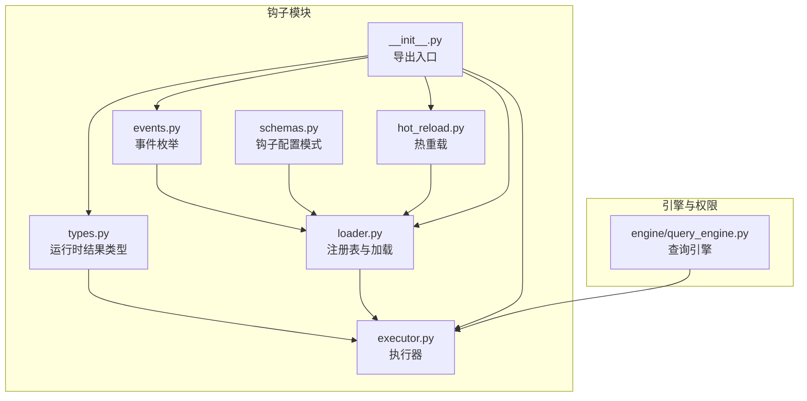
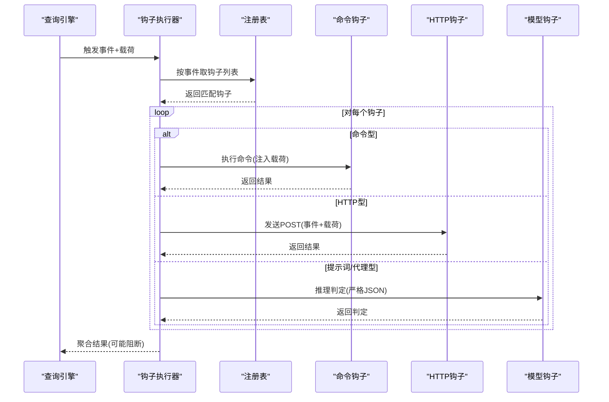
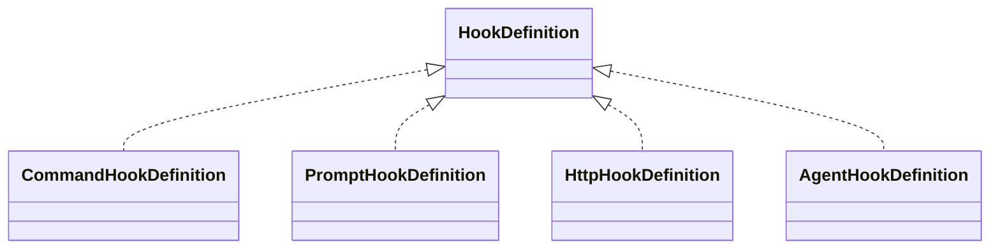
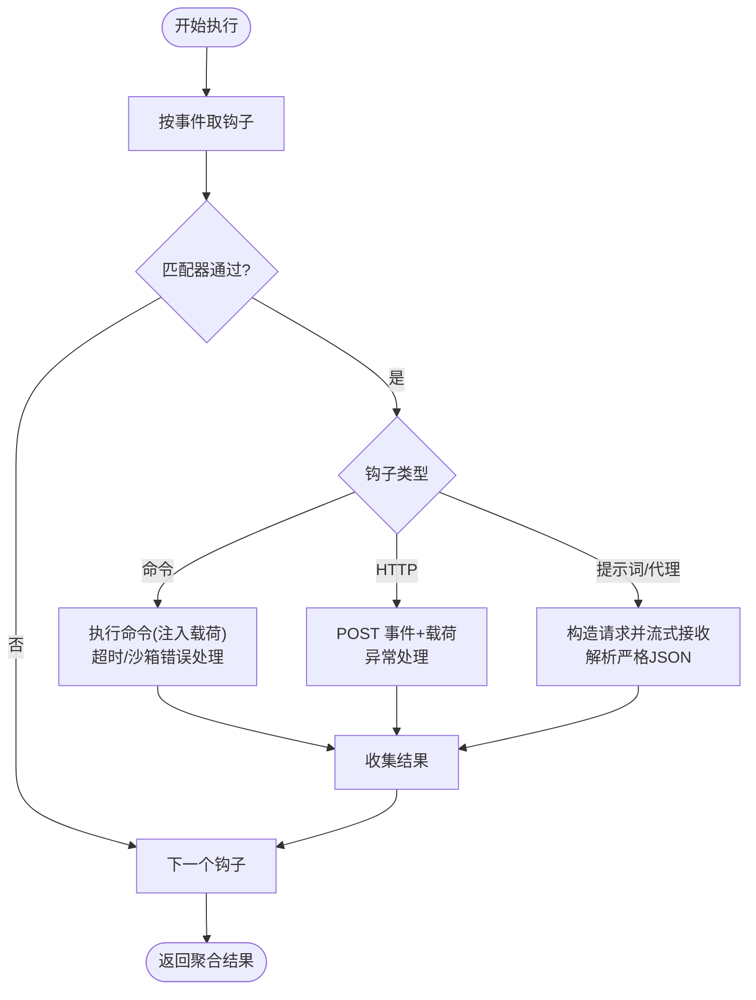
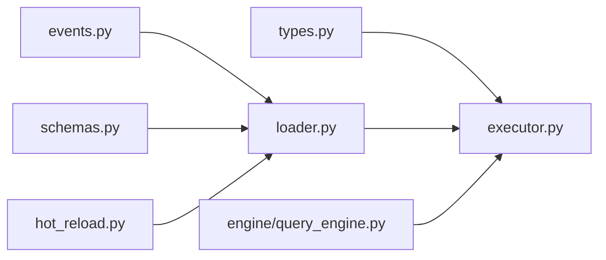

# 钩子系统

<cite>
**本文引用的文件**
- [src/openharness/hooks/__init__.py](file://src/openharness/hooks/__init__.py)
- [src/openharness/hooks/events.py](file://src/openharness/hooks/events.py)
- [src/openharness/hooks/executor.py](file://src/openharness/hooks/executor.py)
- [src/openharness/hooks/loader.py](file://src/openharness/hooks/loader.py)
- [src/openharness/hooks/types.py](file://src/openharness/hooks/types.py)
- [src/openharness/hooks/schemas.py](file://src/openharness/hooks/schemas.py)
- [src/openharness/hooks/hot_reload.py](file://src/openharness/hooks/hot_reload.py)
- [src/openharness/engine/query_engine.py](file://src/openharness/engine/query_engine.py)
- [tests/test_hooks/test_executor.py](file://tests/test_hooks/test_executor.py)
- [src/openharness/config/schema.py](file://src/openharness/config/schema.py)
</cite>

## 目录
1. [简介](#简介)
2. [项目结构](#项目结构)
3. [核心组件](#核心组件)
4. [架构总览](#架构总览)
5. [详细组件分析](#详细组件分析)
6. [依赖分析](#依赖分析)
7. [性能考虑](#性能考虑)
8. [故障排查指南](#故障排查指南)
9. [结论](#结论)
10. [附录](#附录)

## 简介
本文件系统性阐述 OpenHarness 的钩子（Hook）体系：包括钩子事件、执行器、加载器与热重载机制；生命周期钩子类型与触发时机；注册与执行顺序；开发指南（函数定义、参数传递、返回值处理）；与权限系统、工具系统的集成；典型使用场景（日志、审计、安全检查）；性能优化与错误处理最佳实践；以及扩展与自定义钩子的开发方法。

## 项目结构
钩子系统位于 src/openharness/hooks 下，围绕事件枚举、配置模式、执行器、注册表与热重载展开，并在引擎层与权限系统协同工作。

**图表来源**
- [src/openharness/hooks/events.py:8-21](file://src/openharness/hooks/events.py#L8-L21)
- [src/openharness/hooks/schemas.py:10-58](file://src/openharness/hooks/schemas.py#L10-L58)
- [src/openharness/hooks/types.py:9-39](file://src/openharness/hooks/types.py#L9-L39)
- [src/openharness/hooks/loader.py:10-61](file://src/openharness/hooks/loader.py#L10-L61)
- [src/openharness/hooks/executor.py:41-243](file://src/openharness/hooks/executor.py#L41-L243)
- [src/openharness/hooks/hot_reload.py:11-32](file://src/openharness/hooks/hot_reload.py#L11-L32)
- [src/openharness/hooks/__init__.py:13-21](file://src/openharness/hooks/__init__.py#L13-L21)
- [src/openharness/engine/query_engine.py:14-191](file://src/openharness/engine/query_engine.py#L14-L191)

**章节来源**
- [src/openharness/hooks/__init__.py:13-21](file://src/openharness/hooks/__init__.py#L13-L21)
- [src/openharness/hooks/events.py:8-21](file://src/openharness/hooks/events.py#L8-L21)
- [src/openharness/hooks/schemas.py:10-58](file://src/openharness/hooks/schemas.py#L10-L58)
- [src/openharness/hooks/types.py:9-39](file://src/openharness/hooks/types.py#L9-L39)
- [src/openharness/hooks/loader.py:10-61](file://src/openharness/hooks/loader.py#L10-L61)
- [src/openharness/hooks/executor.py:41-243](file://src/openharness/hooks/executor.py#L41-L243)
- [src/openharness/hooks/hot_reload.py:11-32](file://src/openharness/hooks/hot_reload.py#L11-L32)
- [src/openharness/engine/query_engine.py:14-191](file://src/openharness/engine/query_engine.py#L14-L191)

## 核心组件
- 事件枚举：定义所有可触发钩子的生命周期事件，如会话开始/结束、压缩前后、工具调用前/后、用户提交提示、通知、停止等。
- 配置模式：定义四类钩子的配置结构（命令、提示词、HTTP、代理式），含匹配器、超时、阻断策略等。
- 注册表与加载器：按事件分组存储钩子，支持从设置与插件合并加载。
- 执行器：根据事件选择匹配钩子，异步执行命令、HTTP、模型判定三类逻辑，聚合结果并决定是否阻断后续流程。
- 运行时结果：单钩子与聚合结果的数据结构，便于上层判断阻断原因与输出。
- 热重载：基于设置文件时间戳变更自动重建注册表，实现“无需重启”的钩子更新。
- 集成点：查询引擎在关键节点触发钩子，权限系统与工具系统在各自边界与钩子协作。

**章节来源**
- [src/openharness/hooks/events.py:8-21](file://src/openharness/hooks/events.py#L8-L21)
- [src/openharness/hooks/schemas.py:10-58](file://src/openharness/hooks/schemas.py#L10-L58)
- [src/openharness/hooks/loader.py:10-61](file://src/openharness/hooks/loader.py#L10-L61)
- [src/openharness/hooks/executor.py:41-243](file://src/openharness/hooks/executor.py#L41-L243)
- [src/openharness/hooks/types.py:9-39](file://src/openharness/hooks/types.py#L9-L39)
- [src/openharness/hooks/hot_reload.py:11-32](file://src/openharness/hooks/hot_reload.py#L11-L32)
- [src/openharness/engine/query_engine.py:14-191](file://src/openharness/engine/query_engine.py#L14-L191)

## 架构总览
钩子系统采用“事件驱动 + 多执行通道”的架构：事件由引擎或系统状态触发；注册表按事件索引钩子；执行器并发/串行地执行匹配钩子；不同类型的钩子通过命令、HTTP 或模型推理三种通道落地；最终聚合结果影响后续流程（如阻断）。

**图表来源**
- [src/openharness/engine/query_engine.py:147-191](file://src/openharness/engine/query_engine.py#L147-L191)
- [src/openharness/hooks/executor.py:64-78](file://src/openharness/hooks/executor.py#L64-L78)
- [src/openharness/hooks/loader.py:20-22](file://src/openharness/hooks/loader.py#L20-L22)

## 详细组件分析

### 事件系统（HookEvent）
- 定义了会话、压缩、工具使用、用户输入、通知、停止等生命周期事件。
- 事件作为键，将钩子组织到注册表中，确保执行器按需筛选。

**章节来源**
- [src/openharness/hooks/events.py:8-21](file://src/openharness/hooks/events.py#L8-L21)

### 配置模式（HookDefinition 及其变体）
- 命令钩子：执行 shell 命令，支持超时、阻断失败、匹配器。
- 提示词钩子：通过模型判定是否允许事件继续，严格要求返回 JSON 结构。
- HTTP 钩子：向远端服务上报事件与载荷，支持超时与阻断。
- 代理钩子：与提示词钩子类似，但强调更深入的推理与上下文分析。

**图表来源**
- [src/openharness/hooks/schemas.py:53-58](file://src/openharness/hooks/schemas.py#L53-L58)
- [src/openharness/hooks/schemas.py:10-51](file://src/openharness/hooks/schemas.py#L10-L51)

**章节来源**
- [src/openharness/hooks/schemas.py:10-58](file://src/openharness/hooks/schemas.py#L10-L58)

### 注册表与加载器（HookRegistry、load_hook_registry）
- 注册表按事件维护钩子列表，支持汇总展示与快速检索。
- 加载器从设置对象与插件对象合并加载钩子，忽略未知事件，保证健壮性。

**章节来源**
- [src/openharness/hooks/loader.py:10-61](file://src/openharness/hooks/loader.py#L10-L61)

### 执行器（HookExecutor）
- 上下文包含工作目录、消息流客户端与默认模型。
- 执行流程：
  - 依据事件取钩子列表；
  - 使用匹配器过滤（支持通配符）；
  - 分派到命令、HTTP 或提示词/代理执行；
  - 聚合结果并决定是否阻断。
- 错误处理：
  - 命令超时、沙箱不可用、HTTP 异常、模型返回非严格 JSON 等均生成带 reason 的结果。
- 安全：
  - 命令注入防护：对命令模板中的载荷进行 shell 转义；对提示词模板不转义，避免破坏 JSON。

**图表来源**
- [src/openharness/hooks/executor.py:64-78](file://src/openharness/hooks/executor.py#L64-L78)
- [src/openharness/hooks/executor.py:80-136](file://src/openharness/hooks/executor.py#L80-L136)
- [src/openharness/hooks/executor.py:138-167](file://src/openharness/hooks/executor.py#L138-L167)
- [src/openharness/hooks/executor.py:169-212](file://src/openharness/hooks/executor.py#L169-L212)

**章节来源**
- [src/openharness/hooks/executor.py:41-243](file://src/openharness/hooks/executor.py#L41-L243)

### 运行时结果（HookResult、AggregatedHookResult）
- 单钩子结果包含类型、成功与否、输出、阻断标记、原因与元数据。
- 聚合结果提供 blocked 与 reason 属性，便于上层决策。

**章节来源**
- [src/openharness/hooks/types.py:9-39](file://src/openharness/hooks/types.py#L9-L39)

### 热重载（HookReloader）
- 基于设置文件的修改时间戳检测变化，动态重建注册表，实现“热更新”钩子定义。

**章节来源**
- [src/openharness/hooks/hot_reload.py:11-32](file://src/openharness/hooks/hot_reload.py#L11-L32)

### 与引擎、权限与工具的集成
- 查询引擎在用户提交提示、会话关键节点触发钩子，将事件与载荷传入执行器。
- 权限系统与工具系统在各自边界与钩子协作，例如在工具调用前/后触发钩子进行策略校验或审计。

**章节来源**
- [src/openharness/engine/query_engine.py:147-191](file://src/openharness/engine/query_engine.py#L147-L191)

## 依赖分析
- 组件内聚高：事件、模式、类型、执行器、注册表职责清晰。
- 执行器耦合点：
  - 事件枚举：用于筛选钩子；
  - 注册表：用于取钩子；
  - 模式：用于分支执行；
  - 类型：用于聚合结果；
  - 工具：命令钩子依赖沙箱工具与 shell 子进程；
  - 网络：HTTP 钩子依赖异步 HTTP 客户端；
  - 模型：提示词/代理钩子依赖消息流接口。
- 无循环依赖迹象。

**图表来源**
- [src/openharness/hooks/events.py:8-21](file://src/openharness/hooks/events.py#L8-L21)
- [src/openharness/hooks/schemas.py:10-58](file://src/openharness/hooks/schemas.py#L10-L58)
- [src/openharness/hooks/types.py:9-39](file://src/openharness/hooks/types.py#L9-L39)
- [src/openharness/hooks/loader.py:10-61](file://src/openharness/hooks/loader.py#L10-L61)
- [src/openharness/hooks/executor.py:41-243](file://src/openharness/hooks/executor.py#L41-L243)
- [src/openharness/hooks/hot_reload.py:11-32](file://src/openharness/hooks/hot_reload.py#L11-L32)
- [src/openharness/engine/query_engine.py:14-191](file://src/openharness/engine/query_engine.py#L14-L191)

**章节来源**
- [src/openharness/hooks/events.py:8-21](file://src/openharness/hooks/events.py#L8-L21)
- [src/openharness/hooks/schemas.py:10-58](file://src/openharness/hooks/schemas.py#L10-L58)
- [src/openharness/hooks/types.py:9-39](file://src/openharness/hooks/types.py#L9-L39)
- [src/openharness/hooks/loader.py:10-61](file://src/openharness/hooks/loader.py#L10-L61)
- [src/openharness/hooks/executor.py:41-243](file://src/openharness/hooks/executor.py#L41-L243)
- [src/openharness/hooks/hot_reload.py:11-32](file://src/openharness/hooks/hot_reload.py#L11-L32)
- [src/openharness/engine/query_engine.py:14-191](file://src/openharness/engine/query_engine.py#L14-L191)

## 性能考虑
- 并发与超时：
  - 命令与 HTTP 钩子均支持超时，避免阻塞主流程。
  - 建议为耗时操作（HTTP、外部命令）设置合理超时阈值。
- I/O 优化：
  - 命令钩子使用异步子进程与管道读取，减少阻塞。
  - HTTP 钩子使用连接池与短超时，降低延迟。
- 模型钩子：
  - 限制最大令牌数与较短超时，避免长对话阻塞。
  - 在代理模式下可增加推理深度，但应权衡性能。
- 匹配器：
  - 使用通配符匹配器时注意覆盖范围，避免不必要的执行。
- 聚合与阻断：
  - 聚合结果仅在需要时才阻断后续流程，减少无效计算。

[本节为通用建议，无需特定文件引用]

## 故障排查指南
- 命令注入风险：
  - 确保命令模板中对载荷进行 shell 转义；测试用例验证了注入保护。
- 模型返回格式：
  - 提示词/代理钩子必须返回严格 JSON，否则会被视为拒绝；若返回非标准 JSON，将尝试宽松匹配。
- HTTP 钩子：
  - 关注状态码与异常；失败时会记录原因并按阻断策略决定是否阻断。
- 超时与失败：
  - 命令与 HTTP 钩子超时会返回失败结果；检查资源可用性与网络连通性。
- 阻断原因：
  - 聚合结果提供首个阻断原因，便于定位问题。

**章节来源**
- [tests/test_hooks/test_executor.py:81-122](file://tests/test_hooks/test_executor.py#L81-L122)
- [src/openharness/hooks/executor.py:232-242](file://src/openharness/hooks/executor.py#L232-L242)
- [src/openharness/hooks/executor.py:108-120](file://src/openharness/hooks/executor.py#L108-L120)
- [src/openharness/hooks/executor.py:161-167](file://src/openharness/hooks/executor.py#L161-L167)

## 结论
OpenHarness 钩子系统通过清晰的事件模型、多通道执行器与严格的运行时结果聚合，实现了对生命周期的灵活控制。结合热重载与与引擎、权限、工具系统的集成，既满足安全与审计需求，又保持良好的可扩展性与可维护性。

[本节为总结，无需特定文件引用]

## 附录

### 生命周期钩子类型与触发时机
- 会话生命周期：会话开始、会话结束
- 内容压缩：压缩前、压缩后
- 工具使用：工具调用前、工具调用后
- 用户交互：用户提交提示
- 系统事件：通知、停止、子代理停止

**章节来源**
- [src/openharness/hooks/events.py:11-21](file://src/openharness/hooks/events.py#L11-L21)

### PreToolUse 与 PostToolUse 钩子
- PreToolUse：在工具调用前执行，适合安全检查、策略校验与审计记录。
- PostToolUse：在工具调用后执行，适合日志归档、结果审计与后续处理。

**章节来源**
- [src/openharness/hooks/events.py:15-16](file://src/openharness/hooks/events.py#L15-L16)
- [tests/test_hooks/test_executor.py:52-74](file://tests/test_hooks/test_executor.py#L52-L74)

### 注册机制与执行顺序
- 注册：按事件分组存储，支持来自设置与插件的合并加载。
- 执行：按注册顺序依次执行，匹配器过滤后进入对应通道；聚合结果决定是否阻断。

**章节来源**
- [src/openharness/hooks/loader.py:40-60](file://src/openharness/hooks/loader.py#L40-L60)
- [src/openharness/hooks/executor.py:64-78](file://src/openharness/hooks/executor.py#L64-L78)

### 开发指南（钩子函数定义、参数传递与返回值）
- 命令钩子：
  - 定义命令模板与超时；通过环境变量与注入参数传递事件与载荷。
  - 注意 shell 转义，防止注入。
- HTTP 钩子：
  - 定义目标 URL、请求头与超时；POST 事件与载荷；根据状态码与响应内容决定结果。
- 提示词/代理钩子：
  - 编写明确的判定提示词；模型必须返回严格 JSON：{"ok": true/false, "reason": "..."}。
  - 代理模式可要求更深入推理。
- 返回值：
  - 成功/失败、输出文本、阻断标记、原因与元数据；聚合结果提供 blocked 与 reason。

**章节来源**
- [src/openharness/hooks/schemas.py:10-51](file://src/openharness/hooks/schemas.py#L10-L51)
- [src/openharness/hooks/executor.py:80-136](file://src/openharness/hooks/executor.py#L80-L136)
- [src/openharness/hooks/executor.py:138-167](file://src/openharness/hooks/executor.py#L138-L167)
- [src/openharness/hooks/executor.py:169-212](file://src/openharness/hooks/executor.py#L169-L212)
- [src/openharness/hooks/types.py:9-39](file://src/openharness/hooks/types.py#L9-L39)

### 与权限系统、工具系统的集成
- 权限系统：可在工具调用前通过钩子进行策略校验，必要时阻断。
- 工具系统：钩子可用于审计工具调用、记录输出与副作用。

**章节来源**
- [src/openharness/engine/query_engine.py:14-191](file://src/openharness/engine/query_engine.py#L14-L191)

### 常见使用场景
- 日志记录：在会话开始/结束、工具调用前后记录事件与载荷。
- 审计跟踪：记录工具名称、输入、输出与决策过程。
- 安全检查：在工具调用前通过模型钩子进行策略判定，阻断高风险操作。

**章节来源**
- [src/openharness/hooks/events.py:11-21](file://src/openharness/hooks/events.py#L11-L21)
- [src/openharness/hooks/schemas.py:20-51](file://src/openharness/hooks/schemas.py#L20-L51)

### 扩展性与自定义钩子
- 新增钩子类型：在模式中新增定义，并在执行器中添加分支处理。
- 自定义匹配器：使用通配符精确限定触发条件。
- 热重载：通过 HookReloader 实现设置文件变更后的自动重载。

**章节来源**
- [src/openharness/hooks/schemas.py:53-58](file://src/openharness/hooks/schemas.py#L53-L58)
- [src/openharness/hooks/executor.py:64-78](file://src/openharness/hooks/executor.py#L64-L78)
- [src/openharness/hooks/hot_reload.py:19-31](file://src/openharness/hooks/hot_reload.py#L19-L31)