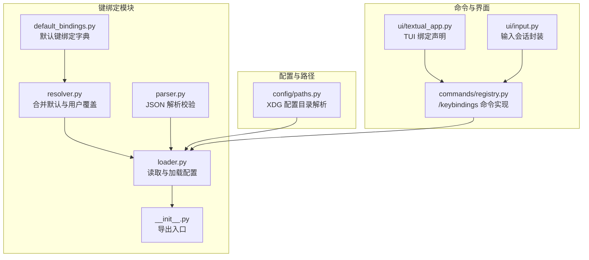
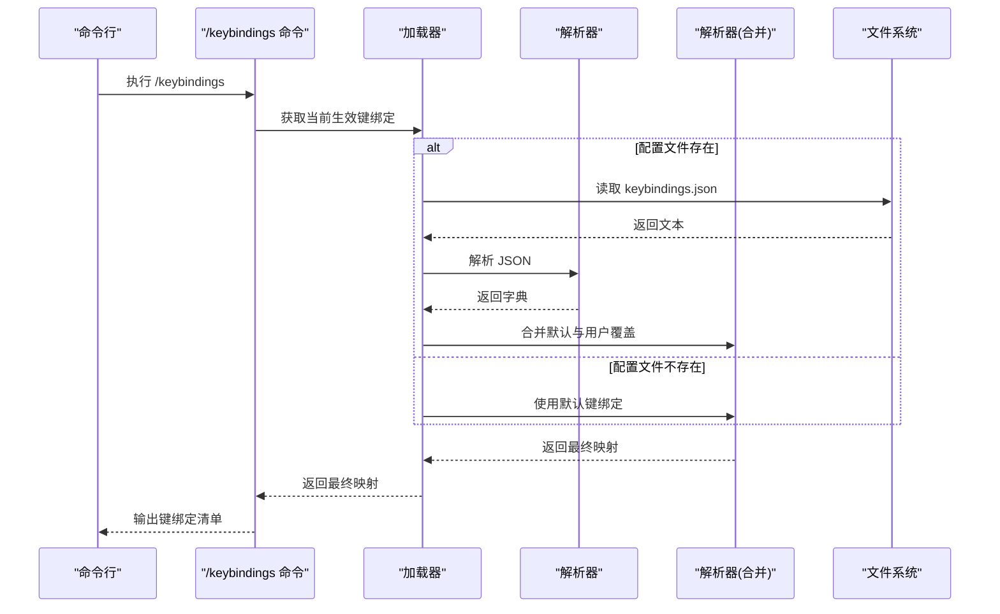
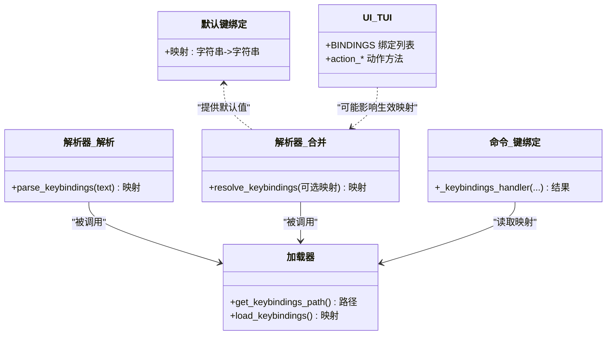
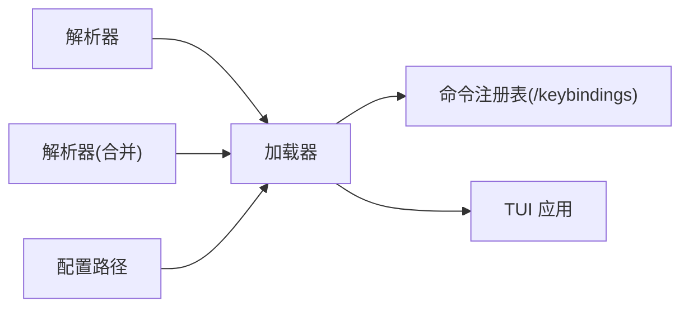

# 键绑定系统

<cite>
**本文引用的文件**
- [src/openharness/keybindings/__init__.py](file://src/openharness/keybindings/__init__.py)
- [src/openharness/keybindings/default_bindings.py](file://src/openharness/keybindings/default_bindings.py)
- [src/openharness/keybindings/loader.py](file://src/openharness/keybindings/loader.py)
- [src/openharness/keybindings/parser.py](file://src/openharness/keybindings/parser.py)
- [src/openharness/keybindings/resolver.py](file://src/openharness/keybindings/resolver.py)
- [src/openharness/config/paths.py](file://src/openharness/config/paths.py)
- [src/openharness/commands/registry.py](file://src/openharness/commands/registry.py)
- [src/openharness/ui/textual_app.py](file://src/openharness/ui/textual_app.py)
- [src/openharness/ui/input.py](file://src/openharness/ui/input.py)
- [tests/test_commands/test_registry.py](file://tests/test_commands/test_registry.py)
</cite>

## 目录
1. [简介](#简介)
2. [项目结构](#项目结构)
3. [核心组件](#核心组件)
4. [架构总览](#架构总览)
5. [详细组件分析](#详细组件分析)
6. [依赖分析](#依赖分析)
7. [性能考虑](#性能考虑)
8. [故障排除指南](#故障排除指南)
9. [结论](#结论)
10. [附录](#附录)

## 简介
本文件系统化阐述 OpenHarness 的键绑定系统：从默认绑定、解析器、加载器到解析与执行机制；说明配置格式与语法；给出默认键绑定清单与含义；提供自定义键绑定的开发与配置方法；解释键绑定与不同界面组件（文本式 TUI、命令行输入会话）的集成方式；并提供扩展与自定义开发指南、调试与故障排除方法，以及跨操作系统与终端环境的兼容性建议。

## 项目结构
键绑定系统位于 Python 包 openharness.keybindings 下，围绕“默认绑定 + 用户覆盖”的策略工作，并通过命令注册表暴露“列出当前键绑定”的能力。配置文件采用 JSON 格式，默认路径遵循 XDG-like 的用户配置目录约定。

**图表来源**
- [src/openharness/keybindings/default_bindings.py:1-12](file://src/openharness/keybindings/default_bindings.py#L1-L12)
- [src/openharness/keybindings/resolver.py:1-14](file://src/openharness/keybindings/resolver.py#L1-L14)
- [src/openharness/keybindings/parser.py:1-19](file://src/openharness/keybindings/parser.py#L1-L19)
- [src/openharness/keybindings/loader.py:1-23](file://src/openharness/keybindings/loader.py#L1-L23)
- [src/openharness/keybindings/__init__.py:1-15](file://src/openharness/keybindings/__init__.py#L1-L15)
- [src/openharness/config/paths.py:1-161](file://src/openharness/config/paths.py#L1-L161)
- [src/openharness/commands/registry.py:1587-1598](file://src/openharness/commands/registry.py#L1587-L1598)
- [src/openharness/ui/textual_app.py:199-205](file://src/openharness/ui/textual_app.py#L199-L205)
- [src/openharness/ui/input.py:1-33](file://src/openharness/ui/input.py#L1-L33)

**章节来源**
- [src/openharness/keybindings/__init__.py:1-15](file://src/openharness/keybindings/__init__.py#L1-L15)
- [src/openharness/config/paths.py:1-161](file://src/openharness/config/paths.py#L1-L161)

## 核心组件
- 默认键绑定：提供一组基础快捷键映射，作为系统可用能力的基线。
- 解析器：负责将用户提供的 JSON 文件解析为键绑定字典，并进行类型校验。
- 加载器：定位用户配置文件路径，按需读取并调用解析器与解析器合并逻辑。
- 解析器与加载器共同构成“键绑定配置的读取与合并”流程。
- 命令注册表：提供“列出当前生效键绑定”的命令，便于调试与确认。
- 界面层：TUI 文本应用声明了部分绑定用于交互；输入会话封装了底层输入处理。

**章节来源**
- [src/openharness/keybindings/default_bindings.py:1-12](file://src/openharness/keybindings/default_bindings.py#L1-L12)
- [src/openharness/keybindings/parser.py:1-19](file://src/openharness/keybindings/parser.py#L1-L19)
- [src/openharness/keybindings/resolver.py:1-14](file://src/openharness/keybindings/resolver.py#L1-L14)
- [src/openharness/keybindings/loader.py:1-23](file://src/openharness/keybindings/loader.py#L1-L23)
- [src/openharness/commands/registry.py:1587-1598](file://src/openharness/commands/registry.py#L1587-L1598)
- [src/openharness/ui/textual_app.py:199-205](file://src/openharness/ui/textual_app.py#L199-L205)
- [src/openharness/ui/input.py:1-33](file://src/openharness/ui/input.py#L1-L33)

## 架构总览
键绑定系统采用“默认 + 覆盖”的分层设计：默认键绑定提供最小可用集；用户可通过 JSON 文件覆盖默认映射；最终由加载器统一输出“当前生效的键绑定表”。命令注册表可直接读取该表并打印，便于用户核对。

**图表来源**
- [src/openharness/commands/registry.py:1587-1598](file://src/openharness/commands/registry.py#L1587-L1598)
- [src/openharness/keybindings/loader.py:17-23](file://src/openharness/keybindings/loader.py#L17-L23)
- [src/openharness/keybindings/parser.py:8-18](file://src/openharness/keybindings/parser.py#L8-L18)
- [src/openharness/keybindings/resolver.py:8-13](file://src/openharness/keybindings/resolver.py#L8-L13)
- [src/openharness/config/paths.py:15-29](file://src/openharness/config/paths.py#L15-L29)

## 详细组件分析

### 默认键绑定
- 默认键绑定集合提供一组基础映射，作为系统可用能力的最小集合。
- 当前默认映射包含若干常用快捷键，例如清屏、切换 Vim 模式、切换语音模式、打开任务面板等。

**章节来源**
- [src/openharness/keybindings/default_bindings.py:6-11](file://src/openharness/keybindings/default_bindings.py#L6-L11)

### 解析器（parser）
- 负责将用户提供的 JSON 文本解析为键绑定字典。
- 对 JSON 结构与键值类型进行严格校验：顶层必须是对象，键与值必须是字符串。

**章节来源**
- [src/openharness/keybindings/parser.py:8-18](file://src/openharness/keybindings/parser.py#L8-L18)

### 解析器（resolver）
- 将默认键绑定与用户覆盖合并，形成最终生效的键绑定映射。
- 若未提供用户覆盖，则直接返回默认映射。

**章节来源**
- [src/openharness/keybindings/resolver.py:8-13](file://src/openharness/keybindings/resolver.py#L8-L13)

### 加载器（loader）
- 定位用户配置文件路径（基于 XDG-like 的配置目录约定）。
- 若文件不存在，直接返回默认键绑定；若存在，先解析再合并。

**章节来源**
- [src/openharness/keybindings/loader.py:12-22](file://src/openharness/keybindings/loader.py#L12-L22)
- [src/openharness/config/paths.py:15-29](file://src/openharness/config/paths.py#L15-L29)

### 命令注册表（/keybindings）
- 提供“列出当前生效键绑定”的命令，打印配置文件路径与所有键绑定条目。
- 优先使用运行时状态中的键绑定，否则回退到加载器结果。

**章节来源**
- [src/openharness/commands/registry.py:1587-1598](file://src/openharness/commands/registry.py#L1587-L1598)

### 界面集成（TUI 文本应用）
- 文本式 TUI 应用声明了若干绑定，如清屏、刷新侧栏、切换 Vim、切换语音、退出会话等。
- 这些绑定对应应用内的动作方法，用于改变应用状态或触发持久化设置。

**章节来源**
- [src/openharness/ui/textual_app.py:199-205](file://src/openharness/ui/textual_app.py#L199-L205)
- [src/openharness/ui/textual_app.py:387-421](file://src/openharness/ui/textual_app.py#L387-L421)

### 界面集成（输入会话）
- 输入会话封装了底层输入处理，支持提示符装饰与异步输入。
- 与键绑定系统的关系在于：TUI 的绑定声明与输入事件处理共同决定用户交互行为。

**章节来源**
- [src/openharness/ui/input.py:8-33](file://src/openharness/ui/input.py#L8-L33)

### 类关系图（代码级）

**图表来源**
- [src/openharness/keybindings/default_bindings.py:6-11](file://src/openharness/keybindings/default_bindings.py#L6-L11)
- [src/openharness/keybindings/parser.py:8-18](file://src/openharness/keybindings/parser.py#L8-L18)
- [src/openharness/keybindings/resolver.py:8-13](file://src/openharness/keybindings/resolver.py#L8-L13)
- [src/openharness/keybindings/loader.py:12-22](file://src/openharness/keybindings/loader.py#L12-L22)
- [src/openharness/commands/registry.py:1587-1598](file://src/openharness/commands/registry.py#L1587-L1598)
- [src/openharness/ui/textual_app.py:199-205](file://src/openharness/ui/textual_app.py#L199-L205)

## 依赖分析
- 模块内聚：键绑定模块内部职责清晰，解析、合并、加载各司其职。
- 外部依赖：加载器依赖配置路径解析；命令注册表依赖加载器；TUI 应用与键绑定系统通过“动作方法”间接关联。
- 可能的耦合点：命令注册表与加载器之间的耦合较弱（仅在读取映射时耦合），UI 与键绑定系统通过动作方法解耦。

**图表来源**
- [src/openharness/keybindings/parser.py:8-18](file://src/openharness/keybindings/parser.py#L8-L18)
- [src/openharness/keybindings/resolver.py:8-13](file://src/openharness/keybindings/resolver.py#L8-L13)
- [src/openharness/keybindings/loader.py:17-22](file://src/openharness/keybindings/loader.py#L17-L22)
- [src/openharness/commands/registry.py:1587-1598](file://src/openharness/commands/registry.py#L1587-L1598)
- [src/openharness/ui/textual_app.py:199-205](file://src/openharness/ui/textual_app.py#L199-L205)
- [src/openharness/config/paths.py:15-29](file://src/openharness/config/paths.py#L15-L29)

**章节来源**
- [src/openharness/keybindings/__init__.py:3-6](file://src/openharness/keybindings/__init__.py#L3-L6)
- [src/openharness/config/paths.py:15-29](file://src/openharness/config/paths.py#L15-L29)

## 性能考虑
- 解析与合并均为轻量级操作，时间复杂度近似 O(n)，n 为用户覆盖项数量。
- 配置文件读取为一次性 IO，建议避免频繁重复读取；可在运行时缓存当前生效映射。
- 在 UI 层，键绑定动作应尽量避免阻塞主线程，必要时使用异步处理。

## 故障排除指南
- 配置文件格式错误
  - 现象：解析阶段抛出异常。
  - 排查：确认 JSON 顶层为对象，键与值均为字符串。
  - 参考
    - [src/openharness/keybindings/parser.py:11-16](file://src/openharness/keybindings/parser.py#L11-L16)
- 配置文件不存在
  - 现象：加载器回退到默认键绑定。
  - 排查：检查配置目录是否存在与可写。
  - 参考
    - [src/openharness/keybindings/loader.py:20-21](file://src/openharness/keybindings/loader.py#L20-L21)
    - [src/openharness/config/paths.py:22-29](file://src/openharness/config/paths.py#L22-L29)
- 键绑定不生效
  - 现象：按键无响应或行为不符合预期。
  - 排查：使用“列出当前键绑定”命令核对生效映射；确认 UI 是否声明了相应绑定。
  - 参考
    - [src/openharness/commands/registry.py:1587-1598](file://src/openharness/commands/registry.py#L1587-L1598)
    - [src/openharness/ui/textual_app.py:199-205](file://src/openharness/ui/textual_app.py#L199-L205)
- 测试验证
  - 现象：期望包含某键绑定条目。
  - 排查：参考测试用例中对“/keybindings”命令的断言。
  - 参考
    - [tests/test_commands/test_registry.py:897-899](file://tests/test_commands/test_registry.py#L897-L899)

**章节来源**
- [src/openharness/keybindings/parser.py:11-16](file://src/openharness/keybindings/parser.py#L11-L16)
- [src/openharness/keybindings/loader.py:20-21](file://src/openharness/keybindings/loader.py#L20-L21)
- [src/openharness/config/paths.py:22-29](file://src/openharness/config/paths.py#L22-L29)
- [src/openharness/commands/registry.py:1587-1598](file://src/openharness/commands/registry.py#L1587-L1598)
- [src/openharness/ui/textual_app.py:199-205](file://src/openharness/ui/textual_app.py#L199-L205)
- [tests/test_commands/test_registry.py:897-899](file://tests/test_commands/test_registry.py#L897-L899)

## 结论
键绑定系统以简洁的“默认 + 覆盖”模型实现了可配置、可调试、可扩展的交互入口。通过 JSON 配置与命令核对，用户可以快速定制自己的快捷键映射；通过 UI 绑定声明与动作方法，系统实现了从按键到功能的顺畅衔接。建议在生产环境中结合缓存与日志记录，进一步提升可观测性与性能。

## 附录

### 配置格式与语法
- 文件位置：用户配置目录下的 keybindings.json（路径解析遵循 XDG-like 规范）。
- 文件内容：顶层对象，键与值均为字符串；键表示按键序列，值表示要执行的动作标识。
- 语法校验：键与值必须为字符串；顶层必须为对象。

**章节来源**
- [src/openharness/keybindings/parser.py:11-16](file://src/openharness/keybindings/parser.py#L11-L16)
- [src/openharness/config/paths.py:15-29](file://src/openharness/config/paths.py#L15-L29)

### 键绑定解析与执行机制
- 解析：读取 JSON 文本，校验结构与类型，生成映射。
- 合并：以默认映射为基础，用用户覆盖更新。
- 生效：命令注册表或 UI 组件根据当前映射执行相应动作。

**章节来源**
- [src/openharness/keybindings/loader.py:17-22](file://src/openharness/keybindings/loader.py#L17-L22)
- [src/openharness/keybindings/resolver.py:8-13](file://src/openharness/keybindings/resolver.py#L8-L13)
- [src/openharness/commands/registry.py:1587-1598](file://src/openharness/commands/registry.py#L1587-L1598)
- [src/openharness/ui/textual_app.py:199-205](file://src/openharness/ui/textual_app.py#L199-L205)

### 默认键绑定清单与说明
- ctrl+l -> 清屏
- ctrl+k -> 切换 Vim 模式
- ctrl+v -> 切换语音模式
- ctrl+t -> 打开任务面板

**章节来源**
- [src/openharness/keybindings/default_bindings.py:6-11](file://src/openharness/keybindings/default_bindings.py#L6-L11)

### 自定义键绑定的开发与配置方法
- 步骤
  - 在用户配置目录创建 keybindings.json。
  - 编写键值对映射，键为按键序列字符串，值为动作标识字符串。
  - 使用“列出当前键绑定”命令核对生效映射。
- 注意
  - 保持键与值为字符串；顶层为对象。
  - 若某键未显式覆盖，则沿用默认映射。

**章节来源**
- [src/openharness/keybindings/parser.py:11-16](file://src/openharness/keybindings/parser.py#L11-L16)
- [src/openharness/commands/registry.py:1587-1598](file://src/openharness/commands/registry.py#L1587-L1598)

### 与界面组件的集成方式
- TUI 文本应用
  - 通过 BINDINGS 声明绑定，通过 action_* 方法实现具体动作。
  - 动作可读取/写入设置，从而影响键绑定系统的行为。
- 输入会话
  - 封装底层输入处理，与键绑定系统通过 UI 事件链路协同。

**章节来源**
- [src/openharness/ui/textual_app.py:199-205](file://src/openharness/ui/textual_app.py#L199-L205)
- [src/openharness/ui/textual_app.py:387-421](file://src/openharness/ui/textual_app.py#L387-L421)
- [src/openharness/ui/input.py:8-33](file://src/openharness/ui/input.py#L8-L33)

### 扩展与自定义开发指南
- 新增动作
  - 在 UI 中新增 action_* 方法，或在命令注册表中新增命令处理器。
  - 在默认映射中添加对应的键到动作映射，或允许用户通过 JSON 覆盖。
- 新增按键序列
  - 在 UI 的 BINDINGS 或用户 JSON 中添加新的键序列。
- 最佳实践
  - 保持键序列语义明确；为关键动作提供默认映射；提供命令核对当前映射。

**章节来源**
- [src/openharness/ui/textual_app.py:199-205](file://src/openharness/ui/textual_app.py#L199-L205)
- [src/openharness/commands/registry.py:1587-1598](file://src/openharness/commands/registry.py#L1587-L1598)
- [src/openharness/keybindings/default_bindings.py:6-11](file://src/openharness/keybindings/default_bindings.py#L6-L11)

### 调试与故障排除
- 使用“列出当前键绑定”命令查看生效映射。
- 检查配置文件是否存在与可读写。
- 校验 JSON 结构与类型是否符合要求。
- 参考测试用例断言，确保期望键绑定存在。

**章节来源**
- [src/openharness/commands/registry.py:1587-1598](file://src/openharness/commands/registry.py#L1587-L1598)
- [src/openharness/keybindings/parser.py:11-16](file://src/openharness/keybindings/parser.py#L11-L16)
- [tests/test_commands/test_registry.py:897-899](file://tests/test_commands/test_registry.py#L897-L899)

### 兼容性说明
- 跨操作系统
  - 配置路径遵循 XDG-like 约定，Windows、Linux、macOS 均可正常解析。
- 终端环境
  - 键序列字符串为通用表达，具体终端支持取决于底层输入库与终端模拟器。
  - 建议在目标终端中先行验证常用组合键的识别与传递。

**章节来源**
- [src/openharness/config/paths.py:15-29](file://src/openharness/config/paths.py#L15-L29)
- [src/openharness/ui/textual_app.py:199-205](file://src/openharness/ui/textual_app.py#L199-L205)