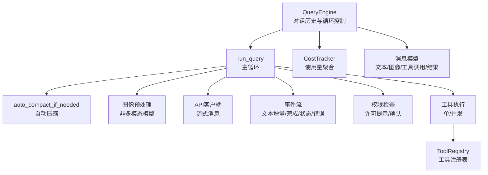
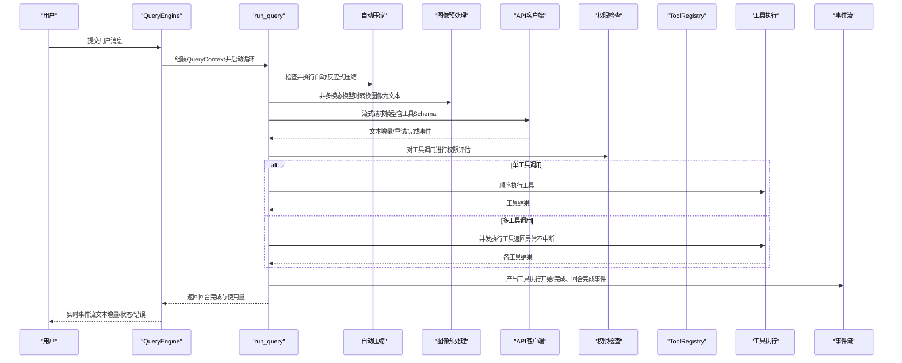
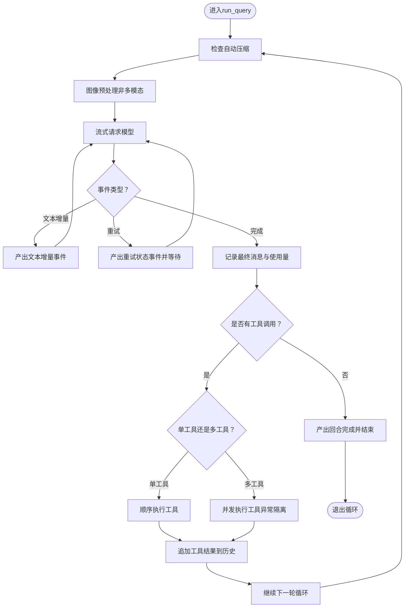
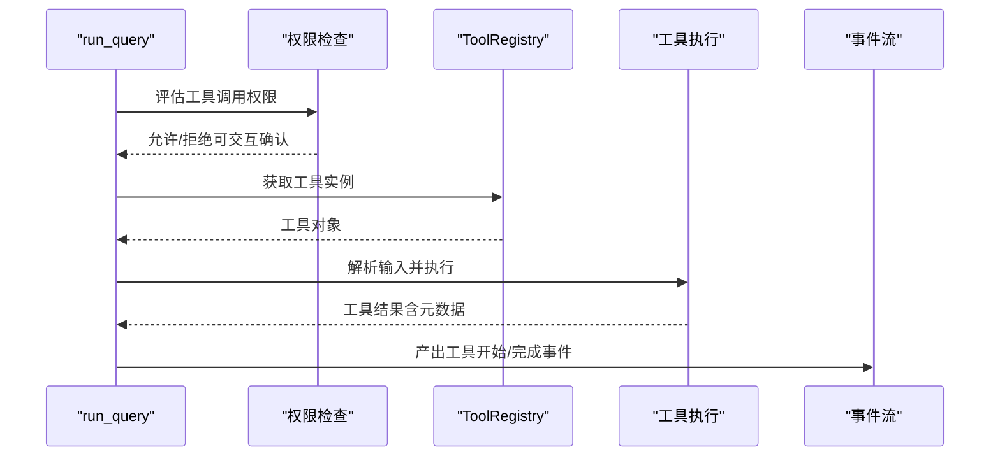
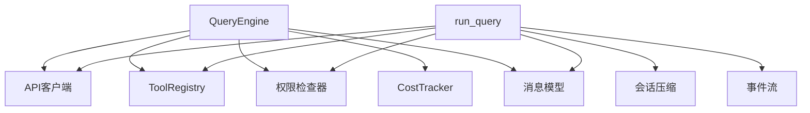

# Agent Loop对话循环

<cite>
**本文档引用的文件**
- [query_engine.py](file://src/openharness/engine/query_engine.py)
- [query.py](file://src/openharness/engine/query.py)
- [stream_events.py](file://src/openharness/engine/stream_events.py)
- [messages.py](file://src/openharness/engine/messages.py)
- [cost_tracker.py](file://src/openharness/engine/cost_tracker.py)
- [client.py](file://src/openharness/api/client.py)
- [base.py](file://src/openharness/tools/base.py)
- [token_estimation.py](file://src/openharness/services/token_estimation.py)
- [compact/__init__.py](file://src/openharness/services/compact/__init__.py)
- [session_storage.py](file://src/openharness/services/session_storage.py)
- [coordinator_drain.py](file://src/openharness/ui/coordinator_drain.py)
</cite>

## 目录
1. [简介](#简介)
2. [项目结构](#项目结构)
3. [核心组件](#核心组件)
4. [架构总览](#架构总览)
5. [详细组件分析](#详细组件分析)
6. [依赖分析](#依赖分析)
7. [性能考虑](#性能考虑)
8. [故障排查指南](#故障排查指南)
9. [结论](#结论)
10. [附录](#附录)

## 简介
本文件系统性阐述OpenHarness中“Agent Loop对话循环”的实现与工作机制，覆盖以下关键主题：
- 查询引擎与对话循环：如何组织多轮对话、工具调用与结果回传
- 流式响应处理与实时反馈：增量文本、状态事件与错误事件
- 工具调用决策与执行：单工具串行与多工具并发执行策略
- 循环继续机制：最大轮次限制、挂起继续与协调器模式下的后台任务收尾
- 指数退避重试策略：网络/速率限制等可恢复错误的自动重试
- 并行工具执行：并发安全与异常隔离
- 令牌计数与成本跟踪：使用量聚合与会话级统计
- 代码示例路径：通过源码路径定位关键实现片段

## 项目结构
Agent Loop对话循环位于引擎层（engine），围绕查询引擎（QueryEngine）与核心循环（run_query）展开，向上通过API客户端进行流式消息交互，向下通过工具注册表（ToolRegistry）调度工具执行，并集成会话压缩（compact）、成本跟踪（CostTracker）与事件流（StreamEvents）。

图表来源
- [query_engine.py:19-215](file://src/openharness/engine/query_engine.py#L19-L215)
- [query.py:632-872](file://src/openharness/engine/query.py#L632-L872)
- [client.py:117-257](file://src/openharness/api/client.py#L117-L257)
- [base.py:60-81](file://src/openharness/tools/base.py#L60-L81)
- [messages.py:64-222](file://src/openharness/engine/messages.py#L64-L222)
- [cost_tracker.py:8-25](file://src/openharness/engine/cost_tracker.py#L8-L25)

章节来源
- [query_engine.py:1-215](file://src/openharness/engine/query_engine.py#L1-L215)
- [query.py:1-1045](file://src/openharness/engine/query.py#L1-L1045)
- [client.py:1-267](file://src/openharness/api/client.py#L1-L267)
- [base.py:1-81](file://src/openharness/tools/base.py#L1-L81)
- [messages.py:1-222](file://src/openharness/engine/messages.py#L1-L222)
- [cost_tracker.py:1-25](file://src/openharness/engine/cost_tracker.py#L1-L25)

## 核心组件
- QueryEngine：持有对话历史、工具感知的模型循环，负责提交用户消息、继续挂起对话、维护工具元数据与成本统计。
- run_query：核心对话循环，包含自动压缩、图像预处理、模型流式请求、工具调用与结果回传、最大轮次控制。
- StreamEvents：统一的事件类型，包括增量文本、回合完成、工具执行开始/结束、状态与错误事件。
- ToolRegistry：工具注册表，提供工具Schema与执行入口。
- API客户端：支持流式消息，内置指数退避重试与事件分发。
- CostTracker：会话级使用量聚合。
- 会话压缩：自动/反应式压缩，减少上下文长度以避免“提示过长”错误。
- 消息模型：统一的对话消息与内容块（文本、图像、工具调用、工具结果）。

章节来源
- [query_engine.py:19-215](file://src/openharness/engine/query_engine.py#L19-L215)
- [query.py:632-872](file://src/openharness/engine/query.py#L632-L872)
- [stream_events.py:12-90](file://src/openharness/engine/stream_events.py#L12-L90)
- [base.py:60-81](file://src/openharness/tools/base.py#L60-L81)
- [client.py:117-257](file://src/openharness/api/client.py#L117-L257)
- [cost_tracker.py:8-25](file://src/openharness/engine/cost_tracker.py#L8-L25)
- [messages.py:64-222](file://src/openharness/engine/messages.py#L64-L222)

## 架构总览
下图展示了从用户输入到工具执行再到最终回合完成的完整流程，以及事件流在各阶段的产出。

图表来源
- [query_engine.py:147-215](file://src/openharness/engine/query_engine.py#L147-L215)
- [query.py:632-872](file://src/openharness/engine/query.py#L632-L872)
- [client.py:160-257](file://src/openharness/api/client.py#L160-L257)
- [base.py:60-81](file://src/openharness/tools/base.py#L60-L81)

## 详细组件分析

### 查询引擎（QueryEngine）
- 职责：维护对话历史、系统提示、模型与工具元数据；封装提交消息与继续挂起对话的接口；聚合成本统计。
- 关键能力：
  - 提交消息：标准化消息、触发钩子、构建上下文并调用run_query。
  - 继续挂起：在不新增用户消息的情况下继续对话循环。
  - 历史管理：清理、加载、判断挂起状态（等待工具结果的用户消息）。
  - 成本统计：累计每轮使用量。
- 与外部协作：API客户端、工具注册表、权限检查器、钩子执行器、会话存储。

章节来源
- [query_engine.py:19-215](file://src/openharness/engine/query_engine.py#L19-L215)

### 核心循环（run_query）
- 自动压缩：在每轮开始前检查是否需要自动压缩，必要时先尝试廉价微压缩，再进行LLM主导的摘要压缩。
- 图像预处理：当模型不支持多模态时，将图像块转换为文本描述，支持并行处理。
- 模型流式请求：通过API客户端发起流式消息请求，产出文本增量事件与最终完成事件。
- 错误处理与重试：
  - 可恢复错误：指数退避重试（带抖动），输出重试状态事件。
  - 上下文过长：解析“提示过长”类错误，触发反应式压缩后重试。
  - 最大输出令牌限制：解析提供商返回的最大输出令牌限制，动态下调并重试。
- 工具调用决策与执行：
  - 单工具：顺序执行，立即产出工具开始/完成事件。
  - 多工具：并发执行，使用return_exceptions=True确保单个失败不影响其他工具，完成后统一产出事件。
- 回合完成：将最终助手消息加入历史，产出回合完成事件与使用量。
- 最大轮次：超过限制抛出MaxTurnsExceeded异常。

图表来源
- [query.py:632-872](file://src/openharness/engine/query.py#L632-L872)

章节来源
- [query.py:632-872](file://src/openharness/engine/query.py#L632-L872)

### 流式API响应处理与实时反馈
- 事件类型：
  - 文本增量：ApiTextDeltaEvent → AssistantTextDelta
  - 请求重试：ApiRetryEvent → 状态事件（含延迟与尝试次数）
  - 完成事件：ApiMessageCompleteEvent → AssistantTurnComplete（携带完整消息与使用量）
- 重试策略：指数退避（基础延迟、最大延迟、抖动），支持HTTP状态码白名单与网络/超时错误。
- 实时反馈：事件流在文本增量、重试、压缩进度、错误与状态之间穿插，前端可即时渲染。

章节来源
- [client.py:50-192](file://src/openharness/api/client.py#L50-L192)
- [stream_events.py:12-90](file://src/openharness/engine/stream_events.py#L12-L90)

### 工具调用决策与执行
- 决策分离：模型决定是否调用工具（ToolUseBlock），引擎负责权限评估与执行。
- 权限检查：基于工具名称、只读属性、文件路径或命令进行评估；必要时弹出许可提示并等待用户确认。
- 执行策略：
  - 单工具：顺序执行，立即产出工具开始/完成事件。
  - 多工具：并发执行，使用return_exceptions=True，保证所有工具均产生完成事件。
- 输出处理：超长输出落地为文件并生成内联预览，同时记录工作日志与已验证工作清单。

图表来源
- [query.py:875-1005](file://src/openharness/engine/query.py#L875-L1005)
- [base.py:35-50](file://src/openharness/tools/base.py#L35-L50)

章节来源
- [query.py:817-872](file://src/openharness/engine/query.py#L817-L872)
- [query.py:875-1005](file://src/openharness/engine/query.py#L875-L1005)
- [base.py:35-50](file://src/openharness/tools/base.py#L35-L50)

### 循环继续机制与挂起状态
- has_pending_continuation：检测历史末尾是否存在等待后续模型回合的工具结果用户消息。
- continue_pending：在不新增用户消息的前提下继续对话循环，常用于被中断后的恢复。
- 最大轮次：可通过配置限制每条用户消息的最大对话轮次，防止无限循环。

章节来源
- [query_engine.py:132-215](file://src/openharness/engine/query_engine.py#L132-L215)

### 会话压缩与上下文窗口管理
- 自动压缩：根据估计的令牌数量与阈值触发，优先微压缩（清理旧工具结果），不足则进行LLM摘要压缩。
- 反应式压缩：当遇到“提示过长”类错误时，强制压缩并重试。
- 进度事件：压缩过程通过结构化进度事件向事件流汇报阶段与检查点。

章节来源
- [query.py:644-721](file://src/openharness/engine/query.py#L644-L721)
- [compact/__init__.py:1071-1627](file://src/openharness/services/compact/__init__.py#L1071-L1627)

### 令牌计数与成本跟踪
- 令牌估算：基于字符启发式估算（粗略但高效），用于自动压缩阈值与上下文窗口判断。
- 使用量聚合：每轮完成后累加到CostTracker，QueryEngine对外暴露total_usage。
- 会话持久化：保存使用量与消息历史，便于审计与复盘。

章节来源
- [token_estimation.py:6-16](file://src/openharness/services/token_estimation.py#L6-L16)
- [cost_tracker.py:8-25](file://src/openharness/engine/cost_tracker.py#L8-L25)
- [session_storage.py:63-108](file://src/openharness/services/session_storage.py#L63-L108)

### 协调器模式下的后台任务收尾
- 在协调器模式下，后台异步代理任务完成后需以“任务通知”消息形式插入到会话中，作为协调器回合之间的契约。
- drain_coordinator_async_agents：轮询任务状态，格式化通知并作为跟随消息提交，确保消息顺序符合系统提示约定。

章节来源
- [coordinator_drain.py:128-198](file://src/openharness/ui/coordinator_drain.py#L128-L198)

## 依赖分析
- QueryEngine依赖：API客户端（流式消息）、工具注册表（工具Schema与执行）、权限检查器（许可评估）、钩子执行器（事件钩子）、成本追踪器（使用量聚合）。
- run_query依赖：会话压缩服务（自动/反应式压缩）、图像预处理（非多模态模型）、API客户端（流式事件）、工具执行（权限检查、并发执行）。
- 事件系统：统一的事件类型定义，贯穿流式文本、状态、错误与压缩进度。
- 数据模型：消息与内容块的序列化/反序列化，确保与上游API兼容。

图表来源
- [query_engine.py:19-215](file://src/openharness/engine/query_engine.py#L19-L215)
- [query.py:632-872](file://src/openharness/engine/query.py#L632-L872)
- [stream_events.py:12-90](file://src/openharness/engine/stream_events.py#L12-L90)
- [messages.py:64-222](file://src/openharness/engine/messages.py#L64-L222)

章节来源
- [query_engine.py:19-215](file://src/openharness/engine/query_engine.py#L19-L215)
- [query.py:632-872](file://src/openharness/engine/query.py#L632-L872)
- [stream_events.py:12-90](file://src/openharness/engine/stream_events.py#L12-L90)
- [messages.py:64-222](file://src/openharness/engine/messages.py#L64-L222)

## 性能考虑
- 令牌估算与上下文窗口：通过字符启发式估算消息令牌数，结合模型上下文窗口与阈值控制，避免频繁“提示过长”错误。
- 自动压缩：在每轮开始前进行微压缩与LLM摘要压缩，显著降低上下文长度，提升稳定性与吞吐。
- 并发工具执行：多工具并发执行并隔离异常，提高整体吞吐，同时保证会话一致性（每个工具调用都有匹配的结果块）。
- 指数退避重试：对网络/速率限制等可恢复错误采用指数退避与抖动，平衡重试频率与用户体验。
- 输出溢出处理：超长工具输出落盘并生成内联预览，避免消息体过大影响性能与稳定性。

## 故障排查指南
- “提示过长”错误：系统会识别此类错误并触发反应式压缩，若仍失败，检查上下文窗口设置与自动压缩阈值。
- 最大输出令牌限制：当请求的max_tokens超过模型支持上限时，系统会解析并下调max_tokens后重试。
- 网络/连接错误：输出网络错误事件，建议检查网络连通性与代理设置。
- 工具执行失败：并发场景下单个工具失败不会阻断其他工具，但会在事件中体现错误标记，可在会话快照中查看。
- 权限拒绝：若工具需要确认，确保许可提示回调可用；否则工具会被拒绝执行。

章节来源
- [query.py:751-780](file://src/openharness/engine/query.py#L751-L780)
- [query.py:766-776](file://src/openharness/engine/query.py#L766-L776)
- [client.py:86-115](file://src/openharness/api/client.py#L86-L115)

## 结论
Agent Loop对话循环通过“模型决策 + 工具执行”的解耦设计，结合流式事件、自动压缩、并发工具执行与指数退避重试，实现了稳定、可观测且高效的智能体对话体验。其模块化架构便于扩展新工具、优化令牌估算策略与增强会话压缩算法，适合在复杂工程场景中持续演进。

## 附录
- 代码示例路径（不含具体代码内容）：
  - 查询引擎初始化与提交消息：[query_engine.py:22-191](file://src/openharness/engine/query_engine.py#L22-L191)
  - 核心循环与工具执行：[query.py:632-872](file://src/openharness/engine/query.py#L632-L872)
  - 流式事件定义：[stream_events.py:12-90](file://src/openharness/engine/stream_events.py#L12-L90)
  - API客户端重试与事件：[client.py:160-257](file://src/openharness/api/client.py#L160-L257)
  - 工具注册表与执行上下文：[base.py:17-81](file://src/openharness/tools/base.py#L17-L81)
  - 令牌估算与成本跟踪：[token_estimation.py:6-16](file://src/openharness/services/token_estimation.py#L6-L16)、[cost_tracker.py:8-25](file://src/openharness/engine/cost_tracker.py#L8-L25)
  - 会话压缩与阈值控制：[compact/__init__.py:1071-1627](file://src/openharness/services/compact/__init__.py#L1071-L1627)
  - 协调器模式任务收尾：[coordinator_drain.py:128-198](file://src/openharness/ui/coordinator_drain.py#L128-L198)