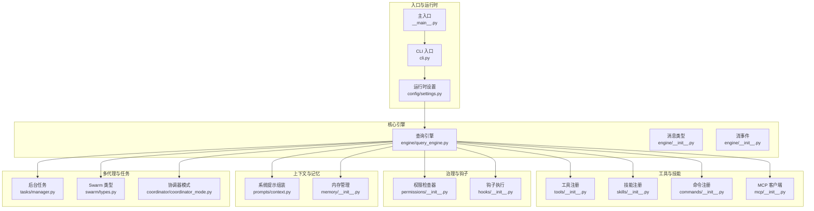
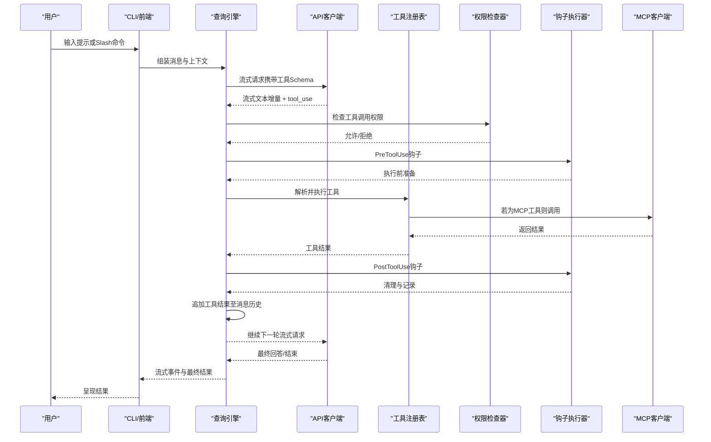
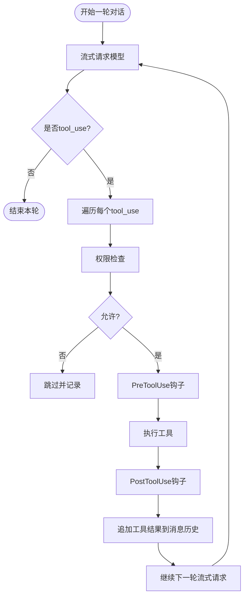
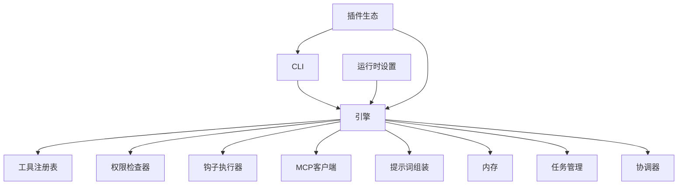

# OpenHarness核心架构

<cite>
**本文档引用的文件**
- [README.md](file://README.md)
- [__main__.py](file://src/openharness/__main__.py)
- [cli.py](file://src/openharness/cli.py)
- [engine/__init__.py](file://src/openharness/engine/__init__.py)
- [engine/query_engine.py](file://src/openharness/engine/query_engine.py)
- [tools/__init__.py](file://src/openharness/tools/__init__.py)
- [skills/__init__.py](file://src/openharness/skills/__init__.py)
- [plugins/__init__.py](file://src/openharness/plugins/__init__.py)
- [permissions/__init__.py](file://src/openharness/permissions/__init__.py)
- [hooks/__init__.py](file://src/openharness/hooks/__init__.py)
- [commands/__init__.py](file://src/openharness/commands/__init__.py)
- [mcp/__init__.py](file://src/openharness/mcp/__init__.py)
- [memory/__init__.py](file://src/openharness/memory/__init__.py)
- [tasks/manager.py](file://src/openharness/tasks/manager.py)
- [coordinator/coordinator_mode.py](file://src/openharness/coordinator/coordinator_mode.py)
- [swarm/types.py](file://src/openharness/swarm/types.py)
- [prompts/context.py](file://src/openharness/prompts/context.py)
- [config/settings.py](file://src/openharness/config/settings.py)
</cite>

## 目录
1. [引言](#引言)
2. [项目结构](#项目结构)
3. [核心组件](#核心组件)
4. [架构总览](#架构总览)
5. [详细组件分析](#详细组件分析)
6. [依赖分析](#依赖分析)
7. [性能考虑](#性能考虑)
8. [故障排查指南](#故障排查指南)
9. [结论](#结论)

## 引言
OpenHarness是一个开源的AI代理基础设施，旨在为大型语言模型提供“手、眼、记忆与安全边界”。它通过对话循环、工具调用、权限控制与多代理协调，构建完整的Agent Harness能力。其价值主张在于：
- 将LLM从“智能”扩展为“可行动”的代理：通过工具、知识、观察与动作的闭环
- 提供可组合、可观测、可治理的Agent运行时
- 支持CLI、React TUI与ohmo个人助理等多入口形态

在本架构中，“Agent Loop（代理循环）”是核心：模型决定“做什么”，Harness负责“如何做”，包括安全、效率与可观测性。

章节来源
- [README.md:446-488](file://README.md#L446-L488)

## 项目结构
OpenHarness采用按功能域划分的模块化组织方式，核心子系统如下：
- 引擎（engine）：对话循环、消息编排、流式事件与成本追踪
- 工具（tools）：43+内置工具（文件、Shell、搜索、Web、MCP、任务、模式切换等）
- 技能（skills）：按需加载的Markdown知识库
- 插件（plugins）：命令、钩子、代理与MCP服务器的生态扩展
- 权限（permissions）：多级权限模式、路径规则与命令限制
- 钩子（hooks）：PreToolUse/PostToolUse生命周期事件
- 命令（commands）：Slash命令注册与解析
- MCP协议（mcp）：Model Context Protocol客户端与配置
- 内存（memory）：跨会话持久化与检索
- 任务（tasks）：后台任务生命周期管理
- 协调器（coordinator）：多代理协作、团队与通知格式
- 提示词（prompts）：系统提示组装、CLAUDE.md注入与上下文压缩
- 配置（config）：多层配置合并与提供者工作流
- UI（ui）：React TUI与后端协议

图示来源
- [README.md:446-466](file://README.md#L446-L466)
- [cli.py:749-777](file://src/openharness/cli.py#L749-L777)
- [engine/query_engine.py:19-215](file://src/openharness/engine/query_engine.py#L19-L215)
- [tools/__init__.py:47-96](file://src/openharness/tools/__init__.py#L47-L96)
- [skills/__init__.py:21-44](file://src/openharness/skills/__init__.py#L21-L44)
- [mcp/__init__.py:35-79](file://src/openharness/mcp/__init__.py#L35-L79)
- [permissions/__init__.py:14-26](file://src/openharness/permissions/__init__.py#L14-L26)
- [hooks/__init__.py:24-50](file://src/openharness/hooks/__init__.py#L24-L50)
- [prompts/context.py:77-167](file://src/openharness/prompts/context.py#L77-L167)
- [memory/__init__.py:3-18](file://src/openharness/memory/__init__.py#L3-L18)
- [tasks/manager.py:49-474](file://src/openharness/tasks/manager.py#L49-L474)
- [swarm/types.py:12-399](file://src/openharness/swarm/types.py#L12-L399)
- [coordinator/coordinator_mode.py:17-521](file://src/openharness/coordinator/coordinator_mode.py#L17-L521)

章节来源
- [README.md:446-466](file://README.md#L446-L466)
- [cli.py:749-777](file://src/openharness/cli.py#L749-L777)

## 核心组件
本节对10个子系统进行要点梳理与职责说明：

- 引擎（engine）
  - 职责：维护对话历史、驱动模型请求、处理tool_use循环、流式事件分发、成本统计
  - 关键点：支持最大轮次限制、上下文压缩阈值、权限提示与用户确认提示
  - 参考：[engine/query_engine.py:19-215](file://src/openharness/engine/query_engine.py#L19-L215)

- 工具（tools）
  - 职责：统一的工具注册表，内置43+工具，支持MCP动态注入
  - 关键点：每个工具具备输入校验、JSON Schema描述、权限集成与钩子支持
  - 参考：[tools/__init__.py:47-96](file://src/openharness/tools/__init__.py#L47-L96)

- 技能（skills）
  - 职责：按需加载Markdown技能，支持用户/项目/插件多源发现
  - 关键点：禁用模型直接调用的技能仍可作为Slash命令使用
  - 参考：[skills/__init__.py:21-44](file://src/openharness/skills/__init__.py#L21-L44)

- 插件（plugins）
  - 职责：命令、钩子、代理与MCP服务器的生态扩展
  - 关键点：兼容anthropics/skills与claude-code/plugins
  - 参考：[plugins/__init__.py:23-53](file://src/openharness/plugins/__init__.py#L23-L53)

- 权限（permissions）
  - 职责：多级权限模式、路径规则、命令黑名单
  - 关键点：支持默认/自动/计划模式；路径规则与命令拒绝列表
  - 参考：[permissions/__init__.py:14-26](file://src/openharness/permissions/__init__.py#L14-L26)

- 钩子（hooks）
  - 职责：PreToolUse/PostToolUse生命周期事件，支持聚合结果
  - 参考：[hooks/__init__.py:24-50](file://src/openharness/hooks/__init__.py#L24-L50)

- 命令（commands）
  - 职责：Slash命令注册与查找，支持远程可触发与管理员选项
  - 参考：[commands/__init__.py:3-21](file://src/openharness/commands/__init__.py#L3-L21)

- MCP协议（mcp）
  - 职责：MCP客户端管理、HTTP/WS/STDIO传输、工具与资源发现
  - 参考：[mcp/__init__.py:35-79](file://src/openharness/mcp/__init__.py#L35-L79)

- 内存（memory）
  - 职责：跨会话持久化、检索相关记忆、扫描与路径管理
  - 参考：[memory/__init__.py:3-18](file://src/openharness/memory/__init__.py#L3-L18)

- 任务（tasks）
  - 职责：后台任务生命周期（创建、停止、输出读取、完成监听）、进程管理
  - 参考：[tasks/manager.py:49-474](file://src/openharness/tasks/manager.py#L49-L474)

- 协调器（coordinator）
  - 职责：多代理协作、团队注册、XML通知格式、worker工具集
  - 参考：[coordinator/coordinator_mode.py:17-521](file://src/openharness/coordinator/coordinator_mode.py#L17-L521)

- 提示词（prompts）
  - 职责：系统提示组装、CLAUDE.md注入、项目上下文与记忆注入
  - 参考：[prompts/context.py:77-167](file://src/openharness/prompts/context.py#L77-L167)

- 配置（config）
  - 职责：多层配置合并（CLI > 环境变量 > 配置文件 > 默认），提供者工作流与认证解析
  - 参考：[config/settings.py:496-800](file://src/openharness/config/settings.py#L496-L800)

章节来源
- [engine/query_engine.py:19-215](file://src/openharness/engine/query_engine.py#L19-L215)
- [tools/__init__.py:47-96](file://src/openharness/tools/__init__.py#L47-L96)
- [skills/__init__.py:21-44](file://src/openharness/skills/__init__.py#L21-L44)
- [plugins/__init__.py:23-53](file://src/openharness/plugins/__init__.py#L23-L53)
- [permissions/__init__.py:14-26](file://src/openharness/permissions/__init__.py#L14-L26)
- [hooks/__init__.py:24-50](file://src/openharness/hooks/__init__.py#L24-L50)
- [commands/__init__.py:3-21](file://src/openharness/commands/__init__.py#L3-L21)
- [mcp/__init__.py:35-79](file://src/openharness/mcp/__init__.py#L35-L79)
- [memory/__init__.py:3-18](file://src/openharness/memory/__init__.py#L3-L18)
- [tasks/manager.py:49-474](file://src/openharness/tasks/manager.py#L49-L474)
- [coordinator/coordinator_mode.py:17-521](file://src/openharness/coordinator/coordinator_mode.py#L17-L521)
- [prompts/context.py:77-167](file://src/openharness/prompts/context.py#L77-L167)
- [config/settings.py:496-800](file://src/openharness/config/settings.py#L496-L800)

## 架构总览
下图展示了从用户输入到模型响应、工具执行与结果回流的完整Agent Loop流程，并体现权限与钩子的贯穿。

图示来源
- [README.md:468-487](file://README.md#L468-L487)
- [engine/query_engine.py:147-215](file://src/openharness/engine/query_engine.py#L147-L215)
- [tools/__init__.py:47-96](file://src/openharness/tools/__init__.py#L47-L96)
- [permissions/__init__.py:14-26](file://src/openharness/permissions/__init__.py#L14-L26)
- [hooks/__init__.py:24-50](file://src/openharness/hooks/__init__.py#L24-L50)
- [mcp/__init__.py:35-79](file://src/openharness/mcp/__init__.py#L35-L79)

章节来源
- [README.md:468-487](file://README.md#L468-L487)
- [engine/query_engine.py:147-215](file://src/openharness/engine/query_engine.py#L147-L215)

## 详细组件分析

### 引擎（QueryEngine）与Agent Loop
- Agent Loop工作原理
  - 模型以流式方式生成文本，当stop_reason为tool_use时，进入工具调用循环
  - 对每个tool_use：权限检查 → 钩子PreToolUse → 执行工具 → 钩子PostToolUse → 结果回流
  - 将工具结果追加到消息历史，继续下一轮流式请求，直至模型结束
- 关键特性
  - 最大轮次限制：防止无限循环
  - 上下文压缩阈值：避免超出上下文窗口
  - 成本追踪：累计token用量与费用
  - 协调器上下文注入：在多代理场景中注入worker工具可用性信息
- 并行与重试
  - 代码未显式实现并行工具执行与指数退避重试；如需该能力，可在工具层或外部调度器实现

图示来源
- [README.md:468-487](file://README.md#L468-L487)
- [engine/query_engine.py:147-215](file://src/openharness/engine/query_engine.py#L147-L215)

章节来源
- [engine/query_engine.py:19-215](file://src/openharness/engine/query_engine.py#L19-L215)
- [README.md:468-487](file://README.md#L468-L487)

### 工具系统（Tool Registry）
- 默认注册包含：文件操作、Shell、搜索、Web、MCP、任务、模式切换、计划/工作树、定时任务、远程触发、代理与消息发送等
- 动态MCP工具注入：当存在MCP服务器时，自动注册MCP工具与资源读取工具
- 设计要点：每个工具具备输入验证、自描述Schema、权限集成与钩子支持

章节来源
- [tools/__init__.py:47-96](file://src/openharness/tools/__init__.py#L47-L96)

### 技能系统（Skill Registry）
- 按需加载：仅在模型需要时加载，支持用户/项目/插件/ohmo多位置
- 用户可直接通过Slash命令调用可交互技能
- 兼容anthropics/skills目录布局

章节来源
- [skills/__init__.py:21-44](file://src/openharness/skills/__init__.py#L21-L44)
- [README.md:527-569](file://README.md#L527-L569)

### 插件生态（Plugins）
- 支持命令、钩子、代理与MCP服务器扩展
- 兼容claude-code/plugins与anthropics/skills

章节来源
- [plugins/__init__.py:23-53](file://src/openharness/plugins/__init__.py#L23-L53)
- [README.md:570-589](file://README.md#L570-L589)

### 权限控制（Permission Checker）
- 多级模式：默认（写入/执行前询问）、自动（沙箱环境允许一切）、计划模式（阻止所有写入）
- 路径规则与命令黑名单：细粒度控制
- 与工具/钩子/命令协同，在执行前拦截不合规行为

章节来源
- [permissions/__init__.py:14-26](file://src/openharness/permissions/__init__.py#L14-L26)
- [README.md:600-619](file://README.md#L600-L619)

### 钩子系统（Hook Executor）
- 生命周期事件：PreToolUse/PostToolUse
- 聚合结果：便于审计与可观测性

章节来源
- [hooks/__init__.py:24-50](file://src/openharness/hooks/__init__.py#L24-L50)

### 命令系统（Slash Commands）
- 注册与查找：支持远程可触发与管理员选项
- 与Dry-run预览结合：可识别只读/状态变更类命令

章节来源
- [commands/__init__.py:3-21](file://src/openharness/commands/__init__.py#L3-L21)
- [cli.py:124-201](file://src/openharness/cli.py#L124-L201)

### MCP协议（Model Context Protocol）
- 支持HTTP/WS/STDIO传输
- 自动重连与工具Schema推断
- 工具与资源读取的统一适配

章节来源
- [mcp/__init__.py:35-79](file://src/openharness/mcp/__init__.py#L35-L79)

### 内存系统（Memory）
- 跨会话持久化：MEMORY.md注入与检索
- 相关记忆：基于最新用户提示的相关记忆注入
- 路径与扫描：统一的内存入口与文件扫描

章节来源
- [memory/__init__.py:3-18](file://src/openharness/memory/__init__.py#L3-L18)
- [prompts/context.py:137-167](file://src/openharness/prompts/context.py#L137-L167)

### 任务管理（Background Task Manager）
- 后台任务生命周期：创建、停止、输出读取、完成监听
- 进程管理：stdin/stdout读写、重启与清理
- 任务类型：本地Shell、本地Agent、远程Agent、进程内同伴

章节来源
- [tasks/manager.py:49-474](file://src/openharness/tasks/manager.py#L49-L474)

### 协调器与多代理（Coordinator & Swarm）
- 协调器模式：定义worker工具集、系统提示、XML通知格式
- Swarm：Pane后端抽象（tmux/iTerm2）、同伴spawn与消息传递
- 团队注册：团队创建、成员管理、消息广播

章节来源
- [coordinator/coordinator_mode.py:17-521](file://src/openharness/coordinator/coordinator_mode.py#L17-L521)
- [swarm/types.py:12-399](file://src/openharness/swarm/types.py#L12-L399)

### 提示词与上下文（Prompts & Context）
- 系统提示组装：项目指令、技能列表、委托与子代理、CLAUDE.md、本地规则、项目上下文、记忆
- Fast模式与推理设置：Effort/Passes影响深度与迭代次数

章节来源
- [prompts/context.py:77-167](file://src/openharness/prompts/context.py#L77-L167)

### 配置与提供者（Settings & Providers）
- 多层配置合并：CLI > 环境变量 > 配置文件 > 默认
- 提供者工作流：Anthropic/OpenAI/Copilot/Codex/Moonshot等
- 认证解析：订阅桥接、OAuth设备流、密钥存储与作用域绑定

章节来源
- [config/settings.py:496-800](file://src/openharness/config/settings.py#L496-L800)

## 依赖分析
- 子系统耦合关系
  - 引擎依赖：工具注册表、权限检查器、钩子执行器、MCP客户端、提示词组装、内存、任务、协调器
  - 工具依赖：权限与钩子（在执行前/后）
  - 插件扩展：命令、钩子、代理、MCP服务器
  - 配置驱动：提供者选择、认证解析、上下文窗口与成本阈值
- 外部依赖与集成
  - API客户端：Anthropic/OpenAI/Copilot等兼容接口
  - MCP服务器：HTTP/WS/STDIO传输
  - UI：React TUI与后端协议

图示来源
- [engine/query_engine.py:19-215](file://src/openharness/engine/query_engine.py#L19-L215)
- [cli.py:749-777](file://src/openharness/cli.py#L749-L777)
- [config/settings.py:496-800](file://src/openharness/config/settings.py#L496-L800)

章节来源
- [engine/query_engine.py:19-215](file://src/openharness/engine/query_engine.py#L19-L215)
- [cli.py:749-777](file://src/openharness/cli.py#L749-L777)
- [config/settings.py:496-800](file://src/openharness/config/settings.py#L496-L800)

## 性能考虑
- 上下文压缩与自动压缩阈值：避免超长历史导致的延迟与成本上升
- 最大轮次限制：防止长时间流式循环
- 工具执行成本追踪：便于预算控制与优化
- 并行工具执行与指数退避重试：当前未在核心引擎实现，可在工具层或外部调度器补充

## 故障排查指南
- Dry-run预览
  - 无模型/工具/子代理/外部MCP连接的实际调用
  - 输出ready/warning/blocked三态与下一步建议
  - 可预览技能、工具、命令匹配与MCP配置问题
- 常见问题定位
  - 认证缺失：auth状态显示missing，需先登录或配置凭据
  - MCP配置错误：列出无效URL/命令不存在等问题
  - 未知Slash命令：入口点标记为unknown_slash_command
- 读取与修复建议
  - 使用next actions中的具体步骤快速修复
  - 对于blocked状态，优先修正认证或MCP配置
  - 对于warning状态，评估Live执行风险并决定是否继续

章节来源
- [cli.py:333-394](file://src/openharness/cli.py#L333-L394)
- [cli.py:396-595](file://src/openharness/cli.py#L396-L595)
- [cli.py:598-740](file://src/openharness/cli.py#L598-L740)

## 结论
OpenHarness通过10个子系统的协同，构建了从“对话循环”到“多代理协作”的完整Agent基础设施。其核心价值在于：
- 明确的Agent Loop与可观测性（流式事件、成本追踪）
- 可扩展的工具与技能体系
- 分层治理（权限、钩子、命令）
- 生态化的插件与MCP协议
- 跨会话记忆与上下文压缩
- 多代理协作与任务生命周期管理

对于需要在生产环境中稳定运行的团队，建议在现有基础上补充并行工具执行与指数退避重试机制，并结合Dry-run预览与成本追踪策略，持续优化Agent的可靠性与性价比。