# 技术实现细节

<cite>
**本文引用的文件**
- [cost_tracker.py](file://src/openharness/engine/cost_tracker.py)
- [messages.py](file://src/openharness/engine/messages.py)
- [query_engine.py](file://src/openharness/engine/query_engine.py)
- [query.py](file://src/openharness/engine/query.py)
- [stream_events.py](file://src/openharness/engine/stream_events.py)
- [usage.py](file://src/openharness/api/usage.py)
- [client.py](file://src/openharness/api/client.py)
- [store.py](file://src/openharness/state/store.py)
- [manager.py](file://src/openharness/memory/manager.py)
- [fs.py](file://src/openharness/utils/fs.py)
- [network_guard.py](file://src/openharness/utils/network_guard.py)
- [base.py](file://src/openharness/tools/base.py)
- [tool_outputs.py](file://src/openharness/services/tool_outputs.py)
- [checker.py](file://src/openharness/permissions/checker.py)
- [executor.py](file://src/openharness/hooks/executor.py)
</cite>

## 目录
1. [简介](#简介)
2. [项目结构](#项目结构)
3. [核心组件](#核心组件)
4. [架构总览](#架构总览)
5. [详细组件分析](#详细组件分析)
6. [依赖分析](#依赖分析)
7. [性能考虑](#性能考虑)
8. [故障排查指南](#故障排查指南)
9. [结论](#结论)
10. [附录](#附录)

## 简介
本文件聚焦于OpenHarness的技术实现细节，围绕消息系统设计、成本跟踪机制、工具执行上下文、状态管理、文件系统操作与网络通信等核心技术模块进行深入解析。文档通过类图、时序图与流程图展示组件交互与数据流，并提供错误处理策略、性能优化建议与安全防护机制的最佳实践。

## 项目结构
OpenHarness采用分层与功能域结合的组织方式：
- 引擎层：消息建模、对话循环、事件流与成本跟踪
- 工具层：工具抽象、注册表与执行上下文
- 权限与钩子：权限检查器与生命周期钩子执行器
- 平台与基础设施：原子文件写入、网络访问守卫、内存管理
- API适配：统一的流式消息客户端与使用量统计

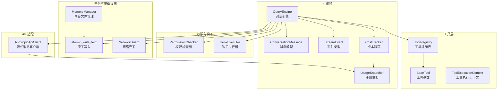

**图表来源**
- [query_engine.py:19-215](file://src/openharness/engine/query_engine.py#L19-L215)
- [messages.py:64-222](file://src/openharness/engine/messages.py#L64-L222)
- [stream_events.py:12-90](file://src/openharness/engine/stream_events.py#L12-L90)
- [cost_tracker.py:8-25](file://src/openharness/engine/cost_tracker.py#L8-L25)
- [usage.py:8-18](file://src/openharness/api/usage.py#L8-L18)
- [base.py:17-81](file://src/openharness/tools/base.py#L17-L81)
- [checker.py:57-201](file://src/openharness/permissions/checker.py#L57-L201)
- [executor.py:41-243](file://src/openharness/hooks/executor.py#L41-L243)
- [fs.py:39-99](file://src/openharness/utils/fs.py#L39-L99)
- [network_guard.py:24-128](file://src/openharness/utils/network_guard.py#L24-L128)
- [manager.py:17-59](file://src/openharness/memory/manager.py#L17-L59)
- [client.py:117-267](file://src/openharness/api/client.py#L117-L267)

**章节来源**
- [query_engine.py:19-215](file://src/openharness/engine/query_engine.py#L19-L215)
- [messages.py:64-222](file://src/openharness/engine/messages.py#L64-L222)
- [stream_events.py:12-90](file://src/openharness/engine/stream_events.py#L12-L90)
- [cost_tracker.py:8-25](file://src/openharness/engine/cost_tracker.py#L8-L25)
- [usage.py:8-18](file://src/openharness/api/usage.py#L8-L18)
- [base.py:17-81](file://src/openharness/tools/base.py#L17-L81)
- [checker.py:57-201](file://src/openharness/permissions/checker.py#L57-L201)
- [executor.py:41-243](file://src/openharness/hooks/executor.py#L41-L243)
- [fs.py:39-99](file://src/openharness/utils/fs.py#L39-L99)
- [network_guard.py:24-128](file://src/openharness/utils/network_guard.py#L24-L128)
- [manager.py:17-59](file://src/openharness/memory/manager.py#L17-L59)
- [client.py:117-267](file://src/openharness/api/client.py#L117-L267)

## 核心组件
- 消息系统：以ConversationMessage为核心，支持文本、图片、工具调用与工具结果四种内容块；提供序列化、反序列化与会话净化逻辑，确保与多提供商兼容。
- 成本跟踪：基于UsageSnapshot聚合输入/输出token，QueryEngine在每次turn后累加到CostTracker。
- 工具执行上下文：ToolExecutionContext封装cwd与元数据，BaseTool定义统一接口与API Schema导出。
- 状态管理：AppStateStore提供轻量级可观察状态存储，支持订阅与更新。
- 文件系统：原子写入（atomic_write_text）保障崩溃安全；内存文件管理器提供索引与并发锁。
- 网络通信：AnthropicApiClient封装重试与流式事件；NetworkGuard对HTTP目标进行白名单校验与逐跳验证。
- 权限控制：PermissionChecker基于模式、路径规则与命令模式进行决策，内置敏感路径黑名单。
- 钩子系统：HookExecutor按事件匹配执行命令、HTTP或提示型钩子，支持阻断与超时控制。

**章节来源**
- [messages.py:14-222](file://src/openharness/engine/messages.py#L14-L222)
- [cost_tracker.py:8-25](file://src/openharness/engine/cost_tracker.py#L8-L25)
- [query_engine.py:19-215](file://src/openharness/engine/query_engine.py#L19-L215)
- [base.py:17-81](file://src/openharness/tools/base.py#L17-L81)
- [store.py:14-41](file://src/openharness/state/store.py#L14-L41)
- [fs.py:39-99](file://src/openharness/utils/fs.py#L39-L99)
- [manager.py:17-59](file://src/openharness/memory/manager.py#L17-L59)
- [client.py:117-267](file://src/openharness/api/client.py#L117-L267)
- [network_guard.py:24-128](file://src/openharness/utils/network_guard.py#L24-L128)
- [checker.py:57-201](file://src/openharness/permissions/checker.py#L57-L201)
- [executor.py:41-243](file://src/openharness/hooks/executor.py#L41-L243)

## 架构总览
下图展示了从用户输入到工具执行与回传的完整链路，以及成本跟踪与事件流的贯穿。

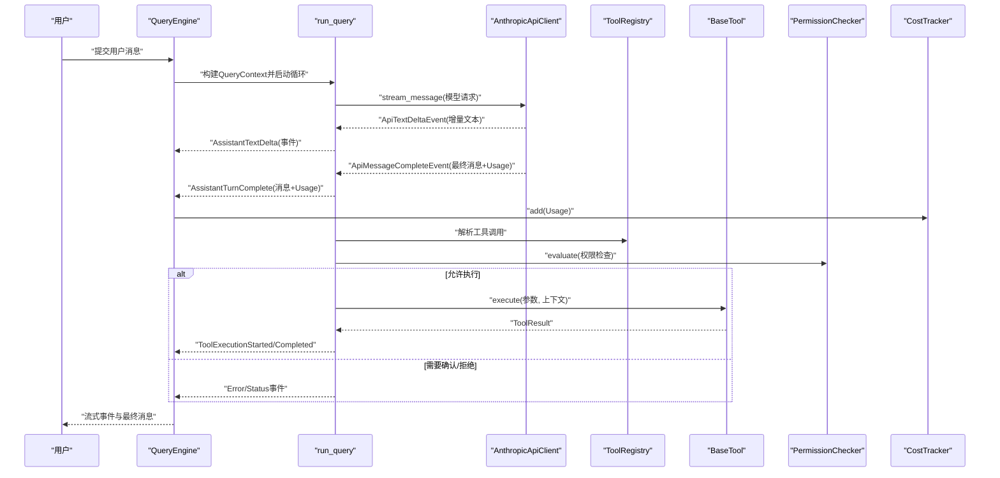

**图表来源**
- [query_engine.py:147-215](file://src/openharness/engine/query_engine.py#L147-L215)
- [query.py:632-800](file://src/openharness/engine/query.py#L632-L800)
- [client.py:160-257](file://src/openharness/api/client.py#L160-L257)
- [base.py:35-58](file://src/openharness/tools/base.py#L35-L58)
- [checker.py:75-156](file://src/openharness/permissions/checker.py#L75-L156)
- [cost_tracker.py:14-24](file://src/openharness/engine/cost_tracker.py#L14-L24)

## 详细组件分析

### 消息系统与会话净化
- 数据模型
  - TextBlock：纯文本内容
  - ImageBlock：内联图片，支持从本地路径加载并base64编码
  - ToolUseBlock：模型请求执行的工具调用
  - ToolResultBlock：工具返回给模型的结果
  - ConversationMessage：用户/助手消息，支持从文本或内容块构造、内容归一化、工具调用提取与API参数序列化
- 会话净化
  - 去除空助手消息
  - 处理“仅工具use无对应tool_result”的尾部不一致问题
  - 保证后续会话在多提供商上稳定

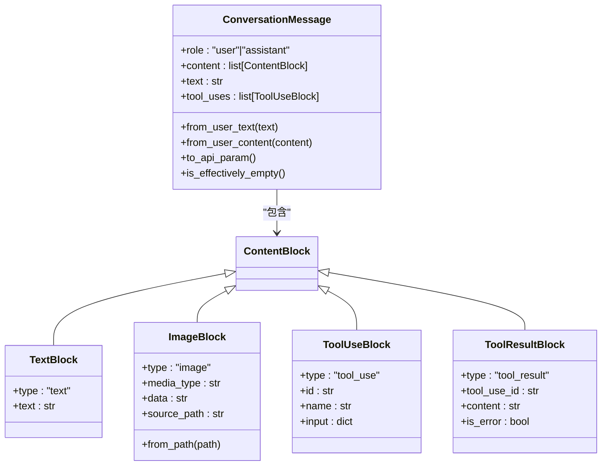

**图表来源**
- [messages.py:14-222](file://src/openharness/engine/messages.py#L14-L222)

**章节来源**
- [messages.py:14-222](file://src/openharness/engine/messages.py#L14-L222)

### 对话引擎与查询循环
- QueryEngine职责
  - 维护消息历史、系统提示、模型与最大token配置
  - 调用run_query执行工具感知的对话循环
  - 在每轮完成后更新CostTracker
- run_query核心流程
  - 自动压缩阈值检查与微压缩/总结压缩
  - 图片预处理（非多模态模型转文本）
  - 流式API调用与事件分发
  - 错误分类与重试/降级处理
  - 最终消息追加与turn计数

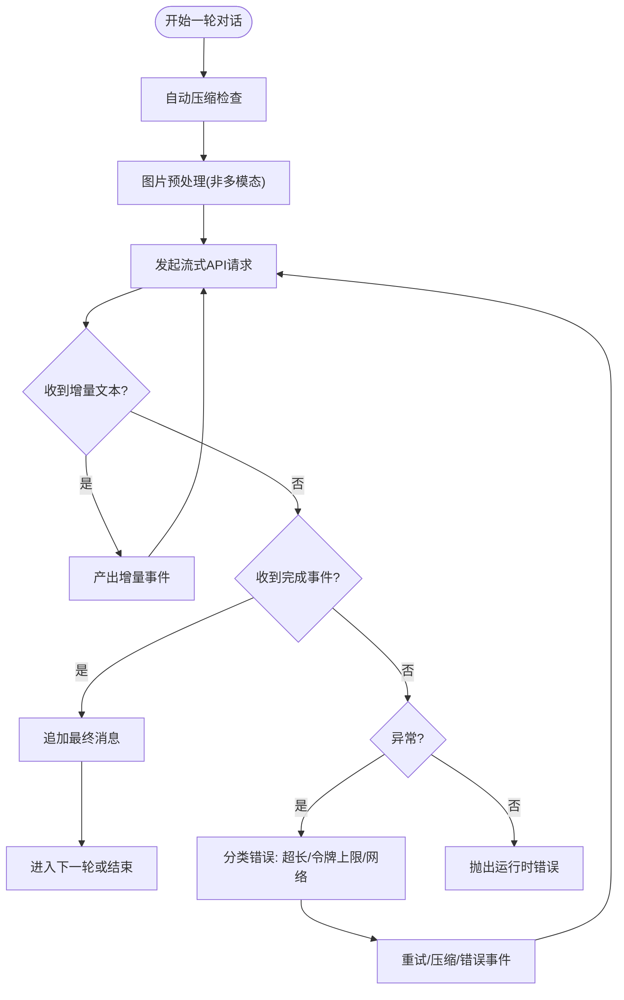

**图表来源**
- [query_engine.py:147-215](file://src/openharness/engine/query_engine.py#L147-L215)
- [query.py:632-800](file://src/openharness/engine/query.py#L632-L800)

**章节来源**
- [query_engine.py:19-215](file://src/openharness/engine/query_engine.py#L19-L215)
- [query.py:632-800](file://src/openharness/engine/query.py#L632-L800)

### 成本跟踪与使用快照
- UsageSnapshot：记录input_tokens与output_tokens
- CostTracker：累加多个UsageSnapshot，提供total只读视图
- QueryEngine在每轮结束后将UsageSnapshot加入CostTracker

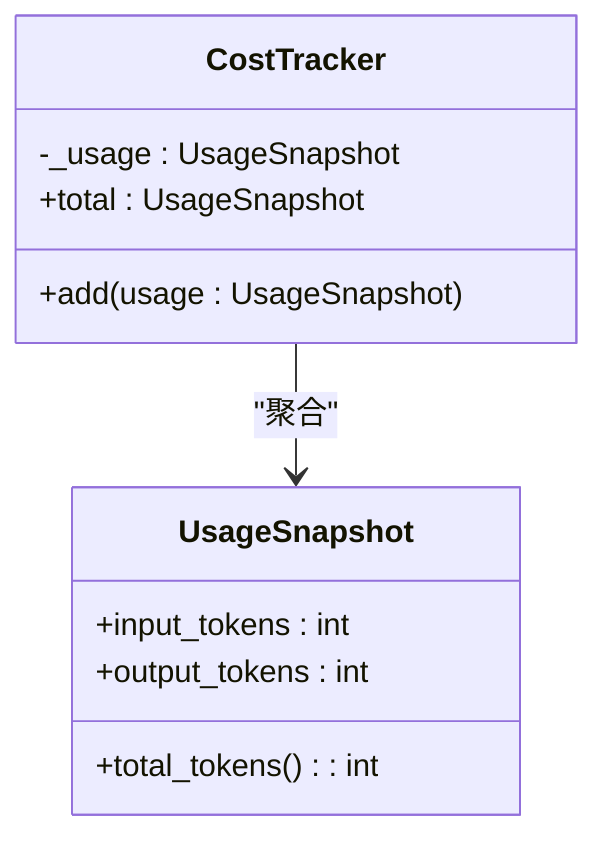

**图表来源**
- [usage.py:8-18](file://src/openharness/api/usage.py#L8-L18)
- [cost_tracker.py:8-25](file://src/openharness/engine/cost_tracker.py#L8-L25)
- [query_engine.py:186-191](file://src/openharness/engine/query_engine.py#L186-L191)

**章节来源**
- [usage.py:8-18](file://src/openharness/api/usage.py#L8-L18)
- [cost_tracker.py:8-25](file://src/openharness/engine/cost_tracker.py#L8-L25)
- [query_engine.py:87-91](file://src/openharness/engine/query_engine.py#L87-L91)

### 工具执行上下文与注册表
- BaseTool：定义execute抽象方法、只读判定与API Schema导出
- ToolRegistry：名称到实现映射，提供API Schema列表
- ToolExecutionContext：传递cwd与metadata，供工具执行

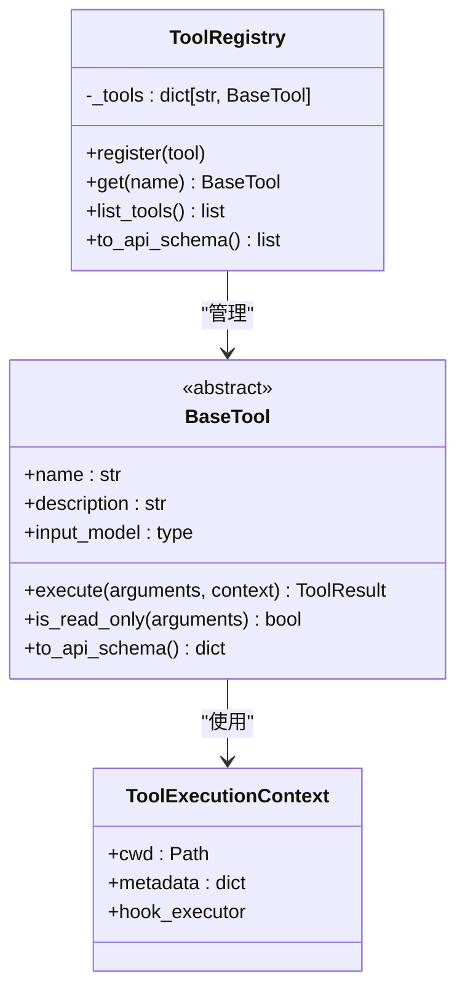

**图表来源**
- [base.py:17-81](file://src/openharness/tools/base.py#L17-L81)

**章节来源**
- [base.py:17-81](file://src/openharness/tools/base.py#L17-L81)

### 权限检查与安全策略
- PermissionChecker评估工具调用是否允许，支持：
  - 显式允许/拒绝列表
  - 路径规则（glob匹配）
  - 命令模式（deny模式）
  - 三种模式：FULL_AUTO、PLAN、默认模式
  - 内置敏感路径黑名单（SSH、AWS、GCP、Azure、Docker、K8s、OpenHarness凭证目录等）

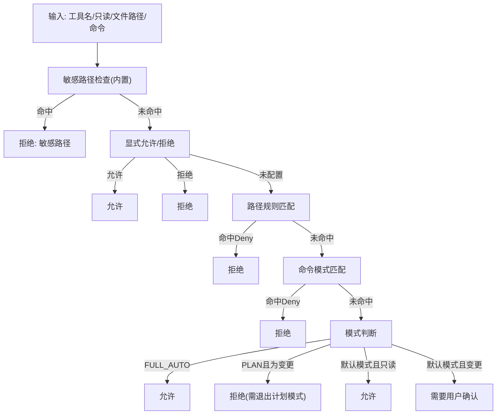

**图表来源**
- [checker.py:75-156](file://src/openharness/permissions/checker.py#L75-L156)

**章节来源**
- [checker.py:57-201](file://src/openharness/permissions/checker.py#L57-L201)

### 钩子执行引擎
- 支持命令、HTTP与提示型（含Agent模式）钩子
- 执行时注入环境变量与载荷，支持超时与阻断失败
- 提供统一结果聚合

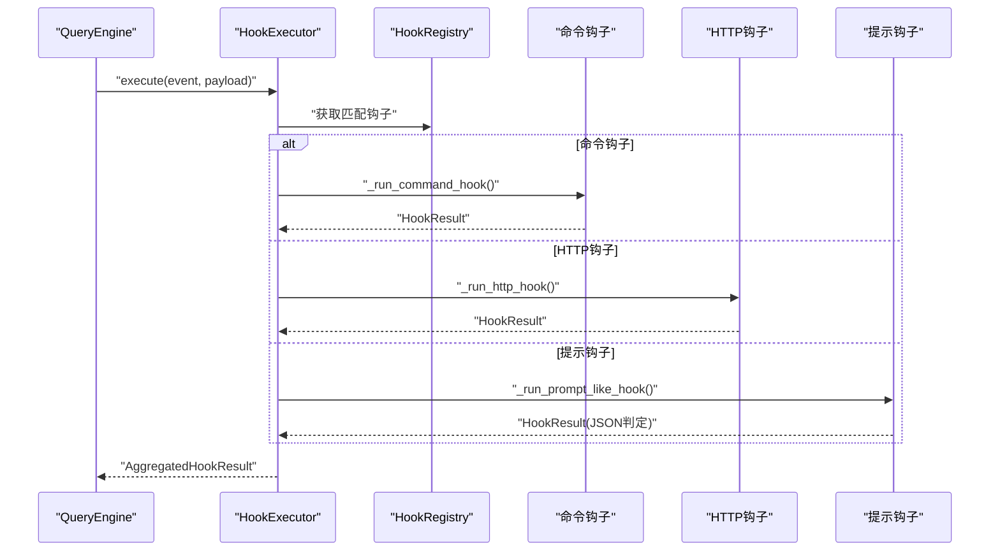

**图表来源**
- [executor.py:64-212](file://src/openharness/hooks/executor.py#L64-L212)

**章节来源**
- [executor.py:41-243](file://src/openharness/hooks/executor.py#L41-L243)

### 状态管理与应用状态存储
- AppStateStore提供get/set与订阅回调，便于UI与组件响应状态变化

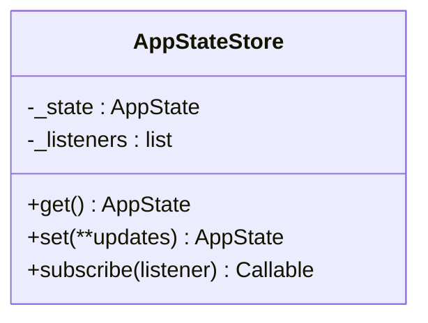

**图表来源**
- [store.py:14-41](file://src/openharness/state/store.py#L14-L41)

**章节来源**
- [store.py:14-41](file://src/openharness/state/store.py#L14-L41)

### 文件系统与内存管理
- 原子写入：atomic_write_text确保崩溃安全写入，使用临时文件+替换策略
- 内存文件管理：添加/删除内存条目并维护索引文件，使用独占锁避免竞态

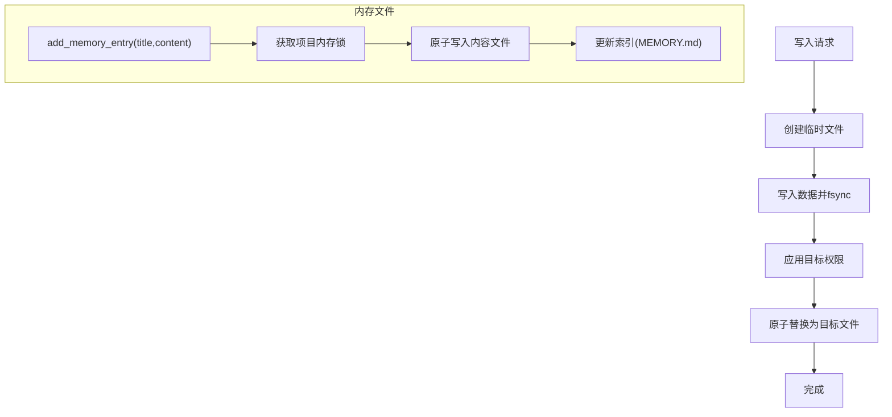

**图表来源**
- [fs.py:39-99](file://src/openharness/utils/fs.py#L39-L99)
- [manager.py:23-36](file://src/openharness/memory/manager.py#L23-L36)

**章节来源**
- [fs.py:39-99](file://src/openharness/utils/fs.py#L39-L99)
- [manager.py:17-59](file://src/openharness/memory/manager.py#L17-L59)

### 网络通信与安全
- AnthropicApiClient：封装重试（指数退避+抖动）、OAuth头注入、流式事件转换与错误翻译
- NetworkGuard：校验URL协议/主机/凭据，解析并验证公网地址，逐跳跟随重定向并限制次数

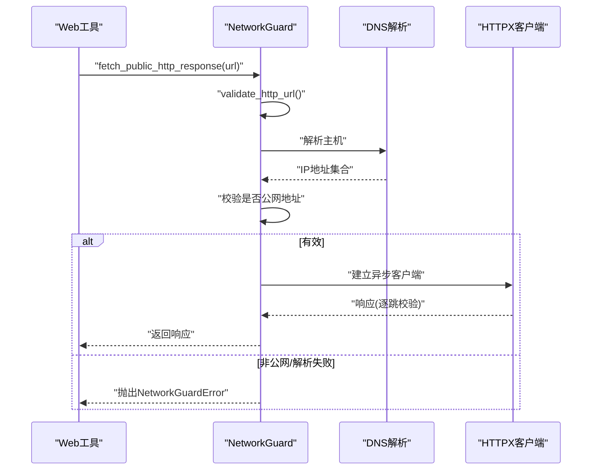

**图表来源**
- [client.py:117-267](file://src/openharness/api/client.py#L117-L267)
- [network_guard.py:53-90](file://src/openharness/utils/network_guard.py#L53-L90)

**章节来源**
- [client.py:117-267](file://src/openharness/api/client.py#L117-L267)
- [network_guard.py:24-128](file://src/openharness/utils/network_guard.py#L24-L128)

## 依赖分析
- 组件耦合
  - QueryEngine依赖API客户端、工具注册表、权限检查器、钩子执行器与成本跟踪器
  - run_query内部依赖服务压缩与工具输出预算策略
  - 工具执行受权限检查器约束，结果影响会话记忆与工作日志
- 外部依赖
  - anthropic SDK用于流式消息
  - httpx用于HTTP请求与重定向控制
  - pydantic用于数据模型与序列化

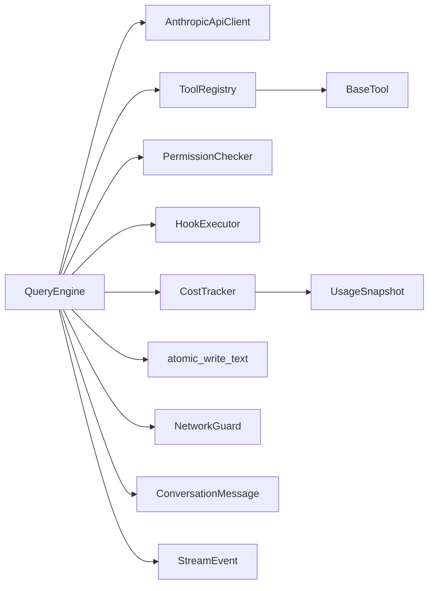

**图表来源**
- [query_engine.py:19-215](file://src/openharness/engine/query_engine.py#L19-L215)
- [client.py:117-267](file://src/openharness/api/client.py#L117-L267)
- [base.py:17-81](file://src/openharness/tools/base.py#L17-L81)
- [checker.py:57-201](file://src/openharness/permissions/checker.py#L57-L201)
- [executor.py:41-243](file://src/openharness/hooks/executor.py#L41-L243)
- [cost_tracker.py:8-25](file://src/openharness/engine/cost_tracker.py#L8-L25)
- [messages.py:64-222](file://src/openharness/engine/messages.py#L64-L222)
- [stream_events.py:12-90](file://src/openharness/engine/stream_events.py#L12-L90)
- [fs.py:39-99](file://src/openharness/utils/fs.py#L39-L99)
- [network_guard.py:24-128](file://src/openharness/utils/network_guard.py#L24-L128)

**章节来源**
- [query_engine.py:19-215](file://src/openharness/engine/query_engine.py#L19-L215)
- [client.py:117-267](file://src/openharness/api/client.py#L117-L267)
- [base.py:17-81](file://src/openharness/tools/base.py#L17-L81)
- [checker.py:57-201](file://src/openharness/permissions/checker.py#L57-L201)
- [executor.py:41-243](file://src/openharness/hooks/executor.py#L41-L243)
- [cost_tracker.py:8-25](file://src/openharness/engine/cost_tracker.py#L8-L25)
- [messages.py:64-222](file://src/openharness/engine/messages.py#L64-L222)
- [stream_events.py:12-90](file://src/openharness/engine/stream_events.py#L12-L90)
- [fs.py:39-99](file://src/openharness/utils/fs.py#L39-L99)
- [network_guard.py:24-128](file://src/openharness/utils/network_guard.py#L24-L128)

## 性能考虑
- 请求级输出token上限保护：在配置与模型限制之间取保守值，避免被上游拒绝
- 自动压缩与微压缩：在turn开始前尝试清理旧工具结果，必要时进行LLM驱动的摘要压缩
- 工具输出溢出处理：超过内联阈值时落盘并生成预览，减少上下文占用
- 图片预处理：非多模态模型场景下提前将图片转为文本描述，降低无效token消耗
- 重试策略：指数退避+抖动，尊重Retry-After头，限制最大延迟

**章节来源**
- [query.py:90-127](file://src/openharness/engine/query.py#L90-L127)
- [query.py:644-696](file://src/openharness/engine/query.py#L644-L696)
- [tool_outputs.py:26-56](file://src/openharness/services/tool_outputs.py#L26-L56)
- [query.py:555-631](file://src/openharness/engine/query.py#L555-L631)
- [client.py:97-114](file://src/openharness/api/client.py#L97-L114)

## 故障排查指南
- 网络/连接错误：识别“connect”、“timeout”、“network”关键词，输出ErrorEvent并提示检查网络
- 上下文过长：检测多种“prompt too long”相关错误，触发自动/反应式压缩
- 令牌上限：解析模型返回的completion token上限，动态调整max_tokens并重试
- 权限拒绝：根据权限模式与规则输出明确原因，必要时引导用户切换模式或确认
- 钩子失败：命令/HTTP钩子超时或失败时，按block_on_failure决定是否阻断

**章节来源**
- [query.py:751-780](file://src/openharness/engine/query.py#L751-L780)
- [query.py:766-780](file://src/openharness/engine/query.py#L766-L780)
- [checker.py:136-156](file://src/openharness/permissions/checker.py#L136-L156)
- [executor.py:112-136](file://src/openharness/hooks/executor.py#L112-L136)

## 结论
OpenHarness通过清晰的消息建模、稳健的查询循环与事件流、细粒度的成本跟踪、严格的权限与安全控制、可靠的文件系统与网络通信，构建了可扩展、可观测且安全的智能体执行框架。上述组件协同工作，既满足工程可用性，又兼顾安全性与可维护性。

## 附录
- 最佳实践
  - 使用ConversationMessage的归一化与净化能力，确保会话健康
  - 合理设置max_tokens与auto_compact阈值，平衡质量与性能
  - 对大输出工具启用落盘与预览，避免上下文膨胀
  - 严格配置权限模式与路径规则，配合敏感路径黑名单
  - 通过钩子扩展行为，注意超时与阻断策略