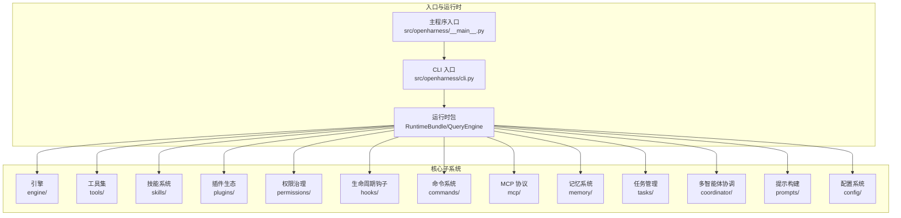
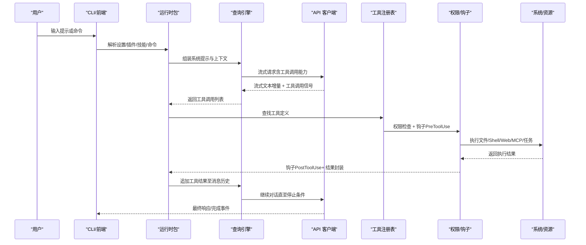
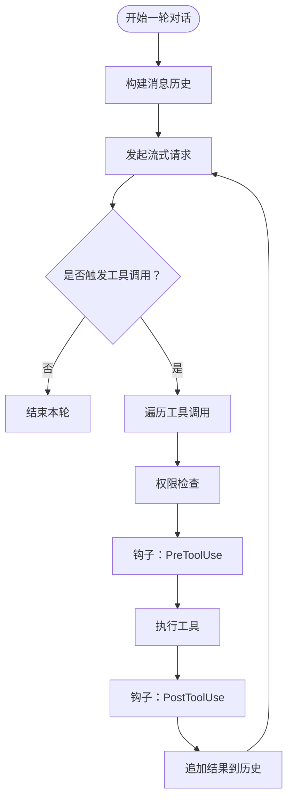
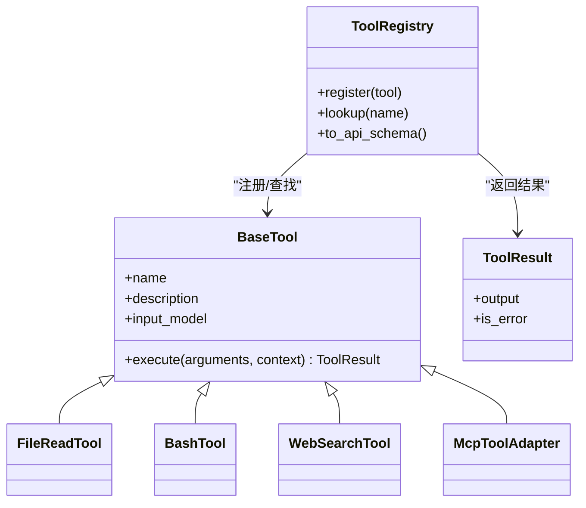
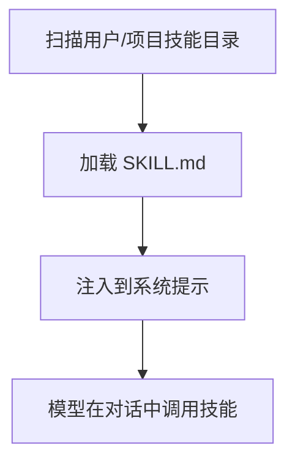
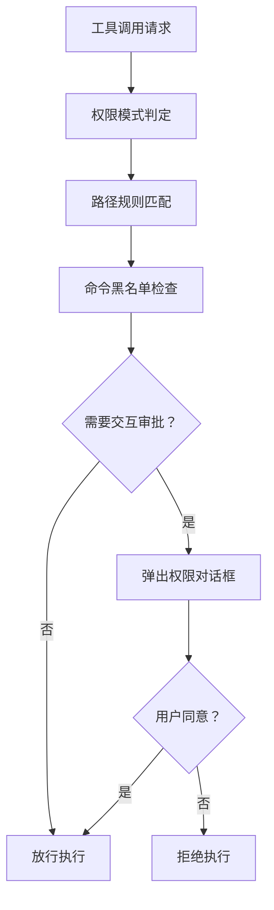
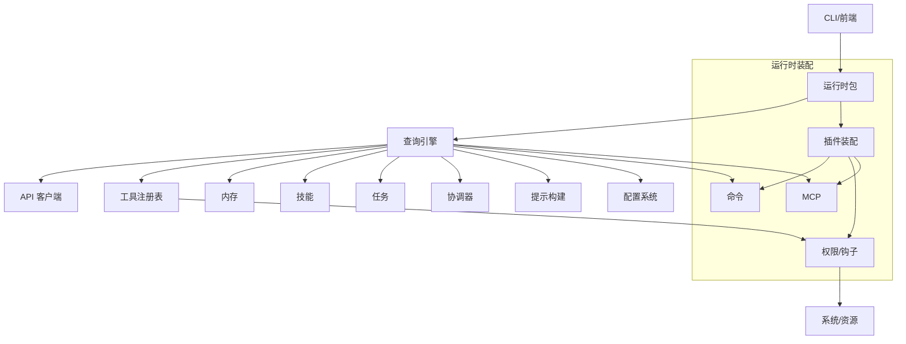

# 架构概述

<cite>
**本文引用的文件**
- [README.md](file://README.md)
- [__main__.py](file://src/openharness/__main__.py)
- [cli.py](file://src/openharness/cli.py)
- [engine/__init__.py](file://src/openharness/engine/__init__.py)
- [tools/__init__.py](file://src/openharness/tools/__init__.py)
- [skills/__init__.py](file://src/openharness/skills/__init__.py)
- [plugins/__init__.py](file://src/openharness/plugins/__init__.py)
- [permissions/__init__.py](file://src/openharness/permissions/__init__.py)
- [hooks/__init__.py](file://src/openharness/hooks/__init__.py)
- [commands/__init__.py](file://src/openharness/commands/__init__.py)
- [mcp/__init__.py](file://src/openharness/mcp/__init__.py)
- [memory/__init__.py](file://src/openharness/memory/__init__.py)
- [tasks/__init__.py](file://src/openharness/tasks/__init__.py)
- [coordinator/__init__.py](file://src/openharness/coordinator/__init__.py)
- [prompts/__init__.py](file://src/openharness/prompts/__init__.py)
- [config/__init__.py](file://src/openharness/config/__init__.py)
</cite>

## 目录
1. [简介](#简介)
2. [项目结构](#项目结构)
3. [核心组件](#核心组件)
4. [架构总览](#架构总览)
5. [详细组件分析](#详细组件分析)
6. [依赖关系分析](#依赖关系分析)
7. [性能考量](#性能考量)
8. [故障排查指南](#故障排查指南)
9. [结论](#结论)

## 简介
OpenHarness 是一个开源的轻量级智能体基础设施，围绕大模型提供“双手、眼睛、记忆与安全边界”。它通过 10 个核心子系统实现可组合的代理循环（Agent Loop），支持工具使用、技能加载、多模态上下文注入、持久化记忆、权限治理、生命周期钩子、命令系统、MCP 协议集成、后台任务与多智能体协调等能力。其目标是让研究人员、构建者与社区能够理解并扩展生产级智能体的工作原理。

- “双手”：工具与任务执行能力（文件、Shell、搜索、Web、MCP、计划、定时、消息、子代理等）
- “眼睛”：上下文与知识（CLAUDE.md 发现与注入、系统提示组装、环境信息）
- “记忆”：跨会话持久化与检索（MEMORY.md、自动压缩、会话恢复）
- “安全边界”：多级权限模式、路径规则、命令限制、预/后置钩子与交互式审批

**章节来源**
- [README.md:446-487](file://README.md#L446-L487)

## 项目结构
OpenHarness 的核心代码位于 src/openharness 下，采用按功能域划分的模块化组织方式。顶层入口通过命令行驱动，核心运行时由引擎、工具、技能、插件、权限、钩子、命令、MCP、内存、任务、协调器与提示构建器等子系统协作完成。

**图表来源**
- [__main__.py:1-7](file://src/openharness/__main__.py#L1-L7)
- [cli.py:749-777](file://src/openharness/cli.py#L749-L777)
- [engine/__init__.py:1-34](file://src/openharness/engine/__init__.py#L1-L34)
- [tools/__init__.py:47-96](file://src/openharness/tools/__init__.py#L47-L96)
- [skills/__init__.py:11-18](file://src/openharness/skills/__init__.py#L11-L18)
- [plugins/__init__.py:11-20](file://src/openharness/plugins/__init__.py#L11-L20)
- [permissions/__init__.py:11](file://src/openharness/permissions/__init__.py#L11)
- [hooks/__init__.py:13-21](file://src/openharness/hooks/__init__.py#L13-L21)
- [commands/__init__.py:13-21](file://src/openharness/commands/__init__.py#L13-L21)
- [mcp/__init__.py:20-32](file://src/openharness/mcp/__init__.py#L20-L32)
- [memory/__init__.py:9-18](file://src/openharness/memory/__init__.py#L9-L18)
- [tasks/__init__.py:9-18](file://src/openharness/tasks/__init__.py#L9-L18)
- [coordinator/__init__.py:6-12](file://src/openharness/coordinator/__init__.py#L6-L12)
- [prompts/__init__.py:8-14](file://src/openharness/prompts/__init__.py#L8-L14)
- [config/__init__.py:22-34](file://src/openharness/config/__init__.py#L22-L34)

**章节来源**
- [README.md:446-466](file://README.md#L446-L466)
- [__main__.py:1-7](file://src/openharness/__main__.py#L1-L7)
- [cli.py:749-777](file://src/openharness/cli.py#L749-L777)

## 核心组件
OpenHarness 的 10 个核心子系统职责如下：

- 引擎（Engine）：实现代理循环，负责请求生成、流式输出、工具调用调度与成本统计
- 工具（Tools）：内置 43+ 工具，覆盖文件、Shell、搜索、Web、MCP、计划、定时、消息、子代理等
- 技能（Skills）：按需加载的领域知识，支持用户与项目级技能发现与注入
- 插件（Plugins）：扩展命令、钩子、代理与 MCP 服务器，兼容官方生态
- 权限（Permissions）：多级权限模式、路径规则、命令黑名单与交互式审批
- 钩子（Hooks）：PreToolUse/PostToolUse 生命周期事件，支持前置校验与后置清理
- 命令（Commands）：Slash 命令注册与解析，提供会话控制、状态查看、系统操作等
- MCP 协议（MCP）：Model Context Protocol 客户端，支持 HTTP/WS/STDIO 传输与工具发现
- 内存（Memory）：跨会话持久化记忆、自动压缩与检索，支持 CLAUDE.md 注入
- 任务（Tasks）：后台任务生命周期管理，支持本地 Shell 与子代理任务
- 协调器（Coordinator）：团队注册表与子代理 Spawn/Delegation，支持 ClawTeam 集成规划
- 提示（Prompts）：系统提示构建、环境信息注入与 CLAUDE.md 发现
- 配置（Config）：多层配置合并、迁移与工作区路径解析

**章节来源**
- [README.md:446-466](file://README.md#L446-L466)
- [engine/__init__.py:23-34](file://src/openharness/engine/__init__.py#L23-L34)
- [tools/__init__.py:99-106](file://src/openharness/tools/__init__.py#L99-L106)
- [skills/__init__.py:11-18](file://src/openharness/skills/__init__.py#L11-L18)
- [plugins/__init__.py:11-20](file://src/openharness/plugins/__init__.py#L11-L20)
- [permissions/__init__.py:11](file://src/openharness/permissions/__init__.py#L11)
- [hooks/__init__.py:13-21](file://src/openharness/hooks/__init__.py#L13-L21)
- [commands/__init__.py:13-21](file://src/openharness/commands/__init__.py#L13-L21)
- [mcp/__init__.py:20-32](file://src/openharness/mcp/__init__.py#L20-L32)
- [memory/__init__.py:9-18](file://src/openharness/memory/__init__.py#L9-L18)
- [tasks/__init__.py:9-18](file://src/openharness/tasks/__init__.py#L9-L18)
- [coordinator/__init__.py:6-12](file://src/openharness/coordinator/__init__.py#L6-L12)
- [prompts/__init__.py:8-14](file://src/openharness/prompts/__init__.py#L8-L14)
- [config/__init__.py:22-34](file://src/openharness/config/__init__.py#L22-L34)

## 架构总览
OpenHarness 的代理循环以“模型决策 + 框架执行”的方式持续进行，通过流式事件与工具调用形成闭环。下图展示了从用户输入到模型响应再到工具执行与结果回灌的关键流程。

**图表来源**
- [README.md:489-501](file://README.md#L489-L501)
- [cli.py:396-595](file://src/openharness/cli.py#L396-L595)
- [engine/__init__.py:23-34](file://src/openharness/engine/__init__.py#L23-L34)
- [tools/__init__.py:47-96](file://src/openharness/tools/__init__.py#L47-L96)
- [permissions/__init__.py:11](file://src/openharness/permissions/__init__.py#L11)
- [hooks/__init__.py:13-21](file://src/openharness/hooks/__init__.py#L13-L21)

## 详细组件分析

### 引擎（Engine）
- 职责：实现代理循环，负责消息构建、流式输出、工具调用解析与成本追踪
- 关键点：支持无限循环、并发工具执行、指数退避重试、文本增量与工具执行事件
- 复杂度：时间复杂度与对话轮次线性相关；工具执行为 IO 密集，受外部服务与磁盘影响

**图表来源**
- [README.md:468-487](file://README.md#L468-L487)
- [engine/__init__.py:23-34](file://src/openharness/engine/__init__.py#L23-L34)

**章节来源**
- [engine/__init__.py:1-34](file://src/openharness/engine/__init__.py#L1-L34)
- [README.md:468-487](file://README.md#L468-L487)

### 工具（Tools）
- 职责：提供统一的工具抽象与注册机制，内置 43+ 工具，支持结构化输入、JSON Schema 自描述与权限/钩子集成
- 设计：BaseTool + ToolRegistry，按需注册，支持 MCP 动态适配
- 性能：I/O 并行化与超时控制，避免阻塞主循环

**图表来源**
- [tools/__init__.py:47-96](file://src/openharness/tools/__init__.py#L47-L96)

**章节来源**
- [tools/__init__.py:1-106](file://src/openharness/tools/__init__.py#L1-L106)
- [README.md:507-526](file://README.md#L507-L526)

### 技能（Skills）
- 职责：按需加载领域知识，支持用户与项目级目录扫描，兼容 anthropics/skills 格式
- 特性：CLAUDE.md 发现与注入、系统提示动态拼接、技能命令直达

**图表来源**
- [README.md:527-569](file://README.md#L527-L569)
- [skills/__init__.py:11-18](file://src/openharness/skills/__init__.py#L11-L18)

**章节来源**
- [skills/__init__.py:1-45](file://src/openharness/skills/__init__.py#L1-L45)
- [README.md:527-569](file://README.md#L527-L569)

### 插件（Plugins）
- 职责：扩展命令、钩子、代理与 MCP 服务器，兼容 claude-code/plugins 生态
- 机制：安装/启用/卸载、清单解析、运行时装配

**图表来源**
- [README.md:570-589](file://README.md#L570-L589)
- [plugins/__init__.py:11-20](file://src/openharness/plugins/__init__.py#L11-L20)

**章节来源**
- [plugins/__init__.py:1-54](file://src/openharness/plugins/__init__.py#L1-L54)
- [README.md:570-589](file://README.md#L570-L589)

### 权限（Permissions）
- 职责：多级权限模式（默认/自动/计划模式）、路径规则、命令黑名单、交互式审批
- 价值：在开发与自动化场景中平衡安全性与效率

**图表来源**
- [README.md:600-619](file://README.md#L600-L619)
- [permissions/__init__.py:11-26](file://src/openharness/permissions/__init__.py#L11-L26)

**章节来源**
- [permissions/__init__.py:1-27](file://src/openharness/permissions/__init__.py#L1-L27)
- [README.md:600-619](file://README.md#L600-L619)

### 钩子（Hooks）
- 职责：生命周期事件（PreToolUse/PostToolUse），支持前置校验与后置清理
- 价值：统一审计、日志与副作用管理

**章节来源**
- [hooks/__init__.py:1-51](file://src/openharness/hooks/__init__.py#L1-L51)
- [README.md:108-114](file://README.md#L108-L114)

### 命令（Commands）
- 职责：Slash 命令注册与解析，提供会话控制、状态查看、系统操作等
- 机制：命令注册表 + 上下文解析 + 可远程触发

**章节来源**
- [commands/__init__.py:1-22](file://src/openharness/commands/__init__.py#L1-L22)
- [README.md:58-66](file://README.md#L58-L66)

### MCP 协议（MCP）
- 职责：Model Context Protocol 客户端，支持 HTTP/WS/STDIO 传输、工具发现与资源读取
- 价值：将外部工具与资源无缝接入代理循环

**章节来源**
- [mcp/__init__.py:1-80](file://src/openharness/mcp/__init__.py#L1-L80)
- [README.md:170-171](file://README.md#L170-L171)

### 内存（Memory）
- 职责：跨会话持久化记忆、自动压缩、检索与注入
- 价值：长期任务与多日会话的上下文连续性

**章节来源**
- [memory/__init__.py:1-19](file://src/openharness/memory/__init__.py#L1-L19)
- [README.md:94-98](file://README.md#L94-L98)

### 任务（Tasks）
- 职责：后台任务生命周期管理，支持本地 Shell 与子代理任务
- 价值：异步执行与资源隔离

**章节来源**
- [tasks/__init__.py:1-19](file://src/openharness/tasks/__init__.py#L1-L19)
- [README.md:127-129](file://README.md#L127-L129)

### 协调器（Coordinator）
- 职责：团队注册表与子代理 Spawn/Delegation，支持多智能体协作
- 价值：将 Clue-style 多智能体工作映射到内置原语

**章节来源**
- [coordinator/__init__.py:1-13](file://src/openharness/coordinator/__init__.py#L1-L13)
- [README.md:126-129](file://README.md#L126-L129)

### 提示（Prompts）
- 职责：系统提示构建、环境信息注入与 CLAUDE.md 发现
- 价值：确保模型获得充分上下文与领域知识

**章节来源**
- [prompts/__init__.py:1-15](file://src/openharness/prompts/__init__.py#L1-L15)
- [README.md:94-98](file://README.md#L94-L98)

### 配置（Config）
- 职责：多层配置合并、迁移与工作区路径解析
- 价值：提供一致的设置来源与可移植性

**章节来源**
- [config/__init__.py:1-35](file://src/openharness/config/__init__.py#L1-L35)

## 依赖关系分析
OpenHarness 采用“低耦合、高内聚”的模块化设计，子系统之间通过清晰的接口与事件进行交互。以下图展示主要依赖关系与数据流向。

**图表来源**
- [cli.py:396-595](file://src/openharness/cli.py#L396-L595)
- [engine/__init__.py:23-34](file://src/openharness/engine/__init__.py#L23-L34)
- [tools/__init__.py:47-96](file://src/openharness/tools/__init__.py#L47-L96)
- [plugins/__init__.py:11-20](file://src/openharness/plugins/__init__.py#L11-L20)
- [permissions/__init__.py:11](file://src/openharness/permissions/__init__.py#L11)
- [hooks/__init__.py:13-21](file://src/openharness/hooks/__init__.py#L13-L21)
- [memory/__init__.py:9-18](file://src/openharness/memory/__init__.py#L9-L18)
- [tasks/__init__.py:9-18](file://src/openharness/tasks/__init__.py#L9-L18)
- [coordinator/__init__.py:6-12](file://src/openharness/coordinator/__init__.py#L6-L12)
- [prompts/__init__.py:8-14](file://src/openharness/prompts/__init__.py#L8-L14)
- [config/__init__.py:22-34](file://src/openharness/config/__init__.py#L22-L34)

**章节来源**
- [cli.py:396-595](file://src/openharness/cli.py#L396-L595)

## 性能考量
- 异步流式处理：引擎与 API 客户端采用流式事件，减少等待延迟，提升感知速度
- 并行工具执行：工具调用可在权限与钩子验证后并发执行，提高吞吐
- 成本追踪：内置令牌计数与成本统计，便于预算控制与优化
- 自动压缩：上下文压缩与会话恢复，降低长对话的内存与计算开销
- 外部依赖：MCP 与网络请求存在不确定性，建议配置合理的超时与重试策略

[本节为通用指导，不直接分析具体文件]

## 故障排查指南
- 干运行（Dry-run）：使用 --dry-run 预览设置解析、认证状态、技能/命令/工具发现与 MCP 配置问题，快速定位阻塞/警告级别
- 认证与提供方：检查 active profile、api_format、base_url 与 auth 状态，必要时重新登录或切换提供方
- MCP 诊断：列出已配置服务器，检查传输类型与目标地址，修复无效 URL 或缺失命令
- 权限与钩子：确认权限模式与路径规则，必要时临时放宽或添加交互式审批
- 日志与调试：开启 --debug 输出更详细的运行轨迹，结合流式事件定位问题

**章节来源**
- [README.md:268-298](file://README.md#L268-L298)
- [cli.py:333-394](file://src/openharness/cli.py#L333-L394)
- [cli.py:89-122](file://src/openharness/cli.py#L89-L122)
- [permissions/__init__.py:11](file://src/openharness/permissions/__init__.py#L11)
- [hooks/__init__.py:13-21](file://src/openharness/hooks/__init__.py#L13-L21)

## 结论
OpenHarness 以“双手、眼睛、记忆与安全边界”为核心理念，通过 10 个子系统的协同实现了可扩展、可观测且安全可控的智能体基础设施。其模块化设计与插件化扩展机制使得研究与工程团队能够在统一框架下实验新工具、技能与多智能体编排模式，并以干运行与权限治理保障安全落地。