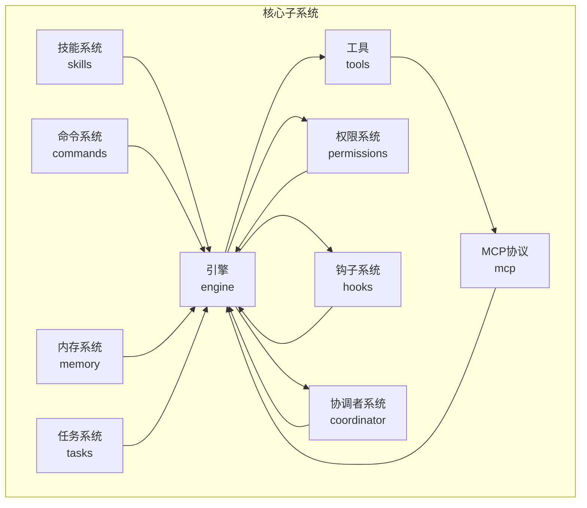
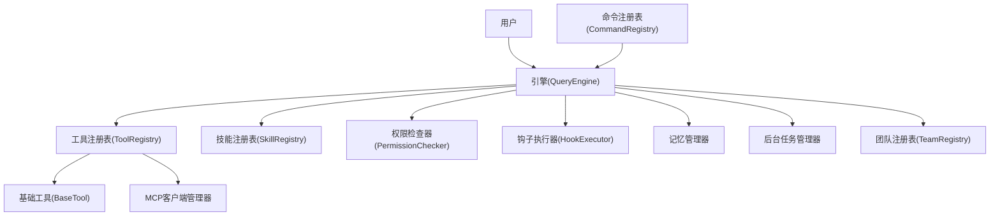
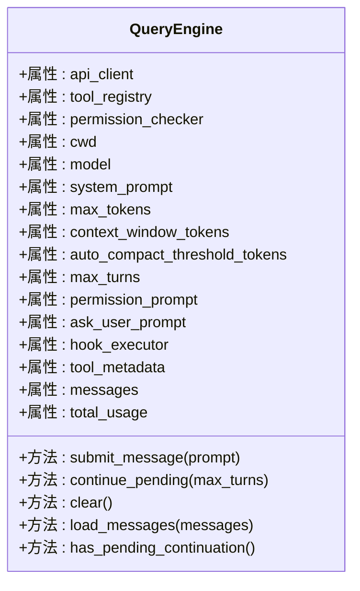
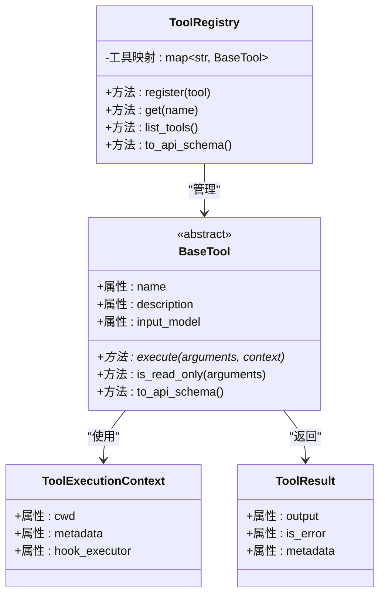
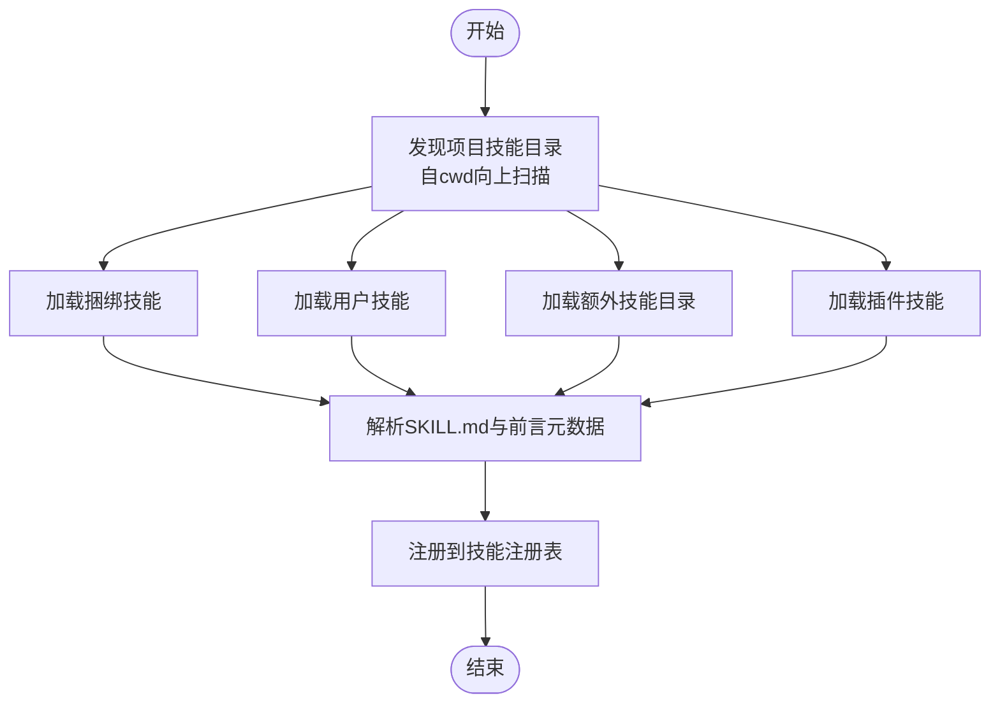
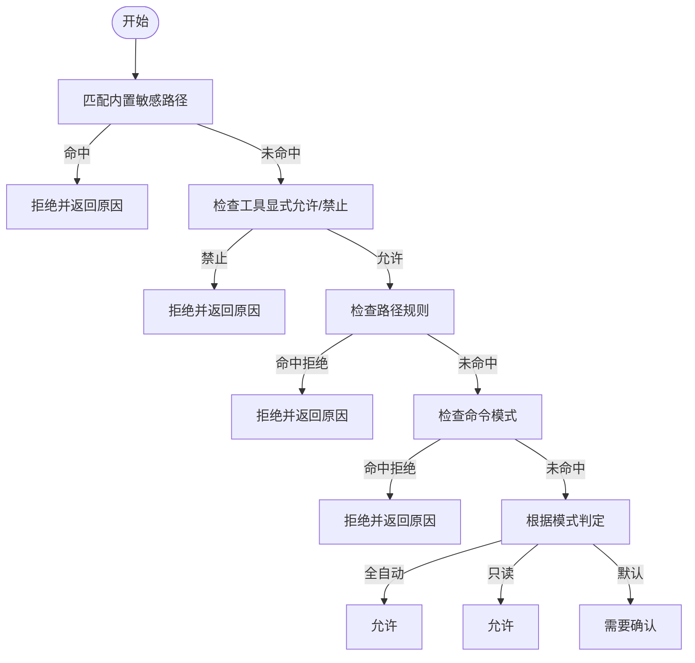
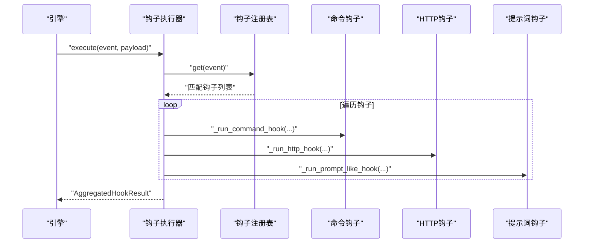
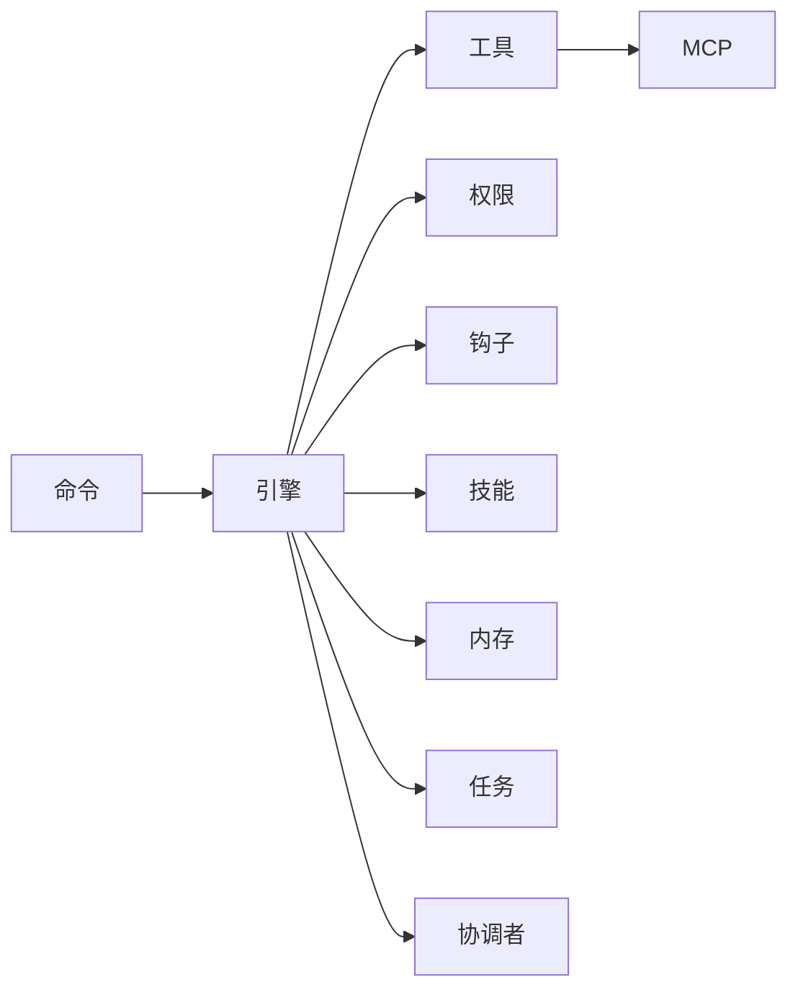

# 核心子系统

<cite>
**本文引用的文件**
- [engine/__init__.py](file://src/openharness/engine/__init__.py)
- [engine/query_engine.py](file://src/openharness/engine/query_engine.py)
- [tools/__init__.py](file://src/openharness/tools/__init__.py)
- [tools/base.py](file://src/openharness/tools/base.py)
- [skills/__init__.py](file://src/openharness/skills/__init__.py)
- [skills/loader.py](file://src/openharness/skills/loader.py)
- [permissions/__init__.py](file://src/openharness/permissions/__init__.py)
- [permissions/checker.py](file://src/openharness/permissions/checker.py)
- [hooks/__init__.py](file://src/openharness/hooks/__init__.py)
- [hooks/executor.py](file://src/openharness/hooks/executor.py)
- [commands/__init__.py](file://src/openharness/commands/__init__.py)
- [mcp/__init__.py](file://src/openharness/mcp/__init__.py)
- [memory/__init__.py](file://src/openharness/memory/__init__.py)
- [tasks/__init__.py](file://src/openharness/tasks/__init__.py)
- [coordinator/__init__.py](file://src/openharness/coordinator/__init__.py)
</cite>

## 目录
1. [引言](#引言)
2. [项目结构](#项目结构)
3. [核心组件](#核心组件)
4. [架构总览](#架构总览)
5. [详细组件分析](#详细组件分析)
6. [依赖分析](#依赖分析)
7. [性能考虑](#性能考虑)
8. [故障排除指南](#故障排除指南)
9. [结论](#结论)

## 引言
本文件面向OpenHarness的核心子系统，系统性梳理并解释以下10个子系统的职责与协作方式：引擎、工具、技能系统、权限系统、钩子系统、命令系统、MCP协议、内存系统、任务系统、协调者系统。我们将从架构、数据流、处理逻辑、集成点与错误处理等维度进行深入分析，并通过图示展示各子系统之间的交互关系。

## 项目结构
OpenHarness采用按功能域分层的模块化组织方式，核心子系统均以独立包形式存在，彼此通过清晰的接口与共享上下文进行协作。下图给出与本次文档相关的子系统在工程中的位置概览：

**图表来源**
- [engine/__init__.py:1-81](file://src/openharness/engine/__init__.py#L1-L81)
- [tools/__init__.py:1-106](file://src/openharness/tools/__init__.py#L1-L106)
- [skills/__init__.py:1-45](file://src/openharness/skills/__init__.py#L1-L45)
- [permissions/__init__.py:1-27](file://src/openharness/permissions/__init__.py#L1-L27)
- [hooks/__init__.py:1-51](file://src/openharness/hooks/__init__.py#L1-L51)
- [commands/__init__.py:1-22](file://src/openharness/commands/__init__.py#L1-L22)
- [mcp/__init__.py:1-80](file://src/openharness/mcp/__init__.py#L1-L80)
- [memory/__init__.py:1-19](file://src/openharness/memory/__init__.py#L1-L19)
- [tasks/__init__.py:1-19](file://src/openharness/tasks/__init__.py#L1-L19)
- [coordinator/__init__.py:1-13](file://src/openharness/coordinator/__init__.py#L1-L13)

**章节来源**
- [engine/__init__.py:1-81](file://src/openharness/engine/__init__.py#L1-L81)
- [tools/__init__.py:1-106](file://src/openharness/tools/__init__.py#L1-L106)
- [skills/__init__.py:1-45](file://src/openharness/skills/__init__.py#L1-L45)
- [permissions/__init__.py:1-27](file://src/openharness/permissions/__init__.py#L1-L27)
- [hooks/__init__.py:1-51](file://src/openharness/hooks/__init__.py#L1-L51)
- [commands/__init__.py:1-22](file://src/openharness/commands/__init__.py#L1-L22)
- [mcp/__init__.py:1-80](file://src/openharness/mcp/__init__.py#L1-L80)
- [memory/__init__.py:1-19](file://src/openharness/memory/__init__.py#L1-L19)
- [tasks/__init__.py:1-19](file://src/openharness/tasks/__init__.py#L1-L19)
- [coordinator/__init__.py:1-13](file://src/openharness/coordinator/__init__.py#L1-L13)

## 核心组件
本节对10个核心子系统进行职责与能力概述（不含具体代码片段）：

- 引擎（engine）
  - 职责：维护对话历史、驱动模型对话循环、编排工具调用、处理权限与钩子、追踪用量与成本。
  - 关键对象：查询引擎类、消息类型、流式事件类型。
  - 典型流程：接收用户输入 → 构建上下文 → 运行查询循环 → 产出流式事件 → 更新历史与用量。

- 工具（tools）
  - 职责：提供统一的工具抽象与注册机制；内置43+工具覆盖文件操作、网络检索、任务管理、MCP集成等。
  - 关键对象：基础工具类、工具执行上下文、工具结果、工具注册表。
  - 典型流程：解析输入 → 权限校验 → 执行工具 → 返回标准化结果。

- 技能系统（skills）
  - 职责：从多源目录加载技能定义（捆绑、用户、项目、插件），解析元数据与命令名，构建可发现的技能注册表。
  - 关键对象：技能定义、技能注册表、加载器。
  - 典型流程：扫描目录 → 解析前言元数据 → 构造技能定义 → 注册到注册表。

- 权限系统（permissions）
  - 职责：基于模式与规则对工具调用进行决策，内置敏感路径白名单、命令模式匹配、只读豁免、计划模式限制等。
  - 关键对象：权限检查器、决策结果、路径规则。
  - 典型流程：输入工具名/路径/命令 → 匹配敏感路径/显式列表/路径规则/命令模式 → 判定允许/需确认/拒绝。

- 钩子系统（hooks）
  - 职责：在生命周期事件触发时执行命令、HTTP或提示词驱动的条件判断，支持阻断失败、超时控制与上下文注入。
  - 关键对象：钩子执行器、事件枚举、注册表、结果聚合。
  - 典型流程：事件发生 → 查找匹配钩子 → 选择执行策略（命令/HTTP/提示词）→ 注入参数 → 执行并返回结果。

- 命令系统（commands）
  - 职责：提供Slash命令注册与上下文封装，支持内存后端与技能命令查找。
  - 关键对象：命令注册表、命令上下文、命令结果、Slash命令。
  - 典型流程：解析命令 → 查找命令定义 → 组装上下文 → 执行命令 → 返回结果。

- MCP协议（mcp）
  - 职责：管理MCP服务器配置与客户端连接状态，暴露MCP工具适配器与资源读取工具，支持多提供商接入。
  - 关键对象：MCP客户端管理器、连接状态、服务器配置、工具信息、资源信息。
  - 典型流程：加载配置 → 建立连接 → 列出工具/资源 → 适配为工具 → 注册到工具注册表。

- 内存系统（memory）
  - 职责：提供项目级与用户级记忆文件的扫描、检索、增删查与入口点管理，支持与引擎结合进行上下文增强。
  - 关键对象：记忆管理器、扫描器、检索器、路径工具。
  - 典型流程：扫描文件 → 检索相关记忆 → 生成提示 → 注入到会话。

- 任务系统（tasks）
  - 职责：管理后台任务生命周期（创建、查询、停止、输出获取），支持本地代理与Shell任务。
  - 关键对象：后台任务管理器、任务记录、任务状态、任务类型。
  - 典型流程：提交任务 → 后台执行 → 状态轮询/回调 → 输出收集 → 结束清理。

- 协调者系统（coordinator）
  - 职责：定义代理团队与工作流，提供内置代理定义与团队注册表，支持多代理协作场景。
  - 关键对象：代理定义、团队记录、团队注册表、内置代理定义。
  - 典型流程：定义团队 → 分配角色 → 触发协作 → 回传结果。

**章节来源**
- [engine/__init__.py:1-81](file://src/openharness/engine/__init__.py#L1-L81)
- [engine/query_engine.py:1-215](file://src/openharness/engine/query_engine.py#L1-L215)
- [tools/__init__.py:1-106](file://src/openharness/tools/__init__.py#L1-L106)
- [tools/base.py:1-81](file://src/openharness/tools/base.py#L1-L81)
- [skills/__init__.py:1-45](file://src/openharness/skills/__init__.py#L1-L45)
- [skills/loader.py:1-230](file://src/openharness/skills/loader.py#L1-L230)
- [permissions/__init__.py:1-27](file://src/openharness/permissions/__init__.py#L1-L27)
- [permissions/checker.py:1-201](file://src/openharness/permissions/checker.py#L1-L201)
- [hooks/__init__.py:1-51](file://src/openharness/hooks/__init__.py#L1-L51)
- [hooks/executor.py:1-243](file://src/openharness/hooks/executor.py#L1-L243)
- [commands/__init__.py:1-22](file://src/openharness/commands/__init__.py#L1-L22)
- [mcp/__init__.py:1-80](file://src/openharness/mcp/__init__.py#L1-L80)
- [memory/__init__.py:1-19](file://src/openharness/memory/__init__.py#L1-L19)
- [tasks/__init__.py:1-19](file://src/openharness/tasks/__init__.py#L1-L19)
- [coordinator/__init__.py:1-13](file://src/openharness/coordinator/__init__.py#L1-L13)

## 架构总览
下图展示OpenHarness核心子系统之间的高层交互关系与数据流向：

**图表来源**
- [engine/query_engine.py:1-215](file://src/openharness/engine/query_engine.py#L1-L215)
- [tools/base.py:1-81](file://src/openharness/tools/base.py#L1-L81)
- [mcp/__init__.py:1-80](file://src/openharness/mcp/__init__.py#L1-L80)
- [skills/__init__.py:1-45](file://src/openharness/skills/__init__.py#L1-L45)
- [permissions/checker.py:1-201](file://src/openharness/permissions/checker.py#L1-L201)
- [hooks/executor.py:1-243](file://src/openharness/hooks/executor.py#L1-L243)
- [memory/__init__.py:1-19](file://src/openharness/memory/__init__.py#L1-L19)
- [tasks/__init__.py:1-19](file://src/openharness/tasks/__init__.py#L1-L19)
- [coordinator/__init__.py:1-13](file://src/openharness/coordinator/__init__.py#L1-L13)

## 详细组件分析

### 引擎（QueryEngine）分析
- 设计要点
  - 作为对话循环的中枢，持有API客户端、工具注册表、权限检查器、当前工作目录、模型与系统提示等运行参数。
  - 提供消息历史管理、最大轮次限制、用量追踪、系统提示与模型切换等能力。
  - 在每次对话回合中，将用户输入与历史消息组合，注入协调者上下文，调用查询执行器并产出流式事件。
- 数据结构与复杂度
  - 消息列表为线性存储，查询与更新均为O(n)级别；工具注册表为字典映射，查找为O(1)。
- 处理逻辑
  - 输入预处理：规范化消息、记忆用户目标、注入协调者上下文。
  - 查询执行：构建上下文对象，调用查询执行器，逐事件回传并累计用量。
  - 历史更新：回合完成时同步消息历史。
- 错误处理
  - 对异常事件进行累积统计与流式上报，避免中断对话循环。
- 性能影响
  - 流式事件减少等待时间；上下文压缩阈值与轮次限制有助于控制成本。

**图表来源**
- [engine/query_engine.py:1-215](file://src/openharness/engine/query_engine.py#L1-L215)

**章节来源**
- [engine/query_engine.py:1-215](file://src/openharness/engine/query_engine.py#L1-L215)

### 工具（ToolRegistry 与 BaseTool）分析
- 设计要点
  - 工具抽象定义统一的执行接口与输入Schema；工具注册表提供名称到实例的映射与API Schema导出。
  - 默认工具注册器集中注册内置工具，并在MCP可用时动态注入MCP工具与资源工具。
- 数据结构与复杂度
  - 注册表为哈希映射，注册与查找均为O(1)；API Schema导出为线性遍历。
- 处理逻辑
  - 输入校验：使用Pydantic模型进行参数校验；只读工具可绕过权限确认。
  - 执行流程：注入执行上下文（含工作目录与钩子执行器）→ 调用工具execute → 返回标准化结果。
- 错误处理
  - 工具结果包含错误标记与元数据，便于上层统一处理。
- 性能影响
  - 工具数量较多时，注册与导出Schema的成本线性增长；建议按需注册。

**图表来源**
- [tools/base.py:1-81](file://src/openharness/tools/base.py#L1-L81)

**章节来源**
- [tools/base.py:1-81](file://src/openharness/tools/base.py#L1-L81)
- [tools/__init__.py:1-106](file://src/openharness/tools/__init__.py#L1-L106)

### 技能系统（SkillRegistry 与加载器）分析
- 设计要点
  - 支持从捆绑、用户、兼容目录、项目目录与插件中加载技能；按目录层级确定覆盖顺序，确保项目与用户技能优先。
  - 解析技能Markdown的前言元数据，提取名称、描述、是否允许用户调用、禁用模型调用等字段。
- 数据结构与复杂度
  - 技能注册表为线性存储，注册与查找为O(n)；扫描与解析为线性于文件数。
- 处理逻辑
  - 目录发现：自cwd向上至Git根或家目录，收集有效相对路径。
  - 文件解析：遍历目录下的SKILL.md，读取内容并解析元数据。
  - 注册：构造技能定义并注册到注册表。
- 错误处理
  - 忽略不安全路径与无效条目，记录警告日志。
- 性能影响
  - 项目技能目录越多，扫描成本越高；建议合理配置项目技能目录。

**图表来源**
- [skills/loader.py:1-230](file://src/openharness/skills/loader.py#L1-L230)

**章节来源**
- [skills/loader.py:1-230](file://src/openharness/skills/loader.py#L1-L230)
- [skills/__init__.py:1-45](file://src/openharness/skills/__init__.py#L1-L45)

### 权限系统（PermissionChecker）分析
- 设计要点
  - 基于模式与规则进行决策：内置敏感路径白名单、显式允许/禁止列表、路径规则、命令模式匹配。
  - 支持三种模式：全自动化、计划模式（仅只读）、默认模式（需确认）。
- 数据结构与复杂度
  - 路径规则为列表，匹配为线性扫描；敏感路径模式为常量数组。
- 处理逻辑
  - 优先检查敏感路径；再检查工具显式列表；随后路径规则与命令模式；最后根据模式判定是否需要确认。
- 错误处理
  - 对不合法规则进行告警并跳过；对高风险命令提供友好提示。
- 性能影响
  - 规则数量增加时，匹配成本线性上升；建议精简规则。

**图表来源**
- [permissions/checker.py:1-201](file://src/openharness/permissions/checker.py#L1-L201)

**章节来源**
- [permissions/checker.py:1-201](file://src/openharness/permissions/checker.py#L1-L201)
- [permissions/__init__.py:1-27](file://src/openharness/permissions/__init__.py#L1-L27)

### 钩子系统（HookExecutor）分析
- 设计要点
  - 支持命令、HTTP与提示词三类钩子；事件触发时按匹配器筛选钩子并执行。
  - 提供超时控制、阻断失败、环境变量注入、JSON结果解析与Agent模式增强。
- 数据结构与复杂度
  - 钩子注册表为事件到钩子列表的映射；执行为线性遍历。
- 处理逻辑
  - 命令钩子：注入事件与载荷，创建子进程执行，捕获输出与退出码。
  - HTTP钩子：异步POST请求，解析响应状态与文本。
  - 提示词钩子：构造验证提示，调用API获取严格JSON结果。
- 错误处理
  - 超时、沙箱不可用、HTTP异常、JSON解析失败均有明确反馈与阻断策略。
- 性能影响
  - 外部调用（HTTP/命令）可能成为瓶颈；建议合理设置超时与并发。

**图表来源**
- [hooks/executor.py:1-243](file://src/openharness/hooks/executor.py#L1-L243)

**章节来源**
- [hooks/executor.py:1-243](file://src/openharness/hooks/executor.py#L1-L243)
- [hooks/__init__.py:1-51](file://src/openharness/hooks/__init__.py#L1-L51)

### 命令系统（CommandRegistry）分析
- 设计要点
  - 提供命令注册表、上下文、结果与内存后端；支持从技能中查找Slash命令。
- 处理逻辑
  - 命令解析 → 查找定义 → 组装上下文 → 执行 → 返回结果。
- 性能影响
  - 命令数量有限，性能开销较小。

**章节来源**
- [commands/__init__.py:1-22](file://src/openharness/commands/__init__.py#L1-L22)

### MCP协议（McpClientManager）分析
- 设计要点
  - 管理MCP服务器配置与连接状态；提供工具与资源的列表与读取适配器，动态注入工具注册表。
- 处理逻辑
  - 加载配置 → 建立连接 → 列出工具/资源 → 适配为工具 → 注册。
- 性能影响
  - 连接建立与工具枚举为潜在开销点，建议缓存与复用。

**章节来源**
- [mcp/__init__.py:1-80](file://src/openharness/mcp/__init__.py#L1-L80)

### 内存系统（Memory Manager）分析
- 设计要点
  - 提供记忆文件扫描、检索、增删查与入口点管理；可与引擎结合用于上下文增强。
- 处理逻辑
  - 扫描 → 检索相关记忆 → 生成提示 → 注入会话。
- 性能影响
  - 检索算法与向量相似度计算可能成为瓶颈，建议索引优化。

**章节来源**
- [memory/__init__.py:1-19](file://src/openharness/memory/__init__.py#L1-L19)

### 任务系统（BackgroundTaskManager）分析
- 设计要点
  - 管理后台任务生命周期：创建、查询、停止、输出获取；支持本地代理与Shell任务。
- 处理逻辑
  - 提交任务 → 后台执行 → 状态轮询/回调 → 输出收集 → 结束清理。
- 性能影响
  - 并发任务增多时，资源竞争与I/O成为关键因素。

**章节来源**
- [tasks/__init__.py:1-19](file://src/openharness/tasks/__init__.py#L1-L19)

### 协调者系统（TeamRegistry）分析
- 设计要点
  - 定义代理团队与工作流，提供内置代理定义与团队注册表。
- 处理逻辑
  - 定义团队 → 分配角色 → 触发协作 → 回传结果。
- 性能影响
  - 多代理协作的调度与通信开销需关注。

**章节来源**
- [coordinator/__init__.py:1-13](file://src/openharness/coordinator/__init__.py#L1-L13)

## 依赖分析
- 子系统内聚与耦合
  - 引擎是中枢，与工具、权限、钩子、技能、内存、任务、协调者均有直接依赖，耦合度较高但职责清晰。
  - 工具与MCP之间存在间接耦合（通过注册表注入）。
  - 技能系统与命令系统存在概念关联（技能可导出命令），但实现解耦。
- 外部依赖与集成点
  - API客户端接口抽象保证了与不同提供商的兼容性。
  - 钩子系统通过命令、HTTP与提示词三种方式扩展外部集成。
- 循环依赖
  - 未发现直接循环依赖；各子系统通过接口与注册表进行松耦合协作。

**图表来源**
- [engine/query_engine.py:1-215](file://src/openharness/engine/query_engine.py#L1-L215)
- [tools/base.py:1-81](file://src/openharness/tools/base.py#L1-L81)
- [mcp/__init__.py:1-80](file://src/openharness/mcp/__init__.py#L1-L80)
- [hooks/executor.py:1-243](file://src/openharness/hooks/executor.py#L1-L243)
- [skills/__init__.py:1-45](file://src/openharness/skills/__init__.py#L1-L45)
- [memory/__init__.py:1-19](file://src/openharness/memory/__init__.py#L1-L19)
- [tasks/__init__.py:1-19](file://src/openharness/tasks/__init__.py#L1-L19)
- [coordinator/__init__.py:1-13](file://src/openharness/coordinator/__init__.py#L1-L13)

**章节来源**
- [engine/query_engine.py:1-215](file://src/openharness/engine/query_engine.py#L1-L215)
- [tools/base.py:1-81](file://src/openharness/tools/base.py#L1-L81)
- [mcp/__init__.py:1-80](file://src/openharness/mcp/__init__.py#L1-L80)
- [hooks/executor.py:1-243](file://src/openharness/hooks/executor.py#L1-L243)
- [skills/__init__.py:1-45](file://src/openharness/skills/__init__.py#L1-L45)
- [memory/__init__.py:1-19](file://src/openharness/memory/__init__.py#L1-L19)
- [tasks/__init__.py:1-19](file://src/openharness/tasks/__init__.py#L1-L19)
- [coordinator/__init__.py:1-13](file://src/openharness/coordinator/__init__.py#L1-L13)

## 性能考虑
- 上下文管理
  - 控制消息历史长度与轮次上限，避免过度占用上下文窗口。
  - 合理设置自动压缩阈值，平衡精度与成本。
- 工具与权限
  - 仅注册必要工具，减少API Schema导出与匹配成本。
  - 精简权限规则，降低每次调用的决策开销。
- 钩子执行
  - 合理设置超时与阻断策略，避免长时间阻塞。
  - 尽量使用HTTP或提示词钩子替代重量级命令钩子。
- 记忆与检索
  - 对记忆文件建立索引，优化检索效率。
- 任务与并发
  - 控制并发任务数量，避免资源争用。
- MCP与网络
  - 缓存MCP工具与资源列表，减少重复枚举。
  - 对外HTTP调用设置合理的重试与超时策略。

## 故障排除指南
- 权限相关
  - 症状：工具被拒绝或需要确认。
  - 排查：检查权限模式、工具显式列表、路径规则与命令模式；确认是否命中敏感路径保护。
- 钩子失败
  - 症状：钩子执行失败或超时。
  - 排查：查看阻断策略、超时设置、命令参数与环境变量注入；检查HTTP响应状态。
- 工具执行异常
  - 症状：工具返回错误或无输出。
  - 排查：核对输入Schema、工作目录权限、钩子执行器上下文。
- 记忆检索异常
  - 症状：检索不到相关记忆或报错。
  - 排查：确认扫描路径、文件编码与索引完整性。
- 任务执行异常
  - 症状：任务卡住或无法停止。
  - 排查：检查任务状态轮询、输出管道与清理逻辑。

**章节来源**
- [permissions/checker.py:1-201](file://src/openharness/permissions/checker.py#L1-L201)
- [hooks/executor.py:1-243](file://src/openharness/hooks/executor.py#L1-L243)
- [memory/__init__.py:1-19](file://src/openharness/memory/__init__.py#L1-L19)
- [tasks/__init__.py:1-19](file://src/openharness/tasks/__init__.py#L1-L19)

## 结论
OpenHarness通过10个核心子系统实现了从对话循环到多代理协作的完整能力谱系。引擎作为中枢，将工具、权限、钩子、技能、内存、任务与协调者有机串联；MCP为多提供商接入提供了统一抽象；命令系统与技能系统增强了可发现性与可扩展性。通过合理的上下文管理、权限策略、钩子执行与任务调度，系统在安全性与灵活性之间取得了良好平衡。建议在实际部署中结合业务场景优化配置与监控，持续提升稳定性与性能。