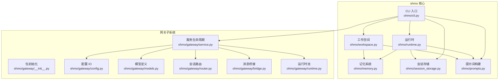
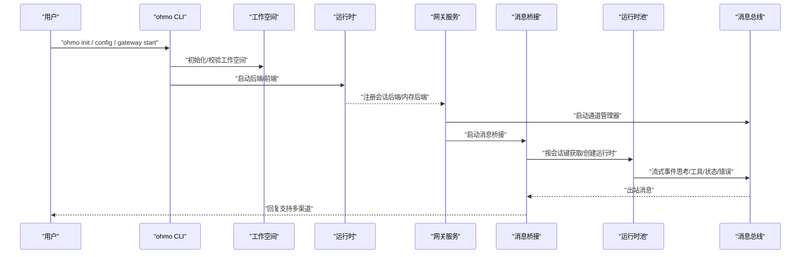
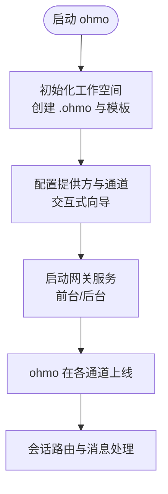
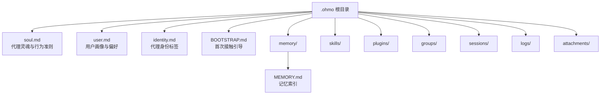
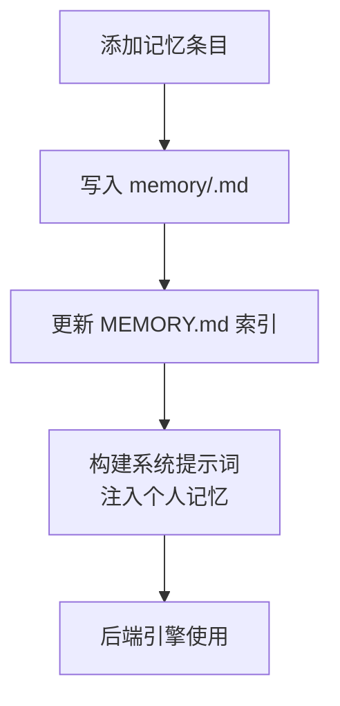
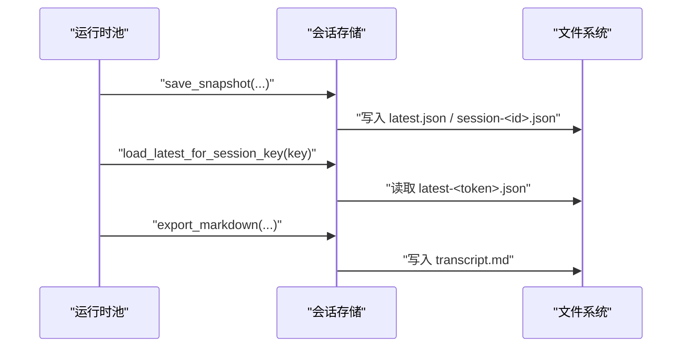
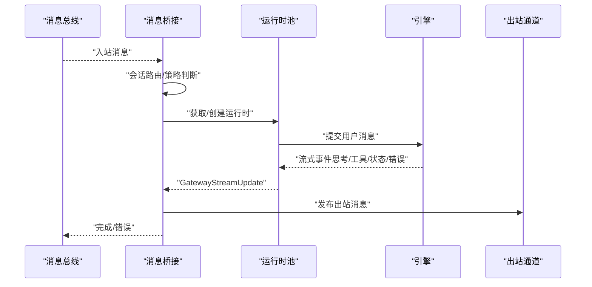
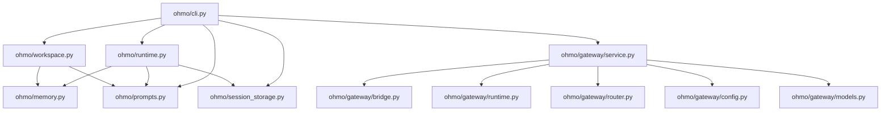

# ohmo个人代理

<cite>
**本文档引用的文件**
- [README.md](file://README.md)
- [ohmo/__main__.py](file://ohmo/__main__.py)
- [ohmo/cli.py](file://ohmo/cli.py)
- [ohmo/workspace.py](file://ohmo/workspace.py)
- [ohmo/memory.py](file://ohmo/memory.py)
- [ohmo/runtime.py](file://ohmo/runtime.py)
- [ohmo/session_storage.py](file://ohmo/session_storage.py)
- [ohmo/prompts.py](file://ohmo/prompts.py)
- [ohmo/gateway/__init__.py](file://ohmo/gateway/__init__.py)
- [ohmo/gateway/config.py](file://ohmo/gateway/config.py)
- [ohmo/gateway/models.py](file://ohmo/gateway/models.py)
- [ohmo/gateway/service.py](file://ohmo/gateway/service.py)
- [ohmo/gateway/router.py](file://ohmo/gateway/router.py)
- [ohmo/gateway/bridge.py](file://ohmo/gateway/bridge.py)
- [ohmo/gateway/runtime.py](file://ohmo/gateway/runtime.py)
</cite>

## 目录
1. [简介](#简介)
2. [项目结构](#项目结构)
3. [核心组件](#核心组件)
4. [架构总览](#架构总览)
5. [详细组件分析](#详细组件分析)
6. [依赖关系分析](#依赖关系分析)
7. [性能考虑](#性能考虑)
8. [故障排查指南](#故障排查指南)
9. [结论](#结论)
10. [附录](#附录)

## 简介
ohmo 是一个基于 OpenHarness 构建的个人智能代理，专注于在长对话与多渠道环境中持续工作。它不是简单的聊天机器人，而是一个能真正为你工作的助手：在 Feishu、Slack、Telegram、Discord 等多个即时通讯平台保持活跃，能够分叉分支、编写代码、运行测试并自动提交 PR。ohmo 可直接复用你现有的 Claude Code 或 Codex 订阅，无需额外 API 密钥。

ohmo 的独特价值在于：
- 长期会话能力：通过会话持久化与记忆系统，确保跨轮次的一致性与上下文连续性
- 多渠道集成：统一网关桥接不同 IM 平台，实现一致的交互体验
- 个人工作空间：以 .ohmo 为中心的个人知识库、身份设定与记忆管理
- 轻量可扩展：基于 OpenHarness 的工具链、权限与插件生态，便于定制与扩展

## 项目结构
ohmo 位于仓库的 ohmo 子目录中，围绕“个人工作空间 + 网关系统 + 身份配置 + 记忆管理”的核心概念组织。主要模块职责如下：
- 命令行入口与子命令：提供初始化、配置、网关控制、内存与用户文件管理等 CLI 功能
- 个人工作空间：负责 .ohmo 根目录、模板文件、路径解析与健康检查
- 记忆系统：个人记忆条目管理与注入到系统提示词
- 运行时：封装后端引擎与前端 TUI 的启动流程
- 会话存储：会话快照、历史列表与导出
- 提示词构建：整合 soul、identity、user、bootstrap 与个人记忆
- 网关系统：消息桥接、通道管理、运行时池与状态管理

图表来源
- [ohmo/cli.py:1-676](file://ohmo/cli.py#L1-L676)
- [ohmo/workspace.py:1-320](file://ohmo/workspace.py#L1-L320)
- [ohmo/memory.py:1-85](file://ohmo/memory.py#L1-L85)
- [ohmo/runtime.py:1-203](file://ohmo/runtime.py#L1-L203)
- [ohmo/session_storage.py:1-203](file://ohmo/session_storage.py#L1-L203)
- [ohmo/prompts.py:1-75](file://ohmo/prompts.py#L1-L75)
- [ohmo/gateway/__init__.py:1-3](file://ohmo/gateway/__init__.py#L1-L3)
- [ohmo/gateway/config.py:1-42](file://ohmo/gateway/config.py#L1-L42)
- [ohmo/gateway/models.py:1-34](file://ohmo/gateway/models.py#L1-L34)
- [ohmo/gateway/service.py:1-429](file://ohmo/gateway/service.py#L1-L429)
- [ohmo/gateway/router.py:1-32](file://ohmo/gateway/router.py#L1-L32)
- [ohmo/gateway/bridge.py:1-409](file://ohmo/gateway/bridge.py#L1-L409)
- [ohmo/gateway/runtime.py:1-800](file://ohmo/gateway/runtime.py#L1-L800)

章节来源
- [README.md:647-703](file://README.md#L647-L703)
- [ohmo/__main__.py:1-9](file://ohmo/__main__.py#L1-L9)
- [ohmo/cli.py:1-676](file://ohmo/cli.py#L1-L676)

## 核心组件
本节聚焦 ohmo 的关键构件及其职责与协作方式。

- 命令行入口与子命令
  - 提供主命令与子命令组：memory、soul、user、gateway
  - 支持交互式向导进行提供方与通道配置
  - 支持打印模式、后端模式与 React TUI 启动
  - 支持 doctor 健康检查与网关状态查询

- 个人工作空间
  - 定义 .ohmo 根目录与各子目录（memory、skills、plugins、groups、sessions、logs、attachments）
  - 初始化模板文件：soul.md、user.md、identity.md、BOOTSTRAP.md、MEMORY.md
  - 写入 state.json 与 gateway.json，并提供健康检查

- 记忆系统
  - 列表、添加、删除个人记忆条目
  - 将 MEMORY.md 与若干记忆文件内容注入到系统提示词中
  - 提供内存命令后端，绑定到 ohmo 的个人记忆存储

- 运行时
  - 后端模式：构建并运行共享后端主机
  - 打印模式：执行单次提示并输出结果
  - React TUI：启动前端并传入后端命令参数

- 会话存储
  - 保存会话快照（包含消息、用量、工具元数据）
  - 加载最新会话、按会话键加载、列出会话
  - 导出 Markdown 转录

- 提示词构建
  - 组合基础系统提示、ohmo 灵魂、身份、用户档案、首次引导与个人记忆
  - 支持可选注入项目级记忆

- 网关系统
  - 配置 IO：读取/写入 gateway.json，映射到通道兼容模型
  - 模型定义：网关配置与状态的数据结构
  - 服务生命周期：前台/后台运行、进程管理、状态写入与重启通知
  - 消息桥接：消费入站消息、发布出站回复、中断会话、错误格式化
  - 会话路由：按通道/聊天类型/线程/发送者区分会话键
  - 运行时池：按会话键维护 RuntimeBundle，流式产出进度与最终回复

章节来源
- [ohmo/cli.py:37-676](file://ohmo/cli.py#L37-L676)
- [ohmo/workspace.py:163-320](file://ohmo/workspace.py#L163-L320)
- [ohmo/memory.py:13-85](file://ohmo/memory.py#L13-L85)
- [ohmo/runtime.py:28-203](file://ohmo/runtime.py#L28-L203)
- [ohmo/session_storage.py:41-203](file://ohmo/session_storage.py#L41-L203)
- [ohmo/prompts.py:27-75](file://ohmo/prompts.py#L27-L75)
- [ohmo/gateway/config.py:13-42](file://ohmo/gateway/config.py#L13-L42)
- [ohmo/gateway/models.py:8-34](file://ohmo/gateway/models.py#L8-L34)
- [ohmo/gateway/service.py:39-429](file://ohmo/gateway/service.py#L39-L429)
- [ohmo/gateway/bridge.py:56-409](file://ohmo/gateway/bridge.py#L56-L409)
- [ohmo/gateway/router.py:8-32](file://ohmo/gateway/router.py#L8-L32)
- [ohmo/gateway/runtime.py:91-800](file://ohmo/gateway/runtime.py#L91-L800)

## 架构总览
ohmo 的整体架构由“个人工作空间 + 网关系统 + 身份配置 + 记忆管理”构成，通过 CLI 与后端引擎协同，实现多渠道消息的统一接入与处理。

图表来源
- [ohmo/cli.py:414-490](file://ohmo/cli.py#L414-L490)
- [ohmo/workspace.py:252-301](file://ohmo/workspace.py#L252-L301)
- [ohmo/runtime.py:28-138](file://ohmo/runtime.py#L28-L138)
- [ohmo/gateway/service.py:39-232](file://ohmo/gateway/service.py#L39-L232)
- [ohmo/gateway/bridge.py:77-323](file://ohmo/gateway/bridge.py#L77-L323)
- [ohmo/gateway/runtime.py:212-484](file://ohmo/gateway/runtime.py#L212-L484)

## 详细组件分析

### 命令行与初始化流程
- 主入口：通过 python -m ohmo 调用 CLI 应用
- 初始化：创建 .ohmo 根目录与模板文件，写入默认 gateway.json
- doctor：检查工作空间与提供方就绪状态
- 网关控制：start/stop/restart/status/run，支持前台运行与后台进程管理

图表来源
- [ohmo/__main__.py:1-9](file://ohmo/__main__.py#L1-L9)
- [ohmo/cli.py:493-560](file://ohmo/cli.py#L493-L560)
- [ohmo/workspace.py:252-301](file://ohmo/workspace.py#L252-L301)
- [ohmo/gateway/service.py:235-275](file://ohmo/gateway/service.py#L235-L275)

章节来源
- [ohmo/__main__.py:1-9](file://ohmo/__main__.py#L1-L9)
- [ohmo/cli.py:493-676](file://ohmo/cli.py#L493-L676)
- [ohmo/workspace.py:252-301](file://ohmo/workspace.py#L252-L301)

### 个人工作空间与核心文件
- .ohmo 根目录：包含 soul.md、user.md、identity.md、BOOTSTRAP.md、MEMORY.md、memory/、skills/、plugins/、groups/、sessions/、logs/、attachments/
- 初始化时自动生成模板文件与默认 gateway.json
- 健康检查：验证关键资产是否存在

图表来源
- [ohmo/workspace.py:11-160](file://ohmo/workspace.py#L11-L160)
- [ohmo/workspace.py:252-301](file://ohmo/workspace.py#L252-L301)

章节来源
- [ohmo/workspace.py:11-160](file://ohmo/workspace.py#L11-L160)
- [ohmo/workspace.py:252-301](file://ohmo/workspace.py#L252-L301)

### 记忆管理与注入
- 个人记忆：以 .md 文件形式存放在 memory/，并同步更新 MEMORY.md 索引
- 注入策略：在系统提示词中插入 MEMORY.md 与若干记忆文件片段
- 命令后端：将 /memory 命令绑定到个人记忆存储

图表来源
- [ohmo/memory.py:19-85](file://ohmo/memory.py#L19-L85)
- [ohmo/prompts.py:66-74](file://ohmo/prompts.py#L66-L74)

章节来源
- [ohmo/memory.py:19-85](file://ohmo/memory.py#L19-L85)
- [ohmo/prompts.py:66-74](file://ohmo/prompts.py#L66-L74)

### 提示词构建与系统提示
- 组装顺序：基础系统提示 + 额外指令 + soul/identity/user/bootstrap + 工作区说明 + 个人记忆（可选项目记忆）
- 作用：为每次会话提供稳定的上下文与角色定位

章节来源
- [ohmo/prompts.py:27-75](file://ohmo/prompts.py#L27-L75)

### 会话存储与恢复
- 快照保存：包含消息、用量、工具元数据、摘要与时间戳
- 恢复机制：按会话键或 session_id 加载最新快照
- 导出：支持导出 Markdown 转录

图表来源
- [ohmo/session_storage.py:41-148](file://ohmo/session_storage.py#L41-L148)
- [ohmo/gateway/runtime.py:595-621](file://ohmo/gateway/runtime.py#L595-L621)

章节来源
- [ohmo/session_storage.py:41-148](file://ohmo/session_storage.py#L41-L148)
- [ohmo/gateway/runtime.py:595-621](file://ohmo/gateway/runtime.py#L595-L621)

### 网关系统与消息桥接
- 配置映射：将 ohmo 的 gateway.json 映射到通道兼容模型，启用指定通道并注入配置
- 生命周期：前台运行、后台进程、状态写入、重启通知
- 桥接逻辑：消费入站消息、按会话键调度运行时、流式发布出站消息、错误格式化与中断处理
- 会话路由：根据聊天类型、线程与发送者生成稳定会话键，避免共享聊天中的上下文混淆

图表来源
- [ohmo/gateway/bridge.py:77-323](file://ohmo/gateway/bridge.py#L77-L323)
- [ohmo/gateway/router.py:8-32](file://ohmo/gateway/router.py#L8-L32)
- [ohmo/gateway/runtime.py:212-484](file://ohmo/gateway/runtime.py#L212-L484)
- [ohmo/gateway/service.py:191-232](file://ohmo/gateway/service.py#L191-L232)

章节来源
- [ohmo/gateway/config.py:29-42](file://ohmo/gateway/config.py#L29-L42)
- [ohmo/gateway/service.py:39-232](file://ohmo/gateway/service.py#L39-L232)
- [ohmo/gateway/bridge.py:77-323](file://ohmo/gateway/bridge.py#L77-L323)
- [ohmo/gateway/router.py:8-32](file://ohmo/gateway/router.py#L8-L32)
- [ohmo/gateway/runtime.py:212-484](file://ohmo/gateway/runtime.py#L212-L484)

### 多渠道集成与通道配置
- 支持通道：Telegram、Slack、Discord、Feishu
- 配置项：每个通道的令牌/密钥、回复策略、线程/群组策略、允许来源等
- 交互式向导：在终端内选择提供方与通道，逐项配置并保存到 gateway.json

章节来源
- [ohmo/cli.py:53-360](file://ohmo/cli.py#L53-L360)
- [ohmo/gateway/config.py:29-42](file://ohmo/gateway/config.py#L29-L42)

### 身份配置与运行时注入
- soul.md：定义代理的核心真相、边界与气质
- identity.md：简洁的身份标签
- user.md：用户画像与偏好
- 这些文件被注入到系统提示词中，确保代理行为与用户期望一致

章节来源
- [ohmo/workspace.py:11-116](file://ohmo/workspace.py#L11-L116)
- [ohmo/prompts.py:41-55](file://ohmo/prompts.py#L41-L55)

## 依赖关系分析
ohmo 的模块间依赖清晰，遵循“CLI → 工作空间/运行时/会话存储/记忆/提示词 → 网关系统”的层次化设计，耦合度低、内聚性强。

图表来源
- [ohmo/cli.py:12-34](file://ohmo/cli.py#L12-L34)
- [ohmo/runtime.py:17-20](file://ohmo/runtime.py#L17-L20)
- [ohmo/session_storage.py:14-21](file://ohmo/session_storage.py#L14-L21)
- [ohmo/memory.py:8-10](file://ohmo/memory.py#L8-L10)
- [ohmo/gateway/service.py:23-33](file://ohmo/gateway/service.py#L23-L33)

章节来源
- [ohmo/cli.py:12-34](file://ohmo/cli.py#L12-L34)
- [ohmo/runtime.py:17-20](file://ohmo/runtime.py#L17-L20)
- [ohmo/session_storage.py:14-21](file://ohmo/session_storage.py#L14-L21)
- [ohmo/memory.py:8-10](file://ohmo/memory.py#L8-L10)
- [ohmo/gateway/service.py:23-33](file://ohmo/gateway/service.py#L23-L33)

## 性能考虑
- 会话复用：按会话键缓存 RuntimeBundle，减少重复初始化开销
- 流式输出：通过事件驱动的流式渲染，降低延迟与内存占用
- 上下文压缩：结合 OpenHarness 的自动压缩与任务状态保留，支持长时间会话
- 图像输入降级：当模型不支持图像输入时自动回退，避免失败重试成本
- 进程管理：后台网关采用独立进程与日志分离，便于监控与资源控制

## 故障排查指南
- 网关错误格式化：针对常见认证问题（如 Claude 凭据过期、缺失凭据）给出明确提示
- 状态查询：通过 gateway status 查看运行状态、PID、活动会话数与最后错误
- 健康检查：doctor 输出工作空间、配置与提供方状态
- 重启通知：在网关重启后发布“已恢复”通知，确保用户感知
- 中断与取消：支持 /stop 与 /restart 命令，优雅中断当前任务并可触发重启

章节来源
- [ohmo/gateway/bridge.py:29-53](file://ohmo/gateway/bridge.py#L29-L53)
- [ohmo/gateway/service.py:394-428](file://ohmo/gateway/service.py#L394-L428)
- [ohmo/cli.py:536-560](file://ohmo/cli.py#L536-L560)
- [ohmo/gateway/service.py:145-190](file://ohmo/gateway/service.py#L145-L190)

## 结论
ohmo 以 OpenHarness 为基础，构建了面向个人用户的智能代理体系。通过统一的个人工作空间、强大的网关桥接与运行时池、完善的记忆与会话管理，ohmo 能够在多渠道环境中长期稳定地提供高质量的智能服务。其设计强调可配置、可观测与可扩展，既适合日常使用，也为高级用户提供了深度定制的空间。

## 附录

### ohmo 初始化、配置与启动流程
- 初始化工作空间：创建 .ohmo 根目录与模板文件，写入默认 gateway.json
- 配置提供方与通道：交互式向导选择提供方与通道，保存到 gateway.json
- 启动网关：前台运行或后台进程，注册通道管理器与消息桥接
- doctor 健康检查：输出工作空间、配置与提供方状态

章节来源
- [ohmo/workspace.py:252-301](file://ohmo/workspace.py#L252-L301)
- [ohmo/cli.py:493-560](file://ohmo/cli.py#L493-L560)
- [ohmo/gateway/service.py:235-275](file://ohmo/gateway/service.py#L235-L275)

### 支持的聊天渠道与配置要点
- Telegram：机器人令牌、是否回复原消息
- Slack：Bot/App 令牌、Socket 模式、线程回复策略、群组策略
- Discord：机器人令牌、网关 URL、意图位掩码、群组策略
- Feishu：应用 ID/密钥、加密密钥、验证令牌、反应表情、群组策略、机器人名称与 open_id

章节来源
- [ohmo/cli.py:194-316](file://ohmo/cli.py#L194-L316)
- [ohmo/gateway/config.py:29-42](file://ohmo/gateway/config.py#L29-L42)

### 通过现有 Claude Code/Codex 订阅运行
- ohmo 默认使用 codex 提供方配置，可直接复用本地 ~/.codex/auth.json
- 通过 ohmo config 或 provider 切换与配置，无需额外 API Key

章节来源
- [README.md:305-324](file://README.md#L305-L324)
- [ohmo/workspace.py:279-300](file://ohmo/workspace.py#L279-L300)