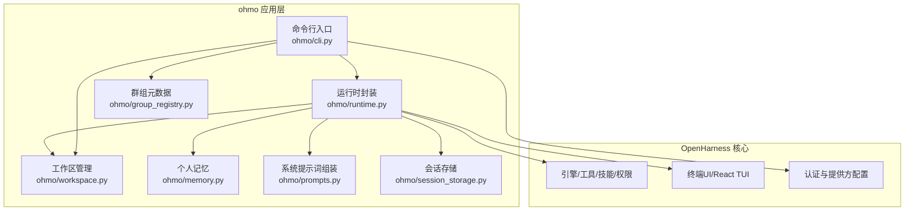
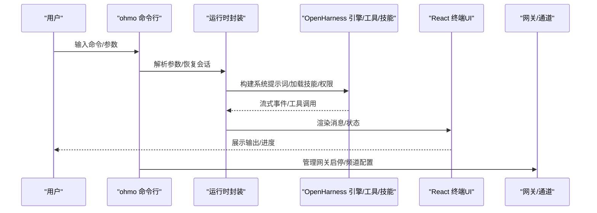
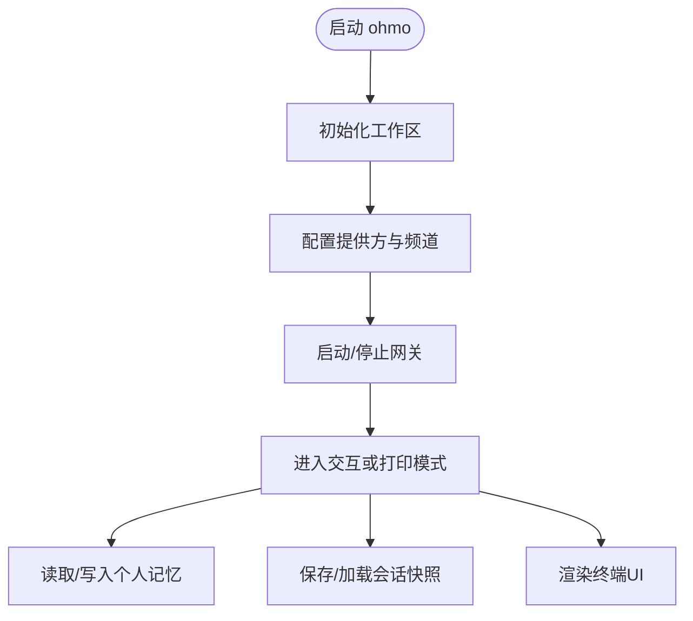
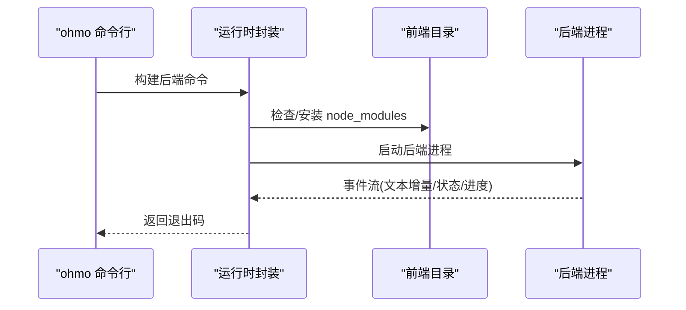
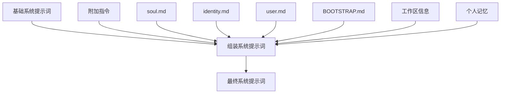
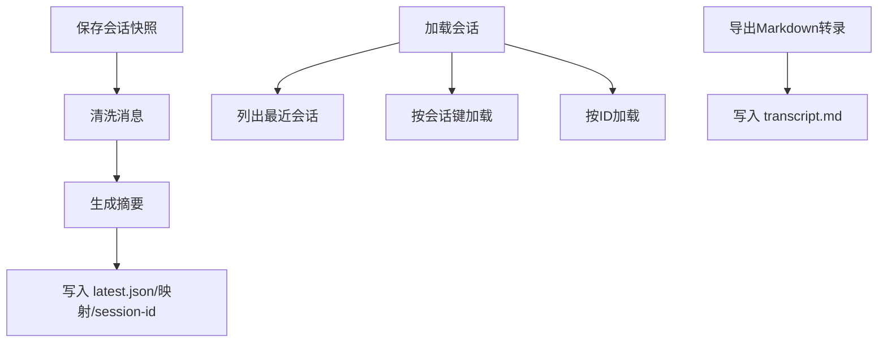
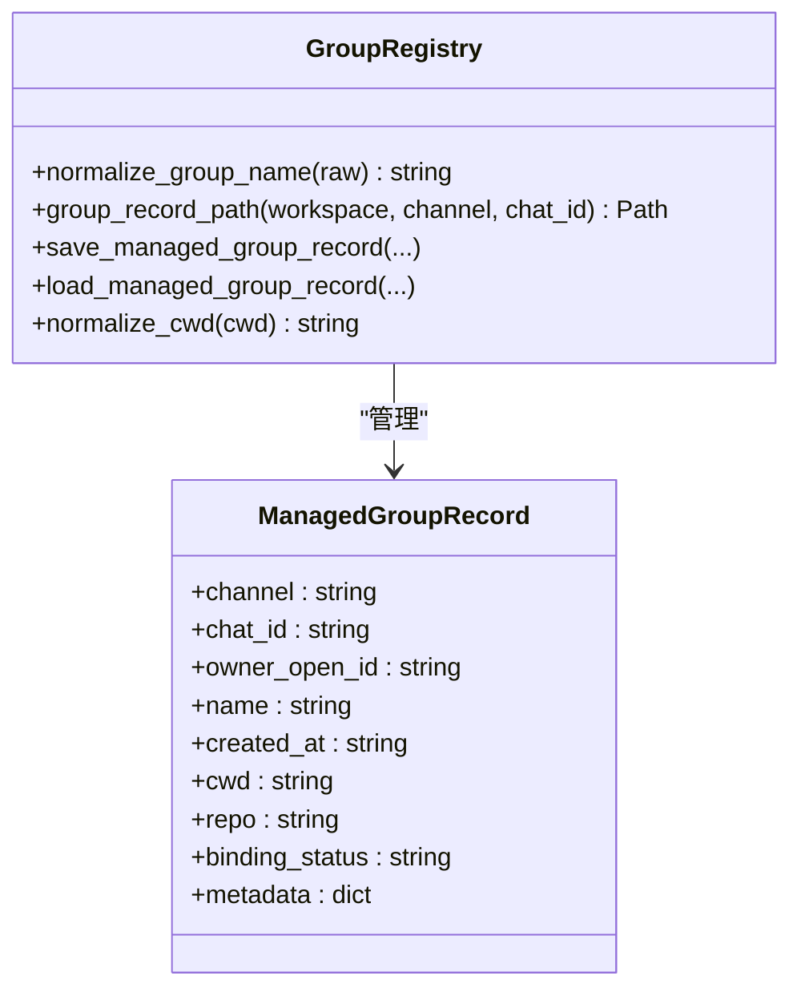
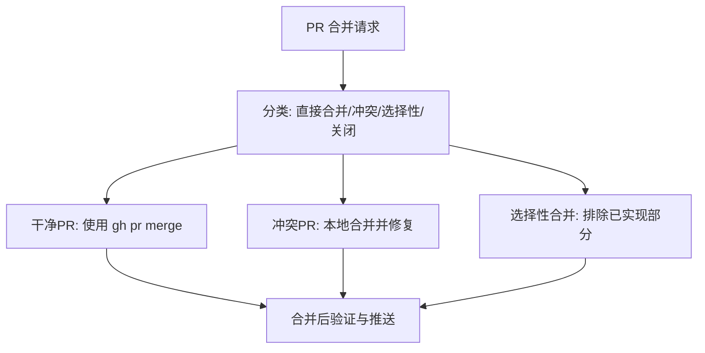
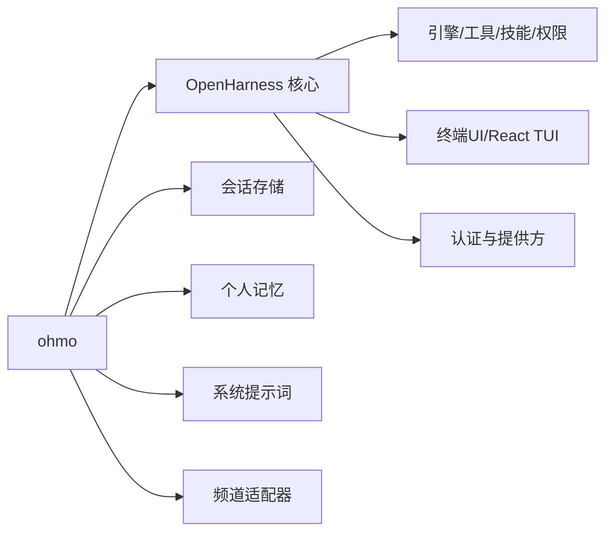

# ohmo简介

<cite>
**本文引用的文件**
- [README.md](file://README.md)
- [ohmo/__main__.py](file://ohmo/__main__.py)
- [ohmo/cli.py](file://ohmo/cli.py)
- [ohmo/runtime.py](file://ohmo/runtime.py)
- [ohmo/memory.py](file://ohmo/memory.py)
- [ohmo/session_storage.py](file://ohmo/session_storage.py)
- [ohmo/prompts.py](file://ohmo/prompts.py)
- [ohmo/workspace.py](file://ohmo/workspace.py)
- [ohmo/group_registry.py](file://ohmo/group_registry.py)
- [.claude/skills/harness-eval/SKILL.md](file://.claude/skills/harness-eval/SKILL.md)
- [.claude/skills/pr-merge/SKILL.md](file://.claude/skills/pr-merge/SKILL.md)
- [src/openharness/skills/bundled/content/commit.md](file://src/openharness/skills/bundled/content/commit.md)
- [src/openharness/skills/bundled/content/test.md](file://src/openharness/skills/bundled/content/test.md)
</cite>

## 目录
1. [引言](#引言)
2. [项目结构](#项目结构)
3. [核心组件](#核心组件)
4. [架构总览](#架构总览)
5. [详细组件分析](#详细组件分析)
6. [依赖分析](#依赖分析)
7. [性能考量](#性能考量)
8. [故障排查指南](#故障排查指南)
9. [结论](#结论)
10. [附录](#附录)

## 引言
ohmo 是一个基于 OpenHarness 构建的“个人AI代理”，并非普通的聊天机器人，而是能够在长期对话中持续工作的智能助手。它支持多渠道（如飞书、Slack、Telegram、Discord）交互，在会话中可执行分支管理、代码编写、测试运行、PR 创建等复杂任务。ohmo 无需额外 API 密钥，可直接复用用户已有的 Claude Code 或 Codex 订阅。

与传统聊天机器人相比，ohmo 的核心差异在于：
- 长期连续性：通过会话持久化与个人记忆系统，实现跨轮次上下文延续
- 工作流自动化：内置技能与工具链，能自动完成从编码到测试再到 PR 的闭环
- 个人化定制：通过 soul.md、user.md、identity.md 等文件塑造稳定的人格与偏好
- 安全可控：权限模式与路径规则确保操作安全，适合在真实工程环境中使用

适用场景包括但不限于：
- 日常技术问答与知识整理
- 代码审查与重构建议
- 小步快跑的迭代开发（分支、提交、测试、PR）
- 跨团队协作中的信息同步与任务推进

## 项目结构
ohmo 作为 OpenHarness 的个人化应用，采用模块化设计，围绕“工作区（workspace）—会话（session）—提示词（prompt）—工具与技能（tools & skills）—网关（gateway）”展开。

图示来源
- [ohmo/cli.py:37-491](file://ohmo/cli.py#L37-L491)
- [ohmo/runtime.py:28-61](file://ohmo/runtime.py#L28-L61)
- [ohmo/workspace.py:163-301](file://ohmo/workspace.py#L163-L301)
- [ohmo/memory.py:13-85](file://ohmo/memory.py#L13-L85)
- [ohmo/prompts.py:27-75](file://ohmo/prompts.py#L27-L75)
- [ohmo/session_storage.py:41-102](file://ohmo/session_storage.py#L41-L102)

章节来源
- [README.md:647-703](file://README.md#L647-L703)
- [ohmo/__main__.py:1-9](file://ohmo/__main__.py#L1-L9)
- [ohmo/cli.py:37-491](file://ohmo/cli.py#L37-L491)
- [ohmo/workspace.py:163-301](file://ohmo/workspace.py#L163-L301)

## 核心组件
- 命令行入口与子命令
  - 提供初始化、配置、医生检查、内存与 soul/user 文件管理、网关启停等子命令
  - 支持交互式向导与非交互模式，便于脚本与管道集成
- 运行时与UI
  - 后端主机封装与 React 终端 UI 启动流程，支持打印模式与交互模式
  - 自动安装前端依赖并以进程方式启动
- 工作区与模板
  - 初始化 .ohmo 工作区，生成 soul.md、user.md、identity.md、BOOTSTRAP.md、MEMORY.md 等模板
  - 管理 skills、plugins、groups、sessions、logs、attachments 等目录
- 个人记忆
  - 读取/写入 MEMORY.md 与 memory 目录下的个人记忆条目，支持索引与检索
- 系统提示词组装
  - 将基础系统提示词与 ohmo 个人资料、工作区信息、个人记忆合并为最终系统提示
- 会话存储
  - 保存/加载会话快照，支持按会话键与最新会话映射，导出 Markdown 转录
- 群组元数据
  - 记录由 ohmo 创建与管理的聊天群组元信息，便于后续绑定与追踪

章节来源
- [ohmo/cli.py:37-491](file://ohmo/cli.py#L37-L491)
- [ohmo/runtime.py:28-139](file://ohmo/runtime.py#L28-L139)
- [ohmo/workspace.py:163-301](file://ohmo/workspace.py#L163-L301)
- [ohmo/memory.py:13-85](file://ohmo/memory.py#L13-L85)
- [ohmo/prompts.py:27-75](file://ohmo/prompts.py#L27-L75)
- [ohmo/session_storage.py:41-203](file://ohmo/session_storage.py#L41-L203)
- [ohmo/group_registry.py:15-96](file://ohmo/group_registry.py#L15-L96)

## 架构总览
ohmo 的运行时由“命令行入口 → 运行时封装 → OpenHarness 引擎/工具/技能/权限 → UI/网关”构成。系统提示词由基础提示词与 ohmo 个人资料、记忆共同拼装；会话持久化与个人记忆贯穿整个生命周期。

图示来源
- [ohmo/cli.py:414-491](file://ohmo/cli.py#L414-L491)
- [ohmo/runtime.py:86-139](file://ohmo/runtime.py#L86-L139)
- [README.md:647-703](file://README.md#L647-L703)

## 详细组件分析

### 命令行与工作区管理
- 初始化与配置
  - 初始化 .ohmo 工作区，生成模板文件与默认网关配置
  - 交互式向导选择提供方档案、启用/配置频道、远程管理命令白名单等
- 医生检查
  - 输出工作区健康状态、可用提供方档案列表、当前工作目录与工作区根路径
- 内存与 soul/user 管理
  - 列表、新增、删除个人记忆条目
  - 查看/编辑 soul.md 与 user.md，用于塑造代理人格与用户画像
- 网关管理
  - 前台运行、后台启动/停止/重启、查看状态

图示来源
- [ohmo/cli.py:493-676](file://ohmo/cli.py#L493-L676)
- [ohmo/workspace.py:252-301](file://ohmo/workspace.py#L252-L301)

章节来源
- [ohmo/cli.py:493-676](file://ohmo/cli.py#L493-L676)
- [ohmo/workspace.py:252-301](file://ohmo/workspace.py#L252-L301)

### 运行时与UI
- 后端主机封装
  - 注入系统提示词、会话后端、个人记忆后端、额外技能/插件目录
  - 可选打印模式：单次提示后退出，标准输出展示助手文本
- React 终端UI
  - 自动检测/安装前端依赖，通过环境变量传递后端命令
  - 子进程启动 TSX 入口，统一前后端协议

图示来源
- [ohmo/runtime.py:63-139](file://ohmo/runtime.py#L63-L139)

章节来源
- [ohmo/runtime.py:28-139](file://ohmo/runtime.py#L28-L139)

### 个人记忆与系统提示词
- 个人记忆
  - 自动生成 slug 文件名，维护 MEMORY.md 索引，限制最大文件数量
  - 作为系统提示词的一部分注入，增强长期上下文稳定性
- 系统提示词组装
  - 合并基础系统提示词、附加指令、soul/identity/user/bootstrap、工作区信息与个人记忆

图示来源
- [ohmo/prompts.py:27-75](file://ohmo/prompts.py#L27-L75)
- [ohmo/memory.py:51-85](file://ohmo/memory.py#L51-L85)

章节来源
- [ohmo/prompts.py:27-75](file://ohmo/prompts.py#L27-L75)
- [ohmo/memory.py:51-85](file://ohmo/memory.py#L51-L85)

### 会话存储与恢复
- 快照保存
  - 清洗消息、生成摘要、记录模型/用量/工具元数据
  - 同时写入 latest.json、latest-key 映射与 session-id 文件
- 加载与导出
  - 支持按会话键/最新会话/指定ID加载
  - 导出 Markdown 转录，便于归档与复盘

图示来源
- [ohmo/session_storage.py:41-149](file://ohmo/session_storage.py#L41-L149)

章节来源
- [ohmo/session_storage.py:41-203](file://ohmo/session_storage.py#L41-L203)

### 群组元数据与频道集成
- 群组记录
  - 记录频道、聊天ID、所有者、名称、创建时间、工作目录、仓库、绑定状态与元数据
  - 规范化群组名与工作目录路径，保证安全性与一致性
- 频道配置
  - 支持 Telegram、Slack、Discord、Feishu 的令牌、策略与权限设置
  - 可配置允许来源、线程回复、群组策略等

图示来源
- [ohmo/group_registry.py:15-96](file://ohmo/group_registry.py#L15-L96)

章节来源
- [ohmo/group_registry.py:15-96](file://ohmo/group_registry.py#L15-L96)

### 技能与工作流（与PR/测试/提交相关）
- PR 合并
  - 优先保留作者署名，合并后再解决冲突；支持选择性合并与关闭重复PR
  - 合并后进行验证与报告生成
- 测试
  - 编写与运行测试，遵循独立、确定性、快速等原则
- 提交
  - 清晰的提交信息与文件选择，避免敏感信息与大文件

图示来源
- [.claude/skills/pr-merge/SKILL.md:18-76](file://.claude/skills/pr-merge/SKILL.md#L18-L76)

章节来源
- [.claude/skills/pr-merge/SKILL.md:1-100](file://.claude/skills/pr-merge/SKILL.md#L1-L100)
- [src/openharness/skills/bundled/content/test.md:1-32](file://src/openharness/skills/bundled/content/test.md#L1-L32)
- [src/openharness/skills/bundled/content/commit.md:1-26](file://src/openharness/skills/bundled/content/commit.md#L1-L26)

## 依赖分析
- ohmo 与 OpenHarness 的耦合点
  - 运行时通过 OpenHarness 的引擎/工具/权限与 UI 子系统提供能力
  - 会话后端与记忆后端对接 OpenHarness 的会话存储与命令后端
- 外部依赖
  - 提供方档案（Anthropic-compatible、OpenAI-compatible、Codex、GitHub Copilot 等）
  - 频道适配器（Telegram、Slack、Discord、Feishu）

图示来源
- [ohmo/runtime.py:45-60](file://ohmo/runtime.py#L45-L60)
- [ohmo/cli.py:12-34](file://ohmo/cli.py#L12-L34)

章节来源
- [ohmo/runtime.py:28-61](file://ohmo/runtime.py#L28-L61)
- [ohmo/cli.py:12-34](file://ohmo/cli.py#L12-L34)

## 性能考量
- 上下文压缩与自动紧凑
  - 在长时间会话中保持任务状态与频道日志，减少频繁清理带来的上下文丢失
- 并行工具执行与重试机制
  - 工具并发执行与指数退避重试，提升整体吞吐与鲁棒性
- 会话快照与增量持久化
  - 仅保存必要字段，避免冗余数据膨胀；支持按会话键快速定位最新会话

## 故障排查指南
- 医生检查
  - 使用 doctor 子命令输出工作区健康状态、提供方档案可用性、当前路径与状态文件位置
- 网关状态与重启
  - 通过 status 查看运行状态；若配置变更，可选择重启以应用新设置
- 会话恢复
  - 使用 --continue 或 --resume 恢复上一次或指定会话；若找不到会话，返回明确错误提示
- 打印模式调试
  - 使用 -p 参数进行一次性提示，结合 stderr 输出的系统消息与进度事件，便于定位问题

章节来源
- [ohmo/cli.py:536-560](file://ohmo/cli.py#L536-L560)
- [ohmo/cli.py:669-676](file://ohmo/cli.py#L669-L676)
- [ohmo/cli.py:436-450](file://ohmo/cli.py#L436-L450)
- [ohmo/runtime.py:141-203](file://ohmo/runtime.py#L141-L203)

## 结论
ohmo 以 OpenHarness 为基础，提供了面向个人用户的完整代理体验：稳定的长期会话、可扩展的个人记忆、开箱即用的频道网关、以及覆盖从编码到PR的工程化工作流。它无需额外 API 密钥，直接复用现有订阅，降低了使用门槛。通过权限模式与路径规则，ohmo 在实用性与安全性之间取得平衡，适合在真实工程场景中长期演进与协作。

## 附录
- 快速开始
  - 初始化工作区、配置提供方与频道、启动网关，即可在多平台与频道中使用
- 对比优势
  - 相较于通用聊天机器人，ohmo 更注重“持续工作”与“工程闭环”，适合需要长期协作与可审计流程的用户

章节来源
- [README.md:243-254](file://README.md#L243-L254)
- [README.md:647-703](file://README.md#L647-L703)