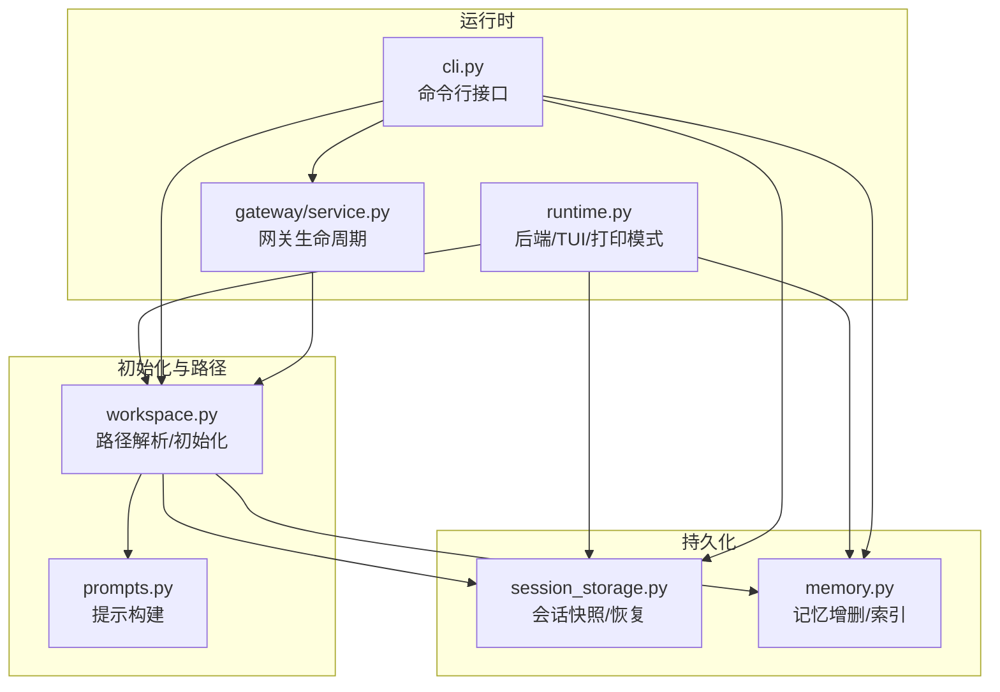
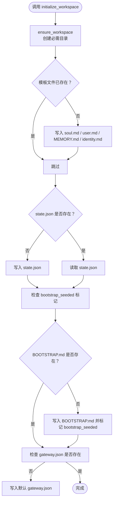
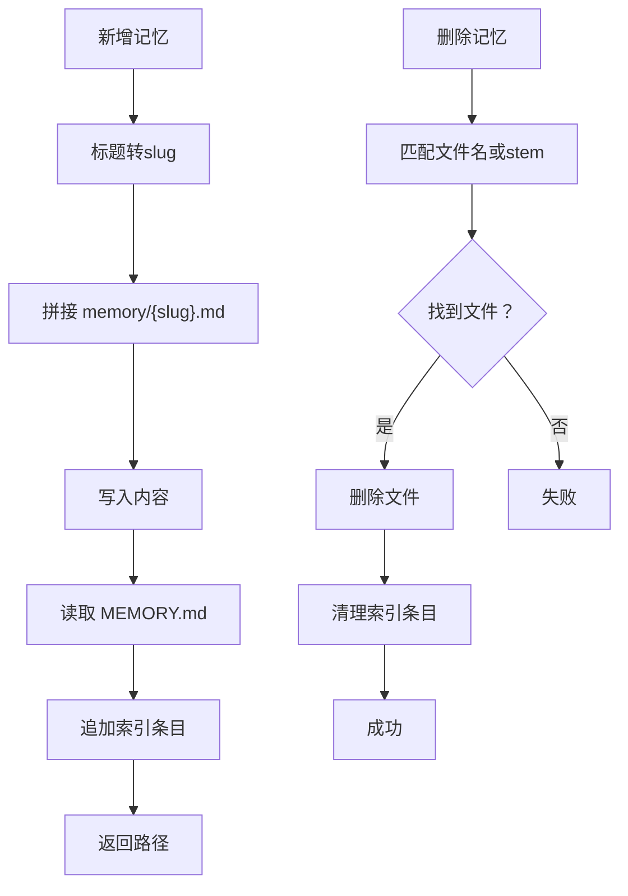
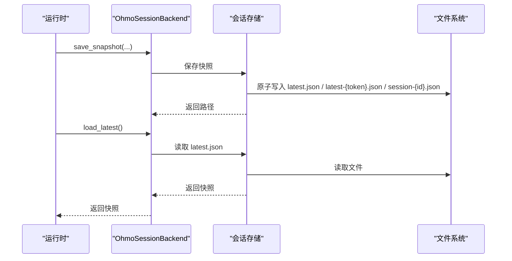
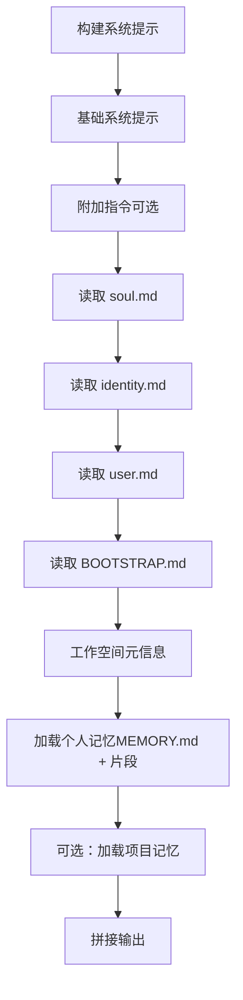
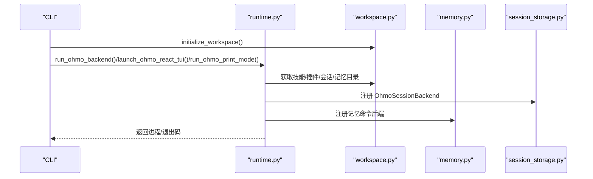
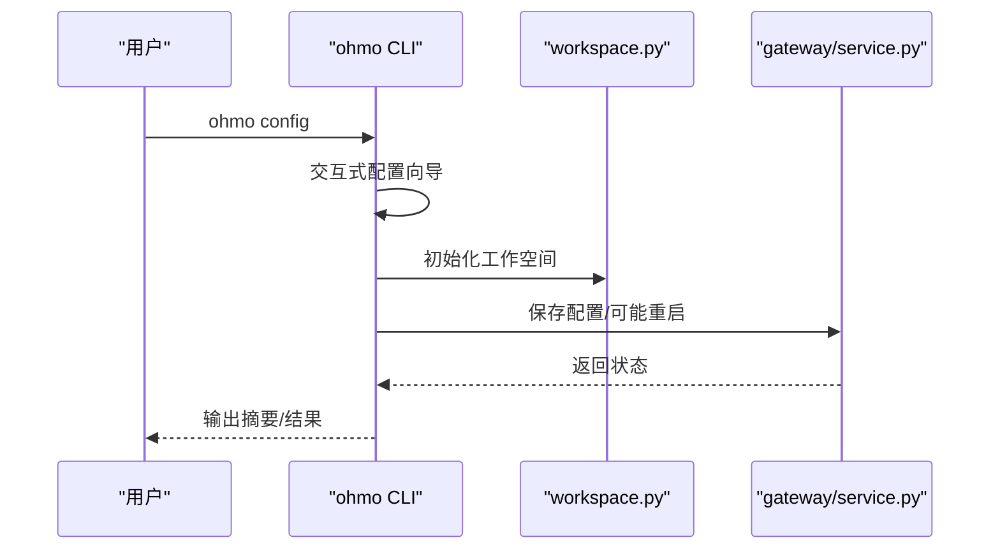
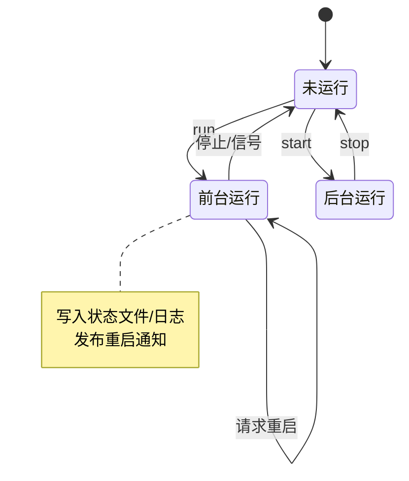
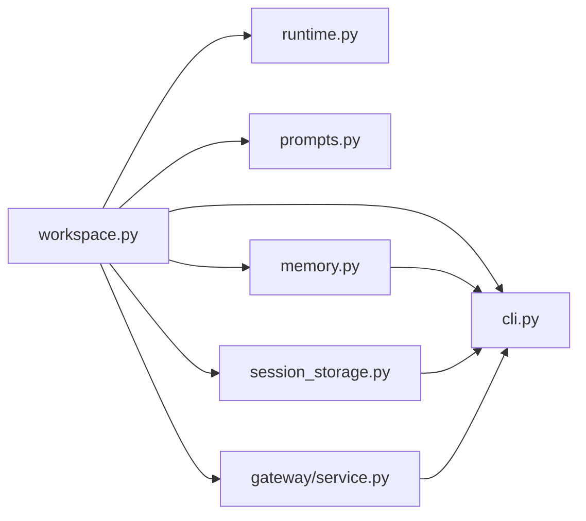

# 工作空间管理

<cite>
**本文引用的文件**
- [workspace.py](file://ohmo/workspace.py)
- [memory.py](file://ohmo/memory.py)
- [session_storage.py](file://ohmo/session_storage.py)
- [prompts.py](file://ohmo/prompts.py)
- [runtime.py](file://ohmo/runtime.py)
- [cli.py](file://ohmo/cli.py)
- [service.py](file://ohmo/gateway/service.py)
- [test_workspace.py](file://tests/test_ohmo/test_workspace.py)
</cite>

## 目录
1. [简介](#简介)
2. [项目结构](#项目结构)
3. [核心组件](#核心组件)
4. [架构总览](#架构总览)
5. [详细组件分析](#详细组件分析)
6. [依赖关系分析](#依赖关系分析)
7. [性能考量](#性能考量)
8. [故障排查指南](#故障排查指南)
9. [结论](#结论)
10. [附录](#附录)

## 简介
本文件面向ohmo个人工作空间管理，系统性阐述~/.ohmo个人工作空间的结构与职责，包括：
- soul.md：长期代理个性与行为准则
- identity.md：代理身份定义
- user.md：用户档案与偏好
- BOOTSTRAP.md：首次运行引导
- memory/：个人记忆库
- sessions/：会话快照与历史
- state.json：工作空间状态
- gateway.json：网关配置
- logs/：日志
- skills/、plugins/、groups/、attachments/：扩展与组织资源

文档覆盖工作空间初始化流程、配置管理、数据持久化机制，并提供创建、编辑、维护与备份迁移的实践指南。

## 项目结构
ohmo工作空间位于用户主目录下的隐藏目录~/.ohmo（或通过环境变量OHMO_WORKSPACE指定）。该目录包含以下关键子目录与文件：
- 根目录：soul.md、identity.md、user.md、BOOTSTRAP.md、MEMORY.md（记忆索引）
- 子目录：memory/（个人记忆）、sessions/（会话快照）、logs/（日志）、skills/（技能）、plugins/（插件）、groups/（群组）、attachments/（附件）
- 配置与状态：state.json、gateway.json、gateway-restart-notice.json、gateway.pid、gateway.log

```mermaid
graph TB
root[".ohmo 根目录"]
soul["soul.md"]
identity["identity.md"]
user["user.md"]
bootstrap["BOOTSTRAP.md"]
memory_dir["memory/"]
sessions_dir["sessions/"]
logs_dir["logs/"]
skills_dir["skills/"]
plugins_dir["plugins/"]
groups_dir["groups/"]
attachments_dir["attachments/"]
state["state.json"]
gw_cfg["gateway.json"]
gw_pid["gateway.pid"]
gw_log["gateway.log"]
gw_restart["gateway-restart-notice.json"]
root --> soul
root --> identity
root --> user
root --> bootstrap
root --> memory_dir
root --> sessions_dir
root --> logs_dir
root --> skills_dir
root --> plugins_dir
root --> groups_dir
root --> attachments_dir
root --> state
root --> gw_cfg
root --> gw_pid
root --> gw_log
root --> gw_restart
```

图表来源
- [workspace.py:163-320](file://ohmo/workspace.py#L163-L320)

章节来源
- [workspace.py:163-320](file://ohmo/workspace.py#L163-L320)

## 核心组件
- 工作空间路径解析与初始化：负责确定工作空间根目录、确保目录存在、生成模板文件与默认配置。
- 记忆管理：提供记忆条目的增删改查、索引维护与提示注入。
- 会话存储：保存会话快照、加载最新会话、导出对话记录。
- 提示构建：整合soul、identity、user、bootstrap与记忆内容，形成系统提示。
- 运行时集成：在启动后端、TUI或打印模式时挂接工作空间语义。
- CLI命令：提供初始化、配置、健康检查、记忆管理、网关控制等命令。
- 网关服务：前台/后台运行网关，维护状态文件与重启通知。

章节来源
- [workspace.py:163-320](file://ohmo/workspace.py#L163-L320)
- [memory.py:13-85](file://ohmo/memory.py#L13-L85)
- [session_storage.py:24-203](file://ohmo/session_storage.py#L24-L203)
- [prompts.py:27-75](file://ohmo/prompts.py#L27-L75)
- [runtime.py:23-203](file://ohmo/runtime.py#L23-L203)
- [cli.py:37-676](file://ohmo/cli.py#L37-L676)
- [service.py:39-429](file://ohmo/gateway/service.py#L39-L429)

## 架构总览
ohmo工作空间管理围绕“路径解析—模板生成—持久化—提示注入—运行时集成”的闭环展开。初始化阶段生成基础文件与配置；运行阶段通过提示构建器将工作空间内容注入系统提示；会话存储模块负责快照与恢复；记忆模块提供可检索的个人知识；CLI与网关服务提供运维与交互入口。

图表来源
- [workspace.py:163-320](file://ohmo/workspace.py#L163-L320)
- [prompts.py:27-75](file://ohmo/prompts.py#L27-L75)
- [session_storage.py:24-203](file://ohmo/session_storage.py#L24-L203)
- [memory.py:13-85](file://ohmo/memory.py#L13-L85)
- [runtime.py:23-203](file://ohmo/runtime.py#L23-L203)
- [cli.py:37-676](file://ohmo/cli.py#L37-L676)
- [service.py:39-429](file://ohmo/gateway/service.py#L39-L429)

## 详细组件分析

### 工作空间路径与初始化
- 路径解析优先级：显式参数 > 环境变量OHMO_WORKSPACE > ~\.ohmo
- 初始化内容：
  - 创建必要目录：memory、skills、plugins、groups、sessions、logs、attachments
  - 写入模板文件：soul.md、user.md、MEMORY.md（记忆索引）、identity.md
  - 写入state.json（应用标识与工作空间路径）
  - 首次运行时写入BOOTSTRAP.md（若未存在）
  - 写入gateway.json（默认网关配置）

图表来源
- [workspace.py:238-301](file://ohmo/workspace.py#L238-L301)

章节来源
- [workspace.py:163-320](file://ohmo/workspace.py#L163-L320)
- [workspace.py:238-301](file://ohmo/workspace.py#L238-L301)
- [test_workspace.py:15-39](file://tests/test_ohmo/test_workspace.py#L15-L39)

### 记忆管理
- 列表：遍历memory/下除MEMORY.md外的所有Markdown文件
- 新增：根据标题生成slug作为文件名，写入内容并追加到MEMORY.md索引
- 删除：删除对应文件并从索引中移除条目
- 加载：构建包含MEMORY.md索引与若干最近记忆片段的提示段落

图表来源
- [memory.py:19-48](file://ohmo/memory.py#L19-L48)

章节来源
- [memory.py:13-85](file://ohmo/memory.py#L13-L85)

### 会话存储与恢复
- 快照保存：清洗消息、摘要首条用户消息、序列化payload、原子写入latest.json、latest-{token}.json与session-{id}.json
- 最新会话加载：读取latest.json并做负载净化
- 按ID加载：按session_id查找或回退到latest
- 导出：生成会话Markdown转录

图表来源
- [session_storage.py:41-149](file://ohmo/session_storage.py#L41-L149)
- [session_storage.py:151-203](file://ohmo/session_storage.py#L151-L203)

章节来源
- [session_storage.py:24-203](file://ohmo/session_storage.py#L24-L203)

### 提示构建与上下文注入
- 从工作空间读取soul、identity、user、bootstrap
- 组合项目记忆与个人记忆（MEMORY.md与若干记忆片段）
- 附加工作空间元信息与额外指令

图表来源
- [prompts.py:27-75](file://ohmo/prompts.py#L27-L75)

章节来源
- [prompts.py:27-75](file://ohmo/prompts.py#L27-L75)

### 运行时集成
- 后端运行：挂接工作空间根目录、技能/插件目录、会话后端、内存后端
- TUI启动：准备前端命令、环境变量与后端命令
- 打印模式：构建运行时、事件渲染、单轮提示执行

图表来源
- [runtime.py:28-138](file://ohmo/runtime.py#L28-L138)
- [runtime.py:141-203](file://ohmo/runtime.py#L141-L203)

章节来源
- [runtime.py:23-203](file://ohmo/runtime.py#L23-L203)

### CLI命令与运维
- 初始化：创建工作空间与模板文件
- 配置：提供网关配置向导，支持频道启用/禁用与令牌配置
- 健康检查：输出工作空间与可用认证配置
- 记忆管理：列出、新增、删除记忆条目
- 网关控制：前台运行、后台启动/停止/重启、状态查询

图表来源
- [cli.py:493-534](file://ohmo/cli.py#L493-L534)
- [cli.py:628-676](file://ohmo/cli.py#L628-L676)
- [service.py:39-110](file://ohmo/gateway/service.py#L39-L110)

章节来源
- [cli.py:37-676](file://ohmo/cli.py#L37-L676)
- [service.py:39-429](file://ohmo/gateway/service.py#L39-L429)

### 网关生命周期与状态
- 前台运行：写入pid与状态文件，启动通道与桥接，处理信号，必要时原地重启
- 后台启动：派生子进程，重定向日志，记录pid
- 停止：根据pid文件或进程扫描停止进程，清理状态
- 状态：读取pid与状态文件，汇总活跃会话与错误

图表来源
- [service.py:191-232](file://ohmo/gateway/service.py#L191-L232)
- [service.py:235-391](file://ohmo/gateway/service.py#L235-L391)
- [service.py:394-429](file://ohmo/gateway/service.py#L394-L429)

章节来源
- [service.py:39-429](file://ohmo/gateway/service.py#L39-L429)

## 依赖关系分析
- workspace.py被多个模块依赖：runtime.py用于路径与目录解析；prompts.py用于读取工作空间文件；session_storage.py用于会话目录；memory.py用于记忆目录；cli.py与gateway/service.py用于状态与配置文件。
- memory.py依赖workspace.py提供的目录路径与索引文件路径。
- session_storage.py依赖workspace.py的sessions目录。
- runtime.py依赖workspace.py的skills/plugins目录，以及session_storage.py与memory.py。
- cli.py依赖workspace.py、session_storage.py、memory.py与gateway/service.py。
- gateway/service.py依赖workspace.py的状态/日志/重启通知文件。

图表来源
- [workspace.py:163-320](file://ohmo/workspace.py#L163-L320)
- [runtime.py:23-203](file://ohmo/runtime.py#L23-L203)
- [prompts.py:11-17](file://ohmo/prompts.py#L11-L17)
- [session_storage.py:21-28](file://ohmo/session_storage.py#L21-L28)
- [memory.py:10-16](file://ohmo/memory.py#L10-L16)
- [cli.py:26-34](file://ohmo/cli.py#L26-L34)
- [service.py:27-33](file://ohmo/gateway/service.py#L27-L33)

章节来源
- [workspace.py:163-320](file://ohmo/workspace.py#L163-L320)
- [runtime.py:23-203](file://ohmo/runtime.py#L23-L203)
- [prompts.py:11-17](file://ohmo/prompts.py#L11-L17)
- [session_storage.py:21-28](file://ohmo/session_storage.py#L21-L28)
- [memory.py:10-16](file://ohmo/memory.py#L10-L16)
- [cli.py:26-34](file://ohmo/cli.py#L26-L34)
- [service.py:27-33](file://ohmo/gateway/service.py#L27-L33)

## 性能考量
- 文件I/O：会话快照采用原子写入，避免部分写入导致的数据损坏风险。
- 记忆索引：MEMORY.md仅在新增/删除时更新，读取时限制行数与片段大小，降低提示构建开销。
- 会话列表：按修改时间倒序读取，限制数量，避免大规模目录扫描。
- 提示构建：仅在需要时读取工作空间文件，且对内容进行截断与清洗，减少上下文膨胀。

## 故障排查指南
- 工作空间缺失：使用doctor命令检查各关键资产是否存在，确认state.json与gateway.json是否正确生成。
- 首次运行：若缺少BOOTSTRAP.md，初始化时会自动写入；完成后可删除以结束引导流程。
- 网关问题：检查gateway.pid与gateway.log，确认进程是否存活；使用status查看当前状态；必要时stop后start或直接run前台运行。
- 会话恢复：若无法恢复最新会话，检查sessions目录下latest.json与对应session-id文件是否存在；确认JSON格式有效。
- 记忆异常：确认memory/目录权限与文件编码；MEMORY.md索引应与实际文件名一致；删除失败时检查文件名匹配逻辑。

章节来源
- [cli.py:536-560](file://ohmo/cli.py#L536-L560)
- [service.py:394-429](file://ohmo/gateway/service.py#L394-L429)
- [session_storage.py:88-131](file://ohmo/session_storage.py#L88-L131)
- [memory.py:35-48](file://ohmo/memory.py#L35-L48)

## 结论
ohmo工作空间管理通过明确的目录结构、模板化初始化、可检索的记忆体系与可靠的会话持久化，为个人代理提供了稳定、可扩展的运行基座。结合CLI与网关服务，用户可以在本地或多渠道环境中高效地管理与使用个人代理。

## 附录

### 工作空间文件清单与用途
- soul.md：长期代理个性与行为准则
- identity.md：代理身份定义
- user.md：用户档案与偏好
- BOOTSTRAP.md：首次运行引导
- MEMORY.md：个人记忆索引
- memory/：个人记忆条目（Markdown）
- sessions/：会话快照与转录
- state.json：工作空间状态
- gateway.json：网关配置
- logs/：网关日志
- skills/、plugins/、groups/、attachments/：扩展与组织资源

章节来源
- [workspace.py:178-320](file://ohmo/workspace.py#L178-L320)

### 初始化与配置流程
- 初始化：ensure_workspace创建目录，initialize_workspace写入模板与默认配置
- 配置：通过ohmo config进入交互式向导，保存gateway.json并可选择重启网关
- 健康检查：ohmo doctor输出工作空间与认证状态概要

章节来源
- [workspace.py:238-301](file://ohmo/workspace.py#L238-L301)
- [cli.py:493-534](file://ohmo/cli.py#L493-L534)
- [cli.py:536-560](file://ohmo/cli.py#L536-L560)

### 数据持久化与恢复
- 会话快照：save_session_snapshot原子写入多个文件，便于按需恢复
- 最新会话：load_latest与load_latest_for_session_key提供便捷访问
- 导出：export_session_markdown生成可读转录

章节来源
- [session_storage.py:41-149](file://ohmo/session_storage.py#L41-L149)

### 备份与迁移指南
- 备份范围：建议完整复制~/.ohmo目录，包含所有子目录与文件
- 迁移策略：
  - 在新主机上设置OHMO_WORKSPACE指向目标路径
  - 使用ohmo init或直接复制旧工作空间
  - 如需更换网关配置，使用ohmo config重新配置
  - 迁移后运行ohmo doctor检查健康状态
- 注意事项：
  - 确保新环境具备所需认证配置（provider profile）
  - 若使用网关，迁移后重启网关以应用新配置
  - 备份前可导出会话转录（sessions/transcript.md）以便离线存档

章节来源
- [cli.py:493-534](file://ohmo/cli.py#L493-L534)
- [service.py:235-275](file://ohmo/gateway/service.py#L235-L275)