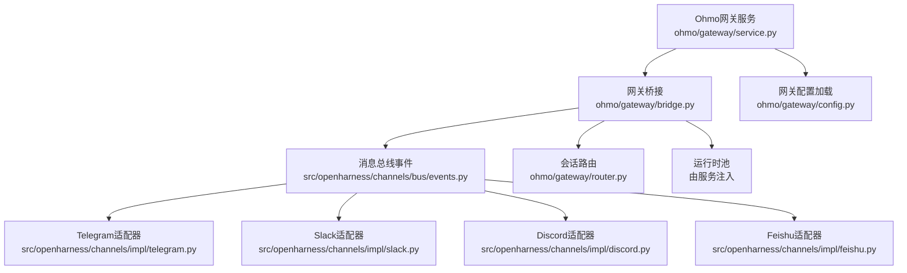
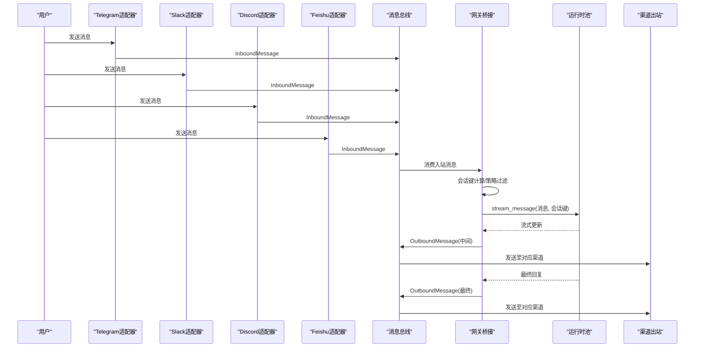
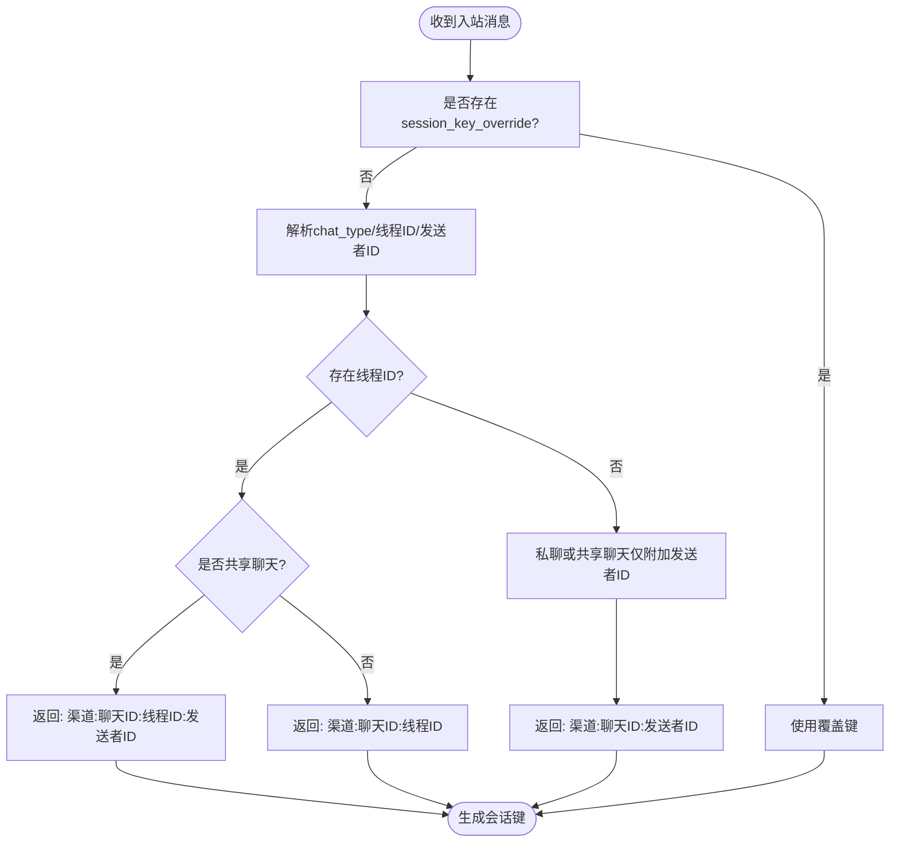
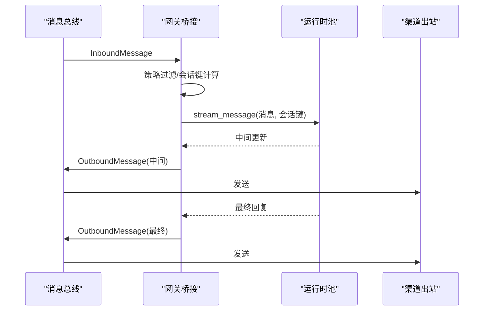
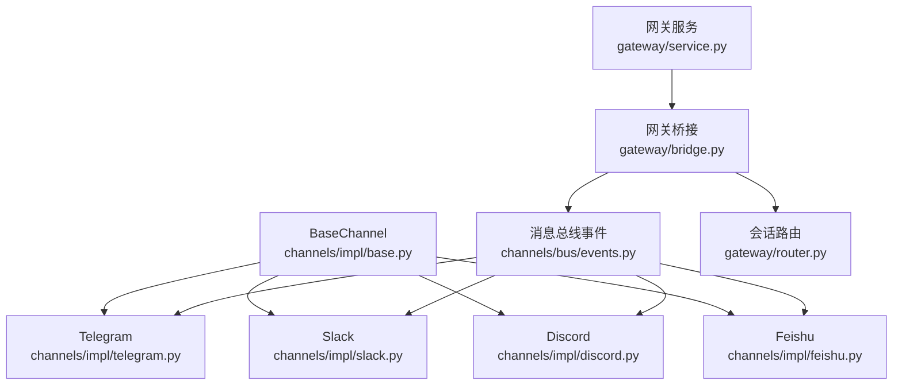

# 渠道集成

<cite>
**本文引用的文件**
- [ohmo/gateway/service.py](file://ohmo/gateway/service.py)
- [ohmo/gateway/router.py](file://ohmo/gateway/router.py)
- [ohmo/gateway/config.py](file://ohmo/gateway/config.py)
- [ohmo/gateway/models.py](file://ohmo/gateway/models.py)
- [ohmo/gateway/bridge.py](file://ohmo/gateway/bridge.py)
- [ohmo/workspace.py](file://ohmo/workspace.py)
- [src/openharness/channels/bus/events.py](file://src/openharness/channels/bus/events.py)
- [src/openharness/channels/impl/base.py](file://src/openharness/channels/impl/base.py)
- [src/openharness/channels/impl/telegram.py](file://src/openharness/channels/impl/telegram.py)
- [src/openharness/channels/impl/slack.py](file://src/openharness/channels/impl/slack.py)
- [src/openharness/channels/impl/discord.py](file://src/openharness/channels/impl/discord.py)
- [src/openharness/channels/impl/feishu.py](file://src/openharness/channels/impl/feishu.py)
- [src/openharness/config/schema.py](file://src/openharness/config/schema.py)
- [README.md](file://README.md)
</cite>

## 目录
1. [简介](#简介)
2. [项目结构](#项目结构)
3. [核心组件](#核心组件)
4. [架构总览](#架构总览)
5. [详细组件分析](#详细组件分析)
6. [依赖分析](#依赖分析)
7. [性能考虑](#性能考虑)
8. [故障排查指南](#故障排查指南)
9. [结论](#结论)
10. [附录](#附录)

## 简介
本文件面向ohmo渠道集成功能，系统性说明如何在ohmo中启用与配置多种聊天渠道（Telegram、Slack、Discord、Feishu），涵盖各渠道的认证方式、关键配置参数、消息处理流程、权限控制策略以及跨渠道消息会话路由与同步机制。文档同时提供“渠道配置向导”的使用指南与常见问题排查建议，帮助用户快速完成从安装到上线的全链路部署。

## 项目结构
ohmo渠道集成由“网关服务层 + 消息总线 + 渠道适配器 + 会话路由与桥接”四部分组成：
- 网关服务层：负责启动/停止通道、管理运行时池、持久化状态与进程生命周期
- 消息总线：统一入站/出站消息模型与分发
- 渠道适配器：针对Telegram/Slack/Discord/Feishu的具体实现
- 会话路由与桥接：根据消息上下文生成会话键，驱动多轮对话与任务中断

图表来源
- [ohmo/gateway/service.py:39-232](file://ohmo/gateway/service.py#L39-L232)
- [ohmo/gateway/bridge.py:56-142](file://ohmo/gateway/bridge.py#L56-L142)
- [ohmo/gateway/config.py:13-42](file://ohmo/gateway/config.py#L13-L42)
- [src/openharness/channels/bus/events.py:8-39](file://src/openharness/channels/bus/events.py#L8-L39)
- [src/openharness/channels/impl/telegram.py:87-174](file://src/openharness/channels/impl/telegram.py#L87-L174)
- [src/openharness/channels/impl/slack.py:21-75](file://src/openharness/channels/impl/slack.py#L21-L75)
- [src/openharness/channels/impl/discord.py:24-77](file://src/openharness/channels/impl/discord.py#L24-L77)
- [src/openharness/channels/impl/feishu.py:411-504](file://src/openharness/channels/impl/feishu.py#L411-L504)

章节来源
- [ohmo/gateway/service.py:39-232](file://ohmo/gateway/service.py#L39-L232)
- [ohmo/gateway/bridge.py:56-142](file://ohmo/gateway/bridge.py#L56-L142)
- [ohmo/gateway/config.py:13-42](file://ohmo/gateway/config.py#L13-L42)
- [src/openharness/channels/bus/events.py:8-39](file://src/openharness/channels/bus/events.py#L8-L39)

## 核心组件
- 网关服务（OhmoGatewayService）
  - 负责初始化工作区、加载网关配置、构建消息总线与通道管理器、启动运行时池与桥接器，并提供前台/后台运行、重启通知、进程生命周期管理等能力
- 网关桥接（OhmoGatewayBridge）
  - 消费入站消息，按渠道策略与会话键调度运行时池，流式发布中间更新与最终回复；支持/stop、/restart命令与群组指令转换
- 会话路由（session_key_for_message）
  - 基于消息来源渠道、聊天类型、线程/话题ID与发送者身份，生成稳定的会话键，确保共享聊天中的多用户隔离与线程内连续性
- 渠道适配器（BaseChannel + 各平台实现）
  - 统一抽象：start/stop/send + 权限检查 + 入站消息封装为InboundMessage并发布到总线
  - 平台差异：长轮询/Socket/WebSocket/REST API等不同接入方式与消息格式转换
- 配置模型（GatewayConfig/ChannelConfigs）
  - 网关级：启用通道、会话路由策略、进度提示、日志级别等
  - 通道级：各平台令牌、代理、策略参数等

章节来源
- [ohmo/gateway/service.py:39-232](file://ohmo/gateway/service.py#L39-L232)
- [ohmo/gateway/bridge.py:56-142](file://ohmo/gateway/bridge.py#L56-L142)
- [ohmo/gateway/router.py:8-32](file://ohmo/gateway/router.py#L8-L32)
- [src/openharness/channels/impl/base.py:34-142](file://src/openharness/channels/impl/base.py#L34-L142)
- [src/openharness/config/schema.py:114-117](file://src/openharness/config/schema.py#L114-L117)

## 架构总览
下图展示ohmo渠道集成的端到端数据流：用户通过任一IM渠道发送消息，渠道适配器解析并封装为InboundMessage，网关桥接根据策略与会话键调度运行时池，运行时池产生流式更新与最终回复，桥接再将OutboundMessage投递回对应渠道。

图表来源
- [src/openharness/channels/impl/telegram.py:336-453](file://src/openharness/channels/impl/telegram.py#L336-L453)
- [src/openharness/channels/impl/slack.py:108-200](file://src/openharness/channels/impl/slack.py#L108-L200)
- [src/openharness/channels/impl/discord.py:205-265](file://src/openharness/channels/impl/discord.py#L205-L265)
- [src/openharness/channels/impl/feishu.py:435-504](file://src/openharness/channels/impl/feishu.py#L435-L504)
- [src/openharness/channels/bus/events.py:8-39](file://src/openharness/channels/bus/events.py#L8-L39)
- [ohmo/gateway/bridge.py:77-136](file://ohmo/gateway/bridge.py#L77-L136)

## 详细组件分析

### 会话路由与键生成
- 路由规则要点
  - 私聊：保持“渠道:聊天ID”作为会话键，保证历史会话可续
  - 共享聊天：附加发送者ID，避免多人共享同一Agent记忆
  - 线程/话题：附加thread_id或message_thread_id，确保线程内连续性
  - 可覆盖：若上游提供session_key_override，则直接使用
- Feishu群组策略
  - 网关桥接在处理入站消息前，依据Feishu群组策略决定是否忽略该消息（开放/提及/托管/托管或提及）

图表来源
- [ohmo/gateway/router.py:8-32](file://ohmo/gateway/router.py#L8-L32)
- [ohmo/gateway/bridge.py:331-348](file://ohmo/gateway/bridge.py#L331-L348)

章节来源
- [ohmo/gateway/router.py:8-32](file://ohmo/gateway/router.py#L8-L32)
- [ohmo/gateway/bridge.py:331-348](file://ohmo/gateway/bridge.py#L331-L348)

### 渠道适配器对比与特性
- Telegram
  - 认证：机器人令牌（token），可选代理
  - 特性：长轮询、媒体下载与转写（语音/AI转写）、媒体组聚合、打字指示、Markdown→HTML转换
  - 关键参数：token、proxy、是否回复原消息、媒体类型识别
- Slack
  - 认证：bot_token + app_token（Socket模式）
  - 特性：Socket Mode监听、提及检测、线程回复、反应标记、DM/群组策略
  - 关键参数：bot_token、app_token、签名密钥、DM策略、群组策略、回复线程开关、反应表情
- Discord
  - 认证：Bot令牌
  - 特性：WebSocket连接、心跳保活、消息引用回复、速率限制重试、打字指示
  - 关键参数：token、网关URL、意图（intents）、最大附件大小、消息长度限制
- Feishu
  - 认证：App ID + App Secret（可选加密Key与验证Token）
  - 特性：WebSocket长连、消息去重、复杂富文本/交互卡片渲染、提及检测、托管群组策略
  - 关键参数：app_id、app_secret、encrypt_key、verification_token、bot_open_id、bot_names、群组策略

章节来源
- [src/openharness/channels/impl/telegram.py:104-174](file://src/openharness/channels/impl/telegram.py#L104-L174)
- [src/openharness/channels/impl/slack.py:26-75](file://src/openharness/channels/impl/slack.py#L26-L75)
- [src/openharness/channels/impl/discord.py:29-77](file://src/openharness/channels/impl/discord.py#L29-L77)
- [src/openharness/channels/impl/feishu.py:425-504](file://src/openharness/channels/impl/feishu.py#L425-L504)
- [src/openharness/config/schema.py:34-60](file://src/openharness/config/schema.py#L34-L60)

### 渠道配置向导与令牌设置
- 初始化与引导
  - 使用“ohmo init”创建个人工作区与默认网关配置文件（gateway.json）
  - 使用“ohmo config”进入交互式配置向导，选择提供商与通道，自动写入gateway.json
- 令牌与权限
  - Telegram：填写机器人令牌；如需代理，配置proxy
  - Slack：填写bot_token与app_token；可配置DM/群组策略与回复线程行为
  - Discord：填写Bot令牌；可配置意图与最大附件大小
  - Feishu：填写App ID与App Secret；可配置加密Key与验证Token；设置bot_open_id与bot_names以提升提及识别精度
- 权限控制
  - 所有通道均支持allow_from白名单；空列表默认拒绝所有访问
  - Slack/Feishu支持更细粒度的DM/群组策略与托管群组策略
- 消息转发规则
  - 网关配置项send_progress与send_tool_hints控制中间进度与工具提示的发送
  - Slack支持reply_in_thread与react_emoji；Discord支持message_reference与allowed_mentions

章节来源
- [ohmo/workspace.py:252-301](file://ohmo/workspace.py#L252-L301)
- [ohmo/gateway/config.py:13-42](file://ohmo/gateway/config.py#L13-L42)
- [src/openharness/config/schema.py:26-117](file://src/openharness/config/schema.py#L26-L117)
- [README.md:647-703](file://README.md#L647-L703)

### 消息处理与会话同步
- 入站处理
  - 渠道适配器解析消息，调用BaseChannel._handle_message，进行权限校验后封装为InboundMessage并发布到总线
  - Feishu适配器支持富文本/交互卡片解析、提及提取与托管群组策略过滤
- 会话键与线程
  - 会话键用于区分不同用户、线程与聊天类型，确保共享聊天中每个发送者的记忆独立
  - Slack/Discord/Feishu在群组场景下可基于thread_ts/message_id维持话题连续性
- 运行时与桥接
  - 网关桥接消费入站消息，按策略过滤后创建会话任务；若收到新的用户消息，可中断旧任务并通知用户
  - 运行时池流式产出中间更新与最终回复，桥接统一发布到对应渠道
- 冲突解决
  - 会话中断：/stop命令或新消息到达时中断旧任务，必要时发送“已停止”的进度提示
  - 重启通知：当网关请求重启时，桥接先发布重启确认消息，再触发重启流程

图表来源
- [ohmo/gateway/bridge.py:248-323](file://ohmo/gateway/bridge.py#L248-L323)
- [src/openharness/channels/bus/events.py:8-39](file://src/openharness/channels/bus/events.py#L8-L39)

章节来源
- [ohmo/gateway/bridge.py:143-175](file://ohmo/gateway/bridge.py#L143-L175)
- [ohmo/gateway/bridge.py:228-247](file://ohmo/gateway/bridge.py#L228-L247)

## 依赖分析
- 组件耦合
  - 渠道适配器依赖BaseChannel与消息总线事件模型，解耦具体平台细节
  - 网关桥接依赖会话路由与运行时池，不直接依赖具体渠道实现
  - 网关服务负责装配上述组件并管理生命周期
- 外部依赖
  - Telegram：python-telegram-bot
  - Slack：slack_sdk（Socket Mode）
  - Discord：websockets/httpx
  - Feishu：lark-oapi（可选，未安装时会记录错误）
- 循环依赖
  - 代码层面未见循环导入；桥接与运行时池通过回调接口解耦

图表来源
- [src/openharness/channels/impl/base.py:34-142](file://src/openharness/channels/impl/base.py#L34-L142)
- [src/openharness/channels/impl/telegram.py:87-174](file://src/openharness/channels/impl/telegram.py#L87-L174)
- [src/openharness/channels/impl/slack.py:21-75](file://src/openharness/channels/impl/slack.py#L21-L75)
- [src/openharness/channels/impl/discord.py:24-77](file://src/openharness/channels/impl/discord.py#L24-L77)
- [src/openharness/channels/impl/feishu.py:411-504](file://src/openharness/channels/impl/feishu.py#L411-L504)
- [src/openharness/channels/bus/events.py:8-39](file://src/openharness/channels/bus/events.py#L8-L39)
- [ohmo/gateway/service.py:39-73](file://ohmo/gateway/service.py#L39-L73)
- [ohmo/gateway/bridge.py:56-76](file://ohmo/gateway/bridge.py#L56-L76)
- [ohmo/gateway/router.py:8-32](file://ohmo/gateway/router.py#L8-L32)

章节来源
- [src/openharness/channels/impl/base.py:34-142](file://src/openharness/channels/impl/base.py#L34-L142)
- [ohmo/gateway/service.py:39-73](file://ohmo/gateway/service.py#L39-L73)
- [ohmo/gateway/bridge.py:56-76](file://ohmo/gateway/bridge.py#L56-L76)

## 性能考虑
- 连接与并发
  - Telegram：使用较大的HTTP连接池以降低长时间运行时的超时风险
  - Discord：内置速率限制重试与心跳保活，避免频繁断连
  - Slack：Socket Mode低延迟事件推送；注意避免重复处理（提及与消息事件）
  - Feishu：WebSocket长连，线程内事件循环，带去重缓存
- 消息体积与拆分
  - Telegram/Discord对消息长度有限制，采用分片发送；Feishu支持富文本/交互卡片，自动拆分表格以规避API限制
- I/O与媒体
  - 下载媒体文件到本地临时目录，避免在内存中堆积大文件
  - 转写与上传等外部服务调用采用异步与重试策略

章节来源
- [src/openharness/channels/impl/telegram.py:128-132](file://src/openharness/channels/impl/telegram.py#L128-L132)
- [src/openharness/channels/impl/discord.py:109-125](file://src/openharness/channels/impl/discord.py#L109-L125)
- [src/openharness/channels/impl/slack.py:139-143](file://src/openharness/channels/impl/slack.py#L139-L143)
- [src/openharness/channels/impl/feishu.py:777-800](file://src/openharness/channels/impl/feishu.py#L777-L800)

## 故障排查指南
- 常见错误与定位
  - 认证失败：网关桥接对常见认证异常进行友好提示，建议检查提供商配置与凭据状态
  - 速率限制：Discord出现429时自动等待retry_after秒后重试
  - 会话中断：/stop命令或新消息到达会中断旧任务，查看网关日志确认原因
  - Feishu群组策略：若消息被忽略，请检查group_policy与是否为托管群组或包含机器人提及
- 日志与状态
  - 网关状态文件与日志目录位于工作区根目录下的logs与state.json
  - 使用“ohmo gateway status/restart”查看与控制网关进程
- 通道特定问题
  - Telegram：检查token与代理配置；媒体下载失败时关注workspace/media目录权限
  - Slack：确认Socket Mode连接、bot_user_id解析与提及检测；DM/群组策略是否符合预期
  - Discord：核对Bot令牌与意图设置；关注心跳与重连日志
  - Feishu：确认lark-oapi安装；检查App ID/Secret与加密Key/验证Token配置

章节来源
- [ohmo/gateway/bridge.py:29-53](file://ohmo/gateway/bridge.py#L29-L53)
- [src/openharness/channels/impl/discord.py:110-117](file://src/openharness/channels/impl/discord.py#L110-L117)
- [ohmo/workspace.py:178-227](file://ohmo/workspace.py#L178-L227)
- [ohmo/gateway/service.py:394-429](file://ohmo/gateway/service.py#L394-L429)

## 结论
ohmo的渠道集成功以“统一消息总线 + 可插拔渠道适配器 + 策略化的会话路由与桥接”为核心，既保证了多平台的一致体验，又保留了各平台的差异化能力。通过交互式配置向导与完善的权限/策略体系，用户可以安全、可控地启用Telegram、Slack、Discord与Feishu等渠道，并在共享聊天与线程场景中实现稳定的消息同步与冲突处理。

## 附录

### 渠道配置参数速查
- Telegram
  - 必填：token
  - 可选：proxy、是否回复原消息、媒体类型映射
- Slack
  - 必填：bot_token、app_token
  - 可选：签名密钥、DM策略、群组策略、回复线程、反应表情
- Discord
  - 必填：token
  - 可选：网关URL、意图、最大附件大小、消息长度限制
- Feishu
  - 必填：app_id、app_secret
  - 可选：encrypt_key、verification_token、bot_open_id、bot_names、群组策略

章节来源
- [src/openharness/config/schema.py:34-60](file://src/openharness/config/schema.py#L34-L60)
- [src/openharness/channels/impl/telegram.py:104-112](file://src/openharness/channels/impl/telegram.py#L104-L112)
- [src/openharness/channels/impl/slack.py:26-31](file://src/openharness/channels/impl/slack.py#L26-L31)
- [src/openharness/channels/impl/discord.py:29-37](file://src/openharness/channels/impl/discord.py#L29-L37)
- [src/openharness/channels/impl/feishu.py:425-433](file://src/openharness/channels/impl/feishu.py#L425-L433)