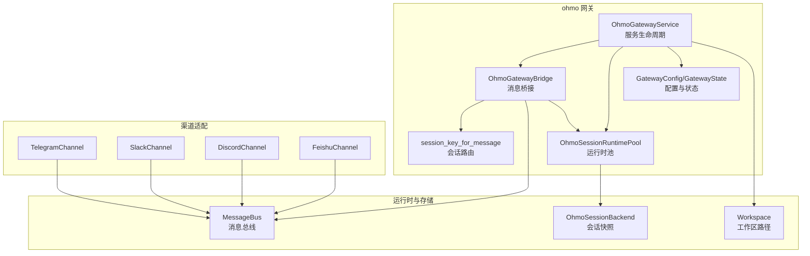
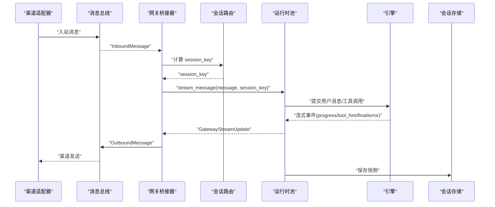
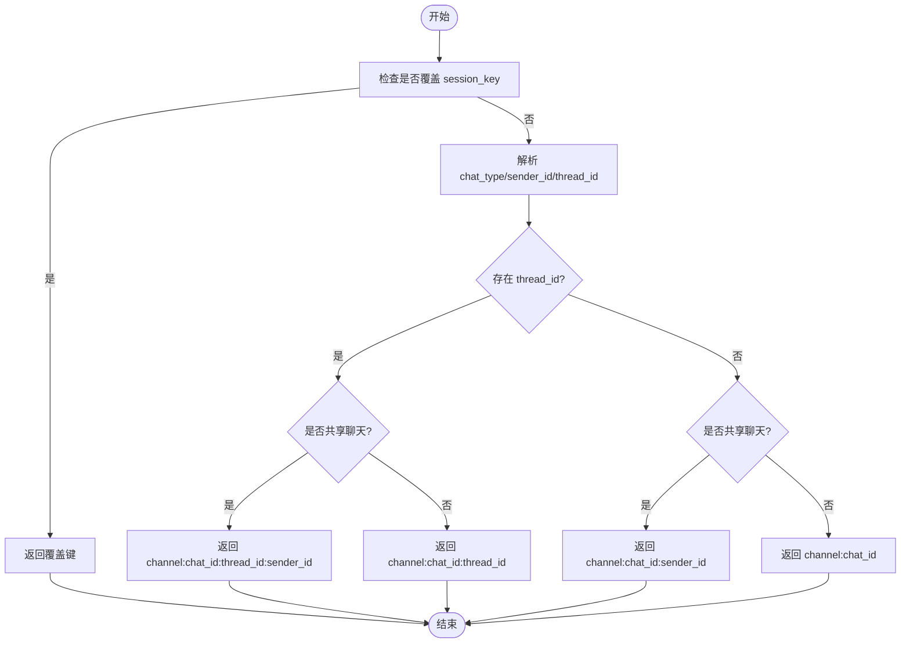
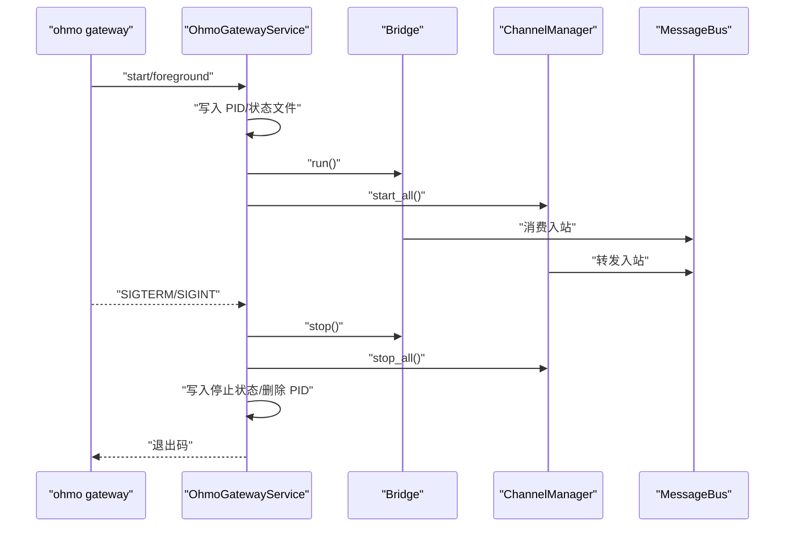
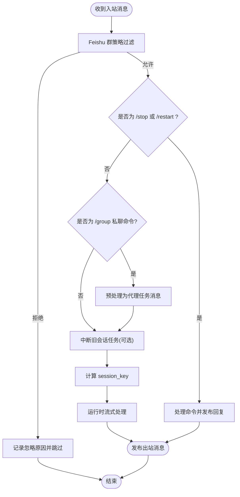
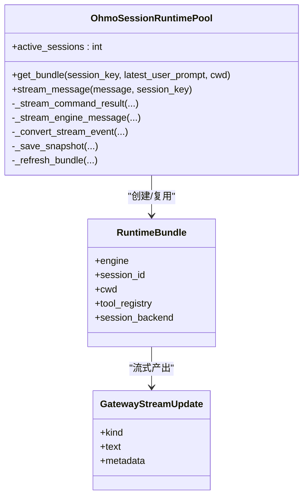
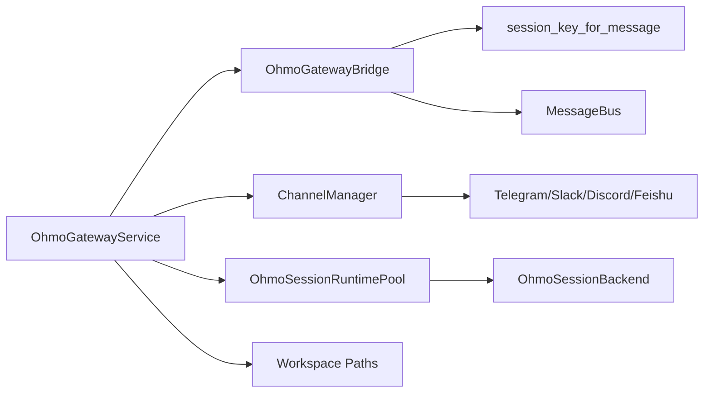

# 网关系统

<cite>
**本文引用的文件**
- [ohmo/gateway/__init__.py](file://ohmo/gateway/__init__.py)
- [ohmo/gateway/router.py](file://ohmo/gateway/router.py)
- [ohmo/gateway/service.py](file://ohmo/gateway/service.py)
- [ohmo/gateway/runtime.py](file://ohmo/gateway/runtime.py)
- [ohmo/gateway/config.py](file://ohmo/gateway/config.py)
- [ohmo/gateway/models.py](file://ohmo/gateway/models.py)
- [ohmo/gateway/bridge.py](file://ohmo/gateway/bridge.py)
- [ohmo/gateway/group_tool.py](file://ohmo/gateway/group_tool.py)
- [ohmo/gateway/provider_commands.py](file://ohmo/gateway/provider_commands.py)
- [ohmo/workspace.py](file://ohmo/workspace.py)
- [src/openharness/channels/impl/telegram.py](file://src/openharness/channels/impl/telegram.py)
- [src/openharness/channels/impl/slack.py](file://src/openharness/channels/impl/slack.py)
- [src/openharness/channels/impl/discord.py](file://src/openharness/channels/impl/discord.py)
- [src/openharness/channels/impl/feishu.py](file://src/openharness/channels/impl/feishu.py)
- [README.md](file://README.md)
</cite>

## 目录
1. [简介](#简介)
2. [项目结构](#项目结构)
3. [核心组件](#核心组件)
4. [架构总览](#架构总览)
5. [详细组件分析](#详细组件分析)
6. [依赖分析](#依赖分析)
7. [性能考虑](#性能考虑)
8. [故障排除指南](#故障排除指南)
9. [结论](#结论)
10. [附录](#附录)

## 简介
ohmo 网关系统是 OpenHarness 生态中的个人智能代理（personal agent）接入层，负责在多聊天渠道之间进行消息路由、会话管理与运行时编排。它将来自不同即时通讯平台的消息统一转换为内部会话，并通过统一的运行时引擎驱动工具调用与多模态输出，同时维护会话状态、权限控制与可观测性。

网关的核心职责包括：
- 消息路由：根据渠道、聊天类型、线程/话题等维度生成稳定的会话键，确保长对话与多用户共享场景下的会话隔离与恢复。
- 渠道集成：抽象化 Telegram、Slack、Discord、Feishu 等渠道差异，统一事件/消息格式与发送协议。
- 会话管理：按会话键维护运行时实例，持久化会话快照，支持中断、重启与跨进程状态恢复。
- 运行时编排：将入站消息转化为引擎可消费的对话消息，流式产出进度、工具提示、最终回复，并处理图像输入降级与超轮次保护。
- 状态监控：提供前台运行、后台守护、状态文件与 PID 文件管理，以及重启通知发布机制。

## 项目结构
ohmo 网关位于 ohmo/gateway 目录，围绕“服务-桥接-路由-运行时-配置”的分层组织，配合 src/openharness/channels 提供多渠道适配器，ohmo/workspace 提供工作区与配置路径解析。

图示来源
- [ohmo/gateway/service.py:39-116](file://ohmo/gateway/service.py#L39-L116)
- [ohmo/gateway/bridge.py:56-76](file://ohmo/gateway/bridge.py#L56-L76)
- [ohmo/gateway/router.py:8-31](file://ohmo/gateway/router.py#L8-L31)
- [ohmo/gateway/runtime.py:91-115](file://ohmo/gateway/runtime.py#L91-L115)
- [src/openharness/channels/impl/telegram.py:87-118](file://src/openharness/channels/impl/telegram.py#L87-L118)
- [src/openharness/channels/impl/slack.py:21-32](file://src/openharness/channels/impl/slack.py#L21-L32)
- [src/openharness/channels/impl/discord.py:24-38](file://src/openharness/channels/impl/discord.py#L24-L38)
- [src/openharness/channels/impl/feishu.py:1-25](file://src/openharness/channels/impl/feishu.py#L1-L25)

章节来源
- [ohmo/gateway/__init__.py:1-3](file://ohmo/gateway/__init__.py#L1-L3)
- [ohmo/gateway/service.py:39-116](file://ohmo/gateway/service.py#L39-L116)
- [ohmo/gateway/bridge.py:56-76](file://ohmo/gateway/bridge.py#L56-L76)
- [ohmo/gateway/router.py:8-31](file://ohmo/gateway/router.py#L8-L31)
- [ohmo/gateway/runtime.py:91-115](file://ohmo/gateway/runtime.py#L91-L115)
- [src/openharness/channels/impl/telegram.py:87-118](file://src/openharness/channels/impl/telegram.py#L87-L118)
- [src/openharness/channels/impl/slack.py:21-32](file://src/openharness/channels/impl/slack.py#L21-L32)
- [src/openharness/channels/impl/discord.py:24-38](file://src/openharness/channels/impl/discord.py#L24-L38)
- [src/openharness/channels/impl/feishu.py:1-25](file://src/openharness/channels/impl/feishu.py#L1-L25)

## 核心组件
- 会话路由：基于消息元数据生成稳定会话键，区分私聊、群组/共享聊天与带线程的场景，避免多用户共享同一代理记忆。
- 网关服务：前台/后台运行模式、进程生命周期管理、状态文件写入、重启请求与重启通知发布。
- 消息桥接：消费入站消息、Feishu 群策略过滤、命令与 /group 请求预处理、会话中断与任务清理。
- 运行时池：按会话键复用或重建运行时，注入系统提示、加载快照、流式事件转换为渠道可读输出。
- 配置模型：网关配置与状态模型，包含提供商配置、启用渠道、进度与工具提示开关、远程管理命令白名单等。
- 渠道适配：Telegram（长轮询）、Slack（Socket Mode）、Discord（WebSocket Gateway）、Feishu（WebSocket + 安全校验）。

章节来源
- [ohmo/gateway/router.py:8-31](file://ohmo/gateway/router.py#L8-L31)
- [ohmo/gateway/service.py:39-116](file://ohmo/gateway/service.py#L39-L116)
- [ohmo/gateway/bridge.py:56-76](file://ohmo/gateway/bridge.py#L56-L76)
- [ohmo/gateway/runtime.py:91-115](file://ohmo/gateway/runtime.py#L91-L115)
- [ohmo/gateway/models.py:8-33](file://ohmo/gateway/models.py#L8-L33)
- [src/openharness/channels/impl/telegram.py:87-118](file://src/openharness/channels/impl/telegram.py#L87-L118)
- [src/openharness/channels/impl/slack.py:21-32](file://src/openharness/channels/impl/slack.py#L21-L32)
- [src/openharness/channels/impl/discord.py:24-38](file://src/openharness/channels/impl/discord.py#L24-L38)
- [src/openharness/channels/impl/feishu.py:1-25](file://src/openharness/channels/impl/feishu.py#L1-L25)

## 架构总览
下图展示从渠道到运行时的整体链路：渠道适配器将消息封装为入站消息，网关桥接器进行策略过滤与命令预处理，路由模块生成会话键，运行时池按会话键调度引擎，最终通过消息总线回写到渠道。

图示来源
- [ohmo/gateway/bridge.py:248-323](file://ohmo/gateway/bridge.py#L248-L323)
- [ohmo/gateway/router.py:8-31](file://ohmo/gateway/router.py#L8-L31)
- [ohmo/gateway/runtime.py:212-314](file://ohmo/gateway/runtime.py#L212-L314)
- [src/openharness/channels/impl/telegram.py:119-174](file://src/openharness/channels/impl/telegram.py#L119-L174)

章节来源
- [ohmo/gateway/bridge.py:77-136](file://ohmo/gateway/bridge.py#L77-L136)
- [ohmo/gateway/router.py:8-31](file://ohmo/gateway/router.py#L8-L31)
- [ohmo/gateway/runtime.py:212-314](file://ohmo/gateway/runtime.py#L212-L314)

## 详细组件分析

### 会话路由（router）
- 路由规则要点
  - 私聊保持原有 channel:chat_id 键，保证历史会话可恢复。
  - 共享聊天（群组/房间等）加入发送者身份，避免多人共享同一代理记忆。
  - 支持线程/话题标识，群组消息保留线程信息以实现多话题隔离。
  - 可通过消息覆盖键强制指定会话键，用于特殊场景。
- 复杂度与性能
  - 时间复杂度 O(1)，仅基于元数据字段拼接字符串。
  - 空间复杂度 O(1)，不引入额外结构。

图示来源
- [ohmo/gateway/router.py:8-31](file://ohmo/gateway/router.py#L8-L31)

章节来源
- [ohmo/gateway/router.py:8-31](file://ohmo/gateway/router.py#L8-L31)

### 网关服务（service）
- 生命周期
  - 初始化：创建工作区、加载网关配置、构建消息总线与渠道管理器、初始化运行时池与桥接器。
  - 前台运行：写入 PID 与状态文件，启动桥接与渠道任务，注册信号处理器，等待停止事件后优雅关闭。
  - 后台运行：以子进程启动前台循环，重定向日志至工作区日志文件。
  - 状态查询：读取 PID 文件与状态文件，结合进程扫描判断运行状态。
  - 重启：写入重启通知文件，触发桥接器发布重启确认消息，随后执行 in-place 重启。
- 进程管理
  - 跨平台 PID 判断与终止，Windows 使用内核 API，类 Unix 使用 ps 过滤与 SIGTERM。
- 安全与可观测性
  - 记录运行状态、活跃会话数、最后错误，便于运维监控。

图示来源
- [ohmo/gateway/service.py:191-232](file://ohmo/gateway/service.py#L191-L232)
- [ohmo/gateway/service.py:235-275](file://ohmo/gateway/service.py#L235-L275)
- [ohmo/gateway/service.py:394-428](file://ohmo/gateway/service.py#L394-L428)

章节来源
- [ohmo/gateway/service.py:39-116](file://ohmo/gateway/service.py#L39-L116)
- [ohmo/gateway/service.py:191-232](file://ohmo/gateway/service.py#L191-L232)
- [ohmo/gateway/service.py:235-275](file://ohmo/gateway/service.py#L235-L275)
- [ohmo/gateway/service.py:394-428](file://ohmo/gateway/service.py#L394-L428)

### 消息桥接（bridge）
- 功能
  - 入站过滤：针对 Feishu 群组消息按策略（开放/仅提及/托管群/托管或提及）决定是否处理。
  - 命令与 /group 预处理：将私聊 /group 转换为代理任务，注入上下文元数据。
  - 会话中断：当收到新消息时取消旧任务，必要时发送“已停止”的进度提示。
  - 流式输出：将运行时事件转换为渠道友好的文本/进度/工具提示，支持线程/话题元数据透传。
  - 错误处理：捕获异常并格式化用户可见的错误提示。
- 关键策略
  - Feishu 群策略归一化与托管群识别，保障安全与可控的响应范围。

图示来源
- [ohmo/gateway/bridge.py:77-136](file://ohmo/gateway/bridge.py#L77-L136)
- [ohmo/gateway/bridge.py:143-175](file://ohmo/gateway/bridge.py#L143-L175)
- [ohmo/gateway/bridge.py:176-227](file://ohmo/gateway/bridge.py#L176-L227)
- [ohmo/gateway/bridge.py:248-323](file://ohmo/gateway/bridge.py#L248-L323)

章节来源
- [ohmo/gateway/bridge.py:56-76](file://ohmo/gateway/bridge.py#L56-L76)
- [ohmo/gateway/bridge.py:331-348](file://ohmo/gateway/bridge.py#L331-L348)
- [ohmo/gateway/bridge.py:361-409](file://ohmo/gateway/bridge.py#L361-L409)

### 运行时池（runtime）
- 会话管理
  - 按会话键缓存运行时包，支持工作目录变更时重建运行时。
  - 加载最近快照恢复对话历史，注入系统提示与技能/插件路径。
- 命令与权限
  - 解析斜杠命令与技能命令，支持网关级命令（如 /provider、/model），并可选择性允许远程管理命令。
  - 对于不允许远程调用的命令，返回本地 UI 友好提示。
- 引擎交互
  - 将入站消息包装为对话消息，流式消费引擎事件（思考中/状态/工具执行/完成/错误）。
  - 图像输入降级：当模型不支持图像时自动移除图像块并重试。
  - 超轮次保护：达到最大轮次时返回停止提示并保存快照。
- 快照与元数据
  - 保存消息与工具元数据，清洗内部 /group 工具提示为对外可读摘要。

图示来源
- [ohmo/gateway/runtime.py:91-115](file://ohmo/gateway/runtime.py#L91-L115)
- [ohmo/gateway/runtime.py:146-210](file://ohmo/gateway/runtime.py#L146-L210)
- [ohmo/gateway/runtime.py:212-314](file://ohmo/gateway/runtime.py#L212-L314)
- [ohmo/gateway/runtime.py:390-484](file://ohmo/gateway/runtime.py#L390-L484)

章节来源
- [ohmo/gateway/runtime.py:91-115](file://ohmo/gateway/runtime.py#L91-L115)
- [ohmo/gateway/runtime.py:146-210](file://ohmo/gateway/runtime.py#L146-L210)
- [ohmo/gateway/runtime.py:212-314](file://ohmo/gateway/runtime.py#L212-L314)
- [ohmo/gateway/runtime.py:390-484](file://ohmo/gateway/runtime.py#L390-L484)

### 配置与状态（config/models）
- 网关配置
  - provider_profile：当前提供商配置档。
  - enabled_channels：启用的渠道列表。
  - session_routing：会话路由策略（当前固定为“按聊天与线程”）。
  - send_progress/send_tool_hints：是否向渠道发送进度与工具提示。
  - permission_mode：权限模式。
  - sandbox_enabled：沙箱能力开关。
  - allow_remote_admin_commands/allowed_remote_admin_commands：允许远程管理命令及其白名单。
  - log_level：日志级别。
  - channel_configs：各渠道的配置字典。
- 状态模型
  - running/pid/active_sessions/provider_profile/enabled_channels/last_error：运行时状态快照。

章节来源
- [ohmo/gateway/models.py:8-33](file://ohmo/gateway/models.py#L8-L33)
- [ohmo/gateway/config.py:13-42](file://ohmo/gateway/config.py#L13-L42)

### 渠道集成（Telegram/Slack/Discord/Feishu）
- Telegram
  - 长轮询模式，注册命令菜单，处理文本/媒体消息，支持分片发送与打字指示。
- Slack
  - Socket Mode，自动识别机器人用户 ID，避免重复处理，支持线程回复与反应标记。
- Discord
  - WebSocket Gateway，心跳保活，鉴权 IDENTIFY，REST API 发送消息，带速率限制重试。
- Feishu
  - WebSocket 连接，提取消息中的 @ 提及与 bot 名称匹配，支持托管群识别与多种群策略。

章节来源
- [src/openharness/channels/impl/telegram.py:87-174](file://src/openharness/channels/impl/telegram.py#L87-L174)
- [src/openharness/channels/impl/slack.py:21-75](file://src/openharness/channels/impl/slack.py#L21-L75)
- [src/openharness/channels/impl/discord.py:24-77](file://src/openharness/channels/impl/discord.py#L24-L77)
- [src/openharness/channels/impl/feishu.py:126-165](file://src/openharness/channels/impl/feishu.py#L126-L165)

### Feishu 群策略与 /group 工具
- 群策略
  - open：在群组中始终回复。
  - mention：仅当被 @ 或提及 bot 名称时回复。
  - managed：仅对托管群组回复。
  - managed_or_mention：托管群或被 @ 时回复。
- /group 工具
  - 仅在私聊中可用，推断群名、工作目录与仓库信息，创建托管群并保存元数据，随后发送欢迎消息。

章节来源
- [ohmo/gateway/bridge.py:331-348](file://ohmo/gateway/bridge.py#L331-L348)
- [ohmo/gateway/group_tool.py:38-150](file://ohmo/gateway/group_tool.py#L38-L150)

## 依赖分析
- 组件耦合
  - 网关服务依赖消息总线、渠道管理器、运行时池与工作区路径。
  - 桥接器依赖路由模块与运行时池，向渠道发送出站消息。
  - 运行时池依赖会话存储、系统提示构建与技能/插件目录。
- 外部依赖
  - 各渠道 SDK（python-telegram-bot、slack_sdk、websockets、lark-oapi）。
  - 异步事件循环与信号处理（asyncio、signal）。
- 循环依赖
  - 未发现直接循环依赖；桥接器与运行时池通过消息总线解耦。

图示来源
- [ohmo/gateway/service.py:39-73](file://ohmo/gateway/service.py#L39-L73)
- [ohmo/gateway/bridge.py:56-76](file://ohmo/gateway/bridge.py#L56-L76)
- [ohmo/gateway/runtime.py:91-115](file://ohmo/gateway/runtime.py#L91-L115)
- [ohmo/workspace.py:163-200](file://ohmo/workspace.py#L163-L200)

章节来源
- [ohmo/gateway/service.py:39-73](file://ohmo/gateway/service.py#L39-L73)
- [ohmo/gateway/bridge.py:56-76](file://ohmo/gateway/bridge.py#L56-L76)
- [ohmo/gateway/runtime.py:91-115](file://ohmo/gateway/runtime.py#L91-L115)
- [ohmo/workspace.py:163-200](file://ohmo/workspace.py#L163-L200)

## 性能考虑
- 会话路由
  - 基于字符串拼接，常数时间与空间开销，适合高并发场景。
- 消息桥接
  - 事件驱动与异步任务，避免阻塞；对 Feishu 群策略过滤减少无效处理。
- 运行时池
  - 按会话键复用运行时，减少引擎初始化成本；快照持久化降低重启恢复时间。
- 渠道适配
  - Telegram/Slack/Discord/Feishu 均采用异步客户端与连接池，降低网络延迟与资源占用。
- 超轮次保护与图像降级
  - 防止长时间占用与模型不兼容导致的失败风暴。

## 故障排除指南
- 启动与状态
  - 使用状态查询确认网关是否运行、活跃会话数与最后错误；若 PID 文件缺失但进程存在，服务会尝试通过进程扫描修复。
- 日志定位
  - 查看工作区日志文件（gateway.log），关注“ohmo inbound/outbound”与“gateway failed”等关键日志。
- 重启与恢复
  - 执行重启命令后，网关会发布重启确认消息并等待出站队列刷新；如需强制重启，可直接调用重启请求。
- 渠道认证与权限
  - Telegram/Slack/Discord/Feishu 需要正确的令牌与权限；检查令牌有效性与机器人权限范围。
- Feishu 群策略
  - 若未收到群组消息回复，检查 group_policy 设置与托管群元数据；确认 @ 提及或 bot 名称匹配。
- 远程管理命令
  - 如启用远程管理命令，确保已在网关配置中明确允许的命令列表，避免误操作。

章节来源
- [ohmo/gateway/service.py:394-428](file://ohmo/gateway/service.py#L394-L428)
- [ohmo/gateway/bridge.py:29-54](file://ohmo/gateway/bridge.py#L29-L54)
- [src/openharness/channels/impl/feishu.py:126-165](file://src/openharness/channels/impl/feishu.py#L126-L165)

## 结论
ohmo 网关系统通过清晰的分层设计与事件驱动架构，实现了多渠道统一接入、稳定的会话路由与高效的运行时编排。其配置模型与状态监控为运维提供了良好的可观测性，而渠道适配器与运行时池则保证了扩展性与性能。结合本指南的配置与故障排除建议，可在生产环境中稳定部署与持续演进。

## 附录
- 快速开始与渠道配置
  - 使用 ohmo init 初始化工作区，ohmo config 配置提供商与渠道；ohmo gateway start 启动网关。
- 支持的渠道
  - Telegram、Slack、Discord、Feishu；各渠道需要相应的令牌与权限配置。
- 提供商与模型切换
  - 通过网关级命令 /provider 与 /model 切换配置档与模型，必要时刷新运行时以生效。

章节来源
- [README.md:647-703](file://README.md#L647-L703)
- [README.md:243-253](file://README.md#L243-L253)
- [README.md:686-695](file://README.md#L686-L695)