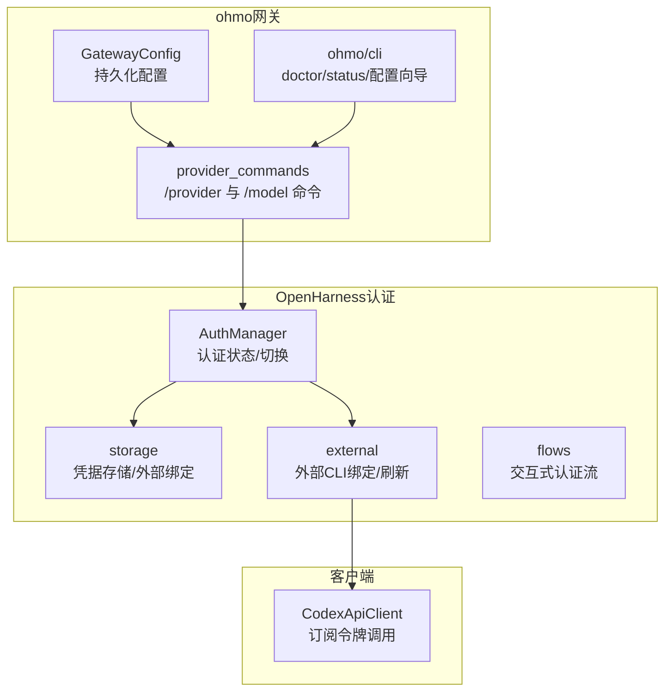
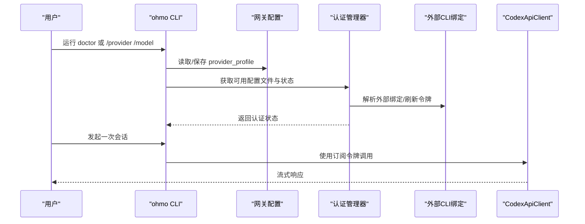
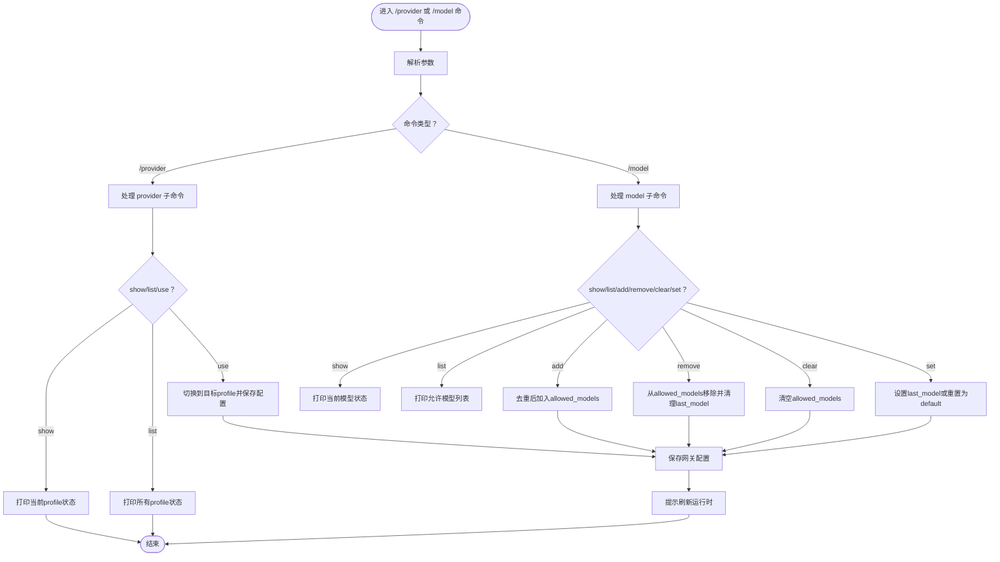
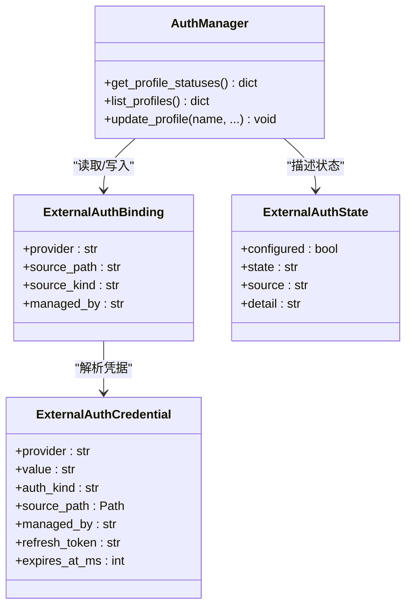
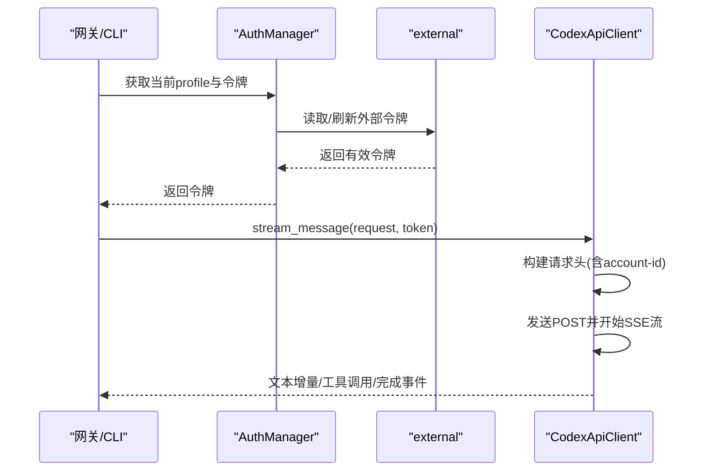
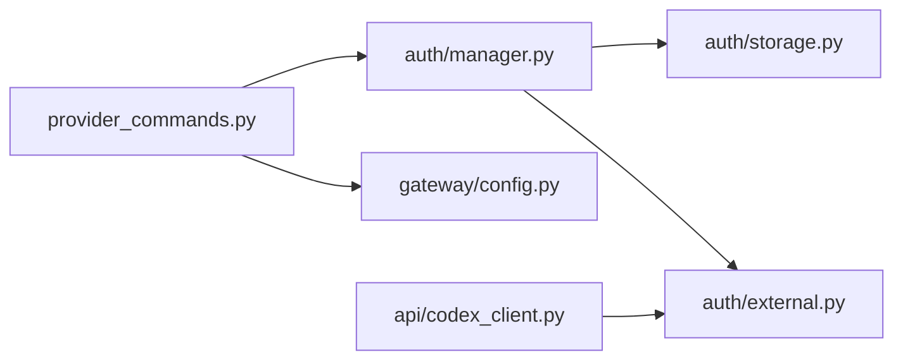

# 认证配置

<cite>
**本文引用的文件**
- [ohmo/gateway/config.py](file://ohmo/gateway/config.py)
- [ohmo/gateway/models.py](file://ohmo/gateway/models.py)
- [ohmo/gateway/provider_commands.py](file://ohmo/gateway/provider_commands.py)
- [ohmo/cli.py](file://ohmo/cli.py)
- [src/openharness/auth/__init__.py](file://src/openharness/auth/__init__.py)
- [src/openharness/auth/manager.py](file://src/openharness/auth/manager.py)
- [src/openharness/auth/storage.py](file://src/openharness/auth/storage.py)
- [src/openharness/auth/external.py](file://src/openharness/auth/external.py)
- [src/openharness/auth/flows.py](file://src/openharness/auth/flows.py)
- [src/openharness/api/codex_client.py](file://src/openharness/api/codex_client.py)
- [src/openharness/config/schema.py](file://src/openharness/config/schema.py)
- [tests/test_auth/test_external.py](file://tests/test_auth/test_external.py)
- [tests/test_ohmo/test_gateway.py](file://tests/test_ohmo/test_gateway.py)
</cite>

## 目录
1. [简介](#简介)
2. [项目结构](#项目结构)
3. [核心组件](#核心组件)
4. [架构总览](#架构总览)
5. [详细组件分析](#详细组件分析)
6. [依赖关系分析](#依赖关系分析)
7. [性能考量](#性能考量)
8. [故障排查指南](#故障排查指南)
9. [结论](#结论)
10. [附录](#附录)

## 简介
本章节面向ohmo认证配置，重点解释ohmo如何复用用户已有的Claude Code或Codex订阅完成认证，无需额外API密钥。文档覆盖认证流程、令牌管理与安全策略，并提供不同提供商的配置步骤、权限与访问控制说明，以及常见失败原因、认证状态检查与故障排除方法。

## 项目结构
ohmo认证配置涉及以下关键模块：
- ohmo网关配置与命令：负责持久化网关配置、提供/provider与/model命令、驱动运行时刷新
- OpenHarness认证管理：统一管理各提供商的认证来源（API Key、外部CLI绑定、OAuth等）
- 外部CLI集成：读取并刷新Claude Code与Codex的本地凭据
- 客户端适配：Codex客户端基于订阅令牌发起请求

**图表来源**
- [ohmo/gateway/config.py:13-26](file://ohmo/gateway/config.py#L13-L26)
- [ohmo/gateway/provider_commands.py:13-52](file://ohmo/gateway/provider_commands.py#L13-L52)
- [src/openharness/auth/manager.py:116-184](file://src/openharness/auth/manager.py#L116-L184)
- [src/openharness/auth/storage.py:122-164](file://src/openharness/auth/storage.py#L122-L164)
- [src/openharness/auth/external.py:116-142](file://src/openharness/auth/external.py#L116-L142)
- [src/openharness/api/codex_client.py:212-243](file://src/openharness/api/codex_client.py#L212-L243)

**章节来源**
- [ohmo/gateway/config.py:13-26](file://ohmo/gateway/config.py#L13-L26)
- [ohmo/gateway/models.py:8-22](file://ohmo/gateway/models.py#L8-L22)
- [ohmo/gateway/provider_commands.py:13-52](file://ohmo/gateway/provider_commands.py#L13-L52)
- [ohmo/cli.py:536-560](file://ohmo/cli.py#L536-L560)
- [src/openharness/auth/manager.py:116-184](file://src/openharness/auth/manager.py#L116-L184)
- [src/openharness/auth/storage.py:122-164](file://src/openharness/auth/storage.py#L122-L164)
- [src/openharness/auth/external.py:116-142](file://src/openharness/auth/external.py#L116-L142)
- [src/openharness/api/codex_client.py:212-243](file://src/openharness/api/codex_client.py#L212-L243)

## 核心组件
- 网关配置模型与IO
  - GatewayConfig：定义provider_profile、通道启用、会话路由、日志级别等
  - load_gateway_config/save_gateway_config：读写~/.ohmo/gateway.json
- 认证状态与切换
  - AuthManager.get_profile_statuses：聚合各提供商认证来源状态
  - 支持外部CLI绑定（codex-cli、claude-cli）与OAuth刷新
- 外部CLI绑定与令牌刷新
  - default_binding_for_provider：默认定位codex与claude凭据位置
  - describe_external_binding：对外部绑定进行状态描述
  - refresh_claude_oauth_credential：在过期时刷新Claude OAuth令牌
- 订阅令牌客户端
  - CodexApiClient：使用订阅令牌访问ChatGPT后端的Responses接口

**章节来源**
- [ohmo/gateway/models.py:8-22](file://ohmo/gateway/models.py#L8-L22)
- [ohmo/gateway/config.py:13-26](file://ohmo/gateway/config.py#L13-L26)
- [src/openharness/auth/manager.py:116-184](file://src/openharness/auth/manager.py#L116-L184)
- [src/openharness/auth/external.py:76-113](file://src/openharness/auth/external.py#L76-L113)
- [src/openharness/auth/external.py:295-342](file://src/openharness/auth/external.py#L295-L342)
- [src/openharness/auth/external.py:413-475](file://src/openharness/auth/external.py#L413-L475)
- [src/openharness/api/codex_client.py:212-243](file://src/openharness/api/codex_client.py#L212-L243)

## 架构总览
ohmo通过“网关配置”选择“提供商配置文件”，再由“认证管理器”解析该文件对应的认证来源。对于Claude Code与Codex，ohmo直接读取官方CLI维护的凭据文件或钥匙串，无需额外API Key。

**图表来源**
- [ohmo/cli.py:536-560](file://ohmo/cli.py#L536-L560)
- [ohmo/gateway/provider_commands.py:13-52](file://ohmo/gateway/provider_commands.py#L13-L52)
- [src/openharness/auth/manager.py:116-184](file://src/openharness/auth/manager.py#L116-L184)
- [src/openharness/auth/external.py:116-142](file://src/openharness/auth/external.py#L116-L142)
- [src/openharness/api/codex_client.py:212-243](file://src/openharness/api/codex_client.py#L212-L243)

## 详细组件分析

### 组件A：网关配置与/provider、/model命令
- 功能要点
  - /provider show/list/use：展示当前网关使用的provider_profile，列出所有可用配置文件，切换到目标配置文件并触发运行时刷新
  - /model show/list/add/remove/clear/set：对当前配置文件的可选模型集合进行管理
- 关键行为
  - 切换provider_profile会更新~/.ohmo/gateway.json
  - 模型命令会联动AuthManager.update_profile以持久化allowed_models与last_model

**图表来源**
- [ohmo/gateway/provider_commands.py:13-111](file://ohmo/gateway/provider_commands.py#L13-L111)

**章节来源**
- [ohmo/gateway/provider_commands.py:13-111](file://ohmo/gateway/provider_commands.py#L13-L111)
- [ohmo/gateway/config.py:13-26](file://ohmo/gateway/config.py#L13-L26)
- [tests/test_ohmo/test_gateway.py:1872-1905](file://tests/test_ohmo/test_gateway.py#L1872-L1905)

### 组件B：认证状态与外部CLI绑定
- 认证来源识别
  - 对于codex_subscription与claude_subscription，ohmo通过load_external_binding读取外部绑定元数据
  - describe_external_binding将外部状态映射为configured/state/source/detail
- 令牌刷新
  - Claude OAuth令牌过期时，refresh_claude_oauth_credential尝试刷新；若refresh_token无效，返回明确错误提示，引导用户重新登录官方CLI后再执行oh认证
- 存储与安全
  - 凭据可落盘或系统钥匙串；文件模式严格限制权限；非加密用途仅做轻量混淆

**图表来源**
- [src/openharness/auth/manager.py:116-184](file://src/openharness/auth/manager.py#L116-L184)
- [src/openharness/auth/storage.py:38-47](file://src/openharness/auth/storage.py#L38-L47)
- [src/openharness/auth/storage.py:208-227](file://src/openharness/auth/storage.py#L208-L227)
- [src/openharness/auth/external.py:66-74](file://src/openharness/auth/external.py#L66-L74)
- [src/openharness/auth/external.py:52-64](file://src/openharness/auth/external.py#L52-L64)

**章节来源**
- [src/openharness/auth/manager.py:116-184](file://src/openharness/auth/manager.py#L116-L184)
- [src/openharness/auth/storage.py:198-227](file://src/openharness/auth/storage.py#L198-L227)
- [src/openharness/auth/external.py:295-342](file://src/openharness/auth/external.py#L295-L342)
- [src/openharness/auth/external.py:413-475](file://src/openharness/auth/external.py#L413-L475)

### 组件C：Codex客户端与订阅令牌
- 认证方式
  - CodexApiClient使用订阅令牌（JWT）作为Bearer认证，从外部CLI绑定中提取并注入请求头
- 请求与流式响应
  - 通过ChatGPT后端API的Responses接口发起流式请求，按事件类型解析文本增量、工具调用、完成事件与用量信息
- 错误处理
  - 针对401/403/429等状态码映射为特定异常类型，便于上层感知与降级

**图表来源**
- [src/openharness/api/codex_client.py:212-243](file://src/openharness/api/codex_client.py#L212-L243)
- [src/openharness/api/codex_client.py:61-74](file://src/openharness/api/codex_client.py#L61-L74)
- [src/openharness/auth/external.py:116-142](file://src/openharness/auth/external.py#L116-L142)

**章节来源**
- [src/openharness/api/codex_client.py:212-243](file://src/openharness/api/codex_client.py#L212-L243)
- [src/openharness/api/codex_client.py:30-46](file://src/openharness/api/codex_client.py#L30-L46)
- [src/openharness/auth/external.py:144-171](file://src/openharness/auth/external.py#L144-L171)

## 依赖关系分析
- ohmo网关配置依赖AuthManager提供的profile状态
- provider_commands依赖AuthManager与GatewayConfig进行配置变更
- 认证状态检查依赖external模块对外部CLI绑定的解析
- 客户端调用依赖external模块提供的令牌

**图表来源**
- [ohmo/gateway/provider_commands.py:7-10](file://ohmo/gateway/provider_commands.py#L7-L10)
- [ohmo/gateway/config.py:7-10](file://ohmo/gateway/config.py#L7-L10)
- [src/openharness/auth/manager.py:18-23](file://src/openharness/auth/manager.py#L18-L23)
- [src/openharness/auth/storage.py:18-23](file://src/openharness/auth/storage.py#L18-L23)
- [src/openharness/auth/external.py](file://src/openharness/auth/external.py#L19)
- [src/openharness/api/codex_client.py:12-21](file://src/openharness/api/codex_client.py#L12-L21)

**章节来源**
- [ohmo/gateway/provider_commands.py:7-10](file://ohmo/gateway/provider_commands.py#L7-L10)
- [ohmo/gateway/config.py:7-10](file://ohmo/gateway/config.py#L7-L10)
- [src/openharness/auth/manager.py:18-23](file://src/openharness/auth/manager.py#L18-L23)
- [src/openharness/auth/storage.py:18-23](file://src/openharness/auth/storage.py#L18-L23)
- [src/openharness/auth/external.py](file://src/openharness/auth/external.py#L19)
- [src/openharness/api/codex_client.py:12-21](file://src/openharness/api/codex_client.py#L12-L21)

## 性能考量
- 外部CLI绑定读取与JSON解析为I/O密集操作，建议避免频繁重复解析；可通过缓存版本号等减少不必要的子进程调用
- SSE流式响应在客户端侧按事件增量拼接，注意内存占用与渲染开销
- 认证状态查询与配置切换为轻量操作，但涉及文件锁与原子写入，需关注磁盘性能

## 故障排查指南
- 常见失败原因
  - 外部绑定缺失或路径不存在：describe_external_binding返回missing
  - 令牌过期且无refresh_token：返回expired；Claude刷新失败会提示invalid_grant，需重新登录官方CLI
  - 未配置当前网关profile的认证：提示“认证未配置”，需运行oh setup或ohmo config
- 排查步骤
  - 使用ohmo doctor检查工作区健康与可用profile
  - 使用oh auth status查看各认证来源状态
  - 使用/refresh命令（如适用）或重新执行oh auth claude-login/codex-login
  - 若为Claude订阅，确保官方CLI已登录并具备刷新能力
- 相关测试参考
  - 测试验证了claude-login在过期场景下自动刷新与绑定行为
  - 测试验证了gateway provider命令对profile切换与状态显示的行为

**章节来源**
- [ohmo/cli.py:536-560](file://ohmo/cli.py#L536-L560)
- [src/openharness/auth/external.py:295-342](file://src/openharness/auth/external.py#L295-L342)
- [src/openharness/auth/external.py:413-475](file://src/openharness/auth/external.py#L413-L475)
- [tests/test_auth/test_external.py:291-349](file://tests/test_auth/test_external.py#L291-L349)
- [tests/test_ohmo/test_gateway.py:1872-1905](file://tests/test_ohmo/test_gateway.py#L1872-L1905)

## 结论
ohmo通过“外部CLI绑定+OAuth刷新”的机制，复用用户已有的Claude Code或Codex订阅完成认证，无需额外API Key。认证状态由AuthManager统一管理，provider_commands负责网关层面的配置切换与模型管理，external模块负责令牌解析与刷新，客户端以订阅令牌发起请求。通过doctor/status与测试用例可快速定位问题并恢复服务。

## 附录

### 不同提供商配置步骤（概要）
- Claude Code（订阅）
  - 确保官方claude-cli已登录，凭据位于~/.claude或系统钥匙串
  - 运行oh auth claude-login以建立外部绑定并刷新令牌
  - 在ohmo中选择“claude-subscription”或“claude-api”等profile
- Codex（订阅）
  - 确保官方codex-cli已登录，凭据位于~/.codex/auth.json
  - 运行oh auth codex-login以建立外部绑定
  - 在ohmo中选择“codex”profile
- 其他API Key类提供商
  - 使用ApiKeyFlow或BrowserFlow等交互式流程录入API Key
  - 通过AuthManager.store_credential持久化至文件或系统钥匙串

**章节来源**
- [src/openharness/auth/external.py:76-113](file://src/openharness/auth/external.py#L76-L113)
- [src/openharness/auth/external.py:116-142](file://src/openharness/auth/external.py#L116-L142)
- [src/openharness/auth/flows.py:34-47](file://src/openharness/auth/flows.py#L34-L47)
- [src/openharness/auth/storage.py:122-164](file://src/openharness/auth/storage.py#L122-L164)

### 权限与访问控制
- 网关通道的访问控制
  - 通过allow_from白名单控制远程来源身份，支持“*”全放行或空列表拒绝
  - 可在ohmo config向导中逐个通道配置
- 远程管理员命令
  - 可选择性开放特定斜杠命令，需显式列入allowlist

**章节来源**
- [ohmo/cli.py:194-316](file://ohmo/cli.py#L194-L316)
- [src/openharness/config/schema.py:99-111](file://src/openharness/config/schema.py#L99-L111)