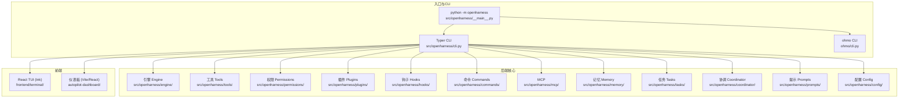
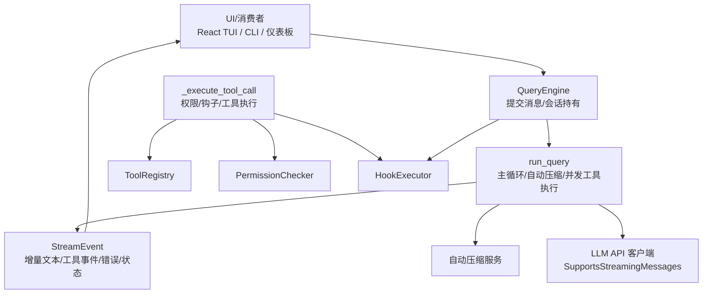
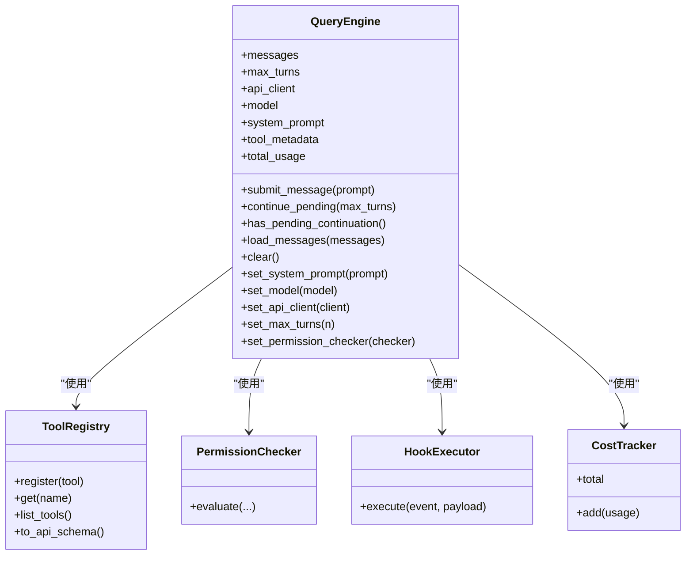
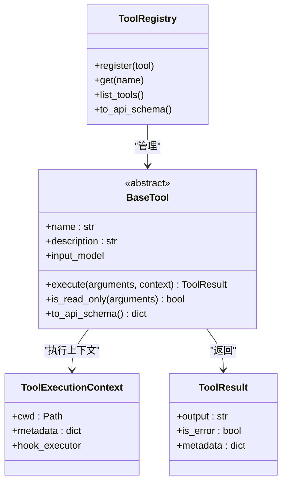
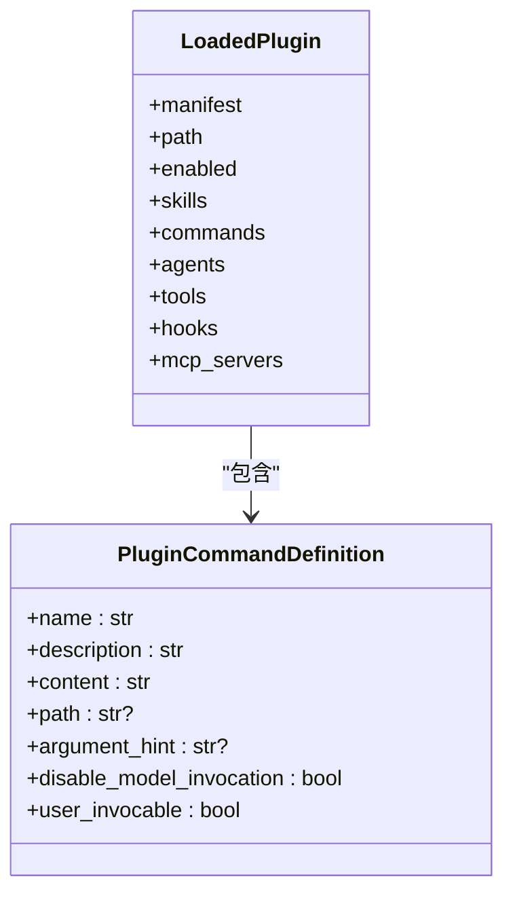
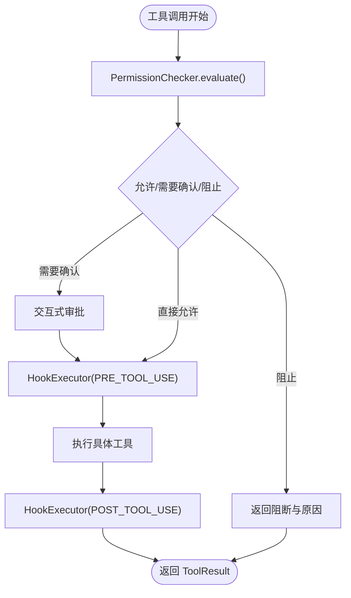
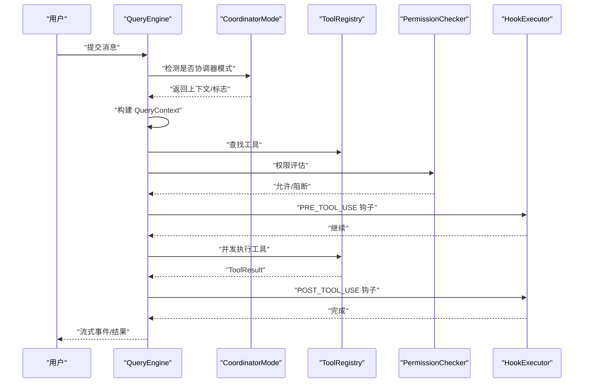
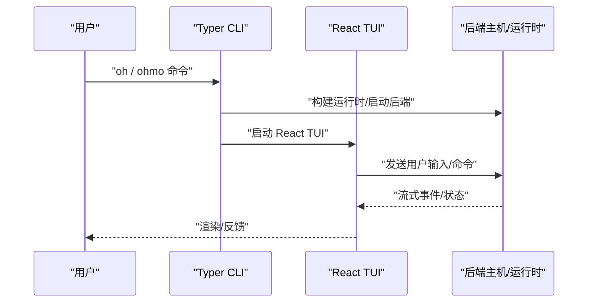
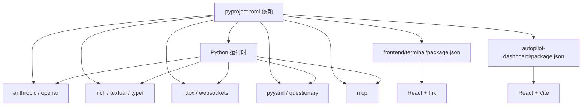

# 技术栈和设计理念

<cite>
**本文引用的文件**
- [README.md](file://README.md)
- [pyproject.toml](file://pyproject.toml)
- [src/openharness/__main__.py](file://src/openharness/__main__.py)
- [ohmo/__main__.py](file://ohmo/__main__.py)
- [src/openharness/cli.py](file://src/openharness/cli.py)
- [ohmo/cli.py](file://ohmo/cli.py)
- [src/openharness/ui/app.py](file://src/openharness/ui/app.py)
- [src/openharness/engine/query_engine.py](file://src/openharness/engine/query_engine.py)
- [src/openharness/engine/messages.py](file://src/openharness/engine/messages.py)
- [src/openharness/engine/query.py](file://src/openharness/engine/query.py)
- [src/openharness/engine/stream_events.py](file://src/openharness/engine/stream_events.py)
- [src/openharness/tools/base.py](file://src/openharness/tools/base.py)
- [src/openharness/plugins/types.py](file://src/openharness/plugins/types.py)
- [src/openharness/config/schema.py](file://src/openharness/config/schema.py)
- [src/openharness/permissions/modes.py](file://src/openharness/permissions/modes.py)
- [src/openharness/coordinator/coordinator_mode.py](file://src/openharness/coordinator/coordinator_mode.py)
- [src/openharness/hooks/types.py](file://src/openharness/hooks/types.py)
- [src/openharness/swarm/types.py](file://src/openharness/swarm/types.py)
- [frontend/terminal/package.json](file://frontend/terminal/package.json)
- [autopilot-dashboard/package.json](file://autopilot-dashboard/package.json)
</cite>

## 目录
1. [简介](#简介)
2. [项目结构](#项目结构)
3. [核心组件](#核心组件)
4. [架构总览](#架构总览)
5. [详细组件分析](#详细组件分析)
6. [依赖分析](#依赖分析)
7. [性能考量](#性能考量)
8. [故障排查指南](#故障排查指南)
9. [结论](#结论)
10. [附录](#附录)

## 简介
本文件系统化阐述 OpenHarness 的技术栈与设计理念，重点覆盖：
- 后端技术栈：Python 3.10+、异步运行时、类型与协议驱动的模块化设计
- 前端技术栈：React + Ink（终端 TUI）、Vite + React（可视化仪表板）
- CLI 框架：Typer，提供命令式交互与脚本化能力
- Rich 终端 UI：增强可读性与可观测性
- 设计理念：模块化、异步编程、插件化扩展、安全优先、跨平台兼容与可扩展性
- 与其他 AI 代理方案的差异化优势

## 项目结构
OpenHarness 采用“分层 + 子系统”的组织方式，核心子系统包括引擎、工具、技能、插件、权限、钩子、命令、MCP、记忆、任务、协调、提示、配置、UI 等。入口点通过 Typer 提供 CLI，React + Ink 提供终端 TUI，Vite 提供可视化仪表板。

图示来源
- [src/openharness/__main__.py:1-7](file://src/openharness/__main__.py#L1-L7)
- [src/openharness/cli.py:1-200](file://src/openharness/cli.py#L1-L200)
- [ohmo/cli.py:1-200](file://ohmo/cli.py#L1-L200)
- [frontend/terminal/package.json:1-22](file://frontend/terminal/package.json#L1-L22)
- [autopilot-dashboard/package.json:1-23](file://autopilot-dashboard/package.json#L1-L23)

章节来源
- [README.md:446-502](file://README.md#L446-L502)
- [pyproject.toml:1-86](file://pyproject.toml#L1-L86)

## 核心组件
- 引擎（Engine）：负责工具感知的对话循环、消息建模、自动压缩、并发工具执行、成本追踪与流式事件输出
- 工具（Tools）：统一抽象的工具基类与注册表，支持输入校验、API Schema 导出与权限集成
- 插件（Plugins）：命令、钩子、代理、MCP 服务器等生态扩展
- 权限（Permissions）：多级模式、路径规则、命令禁用与交互式审批
- 钩子（Hooks）：Pre/Post ToolUse 生命周期事件
- 命令（Commands）：Slash 命令体系，与技能、工具、任务联动
- MCP：模型上下文协议客户端，支持 HTTP/WS/STDIO 传输
- 记忆（Memory）：持久化跨会话知识
- 任务（Tasks）：后台任务生命周期管理
- 协调（Coordinator）：子智能体派生、团队注册、任务编排
- 提示（Prompts）：系统提示组装、CLAUDE.md 注入
- 配置（Config）：多层配置、迁移与兼容通道配置模型
- UI：React TUI（Ink）与可视化仪表板（Vite/React）

章节来源
- [README.md:446-502](file://README.md#L446-L502)
- [src/openharness/engine/query_engine.py:19-192](file://src/openharness/engine/query_engine.py#L19-L192)
- [src/openharness/tools/base.py:35-81](file://src/openharness/tools/base.py#L35-L81)
- [src/openharness/plugins/types.py:18-60](file://src/openharness/plugins/types.py#L18-L60)
- [src/openharness/permissions/modes.py:8-14](file://src/openharness/permissions/modes.py#L8-L14)
- [src/openharness/hooks/types.py:9-39](file://src/openharness/hooks/types.py#L9-L39)
- [src/openharness/config/schema.py:18-117](file://src/openharness/config/schema.py#L18-L117)
- [src/openharness/coordinator/coordinator_mode.py:186-200](file://src/openharness/coordinator/coordinator_mode.py#L186-L200)
- [src/openharness/swarm/types.py:12-200](file://src/openharness/swarm/types.py#L12-L200)

## 架构总览
OpenHarness 的核心是“查询引擎 + 工具注册表 + 权限 + 钩子 + 流式事件”的闭环，配合 CLI/TTY/仪表板形成统一的交互与输出体验。

图示来源
- [docs/engine-module-design.md:21-45](file://docs/engine-module-design.md#L21-L45)
- [src/openharness/engine/query_engine.py:147-192](file://src/openharness/engine/query_engine.py#L147-L192)
- [src/openharness/engine/query.py:107-133](file://src/openharness/engine/query.py#L107-L133)
- [src/openharness/engine/stream_events.py:207-222](file://src/openharness/engine/stream_events.py#L207-L222)

章节来源
- [docs/engine-module-design.md:19-285](file://docs/engine-module-design.md#L19-L285)

## 详细组件分析

### 引擎模块（Engine）
- 职责：会话持有、消息建模、自动压缩、并发工具执行、成本追踪、流式事件
- 关键点：
  - 使用异步生成器输出流式事件，UI 可增量消费
  - 判别联合内容块确保类型安全
  - 延续元数据跨轮次传递，提升模型上下文感知
  - 响应式压缩与错误恢复机制
  - 与 Hook、权限、MCP、任务等子系统协作

图示来源
- [src/openharness/engine/query_engine.py:19-192](file://src/openharness/engine/query_engine.py#L19-L192)
- [src/openharness/engine/messages.py:49-81](file://src/openharness/engine/messages.py#L49-L81)
- [src/openharness/tools/base.py:60-81](file://src/openharness/tools/base.py#L60-L81)

章节来源
- [docs/engine-module-design.md:47-285](file://docs/engine-module-design.md#L47-L285)
- [src/openharness/engine/query_engine.py:19-192](file://src/openharness/engine/query_engine.py#L19-L192)
- [src/openharness/engine/messages.py:49-81](file://src/openharness/engine/messages.py#L49-L81)

### 工具系统（Tools）
- 抽象：BaseTool + ToolExecutionContext + ToolResult
- 能力：输入 Pydantic 校验、自描述 JSON Schema、权限集成、Hook 支持
- 注册：ToolRegistry 提供统一注册与查询

图示来源
- [src/openharness/tools/base.py:17-81](file://src/openharness/tools/base.py#L17-L81)

章节来源
- [src/openharness/tools/base.py:17-81](file://src/openharness/tools/base.py#L17-L81)

### 插件系统（Plugins）
- 能力：贡献命令、钩子、代理、工具、MCP 服务器
- 结构：LoadedPlugin 聚合多种贡献物，便于统一装载与启用

图示来源
- [src/openharness/plugins/types.py:18-60](file://src/openharness/plugins/types.py#L18-L60)

章节来源
- [src/openharness/plugins/types.py:18-60](file://src/openharness/plugins/types.py#L18-L60)

### 权限与钩子（Permissions & Hooks）
- 权限模式：默认、计划模式、全自动化
- 钩子结果：HookResult 与聚合结果 AggregatedHookResult，支持阻断与原因

图示来源
- [src/openharness/permissions/modes.py:8-14](file://src/openharness/permissions/modes.py#L8-L14)
- [src/openharness/hooks/types.py:9-39](file://src/openharness/hooks/types.py#L9-L39)

章节来源
- [src/openharness/permissions/modes.py:8-14](file://src/openharness/permissions/modes.py#L8-L14)
- [src/openharness/hooks/types.py:9-39](file://src/openharness/hooks/types.py#L9-L39)

### 协调与蜂群（Coordinator & Swarm）
- 协调器模式：检测与注入上下文，支持子智能体派生与任务编排
- 蜂群后端：抽象 PaneBackend，支持 tmux/iTerm2 等终端面板管理

图示来源
- [src/openharness/coordinator/coordinator_mode.py:186-200](file://src/openharness/coordinator/coordinator_mode.py#L186-L200)
- [src/openharness/engine/query_engine.py:147-192](file://src/openharness/engine/query_engine.py#L147-L192)
- [src/openharness/engine/query.py:117-125](file://src/openharness/engine/query.py#L117-L125)

章节来源
- [src/openharness/coordinator/coordinator_mode.py:186-200](file://src/openharness/coordinator/coordinator_mode.py#L186-L200)
- [src/openharness/swarm/types.py:46-200](file://src/openharness/swarm/types.py#L46-L200)

### CLI 与 TUI
- CLI：Typer 提供命令式入口，支持非交互模式、JSON/流式 JSON 输出
- TUI：React + Ink 提供终端交互体验，支持命令选择、权限弹窗、模式切换、动画反馈
- 仪表板：Vite + React 提供可视化看板

图示来源
- [src/openharness/cli.py:1-200](file://src/openharness/cli.py#L1-L200)
- [ohmo/cli.py:1-200](file://ohmo/cli.py#L1-L200)
- [src/openharness/ui/app.py:40-170](file://src/openharness/ui/app.py#L40-L170)
- [frontend/terminal/package.json:1-22](file://frontend/terminal/package.json#L1-L22)
- [autopilot-dashboard/package.json:1-23](file://autopilot-dashboard/package.json#L1-L23)

章节来源
- [src/openharness/cli.py:1-200](file://src/openharness/cli.py#L1-L200)
- [ohmo/cli.py:1-200](file://ohmo/cli.py#L1-L200)
- [src/openharness/ui/app.py:40-170](file://src/openharness/ui/app.py#L40-L170)

## 依赖分析
- 后端依赖：anthropic、openai、rich、prompt-toolkit、textual、typer、pydantic、httpx、websockets、mcp、pyyaml、questionary、watchfiles、croniter、各 IM SDK
- 前端依赖：React、Ink、marked、Vite、React（仪表板）
- 入口脚本：oh、openh、ohmo 指向对应 Typer 应用

图示来源
- [pyproject.toml:16-36](file://pyproject.toml#L16-L36)
- [frontend/terminal/package.json:8-14](file://frontend/terminal/package.json#L8-L14)
- [autopilot-dashboard/package.json:11-14](file://autopilot-dashboard/package.json#L11-L14)

章节来源
- [pyproject.toml:16-36](file://pyproject.toml#L16-L36)
- [pyproject.toml:48-52](file://pyproject.toml#L48-L52)

## 性能考量
- 异步与并发：引擎使用异步生成器与 asyncio.gather 并发执行工具，降低整体延迟
- 自动压缩：在上下文接近阈值时进行微压缩或摘要压缩，避免超长提示导致失败
- 工具输出卸载：大型输出落盘并附带内联预览，减少上下文占用
- 成本追踪：按轮次聚合 token 使用，便于成本控制与优化
- 会话续传：消息规范化与挂起续传能力，支持长时间任务与多日会话

章节来源
- [docs/engine-module-design.md:117-125](file://docs/engine-module-design.md#L117-L125)
- [docs/engine-module-design.md:195-206](file://docs/engine-module-design.md#L195-L206)
- [src/openharness/engine/query_engine.py:147-192](file://src/openharness/engine/query_engine.py#L147-L192)

## 故障排查指南
- 干运行（Dry-run）：在不调用模型/执行工具/连接 MCP 的前提下，预览设置、认证、技能、命令与 MCP 配置问题，给出 ready/warning/blocked 与修复建议
- 错误事件：网络错误、API 错误、令牌限制错误等均以 ErrorEvent 形式输出，便于定位
- 权限阻断：若工具被阻断，查看 HookResult.reason 或交互式审批流程
- 仪表板与 TUI：确认前端依赖安装与脚本可用，React TUI 的动画与输入在不同终端下的表现差异

章节来源
- [README.md:268-304](file://README.md#L268-L304)
- [src/openharness/engine/query.py:127-133](file://src/openharness/engine/query.py#L127-L133)
- [src/openharness/hooks/types.py:21-39](file://src/openharness/hooks/types.py#L21-L39)
- [frontend/terminal/package.json:1-22](file://frontend/terminal/package.json#L1-L22)
- [autopilot-dashboard/package.json:1-23](file://autopilot-dashboard/package.json#L1-L23)

## 结论
OpenHarness 以“引擎为核心、工具为触手、权限为边界、钩子为扩展点”的模块化架构，结合异步与并发、自动压缩与成本追踪，实现了高可观察性、高安全性与高可扩展性的 AI 代理基础设施。通过 Typer CLI、React + Ink TUI 与可视化仪表板，兼顾开发者与使用者的效率与体验。相较其他方案，其在以下方面具备差异化优势：
- 与 Claude-style 工具约定高度兼容，生态可移植性强
- 干运行与结构化输出，显著降低调试与集成成本
- 多级权限与交互式审批，满足生产环境安全要求
- 蜂群与协调器模式，支持复杂任务编排与多智能体协作

## 附录
- 入口脚本映射：oh、openh、ohmo 指向 Typer 应用
- 前端包管理：终端 TUI 与仪表板分别维护独立依赖与构建脚本

章节来源
- [pyproject.toml:48-52](file://pyproject.toml#L48-L52)
- [frontend/terminal/package.json:1-22](file://frontend/terminal/package.json#L1-L22)
- [autopilot-dashboard/package.json:1-23](file://autopilot-dashboard/package.json#L1-L23)