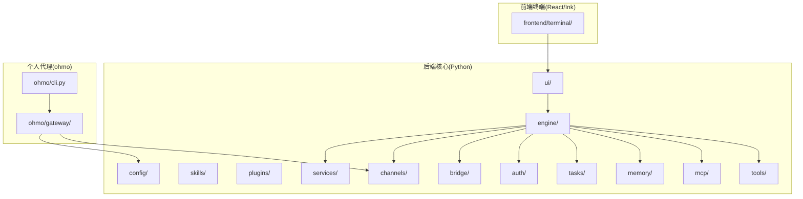
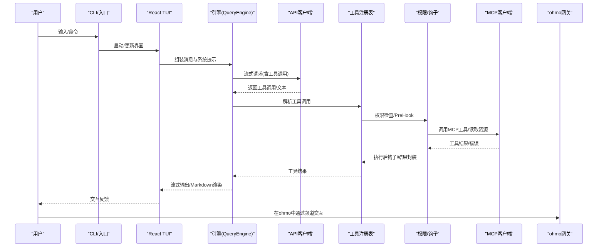
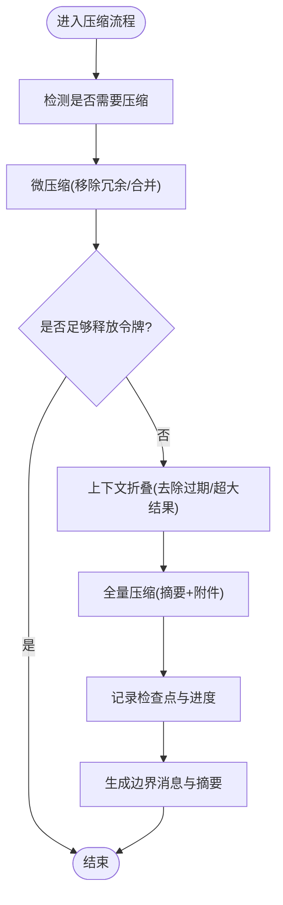
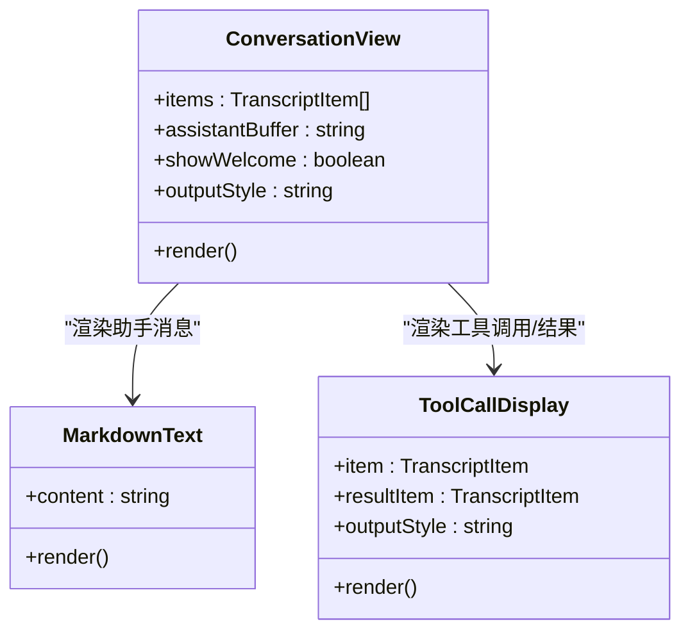
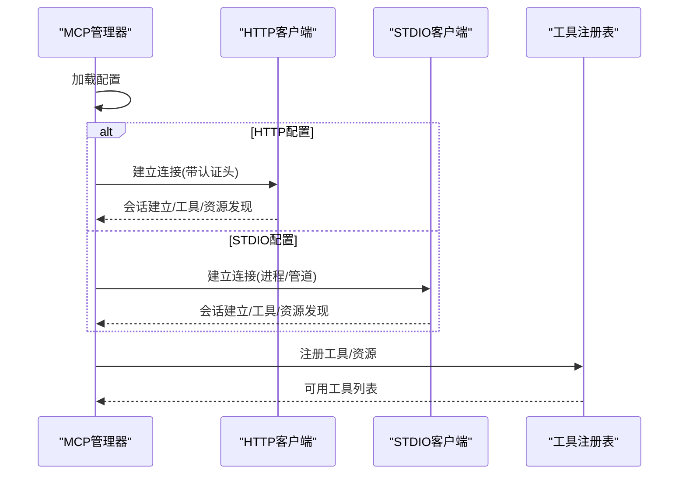
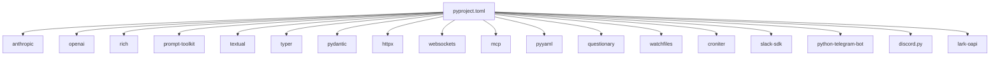

# 项目发展历程

<cite>
**本文引用的文件**
- [README.md](file://README.md)
- [CHANGELOG.md](file://CHANGELOG.md)
- [RELEASE_NOTES_v0.1.8.md](file://RELEASE_NOTES_v0.1.8.md)
- [RELEASE_NOTES_v0.1.9.md](file://RELEASE_NOTES_v0.1.9.md)
- [CONTRIBUTING.md](file://CONTRIBUTING.md)
- [pyproject.toml](file://pyproject.toml)
- [src/openharness/services/compact/__init__.py](file://src/openharness/services/compact/__init__.py)
- [src/openharness/mcp/client.py](file://src/openharness/mcp/client.py)
- [src/openharness/ui/react_launcher.py](file://src/openharness/ui/react_launcher.py)
- [frontend/terminal/src/components/ConversationView.tsx](file://frontend/terminal/src/components/ConversationView.tsx)
- [frontend/terminal/src/components/MarkdownText.tsx](file://frontend/terminal/src/components/MarkdownText.tsx)
- [ohmo/cli.py](file://ohmo/cli.py)
- [ohmo/gateway/service.py](file://ohmo/gateway/service.py)
- [ohmo/gateway/config.py](file://ohmo/gateway/config.py)
- [docs/SHOWCASE.md](file://docs/SHOWCASE.md)
</cite>

## 目录
1. [引言](#引言)
2. [项目结构](#项目结构)
3. [核心组件](#核心组件)
4. [架构总览](#架构总览)
5. [详细组件分析](#详细组件分析)
6. [依赖关系分析](#依赖关系分析)
7. [性能考量](#性能考量)
8. [故障排查指南](#故障排查指南)
9. [结论](#结论)
10. [附录](#附录)

## 引言
本文件系统性梳理 OpenHarness 从 v0.1.0 到最新版本 v0.1.9 的发展历程与关键里程碑，聚焦以下重要演进：自动压缩（Auto-Compaction）、Markdown TUI 渲染、MCP 协议增强（HTTP 传输与工具类型推断）、多提供商认证与 Moonshot/Kimi 支持、Windows 原生支持与终端稳定性、ohmo 个人代理的渠道集成与安全加固、技能工作流与用户可触发技能等。同时总结开源历程、社区贡献与未来规划，并提供版本升级与迁移建议。

## 项目结构
OpenHarness 采用“子包分层 + 多语言前端”的混合架构：
- 后端核心（Python）：engine、tools、skills、plugins、permissions、hooks、commands、mcp、memory、tasks、coordinator、prompts、config、ui 等模块协同实现代理循环、工具执行、权限控制、上下文压缩、多代理编排与 UI 协议。
- 前端终端（React/Ink）：提供交互式 TUI，支持命令选择、权限弹窗、会话恢复、动画加载与 Markdown 渲染。
- 个人代理（ohmo）：独立应用，提供网关、频道配置与跨平台运行能力。
- 发布与脚本：安装脚本、测试脚本、CI 配置与版本发布说明。

图表来源
- [pyproject.toml:48-52](file://pyproject.toml#L48-L52)
- [src/openharness/ui/react_launcher.py](file://src/openharness/ui/react_launcher.py)
- [ohmo/cli.py:194-222](file://ohmo/cli.py#L194-L222)

章节来源
- [README.md:446-502](file://README.md#L446-L502)
- [pyproject.toml:48-52](file://pyproject.toml#L48-L52)

## 核心组件
- 自动压缩（Auto-Compaction）：在上下文膨胀时进行微压缩与全量压缩，保留任务焦点、近期目标、已验证状态与活动工件，确保长会话不中断。
- Markdown TUI 渲染：React TUI 对助手消息启用结构化 Markdown 渲染（标题、列表、代码块、表格、链接、引用），并优化表格列宽与对齐。
- MCP 协议增强：支持 HTTP 传输、自动重连、断线容错、工具输入 JSON Schema 类型推断；工具注册与资源发现更自动化。
- 多提供商认证：统一工作流与配置文件作用域，支持 Moonshot/Kimi 思维模型、OpenAI 兼容格式、GitHub Copilot OAuth、NVIDIA NIM、Qwen/DashScope、MiniMax、Gemini 等。
- Windows 原生支持：修复子进程启动、路径转义、终端回显、浏览器打开等跨平台问题，提升稳定性与可用性。
- ohmo 个人代理：支持 Telegram、Slack、Discord、Feishu 等频道，提供网关配置向导、群组路由与提及策略、附件处理与安全命令隔离。
- 技能工作流：内置技能创建器、用户可触发技能的斜杠命令、技能元数据驱动的模型覆盖与参数传递。

章节来源
- [CHANGELOG.md:7-96](file://CHANGELOG.md#L7-L96)
- [RELEASE_NOTES_v0.1.8.md:1-67](file://RELEASE_NOTES_v0.1.8.md#L1-L67)
- [RELEASE_NOTES_v0.1.9.md:1-33](file://RELEASE_NOTES_v0.1.9.md#L1-L33)
- [README.md:154-193](file://README.md#L154-L193)

## 架构总览
下图展示从用户输入到模型推理、工具调用与结果回流的闭环流程，以及 MCP、TUI、ohmo 网关的关键交互点。

图表来源
- [src/openharness/mcp/client.py:29-69](file://src/openharness/mcp/client.py#L29-L69)
- [frontend/terminal/src/components/ConversationView.tsx:30-160](file://frontend/terminal/src/components/ConversationView.tsx#L30-L160)
- [ohmo/gateway/service.py:191-226](file://ohmo/gateway/service.py#L191-L226)

## 详细组件分析

### 版本演进与里程碑（v0.1.0 → v0.1.9）
- v0.1.0（2026-04-01）：首次开源发布，完整 Harness 架构上线，包含代理循环、工具集、技能系统、插件生态、MCP 支持与终端 UI。
- v0.1.2（2026-04-06）：统一设置流程与 ohmo 个人代理应用打包，支持工作区与网关引导。
- v0.1.4（2026-04-08）：多提供商认证重构，新增 Moonshot/Kimi 支持，MCP 断线容错与安全加固。
- v0.1.5（2026-04-08）：MCP HTTP 传输、自动重连、工具类型推断，ohmo 频道文件附件与多模态支持。
- v0.1.6（2026-04-10）：自动压缩保持任务状态与日志，子进程队友头模式稳定，React TUI 全量 Markdown 渲染。
- v0.1.7（2026-04-18）：打包与 TUI 优化，Windows 终端动画更稳健，Shift+Enter 插入换行。
- v0.1.8（2026-05-06）：新增 NVIDIA NIM、Qwen、MiniMax、Gemini 提供商配置；插件工具发现；ohmo Feishu 群组路由与提及策略；Windows 子进程启动修复；MCP 启动隔离；大结果边界与压缩优化；TUI Markdown 表格渲染；Dry-run 安全预览。
- v0.1.9（2026-05-07）：内置技能创建器；用户可触发技能的斜杠命令；提供商标签更新与密钥替换；TUI 体验与稳定性持续优化。

章节来源
- [CHANGELOG.md:9-96](file://CHANGELOG.md#L9-L96)
- [README.md:154-193](file://README.md#L154-L193)
- [RELEASE_NOTES_v0.1.8.md:1-67](file://RELEASE_NOTES_v0.1.8.md#L1-L67)
- [RELEASE_NOTES_v0.1.9.md:1-33](file://RELEASE_NOTES_v0.1.9.md#L1-L33)

### 自动压缩（Auto-Compaction）
- 设计要点：在上下文膨胀前进行“上下文折叠”与“微压缩”，必要时执行“全量压缩”，保留任务焦点、近期目标、已验证状态与活动工件，减少令牌占用并维持会话连续性。
- 关键流程：检测溢出、尝试微压缩、上下文折叠、全量压缩、记录检查点与进度回调、生成边界消息与摘要。
- 性能影响：降低长会话内存与令牌压力，避免频繁重试与失败；对图像块与大结果进行估算与裁剪，平衡精度与效率。

图表来源
- [src/openharness/services/compact/__init__.py:1500-1529](file://src/openharness/services/compact/__init__.py#L1500-L1529)
- [src/openharness/services/compact/__init__.py:1406-1428](file://src/openharness/services/compact/__init__.py#L1406-L1428)

章节来源
- [src/openharness/services/compact/__init__.py:182-213](file://src/openharness/services/compact/__init__.py#L182-L213)
- [src/openharness/services/compact/__init__.py:1496-1509](file://src/openharness/services/compact/__init__.py#L1496-L1509)

### Markdown TUI 渲染
- 功能演进：v0.1.6 起助手消息启用结构化 Markdown 渲染；v0.1.8 进一步优化表格列宽与对齐，支持标题、列表、代码块、引用、链接与表格。
- 实现方式：前端组件按角色渲染，工具调用与结果以成对行或单行呈现，Codex 输出风格减少逐令牌刷新带来的重绘压力。

图表来源
- [frontend/terminal/src/components/ConversationView.tsx:30-160](file://frontend/terminal/src/components/ConversationView.tsx#L30-L160)
- [frontend/terminal/src/components/MarkdownText.tsx](file://frontend/terminal/src/components/MarkdownText.tsx)
- [frontend/terminal/src/components/ToolCallDisplay.tsx:1-38](file://frontend/terminal/src/components/ToolCallDisplay.tsx#L1-L38)

章节来源
- [CHANGELOG.md:40-41](file://CHANGELOG.md#L40-L41)
- [CHANGELOG.md:77-78](file://CHANGELOG.md#L77-L78)

### MCP 协议增强
- 新增能力：HTTP 传输、自动重连、断线容错、工具输入 JSON Schema 类型推断、工具注册与资源发现。
- 稳定性：MCP 启动失败不再阻塞整体启动，失败服务器被隔离；stderr 管道死锁修复；大结果与视觉上下文下的压缩优化。
- 使用场景：ohmo 频道多模态消息、远程命令安全策略、桥接命令本地化等。

图表来源
- [src/openharness/mcp/client.py:45-69](file://src/openharness/mcp/client.py#L45-L69)
- [src/openharness/mcp/client.py:218-234](file://src/openharness/mcp/client.py#L218-L234)

章节来源
- [CHANGELOG.md:27-34](file://CHANGELOG.md#L27-L34)
- [CHANGELOG.md:43-52](file://CHANGELOG.md#L43-L52)
- [RELEASE_NOTES_v0.1.8.md:31-35](file://RELEASE_NOTES_v0.1.8.md#L31-L35)

### 多提供商认证与 Moonshot/Kimi
- 认证工作流：统一工作流与配置文件作用域，支持按配置文件保存凭据；修复切换提供商时的密钥不匹配问题；新增 OPENAI_BASE_URL 环境变量覆盖。
- 新增支持：Moonshot/Kimi 思维模型（reasoning_content）、NVIDIA NIM、Qwen/DashScope、MiniMax、Gemini 等。
- 安全加固：敏感路径保护、URL 校验强化、远程通道命令本地化默认策略。

章节来源
- [CHANGELOG.md:25-36](file://CHANGELOG.md#L25-L36)
- [CHANGELOG.md:75-76](file://CHANGELOG.md#L75-L76)
- [RELEASE_NOTES_v0.1.8.md:19-23](file://RELEASE_NOTES_v0.1.8.md#L19-L23)

### Windows 原生支持与终端稳定性
- 子进程启动：绕过 shell，直接构建 argv 并使用 asyncio 创建进程，解决 Windows 下路径转义与反斜杠问题。
- 终端体验：Shift+Enter 插入换行、DEL 字节回退删除、Spinner 动画在 Windows 更稳健、退出清理避免残留行。
- 网关生命周期：改进进程生命周期处理与重启通知发布。

章节来源
- [CHANGELOG.md:45-56](file://CHANGELOG.md#L45-L56)
- [CHANGELOG.md:84-88](file://CHANGELOG.md#L84-L88)
- [ohmo/gateway/service.py:191-226](file://ohmo/gateway/service.py#L191-L226)

### ohmo 个人代理：渠道集成与安全
- 渠道配置：支持 Telegram、Slack、Discord、Feishu；配置向导引导频道启用、允许来源、代理配置等。
- 群组路由：Feishu 群组支持托管群创建、网关级提供商标识与模型命令、严格提及策略仅在被点名时响应。
- 安全策略：远程通道默认限制敏感命令、桥接命令本地化、插件卸载路径遍历防护。

章节来源
- [ohmo/cli.py:194-222](file://ohmo/cli.py#L194-L222)
- [ohmo/gateway/config.py:29-41](file://ohmo/gateway/config.py#L29-L41)
- [RELEASE_NOTES_v0.1.8.md:13-17](file://RELEASE_NOTES_v0.1.8.md#L13-L17)

### 技能工作流与用户可触发技能
- 内置技能创建器：帮助创建、改进与验证技能，便于复用工作流。
- 用户可触发技能：标记为用户可触发后可通过斜杠命令直接调用，支持技能参数与模型覆盖元数据。

章节来源
- [CHANGELOG.md:11-14](file://CHANGELOG.md#L11-L14)
- [RELEASE_NOTES_v0.1.9.md:7-13](file://RELEASE_NOTES_v0.1.9.md#L7-L13)

## 依赖关系分析
- 版本与入口：当前版本为 0.1.9，命令映射包含 oh、openh、ohmo。
- 核心依赖：anthropic、openai、rich、prompt-toolkit、textual、typer、pydantic、httpx、websockets、mcp、pyyaml、questionary、watchfiles、croniter、各即时通讯 SDK。
- 前端打包：终端前端源码打包到 Python 包内，便于一次性安装与运行。

图表来源
- [pyproject.toml:16-36](file://pyproject.toml#L16-L36)
- [pyproject.toml:48-52](file://pyproject.toml#L48-L52)

章节来源
- [pyproject.toml:1-86](file://pyproject.toml#L1-L86)

## 性能考量
- 上下文压缩：优先微压缩与上下文折叠，避免不必要的全量压缩；对图像块与大结果进行估算与裁剪，减少令牌与存储压力。
- TUI 渲染：Codex 输出风格减少逐令牌刷新，降低重绘开销；表格列宽基于渲染文本计算，避免对齐破坏导致的额外重绘。
- 子进程与 I/O：stderr 重定向至 DEVNULL 防止管道阻塞；stdin 默认修复与超时处理，确保工具快速返回。
- 网络与协议：MCP HTTP 传输与自动重连，减少因断线导致的失败与重试成本。

章节来源
- [src/openharness/services/compact/__init__.py:1500-1529](file://src/openharness/services/compact/__init__.py#L1500-L1529)
- [CHANGELOG.md:71-72](file://CHANGELOG.md#L71-L72)
- [CHANGELOG.md:47-51](file://CHANGELOG.md#L47-L51)

## 故障排查指南
- MCP 启动失败：确认配置正确与网络可达；若失败不会阻塞启动，可在后续重连；检查认证头与传输类型。
- Windows 子进程卡住：确认已使用 argv 直接执行而非 shell 包装；检查路径转义与环境变量。
- TUI 回车重复提交：检查输入处理器逻辑，确保去重；退出后残留行：确保清理阶段写入换行符。
- 大结果导致上下文膨胀：启用自动压缩；检查工具输出大小与历史截断策略。
- 远程通道安全：默认限制敏感命令与桥接命令本地化；如需远程执行，明确配置并评估风险。

章节来源
- [src/openharness/mcp/client.py:45-69](file://src/openharness/mcp/client.py#L45-L69)
- [CHANGELOG.md:45-56](file://CHANGELOG.md#L45-L56)
- [CHANGELOG.md:75-76](file://CHANGELOG.md#L75-L76)

## 结论
OpenHarness 在 v0.1.8–v0.1.9 期间完成了从“功能补齐”到“稳定性与可用性”的关键跃迁：自动压缩保障长会话连续性，MCP 协议增强与多提供商认证提升生态兼容性，Windows 原生支持显著改善跨平台体验，ohmo 个人代理的渠道与安全策略日趋成熟，技能工作流与用户可触发技能进一步降低上手门槛。未来建议持续关注跨平台一致性、生态扩展与可观测性增强。

## 附录

### 开源历程与社区贡献
- 贡献指南：提供开发环境搭建、本地校验命令、PR 规范与文档贡献方向。
- 社区参与：通过 Issue 模板、Pull Request 模板与贡献者名单维护协作流程。
- 展示案例：SHOWCASE.md 提供可复现实战示例，便于评估与推广。

章节来源
- [CONTRIBUTING.md:1-69](file://CONTRIBUTING.md#L1-L69)
- [docs/SHOWCASE.md:1-81](file://docs/SHOWCASE.md#L1-L81)

### 版本升级与迁移指南
- 从 v0.1.7 升级到 v0.1.8：
  - 安装新版本并重新初始化 ohmo 工作区（如有需要）。
  - 检查 ohmo 频道配置，尤其是 Feishu 群组路由与提及策略。
  - 更新提供商标签与密钥更新流程，使用新增的编辑与添加命令。
  - 若使用 MCP，确认 HTTP 传输与认证头配置正确。
- 从 v0.1.8 升级到 v0.1.9：
  - 安装新版本后，可直接使用内置技能创建器与用户可触发技能的斜杠命令。
  - 如需更换已配置提供商的 API 密钥，使用新增的编辑与添加命令。
  - 检查 TUI Markdown 表格渲染与输出风格变化，必要时调整输出格式偏好。

章节来源
- [RELEASE_NOTES_v0.1.8.md:60-67](file://RELEASE_NOTES_v0.1.8.md#L60-L67)
- [RELEASE_NOTES_v0.1.9.md:24-33](file://RELEASE_NOTES_v0.1.9.md#L24-L33)
- [CHANGELOG.md:9-20](file://CHANGELOG.md#L9-L20)