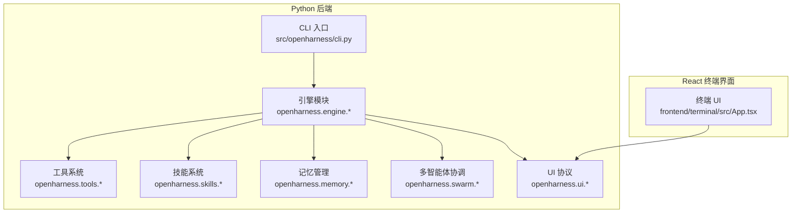
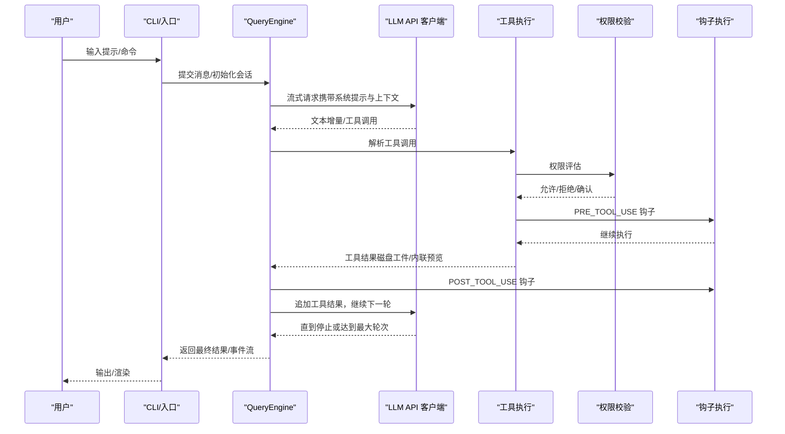
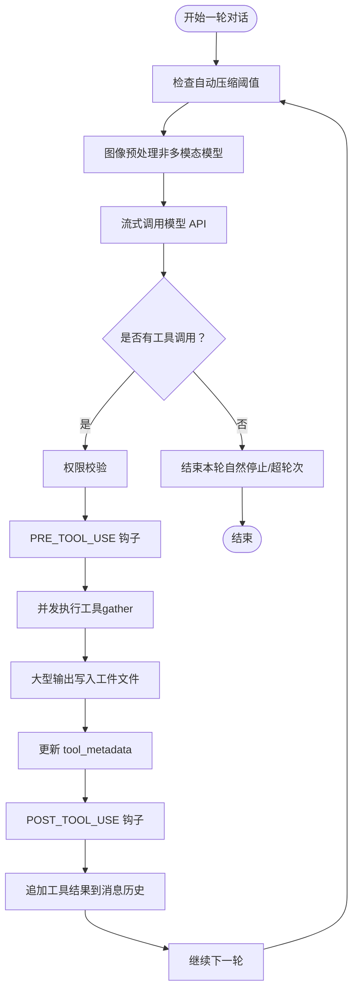
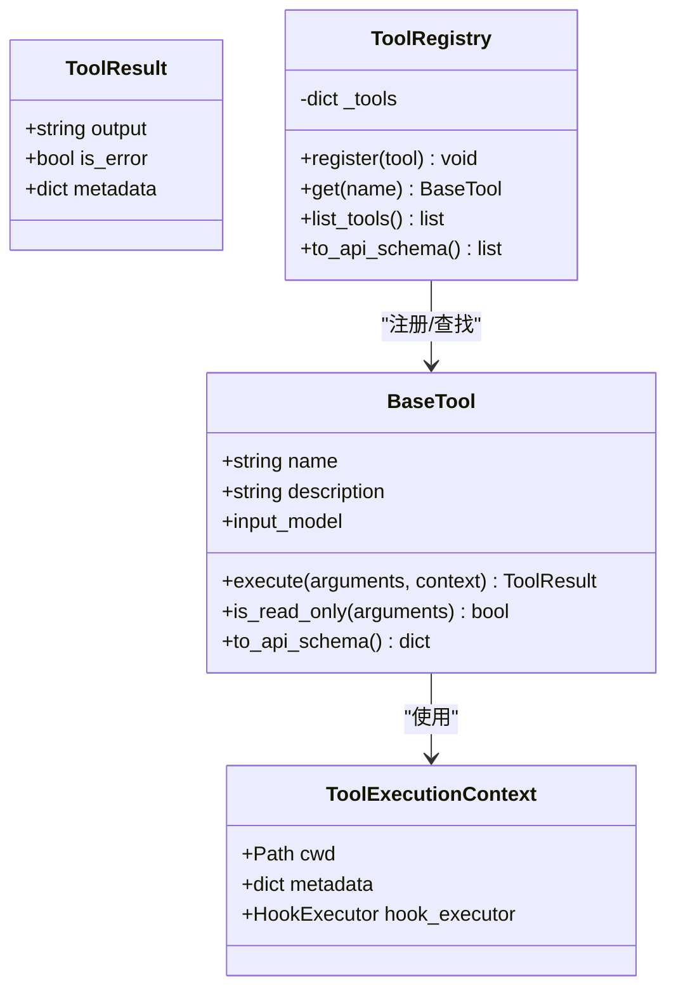
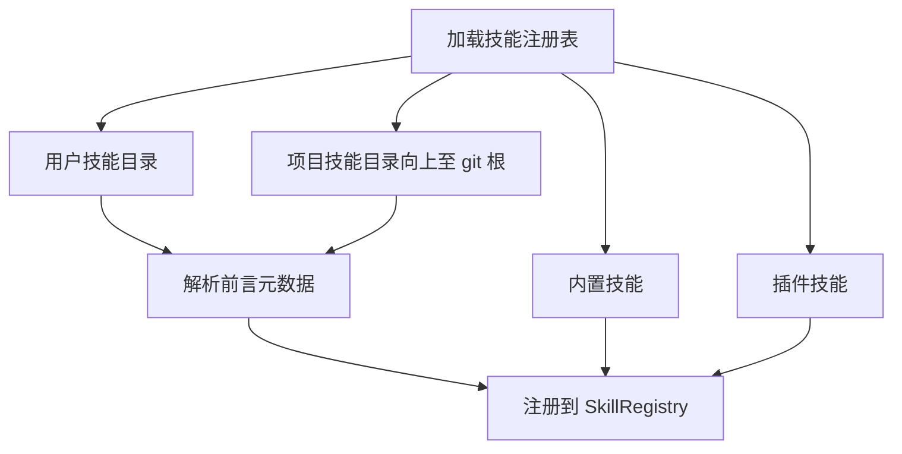
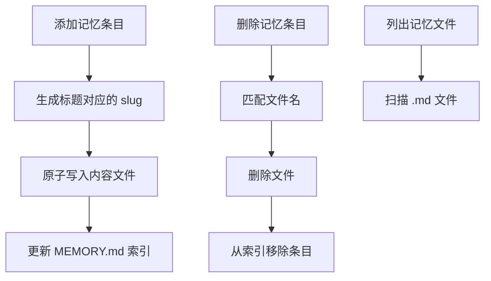
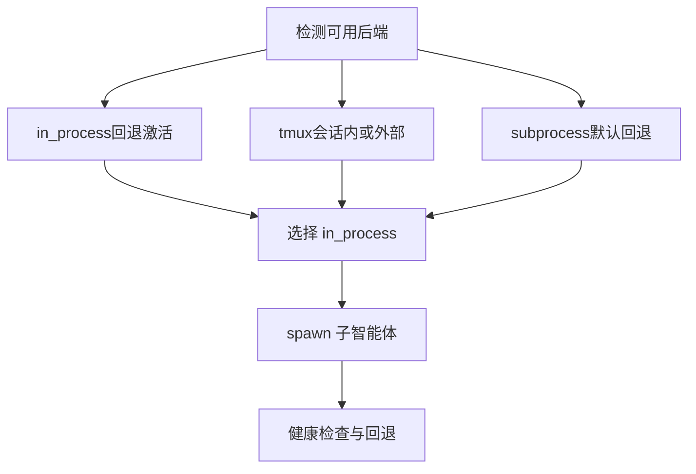
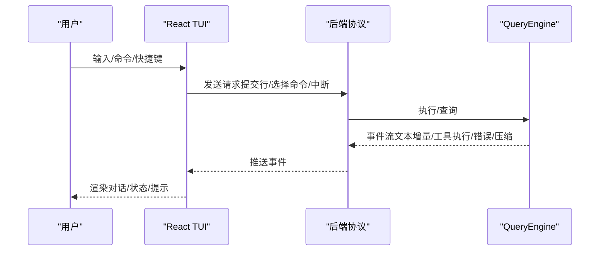
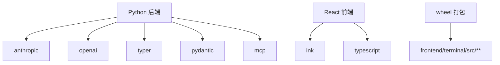

# 项目概述

<cite>
**本文引用的文件**
- [README.md](file://README.md)
- [CONTRIBUTING.md](file://CONTRIBUTING.md)
- [RELEASE_NOTES_v0.1.8.md](file://RELEASE_NOTES_v0.1.8.md)
- [RELEASE_NOTES_v0.1.9.md](file://RELEASE_NOTES_v0.1.9.md)
- [pyproject.toml](file://pyproject.toml)
- [src/openharness/__main__.py](file://src/openharness/__main__.py)
- [ohmo/__main__.py](file://ohmo/__main__.py)
- [src/openharness/cli.py](file://src/openharness/cli.py)
- [ohmo/cli.py](file://ohmo/cli.py)
- [docs/engine-module-design.md](file://docs/engine-module-design.md)
- [src/openharness/tools/base.py](file://src/openharness/tools/base.py)
- [src/openharness/skills/loader.py](file://src/openharness/skills/loader.py)
- [src/openharness/memory/manager.py](file://src/openharness/memory/manager.py)
- [src/openharness/swarm/registry.py](file://src/openharness/swarm/registry.py)
- [frontend/terminal/src/App.tsx](file://frontend/terminal/src/App.tsx)
</cite>

## 目录
1. [引言](#引言)
2. [项目结构](#项目结构)
3. [核心组件](#核心组件)
4. [架构总览](#架构总览)
5. [详细组件分析](#详细组件分析)
6. [依赖关系分析](#依赖关系分析)
7. [性能考量](#性能考量)
8. [故障排查指南](#故障排查指南)
9. [结论](#结论)
10. [附录](#附录)

## 引言
OpenHarness 是一个开源的“智能体 harness（基础设施）”项目，旨在为 AI 代理提供轻量、可扩展、可观测的运行时环境。其核心价值主张包括：
- 轻量级代理架构：以“引擎 + 工具 + 技能 + 记忆 + 多代理协调”的组合，最小化样板代码，最大化可插拔性。
- 工具使用：内置 43+ 工具，覆盖文件、Shell、搜索、Web、MCP、任务、计划模式、定时调度等，统一以 JSON Schema 描述，便于模型自动发现与调用。
- 技能系统：按需加载的 Markdown 技能，兼容 anthropics/skills 与 claude-code/plugins，支持用户自定义与项目级技能。
- 记忆与上下文：支持持久化记忆、CLAUDE.md 发现注入、上下文压缩与会话恢复，保障长期会话稳定性。
- 多代理协调：内置团队注册表与后台任务生命周期管理，支持子智能体分身与任务委派。

ohmo 是基于 OpenHarness 构建的“个人 AI 代理”，可在多种即时通讯渠道（如飞书、Slack、Telegram、Discord）中与用户协作，具备长期会话能力与工作记忆，无需额外 API 密钥即可运行于现有 Claude Code/Codex 订阅之上。

## 项目结构
项目采用“Python 后端引擎 + React 终端界面”的双层架构：
- Python 后端：提供引擎、工具、技能、权限、钩子、命令、MCP、记忆、任务、多智能体协调、UI 协议等核心能力。
- React 终端界面（Ink）：提供命令选择、权限弹窗、模式切换、会话恢复、动画反馈、键盘快捷键等交互体验。

图示来源
- [src/openharness/cli.py](file://src/openharness/cli.py)
- [docs/engine-module-design.md](file://docs/engine-module-design.md)
- [frontend/terminal/src/App.tsx](file://frontend/terminal/src/App.tsx)

章节来源
- [README.md](file://README.md)
- [pyproject.toml](file://pyproject.toml)

## 核心组件
- 引擎（Engine）：负责工具感知的对话循环、消息历史管理、权限校验、并发工具执行、自动压缩、流式事件与成本追踪。
- 工具（Tools）：统一的工具抽象与注册表，支持输入校验、JSON Schema 描述、权限集成与钩子支持。
- 技能（Skills）：按需加载的 Markdown 技能，支持用户与项目级技能目录、兼容 anthropics/skills。
- 记忆（Memory）：项目级与个人级记忆文件管理，支持索引与原子写入。
- 多智能体（Swarm）：子智能体分身与后台任务生命周期管理，支持 tmux/iTerm2 等终端面板后端检测与选择。
- UI 协议：后端与前端的协议桥接，支持命令提示、权限弹窗、选择器、任务与群智通知等。

章节来源
- [docs/engine-module-design.md](file://docs/engine-module-design.md)
- [src/openharness/tools/base.py](file://src/openharness/tools/base.py)
- [src/openharness/skills/loader.py](file://src/openharness/skills/loader.py)
- [src/openharness/memory/manager.py](file://src/openharness/memory/manager.py)
- [src/openharness/swarm/registry.py](file://src/openharness/swarm/registry.py)

## 架构总览
OpenHarness 的核心是“查询引擎 + 工具循环”的 Agent Loop，模型决定做什么，Harness 负责如何做（安全、高效、可观测）。

图示来源
- [docs/engine-module-design.md](file://docs/engine-module-design.md)
- [src/openharness/cli.py](file://src/openharness/cli.py)

## 详细组件分析

### 引擎模块（Agent Loop 与消息循环）
- 查询循环 run_query：在每次模型调用前进行自动压缩、图像预处理；根据模型响应决定是否进入工具执行阶段；并发执行多个工具调用；通过 Hook 与权限系统贯穿执行前后；将工具结果注入消息历史，继续下一轮直至停止或超限。
- QueryEngine：会话持有者，提供 submit_message/continue_pending/load_messages/clear 等 API；维护 tool_metadata 以支持跨轮次延续状态；支持群智协调模式的上下文注入。
- 成本追踪与事件流：通过 CostTracker 聚合计费；通过 StreamEvents 向 UI 层输出增量文本、工具执行、错误与压缩进度等事件。

图示来源
- [docs/engine-module-design.md](file://docs/engine-module-design.md)

章节来源
- [docs/engine-module-design.md](file://docs/engine-module-design.md)

### 工具系统（抽象与注册表）
- BaseTool：统一的工具抽象，要求实现 execute；支持只读判断与 API Schema 输出；配合 ToolExecutionContext 传递工作目录与钩子执行器。
- ToolRegistry：工具名称到实现的映射，支持列出与 API Schema 导出；与引擎的工具循环无缝对接。

图示来源
- [src/openharness/tools/base.py](file://src/openharness/tools/base.py)

章节来源
- [src/openharness/tools/base.py](file://src/openharness/tools/base.py)

### 技能系统（按需加载与兼容）
- 加载策略：内置技能、用户级技能目录（含兼容目录）、项目级技能目录（从当前目录向上至 git 根）、插件技能；支持禁用项目技能以提升安全性。
- 前言元数据：支持 user-invocable/disable-model-invocation/model/argument-hint 等字段，兼容 anthropics/skills 的 SKILL.md 布局。

图示来源
- [src/openharness/skills/loader.py](file://src/openharness/skills/loader.py)

章节来源
- [src/openharness/skills/loader.py](file://src/openharness/skills/loader.py)

### 记忆与上下文（持久化与压缩）
- 项目级记忆：通过 add_memory_entry/remove_memory_entry/list_memory_files 管理记忆文件与索引；使用原子写入与文件锁保证一致性。
- 上下文压缩：引擎在提示过长或接近上下文窗口时触发自动压缩，保留任务状态与通道日志，确保多日会话不中断。

图示来源
- [src/openharness/memory/manager.py](file://src/openharness/memory/manager.py)

章节来源
- [src/openharness/memory/manager.py](file://src/openharness/memory/manager.py)
- [docs/engine-module-design.md](file://docs/engine-module-design.md)

### 多智能体协调（团队与后台任务）
- 后端检测：优先 in_process（进程内回退），其次 tmux（终端面板），最后 subprocess（子进程回退）；支持 iTerm2 与外部 tmux 场景。
- 配置与回退：通过 teammate_mode 控制偏好；当面板后端不可用时，标记 in_process 回退并缓存检测结果，保证后续一致行为。

图示来源
- [src/openharness/swarm/registry.py](file://src/openharness/swarm/registry.py)

章节来源
- [src/openharness/swarm/registry.py](file://src/openharness/swarm/registry.py)

### 终端 UI（React + Ink）
- 交互特性：命令提示器、权限弹窗、模式切换、会话恢复、动画加载、键盘快捷键；支持脚本化输入与选择器。
- 事件驱动：通过 useBackendSession 与后端协议通信，接收事件流并渲染对话、任务与群智通知。

图示来源
- [frontend/terminal/src/App.tsx](file://frontend/terminal/src/App.tsx)
- [src/openharness/cli.py](file://src/openharness/cli.py)

章节来源
- [frontend/terminal/src/App.tsx](file://frontend/terminal/src/App.tsx)

## 依赖关系分析
- Python 后端依赖：anthropic、openai、rich、prompt-toolkit、textual、typer、pydantic、httpx、websockets、mcp、pyperclip、pyyaml、questionary、watchfiles、croniter、各类即时通讯 SDK。
- 前端打包：前端源码被打包进后端 wheel，便于安装后直接运行终端 UI。
- 版本与脚本：版本号在 pyproject.toml 中声明；CLI 与 ohmo 的入口分别指向 openharness.cli 与 ohmo.cli。

图示来源
- [pyproject.toml](file://pyproject.toml)

章节来源
- [pyproject.toml](file://pyproject.toml)

## 性能考量
- 并发工具执行：单轮次多个工具调用通过 gather 并发执行，提高吞吐。
- 自动压缩：在上下文过长时进行微压缩或 LLM 摘要，减少重复计算与内存占用。
- 工具输出卸载：大型输出写入磁盘工件文件，避免上下文膨胀。
- 事件流式输出：异步生成器逐块推送事件，降低 UI 阻塞与内存峰值。
- 多平台后端：tmux/iTerm2/子进程等后端选择与回退，兼顾功能与稳定性。

## 故障排查指南
- 干跑预览（--dry-run）：在不执行模型、工具或子智能体的前提下，解析设置、认证状态、提示组装、技能与命令匹配、MCP 配置问题，给出 ready/warning/blocked 三档就绪度与下一步建议。
- 常见问题定位：
  - 认证缺失：auth 状态为 missing，需先登录或配置凭证。
  - MCP 配置错误：配置项缺失或 URL 不合法，修复后重试。
  - 提示过长/补全限制：触发响应式压缩或调整 max_tokens。
  - 权限拒绝：通过交互式弹窗或模式切换解决。
- 日志与诊断：ohmo doctor 可检查工作区与可用凭证；前端支持脚本化输入与选择器，便于自动化调试。

章节来源
- [src/openharness/cli.py](file://src/openharness/cli.py)
- [ohmo/cli.py](file://ohmo/cli.py)

## 结论
OpenHarness 以“引擎 + 工具 + 技能 + 记忆 + 多智能体”的轻量架构，为研究人员、构建者与社区提供了可观察、可扩展、可安全治理的 AI 代理基础设施。ohmo 作为个人代理应用，进一步将该能力带到即时通讯场景，支持长期会话与跨渠道协作。项目通过干跑预览、自动压缩、并发工具执行与多后端回退等机制，兼顾易用性与可靠性。

## 附录

### 设计理念与目标用户
- 研究人员：理解生产级智能体的工作原理，实验新工具、技能与多代理模式。
- 构建者：在现有工作流中快速集成 Claude 风格的工具约定，扩展插件与领域知识。
- 社区：贡献技能、插件与生态工具，推动兼容性与互操作性。

章节来源
- [README.md](file://README.md)

### 技术架构与组件关系
- Python 后端：CLI/入口 → 引擎 → 工具/技能/记忆/权限/钩子 → UI 协议 → 终端 UI。
- 前端：React + Ink 通过协议与后端通信，渲染对话、状态与交互控件。

章节来源
- [src/openharness/__main__.py](file://src/openharness/__main__.py)
- [ohmo/__main__.py](file://ohmo/__main__.py)
- [frontend/terminal/src/App.tsx](file://frontend/terminal/src/App.tsx)

### 发展历程与版本发布
- v0.1.9：技能工作流增强（技能创建器）、用户可触发技能、提供者密钥更新修复。
- v0.1.8：更多提供者工作流、ohmo Feishu 群组支持、远程通道安全加固、Windows 与 MCP 可靠性改进、TUI 与 UX 优化。
- 更早版本：提供者兼容性、MCP 协议、多代理与 UI 改进等里程碑。

章节来源
- [RELEASE_NOTES_v0.1.9.md](file://RELEASE_NOTES_v0.1.9.md)
- [RELEASE_NOTES_v0.1.8.md](file://RELEASE_NOTES_v0.1.8.md)

### 社区贡献指南
- 贡献方向：修复运行时边缘情况、改进文档与示例、新增测试、贡献新技能/插件/提供者兼容性。
- 开发环境：克隆仓库、同步开发依赖、可选安装前端依赖；运行 ruff 与 pytest；PR 要求变更说明与测试更新。

章节来源
- [CONTRIBUTING.md](file://CONTRIBUTING.md)