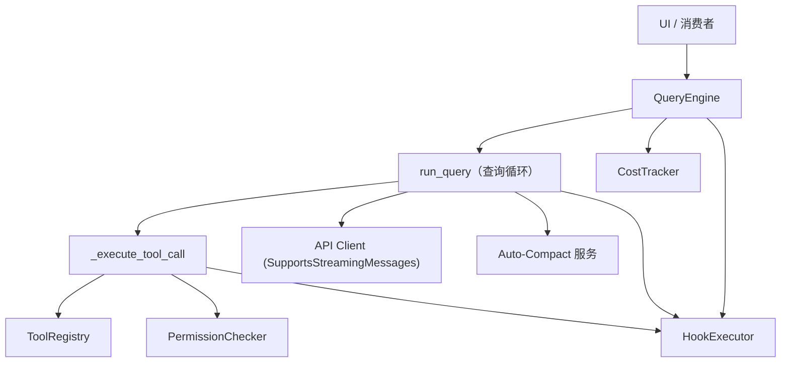
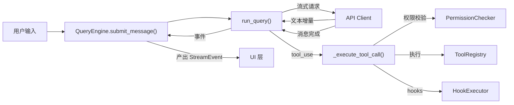

# Engine 模块设计文档

## 概述

`openharness.engine` 模块是 OpenHarness 的核心执行引擎。它编排 LLM 与用户之间的工具感知对话循环，管理消息历史、工具执行、权限校验、自动压缩、流式事件和成本追踪。它是驱动智能体行为的中央"大脑"。

## 模块结构

```
src/openharness/engine/
├── __init__.py          # 公共 API 懒加载重导出
├── messages.py          # 对话消息与内容块模型
├── query.py             # 核心工具感知查询循环 (run_query)
├── query_engine.py      # 高层 QueryEngine 类（会话持有者）
├── cost_tracker.py      # Token 用量聚合
└── stream_events.py     # 向 UI 层输出的流式事件类型
```

## 架构



## 组件详解

### 1. messages.py — 对话消息模型

定义用户、助手和工具之间交换的对话轮次的结构化表示。

#### 内容块

| 类 | 类型判别符 | 用途 |
|---|---|---|
| `TextBlock` | `"text"` | 纯文本内容 |
| `ImageBlock` | `"image"` | Base64 编码的图像（含媒体类型），用于多模态供应商 |
| `ToolUseBlock` | `"tool_use"` | 模型请求调用具名工具（自动生成 `id`） |
| `ToolResultBlock` | `"tool_result"` | 工具执行结果，回传给模型 |

`ContentBlock` 是基于 Pydantic `Field(discriminator="type")` 的判别联合类型（`TextBlock | ImageBlock | ToolUseBlock | ToolResultBlock`）。

#### ConversationMessage

单条 `user` 或 `assistant` 消息，包含一个 `ContentBlock` 列表。

关键方法：
- `from_user_text(text)` — 简单文本用户消息的工厂方法
- `from_user_content(blocks)` — 显式内容块用户消息的工厂方法
- `text` — 属性，拼接所有 `TextBlock` 内容
- `tool_uses` — 属性，提取所有 `ToolUseBlock` 项
- `to_api_param()` — 序列化为供应商线路格式（兼容 Anthropic SDK）
- `is_effectively_empty()` — 检测消息是否无实际内容

#### 辅助函数

- **`serialize_content_block(block)`** — 将本地内容块转换为供应商线路格式字典
- **`assistant_message_from_api(raw_message)`** — 将 Anthropic SDK 消息对象转换回 `ConversationMessage`
- **`sanitize_conversation_messages(messages)`** — 规范化恢复的对话历史，丢弃空助手消息并修整尾部异常的工具轮次（如助手 `tool_use` 无匹配 `tool_result`）。这对会话恢复至关重要。

### 2. query.py — 核心工具感知查询循环

引擎的核心。包含 `run_query` 异步生成器及智能体轮次循环的全部支撑逻辑。

#### QueryContext

`@dataclass`，持有单次查询运行的全部共享上下文：

| 字段 | 类型 | 用途 |
|---|---|---|
| `api_client` | `SupportsStreamingMessages` | LLM API 流式客户端 |
| `tool_registry` | `ToolRegistry` | 可用工具注册表 |
| `permission_checker` | `PermissionChecker` | 工具访问权限评估器 |
| `cwd` | `Path` | 工具执行工作目录 |
| `model` | `str` | 当前模型标识符 |
| `system_prompt` | `str` | 模型系统提示词 |
| `max_tokens` | `int` | 每次请求最大输出 token 数 |
| `context_window_tokens` | `int \| None` | 模型上下文窗口大小 |
| `auto_compact_threshold_tokens` | `int \| None` | 自动压缩阈值 |
| `permission_prompt` | `PermissionPrompt \| None` | 用户权限确认的异步回调 |
| `ask_user_prompt` | `AskUserPrompt \| None` | 用户输入提示的异步回调 |
| `max_turns` | `int \| None` | 每次查询最大智能体轮次 |
| `hook_executor` | `HookExecutor \| None` | Hook 执行引擎 |
| `tool_metadata` | `dict \| None` | 跨轮次可变延续状态 |

#### run_query — 主循环

`run_query(context, messages) -> AsyncIterator[tuple[StreamEvent, UsageSnapshot | None]]`

循环执行流程如下：

1. **自动压缩检查** — 每次调用模型前，检查对话是否超过自动压缩阈值。若超过，执行微压缩（清除旧工具结果）或完整 LLM 摘要。
2. **图像预处理** — 若模型非多模态，使用视觉模型将 `ImageBlock` 转换为文本描述。
3. **模型 API 调用** — 通过 `api_client.stream_message()` 流式获取模型响应，为每个文本块产出 `AssistantTextDelta` 事件。
4. **空响应防护** — 丢弃空助手消息以保持会话健康。
5. **工具执行** — 若模型请求工具（`tool_uses`）：
   - **单个工具**：顺序执行，立即产出事件
   - **多个工具**：通过 `asyncio.gather` 并发执行（`return_exceptions=True`），全部完成后产出事件
6. **权限校验** — 工具执行前，`PermissionChecker.evaluate()` 判定工具调用是否允许、需确认或被阻止。
7. **Hook 执行** — `PRE_TOOL_USE` hook 在工具执行前运行；`POST_TOOL_USE` hook 在执行后运行。
8. **工具输出卸载** — 大型工具输出写入磁盘工件文件，附带内联预览。
9. **工具延续记录** — 在 `tool_metadata` 中追踪活跃工件、已读文件、技能调用、异步智能体活动、工作日志和已验证工作。
10. **循环继续** — 将工具结果作为用户消息追加，回到步骤 1。
11. **终止** — 模型不再产出 `tool_uses`（自然停止）或超过 `max_turns`（抛出 `MaxTurnsExceeded` 异常）时循环结束。

#### 错误处理

- **提示词过长错误** — 由 `_is_prompt_too_long_error()` 检测。触发响应式压缩（强制）并重试一次。
- **补全 token 限制错误** — 由 `_is_completion_token_limit_error()` 检测。提取支持的 token 上限并以较低的 `effective_max_tokens` 重试。
- **网络错误** — 产出 `ErrorEvent`，附带用户友好的网络错误信息。
- **通用 API 错误** — 产出 `ErrorEvent` 并终止循环。

#### 工具延续系统

引擎通过 `tool_metadata` 维护跨轮次工具交互的丰富元数据。该状态被注入系统提示词，使模型具备上下文感知能力：

| 追踪器 | 键 | 上限 | 用途 |
|---|---|---|---|
| 用户目标 | `task_focus_state.goal` / `recent_goals` | 5 | 记住用户正在试图完成的任务 |
| 活跃工件 | `task_focus_state.active_artifacts` | 8 | 当前正在操作的文件和资源 |
| 文件读取状态 | `read_file_state` | 6 | 最近读取的文件，含行范围和预览 |
| 技能调用 | `invoked_skills` | 8 | 最近加载的技能 |
| 异步智能体状态 | `async_agent_state` | 8 | 最近的异步智能体活动摘要 |
| 异步智能体任务 | `async_agent_tasks` | 12 | 已派生的智能体及其状态 |
| 工作日志 | `recent_work_log` | 10 | 最近工具操作的上下文 |
| 已验证工作 | `recent_verified_work` / `task_focus_state.verified_state` | 10 | 已确认完成的操作 |

### 3. query_engine.py — QueryEngine 类

`QueryEngine` 类是封装查询循环的高层会话持有者。它管理对话历史、成本追踪，并为 UI 层提供清晰的异步 API。

#### 构造函数参数

| 参数 | 类型 | 默认值 | 用途 |
|---|---|---|---|
| `api_client` | `SupportsStreamingMessages` | 必填 | LLM API 流式客户端 |
| `tool_registry` | `ToolRegistry` | 必填 | 可用工具 |
| `permission_checker` | `PermissionChecker` | 必填 | 权限评估器 |
| `cwd` | `str \| Path` | 必填 | 工作目录 |
| `model` | `str` | 必填 | 模型标识符 |
| `system_prompt` | `str` | 必填 | 系统提示词 |
| `max_tokens` | `int` | `4096` | 每次请求最大输出 token 数 |
| `context_window_tokens` | `int \| None` | `None` | 上下文窗口大小 |
| `auto_compact_threshold_tokens` | `int \| None` | `None` | 自动压缩阈值 |
| `max_turns` | `int \| None` | `8` | 每次输入最大智能体轮次 |
| `permission_prompt` | `PermissionPrompt \| None` | `None` | 用户权限确认回调 |
| `ask_user_prompt` | `AskUserPrompt \| None` | `None` | 用户输入回调 |
| `hook_executor` | `HookExecutor \| None` | `None` | Hook 执行引擎 |
| `tool_metadata` | `dict \| None` | `None` | 延续状态 |

#### 关键方法

- **`submit_message(prompt)`** — 追加用户消息、清洗历史、触发 `USER_PROMPT_SUBMIT` hook、构建 `QueryContext` 并委托 `run_query`。产出 `StreamEvent`。同时处理群智协调模式的协调器上下文注入。
- **`continue_pending(max_turns)`** — 恢复被中断的工具循环，不追加新的用户消息（用于会话续传）。
- **`has_pending_continuation()`** — 对话以工具结果结尾且等待后续模型轮次时返回 `True`。
- **`load_messages(messages)`** — 替换内存中的对话历史（用于会话恢复）。
- **`clear()`** — 清空对话历史并重置成本追踪。
- **`set_system_prompt(prompt)`** / **`set_model(model)`** / **`set_api_client(client)`** / **`set_max_turns(n)`** / **`set_permission_checker(checker)`** — 运行时重配置方法。

#### 属性

- `messages` — 当前对话历史（列表副本）
- `max_turns` — 最大智能体轮次上限
- `api_client` — 当前 API 客户端
- `model` — 当前模型标识符
- `system_prompt` — 当前系统提示词
- `tool_metadata` — 可变延续状态
- `total_usage` — 所有轮次聚合的 `UsageSnapshot`

#### 协调器模式集成

当系统提示词以 `"You are a **coordinator**."` 开头时，引擎注入合成的 `# Coordinator User Context` 用户消息，提供工作者工具上下文。这使得协调器智能体可以将任务委派给子智能体，实现群智协调。

### 4. cost_tracker.py — Token 用量聚合

简单的累加器，在整个会话生命周期中追踪 token 用量。

```
CostTracker
├── add(usage: UsageSnapshot)    # 累加一次用量快照
└── total -> UsageSnapshot       # 聚合的输入/输出 token 数
```

内部使用 `openharness.api.usage` 的 `UsageSnapshot`，追踪 `input_tokens` 和 `output_tokens`。

### 5. stream_events.py — 流式事件类型

查询循环向 UI 层产出的所有事件均为不可变 dataclass：

| 事件 | 用途 |
|---|---|
| `AssistantTextDelta` | 模型的增量文本块 |
| `AssistantTurnComplete` | 完成的助手轮次，含消息和用量 |
| `ToolExecutionStarted` | 引擎即将执行工具 |
| `ToolExecutionCompleted` | 工具执行完成（含错误标记） |
| `ErrorEvent` | 向用户展示的错误（默认可恢复） |
| `StatusEvent` | 临时系统状态消息 |
| `CompactProgressEvent` | 对话压缩的结构化进度 |

`StreamEvent` 为联合类型：`AssistantTextDelta | AssistantTurnComplete | ToolExecutionStarted | ToolExecutionCompleted | ErrorEvent | StatusEvent | CompactProgressEvent`。

`CompactProgressEvent` 的结构化阶段：
- `hooks_start` → `context_collapse_start` → `context_collapse_end` → `session_memory_start` → `session_memory_end` → `compact_start` → `compact_retry` → `compact_end` → `compact_failed`

触发方式：`"auto"`、`"manual"` 或 `"reactive"`。

### 6. \_\_init\_\_.py — 懒加载公共 API

通过 `__getattr__` 懒加载导出主要公共符号，避免循环导入：

- 来自 `messages`：`ConversationMessage`、`ImageBlock`、`TextBlock`、`ToolResultBlock`、`ToolUseBlock`
- 来自 `query_engine`：`QueryEngine`
- 来自 `stream_events`：`AssistantTextDelta`、`AssistantTurnComplete`、`ToolExecutionCompleted`、`ToolExecutionStarted`

## 数据流



## 关键设计决策

1. **基于 AsyncIterator 的流式输出** — 引擎全程使用 Python 异步生成器，使 UI 可增量消费事件而不阻塞。

2. **判别联合内容块** — Pydantic 的 `Field(discriminator="type")` 确保多态内容块列表的类型安全序列化/反序列化。

3. **懒加载公共 API** — `__init__.py` 使用 `TYPE_CHECKING` 守卫和 `__getattr__` 实现懒导入，打破循环依赖链同时保持公共 API 访问的简洁性。

4. **工具输出卸载** — 大型工具输出写入磁盘工件文件并附带内联预览，防止上下文窗口膨胀同时保持可访问性。

5. **并发工具执行** — 单个助手轮次中的多个工具调用通过 `asyncio.gather` 并发执行，使用 `return_exceptions=True` 防止兄弟协程被取消。

6. **响应式压缩** — 当模型 API 因上下文长度拒绝请求时，引擎执行强制压缩并重试一次，而非立即失败。

7. **延续元数据** — 跨轮次追踪丰富的工具交互状态并注入系统提示词，使模型在不消耗对话轮次的情况下感知自身行为。

8. **会话续传** — `sanitize_conversation_messages()` 与 `has_pending_continuation()` / `continue_pending()` 支持安全恢复被中断的会话。

## 依赖

| 模块 | 用途 |
|---|---|
| `openharness.api.client` | LLM API 流式接口 (`SupportsStreamingMessages`) |
| `openharness.api.provider` | 模型能力查询 (`is_model_multimodal`) |
| `openharness.api.usage` | Token 用量追踪 (`UsageSnapshot`) |
| `openharness.config.paths` | 工具工件的数据目录解析 |
| `openharness.coordinator.coordinator_mode` | 群智协调器上下文注入 |
| `openharness.hooks` | Hook 事件执行 (`HookEvent`, `HookExecutor`) |
| `openharness.permissions.checker` | 工具访问控制 (`PermissionChecker`) |
| `openharness.services.compact` | 自动压缩服务 |
| `openharness.services.tool_outputs` | 工具输出大小配置 |
| `openharness.tools.base` | 工具注册表与执行上下文 |
