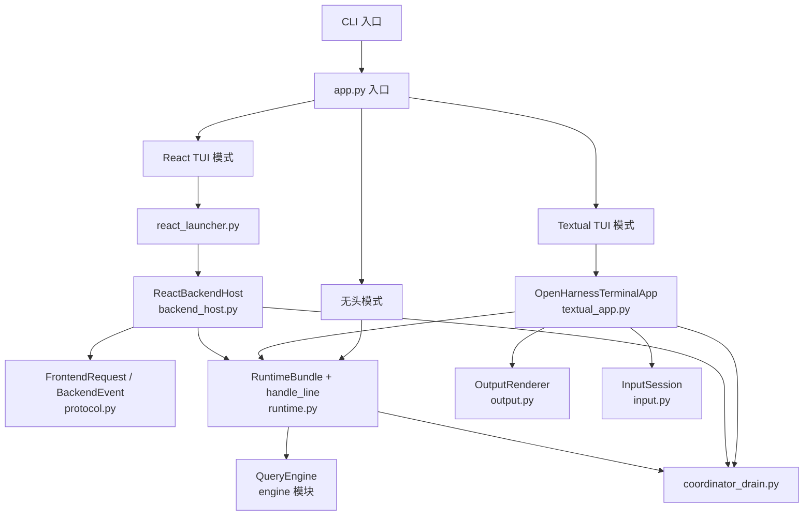
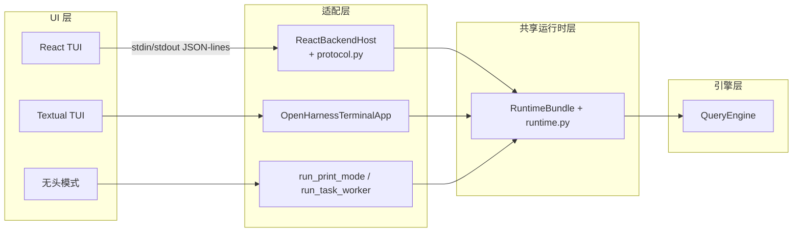
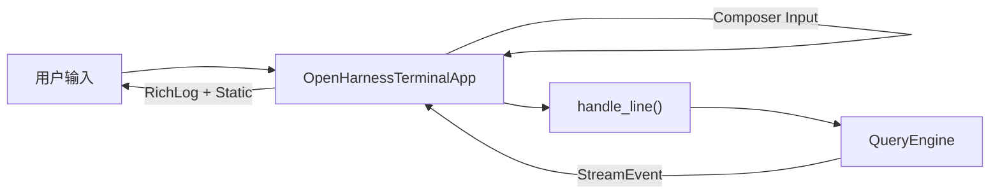
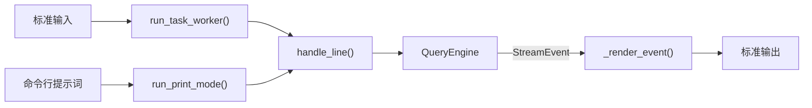

# UI 模块设计文档

## 概述

`openharness.ui` 模块是 OpenHarness 的用户交互层。它提供了多种交互模式，负责将用户输入传递给引擎、将引擎产生的事件流式输出给用户，并管理会话生命周期。该模块支持三种主要 UI 模式：React TUI（默认）、Textual TUI（备选），以及无头模式（打印模式 / 任务工作者）。

## 模块结构

```
src/openharness/ui/
├── __init__.py             # 公共 API 导出（run_repl, run_print_mode）
├── app.py                  # 交互会话入口（REPL、任务工作者、打印模式）
├── backend_host.py         # React TUI 后端主机（JSON-lines stdin/stdout 协议）
├── coordinator_drain.py   # 协调器模式异步智能体任务排空
├── input.py                # prompt_toolkit 输入助手
├── output.py               # Rich 终端输出渲染器
├── permission_dialog.py    # 交互式权限确认弹窗
├── protocol.py             # React 前后端通信协议模型
├── react_launcher.py       # React 终端前端启动器
├── runtime.py              # 共享运行时组装（headless + TUI 通用）
└── textual_app.py          # Textual 终端 UI 实现
```

## 架构



## 运行时分层



## 组件详解

### 1. app.py — 交互会话入口

提供三种主要入口函数，是 CLI 到具体 UI 实现的桥梁：

| 函数 | 用途 |
|---|---|
| `run_repl()` | 运行默认交互式应用（React TUI）。支持 `backend_only` 模式仅启动后端主机。支持会话恢复（`restore_messages`、`restore_tool_metadata`）。 |
| `run_task_worker()` | 无头任务工作者：通过标准输入读取提示词、流式输出结果后退出。用于后台智能体子进程，避免 TTY 依赖。使用空权限回调（全部允许）和简化的渲染器。 |
| `run_print_mode()` | 非交互模式：提交提示词、流式输出到 stdout（支持 `text` / `stream-json` / `json` 格式）、退出。支持协调器模式异步智能体排空。 |

#### 输入行解码

`_decode_task_worker_line(raw)` 规范化任务工作者的标准输入行：
- 纯文本行 → 原样返回
- JSON 对象（来自 `send_message` / 队友后端）→ 提取 `text` 字段

#### 打印模式输出格式

| 格式 | 行为 |
|---|---|
| `text` | 文本增量写入 stdout，系统消息写入 stderr |
| `stream-json` | 每行一个 JSON 对象，包含 `assistant_delta`、`tool_started`、`tool_completed`、`error`、`status`、`compact_progress` 等类型 |
| `json` | 最后输出单个 JSON 结果对象 |

---

### 2. backend_host.py — React TUI 后端主机

`ReactBackendHost` 类通过结构化的标准输入/标准输出 JSON-lines 协议驱动 OpenHarness 运行时。协议前缀为 `OHJSON:`。

#### BackendHostConfig

会话配置数据类，包含模型、max_turns、API 密钥、恢复消息、权限模式、会话后端、额外技能目录等。

#### ReactBackendHost 核心流程

1. **`run()`** — 构建运行时 → 启动运行时 → 发射 `ready` 事件 → 进入请求处理循环
2. **`_read_requests()`** — 从标准输入读取 JSON 行，反序列化为 `FrontendRequest`，放入请求队列
3. **`_process_line()`** — 处理用户提交的一行输入，委托 `handle_line()`，处理引擎事件并转换为 `BackendEvent` 发射
4. **`_run_active_request()`** — 包装请求为异步任务，支持中断取消

#### 支持的请求类型

| 请求类型 | 说明 |
|---|---|
| `submit_line` | 提交用户输入行 |
| `permission_response` | 用户响应权限弹窗 |
| `question_response` | 用户响应问题弹窗 |
| `list_sessions` | 列出可恢复的会话 |
| `select_command` / `apply_select_command` | 选择器命令（如 `/provider`、`/model`、`/theme`） |
| `interrupt` | 中断当前请求 |
| `shutdown` | 关闭后端 |

#### 支持的事件类型（向 React 前端发射）

| 事件类型 | 说明 |
|---|---|
| `ready` | 后端就绪，携带状态、任务列表、命令列表 |
| `state_snapshot` | 应用状态快照（含 MCP 服务器、桥接会话） |
| `tasks_snapshot` | 任务列表快照 |
| `transcript_item` | 对话记录条目（user / assistant / system / tool / tool_result / log） |
| `assistant_delta` | 增量文本 |
| `assistant_complete` | 助手轮次完成 |
| `tool_started` / `tool_completed` | 工具开始/完成 |
| `compact_progress` | 压缩进度 |
| `modal_request` | 模态弹窗请求（权限/问题） |
| `select_request` | 选择器弹窗请求 |
| `todo_update` | 待办更新（从 TodoWrite 工具输出提取） |
| `plan_mode_change` | 计划模式变更 |
| `swarm_status` | 群智状态 |
| `error` / `shutdown` / `line_complete` | 错误/关闭/行完成 |

#### 选择器命令处理

`_handle_select_command()` 为多个斜杠命令提供交互式选择器 UI：
- `/provider` — 认证提供商档案选择
- `/permissions` — 权限模式（default / full_auto / plan）
- `/theme` — 主题选择
- `/output-style` — 输出样式选择
- `/effort` — 推理努力程度（low / medium / high）
- `/passes` — 推理轮次（1-8）
- `/turns` — 最大轮次（32 / 64 / 128 / 200 / 256 / 512 / unlimited）
- `/fast` — 快速模式开关
- `/vim` — Vim 键绑定开关
- `/voice` — 语音模式开关
- `/model` — 模型选择（按提供商分类）

#### 权限/问题异步弹窗

- **`_ask_permission()`** — 发射 `modal_request`（kind=permission），通过 `asyncio.Future` 等待用户响应，300 秒超时
- **`_ask_question()`** — 发射 `modal_request`（kind=question），通过 `asyncio.Future` 等待用户响应

---

### 3. protocol.py — React 前后端通信协议

定义 React TUI 前后端通信的全部结构化消息模型（Pydantic）。

#### FrontendRequest

前端向后端发送的请求，类型包括：`submit_line`、`permission_response`、`question_response`、`list_sessions`、`select_command`、`apply_select_command`、`interrupt`、`shutdown`。

#### BackendEvent

后端向前端发送的事件，类型覆盖：会话就绪、状态快照、任务快照、对话记录条目、助手增量/完成、工具事件、压缩进度、模态/选择器请求、待办更新、计划模式变更、群智状态、错误、关闭等。

包含便利工厂方法：
- `ready(state, tasks, commands)` — 初始化就绪事件
- `state_snapshot(state)` — 状态快照
- `tasks_snapshot(tasks)` — 任务快照
- `status_snapshot(state, mcp_servers, bridge_sessions)` — 完整状态快照（含 MCP 和桥接会话）

#### TranscriptItem

对话记录条目：角色（`user` / `assistant` / `system` / `tool` / `tool_result` / `log`）、文本、工具名、工具输入、错误标记。

#### TaskSnapshot

UI 安全的任务表示，从 `TaskRecord` 转换而来。

#### 状态载荷

`_state_payload()` 将 `AppState` 展平为 JSON 安全字典，包含：模型、工作目录、提供商、认证状态、权限模式、主题、Vim/语音开关、快速模式、推理努力度、MCP 连接状态等。

---

### 4. runtime.py — 共享运行时组装

UI 层的核心基础设施，为所有 UI 模式（React TUI、Textual TUI、无头）提供统一的运行时组装和请求处理。

#### 类型别名

| 别名 | 说明 |
|---|---|
| `PermissionPrompt` | `Callable[[str, str], Awaitable[bool]]` — 权限确认回调 |
| `AskUserPrompt` | `Callable[[str], Awaitable[str]]` — 用户输入回调 |
| `SystemPrinter` | `Callable[[str], Awaitable[None]]` — 系统消息打印 |
| `StreamRenderer` | `Callable[[StreamEvent], Awaitable[None]]` — 流式事件渲染 |
| `ClearHandler` | `Callable[[], Awaitable[None]]` — 清屏处理 |

#### RuntimeBundle

单次交互会话的共享运行时对象容器：

| 字段 | 说明 |
|---|---|
| `api_client` | API 客户端 |
| `cwd` | 工作目录 |
| `mcp_manager` | MCP 客户端管理器 |
| `tool_registry` | 工具注册表 |
| `app_state` | 应用状态存储 |
| `hook_executor` | Hook 执行引擎 |
| `engine` | QueryEngine 实例 |
| `commands` | 命令注册表 |
| `session_id` | 会话 ID |
| `settings_overrides` | CLI 设置覆盖 |
| `session_backend` | 会话后端（快照保存） |
| `extra_skill_dirs` / `extra_plugin_roots` | 额外技能/插件目录 |
| `memory_backend` | 内存命令后端 |

包含辅助方法：
- `current_settings()` — 返回叠加 CLI 覆盖后的有效设置
- `current_plugins()` — 返回当前工作树可见的插件
- `hook_summary()` / `plugin_summary()` / `mcp_summary()` — 返回对应摘要文本

#### build_runtime — 运行时构建

核心初始化流程：

1. **设置加载与合并** — 加载设置，合并 CLI 覆盖项（model、max_turns、base_url、system_prompt、api_key、api_format、active_profile、permission_mode）
2. **API 客户端解析** — 根据设置选择对应的客户端（Anthropic、Codex、Copilot、OpenAI 兼容）
3. **MCP 连接** — 加载 MCP 服务器配置并全部连接
4. **工具注册表** — 创建默认工具注册表，注册插件提供的工具
5. **应用状态** — 初始化 `AppStateStore`，包含模型、提供商、认证状态、权限模式、主题、MCP 连接数、桥接会话数、键绑定等
6. **Hook 引擎** — 加载 hook 注册表，创建 `HookExecutor`
7. **QueryEngine** — 创建引擎实例，注入权限检查器、提示词回调、hook 执行器、工具元数据（含 MCP 管理器、桥接管理器、视觉模型配置、恢复元数据）
8. **消息恢复** — 如提供 `restore_messages`，反序列化并加载到引擎
9. **Docker 沙箱** — 如配置启用，启动 Docker 沙箱
10. **命令注册表** — 创建默认命令注册表，包含插件命令

#### start_runtime / close_runtime

- `start_runtime()` — 执行 `SESSION_START` hook
- `close_runtime()` — 停止 Docker 沙箱 → 提取个性化规则 → 关闭 MCP 管理器 → 执行 `SESSION_END` hook

#### handle_line — 行处理核心

处理一行用户输入的中心调度器：

1. **命令解析** — 通过命令注册表查找斜杠命令（如 `/clear`、`/provider`、`/fast`），找不到时尝试技能斜杠命令
2. **命令执行** — 执行命令处理器，获取 `CommandResult`
3. **运行时刷新** — 如命令要求刷新，调用 `refresh_runtime_client()` 更新 API 客户端和模型
4. **命令结果渲染** — 通过 `_render_command_result()` 处理清屏、消息重播、系统消息
5. **提交提示词** — 如命令产出了 `submit_prompt`，用该提示词调用引擎并流式渲染事件
6. **续传** — 如命令产出了 `continue_pending`，调用 `engine.continue_pending()` 续传工具结果
7. **普通输入** — 非命令行直接调用 `engine.submit_message()` 流式处理
8. **max_turns 处理** — 捕获 `MaxTurnsExceeded`，打印停止消息和待处理工具结果摘要
9. **会话保存** — 每次轮次后通过 `session_backend.save_snapshot()` 保存会话快照
10. **状态同步** — 调用 `sync_app_state()` 刷新 UI 状态

#### 其他辅助函数

| 函数 | 说明 |
|---|---|
| `refresh_runtime_client()` | 设置/认证变更后刷新 API 客户端和模型 |
| `sync_app_state()` | 从当前设置和动态键绑定刷新 UI 状态 |
| `_format_pending_tool_results()` | 当在工具结果后停止时，渲染紧凑的待处理摘要 |
| `_last_user_text()` | 提取最后一条用户消息文本 |

---

### 5. react_launcher.py — React 终端前端启动器

负责启动默认的 React 终端 UI。

#### 关键函数

| 函数 | 说明 |
|---|---|
| `get_frontend_dir()` | 解析前端目录：优先检查打包路径 `openharness/_frontend/`，其次开发仓库路径 `<repo>/frontend/terminal/` |
| `_resolve_npm()` | 解析 npm 可执行文件（Windows 上使用 `npm.cmd`） |
| `_resolve_tsx()` | 解析 tsx 命令：优先本地安装的 `node_modules/.bin/tsx`，其次全局 tsx，最后回退到 `npm exec -- tsx`。在 Windows/WSL 上直接调用二进制以避免 TTY 继承问题 |
| `_resolve_theme()` | 从设置读取主题名称，默认 `default` |
| `build_backend_command()` | 构建 React 前端用来启动后端的命令行参数列表 |
| `launch_react_tui()` | 完整启动流程：检查前端目录 → npm install（如无 node_modules）→ 构建环境变量 `OPENHARNESS_FRONTEND_CONFIG` → 启动 tsx 运行 `src/index.tsx` |

#### 环境变量配置

`OPENHARNESS_FRONTEND_CONFIG` JSON 包含：
- `backend_command` — 后端启动命令
- `initial_prompt` — 初始提示词
- `theme` — 主题名称

---

### 6. textual_app.py — Textual 终端 UI

基于 Textual 框架的原生 Python 终端 UI 实现，作为 React TUI 的备选方案。

#### OpenHarnessTerminalApp

主应用类，包含：

##### 布局（CSS 定义）

```
┌───────────────────────────────────────┬──────────────┐
│ Header                                │              │
├───────────────────────────────────────┤ Status Bar   │
│                                       ├──────────────┤
│  Transcript (RichLog)                 │ Tasks Panel  │
│                                       ├──────────────┤
│                                       │ MCP Panel    │
├───────────────────────────────────────┴──────────────┤
│ Current Response                                     │
├──────────────────────────────────────────────────────┤
│ Composer (Input)                                     │
├──────────────────────────────────────────────────────┤
│ Footer                                               │
└──────────────────────────────────────────────────────┘
```

##### 键绑定

| 快捷键 | 动作 |
|---|---|
| `Ctrl+L` | 清空对话 |
| `Ctrl+R` | 刷新侧边栏 |
| `Ctrl+K` | 切换 Vim 模式 |
| `Ctrl+V` | 切换语音模式 |
| `Ctrl+D` | 退出会话 |

##### 核心流程

- **`on_mount()`** — 构建运行时、启动运行时、聚焦输入框、处理初始提示词
- **`_process_line()`** — 委托 `handle_line()`，处理协调器排空，刷新侧边栏
- **`_render_event()`** — 将 `StreamEvent` 渲染到对话记录和当前响应区
- **`_refresh_sidebars()`** — 刷新状态栏、任务面板、MCP 面板

#### PermissionScreen / QuestionScreen

模态弹窗屏幕：
- `PermissionScreen` — 工具权限确认，支持 `y` / `n` / `Escape` 快捷键
- `QuestionScreen` — 用户问题回答，含输入框和提交/取消按钮

---

### 7. coordinator_drain.py — 协调器模式异步智能体排空

当协调器模式通过 `agent` 工具派遣工作者时，系统提示词承诺工作者结果将以用户角色的 `<task-notification>` 消息形式在协调器轮次之间送达。此模块实现该契约。

#### 核心函数

| 函数 | 说明 |
|---|---|
| `pending_async_agent_entries(tool_metadata)` | 从 `tool_metadata.async_agent_tasks` 提取尚未发送通知的待处理条目 |
| `wait_for_completed_async_agent_entries()` | 轮询任务管理器，等待待处理异步智能体达到终止状态（completed / failed / killed） |
| `format_completed_task_notifications()` | 格式化已完成的任务通知，包含任务摘要和输出（最多 8000 字节） |
| `submit_follow_up()` | 将通知作为后续消息提交给协调器引擎 |
| `drain_coordinator_async_agents()` | 主入口：阻塞等待所有待处理异步智能体完成，每批完成后提交一个后续轮次 |

---

### 8. output.py — 终端输出渲染器

基于 Rich 库的控制台渲染辅助类 `OutputRenderer`。

#### 功能

| 方法 | 说明 |
|---|---|
| `show_thinking()` | 显示 "Thinking..." 旋转器（非 minimal 样式） |
| `start_assistant_turn()` | 开始助手轮次，显示前缀（`a>` 或 ◻） |
| `render_event(event)` | 渲染各类流式事件：文本增量、轮次完成、压缩进度、工具开始/完成 |
| `print_system(message)` | 打印系统消息（黄色信息前缀） |
| `print_status_line()` | 打印紧凑状态行（模型、token、权限模式） |
| `clear()` | 清屏 |

#### 样式模式

| 模式 | 说明 |
|---|---|
| `default` | 完整格式化：旋转器、Markdown 渲染、语法高亮、面板 |
| `minimal` | 极简输出：纯文本前缀，无格式化 |

#### 工具输出智能渲染

根据工具类型选择不同渲染方式：

| 工具 | 渲染方式 |
|---|---|
| `bash` | 命令面板（标题为 `$ cmd`，边框 dim） |
| `read` / `fileread` | 按文件扩展名语法高亮（如 `.py` → Python），超过 5000 字符回退到面板 |
| `edit` / `fileedit` | 绿色边框面板，标题含文件路径 |
| `grep` / `greptool` | 青色边框面板，标题为 "Search results" |
| 其他 | 灰色文本，超过 15 行截断显示 |

#### 工具输入摘要

`_summarize_tool_input()` 为常用工具生成简洁摘要：
- `bash` → 命令文本
- `read` / `write` / `edit` → 文件路径
- `grep` / `glob` → 匹配模式

---

### 9. input.py — 输入助手

基于 prompt_toolkit 的异步输入包装器 `InputSession`。

| 方法 | 说明 |
|---|---|
| `set_modes(vim_enabled, voice_enabled)` | 根据激活模式更新提示符前缀（如 `[vim][voice]> `） |
| `prompt()` | 异步读取一行用户输入 |
| `ask(question)` | 异步读取对特定问题的回答 |

---

### 10. permission_dialog.py — 权限确认

基于 prompt_toolkit 的简单交互式权限确认。

`ask_permission(tool_name, reason)` — 提示用户确认工具操作，返回 `y`/`yes` 为允许，其他为拒绝。

---

### 11. __init__.py — 公共 API

懒加载导出两个主要入口函数：
- `run_repl` — 交互式 REPL
- `run_print_mode` — 打印模式

## 数据流

### React TUI 模式

```mermaid
graph LR
    User["用户输入"] --> React["React 前端"]
    React -->|stdin<br/>OHJSON: {...}| BH["ReactBackendHost"]
    BH -->|FrontendRequest| Queue["asyncio.Queue"]
    BH --> RUNTIME["handle_line()"]
    RUNTIME --> ENGINE["QueryEngine"]
    ENGINE -->|StreamEvent| BH
    BH -->|stdout<br/>OHJSON: {...}| React
    React --> User
```

### Textual TUI 模式



### 无头模式



## 关键设计决策

1. **三层 UI 架构** — React TUI（默认，功能最全）、Textual TUI（备选，纯 Python）、无头模式（脚本/任务自动化）。三种模式共享同一 `runtime.py` 运行时，保证行为一致性。

2. **JSON-lines 协议** — React 前后端通过 `OHJSON:` 前缀的 JSON-lines 协议通信，前端（Node.js/React/Ink）与后端（Python）解耦，可独立演进。

3. **共享 RuntimeBundle** — `build_runtime()` 为所有 UI 模式组装统一的运行时对象容器，包含引擎、API 客户端、MCP 管理器、Hook 执行器、命令注册表等。UI 层仅需提供不同的渲染回调。

4. **适配器模式** — `handle_line()` 接受 `print_system`、`render_event`、`clear_output` 三个回调函数，使同一核心逻辑适配不同的输出目标（React 事件、Textual 组件、stdout 打印）。

5. **异步弹窗机制** — React 后端通过 `modal_request` 事件 + `asyncio.Future` 实现异步权限/问题弹窗，超时保护（权限 300 秒），支持中断取消。

6. **选择器命令统一处理** — 所有配置类斜杠命令（`/provider`、`/model`、`/theme` 等）统一通过 `select_request` 事件触发前端选择器 UI，后端通过 `apply_select_command` 应用选择结果。

7. **会话自动保存** — 每次轮次结束后自动通过 `session_backend.save_snapshot()` 保存会话状态（消息、用量、工具元数据），支持崩溃恢复和 `/resume` 续传。

8. **协调器异步智能体排空** — `drain_coordinator_async_agents()` 阻塞等待后台智能体完成，将结果格式化为 `<task-notification>` 消息提交给协调器，保证系统提示词承诺的契约得以履行。

## 依赖

| 模块 | 用途 |
|---|---|
| `openharness.engine` | QueryEngine、StreamEvent、消息模型 |
| `openharness.api.client` | API 客户端接口与实现 |
| `openharness.commands` | 斜杠命令注册表与执行 |
| `openharness.config.settings` | 设置加载与解析 |
| `openharness.hooks` | Hook 事件执行引擎 |
| `openharness.mcp.client` | MCP 客户端管理器 |
| `openharness.permissions` | 权限检查器 |
| `openharness.plugins` | 插件加载 |
| `openharness.prompts` | 运行时系统提示词构建 |
| `openharness.services.session_backend` | 会话快照保存 |
| `openharness.state` | 应用状态存储 |
| `openharness.tasks` | 任务管理器 |
| `openharness.tools` | 工具注册表 |
| `openharness.coordinator` | 协调器模式检测与通知格式化 |
| `prompt_toolkit` | 输入/权限弹窗 |
| `rich` | 终端输出格式化（markdown、语法高亮、面板） |
| `textual` | 备选 TUI 框架 |
